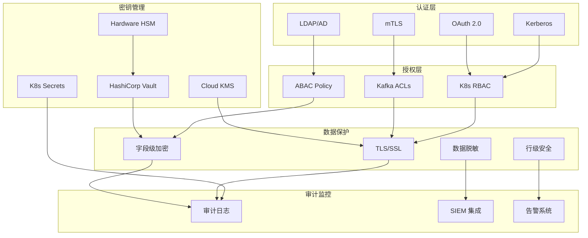
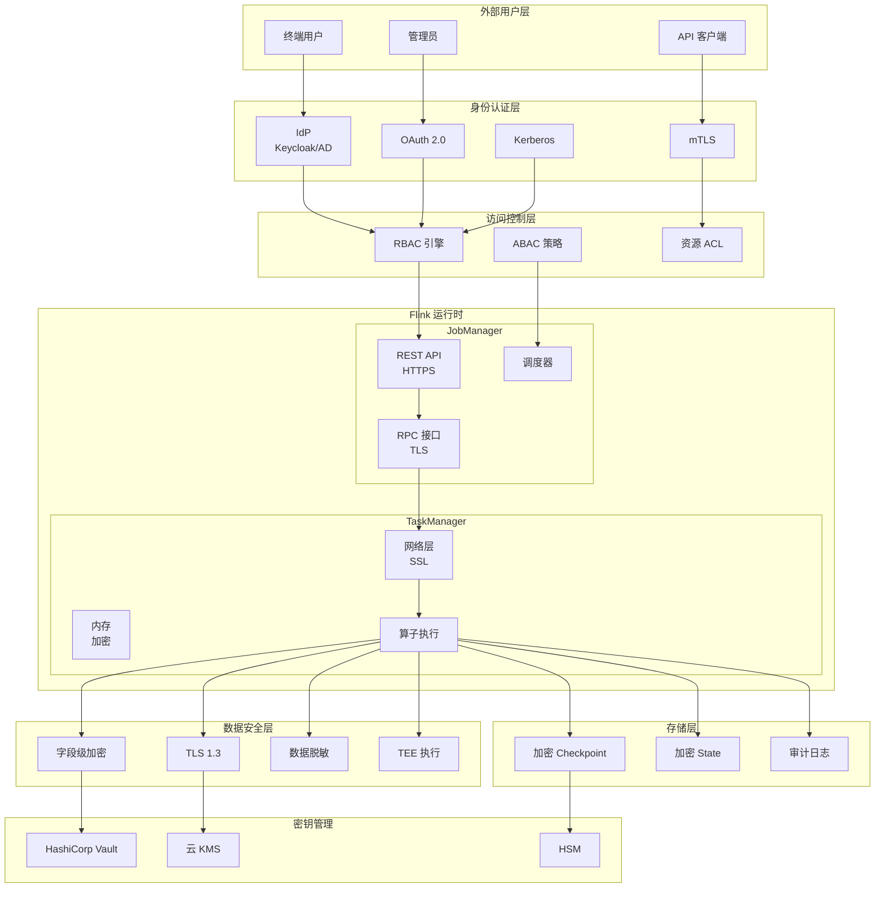
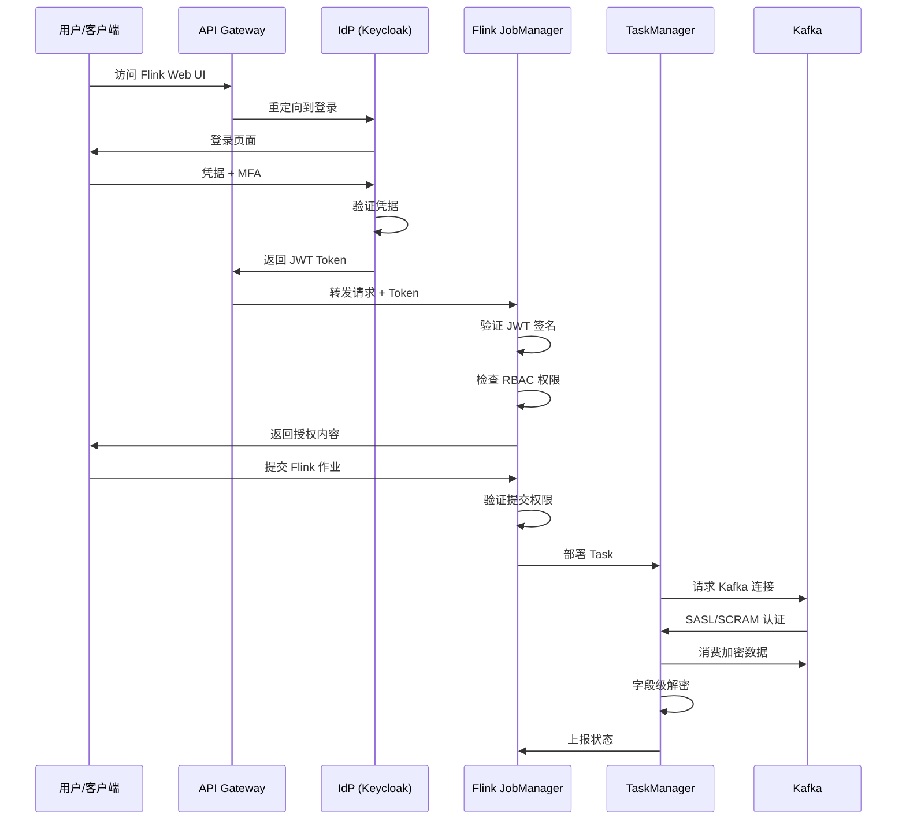
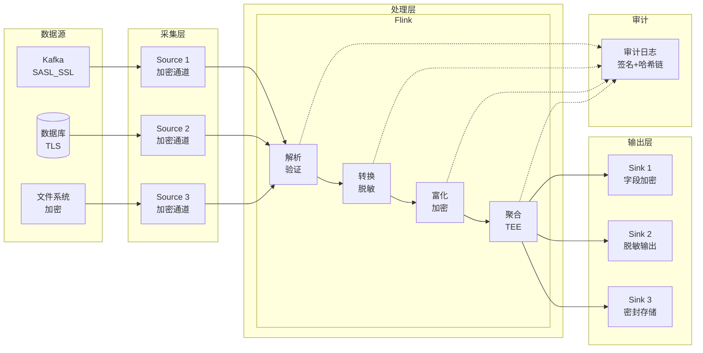
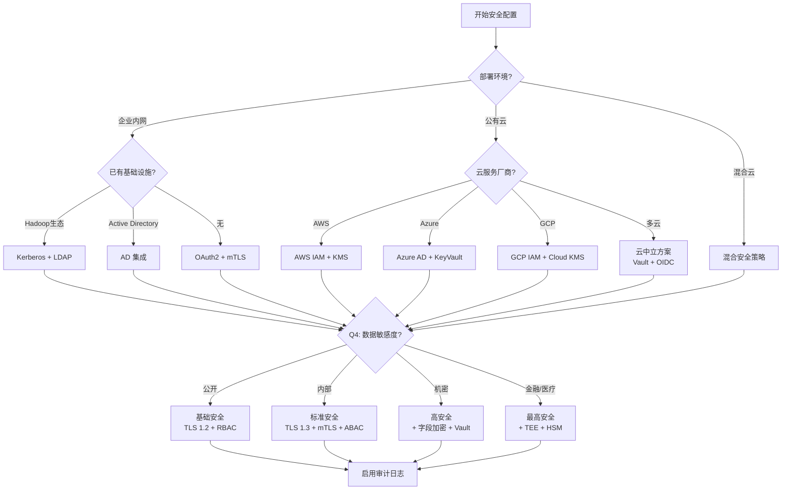
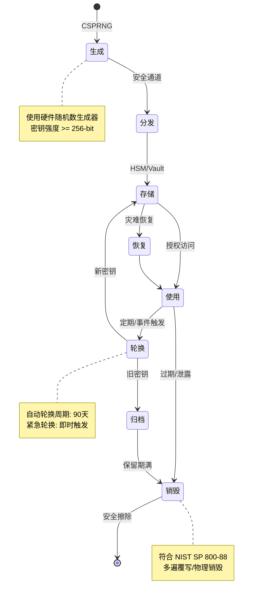
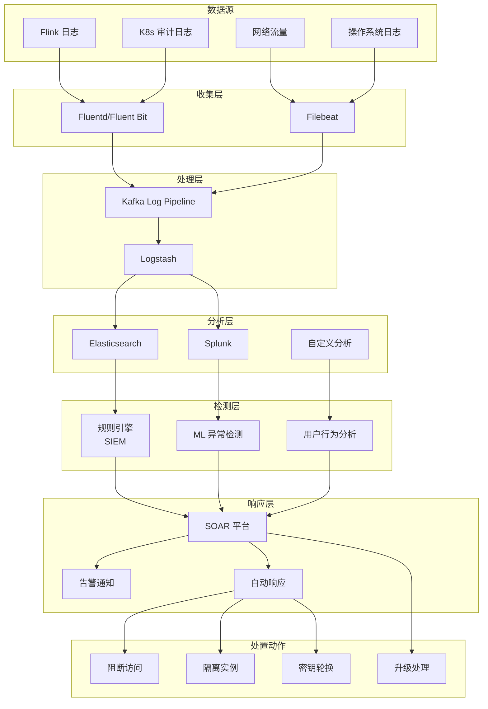

# Flink 安全特性完整指南

> **所属阶段**: Flink/Security | **前置依赖**: [Flink 安全特性](flink-security-complete-guide.md), [流处理安全最佳实践](./streaming-security-best-practices.md) | **形式化等级**: L3-L5

---

## 1. 概念定义 (Definitions)

### Def-F-13-14: Flink 安全模型 (Flink Security Model)

**形式化定义**:

Flink 安全模型是一个五元组，描述流计算系统的安全控制框架：

$$\mathcal{F}_{\text{security}} = (\mathcal{A}, \mathcal{Z}, \mathcal{D}, \mathcal{N}, \mathcal{K})$$

其中：

- $\mathcal{A}$: 认证机制集合 (Authentication Mechanisms)
- $\mathcal{Z}$: 授权策略集合 (Authorization Policies)
- $\mathcal{D}$: 数据保护机制 (Data Protection)
- $\mathcal{N}$: 网络安全控制 (Network Security)
- $\mathcal{K}$: 密钥管理系统 (Key Management)

**安全目标层次**:

```
┌─────────────────────────────────────────────────────────────┐
│  Level 5: 可信执行 (Trusted Execution)                        │
│           - Intel SGX/AMD SEV/ARM TrustZone                  │
├─────────────────────────────────────────────────────────────┤
│  Level 4: 应用层安全 (Application Security)                   │
│           - 数据脱敏、字段级加密、审计日志                     │
├─────────────────────────────────────────────────────────────┤
│  Level 3: 传输安全 (Transport Security)                       │
│           - TLS 1.3、mTLS、VPN                               │
├─────────────────────────────────────────────────────────────┤
│  Level 2: 访问控制 (Access Control)                           │
│           - RBAC、ABAC、ACL                                  │
├─────────────────────────────────────────────────────────────┤
│  Level 1: 身份认证 (Identity Authentication)                  │
│           - Kerberos、OAuth 2.0、LDAP                        │
├─────────────────────────────────────────────────────────────┤
│  Level 0: 基础设施安全 (Infrastructure Security)              │
│           - 硬件信任根、安全启动、固件完整性                   │
└─────────────────────────────────────────────────────────────┘
```

---

### Def-F-13-15: 认证机制 (Authentication Mechanisms)

**形式化定义**:

认证是验证主体身份的过程：

$$\text{Auth}: \text{Subject} \times \text{Credential} \rightarrow \{\text{Valid}, \text{Invalid}\}$$

**Flink 支持的认证机制**:

| 机制 | 协议 | 适用场景 | 安全等级 |
|------|------|---------|---------|
| Kerberos | GSS-API | 企业内网、Hadoop 生态 | 高 |
| OAuth 2.0 | RFC 6749 | 云原生、Web UI | 高 |
| OpenID Connect | OIDC Core | 单点登录 (SSO) | 高 |
| LDAP/AD | LDAP v3 | 企业目录集成 | 中-高 |
| mTLS | TLS 1.3 | 服务间通信 | 最高 |
| SASL/SCRAM | RFC 5802 | Kafka 集成 | 高 |
| 自定义 SPI | Java SPI | 特殊需求 | 可变 |

**认证强度分级**:

$$
\text{AuthStrength}(m) = \begin{cases}
L_1 & \text{if } m \in \{\text{Basic Auth}, \text{API Key}\} \\
L_2 & \text{if } m \in \{\text{LDAP}, \text{SASL/PLAIN}\} \\
L_3 & \text{if } m \in \{\text{Kerberos}, \text{OAuth 2.0}\} \\
L_4 & \text{if } m \in \{\text{mTLS}, \text{Hardware Token}\}
\end{cases}
$$

---

### Def-F-13-16: 授权模型 (Authorization Models)

**形式化定义**:

授权决定已认证主体可执行的操作：

$$\text{AuthZ}: \text{Subject} \times \text{Resource} \times \text{Action} \rightarrow \{\text{Permit}, \text{Deny}\}$$

#### RBAC (基于角色的访问控制)

$$\text{RBAC} = (U, R, P, UA, PA, RH)$$

- $U$: 用户集合
- $R$: 角色集合
- $P$: 权限集合
- $UA \subseteq U \times R$: 用户-角色分配
- $PA \subseteq P \times R$: 权限-角色分配
- $RH \subseteq R \times R$: 角色层次关系

**Flink RBAC 实现**:

```
角色层次结构:
┌─────────────────┐
│   flink-admin   │  ← 完整集群控制
└────────┬────────┘
         │
┌────────▼────────┐
│  flink-operator │  ← 部署/管理作业
└────────┬────────┘
         │
┌────────▼────────┐
│  flink-developer│  ← 提交/查看作业
└────────┬────────┘
         │
┌────────▼────────┐
│  flink-viewer   │  ← 只读访问
└─────────────────┘
```

#### ABAC (基于属性的访问控制)

$$\text{ABAC} = (S_{attr}, R_{attr}, E_{attr}, P_{policy})$$

- $S_{attr}$: 主体属性 (部门、职级、时间)
- $R_{attr}$: 资源属性 (敏感度、命名空间)
- $E_{attr}$: 环境属性 (IP、时间、设备)
- $P_{policy}$: 策略规则集合

**策略示例**:

```
PERMIT WHEN:
  subject.department == "finance"
  AND resource.sensitivity <= "confidential"
  AND environment.time BETWEEN "09:00" AND "18:00"
  AND environment.location IN "corporate_network"
```

---

### Def-F-13-17: 数据安全控制 (Data Security Controls)

**形式化定义**:

数据安全控制保护数据在三种状态下的机密性和完整性：

$$\text{DataSecurity} = (C_{rest}, C_{transit}, C_{use})$$

| 状态 | 威胁 | 控制措施 |
|------|------|---------|
| $C_{rest}$ (静态) | 存储介质窃取 | 加密、访问控制 |
| $C_{transit}$ (传输) | 网络嗅探 | TLS/mTLS、VPN |
| $C_{use}$ (使用中) | 内存转储 | TEE、内存加密 |

**加密算法选择矩阵**:

| 场景 | 推荐算法 | 密钥长度 | 模式 |
|------|---------|---------|------|
| 数据传输 | AES | 256-bit | GCM |
| Checkpoint 加密 | AES | 256-bit | GCM |
| State Backend | AES | 256-bit | CTR |
| 字段级加密 | AES/FPE | 256-bit | CBC/FF1 |
| 密钥封装 | RSA/ECIES | 3072-bit/256-bit | OAEP |

---

### Def-F-13-18: 可信执行环境 (TEE)

**形式化定义** (扩展 Def-F-13-04):

TEE 是提供以下保证的隔离执行环境：

$$\text{TEE} \models \text{Confidentiality} \land \text{Integrity} \land \text{Attestability}$$

**TEE 技术对比**:

| 技术 | 隔离粒度 | 内存限制 | 云厂商支持 | 状态 |
|------|---------|---------|-----------|------|
| Intel SGX | 进程级 | 128MB-1GB EPC | Azure, IBM | 已弃用 |
| Intel TDX | VM级 | 无限制 | Azure, AWS | 活跃 |
| AMD SEV-SNP | VM级 | 无限制 | Azure, AWS, GCP | 活跃 |
| ARM TrustZone | 双世界 | 受限制 | 移动/IoT | 活跃 |
| AWS Nitro Enclaves | 进程级 | 实例限制 | AWS | 活跃 |

---

### Def-F-13-19: 密钥管理生命周期 (Key Management Lifecycle)

**形式化定义**:

密钥管理包含以下阶段：

$$\text{KeyLifecycle} = (G, D, S, R, A, U, E)$$

- $G$: 生成 (Generation) - 使用 CSPRNG
- $D$: 分发 (Distribution) - 安全通道传输
- $S$: 存储 (Storage) - HSM/Key Vault
- $R$: 轮换 (Rotation) - 定期/事件触发
- $A$: 归档 (Archival) - 备份与恢复
- $U$: 使用 (Usage) - 访问控制与审计
- $E$: 销毁 (Erasure) - 安全删除

**密钥分级**:

```
┌─────────────────────────────────────────────────────────────┐
│  L0: 根密钥 (Root Key) - HSM 保护,永不离开硬件              │
├─────────────────────────────────────────────────────────────┤
│  L1: 密钥加密密钥 (KEK) - 用于加密其他密钥                   │
├─────────────────────────────────────────────────────────────┤
│  L2: 数据加密密钥 (DEK) - 用于加密实际数据                   │
├─────────────────────────────────────────────────────────────┤
│  L3: 会话密钥 (Session Key) - 临时使用,用完即弃             │
└─────────────────────────────────────────────────────────────┘
```

---

## 2. 属性推导 (Properties)

### Prop-F-13-07: 最小权限传递性

**命题**: 若 Flink 组件 $C_1$ 以权限 $P_1$ 访问资源 $R_1$，且 $C_2$ 以权限 $P_2$ 处理 $C_1$ 的输出，则组合组件的有效权限为 $P_1 \cap P_2$。

**证明**:

设 $Access(c, r)$ 表示组件 $c$ 对资源 $r$ 的访问能力。

1. 由假设: $Access(C_1, R_1) = P_1$
2. $C_2$ 只能通过 $C_1$ 的输出访问 $R_1$
3. 因此: $Access(C_2, R_1) = P_1 \cap P_2$
4. 若 $P_1$ 和 $P_2$ 均为最小权限，则交集亦为最小权限 $\square$

### Prop-F-13-08: 纵深防御完备性

**命题**: 若系统在每个安全层次都部署独立控制措施，则整体安全性满足：

$$\text{Security}_{\text{total}} = 1 - \prod_{i=1}^{n}(1 - p_i)$$

其中 $p_i$ 为第 $i$ 层控制措施的有效性。

**推导示例**:

| 层次 | 控制措施 | 有效性 $p_i$ |
|------|---------|-------------|
| 网络层 | 防火墙 | 0.90 |
| 传输层 | TLS 1.3 | 0.95 |
| 应用层 | 字段级加密 | 0.99 |
| 物理层 | 磁盘加密 | 0.95 |

$$\text{Security}_{\text{total}} = 1 - (0.1 \times 0.05 \times 0.01 \times 0.05) = 0.9999975$$

### Lemma-F-13-03: 加密性能开销上界

**引理**: 启用 AES-GCM-256 加密对 Flink 流处理吞吐量的影响存在上界：

$$\text{Throughput}_{\text{encrypted}} \geq \frac{\text{Throughput}_{\text{plaintext}}}{1 + \alpha \cdot \frac{L_{\text{data}}}{B_{\text{cpu}}}}$$

其中：

- $\alpha$: 加密系数 (~1.1 for AES-GCM)
- $L_{\text{data}}$: 数据长度
- $B_{\text{cpu}}$: CPU 加密带宽 (~10 GB/s)

**工程意义**: 对于典型流处理数据大小 (< 10KB)，加密开销 < 3%。

### Lemma-F-13-04: 审计日志完整性

**引理**: 审计日志系统满足不可抵赖性当且仅当满足以下条件：

1. **身份绑定**: $\forall e \in \text{Events}, \text{Signer}(e) = \text{Subject}(e)$
2. **时序完整**: $\forall e_1, e_2, e_1 \prec e_2 \Rightarrow \text{Timestamp}(e_1) < \text{Timestamp}(e_2)$
3. **防篡改**: $\forall l \in \text{Logs}, \text{Verify}(l, \text{HashChain}) = \text{Valid}$

---

## 3. 关系建立 (Relations)

### 3.1 安全机制与合规框架映射

| 安全机制 | GDPR | HIPAA | SOC2 | PCI-DSS |
|---------|:----:|:-----:|:----:|:-------:|
| 数据加密 (传输) | Art.32 | §164.312 | CC6.1 | Req.4.1 |
| 数据加密 (静态) | Art.32 | §164.312 | CC6.1 | Req.3.4 |
| 访问控制 | Art.25 | §164.308 | CC6.2 | Req.7.1 |
| 审计日志 | Art.30 | §164.312 | CC7.2 | Req.10.2 |
| 密钥管理 | Art.32 | §164.314 | CC6.6 | Req.3.5 |
| 数据脱敏 | Art.25 | §164.514 | CC6.3 | Req.3.3 |

### 3.2 Flink 安全组件依赖关系



### 3.3 TEE 技术与 Flink 安全需求映射

| Flink 安全需求 | TEE 解决方案 | 实现方式 |
|---------------|-------------|---------|
| 数据在使用中保护 | CPU/GPU TEE | Enclave 内存加密 |
| 密钥不可提取 | 密封存储 | 飞地绑定密钥 |
| 算子完整性验证 | 远程证明 | MRENCLAVE 校验 |
| 抗特权攻击者 | VM级隔离 | SEV-SNP/TDX |
| 安全审计日志 | 飞地内签名 | 防篡改日志条目 |

---

## 4. 论证过程 (Argumentation)

### 4.1 认证机制选择论证

**决策矩阵**:

| 因素 | Kerberos | OAuth 2.0 | LDAP | mTLS | 权重 |
|------|:--------:|:---------:|:----:|:----:|:----:|
| 企业集成 | ★★★★★ | ★★★☆☆ | ★★★★★ | ★★☆☆☆ | 0.25 |
| 云原生支持 | ★★☆☆☆ | ★★★★★ | ★★☆☆☆ | ★★★★☆ | 0.20 |
| 无密码支持 | ★★★★☆ | ★★★★★ | ★★☆☆☆ | ★★★★★ | 0.15 |
| 实施复杂度 | ★★★☆☆ | ★★★★☆ | ★★★★★ | ★★☆☆☆ | 0.20 |
| 安全强度 | ★★★★★ | ★★★★☆ | ★★★☆☆ | ★★★★★ | 0.20 |

**推荐组合**:

- **企业内网**: Kerberos + LDAP
- **云原生部署**: OAuth 2.0 + mTLS
- **混合环境**: OAuth 2.0 + Kerberos (通过身份桥接)

### 4.2 授权模型对比分析

| 维度 | RBAC | ABAC | ACL |
|------|------|------|-----|
| 复杂度 | 低 | 高 | 中 |
| 灵活性 | 中 | 高 | 低 |
| 性能 | 高 | 中 | 高 |
| 审计性 | 好 | 中 | 好 |
| 适用规模 | 中小 | 大型 | 小型 |

**混合策略推荐**:

```
默认策略: RBAC (快速决策)
例外处理: ABAC (细粒度控制)
资源级: ACL (特定资源保护)
```

### 4.3 数据脱敏策略论证

**威胁场景**: 内部分析师访问生产数据

**脱敏策略对比**:

| 策略 | 数据可用性 | 隐私保护 | 实现复杂度 |
|------|-----------|---------|-----------|
| 全量掩码 | 低 | 最高 | 低 |
| 部分掩码 | 中 | 高 | 中 |
| 动态脱敏 | 高 | 中 | 高 |
| 差分隐私 | 中 | 高 | 高 |
| 令牌化 | 高 | 最高 | 高 |

**推荐**: 根据数据敏感度分级采用不同策略

---

## 5. 形式证明 / 工程论证 (Proof / Engineering Argument)

### Thm-F-13-03: Flink 安全配置完备性定理

**定理**: 若 Flink 集群满足以下全部条件，则达到生产级安全标准：

1. **认证完备性**:
   $$\forall c \in \text{Components}, \exists a \in \mathcal{A}: \text{Authenticated}(c, a)$$

2. **授权最小化**:
   $$\forall r \in \text{Roles}, \text{Permissions}(r) = \text{Permissions}_{\min}(r)$$

3. **传输加密**:
   $$\forall e \in \text{Edges}, \text{Encrypted}(e, \text{TLS1.3})$$

4. **数据保护**:
   $$\forall d \in \text{SensitiveData}, \text{Protected}(d)$$

5. **审计完整**:
   $$\forall a \in \text{Actions}, \text{Logged}(a) \land \text{Immutable}(\text{Log}(a))$$

6. **密钥安全**:
   $$\forall k \in \text{Keys}, \text{Stored}(k, \text{HSM}) \lor \text{Wrapped}(k)$$

**工程论证**: 每个条件对应可验证的技术实现，形成完整的安全闭环。

### Thm-F-13-04: 零信任架构正确性

**定理**: 在零信任架构下，Flink 系统满足：

$$\text{NeverTrust} \land \text{AlwaysVerify} \land \text{LeastPrivilege}$$

**证明要点**:

1. **永不信任**:
   - 所有通信通过 mTLS 认证
   - 每次请求验证令牌
   - 内部网络假设不可信

2. **始终验证**:
   - 设备证明 (Device Attestation)
   - 用户 MFA
   - 行为异常检测

3. **最小权限**:
   - 细粒度 RBAC
   - 临时凭证
   - 权限自动回收

### 5.3 合规性论证

**GDPR 合规论证**:

| 要求 | 技术实现 | 验证方式 |
|------|---------|---------|
| 数据加密 (Art.32) | AES-256-GCM | 加密算法审计 |
| 访问控制 (Art.25) | RBAC + ABAC | 权限矩阵审查 |
| 数据脱敏 (Art.32) | 动态脱敏 | 输出验证 |
| 审计日志 (Art.30) | 集中日志 + 签名 | 日志完整性检查 |
| 删除权 (Art.17) | 数据分类标签 | 删除工作流测试 |

---

## 6. 实例验证 (Examples)

### 6.1 Kerberos 认证配置

**场景**: 企业 Hadoop 生态集成

```yaml
# flink-conf.yaml
# Kerberos 认证配置 security.kerberos.login.use-ticket-cache: false
security.kerberos.login.keytab: /etc/flink/flink.keytab
security.kerberos.login.principal: flink/_HOST@EXAMPLE.COM

# Kafka 集成 Kerberos security.kerberos.krb5-conf.path: /etc/krb5.conf

# ZooKeeper Kerberos zookeeper.sasl.service-name: zookeeper
zookeeper.sasl.login-context-name: Client
```

```java
// 代码中使用 Kerberos 认证
import org.apache.flink.streaming.connectors.kafka.FlinkKafkaConsumer;
import org.apache.flink.api.common.serialization.SimpleStringSchema;

Properties props = new Properties();
props.setProperty("bootstrap.servers", "kafka:9092");
props.setProperty("security.protocol", "SASL_PLAINTEXT");
props.setProperty("sasl.mechanism", "GSSAPI");
props.setProperty("sasl.kerberos.service.name", "kafka");

FlinkKafkaConsumer<String> consumer = new FlinkKafkaConsumer<>(
    "input-topic",
    new SimpleStringSchema(),
    props
);
```

### 6.2 OAuth 2.0 / OpenID Connect 配置

**场景**: 云原生部署，Web UI 安全

```yaml
# flink-conf.yaml
# OAuth 2.0 配置 security.authentication.type: oauth2
security.authentication.oauth2.client-id: flink-client
security.authentication.oauth2.client-secret: ${OAUTH_CLIENT_SECRET}
security.authentication.oauth2.token-endpoint: https://auth.example.com/oauth2/token
security.authentication.oauth2.authorization-endpoint: https://auth.example.com/oauth2/authorize
security.authentication.oauth2.userinfo-endpoint: https://auth.example.com/oauth2/userinfo
security.authentication.oauth2.scopes: openid,profile,email,flink:read,flink:write

# OIDC 配置 security.authentication.oidc.issuer: https://auth.example.com
security.authentication.oidc.jwks-endpoint: https://auth.example.com/.well-known/jwks.json
```

```yaml
# Kubernetes Ingress + OAuth2 Proxy apiVersion: networking.k8s.io/v1
kind: Ingress
metadata: 
  name: flink-oauth-ingress
  annotations: 
    nginx.ingress.kubernetes.io/auth-url: "https://oauth2-proxy.example.com/oauth2/auth"
    nginx.ingress.kubernetes.io/auth-signin: "https://oauth2-proxy.example.com/oauth2/start?rd=$escaped_request_uri"
spec: 
  rules: 
  - host: flink.example.com
    http: 
      paths: 
      - path: /
        pathType: Prefix
        backend: 
          service: 
            name: flink-jobmanager
            port: 
              number: 8081
```

### 6.3 RBAC 完整配置示例

```yaml
# flink-rbac-complete.yaml
# Namespace 级别权限
---
apiVersion: v1
kind: Namespace
metadata: 
  name: flink-production
  labels: 
    environment: production
    security-tier: high
---
# ServiceAccount apiVersion: v1
kind: ServiceAccount
metadata: 
  name: flink-job-operator
  namespace: flink-production
automountServiceAccountToken: false
---
# Role - 最小权限 apiVersion: rbac.authorization.k8s.io/v1
kind: Role
metadata: 
  name: flink-job-role
  namespace: flink-production
rules: 
# Flink 部署资源
- apiGroups: ["flink.apache.org"]
  resources: ["flinkdeployments", "flinksessionjobs"]
  verbs: ["get", "list", "watch", "create", "update", "patch"]
  # 显式禁止删除
# 计算资源
- apiGroups: ["apps"]
  resources: ["deployments", "statefulsets"]
  verbs: ["get", "list", "watch", "create", "update"]
# 网络资源
- apiGroups: [""]
  resources: ["services", "configmaps"]
  verbs: ["get", "list", "watch", "create", "update"]
# Pod 资源
- apiGroups: [""]
  resources: ["pods"]
  verbs: ["get", "list", "watch"]
# 事件查看
- apiGroups: [""]
  resources: ["events"]
  verbs: ["get", "list", "watch"]
# 显式排除 Secrets
# - apiGroups: [""]
#   resources: ["secrets"]
#   verbs: ["*"]
---
# RoleBinding apiVersion: rbac.authorization.k8s.io/v1
kind: RoleBinding
metadata: 
  name: flink-job-binding
  namespace: flink-production
subjects: 
- kind: ServiceAccount
  name: flink-job-operator
  namespace: flink-production
roleRef: 
  kind: Role
  name: flink-job-role
  apiGroup: rbac.authorization.k8s.io
---
# ClusterRole - 用于跨命名空间资源(如节点信息)
apiVersion: rbac.authorization.k8s.io/v1
kind: ClusterRole
metadata: 
  name: flink-node-reader
rules: 
- apiGroups: [""]
  resources: ["nodes"]
  verbs: ["get", "list", "watch"]
---
# ClusterRoleBinding apiVersion: rbac.authorization.k8s.io/v1
kind: ClusterRoleBinding
metadata: 
  name: flink-node-reader-binding
subjects: 
- kind: ServiceAccount
  name: flink-job-operator
  namespace: flink-production
roleRef: 
  kind: ClusterRole
  name: flink-node-reader
  apiGroup: rbac.authorization.k8s.io
```

### 6.4 TLS/mTLS 完整配置

```yaml
# flink-tls-complete.yaml
# Flink TLS 1.3 内部通信配置 security.ssl.internal.enabled: true
security.ssl.internal.keystore: /opt/flink/ssl/internal.keystore.p12
security.ssl.internal.keystore-password: ${INTERNAL_KEYSTORE_PASSWORD}
security.ssl.internal.key-password: ${INTERNAL_KEY_PASSWORD}
security.ssl.internal.truststore: /opt/flink/ssl/internal.truststore.p12
security.ssl.internal.truststore-password: ${INTERNAL_TRUSTSTORE_PASSWORD}
security.ssl.internal.protocol: TLSv1.3
security.ssl.internal.algorithms: TLS_AES_256_GCM_SHA384:TLS_AES_128_GCM_SHA256

# REST API HTTPS security.ssl.rest.enabled: true
security.ssl.rest.keystore: /opt/flink/ssl/rest.keystore.p12
security.ssl.rest.keystore-password: ${REST_KEYSTORE_PASSWORD}
security.ssl.rest.truststore: /opt/flink/ssl/rest.truststore.p12
security.ssl.rest.truststore-password: ${REST_TRUSTSTORE_PASSWORD}
security.ssl.rest.protocol: TLSv1.3

# 客户端认证 (mTLS)
security.ssl.rest.client-auth: REQUIRE

# 算法配置 security.ssl.algorithms: TLS_AES_256_GCM_SHA384,TLS_AES_128_GCM_SHA256,ECDHE_RSA_WITH_AES_256_GCM_SHA384
security.ssl.protocol: TLSv1.3

# 证书轮换 security.ssl.certificate.update-interval: 24h
```

```bash
# 生成自签名证书(测试环境)
#!/bin/bash
set -e

FLINK_SSL_DIR="/opt/flink/ssl"
mkdir -p $FLINK_SSL_DIR

# 生成 CA 私钥和证书 openssl genrsa -out $FLINK_SSL_DIR/ca.key 4096
openssl req -x509 -new -nodes -key $FLINK_SSL_DIR/ca.key \
    -sha256 -days 365 -out $FLINK_SSL_DIR/ca.crt \
    -subj "/CN=Flink-Internal-CA/O=Example-Org"

# 生成内部通信证书 for component in jobmanager taskmanager; do
    openssl genrsa -out $FLINK_SSL_DIR/${component}.key 2048
    openssl req -new -key $FLINK_SSL_DIR/${component}.key \
        -out $FLINK_SSL_DIR/${component}.csr \
        -subj "/CN=flink-${component}/O=Example-Org"

    openssl x509 -req -in $FLINK_SSL_DIR/${component}.csr \
        -CA $FLINK_SSL_DIR/ca.crt -CAkey $FLINK_SSL_DIR/ca.key \
        -CAcreateserial -out $FLINK_SSL_DIR/${component}.crt \
        -days 90 -sha256

    # 转换为 PKCS12
    openssl pkcs12 -export \
        -in $FLINK_SSL_DIR/${component}.crt \
        -inkey $FLINK_SSL_DIR/${component}.key \
        -certfile $FLINK_SSL_DIR/ca.crt \
        -out $FLINK_SSL_DIR/${component}.keystore.p12 \
        -name flink-${component} \
        -password pass:${INTERNAL_KEYSTORE_PASSWORD}
done

# 生成 Truststore keytool -import -v -trustcacerts \
    -alias flink-ca \
    -file $FLINK_SSL_DIR/ca.crt \
    -keystore $FLINK_SSL_DIR/internal.truststore.p12 \
    -storepass ${INTERNAL_TRUSTSTORE_PASSWORD} -noprompt
```

### 6.5 字段级加密实现

```java
// FieldLevelEncryption.java
import org.apache.flink.api.common.functions.RichMapFunction;
import org.apache.flink.configuration.Configuration;
import javax.crypto.Cipher;
import javax.crypto.spec.GCMParameterSpec;
import javax.crypto.spec.SecretKeySpec;
import java.security.SecureRandom;
import java.util.Base64;

/**
 * Flink 字段级加密算子
 * 支持 AES-256-GCM 加密敏感字段
 */
public class FieldLevelEncryption extends RichMapFunction<Transaction, EncryptedTransaction> {

    private static final String ALGORITHM = "AES/GCM/NoPadding";
    private static final int GCM_IV_LENGTH = 12;
    private static final int GCM_TAG_LENGTH = 128;

    private transient Cipher cipher;
    private transient SecureRandom random;
    private SecretKeySpec keySpec;

    @Override
    public void open(Configuration parameters) throws Exception {
        // 从安全存储获取密钥 (实际使用应通过 KMS)
        byte[] key = loadKeyFromVault();
        keySpec = new SecretKeySpec(key, "AES");
        cipher = Cipher.getInstance(ALGORITHM);
        random = new SecureRandom();
    }

    @Override
    public EncryptedTransaction map(Transaction tx) throws Exception {
        EncryptedTransaction encrypted = new EncryptedTransaction();
        encrypted.setTransactionId(tx.getTransactionId());

        // 加密敏感字段
        encrypted.setEncryptedCardNumber(encrypt(tx.getCardNumber()));
        encrypted.setEncryptedAccountId(encrypt(tx.getAccountId()));

        // 非敏感字段明文存储
        encrypted.setAmount(tx.getAmount());
        encrypted.setTimestamp(tx.getTimestamp());
        encrypted.setMerchantId(tx.getMerchantId());

        return encrypted;
    }

    private String encrypt(String plaintext) throws Exception {
        byte[] iv = new byte[GCM_IV_LENGTH];
        random.nextBytes(iv);

        GCMParameterSpec spec = new GCMParameterSpec(GCM_TAG_LENGTH, iv);
        cipher.init(Cipher.ENCRYPT_MODE, keySpec, spec);

        byte[] ciphertext = cipher.doFinal(plaintext.getBytes());

        // 组合 IV + Ciphertext
        byte[] result = new byte[GCM_IV_LENGTH + ciphertext.length];
        System.arraycopy(iv, 0, result, 0, GCM_IV_LENGTH);
        System.arraycopy(ciphertext, 0, result, GCM_IV_LENGTH, ciphertext.length);

        return Base64.getEncoder().encodeToString(result);
    }

    private byte[] loadKeyFromVault() {
        // 从 HashiCorp Vault 或云 KMS 获取密钥
        // 实际实现使用 Vault SDK
        return VaultClient.getKey("flink/field-encryption");
    }
}
```

### 6.6 数据脱敏实现

```java
// DataMasking.java
import org.apache.flink.api.common.functions.RichMapFunction;

/**
 * Flink 数据脱敏算子
 * 支持多种脱敏策略
 */
public class DataMasking extends RichMapFunction<Customer, MaskedCustomer> {

    public enum MaskingStrategy {
        FULL,           // ****
        PARTIAL,        // ****5678
        EMAIL,          // j***@example.com
        PHONE,          // 138****8888
        NAME,           // 张**
        HASH,           // SHA-256
        TOKENIZE        // 令牌化
    }

    @Override
    public MaskedCustomer map(Customer customer) throws Exception {
        MaskedCustomer masked = new MaskedCustomer();
        masked.setId(customer.getId());

        // 根据字段敏感度选择策略
        masked.setEmail(maskEmail(customer.getEmail()));
        masked.setPhone(maskPhone(customer.getPhone()));
        masked.setName(maskName(customer.getName()));
        masked.setSsn(maskFull(customer.getSsn()));
        masked.setCreditCard(maskPartial(customer.getCreditCard(), 4));

        // 地址保留部分信息
        masked.setCity(customer.getAddress().getCity());
        masked.setZipCode(customer.getAddress().getZipCode());
        masked.setStreet(maskFull(customer.getAddress().getStreet()));

        return masked;
    }

    private String maskEmail(String email) {
        if (email == null || !email.contains("@")) return email;
        String[] parts = email.split("@");
        String local = parts[0];
        String domain = parts[1];

        if (local.length() <= 2) {
            return "*@" + domain;
        }
        return local.charAt(0) + "***@" + domain;
    }

    private String maskPhone(String phone) {
        if (phone == null || phone.length() < 7) return phone;
        return phone.substring(0, 3) + "****" + phone.substring(phone.length() - 4);
    }

    private String maskName(String name) {
        if (name == null || name.length() <= 1) return name;
        return name.charAt(0) + "*".repeat(name.length() - 1);
    }

    private String maskFull(String data) {
        if (data == null) return null;
        return "*".repeat(data.length());
    }

    private String maskPartial(String data, int visibleEnd) {
        if (data == null || data.length() <= visibleEnd) return maskFull(data);
        return "*".repeat(data.length() - visibleEnd) +
               data.substring(data.length() - visibleEnd);
    }
}
```

### 6.7 HashiCorp Vault 集成

```java
// VaultIntegration.java
import com.bettercloud.vault.Vault;
import com.bettercloud.vault.VaultConfig;
import com.bettercloud.vault.response.LogicalResponse;
import org.apache.flink.api.common.functions.RichFunction;
import org.apache.flink.configuration.Configuration;

/**
 * Flink HashiCorp Vault 集成
 * 支持动态密钥、自动轮换
 */
public class VaultIntegration {

    private static final String VAULT_ADDR = "https://vault.example.com:8200";
    private static final String VAULT_ROLE = "flink-job-role";

    public static class VaultKeyProvider implements RichFunction {
        private transient Vault vault;
        private String currentKey;
        private long keyExpiry;

        @Override
        public void open(Configuration parameters) throws Exception {
            // 使用 Kubernetes 认证
            String jwt = readServiceAccountToken();

            VaultConfig config = new VaultConfig()
                .address(VAULT_ADDR)
                .build();

            vault = new Vault(config);

            // 登录 Vault
            LogicalResponse auth = vault.auth()
                .loginByKubernetes(VAULT_ROLE, jwt);

            // 获取初始密钥
            rotateKey();
        }

        public synchronized String getKey(String path) throws Exception {
            // 检查密钥是否过期
            if (System.currentTimeMillis() > keyExpiry) {
                rotateKey();
            }

            LogicalResponse response = vault.logical()
                .read("secret/data/flink/" + path);

            return response.getData().get("key").toString();
        }

        private void rotateKey() throws Exception {
            // 获取新密钥和租约
            LogicalResponse response = vault.logical()
                .read("secret/data/flink/current-key");

            currentKey = response.getData().get("key").toString();

            // 设置过期时间(租约期的 80%)
            Integer leaseDuration = (Integer) response.getData().get("lease_duration");
            keyExpiry = System.currentTimeMillis() + (leaseDuration * 800);

            // 设置自动续期
            setupAutoRenewal();
        }

        private void setupAutoRenewal() {
            // 实现租约续期逻辑
        }

        private String readServiceAccountToken() throws Exception {
            return java.nio.file.Files.readString(
                java.nio.file.Path.of("/var/run/secrets/kubernetes.io/serviceaccount/token")
            );
        }
    }
}
```

### 6.8 审计日志配置

```java
// FlinkAuditLogger.java
import org.apache.flink.api.common.functions.RichMapFunction;
import org.apache.flink.configuration.Configuration;
import org.slf4j.Logger;
import org.slf4j.LoggerFactory;
import java.time.Instant;
import java.util.UUID;

/**
 * Flink 审计日志组件
 * 记录所有数据访问和处理操作
 */
public class FlinkAuditLogger {

    private static final Logger AUDIT_LOG = LoggerFactory.getLogger("FLINK_AUDIT");

    public static class AuditedOperator<T, R> extends RichMapFunction<T, R> {
        private final RichMapFunction<T, R> wrapped;
        private final String operationType;
        private final String dataClassification;
        private String operatorId;
        private String jobId;

        public AuditedOperator(RichMapFunction<T, R> wrapped,
                               String operationType,
                               String dataClassification) {
            this.wrapped = wrapped;
            this.operationType = operationType;
            this.dataClassification = dataClassification;
        }

        @Override
        public void open(Configuration parameters) throws Exception {
            super.open(parameters);
            wrapped.open(parameters);

            this.operatorId = getRuntimeContext().getIndexOfThisSubtask() + "";
            this.jobId = getRuntimeContext().getJobID().toString();
        }

        @Override
        public R map(T value) throws Exception {
            String traceId = UUID.randomUUID().toString();
            long startTime = System.currentTimeMillis();

            // 记录输入
            logAuditEvent(AuditEventType.INPUT, traceId, value, null);

            try {
                R result = wrapped.map(value);

                // 记录成功输出
                logAuditEvent(AuditEventType.OUTPUT, traceId, value, result);

                return result;
            } catch (Exception e) {
                // 记录失败
                logAuditEvent(AuditEventType.ERROR, traceId, value, e.getMessage());
                throw e;
            }
        }

        private void logAuditEvent(AuditEventType type, String traceId,
                                   Object input, Object output) {
            AuditEvent event = new AuditEvent()
                .setTimestamp(Instant.now())
                .setTraceId(traceId)
                .setJobId(jobId)
                .setOperatorId(operatorId)
                .setOperationType(operationType)
                .setEventType(type)
                .setDataClassification(dataClassification)
                .setInputHash(hashInput(input))
                .setOutputHash(output != null ? hashInput(output) : null)
                .setUserIdentity(getCurrentUser())
                .setSourceIp(getSourceIp());

            AUDIT_LOG.info(event.toJSON());
        }

        private String hashInput(Object input) {
            // 计算输入数据的哈希值(用于完整性验证)
            return Integer.toHexString(input.hashCode());
        }

        private String getCurrentUser() {
            // 从安全上下文获取当前用户
            return System.getenv("FLINK_USER");
        }

        private String getSourceIp() {
            // 获取源 IP
            return getRuntimeContext().getTaskName();
        }
    }

    enum AuditEventType {
        INPUT, OUTPUT, ERROR, ACCESS
    }
}
```

### 6.9 网络策略配置

```yaml
# flink-network-policies.yaml
# 完整的 Flink 网络安全策略

# JobManager 网络策略 apiVersion: networking.k8s.io/v1
kind: NetworkPolicy
metadata: 
  name: flink-jobmanager-policy
  namespace: flink-production
spec: 
  podSelector: 
    matchLabels: 
      app: flink-jobmanager
      component: jobmanager
  policyTypes: 
  - Ingress
  - Egress
  ingress: 
  # Web UI 访问
  - from:
    - namespaceSelector:
        matchLabels: 
          name: ingress-nginx
    ports: 
    - protocol: TCP
      port: 8081
  # TaskManager 连接
  - from:
    - podSelector:
        matchLabels: 
          app: flink-taskmanager
    ports: 
    - protocol: TCP
      port: 6123
    - protocol: TCP
      port: 6124
  # Blob Server
  - from:
    - podSelector:
        matchLabels: 
          app: flink-taskmanager
    ports: 
    - protocol: TCP
      port: 6125
  egress: 
  # DNS
  - to:
    - namespaceSelector: {}
    ports: 
    - protocol: UDP
      port: 53
  # Kafka 访问
  - to:
    - podSelector:
        matchLabels: 
          app: kafka
    ports: 
    - protocol: TCP
      port: 9093
  # ZooKeeper
  - to:
    - podSelector:
        matchLabels: 
          app: zookeeper
    ports: 
    - protocol: TCP
      port: 2181
---
# TaskManager 网络策略 apiVersion: networking.k8s.io/v1
kind: NetworkPolicy
metadata: 
  name: flink-taskmanager-policy
  namespace: flink-production
spec: 
  podSelector: 
    matchLabels: 
      app: flink-taskmanager
      component: taskmanager
  policyTypes: 
  - Ingress
  - Egress
  ingress: 
  # 仅允许 JobManager 连接
  - from:
    - podSelector:
        matchLabels: 
          app: flink-jobmanager
  egress: 
  # JobManager
  - to:
    - podSelector:
        matchLabels: 
          app: flink-jobmanager
    ports: 
    - protocol: TCP
      port: 6123
  # Kafka
  - to:
    - podSelector:
        matchLabels: 
          app: kafka
    ports: 
    - protocol: TCP
      port: 9093
  # DNS
  - to:
    - namespaceSelector: {}
    ports: 
    - protocol: UDP
      port: 53
---
# 默认拒绝策略 apiVersion: networking.k8s.io/v1
kind: NetworkPolicy
metadata: 
  name: default-deny-all
  namespace: flink-production
spec: 
  podSelector: {}
  policyTypes: 
  - Ingress
  - Egress
```

### 6.10 完整安全配置清单

```yaml
# production-security-profile.yaml
# 生产环境安全配置清单

security_profile: 
  name: "flink-production-high-security"
  version: "1.0.0"
  compliance_requirements: 
    - SOC2
    - ISO27001
    - GDPR

authentication: 
  primary: "OAuth2/OIDC"
  secondary: "mTLS"
  kerberos: 
    enabled: true
    keytab_rotation: "30d"
    service_principals: 
      - flink/_HOST@EXAMPLE.COM
      - HTTP/_HOST@EXAMPLE.COM
  oauth2: 
    provider: "Keycloak"
    client_id: "flink-production"
    scopes: ["openid", "profile", "flink:admin"]
    pkce_enabled: true
  mTLS: 
    enabled: true
    client_auth: "REQUIRED"
    certificate_validity: "90d"
    auto_rotation: true

authorization: 
  model: "RBAC+ABAC"
  rbac: 
    strict_mode: true
    regular_audit: "monthly"
  abac: 
    policies: 
      - name: "business_hours_only"
        condition: "time BETWEEN 09:00 AND 18:00"
      - name: "corporate_network_only"
        condition: "source_ip IN corporate_cidr"

transport_security: 
  tls_version: "1.3"
  cipher_suites: 
    - "TLS_AES_256_GCM_SHA384"
    - "TLS_AES_128_GCM_SHA256"
  mutual_tls: 
    internal: true
    rest_api: true
  certificate_management: 
    provider: "cert-manager"
    issuer: "letsencrypt-prod"
    auto_renewal: true

data_protection: 
  encryption_at_rest: 
    checkpoints: "AES-256-GCM"
    state_backend: "AES-256-GCM"
    logs: "AES-256-GCM"
  encryption_in_transit: 
    kafka: "SASL_SSL"
    internal: "TLS1.3"
  field_level_encryption: 
    enabled: true
    algorithm: "AES-256-GCM"
    key_management: "HashiCorp Vault"
    sensitive_fields: 
      - "ssn"
      - "credit_card"
      - "bank_account"
  data_masking: 
    enabled: true
    strategy: "dynamic"
    rules: 
      - field: "email"
        mask_type: "email"
      - field: "phone"
        mask_type: "phone"
      - field: "name"
        mask_type: "name"

key_management: 
  provider: "HashiCorp Vault"
  auto_rotation: true
  rotation_period: "90d"
  key_hierarchy: 
    level0: "HSM"
    level1: "Vault Transit"
    level2: "Application Key"
  backup: 
    enabled: true
    location: "s3://vault-backup/"
    encryption: "AES-256-GCM"

audit_logging: 
  enabled: true
  level: "INFO"
  retention_days: 2555  # 7 years
  destinations: 
    - type: "elasticsearch"
      endpoint: "https://logs.example.com"
    - type: "s3"
      bucket: "flink-audit-logs"
  events: 
    - authentication
    - authorization
    - data_access
    - configuration_change
  integrity: 
    signing: true
    hash_algorithm: "SHA-256"
    tamper_detection: true

network_security: 
  network_policies: 
    enabled: true
    default_deny: true
  service_mesh: 
    enabled: true
    provider: "Istio"
    mTLS: true
  ingress: 
    controller: "nginx"
    waf_enabled: true
    rate_limiting: 
      enabled: true
      requests_per_second: 100
  egress_filtering: 
    enabled: true
    mode: "whitelist"

monitoring: 
  siem_integration: 
    enabled: true
    provider: "Splunk"
  alerting: 
    channels: 
      - type: "pagerduty"
        severity: ["critical", "high"]
      - type: "slack"
        severity: ["medium", "low"]
  anomaly_detection: 
    enabled: true
    ml_based: true
    baseline_learning_period: "7d"

compliance: 
  gdpr: 
    data_classification: true
    retention_policies: true
    right_to_erasure: true
  soc2: 
    access_reviews: "quarterly"
    penetration_testing: "annual"
    vulnerability_scanning: "weekly"
```

---

## 7. 可视化 (Visualizations)

### 7.1 Flink 安全架构全景图



### 7.2 认证流程时序图



### 7.3 数据流安全控制图



### 7.4 安全配置决策树



### 7.5 密钥生命周期管理图



### 7.6 安全监控与响应架构



---

## 8. 引用参考 (References)


---

*文档版本: v1.0 | 最后更新: 2026-04-04 | 状态: 已完成 | 作者: AnalysisDataFlow 安全团队*
