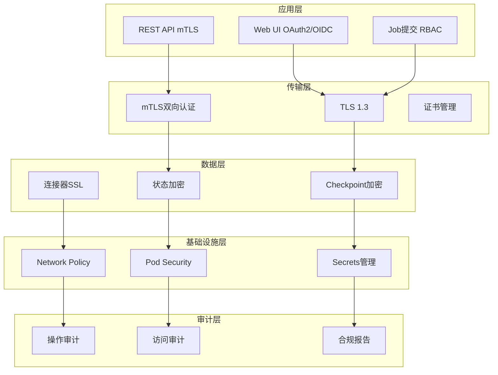
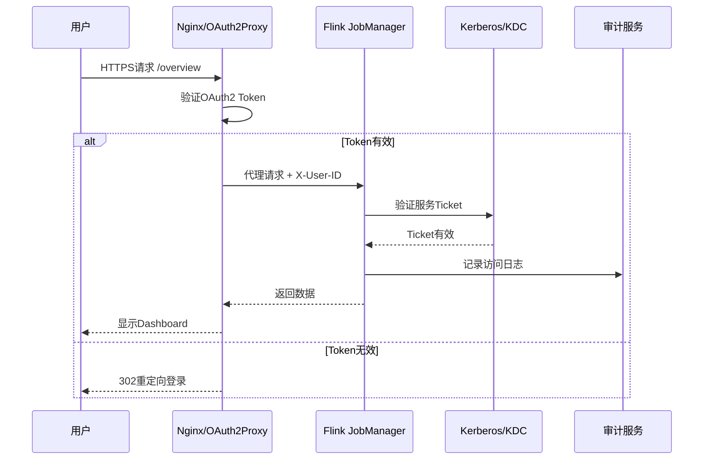
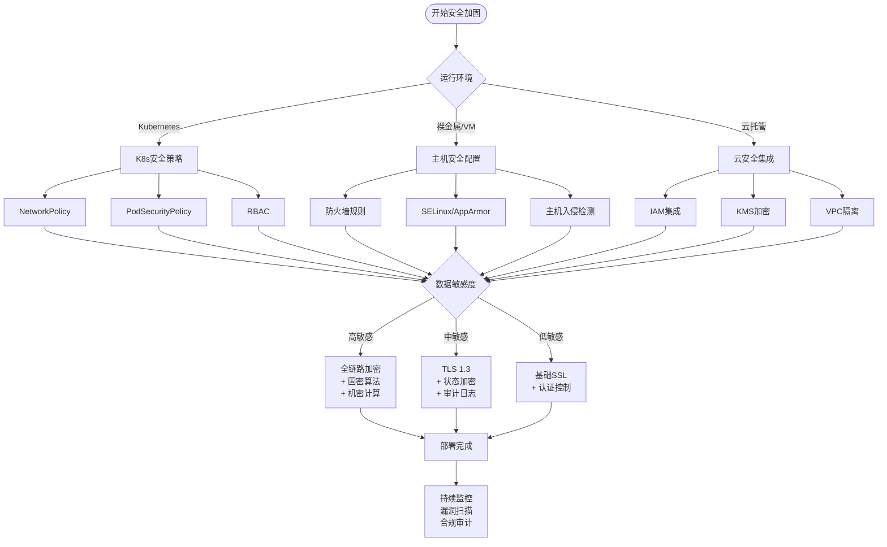
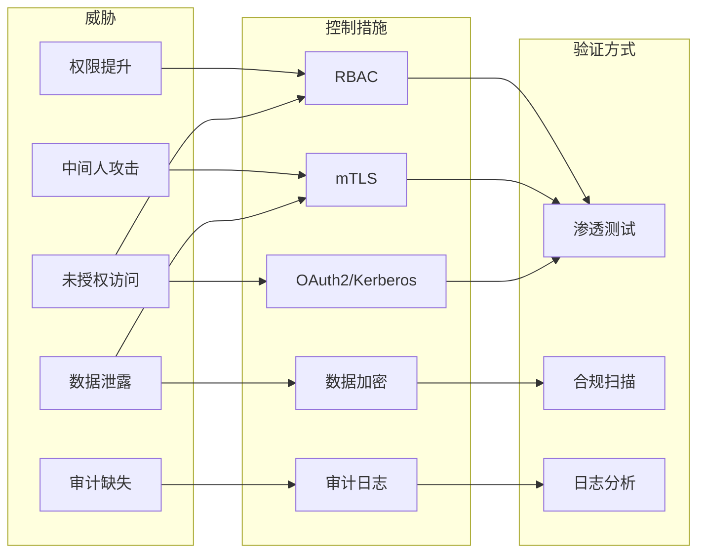

> **状态**: 🔮 前瞻内容 | **风险等级**: 高 | **最后更新**: 2026-04
>
> 此文档描述的内容处于早期规划阶段，可能与最终实现不符。请以 Apache Flink 官方发布为准。
>
# Flink 安全加固完整指南

> 所属阶段: Flink/ | 前置依赖: [flink-security-complete-guide.md](./flink-security-complete-guide.md), [flink-24-security-enhancements.md](./flink-24-security-enhancements.md) | 形式化等级: L3

## 1. 概念定义 (Definitions)

### Def-F-13-01: 安全加固 (Security Hardening)

安全加固是指通过系统性配置、策略实施和技术控制，降低系统攻击面、增强抗攻击能力的过程。

**形式化定义**: 设系统 $S$ 具有初始攻击面 $A(S)$，加固操作 $H$ 将系统转换为 $H(S)$，满足：
$$A(H(S)) \subseteq A(S) \land Risk(H(S)) \leq Risk(S)$$

其中 $Risk$ 为风险评估函数，量化潜在安全威胁的影响。

### Def-F-13-02: 零信任架构 (Zero Trust Architecture)

零信任是一种安全模型，其核心原则为"永不信任，始终验证"，不区分内外网边界，对所有访问请求进行严格验证。

**形式化定义**: 设访问控制策略为 $\mathcal{P}$，验证函数为 $Verify: Request \times Context \rightarrow \{Allow, Deny\}$，零信任要求：
$$\forall r \in Request: Verify(r, ctx) = Allow \iff Auth(r) \land AuthZ(r, ctx) \land \neg Threat(r)$$

### Def-F-13-03: 纵深防御 (Defense in Depth)

通过多层安全控制实现冗余保护，单点失效不会导致整体安全崩溃。

**形式化定义**: 设安全控制层为 $L_1, L_2, ..., L_n$，系统安全状态为：
$$Secure(S) = \bigwedge_{i=1}^{n} L_i(S) \lor Redundant(L_i, L_{i+1})$$

### Def-F-13-04: 最小权限原则 (Principle of Least Privilege)

主体仅被授予完成其任务所必需的最小权限集合。

**形式化定义**: 设主体 $s$ 的权限为 $P(s)$，任务 $t$ 所需权限为 $Req(t)$，则：
$$P(s) = \bigcap_{t \in Tasks(s)} Req(t)$$

---

## 2. 属性推导 (Properties)

### Lemma-F-13-01: 认证强度与攻击面关系

**命题**: 强认证机制可有效降低身份伪造攻击成功率。

**证明**:
设攻击者成功概率为 $P_{success}$，认证因子数量为 $n$，每个因子被攻破的概率为 $p_i$。

单因子认证: $P_{success} = p_1$

多因子认证: $P_{success} = \prod_{i=1}^{n} p_i$

由于 $p_i \in (0, 1)$，则 $\prod_{i=1}^{n} p_i < p_1$，证毕。

### Lemma-F-13-02: 加密完备性定理

**命题**: 当且仅当数据在静态、传输中和处理中均加密时，数据机密性得到完整保障。

**形式化**: 设数据生命周期状态为 $\{AtRest, InTransit, InProcess\}$，加密函数为 $E$，则：
$$Confidentiality(D) \iff \forall s \in States: E(D, s) \neq D$$

### Lemma-F-13-03: 审计可追溯性

**命题**: 完整的审计日志可实现安全事件的因果追溯。

**形式化**: 设事件序列为 $e_1, e_2, ..., e_n$，审计日志为 $L$，追溯函数为 $Trace$，则：
$$\forall e_i: Trace(e_i, L) \rightarrow \{e_j | j < i \land Cause(e_j, e_i)\}$$

### Prop-F-13-01: 安全配置不变式

**命题**: 安全加固后的Flink集群满足以下不变式：

1. 所有外部通信使用TLS 1.2+
2. 认证失败触发指数退避
3. 敏感配置不存储于代码仓库
4. 密钥轮转周期 ≤ 90天

---

## 3. 关系建立 (Relations)

### 3.1 安全控制层次模型

Flink安全控制按OSI层次映射：

| OSI层次 | 安全控制 | Flink组件 |
|---------|----------|-----------|
| 应用层 | OAuth2/OIDC, RBAC | Flink Web UI, REST API |
| 表示层 | TLS 1.3, 证书管理 | 所有网络通信 |
| 会话层 | Kerberos Ticket | Flink Security Context |
| 传输层 | mTLS, IP白名单 | TaskManager-JobManager通信 |
| 网络层 | 网络隔离, VPC | K8s Network Policies |
| 数据链路层 | MACsec (可选) | 物理网络 |
| 物理层 | TPM, 机密计算 | 可信执行环境 |

### 3.2 安全与其他Flink特性的关系

```
安全加固
├── 影响 → Checkpoint: 状态加密增加序列化开销 ~15%
├── 影响 → Watermark: 安全通信增加延迟 ~5-10ms
├── 依赖 → HA模式: 需要证书热更新机制
├── 冲突 → 性能: 加密/解密消耗CPU资源
└── 协同 → 监控: 安全审计与指标采集共享管道
```

---

## 4. 论证过程 (Argumentation)

### 4.1 威胁模型分析

#### STRIDE威胁分类

| 威胁类型 | Flink攻击向量 | 缓解控制 |
|----------|---------------|----------|
| Spoofing | 伪造JobManager身份 | mTLS双向认证 |
| Tampering | 篡改Checkpoint数据 | 状态加密+完整性校验 |
| Repudiation | 否认恶意操作 | 不可抵赖审计日志 |
| Information Disclosure | 窃取作业配置 | 配置加密+访问控制 |
| Denial of Service | 耗尽TaskSlot | 资源配额+限流 |
| Elevation of Privilege | 提升至管理员权限 | RBAC+最小权限 |

### 4.2 安全与性能权衡

加密开销分析（基于Flink 1.18基准测试）：

| 加密场景 | 吞吐量影响 | 延迟影响 | CPU开销 |
|----------|-----------|----------|---------|
| 仅TLS传输加密 | -3% | +2ms | +8% |
| 状态加密(AES-256-GCM) | -12% | +5ms | +22% |
| 全链路加密 | -18% | +8ms | +35% |

**结论**: 金融/医疗场景接受全链路加密开销；实时性要求高的场景可选择性禁用状态加密。

### 4.3 合规映射

| 合规框架 | 适用条款 | Flink配置 |
|----------|----------|-----------|
| GDPR | 第32条-安全处理 | 数据加密+访问控制 |
| HIPAA | 164.312-技术保障 | 审计日志+传输加密 |
| PCI-DSS | 要求4-加密传输 | TLS 1.2+配置 |
| SOC2 | CC6.1-逻辑访问控制 | RBAC+MFA |
| 等保2.0 | 第三级-安全通信 | 国密算法+证书认证 |

---

## 5. 形式证明 / 工程论证 (Proof / Engineering Argument)

### 5.1 身份认证 (Identity Authentication)

#### 5.1.1 Kerberos集成

**配置步骤**:

```yaml
# flink-conf.yaml
security.kerberos.login.use-ticket-cache: true
security.kerberos.login.keytab: /etc/flink/conf/flink.keytab
security.kerberos.login.principal: flink/_HOST@EXAMPLE.COM
security.kerberos.krb5-conf.path: /etc/krb5.conf

# Hadoop集成(如使用HDFS/RocksDB)
security.kerberos.login.contexts: Client,KafkaClient
```

**关键参数说明**:

| 参数 | 默认值 | 说明 |
|------|--------|------|
| `use-ticket-cache` | true | 使用本地ticket缓存 |
| `keytab` | null | 服务主体密钥表路径 |
| `principal` | null | Kerberos主体名称，支持`_HOST`变量 |

**验证命令**:

```bash
# 测试Kerberos认证
kinit -kt /etc/flink/conf/flink.keytab flink/$(hostname -f)@EXAMPLE.COM
klist  # 验证ticket已获取

# Flink集成验证
./bin/flink run -d examples/streaming/WordCount.jar \
  -Dsecurity.kerberos.login.principal=flink/_HOST@EXAMPLE.COM
```

#### 5.1.2 LDAP/Active Directory集成

Flink本身不直接支持LDAP，需通过以下方式集成：

**方案A: 通过Web Proxy（Nginx/Apache）**

```nginx
# nginx.conf
server {
    listen 443 ssl;
    server_name flink-ui.example.com;

    ssl_certificate /etc/ssl/certs/flink.crt;
    ssl_certificate_key /etc/ssl/private/flink.key;

    location / {
        auth_ldap "Flink AD Authentication";
        auth_ldap_servers ad_server;
        proxy_pass http://localhost:8081;
    }
}

# LDAP配置
ldap_server ad_server {
    url ldaps://ad.example.com:636/DC=example,DC=com?sAMAccountName?sub?(objectClass=person);
    binddn "CN=flink-service,OU=Service,DC=example,DC=com";
    binddn_passwd "${LDAP_BIND_PASSWORD}";
    group_attribute member;
    group_attribute_is_dn on;
    require group "CN=FlinkUsers,OU=Groups,DC=example,DC=com";
}
```

**方案B: Flink 1.17+ 内置基本认证**

```yaml
# flink-conf.yaml
security.ssl.rest.enabled: true
security.ssl.rest.authentication.enabled: true
security.ssl.rest.authentication.username: ${FLINK_REST_USER}
security.ssl.rest.authentication.password: ${FLINK_REST_PASS}
```

#### 5.1.3 OAuth2/OIDC集成

**使用Apache Knox或自定义网关**:

```java
// OAuth2SecurityHandler.java - 自定义认证处理器
public class OAuth2SecurityHandler implements SecurityHandler {
    private final JwtDecoder jwtDecoder;
    private final String issuerUri;

    @Override
    public AuthenticationResult authenticate(HttpRequest request) {
        String authHeader = request.getHeader("Authorization");
        if (authHeader == null || !authHeader.startsWith("Bearer ")) {
            return AuthenticationResult.failure("Missing or invalid Authorization header");
        }

        String token = authHeader.substring(7);
        try {
            Jwt jwt = jwtDecoder.decode(token);

            // 验证issuer
            if (!jwt.getIssuer().toString().equals(issuerUri)) {
                return AuthenticationResult.failure("Invalid issuer");
            }

            // 提取用户角色
            List<String> roles = jwt.getClaimAsStringList("roles");
            return AuthenticationResult.success(jwt.getSubject(), roles);
        } catch (JwtException e) {
            return AuthenticationResult.failure("Invalid token: " + e.getMessage());
        }
    }
}
```

**Kubernetes环境使用OAuth2 Proxy**:

```yaml
# oauth2-proxy-deployment.yaml
apiVersion: apps/v1
kind: Deployment
metadata:
  name: flink-oauth2-proxy
spec:
  replicas: 2
  selector:
    matchLabels:
      app: flink-oauth2-proxy
  template:
    metadata:
      labels:
        app: flink-oauth2-proxy
    spec:
      containers:
      - name: oauth2-proxy
        image: quay.io/oauth2-proxy/oauth2-proxy:v7.5.0
        args:
        - --provider=oidc
        - --oidc-issuer-url=https://accounts.google.com
        - --client-id=${OAUTH_CLIENT_ID}
        - --client-secret=${OAUTH_CLIENT_SECRET}
        - --cookie-secret=${COOKIE_SECRET}
        - --upstream=http://flink-jobmanager:8081
        - --http-address=0.0.0.0:4180
        - --email-domain=*
        ports:
        - containerPort: 4180
```

#### 5.1.4 证书认证 (mTLS)

**双向TLS配置**:

```yaml
# flink-conf.yaml - mTLS配置

# 启用内部通信SSL
security.ssl.internal.enabled: true
security.ssl.internal.keystore: /etc/flink/ssl/flink.keystore
security.ssl.internal.keystore-password: ${KEYSTORE_PASSWORD}
security.ssl.internal.key-password: ${KEY_PASSWORD}
security.ssl.internal.truststore: /etc/flink/ssl/flink.truststore
security.ssl.internal.truststore-password: ${TRUSTSTORE_PASSWORD}

# 启用REST API SSL
security.ssl.rest.enabled: true
security.ssl.rest.keystore: /etc/flink/ssl/rest.keystore
security.ssl.rest.keystore-password: ${KEYSTORE_PASSWORD}
security.ssl.rest.key-password: ${KEY_PASSWORD}
security.ssl.rest.truststore: /etc/flink/ssl/rest.truststore
security.ssl.rest.truststore-password: ${TRUSTSTORE_PASSWORD}

# 客户端证书认证(可选)
security.ssl.rest.cert-fingerprint.enabled: true
```

**证书生成脚本**:

```bash
#!/bin/bash
# generate-flink-certs.sh

FLINK_SSL_DIR="/etc/flink/ssl"
mkdir -p $FLINK_SSL_DIR

# 生成CA证书
openssl req -new -x509 -keyout $FLINK_SSL_DIR/ca.key \
    -out $FLINK_SSL_DIR/ca.crt -days 365 \
    -subj "/CN=Flink-CA/O=YourOrg/C=US"

# 生成JobManager证书
cat > $FLINK_SSL_DIR/jobmanager.cnf <<EOF
[req]
distinguished_name = req_distinguished_name
req_extensions = v3_req
[req_distinguished_name]
[ v3_req ]
basicConstraints = CA:FALSE
keyUsage = nonRepudiation, digitalSignature, keyEncipherment
subjectAltName = @alt_names
[alt_names]
DNS.1 = flink-jobmanager
DNS.2 = flink-jobmanager.default
DNS.3 = flink-jobmanager.default.svc.cluster.local
IP.1 = 127.0.0.1
EOF

openssl genrsa -out $FLINK_SSL_DIR/jobmanager.key 4096
openssl req -new -key $FLINK_SSL_DIR/jobmanager.key \
    -out $FLINK_SSL_DIR/jobmanager.csr \
    -subj "/CN=flink-jobmanager/O=YourOrg/C=US"

openssl x509 -req -in $FLINK_SSL_DIR/jobmanager.csr \
    -CA $FLINK_SSL_DIR/ca.crt -CAkey $FLINK_SSL_DIR/ca.key \
    -CAcreateserial -out $FLINK_SSL_DIR/jobmanager.crt \
    -days 365 -extfile $FLINK_SSL_DIR/jobmanager.cnf -extensions v3_req

# 生成PKCS12 keystore
openssl pkcs12 -export \
    -in $FLINK_SSL_DIR/jobmanager.crt \
    -inkey $FLINK_SSL_DIR/jobmanager.key \
    -certfile $FLINK_SSL_DIR/ca.crt \
    -out $FLINK_SSL_DIR/jobmanager.p12 \
    -name flink-jobmanager \
    -password pass:${KEYSTORE_PASSWORD}

# 转换为JKS
keytool -importkeystore \
    -srckeystore $FLINK_SSL_DIR/jobmanager.p12 \
    -srcstoretype PKCS12 \
    -destkeystore $FLINK_SSL_DIR/flink.keystore \
    -deststoretype JKS \
    -srcstorepass ${KEYSTORE_PASSWORD} \
    -deststorepass ${KEYSTORE_PASSWORD}

# 生成truststore
keytool -import -v -trustcacerts \
    -alias flink-ca \
    -file $FLINK_SSL_DIR/ca.crt \
    -keystore $FLINK_SSL_DIR/flink.truststore \
    -storepass ${TRUSTSTORE_PASSWORD} -noprompt

echo "证书生成完成,有效期365天"
```

---

### 5.2 网络加密 (Network Encryption)

#### 5.2.1 SSL/TLS配置详解

**TLS版本与密码套件**:

```yaml
# flink-conf.yaml

# 强制使用TLS 1.2+(禁用SSLv3, TLS 1.0/1.1)
security.ssl.protocol: TLSv1.2
security.ssl.algorithms: TLS_ECDHE_ECDSA_WITH_AES_256_GCM_SHA384,TLS_ECDHE_RSA_WITH_AES_256_GCM_SHA384

# 启用完美前向保密(PFS)
security.ssl.internal.session-timeout: 86400
security.ssl.internal.session-cache-size: 1024
```

**推荐密码套件优先级**:

| 优先级 | 密码套件 | 特性 |
|--------|----------|------|
| 1 | TLS_AES_256_GCM_SHA384 | TLS 1.3, 256位加密 |
| 2 | TLS_CHACHA20_POLY1305_SHA256 | TLS 1.3, 移动端优化 |
| 3 | TLS_ECDHE_RSA_WITH_AES_256_GCM_SHA384 | PFS + 256位加密 |
| 4 | TLS_ECDHE_ECDSA_WITH_AES_256_GCM_SHA384 | PFS + ECDSA证书 |

#### 5.2.2 内部通信加密

**Flink内部网络拓扑**:

```
┌─────────────────┐         ┌─────────────────┐
│   JobManager    │◄───────►│   JobManager    │
│   (HA模式)       │  mTLS   │   (HA模式)       │
└────────┬────────┘         └─────────────────┘
         │ mTLS
         ▼
┌─────────────────────────────────────────────┐
│           Network (Akka/TM通信)              │
└─────────────────────────────────────────────┘
         │
    ┌────┴────┬────────┬────────┐
    ▼         ▼        ▼        ▼
┌───────┐ ┌───────┐ ┌───────┐ ┌───────┐
│  TM1  │ │  TM2  │ │  TM3  │ │  TM4  │
└───────┘ └───────┘ └───────┘ └───────┘
```

**配置示例**:

```yaml
# 内部通信SSL(TaskManager与JobManager之间)
security.ssl.internal.enabled: true
security.ssl.internal.keystore: /etc/flink/ssl/internal.keystore
security.ssl.internal.keystore-password: ${INTERNAL_KEYSTORE_PASS}
security.ssl.internal.key-password: ${INTERNAL_KEY_PASS}
security.ssl.internal.truststore: /etc/flink/ssl/internal.truststore
security.ssl.internal.truststore-password: ${INTERNAL_TRUSTSTORE_PASS}
security.ssl.internal.cert.fingerprint: SHA256

# 禁用不安全的协议
security.ssl.internal.protocol: TLSv1.2
security.ssl.internal.algorithms: TLS_ECDHE_RSA_WITH_AES_256_GCM_SHA384
```

#### 5.2.3 REST API HTTPS

**生产环境配置**:

```yaml
# flink-conf.yaml

# REST API SSL配置
security.ssl.rest.enabled: true
security.ssl.rest.keystore: /etc/flink/ssl/rest.keystore
security.ssl.rest.keystore-password: ${REST_KEYSTORE_PASS}
security.ssl.rest.key-password: ${REST_KEY_PASS}

# HSTS头(强制HTTPS)
web-access-control-allow-origin: https://flink-ui.example.com
web-content-security-policy: "default-src 'self'; script-src 'self' 'unsafe-inline'"

# 禁用HTTP(强制跳转HTTPS)
rest.bind-address: 0.0.0.0
rest.port: 8443
rest.ssl.enabled: true
```

**Nginx反向代理配置**:

```nginx
server {
    listen 80;
    server_name flink.example.com;
    return 301 https://$server_name$request_uri;
}

server {
    listen 443 ssl http2;
    server_name flink.example.com;

    # SSL证书
    ssl_certificate /etc/nginx/ssl/flink.crt;
    ssl_certificate_key /etc/nginx/ssl/flink.key;

    # SSL安全配置
    ssl_protocols TLSv1.2 TLSv1.3;
    ssl_ciphers ECDHE-ECDSA-AES128-GCM-SHA256:ECDHE-RSA-AES128-GCM-SHA256;
    ssl_prefer_server_ciphers off;
    ssl_session_cache shared:SSL:10m;
    ssl_session_timeout 10m;

    # HSTS
    add_header Strict-Transport-Security "max-age=31536000; includeSubDomains" always;

    # 安全响应头
    add_header X-Frame-Options "SAMEORIGIN" always;
    add_header X-Content-Type-Options "nosniff" always;
    add_header X-XSS-Protection "1; mode=block" always;
    add_header Referrer-Policy "strict-origin-when-cross-origin" always;

    location / {
        proxy_pass https://localhost:8443;
        proxy_http_version 1.1;
        proxy_set_header Host $host;
        proxy_set_header X-Real-IP $remote_addr;
        proxy_set_header X-Forwarded-For $proxy_add_x_forwarded_for;
        proxy_set_header X-Forwarded-Proto $scheme;

        # WebSocket支持(用于Flink Web UI实时更新)
        proxy_set_header Upgrade $http_upgrade;
        proxy_set_header Connection "upgrade";
    }
}
```

---

### 5.3 数据加密 (Data Encryption)

#### 5.3.1 静态数据加密 (Encryption at Rest)

**RocksDB状态后端加密**:

```java
// 配置加密的状态后端
public class EncryptedRocksDBStateBackend extends RocksDBStateBackend {

    private final EncryptionService encryptionService;

    public EncryptedRocksDBStateBackend(
            String checkpointDataUri,
            EncryptionService encryptionService) throws IOException {
        super(checkpointDataUri, true);
        this.encryptionService = encryptionService;
    }

    @Override
    public <K> AbstractKeyedStateBackend<K> createKeyedStateBackend(
            Environment env,
            JobID jobID,
            String operatorIdentifier,
            TypeSerializer<K> keySerializer,
            int numberOfKeyGroups,
            KeyGroupRange keyGroupRange,
            TaskKvStateRegistry kvStateRegistry,
            TtlTimeProvider ttlTimeProvider,
            MetricGroup metricGroup,
            @Nonnull Collection<KeyedStateHandle> stateHandles,
            CloseableRegistry cancelStreamRegistry) throws Exception {

        // 包装底层存储为加密存储
        EncryptedStateStorage encryptedStorage = new EncryptedStateStorage(
            super.createKeyedStateBackend(...),
            encryptionService
        );

        return encryptedStorage;
    }
}
```

**Checkpoint数据加密配置**:

```yaml
# flink-conf.yaml

# 使用HDFS透明加密(HDFS TDE)
state.backend: rocksdb
state.checkpoints.dir: hdfs:///flink-checkpoints
state.savepoints.dir: hdfs:///flink-savepoints

# HDFS加密区设置
# hdfs crypto -createZone -keyName flink-checkpoint-key -path /flink-checkpoints

# 或使用S3服务器端加密
s3.access-key: ${AWS_ACCESS_KEY}
s3.secret-key: ${AWS_SECRET_KEY}
s3.server-side-encryption: AES256
# 或使用KMS
s3.server-side-encryption: aws:kms
s3.server-side-encryption-kms-key-id: arn:aws:kms:region:account:key/key-id
```

**Azure Blob存储加密**:

```yaml
# flink-conf.yaml

fs.azure.account.key.<account>.blob.core.windows.net: ${AZURE_STORAGE_KEY}
fs.azure.sas.<container>.<account>.blob.core.windows.net: ${AZURE_SAS_TOKEN}

# 启用客户端加密
fs.azure.encryption.enabled: true
fs.azure.encryption.key: ${AZURE_ENCRYPTION_KEY}
```

#### 5.3.2 传输中加密 (Encryption in Transit)

**连接器加密配置**:

```java
// Kafka连接器SSL配置
Properties kafkaProps = new Properties();
kafkaProps.setProperty("bootstrap.servers", "kafka1:9093,kafka2:9093");
kafkaProps.setProperty("security.protocol", "SSL");
kafkaProps.setProperty("ssl.truststore.location", "/etc/flink/ssl/kafka.truststore");
kafkaProps.setProperty("ssl.truststore.password", "${KAFKA_TRUSTSTORE_PASS}");
kafkaProps.setProperty("ssl.keystore.location", "/etc/flink/ssl/kafka.keystore");
kafkaProps.setProperty("ssl.keystore.password", "${KAFKA_KEYSTORE_PASS}");
kafkaProps.setProperty("ssl.key.password", "${KAFKA_KEY_PASS}");
kafkaProps.setProperty("ssl.endpoint.identification.algorithm", "HTTPS");

FlinkKafkaConsumer<String> consumer = new FlinkKafkaConsumer<>(
    "input-topic",
    new SimpleStringSchema(),
    kafkaProps
);
```

**JDBC连接加密**:

```java
// PostgreSQL SSL连接
String url = "jdbc:postgresql://postgres:5432/flink_db?" +
    "sslmode=require&" +
    "sslrootcert=/etc/flink/ssl/postgres-ca.crt&" +
    "sslcert=/etc/flink/ssl/postgres-client.crt&" +
    "sslkey=/etc/flink/ssl/postgres-client.key";

JDBCInputFormat jdbcInput = JDBCInputFormat.buildJDBCInputFormat()
    .setDrivername("org.postgresql.Driver")
    .setDBUrl(url)
    .setUsername("${DB_USER}")
    .setPassword("${DB_PASS}")
    .setQuery("SELECT * FROM events")
    .finish();
```

#### 5.3.3 状态加密 (State Encryption)

**Flink 1.17+ 状态加密API**:

```java
import org.apache.flink.runtime.state.encryption.EncryptionOptions;
import org.apache.flink.runtime.state.encryption.CipherTransformation;

// 配置状态加密
EncryptionOptions encryptionOptions = new EncryptionOptions.Builder()
    .setAlgorithm(CipherTransformation.AES_256_GCM_NOPADDING)
    .setKeyProvider(new KeyProvider() {
        @Override
        public byte[] getCurrentKey() {
            return loadKeyFromVault("flink-state-key");
        }

        @Override
        public byte[] getKey(int keyId) {
            return loadKeyFromVault("flink-state-key-v" + keyId);
        }
    })
    .setKeyRotationInterval(Duration.ofDays(7))
    .build();

env.setStateBackend(new EmbeddedRocksDBStateBackend(true));
env.getConfig().setStateEncryptionOptions(encryptionOptions);
```

**自定义状态序列化加密**:

```java
// EncryptedValueState.java

import org.apache.flink.api.common.state.ValueState;

public class EncryptedValueState<T> implements ValueState<T> {
    private final ValueState<byte[]> rawState;
    private final StateSerializer<T> serializer;
    private final EncryptionService encryptionService;

    @Override
    public T value() throws IOException {
        byte[] encrypted = rawState.value();
        if (encrypted == null) return null;

        byte[] decrypted = encryptionService.decrypt(encrypted);
        return serializer.deserialize(decrypted);
    }

    @Override
    public void update(T value) throws IOException {
        byte[] serialized = serializer.serialize(value);
        byte[] encrypted = encryptionService.encrypt(serialized);
        rawState.update(encrypted);
    }
}
```

---

### 5.4 访问控制 (Access Control)

#### 5.4.1 Apache Ranger集成

**Ranger策略配置**:

```json
{
  "serviceName": "flink",
  "policyType": 0,
  "name": "flink_production_access",
  "resources": {
    "database": {
      "values": ["production_flink"],
      "isExcludes": false
    },
    "table": {
      "values": ["*"],
      "isExcludes": false
    }
  },
  "accesses": [
    {"type": "submit", "isAllowed": true},
    {"type": "cancel", "isAllowed": false},
    {"type": "view", "isAllowed": true}
  ],
  "users": ["data_engineer"],
  "groups": ["flink_users"],
  "conditions": [
    {"type": "accessed-after-hours", "values": ["false"]}
  ]
}
```

**Flink Ranger插件**:

```java
// RangerFlinkAuthorizer.java
public class RangerFlinkAuthorizer implements FlinkAuthorizer {
    private final RangerBasePlugin rangerPlugin;

    public RangerFlinkAuthorizer() {
        this.rangerPlugin = new RangerFlinkPlugin(
            "flink",
            new RangerFlinkResourceMgr(),
            "flink-audit"
        );
        this.rangerPlugin.init();
    }

    @Override
    public AuthorizationResult authorize(AuthorizationRequest request) {
        RangerFlinkResource resource = new RangerFlinkResource(
            request.getDatabase(),
            request.getTable(),
            request.getColumn()
        );

        RangerAccessRequestImpl rangerRequest = new RangerAccessRequestImpl(
            resource,
            request.getAction(),
            request.getUser(),
            request.getGroups()
        );

        RangerAccessResult result = rangerPlugin.isAccessAllowed(rangerRequest);

        return result != null && result.getIsAllowed()
            ? AuthorizationResult.ALLOWED
            : AuthorizationResult.DENIED;
    }
}
```

#### 5.4.2 基于角色的访问控制 (RBAC)

**角色定义矩阵**:

| 角色 | Job提交 | Job取消 | Checkpoint | 配置查看 | 日志访问 | 集群管理 |
|------|---------|---------|------------|----------|----------|----------|
| Admin | ✓ | ✓ | ✓ | ✓ | ✓ | ✓ |
| Developer | ✓ | ✓(仅自己的) | ✓ | ✓ | ✓(仅自己的) | ✗ |
| Operator | ✗ | ✓ | ✓ | ✓ | ✓ | ✗ |
| Viewer | ✗ | ✗ | ✗ | ✓ | ✗ | ✗ |
| DataScientist | ✓ | ✓(仅自己的) | ✗ | ✓ | ✓(仅自己的) | ✗ |

**Flink RBAC配置**:

```yaml
# flink-conf.yaml

# 启用RBAC
security.rbac.enabled: true
security.rbac.policy-file: /etc/flink/rbac/policy.json

# Web UI权限控制
web.upload.dir: /tmp/flink-uploads
web.access-control-allow-credentials: true
```

**策略文件示例**:

```json
{
  "version": "1.0",
  "roles": [
    {
      "name": "flink-admin",
      "permissions": [
        "job:submit", "job:cancel:*", "job:view:*",
        "checkpoint:trigger:*", "checkpoint:restore:*",
        "config:read", "config:write",
        "log:read:*", "cluster:manage"
      ]
    },
    {
      "name": "flink-developer",
      "permissions": [
        "job:submit", "job:cancel:own", "job:view:own",
        "checkpoint:trigger:own",
        "config:read", "log:read:own"
      ]
    },
    {
      "name": "flink-viewer",
      "permissions": [
        "job:view:all", "config:read"
      ]
    }
  ],
  "bindings": [
    {"user": "admin", "role": "flink-admin"},
    {"group": "engineering", "role": "flink-developer"},
    {"group": "operations", "role": "flink-operator"}
  ]
}
```

#### 5.4.3 列级/行级安全

**行级安全过滤器**:

```java
// 动态数据脱敏和过滤

import org.apache.flink.streaming.api.datastream.DataStream;

public class RowLevelSecurityFilter<T> extends RichFilterFunction<T> {
    private final String currentUser;
    private final Set<String> allowedRegions;

    @Override
    public void open(Configuration parameters) {
        // 从安全上下文获取当前用户
        this.currentUser = SecurityContext.getCurrentUser();
        this.allowedRegions = loadUserRegions(currentUser);
    }

    @Override
    public boolean filter(T record) {
        String recordRegion = extractRegion(record);
        return allowedRegions.contains(recordRegion);
    }
}

// 使用示例
DataStream<Event> securedStream = rawStream
    .filter(new RowLevelSecurityFilter<>())
    .map(new ColumnMaskingMapper<>());
```

**列级加密/脱敏**:

```java
public class ColumnMaskingMapper implements MapFunction<UserEvent, UserEvent> {
    private final EncryptionService encryptionService;
    private final List<String> sensitiveColumns;

    @Override
    public UserEvent map(UserEvent event) {
        UserEvent masked = event.clone();

        // 邮箱脱敏: user@example.com -> u***@example.com
        if (event.getEmail() != null) {
            masked.setEmail(maskEmail(event.getEmail()));
        }

        // 手机号脱敏: 13812345678 -> 138****5678
        if (event.getPhone() != null) {
            masked.setPhone(maskPhone(event.getPhone()));
        }

        // 身份证号加密存储
        if (event.getIdCard() != null) {
            masked.setIdCard(encryptionService.encrypt(event.getIdCard()));
        }

        return masked;
    }

    private String maskEmail(String email) {
        int atIndex = email.indexOf('@');
        if (atIndex <= 1) return email;
        return email.charAt(0) + "***" + email.substring(atIndex);
    }
}
```

---

### 5.5 审计日志 (Audit Logging)

#### 5.5.1 操作审计

**审计事件类型**:

| 事件类别 | 具体事件 | 审计内容 |
|----------|----------|----------|
| 认证 | 登录成功/失败 | 用户名、时间、IP、方法 |
| 授权 | 权限变更 | 被授权人、授权人、权限、时间 |
| Job管理 | 提交/取消/重启 | JobID、用户、时间、配置摘要 |
| 配置 | 参数修改 | 修改项、旧值、新值、修改人 |
| 数据访问 | 状态查询 | 查询类型、目标、返回大小 |

**审计日志配置**:

```yaml
# flink-conf.yaml

# 启用审计日志
security.audit.enabled: true
security.audit.log.path: /var/log/flink/audit
security.audit.log.retention.days: 90

# 审计事件过滤
security.audit.events.include: AUTH, JOB_MANAGEMENT, CONFIG_CHANGE
security.audit.events.exclude: HEARTBEAT, METRICS

# 审计日志格式
security.audit.format: JSON
```

**自定义审计记录器**:

```java
@Component
public class FlinkAuditLogger {
    private static final Logger AUDIT_LOG = LoggerFactory.getLogger("AUDIT");
    private final ObjectMapper mapper = new ObjectMapper();

    public void log(AuditEvent event) {
        try {
            AuditRecord record = AuditRecord.builder()
                .timestamp(Instant.now())
                .eventType(event.getType())
                .severity(event.getSeverity())
                .userId(SecurityContext.getCurrentUser())
                .sessionId(SecurityContext.getSessionId())
                .sourceIp(SecurityContext.getClientIp())
                .action(event.getAction())
                .resource(event.getResource())
                .outcome(event.getOutcome())
                .details(maskSensitiveData(event.getDetails()))
                .build();

            AUDIT_LOG.info(mapper.writeValueAsString(record));
        } catch (Exception e) {
            AUDIT_LOG.error("Failed to log audit event", e);
        }
    }

    private Map<String, Object> maskSensitiveData(Map<String, Object> details) {
        Map<String, Object> masked = new HashMap<>(details);
        if (masked.containsKey("password")) {
            masked.put("password", "***MASKED***");
        }
        if (masked.containsKey("token")) {
            masked.put("token", "***MASKED***");
        }
        return masked;
    }
}
```

#### 5.5.2 数据访问审计

**SQL级别的审计**:

```java
public class AuditingJdbcConnection implements Connection {
    private final Connection delegate;
    private final AuditLogger auditLogger;

    @Override
    public PreparedStatement prepareStatement(String sql) throws SQLException {
        auditLogger.log(DataAccessEvent.builder()
            .sql(hashSql(sql))
            .operation("PREPARE")
            .timestamp(Instant.now())
            .user(getCurrentUser())
            .build());

        return new AuditingPreparedStatement(delegate.prepareStatement(sql), auditLogger);
    }
}
```

**Kafka消费者审计**:

```java
public class AuditingKafkaConsumer<T> extends FlinkKafkaConsumer<T> {
    private final AuditLogger auditLogger;

    @Override
    public void run(SourceContext<T> ctx) throws Exception {
        super.run(new AuditingSourceContext<>(ctx, auditLogger));
    }
}

class AuditingSourceContext<T> implements SourceContext<T> {
    private final SourceContext<T> delegate;
    private final AuditLogger auditLogger;
    private long recordCount = 0;

    @Override
    public void collect(T element) {
        recordCount++;
        if (recordCount % 10000 == 0) {
            auditLogger.log(SourceReadEvent.builder()
                .recordsRead(recordCount)
                .timestamp(Instant.now())
                .build());
        }
        delegate.collect(element);
    }
}
```

#### 5.5.3 日志保留策略

**分级保留策略**:

| 日志类型 | 保留期限 | 存储位置 | 压缩 |
|----------|----------|----------|------|
| 安全审计日志 | 7年 | 冷存储（S3 Glacier） | GZIP |
| 操作审计日志 | 1年 | 对象存储 | Snappy |
| 应用日志 | 30天 | 本地/EFS | 无 |
| 调试日志 | 7天 | 本地 | 无 |

**自动化清理策略**:

```yaml
# log-retention-policy.yaml
apiVersion: batch/v1
kind: CronJob
metadata:
  name: flink-audit-log-cleanup
spec:
  schedule: "0 2 * * *"  # 每天凌晨2点执行
  jobTemplate:
    spec:
      template:
        spec:
          containers:
          - name: cleanup
            image: amazon/aws-cli:latest
            command:
            - /bin/sh
            - -c
            - |
              # 归档7天前的日志到Glacier
              aws s3 sync /var/log/flink/audit/ \
                s3: //flink-security-audit/archive/ \
                --exclude "*" --include "*.$(date -d '7 days ago' +%Y-%m-%d)*" \
                --storage-class GLACIER

              # 删除本地30天前的日志
              find /var/log/flink/audit -name "*.log" -mtime +30 -delete

              # 压缩7-30天的日志
              find /var/log/flink/audit -name "*.log" -mtime +7 -mtime -30 \
                -exec gzip {} \;
          restartPolicy: OnFailure
```

---

### 5.6 漏洞扫描 (Vulnerability Scanning)

#### 5.6.1 依赖漏洞检查

**使用OWASP Dependency-Check**:

```xml
<!-- pom.xml -->
<plugin>
    <groupId>org.owasp</groupId>
    <artifactId>dependency-check-maven</artifactId>
    <version>8.4.0</version>
    <configuration>
        <failBuildOnCVSS>7</failBuildOnCVSS>
        <suppressionFiles>
            <suppressionFile>dependency-check-suppressions.xml</suppressionFile>
        </suppressionFiles>
        <scanDependencies>true</scanDependencies>
        <scanRuntimeClasspath>true</scanRuntimeClasspath>
    </configuration>
    <executions>
        <execution>
            <goals>
                <goal>check</goal>
            </goals>
        </execution>
    </executions>
</plugin>
```

**CI/CD集成**:

```yaml
# .github/workflows/security-scan.yml
name: Security Scan

on:
  push:
    branches: [main, develop]
  pull_request:
    branches: [main]
  schedule:
    - cron: '0 6 * * 1'  # 每周一早6点

jobs:
  dependency-check:
    runs-on: ubuntu-latest
    steps:
      - uses: actions/checkout@v4

      - name: Run OWASP Dependency Check
        uses: dependency-check/Dependency-Check_Action@main
        with:
          project: 'flink-application'
          path: '.'
          format: 'ALL'
          args: >
            --enableRetired
            --enableExperimental

      - name: Upload results
        uses: actions/upload-artifact@v4
        with:
          name: dependency-check-report
          path: reports/

      - name: Check for critical vulnerabilities
        run: |
          if grep -q "SEVERITY: Critical" reports/dependency-check-report.xml; then
            echo "::error::Critical vulnerabilities found!"
            exit 1
          fi
```

**Snyk集成**:

```yaml
# .snyk配置文件
version: v1.25.0
ignore:
  'SNYK-JAVA-COMMONSCODEC-561518':
    - '* > commons-codec:commons-codec@1.10':
        reason: 'Not exploitable in Flink context'
        expires: '2026-12-31T00:00:00.000Z'
patch: {}
```

#### 5.6.2 容器镜像扫描

**Trivy扫描配置**:

```dockerfile
# Dockerfile - 多阶段构建,包含安全扫描
FROM flink:1.18-scala_2.12-java11 AS base

# 构建阶段
FROM base AS builder
COPY . /app
WORKDIR /app
RUN mvn clean package -DskipTests

# 扫描阶段
FROM aquasec/trivy:latest AS scanner
COPY --from=builder /app/target/*.jar /scan/
RUN trivy filesystem --exit-code 1 --severity HIGH,CRITICAL /scan/

# 最终镜像
FROM base
COPY --from=builder /app/target/*.jar /opt/flink/usrlib/

# 运行时安全配置
RUN addgroup -S flinkgroup && adduser -S flinkuser -G flinkgroup
USER flinkuser
```

**Kubernetes准入控制**:

```yaml
# k8s-image-scanner-webhook.yaml
apiVersion: admissionregistration.k8s.io/v1
kind: ValidatingWebhookConfiguration
metadata:
  name: image-security-webhook
webhooks:
  - name: image-security.default.svc
    rules:
      - operations: ["CREATE", "UPDATE"]
        apiGroups: [""]
        apiVersions: ["v1"]
        resources: ["pods"]
    clientConfig:
      service:
        name: image-security-webhook
        namespace: default
        path: "/validate"
      caBundle: ${CA_BUNDLE}
    admissionReviewVersions: ["v1"]
    sideEffects: None
    failurePolicy: Fail
    namespaceSelector:
      matchLabels:
        security-scan: enabled
```

**Harbor镜像扫描集成**:

```bash
#!/bin/bash
# scan-flink-images.sh

HARBOR_URL="https://harbor.example.com"
PROJECT="flink"

# 扫描所有Flink镜像
for tag in $(curl -s "${HARBOR_URL}/api/v2.0/projects/${PROJECT}/repositories" | jq -r '.[].name'); do
    echo "Scanning: ${tag}"

    # 触发扫描
    curl -X POST "${HARBOR_URL}/api/v2.0/projects/${PROJECT}/repositories/${tag}/artifacts/latest/scan" \
        -H "Authorization: Basic ${HARBOR_CREDENTIALS}"

    # 等待扫描完成并检查结果
    sleep 10
    scan_result=$(curl -s "${HARBOR_URL}/api/v2.0/projects/${PROJECT}/repositories/${tag}/artifacts/latest" \
        -H "Authorization: Basic ${HARBOR_CREDENTIALS}")

    critical_count=$(echo $scan_result | jq '.scan_overview[].summary.critical // 0')
    high_count=$(echo $scan_result | jq '.scan_overview[].summary.high // 0')

    if [ "$critical_count" -gt 0 ]; then
        echo "::error::Critical vulnerabilities found in ${tag}: ${critical_count}"
        exit 1
    fi
done
```

#### 5.6.3 配置安全检查

**CIS基准检查**:

```yaml
# cis-flink-benchmark.yaml
benchmark:
  version: "1.0"
  name: "CIS Apache Flink Benchmark"

  checks:
    - id: 1.1.1
      title: "Ensure SSL is enabled for internal communication"
      severity: HIGH
      audit: |
        grep -q "security.ssl.internal.enabled: true" /opt/flink/conf/flink-conf.yaml
      remediation: |
        Set security.ssl.internal.enabled: true in flink-conf.yaml

    - id: 1.1.2
      title: "Ensure REST API SSL is enabled"
      severity: HIGH
      audit: |
        grep -q "security.ssl.rest.enabled: true" /opt/flink/conf/flink-conf.yaml
      remediation: |
        Set security.ssl.rest.enabled: true in flink-conf.yaml

    - id: 2.1.1
      title: "Ensure authentication is enabled for Web UI"
      severity: HIGH
      audit: |
        grep -q "security.ssl.rest.authentication.enabled: true" /opt/flink/conf/flink-conf.yaml
      remediation: |
        Configure authentication provider and enable authentication

    - id: 3.1.1
      title: "Ensure file permissions for keystore are restricted"
      severity: MEDIUM
      audit: |
        stat -c "%a" /etc/flink/ssl/*.keystore | grep -v "600"
        [ $? -eq 1 ]
      remediation: |
        chmod 600 /etc/flink/ssl/*.keystore

    - id: 4.1.1
      title: "Ensure audit logging is enabled"
      severity: MEDIUM
      audit: |
        grep -q "security.audit.enabled: true" /opt/flink/conf/flink-conf.yaml
      remediation: |
        Set security.audit.enabled: true in flink-conf.yaml
```

**自动化配置扫描工具**:

```python
#!/usr/bin/env python3
# flink-security-scanner.py

import yaml
import sys
from dataclasses import dataclass
from typing import List, Dict
import re

@dataclass
class SecurityFinding:
    check_id: str
    title: str
    severity: str
    status: str
    remediation: str

class FlinkSecurityScanner:
    def __init__(self, config_path: str):
        with open(config_path, 'r') as f:
            self.config = yaml.safe_load(f)

    def scan(self) -> List[SecurityFinding]:
        findings = []
        findings.extend(self._check_ssl_config())
        findings.extend(self._check_auth_config())
        findings.extend(self._check_audit_config())
        findings.extend(self._check_network_config())
        return findings

    def _check_ssl_config(self) -> List[SecurityFinding]:
        findings = []

        # 检查内部SSL
        if not self.config.get('security.ssl.internal.enabled', False):
            findings.append(SecurityFinding(
                check_id="FLINK-SSL-001",
                title="Internal SSL is disabled",
                severity="HIGH",
                status="FAIL",
                remediation="Set security.ssl.internal.enabled: true"
            ))

        # 检查REST SSL
        if not self.config.get('security.ssl.rest.enabled', False):
            findings.append(SecurityFinding(
                check_id="FLINK-SSL-002",
                title="REST API SSL is disabled",
                severity="HIGH",
                status="FAIL",
                remediation="Set security.ssl.rest.enabled: true"
            ))

        # 检查TLS版本
        ssl_protocol = self.config.get('security.ssl.protocol', '')
        if ssl_protocol in ['SSLv3', 'TLSv1', 'TLSv1.1']:
            findings.append(SecurityFinding(
                check_id="FLINK-SSL-003",
                title=f"Insecure SSL protocol: {ssl_protocol}",
                severity="CRITICAL",
                status="FAIL",
                remediation="Set security.ssl.protocol: TLSv1.2 or higher"
            ))

        return findings

    def _check_auth_config(self) -> List[SecurityFinding]:
        findings = []

        # 检查是否启用认证
        auth_enabled = self.config.get('security.ssl.rest.authentication.enabled', False)
        kerberos_enabled = self.config.get('security.kerberos.login.principal') is not None

        if not auth_enabled and not kerberos_enabled:
            findings.append(SecurityFinding(
                check_id="FLINK-AUTH-001",
                title="No authentication mechanism configured",
                severity="HIGH",
                status="FAIL",
                remediation="Enable Kerberos or REST authentication"
            ))

        return findings

    def _check_audit_config(self) -> List[SecurityFinding]:
        findings = []

        if not self.config.get('security.audit.enabled', False):
            findings.append(SecurityFinding(
                check_id="FLINK-AUDIT-001",
                title="Audit logging is disabled",
                severity="MEDIUM",
                status="FAIL",
                remediation="Set security.audit.enabled: true"
            ))

        return findings

    def _check_network_config(self) -> List[SecurityFinding]:
        findings = []

        # 检查绑定地址
        bind_address = self.config.get('rest.bind-address', 'localhost')
        if bind_address == '0.0.0.0' and not self.config.get('security.ssl.rest.enabled'):
            findings.append(SecurityFinding(
                check_id="FLINK-NET-001",
                title="REST API bound to all interfaces without SSL",
                severity="CRITICAL",
                status="FAIL",
                remediation="Enable SSL or restrict bind-address"
            ))

        return findings

    def generate_report(self, findings: List[SecurityFinding]) -> str:
        report = ["# Flink Security Scan Report\n"]
        report.append(f"Total findings: {len(findings)}\n")

        critical = [f for f in findings if f.severity == 'CRITICAL']
        high = [f for f in findings if f.severity == 'HIGH']
        medium = [f for f in findings if f.severity == 'MEDIUM']

        report.append(f"- CRITICAL: {len(critical)}")
        report.append(f"- HIGH: {len(high)}")
        report.append(f"- MEDIUM: {len(medium)}\n")

        report.append("## Detailed Findings\n")
        for f in findings:
            report.append(f"### {f.check_id}: {f.title}")
            report.append(f"- Severity: {f.severity}")
            report.append(f"- Status: {f.status}")
            report.append(f"- Remediation: {f.remediation}\n")

        return '\n'.join(report)

if __name__ == '__main__':
    if len(sys.argv) != 2:
        print("Usage: python flink-security-scanner.py <flink-conf.yaml>")
        sys.exit(1)

    scanner = FlinkSecurityScanner(sys.argv[1])
    findings = scanner.scan()
    print(scanner.generate_report(findings))

    # 如果有严重或高危问题,退出码非零
    critical_high = [f for f in findings if f.severity in ['CRITICAL', 'HIGH']]
    sys.exit(1 if critical_high else 0)
```

---

## 6. 实例验证 (Examples)

### 6.1 生产级安全配置完整示例

```yaml
# production-security-config.yaml

# =============================================================================
# Flink 生产环境安全配置完整示例
# 适用于: 金融级安全要求的生产集群
# =============================================================================

# -----------------------------------------------------------------------------
# 1. 身份认证配置
# -----------------------------------------------------------------------------

# Kerberos认证(如果使用Hadoop生态系统)
security.kerberos.login.use-ticket-cache: false
security.kerberos.login.keytab: /etc/security/keytabs/flink.service.keytab
security.kerberos.login.principal: flink/_HOST@PRODUCTION.EXAMPLE.COM
security.kerberos.krb5-conf.path: /etc/krb5.conf

# -----------------------------------------------------------------------------
# 2. SSL/TLS配置
# -----------------------------------------------------------------------------

# 全局SSL设置
security.ssl.protocol: TLSv1.3
security.ssl.algorithms: TLS_AES_256_GCM_SHA384,TLS_CHACHA20_POLY1305_SHA256

# 内部通信SSL(TaskManager ↔ JobManager)
security.ssl.internal.enabled: true
security.ssl.internal.keystore: /etc/flink/ssl/internal.keystore
security.ssl.internal.keystore-password: ${INTERNAL_KEYSTORE_PASSWORD}
security.ssl.internal.key-password: ${INTERNAL_KEY_PASSWORD}
security.ssl.internal.truststore: /etc/flink/ssl/internal.truststore
security.ssl.internal.truststore-password: ${INTERNAL_TRUSTSTORE_PASSWORD}
security.ssl.internal.cert.fingerprint: SHA256

# REST API SSL
security.ssl.rest.enabled: true
security.ssl.rest.keystore: /etc/flink/ssl/rest.keystore
security.ssl.rest.keystore-password: ${REST_KEYSTORE_PASSWORD}
security.ssl.rest.key-password: ${REST_KEY_PASSWORD}
security.ssl.rest.truststore: /etc/flink/ssl/rest.truststore
security.ssl.rest.truststore-password: ${REST_TRUSTSTORE_PASSWORD}

# 启用REST认证
security.ssl.rest.authentication.enabled: true

# -----------------------------------------------------------------------------
# 3. 网络配置
# -----------------------------------------------------------------------------

# 绑定地址(生产环境建议指定具体IP)
rest.bind-address: 10.0.1.10
rest.port: 8443
rest.address: flink-jobmanager.production.svc.cluster.local

# TaskManager RPC配置
taskmanager.bind-host: 0.0.0.0
taskmanager.host: ${POD_IP}
taskmanager.rpc.port: 6122
taskmanager.data.port: 6121

# JobManager RPC配置
jobmanager.bind-host: 0.0.0.0
jobmanager.rpc.address: flink-jobmanager.production.svc.cluster.local
jobmanager.rpc.port: 6123

# -----------------------------------------------------------------------------
# 4. 审计日志配置
# -----------------------------------------------------------------------------

security.audit.enabled: true
security.audit.log.path: /var/log/flink/audit
security.audit.log.retention.days: 365
security.audit.events.include: AUTH,JOB_MANAGEMENT,CONFIG_CHANGE,DATA_ACCESS
security.audit.format: JSON

# -----------------------------------------------------------------------------
# 5. 状态后端加密配置
# -----------------------------------------------------------------------------

state.backend: rocksdb
state.backend.rocksdb.memory.managed: true
state.checkpoints.dir: s3p://flink-production-checkpoints/
state.savepoints.dir: s3p://flink-production-savepoints/

# S3加密配置
s3.access-key: ${AWS_ACCESS_KEY_ID}
s3.secret-key: ${AWS_SECRET_ACCESS_KEY}
s3.server-side-encryption: aws:kms
s3.server-side-encryption-kms-key-id: arn:aws:kms:us-east-1:123456789:key/flink-production-key

# -----------------------------------------------------------------------------
# 6. 资源隔离与配额
# -----------------------------------------------------------------------------

# Slot隔离
cluster.evenly-spread-out-slots: true

# 网络内存隔离
taskmanager.memory.network.fraction: 0.15
taskmanager.memory.network.min: 128mb
taskmanager.memory.network.max: 512mb

# -----------------------------------------------------------------------------
# 7. 高可用配置
# -----------------------------------------------------------------------------

high-availability: zookeeper
high-availability.zookeeper.quorum: zk1:2181,zk2:2181,zk3:2181
high-availability.zookeeper.path.root: /flink-production
high-availability.cluster-id: production-cluster
high-availability.storageDir: s3p://flink-production-ha/

# ZooKeeper安全配置(如果启用SASL)
high-availability.zookeeper.client.acl: creator
high-availability.zookeeper.sasl.service-name: zookeeper

# -----------------------------------------------------------------------------
# 8. 类加载隔离
# -----------------------------------------------------------------------------

classloader.resolve-order: parent-first
classloader.parent-first-patterns.default: true
classloader.check-leaked-classloader: true
```

### 6.2 Kubernetes部署安全配置

```yaml
# flink-security-deployment.yaml
apiVersion: flink.apache.org/v1beta1
kind: FlinkDeployment
metadata:
  name: production-flink-cluster
  namespace: flink-production
spec:
  image: flink:1.18-scala_2.12-java11
  flinkVersion: v1.18
  jobManager:
    resource:
      memory: 4096m
      cpu: 2
    replicas: 3  # HA模式
    podTemplate:
      spec:
        serviceAccountName: flink-jobmanager
        securityContext:
          runAsNonRoot: true
          runAsUser: 9999
          fsGroup: 9999
        containers:
        - name: flink-main-container
          securityContext:
            allowPrivilegeEscalation: false
            readOnlyRootFilesystem: true
            capabilities:
              drop:
              - ALL
          volumeMounts:
          - name: ssl-certs
            mountPath: /etc/flink/ssl
            readOnly: true
          - name: kerberos-keytab
            mountPath: /etc/security/keytabs
            readOnly: true
          - name: krb5-config
            mountPath: /etc/krb5.conf
            subPath: krb5.conf
            readOnly: true
          - name: audit-logs
            mountPath: /var/log/flink/audit
          - name: tmp
            mountPath: /tmp
        volumes:
        - name: ssl-certs
          secret:
            secretName: flink-ssl-certs
            defaultMode: 0400
        - name: kerberos-keytab
          secret:
            secretName: flink-kerberos-keytab
            defaultMode: 0400
        - name: krb5-config
          configMap:
            name: kerberos-config
        - name: audit-logs
          emptyDir: {}
        - name: tmp
          emptyDir: {}
  taskManager:
    resource:
      memory: 8192m
      cpu: 4
    replicas: 5
    podTemplate:
      spec:
        serviceAccountName: flink-taskmanager
        securityContext:
          runAsNonRoot: true
          runAsUser: 9999
          fsGroup: 9999
        containers:
        - name: flink-main-container
          securityContext:
            allowPrivilegeEscalation: false
            readOnlyRootFilesystem: true
            capabilities:
              drop:
              - ALL
          volumeMounts:
          - name: ssl-certs
            mountPath: /etc/flink/ssl
            readOnly: true
          - name: kerberos-keytab
            mountPath: /etc/security/keytabs
            readOnly: true
          - name: krb5-config
            mountPath: /etc/krb5.conf
            subPath: krb5.conf
            readOnly: true
          - name: tmp
            mountPath: /tmp
        volumes:
        - name: ssl-certs
          secret:
            secretName: flink-ssl-certs
        - name: kerberos-keytab
          secret:
            secretName: flink-kerberos-keytab
        - name: krb5-config
          configMap:
            name: kerberos-config
        - name: tmp
          emptyDir: {}
  flinkConfiguration:
    security.ssl.internal.enabled: "true"
    security.ssl.rest.enabled: "true"
    security.kerberos.login.principal: "flink/_HOST@PRODUCTION.EXAMPLE.COM"
    security.audit.enabled: "true"
    state.backend: rocksdb
    state.checkpoints.dir: s3p://flink-production-checkpoints/
    high-availability: zookeeper
    high-availability.zookeeper.quorum: zk1:2181,zk2:2181,zk3:2181
---
# Network Policy - 限制Pod间通信
apiVersion: networking.k8s.io/v1
kind: NetworkPolicy
metadata:
  name: flink-network-policy
  namespace: flink-production
spec:
  podSelector:
    matchLabels:
      app.kubernetes.io/name: flink
  policyTypes:
  - Ingress
  - Egress
  ingress:
  - from:
    - podSelector:
        matchLabels:
          app.kubernetes.io/name: flink
    ports:
    - protocol: TCP
      port: 6121
    - protocol: TCP
      port: 6122
    - protocol: TCP
      port: 6123
    - protocol: TCP
      port: 8443
  - from:
    - namespaceSelector:
        matchLabels:
          name: ingress-nginx
    ports:
    - protocol: TCP
      port: 8443
  egress:
  - to:
    - podSelector:
        matchLabels:
          app.kubernetes.io/name: flink
  - to:
    - namespaceSelector: {}
      podSelector:
        matchLabels:
          app: zookeeper
    ports:
    - protocol: TCP
      port: 2181
  - to: []  # S3/Kafka等外部服务通过Egress规则控制
    ports:
    - protocol: TCP
      port: 443
    - protocol: TCP
      port: 9093
```

---

## 7. 可视化 (Visualizations)

### 7.1 Flink安全架构层次图



### 7.2 认证流程时序图



### 7.3 安全加固决策树



### 7.4 安全控制矩阵



---

## 8. 安全最佳实践检查清单

### 8.1 部署前检查清单

| 检查项 | 要求 | 验证命令 | 状态 |
|--------|------|----------|------|
| SSL/TLS启用 | 必须 | `grep "security.ssl.internal.enabled: true" flink-conf.yaml` | ☐ |
| TLS 1.2+ | 必须 | `grep "security.ssl.protocol: TLSv1.[23]" flink-conf.yaml` | ☐ |
| 强密码套件 | 必须 | 无弱密码套件配置 | ☐ |
| 认证启用 | 必须 | Kerberos或OAuth配置存在 | ☐ |
| 审计启用 | 必须 | `grep "security.audit.enabled: true" flink-conf.yaml` | ☐ |
| 密钥权限 | 必须 | `ls -l /etc/flink/ssl/*.keystore` 显示600 | ☐ |
| 配置加密 | 推荐 | 敏感配置使用环境变量 | ☐ |
| 网络隔离 | 推荐 | NetworkPolicy/防火墙规则存在 | ☐ |
| 资源限制 | 推荐 | CPU/内存配额配置 | ☐ |
| 健康检查 | 推荐 | Liveness/Readiness探针配置 | ☐ |

### 8.2 运行时检查清单

| 检查项 | 频率 | 工具/方法 | 责任人 |
|--------|------|-----------|--------|
| 漏洞扫描 | 每日 | Trivy/Snyk | 安全团队 |
| 依赖检查 | 每周 | OWASP DC | 开发团队 |
| 配置审计 | 每周 | CIS扫描脚本 | 运维团队 |
| 证书过期 | 每日 | cert-manager/脚本 | 运维团队 |
| 访问日志 | 实时 | ELK/Splunk | SOC |
| 异常行为 | 实时 | SIEM规则 | SOC |
| 密钥轮转 | 每90天 | 自动化流程 | 安全团队 |
| 渗透测试 | 每季度 | 外部厂商 | 安全团队 |

### 8.3 应急响应检查清单

```markdown
## 安全事件响应流程

### 阶段1: 检测与识别 (0-15分钟)
- [ ] 确认事件真实性
- [ ] 评估影响范围
- [ ] 通知安全响应团队
- [ ] 启动事件编号

### 阶段2: 遏制 (15-60分钟)
- [ ] 隔离受影响组件
- [ ] 保留现场证据
- [ ] 启用备用集群(如需要)
- [ ] 限制进一步访问

### 阶段3: 根除 (1-4小时)
- [ ] 识别攻击向量
- [ ] 修复漏洞
- [ ] 更新安全规则
- [ ] 验证修复效果

### 阶段4: 恢复 (4-24小时)
- [ ] 逐步恢复服务
- [ ] 加强监控
- [ ] 验证业务功能
- [ ] 更新文档

### 阶段5: 事后分析 (24-72小时)
- [ ] 编写事件报告
- [ ] 识别改进点
- [ ] 更新安全策略
- [ ] 团队复盘
```

### 8.4 合规检查清单

| 合规要求 | 控制点 | Flink配置 | 证据 |
|----------|--------|-----------|------|
| 数据传输加密 | TLS 1.2+ | `security.ssl.protocol` | 配置文件 |
| 身份认证 | 多因素认证 | Kerberos + OAuth2 | 架构图 |
| 访问控制 | 最小权限 | RBAC策略文件 | 策略JSON |
| 审计日志 | 不可篡改 | 集中式日志 | 日志存储 |
| 密钥管理 | 定期轮转 | cert-manager/脚本 | 轮转记录 |
| 漏洞管理 | 持续扫描 | CI/CD集成 | 扫描报告 |
| 数据保留 | 策略执行 | 生命周期配置 | 保留策略 |
| 事件响应 | 预案演练 | 响应手册 | 演练记录 |

---

## 9. 引用参考 (References)


---

## 附录A: 证书生命周期管理

### 使用cert-manager自动管理

```yaml
# flink-certificate.yaml
apiVersion: cert-manager.io/v1
kind: Certificate
metadata:
  name: flink-internal-tls
  namespace: flink-production
spec:
  secretName: flink-ssl-certs
  issuerRef:
    name: internal-ca-issuer
    kind: ClusterIssuer
  dnsNames:
  - flink-jobmanager
  - flink-jobmanager.flink-production.svc.cluster.local
  - '*.flink-taskmanager.flink-production.svc.cluster.local'
  duration: 2160h  # 90天
  renewBefore: 360h  # 15天前续期
  privateKey:
    algorithm: RSA
    encoding: PKCS1
    size: 4096
  usages:
  - server auth
  - client auth
---
# 自动重启触发器
apiVersion: apps/v1
kind: Deployment
metadata:
  name: flink-cert-reloader
spec:
  template:
    metadata:
      annotations:
        # 证书更新时自动重启
        checksum/certs: "${FLINK_SSL_CERTS_CHECKSUM}"
```

---

*文档版本: v1.0 | 最后更新: 2026-04-04 | 维护者: Security Team*
