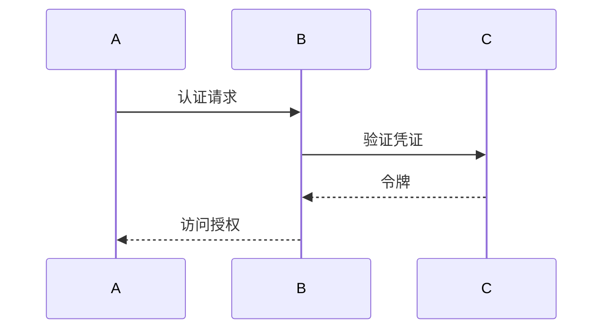

# 认证机制演进 特性跟踪

> 所属阶段: Flink/security/evolution | 前置依赖: [Authentication][^1] | 形式化等级: L3

## 1. 概念定义 (Definitions)

### Def-F-Auth-01: Authentication

身份认证：
$$
\text{AuthN} : \text{Credentials} \to \text{Identity} | \bot
$$

### Def-F-Auth-02: Multi-Factor Auth

多因素认证：
$$
\text{MFA} = \text{Password} + \text{Token} + \text{Biometric}
$$

## 2. 属性推导 (Properties)

### Prop-F-Auth-01: Token Expiry

令牌过期：
$$
T_{\text{token}} \leq 24h
$$

## 3. 关系建立 (Relations)

### 认证演进

| 版本 | 特性 | 状态 |
|------|------|------|
| 2.4 | Kerberos | GA |
| 2.5 | OAuth2 | GA |
| 3.0 | 无密码认证 | 设计中 |

## 4. 论证过程 (Argumentation)

### 4.1 认证方式

| 方式 | 安全级别 |
|------|----------|
| 密码 | 低 |
| Kerberos | 高 |
| OAuth2 | 高 |
| MFA | 最高 |

## 5. 形式证明 / 工程论证

### 5.1 Kerberos配置

```yaml
security.kerberos.login.use-ticket-cache: true
security.kerberos.login.keytab: /path/to/keytab
```

## 6. 实例验证 (Examples)

### 6.1 OAuth2集成

```java
OAuth2Client client = new OAuth2Client()
    .withClientId("flink")
    .withClientSecret("secret");
```

## 7. 可视化 (Visualizations)



## 8. 引用参考 (References)

[^1]: Flink Security Documentation

---

## 跟踪信息

| 属性 | 值 |
|------|-----|
| 版本 | 2.4-3.0 |
| 当前状态 | 演进中 |
