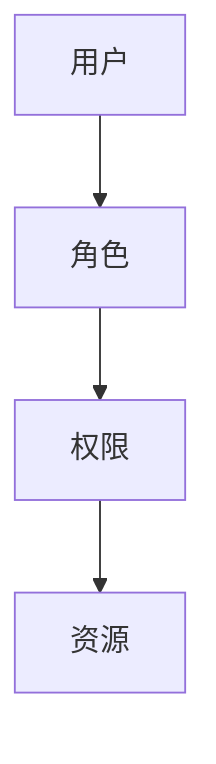

# 授权机制演进 特性跟踪

> 所属阶段: Flink/security/evolution | 前置依赖: [Authorization][^1] | 形式化等级: L3

## 1. 概念定义 (Definitions)

### Def-F-AuthZ-01: Authorization

授权：
$$
\text{AuthZ} : \langle \text{Identity}, \text{Resource}, \text{Action} \rangle \to \{\text{Allow}, \text{Deny}\}
$$

### Def-F-AuthZ-02: RBAC

基于角色的访问控制：
$$
\text{RBAC} = \langle \text{User}, \text{Role}, \text{Permission} \rangle
$$

## 2. 属性推导 (Properties)

### Prop-F-AuthZ-01: Least Privilege

最小权限：
$$
\text{Permissions} = \min(\text{Required})
$$

## 3. 关系建立 (Relations)

### 授权演进

| 版本 | 特性 | 状态 |
|------|------|------|
| 2.4 | 基础RBAC | GA |
| 2.5 | ABAC | GA |
| 3.0 | 动态授权 | 设计中 |

## 4. 论证过程 (Argumentation)

### 4.1 权限模型

| 模型 | 粒度 |
|------|------|
| ACL | 资源级 |
| RBAC | 角色级 |
| ABAC | 属性级 |

## 5. 形式证明 / 工程论证

### 5.1 RBAC配置

```yaml
roles: 
  - name: operator
    permissions: 
      - jobs:read
      - jobs:start
      - jobs:stop
```

## 6. 实例验证 (Examples)

### 6.1 权限检查

```java
// [伪代码片段 - 不可直接运行] 仅展示核心逻辑
if (authorizer.hasPermission(user, "jobs:cancel", jobId)) {
    cancelJob(jobId);
}
```

## 7. 可视化 (Visualizations)



## 8. 引用参考 (References)

[^1]: Flink Authorization Documentation

---

## 跟踪信息

| 属性 | 值 |
|------|-----|
| 版本 | 2.4-3.0 |
| 当前状态 | 演进中 |
