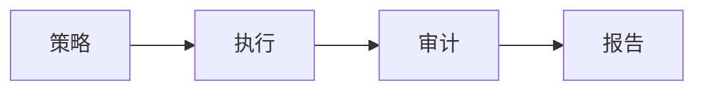

# 合规性演进 特性跟踪

> 所属阶段: Flink/security/evolution | 前置依赖: [Compliance][^1] | 形式化等级: L3

## 1. 概念定义 (Definitions)

### Def-F-Comp-01: Compliance Standard

合规标准：
$$
\text{Standard} \in \{\text{GDPR}, \text{HIPAA}, \text{SOC2}, \text{PCI-DSS}\}
$$

### Def-F-Comp-02: Data Governance

数据治理：
$$
\text{Governance} = \text{Policy} + \text{Enforcement} + \text{Audit}
$$

## 2. 属性推导 (Properties)

### Prop-F-Comp-01: Data Retention

数据保留：
$$
T_{\text{retention}} \leq \text{Policy}_{\text{max}}
$$

## 3. 关系建立 (Relations)

### 合规演进

| 版本 | 特性 | 状态 |
|------|------|------|
| 2.4 | 基础策略 | GA |
| 2.5 | 自动合规 | GA |
| 3.0 | 智能合规 | 设计中 |

## 4. 论证过程 (Argumentation)

### 4.1 合规检查

| 检查项 | 描述 |
|--------|------|
| 加密 | 数据加密 |
| 访问 | 访问控制 |
| 审计 | 操作日志 |
| 保留 | 数据生命周期 |

## 5. 形式证明 / 工程论证

### 5.1 合规配置

```yaml
compliance:
  gdpr:
    data_retention: 7y
    right_to_erasure: true
  hipaa:
    encryption_required: true
    audit_logging: true
```

## 6. 实例验证 (Examples)

### 6.1 数据分类

```java
@PII
private String ssn;

@Sensitive(level = HIGH)
private String creditCard;
```

## 7. 可视化 (Visualizations)



## 8. 引用参考 (References)

[^1]: GDPR/HIPAA Documentation

---

## 跟踪信息

| 属性 | 值 |
|------|-----|
| 版本 | 2.4-3.0 |
| 当前状态 | 演进中 |
