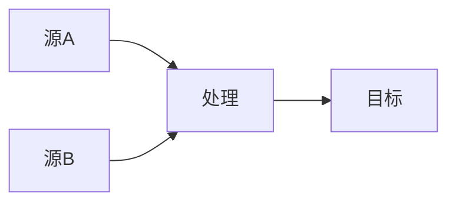

# 数据治理演进 特性跟踪

> 所属阶段: Flink/security/evolution | 前置依赖: [Data Governance][^1] | 形式化等级: L3

## 1. 概念定义 (Definitions)

### Def-F-Gov-01: Data Catalog

数据目录：
$$
\text{Catalog} = \{ (\text{Dataset}, \text{Metadata}, \text{Lineage}) \}
$$

### Def-F-Gov-02: Data Quality

数据质量：
$$
\text{Quality} = \frac{\text{ValidRecords}}{\text{TotalRecords}}
$$

## 2. 属性推导 (Properties)

### Prop-F-Gov-01: Data Lineage

数据血缘：
$$
\text{Lineage} : \text{Sink} \to \{\text{Sources}\}
$$

## 3. 关系建立 (Relations)

### 治理演进

| 版本 | 特性 | 状态 |
|------|------|------|
| 2.4 | 基础元数据 | GA |
| 2.5 | 血缘追踪 | GA |
| 3.0 | 智能治理 | 设计中 |

## 4. 论证过程 (Argumentation)

### 4.1 治理能力

| 能力 | 描述 |
|------|------|
| 发现 | 自动发现 |
| 分类 | 敏感识别 |
| 质量 | 规则检查 |
| 血缘 | 影响分析 |

## 5. 形式证明 / 工程论证

### 5.1 血缘追踪

```java
LineageRecorder.record(new DataLineage()
    .setSource("kafka.orders")
    .setTransform("enrich")
    .setSink("jdbc.results"));
```

## 6. 实例验证 (Examples)

### 6.1 质量规则

```yaml
data_quality: 
  rules: 
    - column: email
      pattern: ".*@.*\\..*"
    - column: age
      range: [0, 150]
```

## 7. 可视化 (Visualizations)



## 8. 引用参考 (References)

[^1]: Data Governance Documentation

---

## 跟踪信息

| 属性 | 值 |
|------|-----|
| 版本 | 2.4-3.0 |
| 当前状态 | 演进中 |
