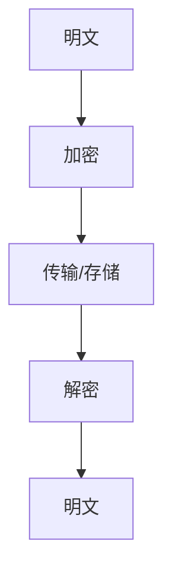

# 加密机制演进 特性跟踪

> 所属阶段: Flink/security/evolution | 前置依赖: [Encryption][^1] | 形式化等级: L3

## 1. 概念定义 (Definitions)

### Def-F-Enc-01: Encryption at Rest

静态加密：
$$
\text{Data}_{\text{rest}} = \text{Encrypt}(\text{Plaintext}, \text{Key})
$$

### Def-F-Enc-02: Encryption in Transit

传输加密：
$$
\text{Data}_{\text{transit}} = \text{TLS}(\text{Plaintext})
$$

## 2. 属性推导 (Properties)

### Prop-F-Enc-01: Key Rotation

密钥轮换：
$$
T_{\text{rotation}} \leq 90\text{days}
$$

## 3. 关系建立 (Relations)

### 加密演进

| 版本 | 特性 | 状态 |
|------|------|------|
| 2.4 | SSL/TLS | GA |
| 2.5 | 状态加密 | GA |
| 3.0 | 列级加密 | 设计中 |

## 4. 论证过程 (Argumentation)

### 4.1 加密层次

| 层次 | 机制 |
|------|------|
| 网络 | TLS 1.3 |
| 状态 | AES-256 |
| 配置 | Vault集成 |

## 5. 形式证明 / 工程论证

### 5.1 TLS配置

```yaml
security.ssl.algorithms: TLSv1.3
security.ssl.rest.enabled: true
security.ssl.internal.enabled: true
```

## 6. 实例验证 (Examples)

### 6.1 密钥管理

```java
// [伪代码片段 - 不可直接运行] 仅展示核心逻辑
KeyVault vault = KeyVault.create(config);
SecretKey key = vault.getKey("state-encryption");
```

## 7. 可视化 (Visualizations)



## 8. 引用参考 (References)

[^1]: Flink Encryption Documentation

---

## 跟踪信息

| 属性 | 值 |
|------|-----|
| 版本 | 2.4-3.0 |
| 当前状态 | 演进中 |
