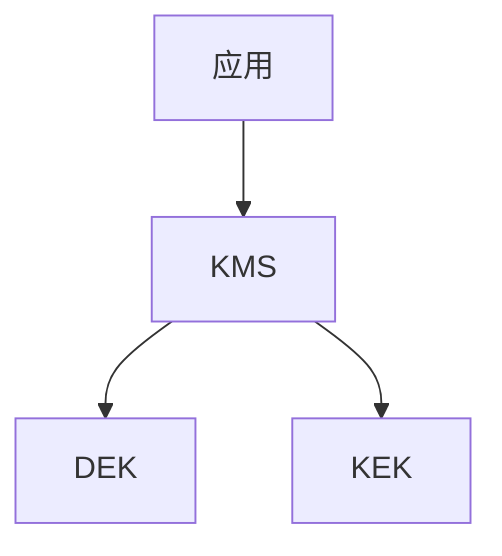

# 密钥管理演进 特性跟踪

> 所属阶段: Flink/security/evolution | 前置依赖: [Key Management][^1] | 形式化等级: L3

## 1. 概念定义 (Definitions)

### Def-F-Key-01: Key Hierarchy

密钥层次：
$$
\text{Keys} = \{\text{RootKey}, \text{DEK}, \text{KEK}\}
$$

### Def-F-Key-02: Key Rotation

密钥轮换：
$$
\text{Rotation} : \text{Key}_{\text{old}} \to \text{Key}_{\text{new}}
$$

## 2. 属性推导 (Properties)

### Prop-F-Key-01: Key Separation

密钥分离：
$$
\text{Key}_i \perp \text{Key}_j
$$

## 3. 关系建立 (Relations)

### 密钥演进

| 版本 | 特性 | 状态 |
|------|------|------|
| 2.4 | 文件密钥 | GA |
| 2.5 | KMS集成 | GA |
| 3.0 | HSM支持 | 设计中 |

## 4. 论证过程 (Argumentation)

### 4.1 KMS集成

| 服务 | 状态 |
|------|------|
| AWS KMS | 集成 |
| Azure Key Vault | 集成 |
| HashiCorp Vault | 集成 |

## 5. 形式证明 / 工程论证

### 5.1 Vault集成

```java
// [伪代码片段 - 不可直接运行] 仅展示核心逻辑
Vault vault = Vault.builder()
    .address("https://vault:8200")
    .token(token)
    .build();

SecretKey key = vault.logical()
    .read("secret/flink-key")
    .getData();
```

## 6. 实例验证 (Examples)

### 6.1 自动轮换

```yaml
security.key.rotation.enabled: true
security.key.rotation.period: 90d
```

## 7. 可视化 (Visualizations)



## 8. 引用参考 (References)

[^1]: Vault Documentation

---

## 跟踪信息

| 属性 | 值 |
|------|-----|
| 版本 | 2.4-3.0 |
| 当前状态 | 演进中 |

---

*文档版本: v1.0 | 创建日期: 2026-04-20*
