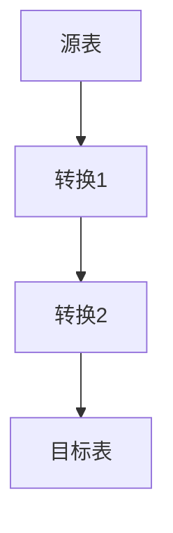

# 数据血缘演进 特性跟踪

> 所属阶段: Flink/security/evolution | 前置依赖: [Data Lineage][^1] | 形式化等级: L3

## 1. 概念定义 (Definitions)

### Def-F-Lineage-01: Data Lineage

数据血缘：
$$
\text{Lineage} = \text{Source} \xrightarrow{\text{Transform}} \text{Target}
$$

### Def-F-Lineage-02: Column Lineage

列级血缘：
$$
\text{ColumnLineage} : \text{OutputCol} \to \{\text{InputCols}\}
$$

## 2. 属性推导 (Properties)

### Prop-F-Lineage-01: Completeness

完整性：
$$
\text{Coverage} > 0.95
$$

## 3. 关系建立 (Relations)

### 血缘演进

| 版本 | 特性 | 状态 |
|------|------|------|
| 2.4 | 表级血缘 | GA |
| 2.5 | 列级血缘 | GA |
| 3.0 | 细粒度血缘 | 设计中 |

## 4. 论证过程 (Argumentation)

### 4.1 血缘粒度

| 粒度 | 精度 |
|------|------|
| 表级 | 粗 |
| 列级 | 中 |
| 行级 | 细 |

## 5. 形式证明 / 工程论证

### 5.1 血缘收集

```java
LineageContext ctx = LineageContext.current();
ctx.recordRelation("users.id", "orders.user_id");
```

## 6. 实例验证 (Examples)

### 6.1 血缘查询

```sql
-- 查询血缘
SELECT * FROM lineage
WHERE target_table = 'orders_summary';
```

## 7. 可视化 (Visualizations)



## 8. 引用参考 (References)

[^1]: OpenLineage Documentation

---

## 跟踪信息

| 属性 | 值 |
|------|-----|
| 版本 | 2.4-3.0 |
| 当前状态 | 演进中 |
