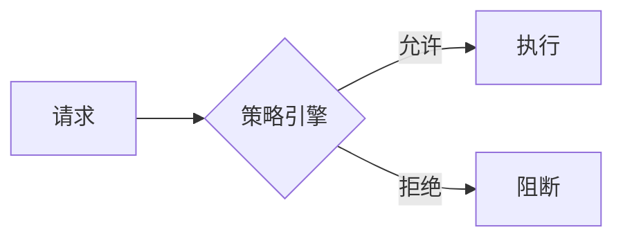

# 安全策略演进 特性跟踪

> 所属阶段: Flink/security/evolution | 前置依赖: [Security Policy][^1] | 形式化等级: L3

## 1. 概念定义 (Definitions)

### Def-F-Policy-01: Security Policy

安全策略：
$$
\text{Policy} = \langle \text{Rule}, \text{Action}, \text{Priority} \rangle
$$

### Def-F-Policy-02: Policy as Code

策略即代码：
$$
\text{Policy} \in \text{Code} \xrightarrow{\text{CI/CD}} \text{Runtime}
$$

## 2. 属性推导 (Properties)

### Prop-F-Policy-01: Enforcement

策略执行：
$$
\forall \text{Action} : \text{Check}(\text{Policy})
$$

## 3. 关系建立 (Relations)

### 策略演进

| 版本 | 特性 | 状态 |
|------|------|------|
| 2.4 | 静态策略 | GA |
| 2.5 | 动态策略 | GA |
| 3.0 | 智能策略 | 设计中 |

## 4. 论证过程 (Argumentation)

### 4.1 策略类型

| 类型 | 描述 |
|------|------|
| 访问策略 | 谁能做什么 |
| 数据策略 | 数据如何使用 |
| 网络策略 | 通信限制 |

## 5. 形式证明 / 工程论证

### 5.1 OPA集成

```rego
package flink.authz

default allow = false

allow {
    input.user.role == "admin"
}
```

## 6. 实例验证 (Examples)

### 6.1 策略定义

```yaml
policies:
  - name: restrict-sensitive
    condition: data.classification == "sensitive"
    action: deny
    except: [role:admin]
```

## 7. 可视化 (Visualizations)



## 8. 引用参考 (References)

[^1]: Open Policy Agent Documentation

---

## 跟踪信息

| 属性 | 值 |
|------|-----|
| 版本 | 2.4-3.0 |
| 当前状态 | 演进中 |

---

*文档版本: v1.0 | 创建日期: 2026-04-20*
