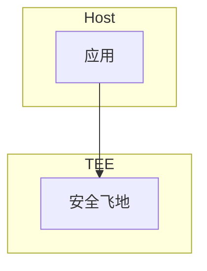

> **状态**: 🔮 前瞻内容 | **风险等级**: 高 | **最后更新**: 2026-04
>
> 此文档描述的内容处于早期规划阶段，可能与最终实现不符。请以 Apache Flink 官方发布为准。
>
# 可信执行环境演进 特性跟踪

> 所属阶段: Flink/security/evolution | 前置依赖: [TEE][^1] | 形式化等级: L3

## 1. 概念定义 (Definitions)

### Def-F-TEE-01: Trusted Execution Environment

可信执行环境：
$$
\text{TEE} = \text{Isolated} + \text{Attested} + \text{Secure}
$$

### Def-F-TEE-02: Secure Enclave

安全飞地：
$$
\text{Enclave} : \text{Code} + \text{Data} \to \text{Protected}
$$

## 2. 属性推导 (Properties)

### Prop-F-TEE-01: Memory Isolation

内存隔离：
$$
\text{EnclaveMemory} \perp \text{HostMemory}
$$

## 3. 关系建立 (Relations)

### TEE演进

| 版本 | 特性 | 状态 |
|------|------|------|
| 2.4 | 无 | - |
| 2.5 | SGX实验 | Preview |
| 3.0 | 多TEE支持 | 设计中 |

## 4. 论证过程 (Argumentation)

### 4.1 TEE技术

| 技术 | 厂商 |
|------|------|
| SGX | Intel |
| SEV | AMD |
| TrustZone | ARM |

## 5. 形式证明 / 工程论证

### 5.1 SGX执行

```java
// [伪代码片段 - 不可直接运行] 仅展示核心逻辑
Enclave enclave = EnclaveLoader.load("enclave.so");
byte[] result = enclave.execute(input);
```

## 6. 实例验证 (Examples)

### 6.1 敏感计算

```java
// [伪代码片段 - 不可直接运行] 仅展示核心逻辑
// 在TEE中处理敏感数据
EnclaveResult result = teeExecutor.execute(() -> {
    return processSensitiveData(data);
});
```

## 7. 可视化 (Visualizations)



## 8. 引用参考 (References)

[^1]: Intel SGX Documentation

---

## 跟踪信息

| 属性 | 值 |
|------|-----|
| 版本 | 2.5-3.0 |
| 当前状态 | 实验性 |
