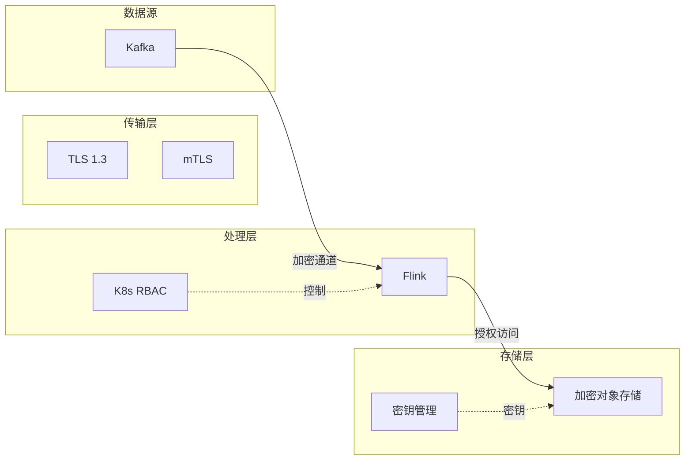
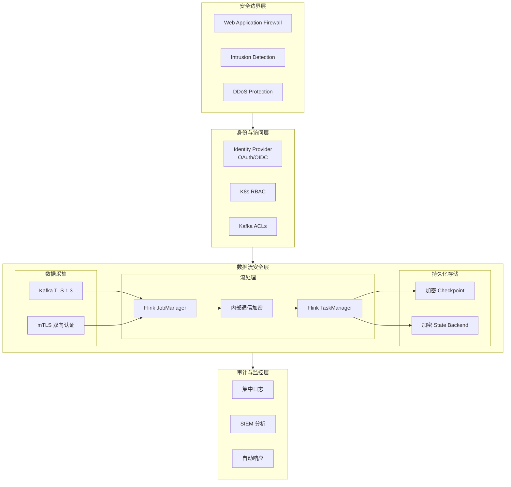
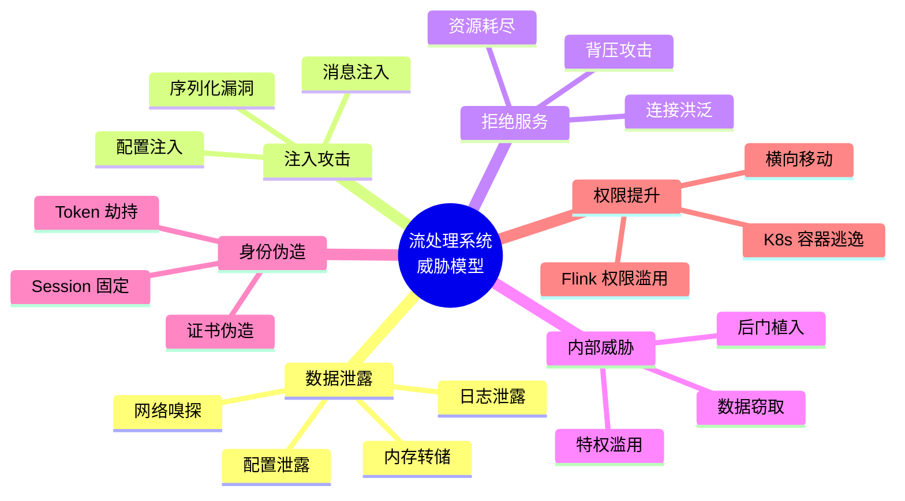
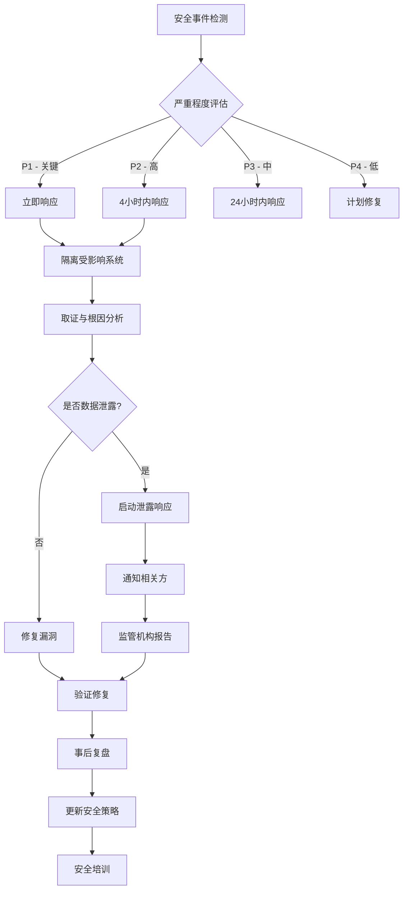
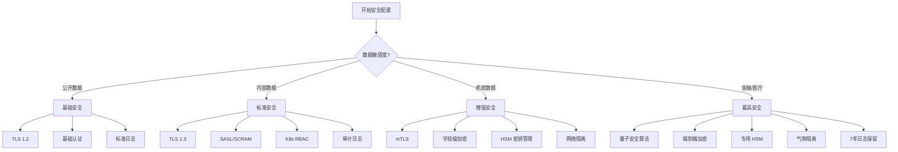

# 流处理安全最佳实践指南

> **状态**: 前瞻 | **预计发布时间**: 2026-Q3 | **最后更新**: 2026-04-12
>
> ⚠️ 本文档描述的特性处于早期讨论阶段，尚未正式发布。实现细节可能变更。

> **所属阶段**: Flink | **前置依赖**: [Flink 安全强化指南](./security-hardening-guide.md), [Flink 2.4安全增强](./flink-24-security-enhancements.md) | **形式化等级**: L3

---

## 1. 概念定义 (Definitions)

### Def-F-13-01: 流处理安全威胁模型

**流处理安全威胁模型** (Streaming Security Threat Model) 是描述流计算系统中潜在安全威胁、攻击向量和防御策略的形式化框架。

设流处理系统为 $\mathcal{S} = (P, D, C, N)$，其中：

- $P$: 处理组件集合（Flink JobManager/TaskManager）
- $D$: 数据流集合（Kafka Topic, State Store）
- $C$: 控制平面集合（K8s API, Flink REST）
- $N$: 网络拓扑集合

**威胁分类** (STRIDE for Streaming):

| 威胁类型 | 攻击向量 | 影响等级 |
|---------|---------|---------|
| **数据泄露** (Information Disclosure) | 网络嗅探、配置泄露、日志泄露 | 严重 |
| **注入攻击** (Injection) | 恶意消息、SQL注入、代码注入 | 严重 |
| **拒绝服务** (DoS) | 资源耗尽、背压攻击、连接洪泛 | 高 |
| **内部威胁** (Insider Threat) | 特权滥用、数据窃取、配置篡改 | 高 |
| **身份伪造** (Spoofing) | 伪造生产者、消费者身份 | 中 |
| **权限提升** (Elevation) | K8s 逃逸、Flink 权限滥用 | 严重 |

### Def-F-13-02: 数据安全边界

**数据安全边界** (Data Security Boundary) 定义了流数据生命周期中的安全控制点：

$$
\text{Boundary} = \{ \text{Ingestion}, \text{Processing}, \text{Storage}, \text{Egress} \}
$$

**Def-F-13-03: 纵深防御原则**

纵深防御 (Defense in Depth) 要求在每个安全边界部署**独立且冗余**的控制措施：

$$
\forall b \in \text{Boundary}, \exists \phi_b: \text{DefenseLevel}(b) \geq 2
$$

---

## 2. 属性推导 (Properties)

### Lemma-F-13-01: 最小权限原则的传递性

**引理**: 若流处理组件 $c_1$ 以最小权限访问数据源 $s$，且 $c_2$ 以最小权限访问 $c_1$ 的输出，则整个链路满足最小权限。

**证明**: 设 $R(c)$ 为组件 $c$ 的实际权限，$R_{\min}(c)$ 为最小必要权限。

- 由假设: $R(c_1) = R_{\min}(c_1)$ 且 $R(c_2) = R_{\min}(c_2)$
- 组件 $c_2$ 只能通过 $c_1$ 的输出访问数据
- 因此: $R_{\text{chain}} = R(c_1) \cap R(c_2) = R_{\min}(c_1) \cap R_{\min}(c_2)$
- 即链路权限不超过任一组件 $\square$

### Lemma-F-13-02: 加密开销上界

**引理**: 启用 TLS 加密对流处理延迟的影响存在上界：

$$
\Delta_{\text{latency}} \leq T_{\text{handshake}} + \frac{L_{\text{record}}}{B_{\text{encrypted}}} - \frac{L_{\text{record}}}{B_{\text{plaintext}}}
$$

**工程意义**: 在千兆网络环境下，TLS 开销通常 < 5%，可通过连接复用进一步降低。

### Lemma-F-13-03: 审计完整性

**引理**: 完整审计日志系统满足不可抵赖性 (Non-repudiation) 当且仅当：

1. 日志生成与主体身份强绑定
2. 日志存储不可篡改 (WORM 存储)
3. 日志时间戳可信同步 (NTP/PTP)

---

## 3. 关系建立 (Relations)

### 3.1 与零信任架构的关系

流处理系统与零信任 (Zero Trust) 原则的映射：

| 零信任原则 | 流处理实现 |
|-----------|-----------|
| 永不信任，始终验证 | mTLS 双向认证、动态令牌 |
| 最小权限访问 | Kafka ACL、K8s RBAC |
| 假设已失陷 | 微分段、网络策略 |
| 持续验证 | 实时监控、异常检测 |

### 3.2 与合规框架的关系

```
GDPR/CCPA         NIST 800-53        SOC 2
   |                   |                |
   v                   v                v
数据分类 ──→ 访问控制 ──→ 审计日志 ──→ 合规报告
   ↑                   ↑                ↑
加密保护 ←── 密钥管理 ←── 监控告警 ←── 持续改进
```

### 3.3 安全控制与数据流的关系



---

## 4. 论证过程 (Argumentation)

### 4.1 纵深防御策略论证

**威胁**: 攻击者试图窃取流处理中的敏感数据

**防御层次**:

```
┌─────────────────────────────────────────────────────────────┐
│  Layer 5: 应用层加密 (字段级加密)                              │
│  ─────────────────────────────────────────────────────────  │
│  Layer 4: 传输层加密 (TLS 1.3)                                │
│  ─────────────────────────────────────────────────────────  │
│  Layer 3: 网络隔离 (VPC/NetworkPolicy)                       │
│  ─────────────────────────────────────────────────────────  │
│  Layer 2: 访问控制 (RBAC/ACL)                                 │
│  ─────────────────────────────────────────────────────────  │
│  Layer 1: 身份认证 (mTLS/OAuth)                               │
└─────────────────────────────────────────────────────────────┘
```

**论证**: 即使攻击者突破 Layer 1-3，仍需要破解 Layer 4-5 才能获取明文数据，满足纵深防御要求。

### 4.2 密钥轮换策略分析

**策略对比**:

| 策略 | 实现复杂度 | 安全增益 | 可用性影响 |
|-----|-----------|---------|-----------|
| 静态密钥 | 低 | 低 | 无 |
| 定期轮换 (90天) | 中 | 中 | 短暂中断 |
| 动态轮换 (按需) | 高 | 高 | 无感知 |
| 自动应急轮换 | 高 | 最高 | 可控中断 |

**推荐**: 生产环境采用动态轮换 + 自动应急轮换的组合策略。

---

## 5. 形式证明 / 工程论证 (Proof / Engineering Argument)

### Thm-F-13-01: 安全配置完备性定理

**定理**: 给定流处理系统 $\mathcal{S}$，若满足以下条件，则系统达到生产级安全标准：

1. **传输安全**: $\forall e \in \text{Edges}(\mathcal{S}), \text{Encrypted}(e)$
2. **认证完备**: $\forall c \in \text{Components}(\mathcal{S}), \text{Authenticated}(c)$
3. **授权最小化**: $\forall p \in \text{Permissions}, |p| = |p_{\min}|$
4. **审计完整**: $\forall a \in \text{Actions}, \text{Logged}(a) \land \text{Immutable}(\text{Log}(a))$
5. **隔离有效**: $\forall z \in \text{Zones}, \text{Isolated}(z)$

**工程论证**: 该定理为安全配置提供了可验证的检查清单，每个条件对应具体的技术实现。

### Thm-F-13-02: 安全-性能权衡定理

**定理**: 在流处理系统中，安全强度 $S$ 与性能 $P$ 存在近似反比关系：

$$
P \approx \frac{P_{\max}}{1 + \alpha \cdot S}
$$

其中 $\alpha$ 为系统相关的安全系数。

**工程意义**: 安全加固不应追求理论最大值，而应找到满足合规要求与业务 SLA 的平衡点。

---

## 6. 实例验证 (Examples)

### 6.1 Kafka TLS/SSL 生产配置

```yaml
# kafka-server.properties
# TLS 1.3 配置 listeners=SASL_SSL://:9093
security.inter.broker.protocol=SASL_SSL
ssl.enabled.protocols=TLSv1.3
ssl.protocol=TLS

# 证书配置 ssl.keystore.location=/etc/kafka/keystore.p12
ssl.keystore.password=${KAFKA_SSL_KEYSTORE_PASSWORD}
ssl.key.password=${KAFKA_SSL_KEY_PASSWORD}
ssl.truststore.location=/etc/kafka/truststore.p12
ssl.truststore.password=${KAFKA_SSL_TRUSTSTORE_PASSWORD}

# 客户端认证(双向 TLS)
ssl.client.auth=required

# SASL 配置 sasl.enabled.mechanisms=SCRAM-SHA-512
sasl.mechanism.inter.broker.protocol=SCRAM-SHA-512
```

### 6.2 Flink SSL 内部通信配置

```yaml
# flink-conf.yaml
# 内部通信加密 security.ssl.internal.enabled: true
security.ssl.internal.keystore: /opt/flink/ssl/flink.keystore
security.ssl.internal.keystore-password: ${FLINK_KEYSTORE_PASSWORD}
security.ssl.internal.key-password: ${FLINK_KEY_PASSWORD}
security.ssl.internal.truststore: /opt/flink/ssl/flink.truststore
security.ssl.internal.truststore-password: ${FLINK_TRUSTSTORE_PASSWORD}

# 算法选择(性能优化)
security.ssl.internal.protocol: TLSv1.3
security.ssl.internal.algorithms: TLS_AES_256_GCM_SHA384,TLS_AES_128_GCM_SHA256

# REST API HTTPS security.ssl.rest.enabled: true
security.ssl.rest.keystore: /opt/flink/ssl/rest.keystore
security.ssl.rest.keystore-password: ${REST_KEYSTORE_PASSWORD}
```

### 6.3 Kafka ACL 配置示例

```bash
# 创建 SASL/SCRAM 用户 kafka-configs.sh --bootstrap-server kafka:9093 \
  --alter --add-config 'SCRAM-SHA-512=[password=secure-password]' \
  --entity-type users --entity-name flink-producer

# 设置 Topic ACL - 生产者权限 kafka-acls.sh --bootstrap-server kafka:9093 \
  --add --allow-principal User:flink-producer \
  --operation Write --operation Describe \
  --topic 'events.*'

# 设置 Topic ACL - 消费者权限 kafka-acls.sh --bootstrap-server kafka:9093 \
  --add --allow-principal User:flink-consumer \
  --operation Read --operation Describe \
  --topic 'events.input' --group 'flink-consumer-group'

# 拒绝规则(显式拒绝优于隐式)
kafka-acls.sh --bootstrap-server kafka:9093 \
  --add --deny-principal User:untrusted-app \
  --operation All --topic '*'
```

### 6.4 Kubernetes RBAC 配置

```yaml
# flink-operator-rbac.yaml apiVersion: v1
kind: ServiceAccount
metadata:
  name: flink-operator
  namespace: flink-jobs
automountServiceAccountToken: false  # 安全最佳实践
---
apiVersion: rbac.authorization.k8s.io/v1
kind: Role
metadata:
  name: flink-operator-role
  namespace: flink-jobs
rules:
  # 最小权限 - 仅必要的资源
  - apiGroups: ["apps"]
    resources: ["deployments"]
    verbs: ["get", "list", "watch", "create", "update", "patch", "delete"]
  - apiGroups: [""]
    resources: ["pods", "services", "configmaps"]
    verbs: ["get", "list", "watch", "create", "update", "patch", "delete"]
  - apiGroups: ["flink.apache.org"]
    resources: ["flinkdeployments", "flinksessionjobs"]
    verbs: ["get", "list", "watch", "create", "update", "patch", "delete"]
  # 显式排除敏感权限
  # - resources: ["secrets"]  # 不允许访问 secrets
---
apiVersion: rbac.authorization.k8s.io/v1
kind: RoleBinding
metadata:
  name: flink-operator-binding
  namespace: flink-jobs
subjects:
  - kind: ServiceAccount
    name: flink-operator
    namespace: flink-jobs
roleRef:
  kind: Role
  name: flink-operator-role
  apiGroup: rbac.authorization.k8s.io
```

### 6.5 Checkpoint 加密配置

```java

// [伪代码片段 - 不可直接运行] 仅展示核心逻辑
import org.apache.flink.streaming.api.CheckpointingMode;

// Flink Checkpoint 加密配置
CheckpointConfig checkpointConfig = env.getCheckpointConfig();

// 启用 Checkpoint 加密
EncryptedCheckpointStorage encryptedStorage =
    new EncryptedCheckpointStorage(
        "hdfs://checkpoint/path",
        new AES256EncryptionProvider()  // 256-bit AES
    );

checkpointConfig.setCheckpointStorage(encryptedStorage);

// 使用外部 KMS 管理密钥
checkpointConfig.setCheckpointingMode(CheckpointingMode.EXACTLY_ONCE);
checkpointConfig.setCheckpointInterval(60000);
checkpointConfig.setCheckpointTimeout(600000);
checkpointConfig.setExternalizedCheckpointCleanup(
    ExternalizedCheckpointCleanup.RETAIN_ON_CANCELLATION
);
```

### 6.6 NetworkPolicy 网络隔离

```yaml
# flink-network-policy.yaml apiVersion: networking.k8s.io/v1
kind: NetworkPolicy
metadata:
  name: flink-jobmanager-policy
  namespace: flink-jobs
spec:
  podSelector:
    matchLabels:
      app: flink-jobmanager
  policyTypes:
    - Ingress
    - Egress
  ingress:
    # 仅允许来自 Web UI 的流量
    - from:
        - namespaceSelector:
            matchLabels:
              name: ingress-nginx
      ports:
        - protocol: TCP
          port: 8081  # Flink Web UI
    # 允许 TaskManager 连接
    - from:
        - podSelector:
            matchLabels:
              app: flink-taskmanager
      ports:
        - protocol: TCP
          port: 6123  # JobManager RPC
  egress:
    # 仅允许连接到 Kafka
    - to:
        - podSelector:
            matchLabels:
              app: kafka
      ports:
        - protocol: TCP
          port: 9093  # Kafka SSL
    # DNS 查询
    - to:
        - namespaceSelector: {}
      ports:
        - protocol: UDP
          port: 53
---
apiVersion: networking.k8s.io/v1
kind: NetworkPolicy
metadata:
  name: flink-taskmanager-policy
  namespace: flink-jobs
spec:
  podSelector:
    matchLabels:
      app: flink-taskmanager
  policyTypes:
    - Ingress
    - Egress
  ingress:
    # 仅允许 JobManager 连接
    - from:
        - podSelector:
            matchLabels:
              app: flink-jobmanager
  egress:
    # 允许连接到 JobManager
    - to:
        - podSelector:
            matchLabels:
              app: flink-jobmanager
    # 允许连接到 Kafka
    - to:
        - podSelector:
            matchLabels:
              app: kafka
```

### 6.7 金融级安全配置清单

```yaml
# production-security-checklist.yaml security_profile: financial_grade
compliance: [PCI-DSS, SOC2, ISO27001]

transport_security:
  tls_version: "1.3"
  cipher_suites:
    - TLS_AES_256_GCM_SHA384
    - TLS_AES_128_GCM_SHA256
  mutual_tls: required
  certificate_validity_days: 90
  auto_rotation: enabled

authentication:
  kafka: SCRAM-SHA-512
  flink_ui: OAuth2/OIDC
  k8s_api: short-lived-tokens
  admin_access: MFA_required

authorization:
  kafka_acls: enabled
  k8s_rbac: strict
  least_privilege: enforced
  regular_audit: monthly

encryption_at_rest:
  checkpoints: AES-256-GCM
  state_backend: encrypted
  log_files: encrypted
  key_management: AWS-KMS/Azure-KeyVault

audit_logging:
  flink_audit: enabled
  k8s_audit: enabled
  kafka_audit: enabled
  log_retention_days: 2555  # 7 years
  tamper_protection: enabled

network_security:
  network_policies: strict
  service_mesh: enabled
  egress_filtering: whitelist_only
  ingress_controller: waf_enabled

monitoring:
  security_alerts: real_time
  anomaly_detection: ML_based
  incident_response: automated
  penetration_testing: quarterly
```

---

## 7. 可视化 (Visualizations)

### 7.1 流处理安全架构全景图



### 7.2 威胁模型图 (STRIDE)



### 7.3 安全事件响应流程



### 7.4 安全配置决策树



---

## 8. 引用参考 (References)


---

*文档版本: v1.0 | 最后更新: 2026-04-02 | 状态: 已完成*
