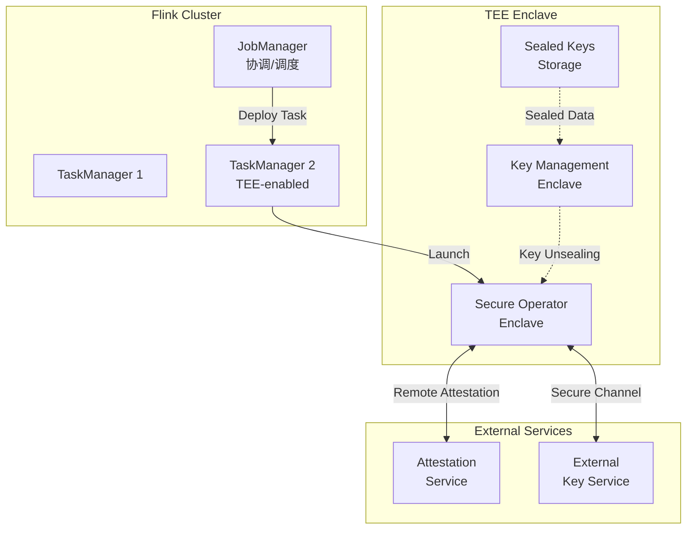
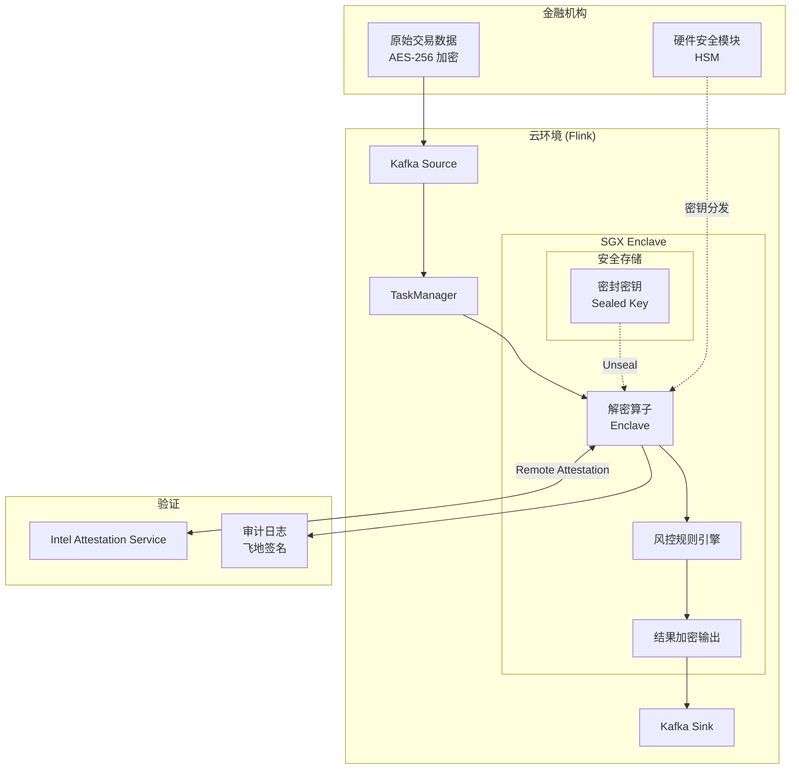
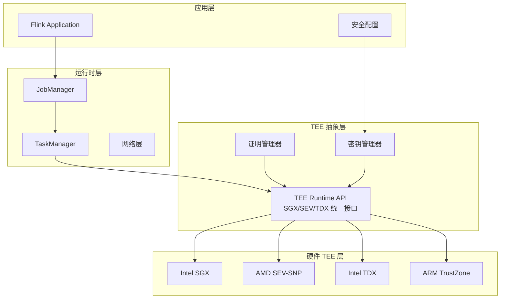
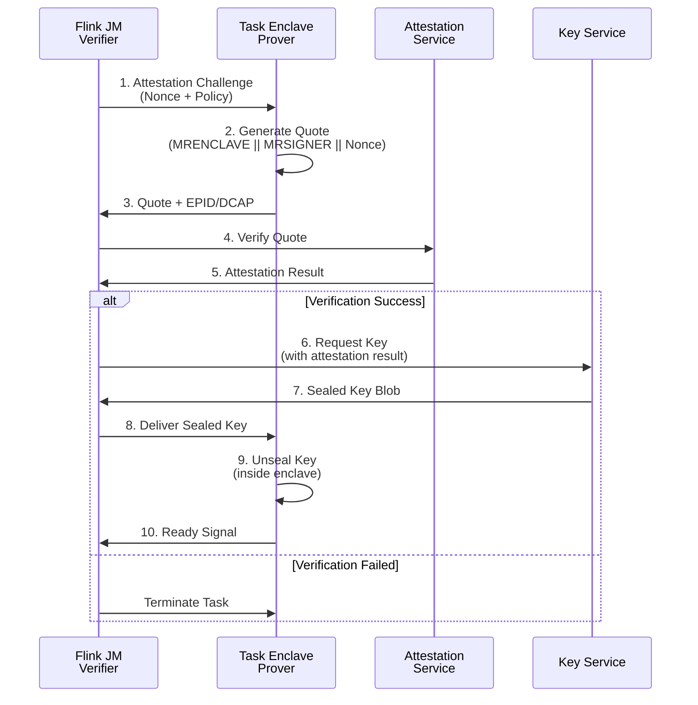
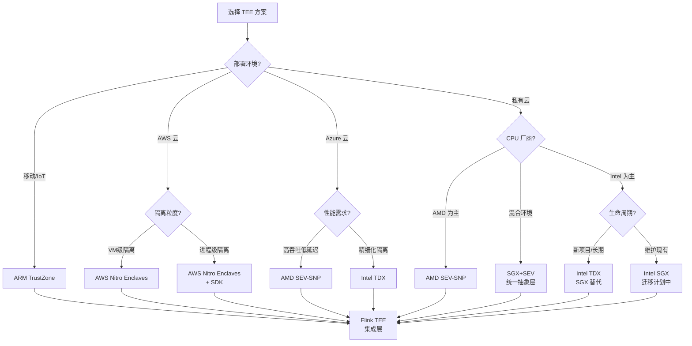

# Flink 可信执行环境 — Intel SGX/AMD SEV/ARM TrustZone

> 所属阶段: Flink/Security | 前置依赖: [Flink 安全特性](flink-security-complete-guide.md) | 形式化等级: L3-L4

## 1. 概念定义 (Definitions)

### Def-F-13-04: 可信执行环境 (Trusted Execution Environment, TEE)

**形式化定义**:

一个可信执行环境 TEE 是计算平台上具备以下性质的隔离执行域：

$$\text{TEE} = (M_{secure}, C_{trust}, A_{attest}, K_{bound})$$

其中：

- $M_{secure}$: 受硬件保护的内存区域，对操作系统和 Hypervisor 不可访问
- $C_{trust}$: 可信计算基 (TCB)，包含硬件和最小化固件
- $A_{attest}$: 远程证明机制，向外部验证者证明飞地的完整性
- $K_{bound}$: 密钥绑定机制，确保加密密钥仅对特定飞地配置可访问

**安全保证**:

| 保证 | 描述 |
|------|------|
| 机密性 (Confidentiality) | 外部实体无法读取飞地内存内容 |
| 完整性 (Integrity) | 外部实体无法篡改飞地代码/数据 |
| 可验证性 (Verifiability) | 远程方可以密码学验证飞地状态 |

**直观解释**: TEE 是 CPU 内部的"黑匣子"——即使操作系统被攻破、云管理员恶意操作，飞地内的计算和数据仍然安全。

---

### Def-F-13-05: 飞地 (Enclave)

**形式化定义**:

飞地是 TEE 内的最小执行单元：

$$\text{Enclave} = (C_{code}, D_{sealed}, E_{entry}, P_{perm})$$

其中：

- $C_{code}$: 飞地内执行的受信代码
- $D_{sealed}$: 密封存储的持久化数据（绑定至飞地身份）
- $E_{entry}$: 受控入口点集合（ECALL/OCALL 接口）
- $P_{perm}$: 权限策略（内存访问、系统调用限制）

**飞地生命周期状态机**:

```
[CREATED] → [INITIALIZED] → [RUNNING] → [DESTROYED]
               ↓                ↓
            [SEALED]        [SUSPENDED]
```

**接口约束**:

- ECALL (Enclave Call): 外部 → 飞地，严格类型检查
- OCALL (Outside Call): 飞地 → 外部，受限系统调用

---

### Def-F-13-06: 远程证明 (Remote Attestation)

**形式化定义**:

远程证明是证明者 (Prover) 向验证者 (Verifier) 证明飞地完整性的协议：

$$\text{RA} = (P_{prover}, V_{verifier}, C_{challenge}, R_{quote}, V_{policy})$$

**证明流程**:

```
┌─────────────┐                    ┌─────────────┐
│  Verifier   │ ──── Challenge ───→│   Prover    │
│  (Flink JM) │                    │  (Task Enclave)
└─────────────┘                    └─────────────┘
       ↑                                  │
       └────── Quote + Evidence ─────────┘
                      │
                      ↓
              ┌─────────────┐
              │  Attestation  │
              │   Service     │
              │  (Intel PCS/  │
              │   AMD ASP)    │
              └─────────────┘
```

**Quote 结构**:

| 字段 | 说明 |
|------|------|
| MRENCLAVE | 飞地代码/数据的哈希度量 |
| MRSIGNER | 飞地签名者身份 |
| ISVPRODID | 产品 ID |
| ISVSVN | 安全版本号 |
| REPORTDATA | 应用层绑定数据 |

---

### Def-F-13-07: 安全通道建立 (Secure Channel Establishment)

**形式化定义**:

基于远程证明结果建立端到端加密通道：

$$\text{SC} = \text{RA} \circ \text{TLS} \circ \text{KDF}(R_{quote}, N_{ephemeral})$$

**密钥派生过程**:

```
┌─────────────────┐
│  Quote REPORTDATA│ ← 包含临时公钥哈希
└────────┬────────┘
         ↓
┌─────────────────┐
│  Verify Quote   │ ← 验证 MRENCLAVE/MRSIGNER
└────────┬────────┘
         ↓
┌─────────────────┐
│  ECDH Key Exchange│
└────────┬────────┘
         ↓
┌─────────────────┐
│  HKDF-SHA256    │ ← 导出会话密钥
└────────┬────────┘
         ↓
   [Application Data]
```

**安全属性**: 前向保密、身份绑定、中间人防护

---

## 2. 属性推导 (Properties)

### Prop-F-13-02: TEE 安全边界定理

**命题**: 在 TEE 威胁模型下，即使攻击者控制以下组件，飞地内计算仍保持机密性和完整性：

$$\text{Attacker} \in \{\text{OS}, \text{Hypervisor}, \text{BIOS}, \text{Admin}, \text{Network}\}$$

**证明概要**:

1. 硬件内存加密：$M_{secure}$ 内容由 CPU 内存加密引擎保护
2. 访问控制：CPU 禁止非飞地代码访问 $M_{secure}$
3. 度量链：从硬件根信任开始，逐级度量至飞地启动
4. 远程证明：外部验证者通过密码学验证飞地状态

### Prop-F-13-03: 数据密封绑定定理

**命题**: 密封数据 $D_{sealed}$ 只能由满足以下条件的飞地解密：

$$\text{Decrypt}(D_{sealed}) \Rightarrow \text{MRENCLAVE} = H(C_{expected}) \lor \text{MRSIGNER} \in \text{TrustedSigners}$$

**工程意义**: 允许基于代码身份（精确匹配）或签名者身份（策略信任）的访问控制。

### Lemma-F-13-01: 侧信道抵抗引理

**引理**: 标准 TEE 实现**不保证**抵抗以下攻击：

- 缓存时序侧信道（Cache Timing）
- 功耗分析（Power Analysis）
- 内存访问模式分析（Access Pattern）

**缓解策略**: 常量时间算法、ORAM、随机化执行

---

## 3. 关系建立 (Relations)

### 3.1 TEE 技术对比矩阵

| 特性 | Intel SGX | AMD SEV-SNP | ARM TrustZone | Intel TDX | AWS Nitro Enclaves |
|------|:---------:|:-----------:|:-------------:|:---------:|:------------------:|
| **隔离粒度** | 进程级 | VM级 | 双世界 | VM级 | 进程级 (Enclave) |
| **内存容量** | 128MB-1GB (EPC) | 无限制 | 受TrustZone内存限制 | 无限制 | 受实例限制 |
| **TCB 大小** | 小 (CPU+uCode) | 较大 (CPU+SEV FW) | 中等 (Secure World SW) | 较大 (TDX Module) | 小 (Nitro Hypervisor) |
| **云厂商支持** | Azure Confidential Computing | Azure/AWS/GCP | 移动/IoT专用 | Azure/AWS (预览) | AWS Only |
| **状态** | 已弃用 (2024) | 主流 | 活跃 | SGX 替代方案 | AWS 专用 |
| **证明服务** | Intel PCS | AMD ASP | 设备制造商 | Intel TDX Service | AWS Nitro TPM |

### 3.2 Flink 与 TEE 集成架构



### 3.3 TEE 与 Flink 安全机制映射

| Flink 安全需求 | TEE 解决方案 | 实现方式 |
|---------------|-------------|---------|
| 数据加密 | 内存加密 + 密封存储 | Enclave 内 AES-GCM |
| 密钥保护 | 飞地绑定密钥 | Sealing Key 派生 |
| 算子完整性 | MRENCLAVE 验证 | 部署前 Quote 校验 |
| 审计日志 | 防篡改日志 | 飞地内签名 |
| 通信安全 | 基于证明的 TLS | RA-TLS 握手 |

---

## 4. 论证过程 (Argumentation)

### 4.1 威胁模型分析

**Dolev-Yao 风格攻击者能力**:

```
┌─────────────────────────────────────────────────────────────┐
│                     攻击者能力层级                          │
├─────────────────────────────────────────────────────────────┤
│ L1: 网络攻击者      → 被动监听/主动篡改流量                    │
│ L2: 系统用户        → 普通系统权限,无 root                   │
│ L3: 系统管理员      → root 权限,可访问所有内存               │
│ L4: 云管理员        → Hypervisor 控制,可暂停/迁移 VM         │
│ L5: 硬件攻击者      → 物理访问,侧信道分析                    │
└─────────────────────────────────────────────────────────────┘
```

**TEE 防护边界**: 有效防护至 L4（云管理员），L5 需要额外物理防护。

### 4.2 实现复杂度权衡

| 方案 | 复杂度 | 性能开销 | 适用场景 |
|------|--------|----------|----------|
| 全量算子飞地 | 高 | 20-40% | 极高敏感数据 |
| 敏感算子飞地 | 中 | 5-15% | 密钥操作、PII 处理 |
| 仅数据密封 | 低 | <5% | 静态数据保护 |
| 远程证明 + 通道 | 中 | 2-5% | 密钥分发场景 |

### 4.3 与 Flink 现有安全机制对比

| 机制 | 防护对象 | 依赖 | TEE 增强 |
|------|---------|------|---------|
| TLS (SSL) | 网络传输 | PKI | 证明绑定身份 |
| Kerberos | 认证 | KDC | 硬件验证凭证 |
| KMS 集成 | 密钥管理 | 外部服务 | 飞地内密钥不可提取 |
| 磁盘加密 | 静态数据 | OS | 内存中仍加密 |

---

## 5. 形式证明 / 工程论证 (Proof / Engineering Argument)

### 5.1 Flink 敏感算子飞地执行论证

**命题**: 在 Flink 中执行敏感算子（如解密、PII 处理）时，TEE 飞地可提供比纯软件方案更强的安全保证。

**论证**:

**前提假设**:

- $A_1$: 攻击者可能获得 TaskManager 的 OS 权限
- $A_2$: 攻击者可能获得 JobManager 的控制权
- $A_3$: 硬件 TEE 实现正确（Intel/AMD/ARM 信任假设）

**安全目标**: 敏感数据 $D_{sensitive}$ 在计算过程中对攻击者不可见

**证明步骤**:

1. **代码度量绑定**

   ```text
   Enclave 启动时:
   MRENCLAVE = SHA256(CODE_INIT || DATA_INIT || HEAP_INIT)

```

   攻击者无法伪造匹配特定 MRENCLAVE 的恶意代码

2. **密钥密封机制**

   ```text
   SealedKey = AES-GCM(K_seal, Key_material)
   K_seal = CMAC(SK, MRENCLAVE || MRSIGNER)
```

   只有具有相同 MRENCLAVE 的飞地可以解封密钥

1. **安全输入通道**

   ```text
   Data_in = Decrypt(K_session, Ciphertext)
   K_session 派生自 RA-TLS 握手

```

   输入数据仅对经过远程证明的飞地可见

4. **隔离执行**
   - 敏感算子在飞地内执行：$Compute(D_{sensitive}) \in Enclave$
   - 结果通过安全通道输出

**结论**: 即使攻击者控制 OS/Hypervisor，也无法提取 $D_{sensitive}$。

### 5.2 远程证明协议正确性

**协议步骤**:

```

1. V → P: Challenge = {N_v, T_expiry}
2. P → V: Quote = Sign(AK, MRENCLAVE || MRSIGNER || Hash(N_v || P_pk))
3. V → AS: Verify(Quote)
4. AS → V: AttestationResult = {Status, TCB_level}
5. V: Verify(Status == OK && TCB_level >= MIN_LEVEL)
6. V → P: {K_session}_P_pk

```

**安全属性验证**:

| 属性 | 验证方式 |
|------|---------|
| 新鲜性 | Challenge 包含随机数 $N_v$ |
| 时效性 | $T_{expiry}$ 限制窗口 |
| 身份绑定 | Quote 包含飞地度量 |
| 密钥确认 | Hash 包含临时公钥 $P_{pk}$ |

---

## 6. 实例验证 (Examples)

### 6.1 金融数据加密计算

**场景**: 银行使用 Flink 实时分析加密交易数据，需在不解密的情况下进行风控计算。

**架构**:



**关键代码模式**:

```java
// 飞地内解密算子(概念示意)
public class SecureDecryptOperator extends RichMapFunction<byte[], Transaction> {

    private EnclaveContext enclave;
    private SealedKey sealedKey;

    @Override
    public void open(Configuration params) {
        // 1. 启动飞地
        enclave = EnclaveFactory.create("decrypt_enclave.signed.so");

        // 2. 执行远程证明
        Quote quote = enclave.generateQuote(REPORT_DATA);
        AttestationResult result = AttestationClient.verify(quote);
        if (!result.isValid()) {
            throw new SecurityException("Enclave attestation failed");
        }

        // 3. 解封密钥(仅对该飞地配置有效)
        sealedKey = loadSealedKey();
        byte[] keyMaterial = enclave.unseal(sealedKey);
        enclave.initCipher(keyMaterial);
    }

    @Override
    public Transaction map(byte[] encryptedData) {
        // 4. 飞地内解密和处理
        return enclave.ecall("decrypt_and_validate", encryptedData);
    }
}
```

**安全保证**:

- 解密密钥永不出飞地
- 交易数据明文仅在加密内存中
- 每次部署前验证飞地代码哈希

### 6.2 医疗隐私分析

**场景**: 医院联盟使用 Flink 进行跨机构患者数据分析，需遵守 HIPAA/GDPR。

**隐私要求**:

1. 患者 PII (个人身份信息) 不可暴露给云运营商
2. 分析结果需差分隐私保护
3. 所有访问需审计追踪

**TEE 架构设计**:

```
┌─────────────────────────────────────────────────────────────┐
│                    医院数据中心 A/B/C                        │
│  ┌─────────────┐    ┌─────────────┐    ┌─────────────┐     │
│  │ Data Source │    │ Data Source │    │ Data Source │     │
│  │  (PII加密)   │    │  (PII加密)   │    │  (PII加密)   │     │
│  └──────┬──────┘    └──────┬──────┘    └──────┬──────┘     │
└─────────┼──────────────────┼──────────────────┼────────────┘
          │                  │                  │
          └──────────────────┼──────────────────┘
                             ↓
┌─────────────────────────────────────────────────────────────┐
│                    Flink Cluster (云)                        │
│                                                             │
│  ┌─────────────────────────────────────────────────────┐   │
│  │           Federated Learning Enclave                │   │
│  │  ┌─────────┐  ┌─────────┐  ┌─────────────────────┐  │   │
│  │  │ Local   │  │ Local   │  │ Aggregation         │  │   │
│  │  │ Model   │  │ Model   │  │ (Secure Multi-Party)│  │   │
│  │  │ Train   │  │ Train   │  │                     │  │   │
│  │  └────┬────┘  └────┬────┘  └──────────┬──────────┘  │   │
│  │       └─────────────┴──────────────────┘             │   │
│  │                      │                               │   │
│  │               ┌──────┴──────┐                        │   │
│  │               │ Differential│                        │   │
│  │               │ Privacy     │                        │   │
│  │               │ (Noise)     │                        │   │
│  │               └──────┬──────┘                        │   │
│  └──────────────────────┼───────────────────────────────┘   │
│                         ↓                                   │
│                  ┌────────────┐                             │
│                  │  Global    │                             │
│                  │  Model     │                             │
│                  └────────────┘                             │
└─────────────────────────────────────────────────────────────┘
```

**TEE 关键实现**:

1. **PII 识别与脱敏**（飞地内）

   ```python

# 飞地内执行

def process_patient_record(encrypted_record):
    # 飞地内解密
    record = decrypt_in_enclave(encrypted_record)

    # 识别 PII 字段
    pii_fields = extract_pii(record)

    # 替换为 token
    for field in pii_fields:
        record[field] = generate_token(field_value)

    return record

```

2. **差分隐私噪声添加**

   ```python
def add_differential_privacy_noise(result, epsilon):
    # 在飞地内添加拉普拉斯噪声
    # 确保原始统计值不泄露
    sensitivity = compute_sensitivity()
    noise = laplace_noise(sensitivity / epsilon)
    return result + noise
```

1. **审计日志（飞地签名）**

   ```text
   LogEntry = {
       timestamp: 1712054400,
       operation: "AGGREGATION",
       data_hash: SHA256(input_data),
       enclave_signature: Sign(AK, log_content)
   }

```

**合规性保证**:

- 数据处理在认证飞地内进行（GDPR Art.32）
- 访问控制基于硬件证明（HIPAA 技术保障）
- 审计日志防篡改（合规审计要求）

---

## 7. 可视化 (Visualizations)

### 7.1 Flink TEE 安全架构全景图



### 7.2 远程证明时序图



### 7.3 TEE 选型决策树



---

## 8. 引用参考 (References)
