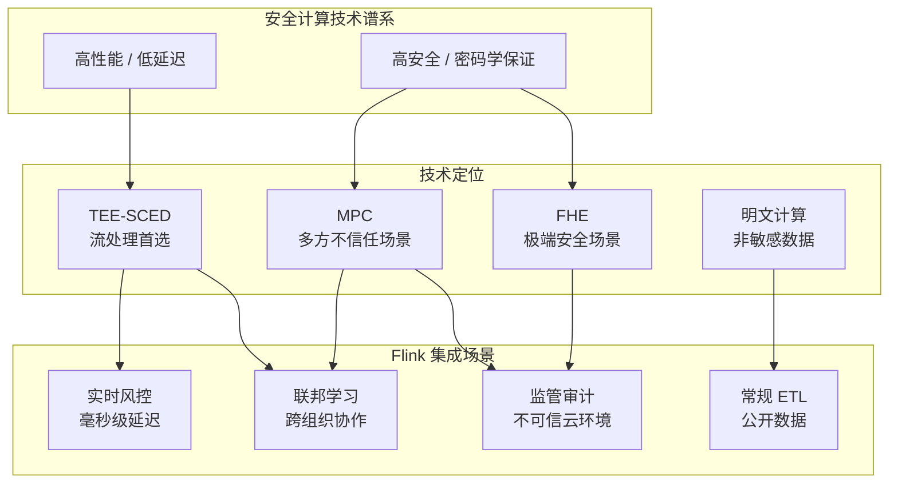
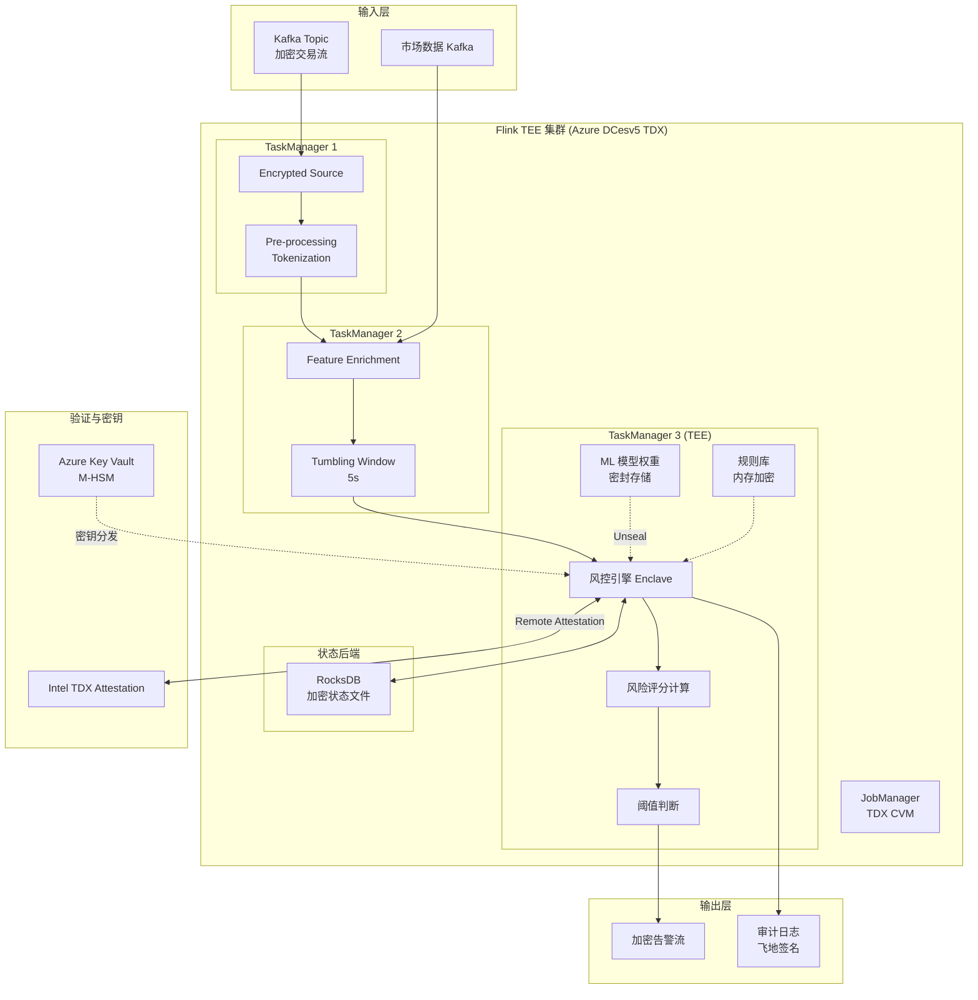
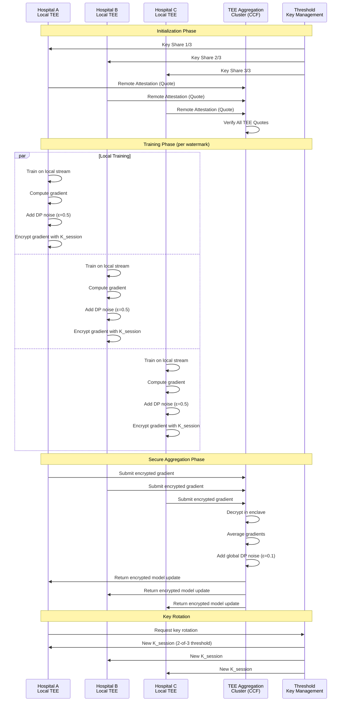
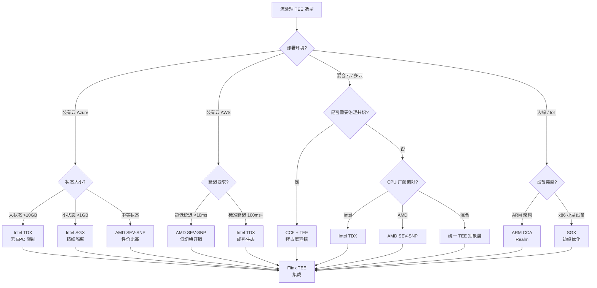

# 可信执行环境在流处理中的应用 — TEE 流计算架构指南

> 所属阶段: Flink/Security | 前置依赖: [Flink 可信执行环境](trusted-execution-flink.md) | 形式化等级: L3-L4

## 1. 概念定义 (Definitions)

### Def-F-13-14: 流处理可信执行环境 (Streaming TEE, STEE)

**形式化定义**:

流处理可信执行环境是专门针对有状态流计算工作负载优化的 TEE 抽象：

$$\text{STEE} = (E_{enclave}, S_{state}, K_{stream}, P_{checkpoint}, \tau_{latency})$$

其中：

- $E_{enclave}$: 保护流算子执行的硬件隔离域（TDX VM / SEV-SNP VM / SGX Enclave）
- $S_{state}$: 受保护的流状态存储（Key-Value 状态后端、窗口缓冲区）
- $K_{stream}$: 流会话密钥派生链，按水印或检查点边界轮换
- $P_{checkpoint}$: 密封检查点协议，确保状态快照的机密性和可恢复性
- $\tau_{latency}$: 远程证明与密钥派生引入的额外延迟上界

**安全边界**:

| 边界 | 威胁 | TEE 防护 |
|------|------|---------|
| 算子边界 | 恶意 UDF 提取敏感数据 | 飞地内代码度量绑定 |
| 状态边界 | 操作系统读取状态后端文件 | 内存加密 + 密封存储 |
| 网络边界 | 中间人窃取数据流 | RA-TLS 通道 |
| 检查点边界 | 持久化状态被篡改 | 飞地签名 + 完整性校验 |

**直观解释**: STEE 将 Flink 的 "状态即核心" 理念扩展到安全领域——不仅计算在飞地内执行，流状态的整个生命周期（内存中 → 检查点 → 恢复）都受硬件保护。

---

### Def-F-13-15: 加密态流计算 (Stream Computation over Encrypted Data, SCED)

**形式化定义**:

加密态流计算是在数据始终维持密文形式的前提下完成流处理的能力：

$$\text{SCED} = (D_{cipher}, F_{operator}, E_{tee}, R_{result}) \Rightarrow R_{cipher}$$

其中：

- $D_{cipher}$: 输入密文数据流（如 AES-GCM 或 ChaCha20-Poly1305 加密）
- $F_{operator}$: 可在明文上执行的算子（Map、Filter、Aggregate、Window）
- $E_{tee}$: 提供解密-计算-再加密环境的 TEE
- $R_{result}$: 输出结果，可选择密文输出或经策略控制的明文脱敏输出

**与全同态加密的比较**:

| 维度 | FHE (全同态加密) | TEE-SCED |
|------|-----------------|----------|
| 计算开销 | $10^3$-$10^6$ 倍 | 5-30% |
| 支持算子 | 有限（加法/乘法深度受限） | 任意算子 |
| 状态管理 | 不支持有状态计算 | 原生支持有状态流处理 |
| 延迟 | 秒级至分钟级 | 毫秒级（亚秒级证明） |
| 可验证性 | 密码学可验证 | 硬件远程证明 |
| 适用场景 | 低频批处理、极高安全要求 | 高频流处理、实时性要求 |

**核心洞察**: TEE-SCED 不是 FHE 的完全替代，而是在实时流处理场景下的**工程可行替代方案**，通过硬件信任根换取计算效率。

---

### Def-F-13-16: 联邦流学习隐私模型 (Federated Stream Learning Privacy, FSLP)

**形式化定义**:

联邦流学习隐私模型约束跨组织流数据协作中的信息泄露上界：

$$\text{FSLP} = (\mathcal{P}_1, \mathcal{P}_2, \ldots, \mathcal{P}_n; \mathcal{A}_{global}; \epsilon_{dp}, \delta_{dp})$$

其中：

- $\mathcal{P}_i$: 第 $i$ 个参与方的本地流处理管道
- $\mathcal{A}_{global}$: 全局聚合算子（在 TEE 内执行）
- $(\epsilon_{dp}, \delta_{dp})$: 差分隐私参数

**隐私保证**:

$$(\epsilon_{dp}, \delta_{dp})\text{-DP}(\mathcal{A}_{global}(\bigcup_i \mathcal{P}_i)) \Rightarrow \forall i, \Pr[\text{Leak}(D_i)] \leq e^{\epsilon_{dp}} \cdot \Pr[\text{Leak}(D_i')] + \delta_{dp}$$

**TEE 增强的联邦流学习**:

```
┌─────────────────────────────────────────────────────────────┐
│                  联邦流学习 TEE 架构                          │
├─────────────────────────────────────────────────────────────┤
│                                                             │
│   参与方 A          参与方 B          参与方 C               │
│   ┌──────┐          ┌──────┐          ┌──────┐             │
│   │Local │          │Local │          │Local │             │
│   │Model │          │Model │          │Model │             │
│   │Grad  │          │Grad  │          │Grad  │             │
│   └──┬───┘          └──┬───┘          └──┬───┘             │
│      │                 │                 │                  │
│      └─────────────────┼─────────────────┘                  │
│                        ↓                                    │
│              ┌─────────────────┐                            │
│              │   TEE 安全聚合域  │ ← 各方梯度加密输入          │
│              │   (TEE Cluster)  │                            │
│              │  ┌───────────┐  │                            │
│              │  │ Secure    │  │ ← MPC 协议 + DP 噪声       │
│              │  │ Aggregation│  │                            │
│              │  └───────────┘  │                            │
│              └────────┬────────┘                            │
│                       ↓                                     │
│              ┌─────────────────┐                            │
│              │  Global Model   │ ← 加密全局模型分发           │
│              └─────────────────┘                            │
│                                                             │
└─────────────────────────────────────────────────────────────┘
```

---

### Def-F-13-17: Microsoft CCF 可信计算框架 (Confidential Consortium Framework)

**形式化定义**:

CCF 是基于 TEE 的分布式可信计算框架，提供事务性状态机复制与治理机制：

$$\text{CCF} = (\mathcal{N}_{nodes}, \mathcal{C}_{consensus}, \mathcal{G}_{governance}, \mathcal{V}_{verify})$$

其中：

- $\mathcal{N}_{nodes}$: TEE 节点集合（每个节点运行在 SGX / SEV-SNP / TDX 中）
- $\mathcal{C}_{consensus}$: Raft 共识变体，在 TEE 内执行以确保日志完整性
- $\mathcal{G}_{governance}$: 成员治理协议，通过投票管理网络成员资格
- $\mathcal{V}_{verify}$: TLA+ 规范与 C++ 实现的绑定验证

**TLA+ 规范与实现绑定**:

| 规范层 | 描述 | 验证目标 |
|--------|------|---------|
| `ccf_consensus.tla` | Raft 共识状态机 | 安全性 + 活性 |
| `ccf_governance.tla` | 成员治理协议 | 宪法一致性 |
| `ccf_reconfiguration.tla` | 动态重配置 | 安全替换 |
| `ccf_tx.tla` | 事务执行模型 | 可串行化 |

**绑定验证策略**:

$$\text{Binding} = \{ \text{TLA+ Spec} \xrightarrow{\text{refine}} \text{C++ Impl} \xrightarrow{\text{measure}} \text{Enclave Binary} \}$$

- TLA+ 模型检查验证协议级属性
- C++ 实现通过 SGX SDK 编译为飞地可执行文件
- 远程证明验证部署二进制与预期度量匹配

---

## 2. 属性推导 (Properties)

### Prop-F-13-07: TEE 流处理端到端机密性定理

**命题**: 在 STEE 模型下，敏感数据 $D_{sens}$ 从 Source 到 Sink 的全生命周期保持机密：

$$\forall t \in [t_{ingress}, t_{egress}]: \text{Confidentiality}(D_{sens}(t)) \Rightarrow \text{Attacker} \not\rightarrow D_{sens}$$

**证明概要**:

1. **输入阶段**: Source 通过 RA-TLS 连接将加密数据注入 TEE
   $$\text{Data}_{ingress} = \text{Decrypt}_{K_{session}}(\text{Ciphertext}) \in E_{enclave}$$

2. **处理阶段**: 算子在飞地内执行，状态 $S_t$ 受内存加密保护
   $$S_t = f(S_{t-1}, D_t), \quad S_t \in M_{secure}$$

3. **检查点阶段**: 状态快照经密封密钥加密后持久化
   $$\text{Checkpoint}_t = \text{Encrypt}_{K_{seal}}(S_t || H(S_t))$$

4. **输出阶段**: 结果经安全通道输出，可选差分隐私脱敏
   $$\text{Data}_{egress} = \text{Encrypt}_{K_{out}}(R_t + \text{Noise}(\epsilon))$$

### Lemma-F-13-03: 远程证明延迟上界

**引理**: 在流处理 SLA 约束下，TEE 远程证明引入的延迟满足：

$$\tau_{attest} < \min(\tau_{watermark}, \tau_{checkpoint}, \tau_{sla})$$

**典型数值**:

| TEE 类型 | 证明协议 | 首次证明延迟 | 增量证明 |
|---------|---------|------------|---------|
| Intel SGX (DCAP) | ECDSA Quote | 200-500ms | 50-100ms |
| AMD SEV-SNP | VLEK Report | 100-300ms | 30-50ms |
| Intel TDX | TD Quote | 150-400ms | 40-80ms |
| ARM CCA | Realm Attestation | 200-600ms | 50-100ms |

**工程意义**: 对于水印周期为 1-5 秒的流作业，证明延迟可完全隐藏在正常处理周期内。

### Prop-F-13-08: MPC-TEE 复合安全定理

**命题**: 当安全多方计算协议在 TEE 内执行时，系统安全保证为两者之交集：

$$\text{Security}_{MPC+TEE} = \text{Security}_{MPC} \land \text{Security}_{TEE}$$

**优势分析**:

| 攻击场景 | 纯 MPC | 纯 TEE | MPC+TEE 复合 |
|---------|--------|--------|-------------|
| 少数参与方腐败 (< $t$) | 安全 | 安全 | 安全 |
| 多数参与方腐败 (\geq $t$) | 不安全 | 安全 | 安全（TEE 兜底） |
| TEE 侧信道泄露 | 安全 | 不安全 | 安全（MPC 分散） |
| TEE 实现漏洞 | 安全 | 不安全 | 安全（MPC 冗余） |
| 网络分区 | 可用性损失 | 安全 | MPC 容错 + TEE 验证 |

---

## 3. 关系建立 (Relations)

### 3.1 TEE 技术矩阵（流处理场景）

| 特性 | Intel SGX (Legacy) | Intel TDX | AMD SEV-SNP | ARM CCA |
|------|:------------------:|:---------:|:-----------:|:-------:|
| **隔离粒度** | 进程级 Enclave | VM 级 (TD) | VM 级 | Realm (VM 级) |
| **内存限制** | 128MB-1GB EPC | 无限制 | 无限制 | 无限制 |
| **上下文切换** | 高 (EEXIT/EENTER) | 低 (VM 切换) | 低 (VM 切换) | 低 (Realm 切换) |
| **远程证明** | EPID / DCAP | TDX Quote | VLEK | Realm Token |
| **云厂商支持** | Azure (DCsv2/3) | Azure (DCesv5) | Azure/AWS/GCP | AWS Graviton4 (预览) |
| **状态** | 已弃用 (2024) | SGX 替代主流 | 生产就绪 | 2024+ 部署 |
| **Flink 集成难度** | 高 (SDK 重构) | 中 (CVM 部署) | 低 (透明) | 中 (新架构) |
| **流状态保护** | 密封存储复杂 | CVM 内存加密 | CVM 内存加密 | Realm 内存加密 |

### 3.2 同态加密 vs TEE vs MPC 在流处理中的定位



### 3.3 CCF 与 Flink 集成映射

| Flink 组件 | CCF 对应能力 | 安全增强 |
|-----------|-------------|---------|
| JobManager 协调 | CCF 治理共识 | 调度决策防篡改 |
| Checkpoint 存储 | CCF 键值存储 (KV) | 检查点完整性 + 审计 |
| 状态后端 | CCF 加密事务日志 | 状态可验证持久化 |
| 配置管理 | CCF 宪法治理 | 配置变更需投票 |
| 密钥分发 | CCF 成员服务 | 阈值签名密钥管理 |

---

## 4. 论证过程 (Argumentation)

### 4.1 流处理 TEE 威胁模型

**扩展 Dolev-Yao 攻击者能力**:

```
┌─────────────────────────────────────────────────────────────┐
│              流处理 TEE 威胁模型层级                          │
├─────────────────────────────────────────────────────────────┤
│ L1: 网络窃听者      → 截获 Kafka/网络流数据                   │
│ L2: 流系统用户      → 提交恶意 UDF、读取状态后端              │
│ L3: 集群管理员      → 访问 TaskManager 内存、检查点文件       │
│ L4: 云运营商        → Hypervisor 内存快照、网络中间盒         │
│ L5: 硬件攻击者      → 冷启动攻击、总线嗅探、侧信道分析        │
│ L6: TEE 实现攻击    → 微码漏洞、推测执行攻击 (如 ÆPIC)       │
└─────────────────────────────────────────────────────────────┘
```

**TEE 防护边界与残余风险**:

| 层级 | TEE 防护 | 残余风险 | 缓解策略 |
|------|---------|---------|---------|
| L1-L4 | ✅ 完全防护 | 无 | RA-TLS + 内存加密 |
| L5 | ⚠️ 部分防护 | 冷启动、物理探测 | 密封存储绑定 TPM |
| L6 | ❌ 不防护 | TEE 自身漏洞 | 快速补丁、MPC 冗余、形式化验证 |

### 4.2 性能-安全权衡分析

**TEE 在流处理中的开销来源**:

| 开销来源 | TDX | SEV-SNP | SGX | 典型影响 |
|---------|:---:|:-------:|:---:|:--------:|
| 内存加密 (AMD SME / Intel TME) | ✅ | ✅ | N/A | 3-8% |
| 远程证明 (首次) | ✅ | ✅ | ✅ | 100-500ms |
| 上下文切换 | 低 | 低 | 高 | 1-5% |
| ECALL/OCALL | N/A | N/A | 高 | 10-40% |
| 检查点密封 | ✅ | ✅ | ✅ | 5-15% |
| 网络加密 (RA-TLS) | ✅ | ✅ | ✅ | 2-5% |

**关键洞察**: TDX 和 SEV-SNP 由于采用 VM 级隔离，避免了 SGX 的 ECALL/OCALL 开销，在流处理场景下总体 overhead 可控制在 **5-15%** 范围内。

### 4.3 边界讨论：何时不应使用 TEE

**不适用场景**:

1. **超高频低延迟交易**（<100μs）：TEE 上下文切换和证明延迟不可接受
2. **完全开放的公共数据**：TEE 开销无安全收益
3. **TEE 不可用的边缘设备**：ARM CCA 尚未普及的 IoT 场景
4. **对抗国家级攻击者**：需结合 MPC 或信息论安全方案

---

## 5. 形式证明 / 工程论证 (Proof / Engineering Argument)

### 5.1 Flink TaskManager TEE 执行安全论证

**系统模型**:

设 Flink 作业 $J$ 在 TEE 保护的 TaskManager 集合 $\mathcal{T} = \{T_1, T_2, \ldots, T_n\}$ 上执行：

$$J = (\mathcal{O}, \mathcal{S}, \mathcal{C}, \mathcal{K})$$

- $\mathcal{O}$: 算子集合 $\{o_1, o_2, \ldots, o_m\}$
- $\mathcal{S}$: 状态集合 $\{s_1, s_2, \ldots, s_k\}$
- $\mathcal{C}$: 检查点序列 $\{c_1, c_2, \ldots\}$
- $\mathcal{K}$: 密钥派生链 $\{K_0 \xrightarrow{\text{HKDF}} K_1 \xrightarrow{\text{HKDF}} \ldots\}$

**安全目标**: 证明以下不变式在所有执行轨迹上成立：

$$\text{Invariant}_{TEE}: \forall o_i \in \mathcal{O}, \forall s_j \in \mathcal{S}, \text{Plaintext}(o_i, s_j) \subseteq M_{secure}$$

**论证步骤**:

**步骤 1: 启动安全**

TaskManager 启动时执行远程证明：

$$\text{Quote}_i = \text{Attest}(T_i, \text{MRENCLAVE} || \text{MRSIGNER} || \mathcal{H}(J_{code}))$$

JobManager 验证 $\text{Quote}_i$ 后才分配任务，确保只有预期代码可在 TEE 内执行。

**步骤 2: 状态隔离**

流状态 $s_j$ 的内存分配在 TEE 保护区域内：

$$\text{alloc}(s_j) \in M_{secure} \Rightarrow \text{HostOS} \not\rightarrow s_j$$

**步骤 3: 检查点密封**

检查点 $c_t$ 在持久化前经飞地密封密钥加密：

$$c_t^{sealed} = \text{AES-GCM}(K_{seal}, S_t || t || H(S_{t-1}))$$

恢复时验证完整性：

$$\text{Verify}(c_t^{sealed}) \Rightarrow H(S_t^{restored}) = H(S_t)$$

**步骤 4: 密钥轮换**

按水印边界轮换会话密钥，限制泄露窗口：

$$K_{w_{i+1}} = \text{HKDF}(K_{w_i}, \text{watermark}_{i+1} || \text{nonce})$$

**结论**: 在 TEE 硬件信任假设下，Flink 作业的算子执行和状态管理满足端到端机密性和完整性。

### 5.2 CCF TLA+ 规范与实现一致性论证

**命题**: CCF 的 C++ 实现与其 TLA+ 规范在核心共识和治理协议上保持精化关系。

**精化链**:

$$\text{TLA+}_{abstract} \sqsubseteq \text{TLA+}_{concrete} \sqsubseteq \text{C++}_{impl} \sqsubseteq \text{Enclave}_{binary}$$

**验证层级**:

| 层级 | 方法 | 保证 |
|------|------|------|
| 协议规范 | TLA+ Model Checker | 状态空间穷尽验证 |
| 实现逻辑 | 代码审计 + 单元测试 | 功能等价性 |
| 编译产物 | SGX 签名 + 度量 | 二进制完整性 |
| 运行时 | 远程证明 | 部署状态验证 |

**关键属性验证**:

1. **共识安全性** (TLA+ `Safety`):
   $$\forall i, j: \text{committed}_i = \text{committed}_j \lor \text{prefix}(\text{committed}_i, \text{committed}_j) \lor \text{prefix}(\text{committed}_j, \text{committed}_i)$$

2. **治理宪法性** (TLA+ `GovernanceInvariant`):
   $$\text{ConfigChange} \Rightarrow \text{VoteCount}(\text{Accept}) > \frac{2}{3} |\mathcal{M}|$$

3. **事务可串行化** (TLA+ `Serializability`):
   $$\forall tx_1, tx_2: \text{Conflict}(tx_1, tx_2) \Rightarrow \text{Order}(tx_1, tx_2) \lor \text{Order}(tx_2, tx_1)$$

**工程推论**: 将 Flink 的 Checkpoint 协调器嵌入 CCF 节点，可利用已验证的共识协议保证检查点元数据的拜占庭容错。

### 5.3 联邦流学习隐私预算守恒

**定理**: 在 TEE 内执行的联邦流学习聚合满足差分隐私预算的线性守恒：

$$\text{DP-Compose}(\mathcal{A}_1, \mathcal{A}_2, \ldots, \mathcal{A}_T) \Rightarrow \epsilon_{total} = \sum_{t=1}^{T} \epsilon_t$$

**证明概要**:

- 每轮聚合 $\mathcal{A}_t$ 在飞地内添加独立噪声：$\text{Noise}_t \sim \text{Laplace}(\Delta / \epsilon_t)$
- TEE 确保噪声生成不可被观测或操控
- 隐私损失的累积由基本组合定理约束
- 全局隐私会计在飞地内维护，防止篡改

**实践约束**:

对于水印周期 $W = 5s$、日处理窗口 $T_{day} = 86400s$：

$$N_{rounds} = \frac{T_{day}}{W} = 17280$$

若要求 $\epsilon_{total} \leq 4$（强隐私），则每轮预算：

$$\epsilon_{round} \leq \frac{4}{17280} \approx 2.3 \times 10^{-4}$$

需要较大噪声幅度，适用于低频统计聚合而非逐事件输出。

---

## 6. 实例验证 (Examples)

### 6.1 金融实时风控：加密态流计算

**场景**: 投资银行使用 Flink 处理实时加密交易流，在 TEE 内执行风控规则引擎，模型权重和交易数据对云运营商完全不可见。

**架构**:



**关键配置**:

```yaml
# flink-conf.yaml - TEE 安全配置
security.teed.enabled: true
security.teed.type: INTEL_TDX
security.teed.attestation.url: https://sharedeus.eus.attest.azure.net

# 状态后端加密
state.backend: rocksdb
state.backend.rocksdb.memory.managed: true
state.backend.incremental: true
state.checkpoints.dir: wasb://checkpoints@storage.blob.core.windows.net

# 密封检查点
security.teed.seal-checkpoints: true
security.teed.key-rotation.interval: 300s

# RA-TLS 网络层
security.ssl.internal.enabled: true
security.ssl.internal.keystore-type: TDX_DCAP
```

**安全保证**:

- 交易数据明文仅在 TDX CVM 内存中出现
- 模型权重经 Azure Key Vault M-HSM 密封，仅对验证通过 CVM 解密
- 检查点文件加密存储，密钥绑定至 TDX 度量值
- 审计日志由飞地私钥签名，不可抵赖

### 6.2 跨组织医疗联邦流学习

**场景**: 三家医院通过 Flink 进行联合患者风险预测，每家医院的数据不出本地，全局模型在 TEE 集群内安全聚合。

**隐私要求**:

1. 原始患者记录不离开医院本地 TEE
2. 梯度上传前经本地差分隐私处理
3. 全局聚合在第三方 TEE 内执行
4. 模型更新返回医院前加密

**架构实现**:

```
┌─────────────────────────────────────────────────────────────┐
│                  联邦医疗流学习网络                           │
├─────────────────────────────────────────────────────────────┤
│                                                             │
│   医院 A                    医院 B                    医院 C │
│   ┌──────────────┐          ┌──────────────┐          ┌────┐│
│   │ Local Flink  │          │ Local Flink  │          │ LF ││
│   │ + TDX CVM    │          │ + TDX CVM    │          │ CVM││
│   │              │          │              │          │    ││
│   │ ┌──────────┐ │          │ ┌──────────┐ │          │ ┌┐ ││
│   │ │ Local    │ │          │ │ Local    │ │          │ │L│ ││
│   │ │ Training │ │          │ │ Training │ │          │ │T│ ││
│   │ │ (TEE)    │ │          │ │ (TEE)    │ │          │ │r│ ││
│   │ └────┬─────┘ │          │ └────┬─────┘ │          │ └┬┘ ││
│   │      │       │          │      │       │          │  │  ││
│   │ ┌────┴─────┐ │          │ ┌────┴─────┐ │          │ ┌┴┐ ││
│   │ │ DP Noise │ │          │ │ DP Noise │ │          │ │D│ ││
│   │ │ ε=0.5    │ │          │ │ ε=0.5    │ │          │ │P│ ││
│   │ └────┬─────┘ │          │ └────┬─────┘ │          │ └┬┘ ││
│   └──────┼───────┘          └──────┼───────┘          └──┼──┘│
│          │                         │                    │   │
│          └─────────────┬───────────┘                    │   │
│                        ↓                                ↓   │
│              ┌─────────────────┐              ┌──────────┐  │
│              │  TEE 聚合集群    │ ←─────────── │ 梯度加密 │  │
│              │  (Azure CCF)    │              │ 传输     │  │
│              │  ┌───────────┐  │              └──────────┘  │
│              │  │ Secure    │  │                            │
│              │  │ Aggregate │  │                            │
│              │  │ (MPC+TEE) │  │                            │
│              │  └─────┬─────┘  │                            │
│              └────────┼────────┘                            │
│                       ↓                                     │
│              ┌─────────────────┐                            │
│              │  Global Model   │                            │
│              │  (Encrypted)    │                            │
│              └─────────────────┘                            │
│                                                             │
└─────────────────────────────────────────────────────────────┘
```

**飞地内聚合逻辑**:

```cpp
// CCF 节点内的安全聚合（C++ 飞地代码）
class SecureAggregationHandler : public ccf::EndpointRegistry {
public:
    void init_handlers() {
        // 接收加密梯度
        make_endpoint("/submit_gradient", HTTP_POST,
            [this](auto& ctx) {
                auto gradient = parse_encrypted_gradient(ctx.rpc_ctx->get_request_body());

                // 在飞地内解密（密钥不可提取）
                auto plain_grad = decrypt_in_enclave(gradient, key_id);

                // 累加至聚合缓冲区
                aggregation_buffer.accumulate(plain_grad);

                // 更新隐私会计
                privacy_accountant.consume(epsilon_local);

                // 当收到足够多方梯度时执行聚合
                if (aggregation_buffer.ready()) {
                    auto global_update = aggregation_buffer.average();

                    // 添加全局差分隐私噪声
                    global_update.add_noise(epsilon_global, delta_global);

                    // 加密输出
                    auto encrypted_update = encrypt_for_participants(global_update);
                    return make_success(encrypted_update);
                }
            });
    }
};
```

### 6.3 SGX Enclave 中的 RocksDB 状态后端

**场景**: 在遗留 SGX 环境中，将 Flink 的 RocksDB 状态后端运行在 Enclave 内，保护大状态 keyed stream 的敏感数据。

**架构约束**:

- SGX EPC 内存限制：256MB-1GB（取决于平台）
- 需使用 SGX SDK 的 Protected File System 或自定义密封存储
- 状态超出 EPC 时需分页至加密交换区

**实现模式**:

```c
// Enclave 内 RocksDB 适配层 (sgx_rocksdb_edl)
enclave {
    trusted {
        public sgx_status_t ecall_init_state_backend(
            [in, size=path_len] const char* db_path,
            size_t path_len,
            [out] void** db_handle
        );

        public sgx_status_t ecall_put_state(
            [user_check] void* db_handle,
            [in, size=klen] const char* key,
            size_t klen,
            [in, size=vlen] const char* value,
            size_t vlen
        );

        public sgx_status_t ecall_get_state(
            [user_check] void* db_handle,
            [in, size=klen] const char* key,
            size_t klen,
            [out, size=max_vlen] char* value,
            size_t max_vlen,
            [out] size_t* actual_vlen
        );

        public sgx_status_t ecall_checkpoint_seal(
            [user_check] void* db_handle,
            [out, size=max_len] char* sealed_data,
            size_t max_len,
            [out] size_t* sealed_len
        );
    };
};
```

**分页策略**:

| 状态大小 | EPC 内策略 | EPC 外策略 | 性能影响 |
|---------|-----------|-----------|---------|
| < 128MB | 全量驻留 | 无 | 最小 |
| 128MB-512MB | 热状态驻留 | 冷状态 AES-GCM 加密页出 | 10-20% |
| 512MB-2GB | LRU 缓存 | 密封分页 + 按需加载 | 30-50% |
| > 2GB | 不建议 SGX | 迁移至 TDX/SEV-SNP | N/A |

### 6.4 MPC+TEE 复合：跨云密钥管理

**场景**: 高可用流处理系统需要在多云环境中管理加密密钥，要求无单点信任。

**复合方案**:

- **TEE 层**: 每个云部署 TDX/SEV-SNP CVM 运行 Flink TaskManager
- **MPC 层**: 阈值签名方案 (t-of-n) 分布式管理主密钥
- **密钥派生**: 各 TaskManager 的流会话密钥由 MPC 阈值派生

```
┌─────────────────────────────────────────────────────────────┐
│                 跨云 MPC+TEE 密钥管理                         │
├─────────────────────────────────────────────────────────────┤
│                                                             │
│   Azure TDX VM              AWS SNP VM              GCP TDX │
│   ┌────────────┐           ┌────────────┐          ┌──────┐ │
│   │ Flink TM   │           │ Flink TM   │          │ TM   │ │
│   │ + Key Share│           │ + Key Share│          │Share │ │
│   │    (1/3)   │           │    (1/3)   │          │(1/3) │ │
│   └─────┬──────┘           └─────┬──────┘          └──┬───┘ │
│         │                        │                    │     │
│         └────────────────────────┼────────────────────┘     │
│                                  ↓                          │
│                        ┌─────────────────┐                  │
│                        │  MPC 阈值签名    │                  │
│                        │  (2-of-3)       │                  │
│                        │  ─────────────  │                  │
│                        │  任意 2 方可派生 │                  │
│                        │  会话密钥        │                  │
│                        └─────────────────┘                  │
│                                  │                          │
│                                  ↓                          │
│                        ┌─────────────────┐                  │
│                        │  HKDF Key Chain │                  │
│                        │  K0 → K1 → K2   │                  │
│                        └─────────────────┘                  │
│                                                             │
└─────────────────────────────────────────────────────────────┘
```

**安全属性**:

- 单云被攻破：攻击者仅获得 1/3 密钥分片，无法恢复主密钥
- 单 TEE 漏洞：MPC 协议保证计算冗余，结果仍正确
- 云服务串通：需 ≥2 云同时串通 + 突破各自 TEE 才能窃取密钥

---

## 7. 可视化 (Visualizations)

### 7.1 TEE 流处理分层安全架构

```mermaid
graph TB
    subgraph "应用层 (Flink Application)"
        SQL[Flink SQL]
        DS[DataStream API]
        UDF[UDF / UDAF]
    end

    subgraph "运行时层 (Flink Runtime)"
        JM[JobManager]
        TM[TaskManager]
        NET[Network Stack]
        CHK[Checkpoint Coordinator]
    end

    subgraph "TEE 抽象层"
        TEE_API[TEE Runtime API<br/>TDX / SEV-SNP / CCA]
        ATTEST[Attestation Manager]
        KEYM[Key Manager<br/>HKDF Chain]
        SEAL[Sealed Storage]
    end

    subgraph "硬件 TEE 层"
        TDX[Intel TDX<br/>CVM Isolation]
        SEV[AMD SEV-SNP<br/>Memory Encryption]
        CCA[ARM CCA<br/>Realm Management]
        SGX[Intel SGX<br/>Enclave]
    end

    subgraph "外部服务"
        IAS[Intel TDX Service]
        ASP[AMD ASP]
        ARP[ARM RMM]
        HSM[Cloud HSM]
    end

    SQL --> JM
    DS --> TM
    UDF --> TM
    JM --> NET
    TM --> NET
    CHK --> TM

    TM --> TEE_API
    TEE_API --> TDX
    TEE_API --> SEV
    TEE_API --> CCA
    TEE_API --> SGX

    ATTEST --> TEE_API
    KEYM --> TEE_API
    SEAL --> TEE_API

    TDX <-->|Attestation| IAS
    SEV <-->|Attestation| ASP
    CCA <-->|Attestation| ARP
    KEYM <-->|Key Distribution| HSM
```



### 7.2 联邦流学习 TEE 工作流时序



### 7.3 TEE 选型决策树（流处理场景）



---

## 8. 引用参考 (References)


---

*文档版本: v1.0 | 创建日期: 2026-04-23 | 形式化元素: Def-F-13-14, Def-F-13-15, Def-F-13-16, Def-F-13-17, Prop-F-13-07, Lemma-F-13-03, Prop-F-13-08*
