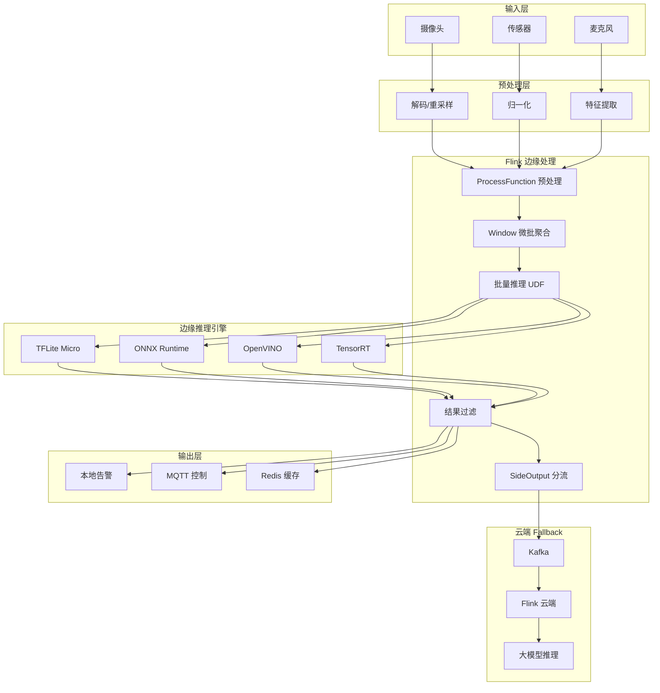
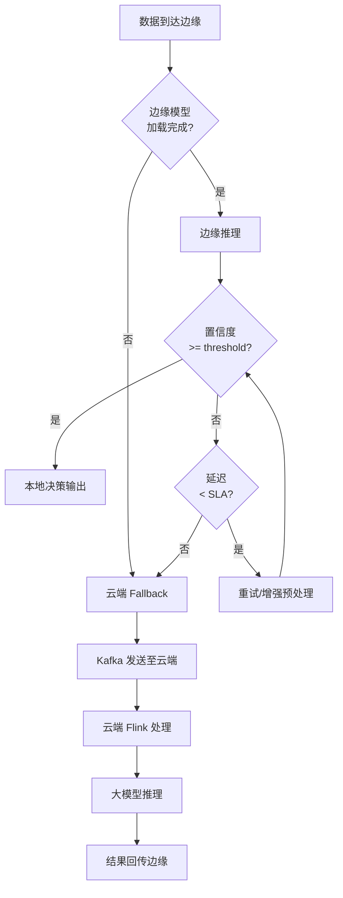

# Flink 边缘 AI 推理优化

> 所属阶段: Flink/09-practices/09.05-edge | 前置依赖: [flink-edge-streaming-guide.md](./flink-edge-streaming-guide.md), [../../06-ai-ml/flink-llm-realtime-inference-guide.md](../../06-ai-ml/flink-llm-realtime-inference-guide.md) | 形式化等级: L4

---

## 1. 概念定义 (Definitions)

### Def-F-09-12: 边缘 AI 推理 (Edge AI Inference)

**Def-F-09-12a**: 边缘 AI 推理是指在靠近数据源的终端或边缘网关上执行机器学习模型前向计算的过程，而非将原始数据传输至云端数据中心处理。形式上：

$$\hat{y} = M_{edge}(x), \quad x \in \mathcal{X}_{local}, \; M_{edge} \subseteq M_{cloud}$$

其中 $M_{edge}$ 为边缘部署的模型子集或蒸馏版本，满足资源约束：

$$\text{Memory}(M_{edge}) \leq R_{mem}, \quad \text{Latency}(M_{edge}(x)) \leq \tau_{edge}$$

**Def-F-09-12b**: 边缘-云协同推理

当边缘模型无法独立完成决策时，触发云端推理作为补充：

$$\hat{y} = \begin{cases}
M_{edge}(x) & \text{if } \text{confidence}(M_{edge}(x)) \geq \theta \\
M_{cloud}(x) & \text{otherwise}
\end{cases}$$

---

### Def-F-09-13: 模型轻量化 (Model Lightweighting)

**Def-F-09-13**: 模型轻量化是一类将大型神经网络压缩为适合边缘部署形式的技术集合：

| 技术 | 定义 | 压缩率 | 精度损失 |
|------|------|--------|---------|
| 量化 (Quantization) | 将 FP32 权重映射至 INT8/INT4 | 4x | 1-3% |
| 剪枝 (Pruning) | 移除低重要性权重或神经元 | 2-10x | 0-5% |
| 蒸馏 (Distillation) | 用小模型学习大模型输出分布 | 模型依赖 | 1-4% |
| 神经网络架构搜索 (NAS) | 自动搜索高效网络结构 | 模型依赖 | 0-3% |

---

### Def-F-09-14: 流式推理的能效比

**Def-F-09-14**: 边缘设备的能效比 $E$ 定义为处理单位数据所需的能量：

$$E = \frac{P_{avg} \cdot T_{inference}}{N_{samples}} \quad [\text{J/sample}]$$

其中 $P_{avg}$ 为平均功耗，$T_{inference}$ 为推理时间，$N_{samples}$ 为处理样本数。

**边缘优化目标**：在满足延迟约束 $\tau$ 的前提下，最小化 $E$。

---

## 2. 属性推导 (Properties)

### Prop-F-09-06: 边缘推理延迟的边界

**命题**：对于单样本边缘推理，端到端延迟 $L_{total}$ 可分解为：

$$L_{total} = L_{preprocess} + L_{inference} + L_{postprocess} + L_{communication}$$

在纯边缘场景下，$L_{communication} \approx 0$；在边缘-云协同场景下：

$$L_{total}^{hybrid} = p_{edge} \cdot L_{edge} + (1 - p_{edge}) \cdot (L_{edge} + L_{network} + L_{cloud})$$

其中 $p_{edge}$ 为边缘成功决策的概率。

**含义**：$p_{edge}$ 每提升 10%，平均延迟可降低 $(1 - p_{edge}) \cdot L_{network}$ 的比例。

---

### Lemma-F-09-04: 批量推理的吞吐量增益

**引理**：若边缘 AI 加速器（如 NPU、GPU）支持批处理，则批量大小 $B$ 与吞吐量 $Q$ 满足：

$$Q(B) = \frac{B}{T_{fixed} + B \cdot T_{marginal}}$$

其中 $T_{fixed}$ 为固定开销（内存拷贝、内核启动），$T_{marginal}$ 为边际样本处理时间。

**推导**：当 $B \gg T_{fixed} / T_{marginal}$ 时，$Q(B) \approx 1 / T_{marginal}$，达到饱和吞吐量。在流处理中，需权衡批处理带来的延迟增加与吞吐量提升。

---

## 3. 关系建立 (Relations)

### 与 Flink 流处理栈的映射

| 边缘 AI 概念 | Flink 抽象 | 优化策略 |
|-------------|-----------|---------|
| 模型加载 | OperatorState / BroadcastState | 预加载 + 增量热更新 |
| 特征预处理 | ProcessFunction / FlatMap | SIMD 优化、硬件加速 |
| 批量推理 | Window / Buffer | 微批聚合，NPU 批处理 |
| 结果过滤 | Filter / SideOutput | 低置信度请求分流至云端 |
| 模型版本管理 | State TTL / 广播流 | A/B 测试、灰度发布 |

---

### 与云端 AI 推理的关系

```
                    原始数据流
                         │
         ┌───────────────┼───────────────┐
         ▼               ▼               ▼
    ┌─────────┐    ┌─────────┐    ┌─────────┐
    │ 边缘设备 │    │ 边缘网关 │    │ 云端集群 │
    │ (MCU)   │    │ (Flink) │    │ (Flink) │
    └────┬────┘    └────┬────┘    └────┬────┘
         │ 轻量推理      │ 中等模型      │ 大模型
         │ (TFLite Micro)│ (ONNX Runtime)│ (PyTorch/TensorFlow)
         │               │               │
         └───────────────┴───────────────┘
                         │
                    融合决策输出
```

---

## 4. 论证过程 (Argumentation)

### 4.1 为什么边缘 AI 需要专门的流处理优化？

边缘环境相比云端数据中心有三大核心约束：

1. **算力约束**：边缘设备 CPU 性能通常为云服务器的 1/100 - 1/10，无法直接运行大型模型。
2. **内存约束**：典型边缘网关内存为 2-8GB，而云端 GPU 显存为 24-80GB。
3. **能耗约束**：电池供电设备要求推理功耗 < 5W，而云端 GPU 功耗为 100-400W。

因此，边缘 AI 优化不是简单的"模型部署"，而是需要从模型选择、输入预处理、批处理策略到硬件加速的全栈协同优化。

---

### 4.2 边缘推理框架对比

| 框架 | 支持硬件 | 模型格式 | 批处理 | 适用场景 |
|------|---------|---------|--------|---------|
| TensorFlow Lite | ARM CPU, GPU, NPU | .tflite | 支持 | 移动/嵌入式 |
| ONNX Runtime | x86, ARM, GPU | .onnx | 支持 | 边缘网关 |
| OpenVINO | Intel CPU, GPU, VPU | IR, ONNX | 支持 | 工业视觉 |
| NVIDIA TensorRT | NVIDIA GPU | ONNX, UFF | 强支持 | 高性能边缘盒 |
| Apache TVM | 多硬件 | 多种 | 支持 | 自定义硬件 |

**推荐组合**：
- **轻量边缘**（摄像头、传感器）：TFLite + ARM NPU
- **边缘网关**（工控机、边缘服务器）：ONNX Runtime + OpenVINO
- **高性能边缘盒**（NVIDIA Jetson）：TensorRT + CUDA

---

## 5. 形式证明 / 工程论证 (Proof / Engineering Argument)

### 5.1 模型量化的精度-速度权衡

**工程论证**：INT8 量化可将模型体积和推理延迟降低约 4 倍，精度损失通常在 1-3% 范围内。

设 FP32 模型精度为 $Acc_{fp32}$，INT8 模型精度为 $Acc_{int8}$，则：

$$\Delta Acc = Acc_{fp32} - Acc_{int8} \approx 0.01 - 0.03$$

对于图像分类任务（如 ResNet-50），FP32 Top-1 精度为 76.1%，INT8 精度为 75.3%，$\Delta Acc = 0.8\%$。

**工程实践建议**：
- 分类/检测任务：优先使用 INT8 量化
- 生成任务（如语音合成）：使用 FP16 或混合精度
- 对精度极度敏感的医疗/金融场景：保留 FP32 作为 fallback

---

### 5.2 流式批处理的延迟边界

**定理 (Thm-F-09-03)**：在 Flink 边缘流处理中，为最大化 NPU 利用率而引入的微批缓冲延迟 $L_{batch}$ 存在上界：

$$L_{batch} = B \cdot \Delta t_{inter arrival} + L_{timeout}$$

其中 $B$ 为目标批量大小，$\Delta t_{inter arrival}$ 为平均样本到达间隔，$L_{timeout}$ 为超时等待时间。

**优化策略**：
1. **动态批大小**：根据数据到达速率自适应调整 $B$
2. **超时截断**：设置 $L_{timeout} \leq \tau_{SLA} / 2$，避免缓冲延迟超限
3. **投机执行**：对于稀疏到达流，允许 $B < B_{target}$ 时立即推理

---

## 6. 实例验证 (Examples)

### 6.1 边缘网关上的实时图像分类优化

**场景**：智慧零售门店需要在边缘网关上实时分析摄像头画面，识别客流热力区域和商品关注度。

```java
// ============================================
// Flink Edge AI: 批量图像分类优化
// ============================================

public class EdgeImageClassificationJob {
    public static void main(String[] args) throws Exception {
        StreamExecutionEnvironment env = StreamExecutionEnvironment.getExecutionEnvironment();
        env.setParallelism(2); // 边缘网关通常 2-4 核

        // 接收 RTSP 视频帧流
        DataStream<VideoFrame> frames = env
            .addSource(new RtspFrameSource("rtsp://camera.local/stream"))
            .assignTimestampsAndWatermarks(
                WatermarkStrategy.<VideoFrame>forBoundedOutOfOrderness(Duration.ofMillis(100))
            );

        // 步骤1: 特征提取预处理(Resize, Normalize)
        DataStream<ImageTensor> tensors = frames
            .map(new FramePreprocessFunction(224, 224))
            .setParallelism(2);

        // 步骤2: 微批聚合 — 每 32ms 或凑够 8 帧触发一次推理
        DataStream<List<ClassificationResult>> batchResults = tensors
            .keyBy(t -> t.cameraId)
            .window(ProcessingTimeSessionWindows.withDynamicGap(
                (element) -> Time.milliseconds(32)
            ))
            .trigger(CountTrigger.of(8))
            .apply(new BatchInferenceWindowFunction());

        // 步骤3: 结果展开并过滤低置信度
        DataStream<ClassificationResult> results = batchResults
            .flatMap((List<ClassificationResult> list, Collector<ClassificationResult> out) -> {
                for (ClassificationResult r : list) {
                    if (r.confidence > 0.7) {
                        out.collect(r);
                    }
                }
            }).returns(ClassificationResult.class);

        // 低置信度事件侧输出至云端
        final OutputTag<ClassificationResult> cloudFallbackTag =
            new OutputTag<ClassificationResult>("cloud-fallback"){};

        SingleOutputStreamOperator<ClassificationResult> filtered = results
            .process(new ProcessFunction<ClassificationResult, ClassificationResult>() {
                @Override
                public void processElement(ClassificationResult value, Context ctx,
                        Collector<ClassificationResult> out) {
                    if (value.confidence >= 0.85) {
                        out.collect(value);
                    } else {
                        ctx.output(cloudFallbackTag, value);
                    }
                }
            });

        filtered.addSink(new MqttSink<>("edge/results"));
        filtered.getSideOutput(cloudFallbackTag).addSink(new KafkaSink<>("cloud/fallback"));

        env.execute("Edge AI Image Classification");
    }
}

// 批量推理窗口函数 — 调用 ONNX Runtime
class BatchInferenceWindowFunction implements WindowFunction<
        ImageTensor, List<ClassificationResult>, String, TimeWindow> {

    private transient OrtEnvironment env;
    private transient OrtSession session;

    @Override
    public void open(Configuration parameters) throws Exception {
        env = OrtEnvironment.getEnvironment();
        // 加载 INT8 量化后的 ONNX 模型
        session = env.createSession("/opt/models/mobilenet_v3_int8.onnx",
            new OrtSession.SessionOptions());
    }

    @Override
    public void apply(String cameraId, TimeWindow window,
            Iterable<ImageTensor> input,
            Collector<List<ClassificationResult>> out) throws Exception {

        List<ImageTensor> batch = new ArrayList<>();
        input.forEach(batch::add);

        // 构建批量输入张量 [B, 3, 224, 224]
        float[] batchData = new float[batch.size() * 3 * 224 * 224];
        for (int i = 0; i < batch.size(); i++) {
            System.arraycopy(batch.get(i).data, 0, batchData, i * 3 * 224 * 224, 3 * 224 * 224);
        }

        OnnxTensor inputTensor = OnnxTensor.createTensor(env,
            FloatBuffer.wrap(batchData), new long[]{batch.size(), 3, 224, 224});

        OrtSession.Result results = session.run(Collections.singletonMap("input", inputTensor));

        // 解析输出并关联原始帧元数据
        List<ClassificationResult> output = parseResults(results, batch);
        out.collect(output);
    }
}
```

---

### 6.2 工业异常检测的 TFLite 边缘部署

**场景**：工厂产线电机振动传感器数据需要在边缘设备（ARM Cortex-A53，1GB RAM）上进行异常检测。

```python
# ============================================
# Flink Python UDF: TFLite 边缘异常检测
# ============================================

import numpy as np
import tensorflow as tf
from pyflink.table.udf import udf
from pyflink.table.types import DataTypes

# 加载 INT8 量化的 TFLite 模型
interpreter = tf.lite.Interpreter(model_path="/opt/models/anomaly_autoencoder_int8.tflite")
interpreter.allocate_tensors()
input_details = interpreter.get_input_details()
output_details = interpreter.get_output_details()

@udf(result_type=DataTypes.ROW([
    DataTypes.FIELD("anomaly_score", DataTypes.FLOAT()),
    DataTypes.FIELD("is_anomaly", DataTypes.BOOLEAN())
]))
def tflite_anomaly_detect(vibration_array: list) -> dict:
    """
    输入: 128维振动特征向量
    输出: 异常分数和布尔判断
    """
    # 准备输入
    input_data = np.array(vibration_array, dtype=np.float32).reshape(1, 128)

    # INT8 量化需要反量化
    scale, zero_point = input_details[0]['quantization']
    if scale != 0:
        input_data = (input_data / scale + zero_point).astype(np.int8)

    interpreter.set_tensor(input_details[0]['index'], input_data)
    interpreter.invoke()

    output_data = interpreter.get_tensor(output_details[0]['index'])

    # 计算重构误差作为异常分数
    anomaly_score = float(np.mean(np.abs(vibration_array - output_data.flatten())))
    is_anomaly = anomaly_score > 0.15

    return {"anomaly_score": anomaly_score, "is_anomaly": is_anomaly}

# Flink SQL 注册与使用
# CREATE TEMPORARY SYSTEM FUNCTION TfliteAnomalyDetect AS 'tflite_anomaly_detect';
#
# SELECT device_id, TfliteAnomalyDetect(features) AS result
# FROM sensor_stream;
```

---

### 6.3 边缘-云协同推理的决策树配置

```yaml
# ============================================
# 边缘 AI 推理路由配置
# ============================================

edge_ai_routing:
  # 边缘模型配置
  edge_models:
    image_classification:
      model_path: /opt/models/mobilenet_v3_int8.onnx
      framework: onnxruntime
      batch_size: 8
      max_latency_ms: 50
      min_confidence: 0.70

    anomaly_detection:
      model_path: /opt/models/anomaly_autoencoder_int8.tflite
      framework: tflite
      batch_size: 1
      max_latency_ms: 20
      min_confidence: 0.80

  # 云端 fallback 配置
  cloud_fallback:
    trigger_conditions:
      - confidence_below_threshold
      - latency_exceeded
      - model_not_loaded
    kafka_topic: cloud.ai.fallback.requests
    max_retry: 3
    timeout_ms: 2000

  # 动态模型更新
  model_update:
    enabled: true
    check_interval_minutes: 60
    source: s3://edge-models-registry/
    rollback_on_failure: true
```

---

## 7. 可视化 (Visualizations)

### 7.1 边缘 AI 优化架构图



### 7.2 延迟与批量大小权衡图

```mermaid
xychart-beta
    title 批量大小 vs 延迟/吞吐量权衡
    x-axis "批量大小 B" 1 --> 64
    y-axis "延迟 (ms)" 0 --> 100
    line [5, 8, 12, 18, 25, 35, 48, 62]

    y-axis "吞吐量 (samples/sec)" 0 --> 2000
    line [200, 380, 650, 920, 1200, 1450, 1650, 1800]
```

### 7.3 边缘-云协同决策流程



---

## 8. 引用参考 (References)

[^1]: TensorFlow Lite Documentation, "Post-training quantization", 2024. https://www.tensorflow.org/lite/performance/post_training_quantization
[^2]: ONNX Runtime Documentation, "Quantization", 2024. https://onnxruntime.ai/docs/performance/quantization.html
[^3]: Intel OpenVINO Documentation, "Model Optimization Guide", 2024. https://docs.openvino.ai/
[^4]: NVIDIA TensorRT Documentation, "Optimizing Deep Learning Inference", 2024. https://developer.nvidia.com/tensorrt
[^5]: Apache Flink Documentation, "Async I/O for External Data Access", 2025. https://nightlies.apache.org/flink/flink-docs-stable/docs/dev/datastream/operators/asyncio/
[^6]: H. Wu et al., "Tiny Machine Learning: Progress and Futures", IEEE IoT Journal, 2023.
[^7]: G. Hinton et al., "Distilling the Knowledge in a Neural Network", NIPS Deep Learning Workshop, 2015.
[^8]: AnalysisDataFlow Project, "Flink/06-ai-ml/flink-llm-realtime-inference-guide.md", 2026.


### 6.4 边缘设备选型决策矩阵

在生产环境中部署 Flink 边缘 AI 方案时，设备选型直接影响模型的复杂度、延迟和成本。以下是常见边缘设备的综合能力对比：

| 设备类型 | 代表产品 | CPU | NPU/GPU | 内存 | 功耗 | 推荐模型规模 | 单价区间 |
|---------|---------|-----|---------|------|------|-------------|---------|
| 微控制器 | Raspberry Pi Pico | Cortex-M0+ | 无 | 264KB | < 1W | TFLite Micro (< 100KB) | $5-10 |
| 轻量边缘板 | Raspberry Pi 5 | ARM A76 | 无 | 4-8GB | 5-8W | ONNX/TFLite (< 50MB) | $80-120 |
| AI 边缘盒 | NVIDIA Jetson Nano | ARM A57 | 128 CUDA | 4GB | 5-10W | TensorRT (< 200MB) | $150-250 |
| 高性能边缘盒 | NVIDIA Jetson AGX | ARM v8.2 | 512 CUDA | 32GB | 15-60W | TensorRT (< 1GB) | $800-1200 |
| 工业网关 | Intel NUC / 工控机 | x86 i5/i7 | Intel GPU / VPU | 16-32GB | 25-65W | OpenVINO / ONNX (< 2GB) | $500-1500 |

**选型建议**：
- **室内安防摄像头**：Raspberry Pi 5 + Coral USB Accelerator (TFLite/Edge TPU)
- **工业质检产线**：NVIDIA Jetson Orin + TensorRT (高吞吐视觉检测)
- **户外环境监测**：低功耗 ARM 网关 + 太阳能供电 (TFLite Micro 或 ONNX Runtime)
- **智慧零售门店**：Intel NUC + OpenVINO (多路摄像头并发分析)

---

### 6.5 模型热更新与 A/B 测试

在边缘场景中，模型不能通过停止作业来更新。利用 Flink 的 Broadcast Stream 可以实现不中断数据流的前提下完成模型热更新和 A/B 测试。

```java
// 广播流:模型更新指令
DataStream<ModelUpdate> modelUpdates = env
    .addSource(new KafkaSource<>("edge.model.updates", new ModelUpdateDeserializer()));

// 主数据流:待推理数据
DataStream<SensorReading> readings = env
    .addSource(new MqttSource<>("sensors/+/data"));

// Broadcast State 描述符
MapStateDescriptor<String, ModelMetadata> modelStateDescriptor =
    new MapStateDescriptor<>("model-state", String.class, ModelMetadata.class);

// 主处理函数:接收广播模型更新
class ModelInferenceWithBroadcast extends BroadcastProcessFunction<SensorReading, ModelUpdate, InferenceResult> {
    private transient OrtSession session;
    private String currentModelVersion = "v1.0";

    @Override
    public void open(Configuration parameters) {
        loadModel("/opt/models/anomaly_v1.onnx");
    }

    @Override
    public void processElement(SensorReading value, ReadOnlyContext ctx,
            Collector<InferenceResult> out) throws Exception {
        ReadOnlyBroadcastState<String, ModelMetadata> state = ctx.getBroadcastState(modelStateDescriptor);
        ModelMetadata meta = state.get("active-model");

        // 检测模型版本变化并热加载
        if (meta != null && !meta.version.equals(currentModelVersion)) {
            loadModel(meta.modelPath);
            currentModelVersion = meta.version;
        }

        // 执行推理
        float score = runInference(value.getFeatures());
        out.collect(new InferenceResult(value.getSensorId(), score, currentModelVersion));
    }

    @Override
    public void processBroadcastElement(ModelUpdate update, Context ctx,
            Collector<InferenceResult> out) throws Exception {
        BroadcastState<String, ModelMetadata> state = ctx.getBroadcastState(modelStateDescriptor);

        switch (update.action) {
            case "DEPLOY":
                state.put("active-model", new ModelMetadata(update.version, update.path));
                break;
            case "ROLLBACK":
                state.put("active-model", new ModelMetadata(update.previousVersion, update.previousPath));
                break;
            case "AB_TEST":
                // A/B 测试:按 sensor ID 哈希分流
                state.put("ab-config", new ModelMetadata(update.version, update.path));
                break;
        }
    }

    private void loadModel(String path) { /* ONNX Runtime 加载逻辑 */ }
    private float runInference(float[] features) { /* 推理逻辑 */ }
}

// 连接主数据流与广播流
DataStream<InferenceResult> results = readings
    .connect(modelUpdates.broadcast(modelStateDescriptor))
    .process(new ModelInferenceWithBroadcast());
```

**关键优势**：
- **零停机更新**：模型文件通过 S3/NFS 分发，更新指令通过 Kafka 广播，作业不重启。
- **灰度发布**：A/B 测试配置通过 Broadcast State 下发，可按设备 ID 或区域进行小流量验证。
- **快速回滚**：当新版本模型出现精度下降时，广播"ROLLBACK"指令即可在秒级恢复旧版本。
