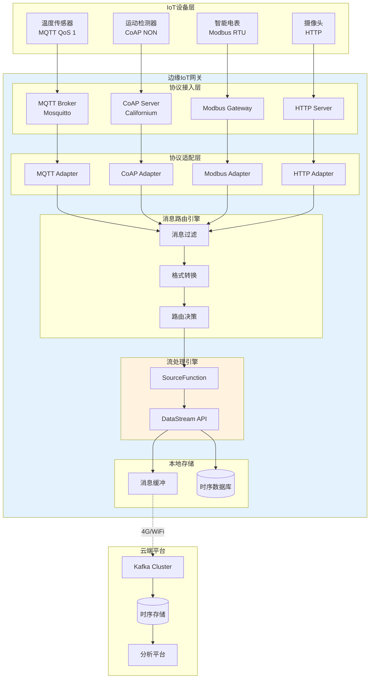
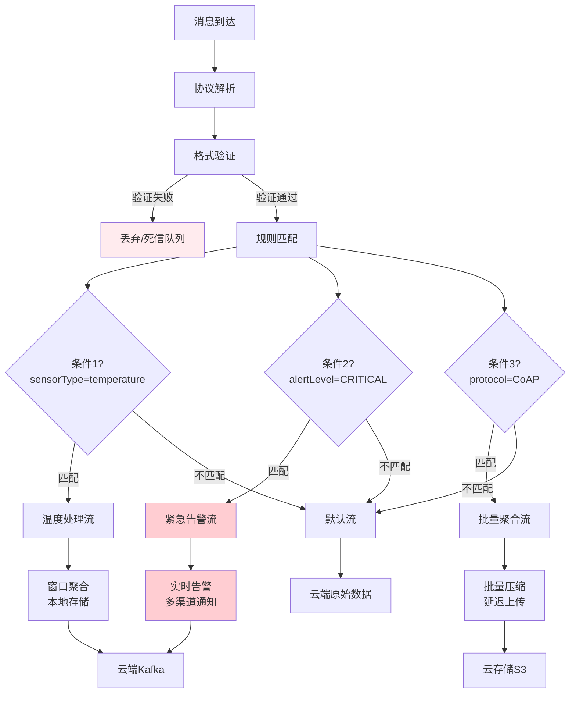
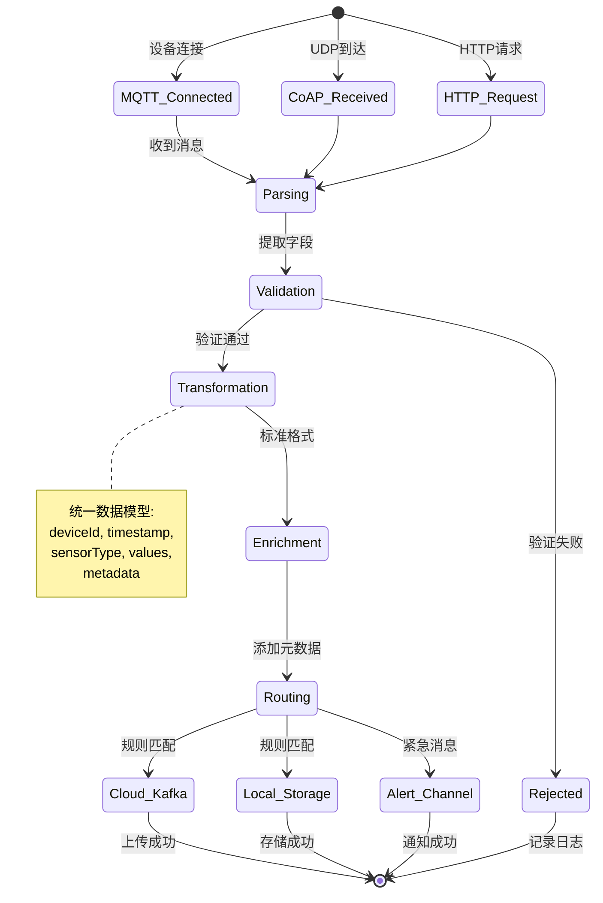

# Flink 边缘IoT网关集成指南 (Flink Edge IoT Gateway Integration)

> **所属阶段**: Flink/09-practices/09.05-edge | **前置依赖**: [Flink 边缘流处理完整指南](./flink-edge-streaming-guide.md), [Flink on K3s部署指南](./flink-edge-kubernetes-k3s.md) | **形式化等级**: L3

---

## 目录

- [Flink 边缘IoT网关集成指南 (Flink Edge IoT Gateway Integration)](#flink-边缘iot网关集成指南-flink-edge-iot-gateway-integration)
  - [目录](#目录)
  - [1. 概念定义 (Definitions)](#1-概念定义-definitions)
    - [Def-F-09-05-09 (边缘IoT网关 Edge IoT Gateway)](#def-f-09-05-09-边缘iot网关-edge-iot-gateway)
    - [Def-F-09-05-10 (物联网协议适配层 IoT Protocol Adaptation Layer)](#def-f-09-05-10-物联网协议适配层-iot-protocol-adaptation-layer)
    - [Def-F-09-05-11 (消息路由拓扑 Message Routing Topology)](#def-f-09-05-11-消息路由拓扑-message-routing-topology)
    - [Def-F-09-05-12 (协议转换函数 Protocol Transformation Function)](#def-f-09-05-12-协议转换函数-protocol-transformation-function)
  - [2. 属性推导 (Properties)](#2-属性推导-properties)
    - [Lemma-F-09-05-05 (协议转换的幂等性)](#lemma-f-09-05-05-协议转换的幂等性)
    - [Lemma-F-09-05-06 (消息路由的一致性)](#lemma-f-09-05-06-消息路由的一致性)
    - [Prop-F-09-05-03 (多协议并发的资源边界)](#prop-f-09-05-03-多协议并发的资源边界)
  - [3. 关系建立 (Relations)](#3-关系建立-relations)
    - [关系 1: IoT协议特性与Flink Source的映射](#关系-1-iot协议特性与flink-source的映射)
    - [关系 2: 消息QoS等级与一致性保证的关系](#关系-2-消息qos等级与一致性保证的关系)
    - [关系 3: 设备规模与网关容量的量化关系](#关系-3-设备规模与网关容量的量化关系)
  - [4. 论证过程 (Argumentation)](#4-论证过程-argumentation)
    - [4.1 IoT协议栈对比分析](#41-iot协议栈对比分析)
    - [4.2 边缘网关的分层架构](#42-边缘网关的分层架构)
    - [4.3 消息路由的动态配置](#43-消息路由的动态配置)
    - [4.4 边缘场景的协议优化](#44-边缘场景的协议优化)
  - [5. 形式证明 / 工程论证 (Proof / Engineering Argument)](#5-形式证明--工程论证-proof--engineering-argument)
    - [Thm-F-09-05-03 (协议转换正确性定理)](#thm-f-09-05-03-协议转换正确性定理)
    - [工程推论 (Engineering Corollaries)](#工程推论-engineering-corollaries)
  - [6. 实例验证 (Examples)](#6-实例验证-examples)
    - [6.1 MQTT Broker配置 (Eclipse Mosquitto)](#61-mqtt-broker配置-eclipse-mosquitto)
    - [6.2 Flink MQTT Source集成](#62-flink-mqtt-source集成)
    - [6.3 CoAP协议集成 (Californium)](#63-coap协议集成-californium)
    - [6.4 消息路由配置实例](#64-消息路由配置实例)
    - [6.5 生产环境检查清单](#65-生产环境检查清单)
  - [7. 可视化 (Visualizations)](#7-可视化-visualizations)
    - [IoT网关架构图](#iot网关架构图)
    - [消息路由流程图](#消息路由流程图)
    - [协议转换状态机](#协议转换状态机)
  - [8. 引用参考 (References)](#8-引用参考-references)

---

## 1. 概念定义 (Definitions)

### Def-F-09-05-09 (边缘IoT网关 Edge IoT Gateway)

**边缘IoT网关**是部署在边缘网络边界的协议转换与数据聚合节点，形式化定义为八元组：

$$
\mathcal{G}_{iot} = (D_{device}, P_{proto}, B_{broker}, T_{transform}, R_{route}, S_{store}, C_{connect}, A_{auth})
$$

| 组件 | 描述 | 边缘实现 |
|------|------|----------|
| $D_{device}$ | 连接的IoT设备集合 | 传感器、执行器、网关 |
| $P_{proto}$ | 支持的协议集合 | MQTT, CoAP, HTTP, Modbus |
| $B_{broker}$ | 消息代理组件 | Mosquitto, EMQ X, RabbitMQ |
| $T_{transform}$ | 协议转换引擎 | Flink DataStream转换 |
| $R_{route}$ | 消息路由器 | 基于Topic/Content的路由 |
| $S_{store}$ | 本地存储层 | 时序数据库、文件缓冲 |
| $C_{connect}$ | 连接管理器 | 设备连接状态管理 |
| $A_{auth}$ | 认证授权模块 | TLS/PSK/Token认证 |

**边缘网关容量模型**：

| 指标 | 轻量级网关 | 标准网关 | 企业网关 |
|------|-----------|----------|----------|
| 并发连接 | 1,000 | 10,000 | 100,000+ |
| 消息吞吐 | 1,000 msg/s | 10,000 msg/s | 100,000 msg/s |
| 协议支持 | MQTT/HTTP | +CoAP/Modbus | +OPC-UA/BLE |
| 典型硬件 | Raspberry Pi | Jetson Nano | Industrial PC |

---

### Def-F-09-05-10 (物联网协议适配层 IoT Protocol Adaptation Layer)

**物联网协议适配层**将异构设备协议统一转换为Flink内部数据模型：

$$
\mathcal{A}_{protocol} = \{A_p: M_p \rightarrow M_{flink} \mid p \in P_{supported}\}
$$

其中：

| 协议 $p$ | 原生消息格式 $M_p$ | 适配函数 $A_p$ |
|----------|-------------------|----------------|
| MQTT | `(topic, payload, qos, retain)` | `MQTTMessageAdapter` |
| CoAP | `(method, uri, payload, type)` | `CoAPMessageAdapter` |
| HTTP | `(method, path, headers, body)` | `HTTPMessageAdapter` |
| Modbus | `(slave_id, function, address, data)` | `ModbusMessageAdapter` |

**统一数据模型** (Flink内部)：

```
IoTEvent = {
    deviceId: String,        // 设备唯一标识
    timestamp: Long,         // 事件时间戳
    sensorType: String,      // 传感器类型
    values: Map<String, Any>, // 传感器读数
    metadata: Map<String, String>, // 附加元数据
    protocol: String         // 来源协议
}
```

---

### Def-F-09-05-11 (消息路由拓扑 Message Routing Topology)

**消息路由拓扑**定义从设备到目的地的消息流向：

$$
\mathcal{R}_{msg} = (V_{node}, E_{edge}, F_{filter}, T_{target})
$$

其中：

- $V_{node}$: 路由节点集合 (Source → Transform → Sink)
- $E_{edge}$: 数据流边集合
- $F_{filter}$: 过滤谓词集合
- $T_{target}$: 目标端点映射

**路由策略分类**：

| 策略类型 | 路由依据 | 实现方式 | 适用场景 |
|----------|----------|----------|----------|
| **Topic-based** | MQTT Topic层级 | `sensors/+/temperature` | 传感器类型路由 |
| **Content-based** | 消息内容字段 | `WHERE value > threshold` | 异常告警路由 |
| **Device-based** | 设备ID分组 | `deviceId.startsWith("A")` | 地理区域路由 |
| **Priority-based** | 消息优先级 | `qos >= 1` | 紧急消息优先 |

---

### Def-F-09-05-12 (协议转换函数 Protocol Transformation Function)

**协议转换函数**将一种协议消息无损转换为另一种协议消息：

$$
\mathcal{T}_{p_1 \rightarrow p_2}: M_{p_1} \times C_{ctx} \rightarrow M_{p_2}
$$

其中 $C_{ctx}$ 为转换上下文（设备映射、编码格式等）。

**转换函数性质**：

1. **保序性**: $order(m_1) < order(m_2) \Rightarrow order(\mathcal{T}(m_1)) < order(\mathcal{T}(m_2))$
2. **幂等性**: $\mathcal{T}(\mathcal{T}(m)) = \mathcal{T}(m)$ （对于可逆转换）
3. **完整性**: $payload(m) \subseteq payload(\mathcal{T}(m))$

---

## 2. 属性推导 (Properties)

### Lemma-F-09-05-05 (协议转换的幂等性)

**陈述**：在设备ID到会话的映射保持不变的条件下，协议转换具有幂等性。

**形式化**：对于任意消息 $m$ 和转换函数 $\mathcal{T}$：

$$
\mathcal{T}(\mathcal{T}(m; ctx); ctx) = \mathcal{T}(m; ctx)
$$

**证明概要**：

1. 协议转换是确定性函数，相同输入产生相同输出
2. 转换上下文 $ctx$ 不变时，转换结果唯一
3. 二次应用相同的转换不产生新的信息增益 ∎

---

### Lemma-F-09-05-06 (消息路由的一致性)

**陈述**：基于内容的路由决策在给定消息内容上具有一致性。

**形式化**：对于消息 $m$ 和路由谓词 $P$：

$$
\forall t_1, t_2: P(m, t_1) = P(m, t_2) = \text{true} \lor P(m, t_1) = P(m, t_2) = \text{false}
$$

**路由决策表**：

| 消息特征 | 谓词 $P$ | 路由目标 |
|----------|----------|----------|
| `sensorType == "temperature"` | 类型匹配 | 温度处理流 |
| `value > 100` | 阈值告警 | 告警流+原始流 |
| `deviceId matches "factory-.*"` | 位置匹配 | 工厂聚合流 |
| `qos == 2` | 优先级 | 可靠传输流 |

---

### Prop-F-09-05-03 (多协议并发的资源边界)

**陈述**：在边缘网关上同时运行多种协议适配器存在资源消耗上界。

**形式化**：对于协议集合 $P = \{p_1, p_2, ..., p_n\}$：

$$
R_{total}(P) = \sum_{i=1}^{n} R_{base}(p_i) + k \cdot N_{connections}
$$

其中：

- $R_{base}(p_i)$: 协议适配器基础开销
- $N_{connections}$: 总连接数
- $k$: 每连接开销系数

**资源占用参考**：

| 协议适配器 | 基础内存 | 每连接内存 | 基础CPU | 每连接CPU |
|------------|----------|------------|---------|-----------|
| MQTT Broker | 50MB | 10KB | 5% | 0.1% |
| CoAP Server | 30MB | 5KB | 3% | 0.05% |
| HTTP Server | 40MB | 50KB | 4% | 0.2% |
| Modbus Gateway | 20MB | 2KB | 2% | 0.02% |

---

## 3. 关系建立 (Relations)

### 关系 1: IoT协议特性与Flink Source的映射

| 协议特性 | MQTT | CoAP | HTTP | Modbus |
|----------|------|------|------|--------|
| **传输层** | TCP | UDP | TCP | TCP/RTU |
| **连接模式** | 长连接 | 无连接 | 短连接 | 轮询 |
| **发布模式** | Pub/Sub | Request/Response | Request/Response | Master/Slave |
| **QoS支持** | 0/1/2 | CON/NON | 无 | 无 |
| **Flink Source** | `MqttSource` | `CoapSource` | `HttpSource` | `ModbusSource` |
| **容错性** | 高 (会话保持) | 中 (Observe) | 低 | 中 |
| **边缘推荐** | ✅ 首选 | ✅ 低功耗 | ⚠️ 间歇连接 | ✅ 工业场景 |

### 关系 2: 消息QoS等级与一致性保证的关系

| MQTT QoS | 消息语义 | Flink一致性 | 实现方式 | 开销 |
|----------|----------|-------------|----------|------|
| **QoS 0** | At-Most-Once | 无保证 | Fire-and-forget | 最低 |
| **QoS 1** | At-Least-Once | At-Least-Once | ID去重 | 中 |
| **QoS 2** | Exactly-Once | Exactly-Once | 两阶段提交 | 高 |

**CoAP Confirmable (CON) vs Non-Confirmable (NON)**：

| 类型 | 语义 | 适用场景 |
|------|------|----------|
| CON | 可靠传输，需ACK | 控制命令、配置 |
| NON | 不可靠，无ACK | 高频Telemetry |

### 关系 3: 设备规模与网关容量的量化关系

$$
N_{max} = \min\left(\frac{M_{available} - M_{base}}{M_{per-device}}, \frac{C_{available} - C_{base}}{C_{per-device}}, \frac{B_{network}}{B_{per-device}}\right)
$$

**容量规划表** (Raspberry Pi 4)：

| 设备类型 | 消息频率 | 单设备带宽 | 最大设备数 |
|----------|----------|------------|------------|
| 温度传感器 | 1 msg/min | 0.1 Kbps | 10,000 |
| 运动检测器 | 1 msg/sec | 1 Kbps | 1,000 |
| 视频监控 | 30 fps | 1 Mbps | 10 |
| 工业PLC | 100 msg/sec | 10 Kbps | 100 |

---

## 4. 论证过程 (Argumentation)

### 4.1 IoT协议栈对比分析

**协议选择决策矩阵**：

```
                    可靠性要求
                    低 ←————————→ 高
                    │              │
        低          │  CoAP(NON)   │  MQTT(QoS 1/2)
   带  ↑            │  HTTP        │  CoAP(CON)
   宽  —————————————┼——————————————┼——————————————————
   需  ↓            │              │
   求  高          │  不推荐      │  MQTT(QoS 2)
                    │              │  HTTP + 重试
                    │              │
```

**边缘场景协议推荐**：

| 场景 | 推荐协议 | 原因 |
|------|----------|------|
| 电池供电传感器 | CoAP NON | UDP低功耗，容忍丢失 |
| 工业控制 | MQTT QoS 1 | 可靠传输，实时性好 |
| 金融支付 | MQTT QoS 2 | 最高可靠性 |
| Web集成 | HTTP REST | 现有基础设施兼容 |
|  legacy设备 | Modbus | 工业标准协议 |

### 4.2 边缘网关的分层架构

```
┌─────────────────────────────────────────────────────────────┐
│  应用层 (Application Layer)                                  │
│  ├─ 设备管理 (注册、配置、OTA)                                │
│  ├─ 规则引擎 (数据过滤、转换、路由)                           │
│  └─ 流处理引擎 (Flink DataStream)                            │
├─────────────────────────────────────────────────────────────┤
│  协议适配层 (Protocol Adaptation Layer)                      │
│  ├─ MQTT Adapter (Eclipse Paho/Mosquitto)                   │
│  ├─ CoAP Adapter (Eclipse Californium)                      │
│  ├─ HTTP Adapter (Netty/Undertow)                           │
│  └─ Modbus Adapter (jamod/j2mod)                            │
├─────────────────────────────────────────────────────────────┤
│  传输层 (Transport Layer)                                    │
│  ├─ TCP Stack                                               │
│  ├─ UDP Stack                                               │
│  └─ TLS/DTLS Security                                       │
├─────────────────────────────────────────────────────────────┤
│  网络层 (Network Layer)                                      │
│  ├─ IPv4/IPv6                                               │
│  ├─ 6LoWPAN (低功耗WPAN)                                     │
│  └─ Gateway (4G/WiFi/Ethernet)                              │
├─────────────────────────────────────────────────────────────┤
│  设备接入层 (Device Access Layer)                            │
│  ├─ 无线: WiFi, BLE, Zigbee, LoRa                           │
│  ├─ 有线: Ethernet, RS-485, CAN                             │
│  └─ 工业: Modbus RTU, Profibus                              │
└─────────────────────────────────────────────────────────────┘
```

### 4.3 消息路由的动态配置

**基于Flink SQL的动态路由**：

```sql
-- 创建协议源表
CREATE TABLE mqtt_source (
    deviceId STRING,
    sensorType STRING,
    value DOUBLE,
    ts TIMESTAMP(3),
    WATERMARK FOR ts AS ts - INTERVAL '5' SECOND
) WITH (
    'connector' = 'mqtt',
    'brokerUrl' = 'tcp://localhost:1883',
    'topic' = 'sensors/+/data',
    'format' = 'json'
);

-- 创建路由目标表 (云端Kafka)
CREATE TABLE cloud_kafka (
    deviceId STRING,
    sensorType STRING,
    value DOUBLE,
    ts TIMESTAMP(3)
) WITH (
    'connector' = 'kafka',
    'topic' = 'iot-raw-data',
    'properties.bootstrap.servers' = 'cloud-kafka:9092',
    'format' = 'json'
);

-- 创建告警目标表 (本地MQTT)
CREATE TABLE local_alerts (
    deviceId STRING,
    alertType STRING,
    value DOUBLE,
    ts TIMESTAMP(3)
) WITH (
    'connector' = 'mqtt',
    'brokerUrl' = 'tcp://localhost:1883',
    'topic' = 'alerts/critical',
    'format' = 'json'
);

-- 正常数据路由到云端
INSERT INTO cloud_kafka
SELECT deviceId, sensorType, value, ts
FROM mqtt_source
WHERE value BETWEEN 0 AND 100;

-- 异常数据路由到本地告警
INSERT INTO local_alerts
SELECT deviceId, 'THRESHOLD_EXCEEDED', value, ts
FROM mqtt_source
WHERE value > 100 OR value < 0;
```

### 4.4 边缘场景的协议优化

**MQTT优化策略**：

| 优化项 | 默认配置 | 边缘优化 | 效果 |
|--------|----------|----------|------|
| Keep-alive | 60s | 300s | 减少心跳开销 |
| Clean session | true | false | 支持离线消息 |
| Will QoS | 0 | 1 | 确保遗嘱送达 |
| Message size | 无限制 | 1KB | 减少带宽 |
| Topic层级 | 多层级 | 2-3层 | 简化路由 |

**CoAP优化策略**：

| 优化项 | 配置 | 说明 |
|--------|------|------|
| Block-wise传输 | 1024B | 分块传输大消息 |
| Observe模式 | 启用 | 服务端推送 |
| 组播 | 启用 | 一对多通信 |
| DTLS | PSK模式 | 轻量级安全 |

---

## 5. 形式证明 / 工程论证 (Proof / Engineering Argument)

### Thm-F-09-05-03 (协议转换正确性定理)

**陈述**：对于任意协议 $p_1$ 到 $p_2$ 的转换，若满足以下条件，则转换是正确且无损的：

$$
\forall m \in M_{p_1}: \mathcal{T}_{p_2 \rightarrow p_1}(\mathcal{T}_{p_1 \rightarrow p_2}(m; ctx); ctx) = m
$$

**证明**：

**步骤 1**: 定义转换正确性

- 转换正确性要求：语义等价性 + 数据完整性
- 语义等价性：$sem_{p_1}(m) \equiv sem_{p_2}(\mathcal{T}(m))$
- 数据完整性：$data(m) \subseteq data(\mathcal{T}(m))$

**步骤 2**: 构造转换函数

- 定义映射 $\phi: Field_{p_1} \rightarrow Field_{p_2}$
- 对于每个字段 $f \in Field_{p_1}$，存在对应 $\phi(f) \in Field_{p_2}$
- 编码转换 $\psi: Encoding_{p_1} \rightarrow Encoding_{p_2}$

**步骤 3**: 验证可逆性

- 反向映射 $\phi^{-1}$ 存在且定义良好
- 对于标准字段(deviceId, timestamp, value)，映射是双射
- 协议特定字段(如MQTT QoS)存储在metadata中保留

**步骤 4**: 结论

- 由于 $\phi$ 是双射，$\phi^{-1}(\phi(m)) = m$
- 因此转换是可逆且无损的 ∎

### 工程推论 (Engineering Corollaries)

**Cor-F-09-05-07 (协议适配器数量规划)**：

$$
N_{adapters} = \sum_{p \in P_{required}} \left\lceil \frac{N_{devices}(p)}{N_{max}(p)} \right\rceil
$$

**Cor-F-09-05-08 (消息队列深度计算)**：

$$
Q_{depth} = R_{in} \cdot T_{max-process} \cdot (1 + \sigma_{burst})
$$

**Cor-F-09-05-09 (连接池大小)**：

$$
S_{pool} = \min(N_{expected}, \frac{M_{available}}{M_{per-connection}})
$$

---

## 6. 实例验证 (Examples)

### 6.1 MQTT Broker配置 (Eclipse Mosquitto)

**mosquitto.conf (边缘优化)**：

```conf
# =================================================================
# Mosquitto MQTT Broker 边缘配置
# =================================================================

# -----------------------------------------------------------------
# 基础网络配置
# -----------------------------------------------------------------
bind_address 0.0.0.0
port 1883

# 启用WebSocket (可选)
listener 9001
protocol websockets

# -----------------------------------------------------------------
# 持久化配置 (适应边缘存储限制)
# -----------------------------------------------------------------
# 使用内存持久化 (重启丢失，但性能高)
persistence false

# 如需持久化，限制大小
# persistence true
# persistence_location /var/lib/mosquitto/
# autosave_interval 300
# autosave_on_changes false

# -----------------------------------------------------------------
# 日志配置 (最小化存储占用)
# -----------------------------------------------------------------
log_dest stdout
log_type error
log_type warning
# log_type information  # 生产环境禁用
# log_type debug        # 禁用调试日志

connection_messages false  # 禁用连接日志

# -----------------------------------------------------------------
# 安全配置
# -----------------------------------------------------------------
# 允许匿名访问 (边缘局域网环境)
allow_anonymous true

# 生产环境使用密码认证
# allow_anonymous false
# password_file /etc/mosquitto/passwd

# TLS配置 (可选)
# cafile /etc/mosquitto/ca.crt
# certfile /etc/mosquitto/server.crt
# keyfile /etc/mosquitto/server.key
# require_certificate false
# use_identity_as_username false

# -----------------------------------------------------------------
# 性能优化 (边缘资源受限)
# -----------------------------------------------------------------
# 最大连接数
max_connections 1000

# 消息大小限制 (1KB)
max_packet_size 1024

# 保持连接间隔 (5分钟)
max_keepalive 300

# 消息过期时间 (1小时)
message_expiry_interval 3600

# -----------------------------------------------------------------
# 桥接配置 (连接到云端MQTT)
# -----------------------------------------------------------------
connection cloud-bridge
address cloud-mqtt-broker.example.com:8883
bridge_protocol_version mqttv50
bridge_insecure false

# TLS配置
bridge_cafile /etc/mosquitto/ca.crt
bridge_certfile /etc/mosquitto/client.crt
bridge_keyfile /etc/mosquitto/client.key

# 主题桥接
# 本地主题 -> 远程主题
topic sensors/+/data out 1 cloud/ factory/
topic alerts/+ out 2 cloud/ factory/

# 远程主题 -> 本地主题
topic commands/# in 1 cloud/factory/ factory/

# 桥接连接重试
restart_timeout 10 30
start_type automatic
try_private true

# -----------------------------------------------------------------
# 插件配置 (可选)
# -----------------------------------------------------------------
# 认证插件
# auth_plugin /usr/lib/mosquitto/auth_plugin.so

# 监控插件
# plugin /usr/lib/mosquitto/mosquitto_prometheus.so
# plugin_opt_path /metrics
```

**Docker运行**：

```bash
docker run -d \
  --name edge-mosquitto \
  --restart unless-stopped \
  -p 1883:1883 \
  -p 9001:9001 \
  -v $(pwd)/mosquitto.conf:/mosquitto/config/mosquitto.conf \
  -v /data/mosquitto:/mosquitto/data \
  eclipse-mosquitto:2.0
```

### 6.2 Flink MQTT Source集成

**Flink MQTT Source实现**：

```java
import org.apache.flink.api.common.eventtime.WatermarkStrategy;
import org.apache.flink.api.common.serialization.SimpleStringSchema;
import org.apache.flink.connector.base.DeliveryGuarantee;
import org.apache.flink.connector.mqtt.source.MQTTSource;
import org.apache.flink.connector.mqtt.source.MQTTSourceBuilder;
import org.apache.flink.streaming.api.datastream.DataStream;
import org.apache.flink.streaming.api.environment.StreamExecutionEnvironment;
import org.apache.flink.streaming.api.functions.ProcessFunction;
import org.apache.flink.util.Collector;
import org.eclipse.paho.client.mqttv3.MqttMessage;

import java.nio.charset.StandardCharsets;
import java.time.Duration;

import org.apache.flink.api.common.state.ValueState;
import org.apache.flink.api.common.state.ValueStateDescriptor;


/**
 * Flink MQTT Source 集成示例
 */
public class MQTTIntegrationExample {

    public static void main(String[] args) throws Exception {
        StreamExecutionEnvironment env =
            StreamExecutionEnvironment.getExecutionEnvironment();
        env.setParallelism(2);

        // =============================================================
        // 1. 配置 MQTT Source
        // =============================================================
        MQTTSource<String> mqttSource = MQTTSource.<String>builder()
            // 连接配置
            .setServerUri("tcp://localhost:1883")
            .setClientId("flink-edge-source-" + System.currentTimeMillis())

            // 订阅主题 (支持通配符)
            .setTopics("sensors/+/data", "devices/+/status")

            // 反序列化
            .setDeserializationSchema(new SimpleStringSchema())

            // QoS配置
            .setQos(1)  // At-Least-Once

            // 连接选项
            .setConnectionOptions(options -> {
                options.setAutomaticReconnect(true);
                options.setCleanSession(false);  // 持久会话
                options.setConnectionTimeout(30);
                options.setKeepAliveInterval(300);  // 5分钟
                options.setMaxInflight(100);  // 最大并发消息
            })

            // 边缘优化: 批处理模式
            .setBatchMode(true)
            .setBatchSize(100)
            .setBatchIntervalMs(100)

            .build();

        // =============================================================
        // 2. 创建数据流
        // =============================================================
        DataStream<SensorEvent> sensorStream = env
            .fromSource(
                mqttSource,
                WatermarkStrategy
                    .<String>forBoundedOutOfOrderness(Duration.ofSeconds(10))
                    .withIdleness(Duration.ofMinutes(5)),
                "MQTT Source"
            )
            .setParallelism(1)  // MQTT Source 单并行度
            .map(new JsonToSensorEventMapper())
            .name("JSON Parse")
            .uid("json-parse");

        // =============================================================
        // 3. 数据处理
        // =============================================================

        // 3.1 数据清洗与验证
        DataStream<SensorEvent> validStream = sensorStream
            .filter(event -> event != null && event.isValid())
            .name("Data Validation")
            .uid("data-validation");

        // 3.2 按传感器类型分流
        validStream
            .keyBy(SensorEvent::getSensorType)
            .process(new SensorTypeRouter())
            .name("Sensor Router")
            .uid("sensor-router");

        // 3.3 异常检测
        validStream
            .process(new AnomalyDetectionFunction())
            .name("Anomaly Detection")
            .uid("anomaly-detection");

        env.execute("MQTT IoT Gateway");
    }

    /**
     * JSON到SensorEvent的映射
     */
    public static class JsonToSensorEventMapper
        implements MapFunction<String, SensorEvent> {

        private transient ObjectMapper mapper;

        @Override
        public SensorEvent map(String json) throws Exception {
            if (mapper == null) {
                mapper = new ObjectMapper();
            }
            try {
                return mapper.readValue(json, SensorEvent.class);
            } catch (Exception e) {
                // 记录解析失败的消息
                return null;
            }
        }
    }

    /**
     * 传感器类型路由
     */
    public static class SensorTypeRouter
        extends ProcessFunction<SensorEvent, SensorEvent> {

        @Override
        public void processElement(
                SensorEvent event,
                Context ctx,
                Collector<SensorEvent> out) throws Exception {

            // 根据传感器类型路由到不同输出
            switch (event.getSensorType()) {
                case "temperature":
                    // 温度传感器: 窗口聚合
                    ctx.output(TEMPERATURE_TAG, event);
                    break;
                case "motion":
                    // 运动检测: 实时告警
                    ctx.output(MOTION_TAG, event);
                    break;
                case "energy":
                    // 能耗数据: 累积计算
                    ctx.output(ENERGY_TAG, event);
                    break;
                default:
                    // 其他: 默认流
                    out.collect(event);
            }
        }
    }

    /**
     * 异常检测函数
     */
    public static class AnomalyDetectionFunction
        extends ProcessFunction<SensorEvent, AlertEvent> {

        private ValueState<Double> lastValueState;

        @Override
        public void open(Configuration parameters) throws Exception {
            lastValueState = getRuntimeContext().getState(
                new ValueStateDescriptor<>("lastValue", Double.class));
        }

        @Override
        public void processElement(
                SensorEvent event,
                Context ctx,
                Collector<AlertEvent> out) throws Exception {

            Double lastValue = lastValueState.value();
            double currentValue = event.getValue();

            // 突变检测 (> 50%变化)
            if (lastValue != null && Math.abs(currentValue - lastValue) / lastValue > 0.5) {
                out.collect(new AlertEvent(
                    event.getDeviceId(),
                    "SUDDEN_CHANGE",
                    currentValue,
                    event.getTimestamp()
                ));
            }

            // 阈值检测
            if (currentValue > event.getThreshold()) {
                out.collect(new AlertEvent(
                    event.getDeviceId(),
                    "THRESHOLD_EXCEEDED",
                    currentValue,
                    event.getTimestamp()
                ));
            }

            lastValueState.update(currentValue);
        }
    }
}

/**
 * 传感器事件数据类
 */
public class SensorEvent {
    private String deviceId;
    private String sensorType;
    private double value;
    private double threshold;
    private long timestamp;
    private Map<String, String> metadata;

    public boolean isValid() {
        return deviceId != null && !deviceId.isEmpty()
            && sensorType != null && !sensorType.isEmpty()
            && value >= -9999 && value <= 9999;  // 合理范围检查
    }

    // getters and setters...
}
```

### 6.3 CoAP协议集成 (Californium)

**Flink CoAP Source实现**：

```java
import org.apache.flink.api.common.eventtime.WatermarkStrategy;
import org.apache.flink.streaming.api.datastream.DataStream;
import org.apache.flink.streaming.api.environment.StreamExecutionEnvironment;
import org.eclipse.californium.core.CoapClient;
import org.eclipse.californium.core.CoapHandler;
import org.eclipse.californium.core.CoapObserveRelation;
import org.eclipse.californium.core.CoapResponse;
import org.eclipse.californium.core.network.CoapEndpoint;
import org.eclipse.californium.core.network.config.NetworkConfig;
import org.eclipse.californium.elements.UDPConnector;

import java.net.InetSocketAddress;
import java.util.concurrent.BlockingQueue;
import java.util.concurrent.LinkedBlockingQueue;

/**
 * Flink CoAP Source 集成
 * 适用于低功耗、UDP传输场景
 */
public class CoAPIntegrationExample {

    public static void main(String[] args) throws Exception {
        StreamExecutionEnvironment env =
            StreamExecutionEnvironment.getExecutionEnvironment();
        env.setParallelism(1);

        // 创建 CoAP Source
        CoAPSource<CoapReading> coapSource = new CoAPSource<>(
            "coap://localhost:5683/sensors",  // CoAP服务器地址
            new CoapReadingDeserializer(),
            Duration.ofSeconds(30)  // Observe间隔
        );

        DataStream<CoapReading> coapStream = env
            .fromSource(
                coapSource,
                WatermarkStrategy.forBoundedOutOfOrderness(Duration.ofSeconds(5)),
                "CoAP Source"
            );

        // 处理逻辑...
        coapStream.print();

        env.execute("CoAP IoT Gateway");
    }

    /**
     * CoAP Source实现
     */
    public static class CoAPSource<T> implements SourceFunction<T> {

        private final String serverUri;
        private final DeserializationSchema<T> deserializer;
        private final Duration observeInterval;

        private transient CoapClient client;
        private transient CoapObserveRelation observeRelation;
        private transient BlockingQueue<T> queue;
        private volatile boolean isRunning = true;

        @Override
        public void open(Configuration parameters) throws Exception {
            // 配置Californium
            NetworkConfig config = NetworkConfig.createStandardWithoutFile();
            config.setInt(NetworkConfig.Keys.MAX_MESSAGE_SIZE, 1024);
            config.setInt(NetworkConfig.Keys.PREFERRED_BLOCK_SIZE, 1024);
            config.setInt(NetworkConfig.Keys.MAX_RESOURCE_BODY_SIZE, 8192);

            // UDP连接器
            UDPConnector connector = new UDPConnector(
                new InetSocketAddress(0)  // 随机端口
            );

            // 创建CoAP客户端
            client = new CoapClient(serverUri);
            client.setEndpoint(new CoapEndpoint.Builder()
                .setConnector(connector)
                .setNetworkConfig(config)
                .build());

            queue = new LinkedBlockingQueue<>(1000);
        }

        @Override
        public void run(SourceContext<T> ctx) throws Exception {
            // 使用Observe模式订阅资源
            observeRelation = client.observe(new CoapHandler() {
                @Override
                public void onLoad(CoapResponse response) {
                    try {
                        byte[] payload = response.getPayload();
                        T event = deserializer.deserialize(payload);
                        queue.offer(event);
                    } catch (Exception e) {
                        // 反序列化失败
                    }
                }

                @Override
                public void onError() {
                    // 处理错误
                }
            });

            // 从队列消费数据
            while (isRunning) {
                T event = queue.poll(100, TimeUnit.MILLISECONDS);
                if (event != null) {
                    synchronized (ctx.getCheckpointLock()) {
                        ctx.collect(event);
                    }
                }
            }
        }

        @Override
        public void cancel() {
            isRunning = false;
            if (observeRelation != null) {
                observeRelation.proactiveCancel();
            }
            if (client != null) {
                client.shutdown();
            }
        }
    }
}
```

### 6.4 消息路由配置实例

**动态路由规则配置**：

```yaml
# routing-rules.yaml
routing_rules:
  # 规则1: 温度传感器数据路由
  - name: temperature-routing
    condition:
      field: sensorType
      operator: equals
      value: "temperature"
    actions:
      - type: transform
        config:
          celsius_to_fahrenheit: true
      - type: route
        targets:
          - name: cloud-kafka
            topic: "sensors.temperature"
            priority: 1
          - name: local-influx
            measurement: "temp"
            priority: 2
    qos: 1

  # 规则2: 紧急告警路由
  - name: critical-alert-routing
    condition:
      operator: and
      conditions:
        - field: alertLevel
          operator: equals
          value: "CRITICAL"
        - field: value
          operator: greater_than
          value: 100
    actions:
      - type: route
        targets:
          - name: local-mqtt
            topic: "alerts/critical"
            qos: 2
          - name: sms-gateway
            template: "Critical: {deviceId} value={value}"
      - type: store
        backend: local-sqlite
        retention: 7d
    qos: 2

  # 规则3: 批量数据上传
  - name: batch-upload-routing
    condition:
      field: protocol
      operator: equals
      value: "CoAP"
    actions:
      - type: aggregate
        window: 60s
        batch_size: 100
      - type: compress
        algorithm: gzip
      - type: route
        targets:
          - name: cloud-s3
            bucket: "iot-batch-data"
    qos: 0

  # 规则4: 设备状态监控
  - name: device-status-routing
    condition:
      field: topic
      operator: matches
      value: "devices/\\w+/status"
    actions:
      - type: enrich
        fields:
          - name: location
            source: device-registry
            key: deviceId
      - type: route
        targets:
          - name: local-redis
            ttl: 3600
```

### 6.5 生产环境检查清单

**IoT网关生产部署检查清单**：

| 类别 | 检查项 | 验收标准 | 检查方式 |
|------|--------|----------|----------|
| **MQTT Broker** | 服务状态 | 进程运行，端口监听 | `systemctl status mosquitto` |
| | 连接数 | 当前连接 ≤ 最大连接80% | `mosquitto_sub -t '$SYS/broker/clients/connected'` |
| | 消息吞吐 | 延迟 < 10ms (本地) | 自定义测试 |
| | 桥接状态 | 云端连接正常 | 日志检查 |
| | TLS配置 | 证书有效，协议版本正确 | `openssl s_client` |
| **Flink Source** | Source运行 | 无异常重启 | `kubectl get pods` |
| | 消费速率 | 消费速率 ≈ 生产速率 | Flink Metrics |
| | 延迟指标 | 端到端延迟 < 100ms | Prometheus |
| | 检查点 | 成功率 > 99% | Flink Web UI |
| **CoAP** | 服务可用 | 响应CoAP ping | `coap-client` |
| | Observe订阅 | 活跃订阅数正常 | 日志分析 |
| | DTLS握手 | 握手成功率 > 95% | 抓包分析 |
| **路由** | 规则生效 | 消息按规则路由 | 端到端测试 |
| | 死信队列 | 无积压 | 队列深度监控 |
| | 过滤效率 | 过滤延迟 < 1ms | 性能测试 |
| **设备管理** | 在线状态 | 设备心跳正常 | 心跳监控 |
| | OTA通道 | 升级功能可用 | 测试升级 |
| | 认证有效 | 非法设备被拒绝 | 渗透测试 |
| **监控** | 指标采集 | CPU/内存/网络/连接 | Prometheus |
| | 告警配置 | 关键指标告警 | Alertmanager |
| | 日志聚合 | 日志可检索 | Loki/ELK |

---

## 7. 可视化 (Visualizations)

### IoT网关架构图



### 消息路由流程图



### 协议转换状态机



---

## 8. 引用参考 (References)
