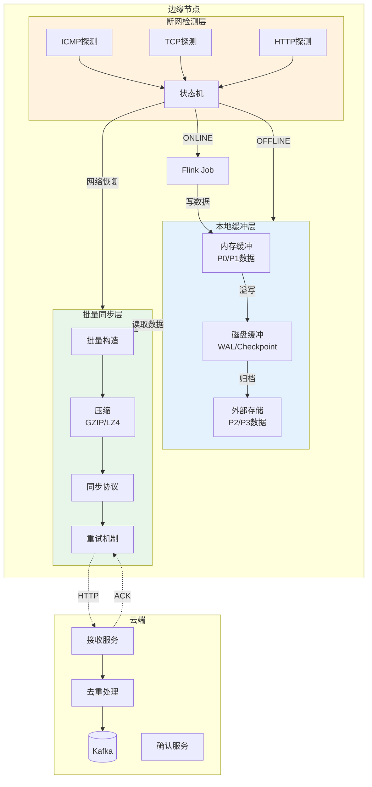
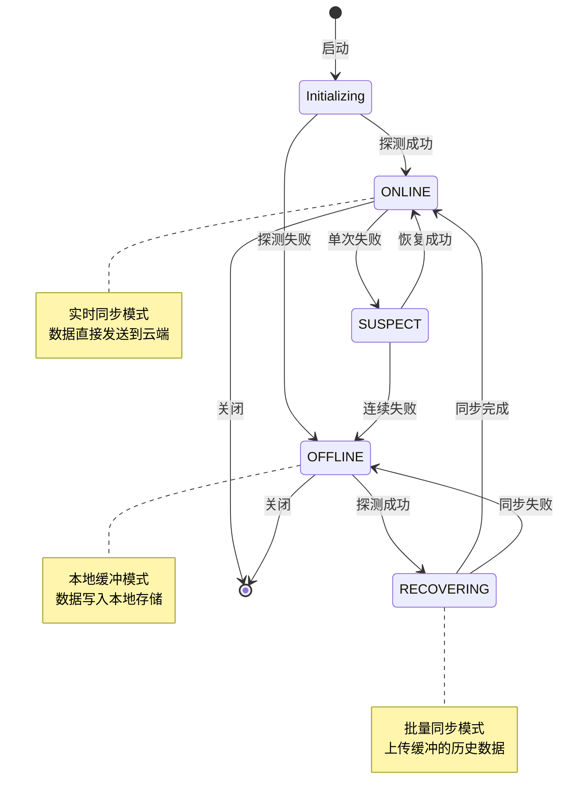
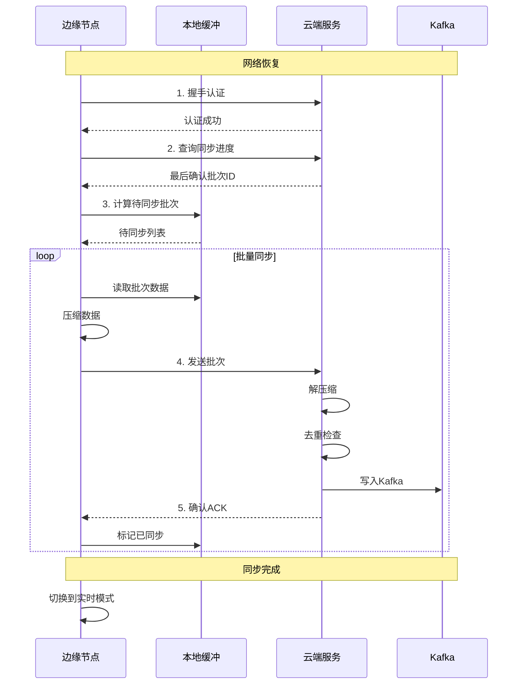

# Flink 边缘离线同步策略指南 (Flink Edge Offline Sync Strategy)

> **所属阶段**: Flink/09-practices/09.05-edge | **前置依赖**: [Flink 边缘流处理完整指南](./flink-edge-streaming-guide.md), [Flink 边缘IoT网关集成指南](./flink-edge-iot-gateway.md) | **形式化等级**: L3

---

## 目录

- [Flink 边缘离线同步策略指南 (Flink Edge Offline Sync Strategy)](#flink-边缘离线同步策略指南-flink-edge-offline-sync-strategy)
  - [目录](#目录)
  - [1. 概念定义 (Definitions)](#1-概念定义-definitions)
    - [Def-F-09-05-13 (间歇性网络连接 Intermittent Network Connection)](#def-f-09-05-13-间歇性网络连接-intermittent-network-connection)
    - [Def-F-09-05-14 (本地缓冲策略 Local Buffering Strategy)](#def-f-09-05-14-本地缓冲策略-local-buffering-strategy)
    - [Def-F-09-05-15 (批量同步协议 Batch Synchronization Protocol)](#def-f-09-05-15-批量同步协议-batch-synchronization-protocol)
    - [Def-F-09-05-16 (断网检测机制 Network Disconnection Detection)](#def-f-09-05-16-断网检测机制-network-disconnection-detection)
  - [2. 属性推导 (Properties)](#2-属性推导-properties)
    - [Lemma-F-09-05-07 (缓冲区容量的时间边界)](#lemma-f-09-05-07-缓冲区容量的时间边界)
    - [Lemma-F-09-05-08 (批量同步的效率增益)](#lemma-f-09-05-08-批量同步的效率增益)
    - [Prop-F-09-05-04 (离线容忍度的量化)](#prop-f-09-05-04-离线容忍度的量化)
  - [3. 关系建立 (Relations)](#3-关系建立-relations)
    - [关系 1: 网络质量与同步策略的映射](#关系-1-网络质量与同步策略的映射)
    - [关系 2: 数据优先级与缓冲策略的关系](#关系-2-数据优先级与缓冲策略的关系)
    - [关系 3: 离线时长与数据丢失风险的关系](#关系-3-离线时长与数据丢失风险的关系)
  - [4. 论证过程 (Argumentation)](#4-论证过程-argumentation)
    - [4.1 断网检测机制设计](#41-断网检测机制设计)
    - [4.2 多级缓冲架构](#42-多级缓冲架构)
    - [4.3 批量同步协议设计](#43-批量同步协议设计)
    - [4.4 故障恢复与断点续传](#44-故障恢复与断点续传)
  - [5. 形式证明 / 工程论证 (Proof / Engineering Argument)](#5-形式证明--工程论证-proof--engineering-argument)
    - [Thm-F-09-05-04 (离线数据完整性定理)](#thm-f-09-05-04-离线数据完整性定理)
    - [工程推论 (Engineering Corollaries)](#工程推论-engineering-corollaries)
  - [6. 实例验证 (Examples)](#6-实例验证-examples)
    - [6.1 断网检测实现](#61-断网检测实现)
    - [6.2 本地缓冲配置](#62-本地缓冲配置)
    - [6.3 批量同步协议实现](#63-批量同步协议实现)
    - [6.4 Flink Checkpoint离线恢复](#64-flink-checkpoint离线恢复)
    - [6.5 生产环境检查清单](#65-生产环境检查清单)
  - [7. 可视化 (Visualizations)](#7-可视化-visualizations)
    - [离线同步架构图](#离线同步架构图)
    - [状态转换图](#状态转换图)
    - [批量同步流程图](#批量同步流程图)
  - [8. 引用参考 (References)](#8-引用参考-references)

---

## 1. 概念定义 (Definitions)

### Def-F-09-05-13 (间歇性网络连接 Intermittent Network Connection)

**间歇性网络连接**描述边缘设备到云端的时变连通性，形式化定义为：

$$
\mathcal{N}_{inter}(t) = (S(t), B(t), L(t), H(t))
$$

其中：

| 符号 | 语义 | 描述 |
|------|------|------|
| $S(t) \in \{ON, OFF\}$ | 连接状态 | 在线/离线指示函数 |
| $B(t)$ | 可用带宽 | 时变带宽函数 (bps) |
| $L(t)$ | 网络延迟 | 往返时延 (ms) |
| $H(t)$ | 连接历史 | 连接状态转移记录 |

**网络状态转移模型**：

$$
S(t+\Delta t) = \begin{cases}
ON & \text{if } probe(t) = success \land B(t) \geq B_{min} \\
OFF & \text{if } probe(t) = fail \lor B(t) < B_{min} \\
S(t) & \text{otherwise (保持状态)}
\end{cases}
$$

**边缘典型网络模式**：

| 场景 | 在线比例 | 带宽范围 | 适用策略 |
|------|----------|----------|----------|
| 4G/5G移动 | 85-95% | 1-100 Mbps | 实时+批量混合 |
| WiFi企业 | 95-99% | 10-1000 Mbps | 近实时同步 |
| 卫星通信 | 60-80% | 0.1-10 Mbps | 高压缩批量 |
| 间歇性拨号 | 10-50% | 0.01-1 Mbps | 纯批量模式 |

---

### Def-F-09-05-14 (本地缓冲策略 Local Buffering Strategy)

**本地缓冲策略**定义在离线期间如何存储待同步数据：

$$
\mathcal{B}_{local} = (S_{storage}, P_{placement}, R_{replacement}, C_{compression}, T_{ttl})
$$

其中：

| 组件 | 描述 | 选项 |
|------|------|------|
| $S_{storage}$ | 存储介质 | 内存 / 本地磁盘 / SD卡 |
| $P_{placement}$ | 放置策略 | FIFO / 优先级 / 分层 |
| $R_{replacement}$ | 替换策略 | LRU / LFU / 时间淘汰 |
| $C_{compression}$ | 压缩算法 | GZIP / LZ4 / ZSTD / Snappy |
| $T_{ttl}$ | 生存时间 | 数据过期时间 |

**多级缓冲架构**：

```
┌─────────────────────────────────────────────────────────┐
│  Level 1: 内存缓冲 (Memory Buffer)                       │
│  ├─ 容量: 100-500MB                                     │
│  ├─ 延迟: < 1ms                                         │
│  ├─ 策略: 高频访问数据                                   │
│  └─ 持久化: 否 (易失性)                                  │
├─────────────────────────────────────────────────────────┤
│  Level 2: 本地磁盘 (Local Disk)                          │
│  ├─ 容量: 1-10GB                                        │
│  ├─ 延迟: 1-10ms                                        │
│  ├─ 策略: 检查点、WAL                                   │
│  └─ 持久化: 是                                          │
├─────────────────────────────────────────────────────────┤
│  Level 3: 外部存储 (External Storage)                    │
│  ├─ 容量: 10GB+ (SD卡/USB)                              │
│  ├─ 延迟: 10-100ms                                      │
│  ├─ 策略: 归档数据、历史记录                             │
│  └─ 持久化: 是                                          │
└─────────────────────────────────────────────────────────┘
```

---

### Def-F-09-05-15 (批量同步协议 Batch Synchronization Protocol)

**批量同步协议**定义数据在网络恢复后如何高效传输到云端：

$$
\mathcal{P}_{sync} = (F_{batch}, C_{compress}, A_{ack}, R_{retry}, T_{timeout})
$$

**协议要素**：

| 要素 | 描述 | 配置参数 |
|------|------|----------|
| $F_{batch}$ | 批处理大小 | 100-10,000 条/批 |
| $C_{compress}$ | 压缩级别 | 0-9 (GZIP) |
| $A_{ack}$ | 确认机制 | 单条确认 / 批量确认 / 无确认 |
| $R_{retry}$ | 重试策略 | 指数退避 / 固定间隔 / 最大重试次数 |
| $T_{timeout}$ | 超时时间 | 10s-5min |

**批量同步模式**：

| 模式 | 触发条件 | 延迟 | 可靠性 | 带宽效率 |
|------|----------|------|--------|----------|
| **实时模式** | 网络在线 | <1s | 高 | 低 |
| **微批量** | 缓冲区满或定时 | 1-10s | 高 | 中 |
| **批量模式** | 网络恢复 | 分钟级 | 高 | 高 |
| **压缩批量** | 大数据量 | 分钟级 | 中 | 最高 |

---

### Def-F-09-05-16 (断网检测机制 Network Disconnection Detection)

**断网检测机制**通过主动探测判断网络连通性：

$$
\mathcal{D}_{net} = (P_{probe}, I_{interval}, T_{timeout}, N_{retry}, F_{action})
$$

**检测参数**：

| 参数 | 描述 | 推荐值 | 说明 |
|------|------|--------|------|
| $P_{probe}$ | 探测目标 | 云端健康端点 | HTTP/ICMP/TCP |
| $I_{interval}$ | 探测间隔 | 5-30s | 在线时频率 |
| $T_{timeout}$ | 超时阈值 | 3-10s | 判定失败 |
| $N_{retry}$ | 重试次数 | 2-5次 | 避免误判 |
| $F_{action}$ | 触发动作 | 切换缓冲模式 | 回调函数 |

**状态机模型**：

```
          ┌───────────────────────────────────────┐
          │                                       ▼
    ┌──────────┐    探测失败      ┌──────────┐   探测成功
    │  ONLINE  │◄────────────────►│  OFFLINE │
    └──────────┘   (N次连续)      └──────────┘
          │                              │
          │  实时同步                     │  本地缓冲
          ▼                              ▼
    [Cloud Sink]                  [Local Buffer]
```

---

## 2. 属性推导 (Properties)

### Lemma-F-09-05-07 (缓冲区容量的时间边界)

**陈述**：在已知最大离线时间和数据摄入速率下，缓冲容量需求可计算。

**形式化**：

$$
C_{buf} = R_{in} \cdot T_{offline}^{max} \cdot (1 - \rho_{compress}) \cdot (1 + \sigma_{safety})
$$

其中：
- $R_{in}$: 平均数据摄入速率 (bytes/s)
- $T_{offline}^{max}$: 最大预期离线时间 (s)
- $\rho_{compress}$: 压缩率
- $\sigma_{safety}$: 安全系数 (通常 0.2-0.5)

**计算示例**：

```
场景: 工厂边缘网关
数据摄入: 10,000 events/sec × 200 bytes/event = 2 MB/sec
压缩率: 80% (ρ=0.8)
最大离线: 8小时 (28,800秒)
安全系数: 30%

C_buf = 2MB/s × 28,800s × 0.2 × 1.3 = 14.98 GB

推荐配置: 32GB SD卡 (保留50%余量)
```

---

### Lemma-F-09-05-08 (批量同步的效率增益)

**陈述**：批量同步相比实时同步具有显著的带宽效率增益。

**形式化**：

$$
\eta_{efficiency} = \frac{B_{overhead}^{realtime} \cdot N}{B_{header}^{batch} + B_{payload}}
$$

其中：
- $B_{overhead}^{realtime}$: 每条消息的协议开销 (TCP头 + HTTP头 ≈ 300 bytes)
- $N$: 批量消息数
- $B_{header}^{batch}$: 批量请求头开销
- $B_{payload}$: 压缩后的消息体

**效率对比** (假设每条消息200 bytes)：

| 同步模式 | 单条开销 | 100条开销 | 效率比 |
|----------|----------|-----------|--------|
| 实时单条 | 500 bytes | 50,000 bytes | 1× |
| 批量无压缩 | 500 + 20,000 | 20,500 bytes | 2.4× |
| 批量GZIP | 500 + 4,000 | 4,500 bytes | 11× |
| 批量LZ4 | 500 + 6,000 | 6,500 bytes | 7.7× |

---

### Prop-F-09-05-04 (离线容忍度的量化)

**陈述**：系统的离线容忍度取决于缓冲区容量和数据产生速率。

**形式化**：

$$
T_{tolerance} = \frac{C_{buf} \cdot \rho_{compress}}{R_{in} - R_{drain}}
$$

其中 $R_{drain}$ 为离线期间可本地处理/丢弃的速率。

**容忍度分级**：

| 等级 | 离线时长 | 典型场景 | 配置要求 |
|------|----------|----------|----------|
| L1 - 瞬时 | < 1分钟 | 网络抖动 | 内存缓冲 |
| L2 - 短期 | 1分钟 - 1小时 | WiFi切换 | 本地磁盘 |
| L3 - 中期 | 1小时 - 24小时 | 计划维护 | 外部存储 |
| L4 - 长期 | > 24小时 | 设备搬迁 | 数据归档 |

---

## 3. 关系建立 (Relations)

### 关系 1: 网络质量与同步策略的映射

| 网络质量 | 探测指标 | 同步策略 | 缓冲级别 |
|----------|----------|----------|----------|
| 优秀 | 延迟<50ms, 丢包<0.1% | 实时同步 | L1 |
| 良好 | 延迟<200ms, 丢包<1% | 近实时(1s批量) | L1 |
| 一般 | 延迟<1s, 丢包<5% | 微批量(10s) | L2 |
| 差 | 延迟>1s, 丢包>5% | 压缩批量 | L2-L3 |
| 离线 | 无连接 | 本地存储 | L3 |

### 关系 2: 数据优先级与缓冲策略的关系

| 优先级 | 数据类型 | 缓冲策略 | 淘汰顺序 |
|--------|----------|----------|----------|
| P0 - 紧急 | 告警、故障 | 内存+多副本 | 永不淘汰 |
| P1 - 高 | 关键业务 | 磁盘+快速同步 | 最后淘汰 |
| P2 - 中 | 常规遥测 | 标准缓冲 | 正常淘汰 |
| P3 - 低 | 日志、统计 | 可丢弃 | 优先淘汰 |

### 关系 3: 离线时长与数据丢失风险的关系

$$
Risk_{loss}(t) = 1 - e^{-\lambda \cdot t}
$$

其中 $\lambda$ 为风险系数，取决于硬件故障率。

---

## 4. 论证过程 (Argumentation)

### 4.1 断网检测机制设计

**三层检测架构**：

```
┌─────────────────────────────────────────────────────────┐
│  Layer 3: 应用层检测 (Application Layer)                 │
│  ├─ HTTP健康检查 (200 OK)                                │
│  ├─ 业务接口探活                                         │
│  └─ 频率: 10-30s                                         │
├─────────────────────────────────────────────────────────┤
│  Layer 2: 传输层检测 (Transport Layer)                   │
│  ├─ TCP连接状态检查                                      │
│  ├─ 心跳包 (Keepalive)                                   │
│  └─ 频率: 5-10s                                          │
├─────────────────────────────────────────────────────────┤
│  Layer 1: 网络层检测 (Network Layer)                     │
│  ├─ ICMP Ping                                            │
│  ├─ DNS解析测试                                          │
│  └─ 频率: 1-5s                                           │
└─────────────────────────────────────────────────────────┘
```

**检测算法伪代码**：

```python
class NetworkDetector:
    def __init__(self):
        self.state = NetworkState.ONLINE
        self.fail_count = 0
        self.threshold = 3  # 连续失败阈值
        
    def probe(self) -> bool:
        """执行网络探测"""
        # 三层检测
        if not self._layer1_check():
            return False
        if not self._layer2_check():
            return False
        return self._layer3_check()
    
    def _layer1_check(self) -> bool:
        """网络层检测"""
        try:
            result = ping(self.gateway, timeout=2)
            return result.packet_loss < 0.5
        except:
            return False
    
    def _layer2_check(self) -> bool:
        """传输层检测"""
        try:
            sock = socket.create_connection(
                (self.cloud_host, self.cloud_port), 
                timeout=3
            )
            sock.close()
            return True
        except:
            return False
    
    def _layer3_check(self) -> bool:
        """应用层检测"""
        try:
            response = requests.get(
                self.health_endpoint, 
                timeout=5
            )
            return response.status_code == 200
        except:
            return False
    
    def update_state(self):
        """更新网络状态"""
        is_online = self.probe()
        
        if is_online:
            if self.state == NetworkState.OFFLINE:
                self.on_reconnect()
            self.state = NetworkState.ONLINE
            self.fail_count = 0
        else:
            self.fail_count += 1
            if self.fail_count >= self.threshold:
                if self.state == NetworkState.ONLINE:
                    self.on_disconnect()
                self.state = NetworkState.OFFLINE
```

### 4.2 多级缓冲架构

**缓冲策略决策树**：

```
                    数据到达
                       │
                       ▼
              ┌────────────────┐
              │  评估优先级    │
              └────────────────┘
                       │
           ┌───────────┼───────────┐
           ▼           ▼           ▼
      ┌─────────┐ ┌─────────┐ ┌─────────┐
      │  P0紧急  │ │ P1高优  │ │ P2/P3低 │
      └────┬────┘ └────┬────┘ └────┬────┘
           │           │           │
           ▼           ▼           ▼
    ┌────────────┐ ┌─────────┐ ┌─────────┐
    │ 内存(多副本) │ │ 本地磁盘 │ │ 外部存储 │
    │ + 磁盘      │ │ (快速)  │ │ (慢速)  │
    └────────────┘ └─────────┘ └─────────┘
```

**存储介质选择矩阵**：

| 介质 | 容量 | 速度 | 可靠性 | 适用数据 |
|------|------|------|--------|----------|
| RAM | 小 | 极快 | 低 | 热数据、告警 |
| eMMC | 中 | 快 | 中 | 检查点、缓冲 |
| SD卡 | 大 | 慢 | 低 | 归档、日志 |
| USB SSD | 大 | 快 | 高 | 历史数据 |

### 4.3 批量同步协议设计

**协议帧结构**：

```
┌─────────────────────────────────────────────────────────────┐
│  Batch Request Frame                                        │
├─────────────────────────────────────────────────────────────┤
│  Header (固定 32 bytes)                                     │
│  ├── Magic (4 bytes): 0x46424E43 ("FBNC")                   │
│  ├── Version (2 bytes): 协议版本                            │
│  ├── Flags (2 bytes): 压缩类型、加密标志                    │
│  ├── Batch ID (8 bytes): 唯一批次标识                       │
│  ├── Timestamp (8 bytes): 批次创建时间                      │
│  ├── Record Count (4 bytes): 记录数量                       │
│  └── CRC32 (4 bytes): 头部校验                              │
├─────────────────────────────────────────────────────────────┤
│  Metadata (变长)                                            │
│  ├── Source Device ID                                       │
│  ├── Data Schema Version                                    │
│  └── Custom Attributes                                      │
├─────────────────────────────────────────────────────────────┤
│  Payload (压缩后数据)                                        │
│  └── [Record 1] [Record 2] ... [Record N]                   │
├─────────────────────────────────────────────────────────────┤
│  Footer (8 bytes)                                           │
│  └── CRC64: 完整数据校验                                     │
└─────────────────────────────────────────────────────────────┘
```

**同步流程**：

```
┌─────────┐                              ┌─────────┐
│  Edge   │                              │  Cloud  │
└────┬────┘                              └────┬────┘
     │                                        │
     │  1. 网络恢复探测                        │
     │ ─────────────────────────────────────> │
     │                                        │
     │  2. 握手认证                            │
     │ <─────────────────────────────────────> │
     │                                        │
     │  3. 查询云端已接收的批次                 │
     │ ─────────────────────────────────────> │
     │  [已接收批次列表]                        │
     │ <───────────────────────────────────── │
     │                                        │
     │  4. 计算本地待同步批次                   │
     │     (排除已确认批次)                     │
     │                                        │
     │  5. 发送批次 (压缩+流控)                 │
     │ ─────────────────────────────────────> │
     │     批次数据                            │
     │                                        │
     │  6. 接收确认                            │
     │ <───────────────────────────────────── │
     │     [确认ACK / 重传请求]                 │
     │                                        │
     │  7. 重复5-6直到全部同步完成              │
     │                                        │
```

### 4.4 故障恢复与断点续传

**检查点与恢复机制**：

```
┌─────────────────────────────────────────────────────────────┐
│  正常在线状态                                               │
│  ├─ 数据实时同步到云端                                       │
│  └─ 定期本地检查点 (Checkpoint)                              │
├─────────────────────────────────────────────────────────────┤
│  网络断开                                                   │
│  ├─ 检测到断网 (连续探测失败)                                │
│  ├─ 切换到本地缓冲模式                                       │
│  └─ 数据写入本地WAL (Write-Ahead Log)                        │
├─────────────────────────────────────────────────────────────┤
│  离线期间                                                   │
│  ├─ 持续本地缓冲                                             │
│  ├─ 周期性本地Checkpoint                                     │
│  └─ 监控存储容量，必要时淘汰低优先级数据                      │
├─────────────────────────────────────────────────────────────┤
│  网络恢复                                                   │
│  ├─ 检测到网络恢复                                           │
│  ├─ 加载最后Checkpoint                                       │
│  ├─ 查询云端同步进度                                         │
│  ├─ 计算需要重传的批次                                       │
│  └─ 执行断点续传                                             │
├─────────────────────────────────────────────────────────────┤
│  同步完成                                                   │
│  ├─ 清理已确认本地数据                                       │
│  └─ 切换回实时同步模式                                        │
└─────────────────────────────────────────────────────────────┘
```

---

## 5. 形式证明 / 工程论证 (Proof / Engineering Argument)

### Thm-F-09-05-04 (离线数据完整性定理)

**陈述**：在满足以下条件时，边缘到云端的离线同步保证数据完整性（无丢失、无重复）：

$$
\begin{cases}
\forall d \in D_{produced}: d \in D_{buffered} \\
\forall d \in D_{buffered}: d \in D_{synced} \lor d \in D_{expired} \\
\forall d \in D_{synced}: unique(d, D_{cloud})
\end{cases}
$$

**证明**：

**步骤 1**: 数据产生保证
- 所有产生的数据首先进入Level 1内存缓冲
- 内存缓冲满时溢写到Level 2磁盘缓冲
- 因此 $\forall d: d \in D_{produced} \Rightarrow d \in D_{buffered}$

**步骤 2**: 同步完成性
- 同步协议使用ACK确认机制
- 云端成功接收后返回ACK
- 边缘收到ACK后才从缓冲中删除
- 超时未ACK的数据会重传
- 因此缓冲中的数据要么已同步，要么过期

**步骤 3**: 去重保证
- 每条消息带有唯一ID (deviceId + sequenceNumber + timestamp)
- 云端维护已接收ID集合
- 重复ID的消息被幂等处理
- 因此云端数据无重复

**步骤 4**: 完整性结论
- 由步骤1，所有数据被缓冲
- 由步骤2，缓冲数据最终同步或过期
- 由步骤3，同步数据无重复
- 因此数据完整性得证 ∎

### 工程推论 (Engineering Corollaries)

**Cor-F-09-05-10 (缓冲区规划公式)**：

$$
C_{plan} = \frac{R_{peak} \cdot T_{offline}^{max}}{\rho_{compress}} \cdot (1 + \sigma_{safety})
$$

**Cor-F-09-05-11 (同步吞吐量公式)**：

$$
T_{sync} = \frac{B_{available} \cdot (1 - o_{protocol})}{S_{avg-record} \cdot (1 - \rho_{compress})}
$$

其中 $o_{protocol}$ 为协议开销比例 (约 5-15%)。

**Cor-F-09-05-12 (同步完成时间)**：

$$
T_{completion} = \frac{|D_{buffered}|}{T_{sync}} + T_{handshake} + T_{latency}
$$

---

## 6. 实例验证 (Examples)

### 6.1 断网检测实现

**Java实现示例**：

```java
import java.net.HttpURLConnection;
import java.net.InetAddress;
import java.net.URL;
import java.util.concurrent.*;

/**
 * 网络连接检测器
 */
public class NetworkConnectivityDetector {
    
    public enum NetworkState { ONLINE, OFFLINE, UNKNOWN }
    
    private volatile NetworkState currentState = NetworkState.UNKNOWN;
    private final String[] probeEndpoints;
    private final int probeIntervalMs;
    private final int timeoutMs;
    private final int failureThreshold;
    
    private int consecutiveFailures = 0;
    private final ScheduledExecutorService scheduler;
    private final CopyOnWriteArrayList<NetworkStateListener> listeners = 
        new CopyOnWriteArrayList<>();
    
    public NetworkConnectivityDetector(
            String[] probeEndpoints,
            int probeIntervalMs,
            int timeoutMs,
            int failureThreshold) {
        this.probeEndpoints = probeEndpoints;
        this.probeIntervalMs = probeIntervalMs;
        this.timeoutMs = timeoutMs;
        this.failureThreshold = failureThreshold;
        this.scheduler = Executors.newSingleThreadScheduledExecutor(
            r -> new Thread(r, "NetworkDetector")
        );
    }
    
    public void start() {
        scheduler.scheduleAtFixedRate(
            this::probeAndUpdate,
            0,
            probeIntervalMs,
            TimeUnit.MILLISECONDS
        );
    }
    
    private void probeAndUpdate() {
        boolean isReachable = performProbe();
        updateState(isReachable);
    }
    
    private boolean performProbe() {
        // 策略: 任一端点可达即认为在线
        for (String endpoint : probeEndpoints) {
            if (probeEndpoint(endpoint)) {
                return true;
            }
        }
        return false;
    }
    
    private boolean probeEndpoint(String endpoint) {
        try {
            if (endpoint.startsWith("http")) {
                return probeHttp(endpoint);
            } else {
                return probeIcmp(endpoint);
            }
        } catch (Exception e) {
            return false;
        }
    }
    
    private boolean probeHttp(String url) {
        try {
            HttpURLConnection conn = (HttpURLConnection) 
                new URL(url).openConnection();
            conn.setConnectTimeout(timeoutMs);
            conn.setReadTimeout(timeoutMs);
            conn.setRequestMethod("HEAD");
            int responseCode = conn.getResponseCode();
            return responseCode >= 200 && responseCode < 400;
        } catch (Exception e) {
            return false;
        }
    }
    
    private boolean probeIcmp(String host) {
        try {
            InetAddress address = InetAddress.getByName(host);
            return address.isReachable(timeoutMs);
        } catch (Exception e) {
            return false;
        }
    }
    
    private void updateState(boolean isReachable) {
        NetworkState previousState = currentState;
        
        if (isReachable) {
            consecutiveFailures = 0;
            if (currentState != NetworkState.ONLINE) {
                currentState = NetworkState.ONLINE;
                notifyListeners(previousState, currentState);
            }
        } else {
            consecutiveFailures++;
            if (consecutiveFailures >= failureThreshold && 
                currentState != NetworkState.OFFLINE) {
                currentState = NetworkState.OFFLINE;
                notifyListeners(previousState, currentState);
            }
        }
    }
    
    private void notifyListeners(NetworkState oldState, NetworkState newState) {
        for (NetworkStateListener listener : listeners) {
            try {
                if (newState == NetworkState.ONLINE) {
                    listener.onConnectionRestored();
                } else if (newState == NetworkState.OFFLINE) {
                    listener.onConnectionLost();
                }
            } catch (Exception e) {
                // 忽略监听器异常
            }
        }
    }
    
    public void addListener(NetworkStateListener listener) {
        listeners.add(listener);
    }
    
    public NetworkState getCurrentState() {
        return currentState;
    }
    
    public void stop() {
        scheduler.shutdown();
    }
    
    public interface NetworkStateListener {
        void onConnectionLost();
        void onConnectionRestored();
    }
}
```

### 6.2 本地缓冲配置

**Flink缓冲区配置**：

```java
import org.apache.flink.streaming.api.datastream.DataStream;
import org.apache.flink.streaming.api.environment.StreamExecutionEnvironment;
import org.apache.flink.connector.file.sink.FileSink;
import org.apache.flink.core.fs.Path;
import org.apache.flink.streaming.api.functions.sink.TwoPhaseCommitSinkFunction;

/**
 * 边缘缓冲Sink实现
 * 支持在线/离线自动切换
 */
public class BufferedSyncSink<T> extends TwoPhaseCommitSinkFunction<T, BufferedTransaction, Void> {
    
    private final NetworkConnectivityDetector networkDetector;
    private final String bufferDirectory;
    private final String cloudEndpoint;
    
    private transient LocalBuffer localBuffer;
    private transient CloudSyncClient cloudClient;
    
    public BufferedSyncSink(
            String cloudEndpoint,
            String bufferDirectory,
            NetworkConnectivityDetector detector) {
        super(TypeInformation.of(new TypeHint<T>() {}).createSerializer(new ExecutionConfig()),
              TypeInformation.of(BufferedTransaction.class).createSerializer(new ExecutionConfig()));
        this.cloudEndpoint = cloudEndpoint;
        this.bufferDirectory = bufferDirectory;
        this.networkDetector = detector;
    }
    
    @Override
    public void open(Configuration parameters) throws Exception {
        super.open(parameters);
        
        // 初始化本地缓冲区
        this.localBuffer = new LocalBuffer(
            bufferDirectory,
            1024 * 1024 * 1024,  // 1GB缓冲区
            CompressionType.LZ4
        );
        
        // 初始化云端客户端
        this.cloudClient = new CloudSyncClient(cloudEndpoint);
        
        // 注册网络状态监听器
        networkDetector.addListener(new NetworkConnectivityDetector.NetworkStateListener() {
            @Override
            public void onConnectionLost() {
                getRuntimeContext().getMetricGroup()
                    .gauge("network_state", () -> 0);
            }
            
            @Override
            public void onConnectionRestored() {
                triggerSync();
            }
        });
    }
    
    @Override
    protected void invoke(BufferedTransaction transaction, T value, Context context) throws Exception {
        byte[] data = serialize(value);
        
        // 尝试实时同步
        if (networkDetector.getCurrentState() == NetworkState.ONLINE) {
            try {
                cloudClient.send(data);
                return;  // 同步成功
            } catch (Exception e) {
                // 同步失败，降级到本地缓冲
            }
        }
        
        // 写入本地缓冲区
        transaction.addToBuffer(data);
    }
    
    @Override
    protected BufferedTransaction beginTransaction() throws Exception {
        return new BufferedTransaction();
    }
    
    @Override
    protected void preCommit(BufferedTransaction transaction) throws Exception {
        // 预提交：刷新缓冲区到磁盘
        if (!transaction.isEmpty()) {
            localBuffer.write(transaction.getData());
        }
    }
    
    @Override
    protected void commit(BufferedTransaction transaction) {
        // 事务提交成功，清空事务数据
        transaction.clear();
    }
    
    @Override
    protected void abort(BufferedTransaction transaction) {
        // 事务回滚，数据仍在缓冲区中
    }
    
    private void triggerSync() {
        // 网络恢复时触发批量同步
        new Thread(() -> {
            try {
                localBuffer.flushToCloud(cloudClient);
            } catch (Exception e) {
                // 同步失败，数据保留在缓冲区
            }
        }).start();
    }
}
```

### 6.3 批量同步协议实现

**批量同步客户端**：

```java
import java.io.*;
import java.net.HttpURLConnection;
import java.net.URL;
import java.nio.ByteBuffer;
import java.util.List;
import java.util.zip.GZIPOutputStream;

/**
 * 批量同步客户端
 */
public class BatchSyncClient {
    
    private final String cloudEndpoint;
    private final int batchSize;
    private final int compressionLevel;
    
    public BatchSyncClient(String endpoint, int batchSize, int compressionLevel) {
        this.cloudEndpoint = endpoint;
        this.batchSize = batchSize;
        this.compressionLevel = compressionLevel;
    }
    
    /**
     * 同步一批数据
     */
    public SyncResult syncBatch(List<byte[]> records) throws IOException {
        // 1. 构造批量请求
        BatchRequest request = buildBatchRequest(records);
        
        // 2. 序列化并压缩
        byte[] payload = serializeAndCompress(request);
        
        // 3. 发送请求(带重试)
        return sendWithRetry(payload, 3);
    }
    
    private BatchRequest buildBatchRequest(List<byte[]> records) {
        BatchRequest request = new BatchRequest();
        request.setBatchId(generateBatchId());
        request.setTimestamp(System.currentTimeMillis());
        request.setRecordCount(records.size());
        request.setRecords(records);
        return request;
    }
    
    private byte[] serializeAndCompress(BatchRequest request) throws IOException {
        ByteArrayOutputStream baos = new ByteArrayOutputStream();
        
        // 写入头部
        writeHeader(baos, request);
        
        // 压缩写入记录
        try (GZIPOutputStream gzip = new GZIPOutputStream(baos) {
            { def.setLevel(compressionLevel); }
        }) {
            for (byte[] record : request.getRecords()) {
                // 写入记录长度(4字节) + 记录数据
                gzip.write(intToBytes(record.length));
                gzip.write(record);
            }
        }
        
        // 写入尾部校验
        writeFooter(baos, request);
        
        return baos.toByteArray();
    }
    
    private SyncResult sendWithRetry(byte[] payload, int maxRetries) throws IOException {
        int attempt = 0;
        Exception lastException = null;
        
        while (attempt < maxRetries) {
            try {
                return sendSingle(payload);
            } catch (Exception e) {
                lastException = e;
                attempt++;
                
                if (attempt < maxRetries) {
                    // 指数退避
                    long backoffMs = (long) (Math.pow(2, attempt) * 1000);
                    try {
                        Thread.sleep(backoffMs);
                    } catch (InterruptedException ie) {
                        Thread.currentThread().interrupt();
                        break;
                    }
                }
            }
        }
        
        throw new IOException("Sync failed after " + maxRetries + " attempts", lastException);
    }
    
    private SyncResult sendSingle(byte[] payload) throws IOException {
        HttpURLConnection conn = (HttpURLConnection) 
            new URL(cloudEndpoint + "/batch").openConnection();
        
        try {
            conn.setRequestMethod("POST");
            conn.setRequestProperty("Content-Type", "application/octet-stream");
            conn.setRequestProperty("Content-Encoding", "gzip");
            conn.setRequestProperty("X-Batch-Protocol", "1.0");
            conn.setConnectTimeout(10000);
            conn.setReadTimeout(30000);
            conn.setDoOutput(true);
            
            // 发送数据
            try (OutputStream os = conn.getOutputStream()) {
                os.write(payload);
            }
            
            // 读取响应
            int responseCode = conn.getResponseCode();
            if (responseCode == 200) {
                return parseResponse(conn.getInputStream());
            } else {
                throw new IOException("HTTP error: " + responseCode);
            }
        } finally {
            conn.disconnect();
        }
    }
    
    private void writeHeader(OutputStream os, BatchRequest request) throws IOException {
        ByteBuffer header = ByteBuffer.allocate(32);
        header.putInt(0x46424E43);  // Magic: "FBNC"
        header.putShort((short) 1);  // Version
        header.putShort((short) 1);  // Flags: GZIP compressed
        header.putLong(request.getBatchId());
        header.putLong(request.getTimestamp());
        header.putInt(request.getRecordCount());
        header.putInt(0);  // CRC32 placeholder
        os.write(header.array());
    }
    
    private byte[] intToBytes(int value) {
        return ByteBuffer.allocate(4).putInt(value).array();
    }
}
```

### 6.4 Flink Checkpoint离线恢复

**Flink离线恢复配置**：

```yaml
# flink-conf.yaml - 离线场景优化

# =================================================================
# 检查点配置 (支持离线恢复)
# =================================================================

# 检查点间隔 (离线场景可增大)
execution.checkpointing.interval: 60s
execution.checkpointing.min-pause-between-checkpoints: 30s
execution.checkpointing.max-concurrent-checkpoints: 1

# 检查点模式
execution.checkpointing.mode: EXACTLY_ONCE

# 本地检查点存储 (支持离线)
state.backend: hashmap
state.checkpoints.dir: file:///data/flink/checkpoints
state.savepoints.dir: file:///data/flink/savepoints

# 本地恢复配置
state.backend.local-recovery: true

# 增量检查点 (减少存储占用)
state.backend.incremental: true

# 检查点保留策略
execution.checkpointing.externalized-checkpoint-retention: RETAIN_ON_CANCELLATION

# 重启策略 (适应间歇性故障)
restart-strategy: exponential-delay
restart-strategy.exponential-delay.initial-backoff: 1s
restart-strategy.exponential-delay.max-backoff: 60s
restart-strategy.exponential-delay.backoff-multiplier: 2.0
restart-strategy.exponential-delay.reset-backoff-threshold: 300s
restart-strategy.exponential-delay.jitter-factor: 0.1
```

### 6.5 生产环境检查清单

**离线同步生产部署检查清单**：

| 类别 | 检查项 | 验收标准 | 检查方式 |
|------|--------|----------|----------|
| **断网检测** | 探测频率 | 5-30s间隔 | 配置审核 |
| | 探测目标 | 至少2个独立端点 | 配置审核 |
| | 失败阈值 | 连续3次失败 | 配置审核 |
| | 状态切换 | 切换延迟 < 30s | 模拟断网测试 |
| **缓冲** | 缓冲容量 | 支持24小时离线 | 容量计算 |
| | 压缩启用 | 压缩率 > 70% | 实际测试 |
| | 优先级分层 | P0-P3分级存储 | 代码审核 |
| | TTL配置 | 过期数据清理 | 配置审核 |
| **同步** | 批量大小 | 100-10000条可调 | 配置审核 |
| | 重试策略 | 指数退避3次 | 配置审核 |
| | 断点续传 | 支持从中间恢复 | 功能测试 |
| | 去重机制 | 消息ID唯一性 | 代码审核 |
| **检查点** | 本地存储 | 磁盘路径可写 | 权限测试 |
| | 增量检查点 | 配置启用 | 配置审核 |
| | 本地恢复 | state.backend.local-recovery=true | 配置审核 |
| **监控** | 网络状态指标 | ONLINE/OFFLINE状态 | Prometheus |
| | 缓冲深度指标 | 当前缓冲数据量 | Prometheus |
| | 同步进度指标 | 待同步/已同步数量 | Prometheus |
| | 告警配置 | 离线>1小时告警 | Alertmanager |

---

## 7. 可视化 (Visualizations)

### 离线同步架构图



### 状态转换图



### 批量同步流程图



---

## 8. 引用参考 (References)

[^1]: Apache Flink, "Fault Tolerance", https://nightlies.apache.org/flink/flink-docs-stable/docs/learn-flink/fault_tolerance/

[^2]: L. Peterson and B. Davie, "Computer Networks: A Systems Approach", 5th Edition, Morgan Kaufmann, 2011.

[^3]: M. Satyanarayanan, "Pervasive Computing: Vision and Challenges", IEEE Personal Communications, 8(4), 2001.

[^4]: AWS, "AWS IoT Core - Offline Capabilities", https://docs.aws.amazon.com/iot/latest/developerguide/device-shadow-offline.html

[^5]: Azure IoT, "Offline Capabilities", https://docs.microsoft.com/en-us/azure/iot-edge/iot-edge-modules

[^6]: Google Cloud IoT, "Offline Operation", https://cloud.google.com/iot/docs/concepts/devices

[^7]: Eclipse Hono, "Connectivity", https://www.eclipse.org/hono/docs/
