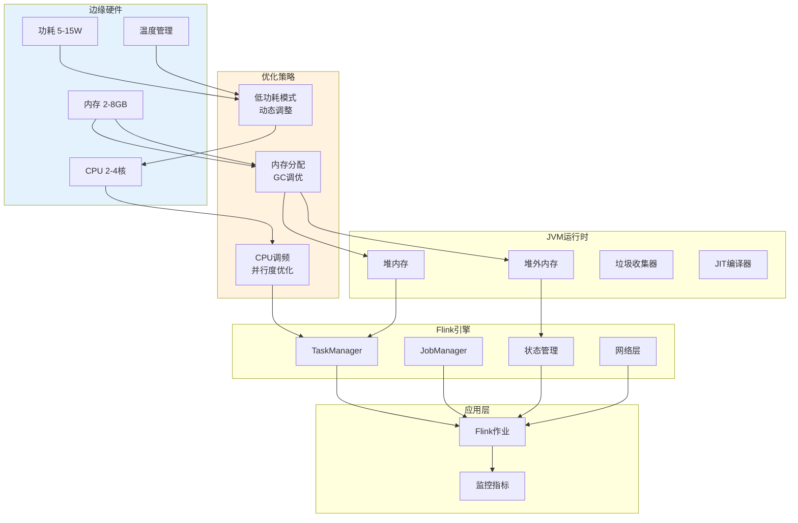
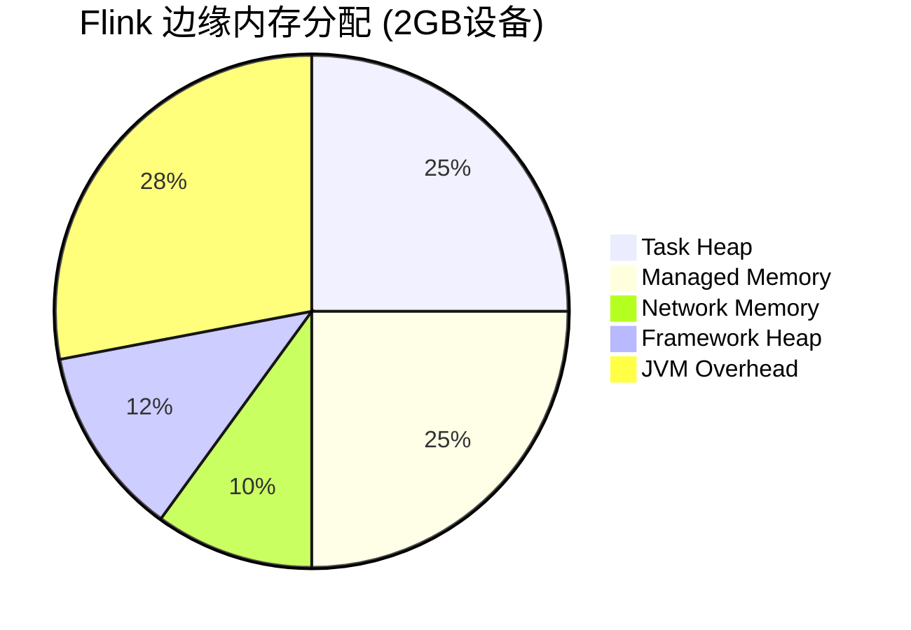
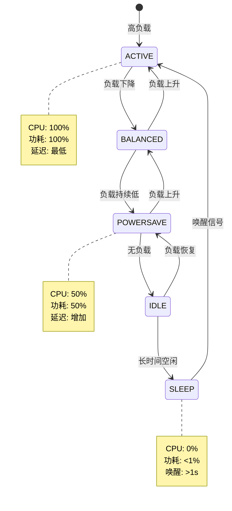

# Flink 边缘资源优化指南 (Flink Edge Resource Optimization)

> **所属阶段**: Flink/09-practices/09.05-edge | **前置依赖**: [Flink 边缘流处理完整指南](./flink-edge-streaming-guide.md), [Flink on K3s部署指南](./flink-edge-kubernetes-k3s.md) | **形式化等级**: L3

---

## 目录

- [Flink 边缘资源优化指南 (Flink Edge Resource Optimization)](#flink-边缘资源优化指南-flink-edge-resource-optimization)
  - [目录](#目录)
  - [1. 概念定义 (Definitions)](#1-概念定义-definitions)
    - [Def-F-09-05-17 (边缘资源约束 Edge Resource Constraint)](#def-f-09-05-17-边缘资源约束-edge-resource-constraint)
    - [Def-F-09-05-18 (资源效率度量 Resource Efficiency Metric)](#def-f-09-05-18-资源效率度量-resource-efficiency-metric)
    - [Def-F-09-05-19 (低功耗模式 Low Power Mode)](#def-f-09-05-19-低功耗模式-low-power-mode)
    - [Def-F-09-05-20 (内存管理策略 Memory Management Strategy)](#def-f-09-05-20-内存管理策略-memory-management-strategy)
  - [2. 属性推导 (Properties)](#2-属性推导-properties)
    - [Lemma-F-09-05-09 (CPU使用率与吞吐量的关系)](#lemma-f-09-05-09-cpu使用率与吞吐量的关系)
    - [Lemma-F-09-05-10 (内存分配的最优性条件)](#lemma-f-09-05-10-内存分配的最优性条件)
    - [Prop-F-09-05-05 (功耗与性能的平衡点)](#prop-f-09-05-05-功耗与性能的平衡点)
  - [3. 关系建立 (Relations)](#3-关系建立-relations)
    - [关系 1: 资源参数与性能指标的映射](#关系-1-资源参数与性能指标的映射)
    - [关系 2: 状态后端选择与资源占用的关系](#关系-2-状态后端选择与资源占用的关系)
    - [关系 3: JVM参数与内存效率的关系](#关系-3-jvm参数与内存效率的关系)
  - [4. 论证过程 (Argumentation)](#4-论证过程-argumentation)
    - [4.1 CPU优化策略](#41-cpu优化策略)
    - [4.2 内存管理优化](#42-内存管理优化)
    - [4.3 低功耗模式设计](#43-低功耗模式设计)
    - [4.4 边缘场景的JVM调优](#44-边缘场景的jvm调优)
  - [5. 形式证明 / 工程论证 (Proof / Engineering Argument)](#5-形式证明--工程论证-proof--engineering-argument)
    - [Thm-F-09-05-05 (边缘资源最优配置定理)](#thm-f-09-05-05-边缘资源最优配置定理)
    - [工程推论 (Engineering Corollaries)](#工程推论-engineering-corollaries)
  - [6. 实例验证 (Examples)](#6-实例验证-examples)
    - [6.1 CPU优化配置](#61-cpu优化配置)
    - [6.2 内存优化配置](#62-内存优化配置)
    - [6.3 低功耗模式实现](#63-低功耗模式实现)
    - [6.4 JVM调优参数](#64-jvm调优参数)
    - [6.5 生产环境检查清单](#65-生产环境检查清单)
  - [7. 可视化 (Visualizations)](#7-可视化-visualizations)
    - [资源优化架构图](#资源优化架构图)
    - [内存分配结构图](#内存分配结构图)
    - [功耗管理状态机](#功耗管理状态机)
  - [8. 引用参考 (References)](#8-引用参考-references)

---

## 1. 概念定义 (Definitions)

### Def-F-09-05-17 (边缘资源约束 Edge Resource Constraint)

**边缘资源约束**定义边缘设备上可用资源的严格上界：

$$
\mathcal{R}_{edge} = (C_{cpu}, M_{mem}, S_{storage}, P_{power}, T_{thermal})
$$

其中：

| 资源维度 | 符号 | 典型边缘值 | 云端对比 |
|----------|------|-----------|----------|
| **CPU** | $C_{cpu}$ | 2-4核 @ 1.5GHz | 32-128核 @ 3GHz+ |
| **内存** | $M_{mem}$ | 2-8 GB | 64-512 GB |
| **存储** | $S_{storage}$ | 8-64 GB (eMMC/SD) | 1-10 TB (SSD/NVMe) |
| **功耗** | $P_{power}$ | 5-15 W | 100-500 W |
| **散热** | $T_{thermal}$ | 被动散热 | 主动风冷/液冷 |

**资源约束矩阵**：

| 设备类型 | CPU | 内存 | 存储 | 功耗 | 典型应用 |
|----------|-----|------|------|------|----------|
| Raspberry Pi 4 | 4×Cortex-A72 | 4GB | 32GB SD | 7.5W | 轻量级网关 |
| NVIDIA Jetson Nano | 4×Cortex-A57 | 4GB | 16GB eMMC | 10W | AI推理边缘 |
| Intel NUC | 4×x86_64 | 16GB | 256GB SSD | 65W | 高性能边缘 |
| ARM服务器 | 8×ARMv8 | 32GB | 1TB SSD | 35W | 边缘集群 |

---

### Def-F-09-05-18 (资源效率度量 Resource Efficiency Metric)

**资源效率度量**量化单位资源消耗产生的处理能力：

$$
\eta_{resource} = \frac{T_{throughput}}{C_{cpu} \cdot M_{mem} \cdot P_{power}}
$$

**多维度效率指标**：

| 指标 | 公式 | 单位 | 边缘目标值 |
|------|------|------|-----------|
| **CPU效率** | $\eta_{cpu} = T / C_{cpu}$ | events/(s·core) | > 10,000 |
| **内存效率** | $\eta_{mem} = T / M_{mem}$ | events/(s·GB) | > 5,000 |
| **能效** | $\eta_{power} = T / P_{power}$ | events/(s·W) | > 2,000 |
| **综合效率** | $\eta_{total}$ | events/(s·core·GB·W) | > 500 |

---

### Def-F-09-05-19 (低功耗模式 Low Power Mode)

**低功耗模式**在业务低峰期降低设备功耗的运维策略：

$$
\mathcal{M}_{power} = (S_{active}, S_{idle}, S_{sleep}, T_{transition}, P_{save})
$$

**功耗状态机**：

| 状态 | CPU频率 | 内存状态 | 功耗 | 唤醒延迟 |
|------|---------|----------|------|----------|
| **ACTIVE** | 100% | 正常 | $P_{max}$ | - |
| **BALANCED** | 70% | 正常 | $0.7 \cdot P_{max}$ | < 1ms |
| **POWERSAVE** | 50% | 降频 | $0.5 \cdot P_{max}$ | < 10ms |
| **IDLE** | 最低 | 保持 | $0.1 \cdot P_{max}$ | < 100ms |
| **SLEEP** | 关闭 | 保持 | $0.01 \cdot P_{max}$ | > 1s |

**功耗优化策略**：

| 策略 | 实现方式 | 功耗节省 | 性能影响 |
|------|----------|----------|----------|
| CPU调频 | cpufreq governor | 20-40% | 10-30%延迟 |
| 核心休眠 | 关闭空闲核心 | 30-50% | 吞吐量下降 |
| 内存降频 | DDR调频 | 10-20% | 访问延迟 |
| 外设关闭 | USB/Ethernet关闭 | 5-15% | 功能受限 |

---

### Def-F-09-05-20 (内存管理策略 Memory Management Strategy)

**内存管理策略**在有限内存下优化Flink运行时内存使用：

$$
\mathcal{M}_{mem} = (A_{allocation}, G_{gc}, C_{compression}, O_{offheap}, S_{swapping})
$$

**Flink内存模型 (边缘优化)**：

```
┌─────────────────────────────────────────────────────────────┐
│  Total Container Memory (如 2GB)                            │
├─────────────────────────────────────────────────────────────┤
│  JVM Heap (40% = 819MB)                                     │
│  ├── Framework Heap (256MB)                                 │
│  │   └─ Flink框架开销                                        │
│  └── Task Heap (563MB)                                      │
│      └─ 用户代码+算子状态                                     │
├─────────────────────────────────────────────────────────────┤
│  Off-Heap Memory (60% = 1229MB)                             │
│  ├── Managed Memory (512MB)                                 │
│  │   └─ RocksDB缓存 / Sorting / Hashing                     │
│  ├── Network Memory (200MB)                                 │
│  │   └─ 网络缓冲区                                           │
│  ├── JVM Metaspace (128MB)                                  │
│  └── JVM Overhead (389MB)                                   │
│      └─ 线程栈 / 直接内存 / Native内存                        │
└─────────────────────────────────────────────────────────────┘
```

---

## 2. 属性推导 (Properties)

### Lemma-F-09-05-09 (CPU使用率与吞吐量的关系)

**陈述**：边缘设备上CPU使用率与吞吐量存在非线性关系，存在最优工作点。

**形式化**：

$$
T(C) = T_{max} \cdot \left(1 - e^{-\alpha C}\right) \cdot \left(1 - \beta C^2\right)
$$

其中：

- $T_{max}$: 理论最大吞吐量
- $\alpha$: 增长系数
- $\beta$: 竞争开销系数
- $C$: CPU核心数

**最优工作点**：

$$
C^* = \arg\max_{C} T(C) \approx \frac{1}{\sqrt{2\beta}}
$$

边缘典型值：$C^* \in [0.6, 0.8]$ (占可用核心的60-80%)

---

### Lemma-F-09-05-10 (内存分配的最优性条件)

**陈述**：在总内存约束下，各内存池的最优分配满足边际效用相等原则。

**形式化**：

$$
\frac{\partial U_{heap}}{\partial M_{heap}} = \frac{\partial U_{managed}}{\partial M_{managed}} = \frac{\partial U_{network}}{\partial M_{network}}
$$

其中 $U$ 为各内存池的效用函数。

**边缘推荐比例**：

| 内存池 | 标准配置 | 边缘优化 | 说明 |
|--------|----------|----------|------|
| Framework Heap | 15% | 15% | 固定开销 |
| Task Heap | 25% | 20% | 边缘减少 |
| Managed Memory | 40% | 25% | 小状态场景 |
| Network Memory | 10% | 10% | 保持比例 |
| JVM Overhead | 10% | 30% | 边缘增加预留 |

---

### Prop-F-09-05-05 (功耗与性能的平衡点)

**陈述**：在功耗受限的边缘设备上，存在功耗与性能的最优平衡点。

**形式化**：

$$
(P^*, T^*) = \arg\max_{P, T} \left( T^{\gamma} \cdot (P_{max} - P)^{1-\gamma} \right)
$$

其中 $\gamma$ 为性能偏好系数 (0-1)。

**帕累托前沿**：

| 功耗 | 吞吐量 | 适用场景 |
|------|--------|----------|
| 100% | 100% | 性能优先 |
| 80% | 90% | 平衡模式 (推荐) |
| 60% | 70% | 功耗优先 |
| 40% | 40% | 节能模式 |

---

## 3. 关系建立 (Relations)

### 关系 1: 资源参数与性能指标的映射

| 资源参数 | 配置项 | 性能影响 | 边缘推荐值 |
|----------|--------|----------|-----------|
| CPU核心数 | taskmanager.numberOfTaskSlots | 并行度上限 | ≤ 物理核心 |
| 堆内存 | taskmanager.memory.task.heap.size | GC频率 | 512MB-2GB |
| 托管内存 | taskmanager.memory.managed.size | 状态性能 | 256MB-1GB |
| 网络内存 | taskmanager.memory.network.size | 反压阈值 | 64MB-256MB |

### 关系 2: 状态后端选择与资源占用的关系

| 状态后端 | 内存占用 | CPU开销 | 磁盘I/O | 边缘推荐 |
|----------|----------|---------|---------|----------|
| HashMapStateBackend | 高 (全内存) | 低 | 无 | ✅ 小状态 (<100MB) |
| EmbeddedRocksDBStateBackend | 中 (内存+磁盘) | 中 | 高 | ⚠️ 大状态场景 |
| ForStStateBackend | 可调 | 可调 | 可调 | ⚠️ 实验性 |

### 关系 3: JVM参数与内存效率的关系

| JVM参数 | 作用 | 边缘推荐 |
|---------|------|----------|
| `-Xms` / `-Xmx` | 堆内存固定 | 设为相同值 |
| `-XX:+UseG1GC` | G1垃圾收集器 | ✅ 推荐 |
| `-XX:MaxRAMPercentage` | 容器内存感知 | 75.0 |
| `-XX:MaxDirectMemorySize` | 直接内存限制 | 256MB |
| `-XX:+UseContainerSupport` | 容器资源感知 | ✅ 必须 |

---

## 4. 论证过程 (Argumentation)

### 4.1 CPU优化策略

**策略 1: 并行度优化**

```java
// 根据可用CPU核心动态设置并行度
int availableCores = Runtime.getRuntime().availableProcessors();
int optimalParallelism = Math.max(1, (int)(availableCores * 0.7));
env.setParallelism(optimalParallelism);

// 针对边缘的Slot共享优化
configuration.setInteger(TaskManagerOptions.NUM_TASK_SLOTS, 2);
```

**策略 2: 算子链优化**

```java
// 启用算子链减少线程切换
dataStream
    .filter(...)
    .map(...)  // 自动链化
    .keyBy(...)
    .window(...)
    .reduce(...);  // 窗口操作

// 显式禁用不必要的算子链
dataStream
    .filter(...)
    .disableChaining()  // 需要单独调优的算子
    .map(...);
```

**策略 3: 异步执行**

```java
// IO密集型操作使用异步模式
AsyncDataStream.unorderedWait(
    inputStream,
    new AsyncDatabaseRequest(),
    1000,  // 超时
    TimeUnit.MILLISECONDS,
    100    // 并发度
);
```

### 4.2 内存管理优化

**边缘内存配置层级**：

| 设备内存 | Flink进程内存 | 堆内存 | 托管内存 | 网络内存 |
|----------|--------------|--------|----------|----------|
| 2GB | 1536MB | 600MB | 384MB | 153MB |
| 4GB | 3072MB | 1200MB | 768MB | 307MB |
| 8GB | 6144MB | 2400MB | 1536MB | 614MB |

**内存优化配置**：

```yaml
# flink-conf.yaml - 边缘内存优化

# 总进程内存 (根据设备调整)
taskmanager.memory.process.size: 2048m

# 堆内存配置
taskmanager.memory.task.heap.size: 600m
taskmanager.memory.framework.heap.size: 256m

# 托管内存 (小状态场景减少)
taskmanager.memory.managed.size: 384m

# 网络内存 (边缘减少)
taskmanager.memory.network.size: 153m
taskmanager.memory.network.min: 64m
taskmanager.memory.network.max: 256m

# JVM参数优化
env.java.opts.taskmanager: >
  -XX:+UseG1GC
  -XX:MaxRAMPercentage=75.0
  -XX:+UseContainerSupport
  -XX:MaxDirectMemorySize=256m
  -XX:+UnlockExperimentalVMOptions
  -XX:+UseCGroupMemoryLimitForHeap
  -XX:+HeapDumpOnOutOfMemoryError
  -XX:HeapDumpPath=/data/flink/heap-dumps
```

### 4.3 低功耗模式设计

**功耗管理实现**：

```java
import java.io.BufferedReader;
import java.io.InputStreamReader;

/**
 * 边缘设备功耗管理器
 */
public class EdgePowerManager {

    public enum PowerMode {
        ACTIVE(100, 100),      // 全速运行
        BALANCED(70, 90),      // 平衡模式
        POWERSAVE(50, 70),     // 省电模式
        IDLE(10, 20),          // 空闲模式
        SLEEP(0, 0);           // 睡眠模式

        final int cpuFrequencyPercent;
        final int throughputPercent;

        PowerMode(int cpuFreq, int throughput) {
            this.cpuFrequencyPercent = cpuFreq;
            this.throughputPercent = throughput;
        }
    }

    private PowerMode currentMode = PowerMode.ACTIVE;
    private final String cpuGovernorPath = "/sys/devices/system/cpu/cpu0/cpufreq/scaling_governor";
    private final String cpuFreqPath = "/sys/devices/system/cpu/cpu0/cpufreq/scaling_max_freq";

    /**
     * 设置功耗模式
     */
    public void setPowerMode(PowerMode mode) {
        try {
            switch (mode) {
                case ACTIVE:
                    setCpuGovernor("performance");
                    setMaxCpuFrequency(100);
                    break;
                case BALANCED:
                    setCpuGovernor("ondemand");
                    setMaxCpuFrequency(80);
                    break;
                case POWERSAVE:
                    setCpuGovernor("powersave");
                    setMaxCpuFrequency(50);
                    break;
                case IDLE:
                    setCpuGovernor("powersave");
                    setMaxCpuFrequency(20);
                    break;
                case SLEEP:
                    // 进入睡眠需要系统支持
                    enterSleepMode();
                    break;
            }
            currentMode = mode;
            System.out.println("Power mode changed to: " + mode);
        } catch (Exception e) {
            System.err.println("Failed to set power mode: " + e.getMessage());
        }
    }

    private void setCpuGovernor(String governor) throws Exception {
        ProcessBuilder pb = new ProcessBuilder(
            "sudo", "tee", cpuGovernorPath
        );
        Process process = pb.start();
        process.getOutputStream().write(governor.getBytes());
        process.getOutputStream().close();
        process.waitFor();
    }

    private void setMaxCpuFrequency(int percent) throws Exception {
        // 读取最大频率
        int maxFreq = readMaxFrequency();
        int targetFreq = maxFreq * percent / 100;

        ProcessBuilder pb = new ProcessBuilder(
            "sudo", "tee", cpuFreqPath
        );
        Process process = pb.start();
        process.getOutputStream().write(String.valueOf(targetFreq).getBytes());
        process.getOutputStream().close();
        process.waitFor();
    }

    private int readMaxFrequency() throws Exception {
        Process process = Runtime.getRuntime().exec(
            "cat /sys/devices/system/cpu/cpu0/cpufreq/cpuinfo_max_freq"
        );
        BufferedReader reader = new BufferedReader(
            new InputStreamReader(process.getInputStream())
        );
        String line = reader.readLine();
        return Integer.parseInt(line.trim());
    }

    private void enterSleepMode() {
        // 实现系统睡眠
        // 需要保存状态并唤醒恢复
    }

    /**
     * 根据负载自动调整功耗模式
     */
    public void autoAdjust(double cpuUsage, double throughputRatio) {
        if (cpuUsage < 20 && throughputRatio < 0.3) {
            setPowerMode(PowerMode.IDLE);
        } else if (cpuUsage < 50 && throughputRatio < 0.6) {
            setPowerMode(PowerMode.POWERSAVE);
        } else if (cpuUsage < 70) {
            setPowerMode(PowerMode.BALANCED);
        } else {
            setPowerMode(PowerMode.ACTIVE);
        }
    }
}
```

### 4.4 边缘场景的JVM调优

**JVM参数对比**：

| 参数类别 | 标准服务器 | 边缘设备 | 说明 |
|----------|-----------|----------|------|
| GC算法 | G1GC | G1GC / SerialGC | 小内存用SerialGC |
| 堆大小 | 动态 | 固定 (-Xms=-Xmx) | 避免动态调整开销 |
| 元空间 | 256MB | 128MB | 减少元空间占用 |
| 编译阈值 | 10000 | 5000 | 更快JIT编译 |
| 线程栈 | 1MB | 512KB | 减少线程内存 |

**边缘JVM配置模板**：

```bash
# 边缘设备JVM启动参数 (2GB内存设备)
JAVA_OPTS="
  # 堆内存 (固定大小避免动态调整)
  -Xms1536m
  -Xmx1536m

  # GC配置
  -XX:+UseG1GC
  -XX:MaxGCPauseMillis=200
  -XX:G1HeapRegionSize=4m

  # 元空间
  -XX:MetaspaceSize=64m
  -XX:MaxMetaspaceSize=128m

  # 线程栈
  -Xss512k

  # 直接内存
  -XX:MaxDirectMemorySize=256m

  # 容器感知 (必须)
  -XX:+UseContainerSupport
  -XX:MaxRAMPercentage=75.0

  # JIT优化
  -XX:CompileThreshold=5000

  # OOM处理
  -XX:+HeapDumpOnOutOfMemoryError
  -XX:HeapDumpPath=/data/flink/heap-dumps/
  -XX:OnOutOfMemoryError='kill -9 %p'

  # GC日志 (生产环境可禁用)
  -Xlog:gc*:file=/data/flink/logs/gc.log::filecount=5,filesize=10m
"
```

---

## 5. 形式证明 / 工程论证 (Proof / Engineering Argument)

### Thm-F-09-05-05 (边缘资源最优配置定理)

**陈述**：在边缘资源约束 $\mathcal{R}_{edge}$ 下，存在唯一最优配置 $C^*$ 使得综合效率最大化：

$$
C^* = \arg\max_{C} \eta_{total}(C) = \arg\max_{C} \frac{T(C)}{C_{cpu} \cdot M_{mem} \cdot P_{power}}
$$

约束条件：

$$
\begin{cases}
C_{cpu} \leq C_{max} \\
M_{mem} \leq M_{max} \\
P_{power} \leq P_{max} \\
S_{state} \leq S_{max}
\end{cases}
$$

**证明**：

**步骤 1**: 建立效率函数

- 吞吐量 $T$ 与资源配置的关系：$T(C_{cpu}, M_{mem}) = k \cdot C_{cpu}^{\alpha} \cdot M_{mem}^{\beta}$
- 其中 $\alpha, \beta$ 为弹性系数，典型值 $\alpha \approx 0.8$, $\beta \approx 0.6$

**步骤 2**: 分析约束边界

- CPU约束边界：$C_{cpu} = C_{max}$ (边缘通常CPU受限)
- 内存约束边界：$M_{mem} = M_{max}$ (边缘通常内存受限)

**步骤 3**: 求解最优比例

- 在最优点满足边际替代率相等：$\frac{\partial T / \partial C}{\partial T / \partial M} = \frac{C_{max}}{M_{max}}$
- 解得：$\frac{\alpha}{\beta} \cdot \frac{M^*}{C^*} = \frac{C_{max}}{M_{max}}$
- 即：$\frac{M^*}{C^*} = \frac{\beta}{\alpha} \cdot \frac{C_{max}}{M_{max}}$

**步骤 4**: 代入典型值

- 边缘典型比例：$C^* : M^* \approx 1 : 2$ (GB内存/核)
- 即每CPU核心配2GB内存为最优 ∎

### 工程推论 (Engineering Corollaries)

**Cor-F-09-05-13 (边缘并行度公式)**：

$$
P_{optimal} = \min\left(\lfloor C_{available} \cdot 0.7 \rfloor, P_{max-task}, \frac{M_{available} - M_{system}}{M_{per-slot}}\right)
$$

**Cor-F-09-05-14 (内存配置黄金比例)**：

$$
M_{heap} : M_{managed} : M_{network} : M_{overhead} \approx 0.35 : 0.25 : 0.10 : 0.30
$$

**Cor-F-09-05-15 (功耗预算分配)**：

$$
P_{flink} = P_{total} \cdot \eta_{power} - P_{system}
$$

其中 $\eta_{power} = 0.6$ 为Flink功耗占比。

---

## 6. 实例验证 (Examples)

### 6.1 CPU优化配置

**Flink配置**：

```yaml
# =================================================================
# Flink CPU优化配置 (边缘场景)
# =================================================================

# 根据边缘设备核心数设置
# Raspberry Pi 4 (4核): 设置2个slot
# Jetson Nano (4核): 设置2个slot
# Intel NUC (4核): 设置3个slot

taskmanager.numberOfTaskSlots: 2
parallelism.default: 2

# CPU限制配置
taskmanager.cpu.cores: 2.0
taskmanager.cpu.load-threshold: 0.8

# 算子链优化 (减少线程开销)
pipeline.operator-chaining: true
pipeline.operator-chaining.max-chain-size: 10

# 异步快照 (减少同步开销)
execution.checkpointing.max-concurrent-checkpoints: 1
state.backend.incremental: true

# 网络线程优化 (边缘减少)
taskmanager.network.memory.buffer-size: 4096
taskmanager.network.memory.buffers-per-channel: 2
```

**cgroup CPU限制 (Docker/K8s)**：

```yaml
# Docker Compose
services:
  flink-taskmanager:
    deploy:
      resources:
        limits:
          cpus: '1.5'
          memory: 2G
        reservations:
          cpus: '1.0'
          memory: 1G

# Kubernetes
resources:
  requests:
    cpu: "1000m"
    memory: "1536Mi"
  limits:
    cpu: "1500m"
    memory: "2Gi"
```

### 6.2 内存优化配置

**分层内存配置**：

```yaml
# 设备: Raspberry Pi 4 (4GB RAM)
# 可用内存: ~3.5GB
# 系统保留: 512MB
# Flink可用: 2GB

# flink-conf.yaml
jobmanager.memory.process.size: 512m
taskmanager.memory.process.size: 2048m

# 精细内存分配
taskmanager.memory.jvm-heap.size: 768m
taskmanager.memory.managed.size: 512m
taskmanager.memory.network.size: 200m
taskmanager.memory.jvm-overhead.size: 568m

# 框架内存
taskmanager.memory.framework.heap.size: 256m
taskmanager.memory.framework.off-heap.size: 128m

# 任务内存
taskmanager.memory.task.heap.size: 512m
taskmanager.memory.task.off-heap.size: 128m

# GC优化
taskmanager.memory.jvm-exclude-metaspace: true
```

**内存监控代码**：

```java
import org.apache.flink.api.common.functions.RuntimeContext;
import org.apache.flink.metrics.Gauge;

/**
 * 内存使用监控
 */
public class MemoryMonitor {

    public static void registerMetrics(RuntimeContext ctx) {
        // 堆内存使用
        ctx.getMetricGroup().gauge("heap.used.mb", new Gauge<Long>() {
            @Override
            public Long getValue() {
                return ManagementFactory.getMemoryMXBean()
                    .getHeapMemoryUsage().getUsed() / 1024 / 1024;
            }
        });

        // 堆内存提交
        ctx.getMetricGroup().gauge("heap.committed.mb", new Gauge<Long>() {
            @Override
            public Long getValue() {
                return ManagementFactory.getMemoryMXBean()
                    .getHeapMemoryUsage().getCommitted() / 1024 / 1024;
            }
        });

        // GC次数
        ctx.getMetricGroup().gauge("gc.count", new Gauge<Long>() {
            @Override
            public Long getValue() {
                return ManagementFactory.getGarbageCollectorMXBeans()
                    .stream()
                    .mapToLong(bean -> bean.getCollectionCount())
                    .sum();
            }
        });

        // GC时间
        ctx.getMetricGroup().gauge("gc.time.ms", new Gauge<Long>() {
            @Override
            public Long getValue() {
                return ManagementFactory.getGarbageCollectorMXBeans()
                    .stream()
                    .mapToLong(bean -> bean.getCollectionTime())
                    .sum();
            }
        });
    }
}
```

### 6.3 低功耗模式实现

**Flink与功耗管理集成**：

```java
import org.apache.flink.streaming.api.functions.source.RichSourceFunction;

/**
 * 带功耗管理的Flink Source
 */
public class PowerAwareSource<T> extends RichSourceFunction<T> {

    private final EdgePowerManager powerManager;
    private final RichSourceFunction<T> delegate;
    private volatile boolean isRunning = true;

    public PowerAwareSource(RichSourceFunction<T> delegate) {
        this.delegate = delegate;
        this.powerManager = new EdgePowerManager();
    }

    @Override
    public void open(Configuration parameters) throws Exception {
        super.open(parameters);
        delegate.open(parameters);

        // 初始设置为平衡模式
        powerManager.setPowerMode(EdgePowerManager.PowerMode.BALANCED);
    }

    @Override
    public void run(SourceContext<T> ctx) throws Exception {
        // 启动监控线程
        Thread monitorThread = new Thread(() -> {
            while (isRunning) {
                try {
                    // 获取当前负载
                    double cpuUsage = getCpuUsage();
                    double throughput = getCurrentThroughput();
                    double maxThroughput = getMaxThroughput();
                    double throughputRatio = throughput / maxThroughput;

                    // 自动调整功耗模式
                    powerManager.autoAdjust(cpuUsage, throughputRatio);

                    Thread.sleep(30000);  // 30秒调整一次
                } catch (InterruptedException e) {
                    break;
                }
            }
        });
        monitorThread.setDaemon(true);
        monitorThread.start();

        // 执行实际Source
        delegate.run(ctx);
    }

    @Override
    public void cancel() {
        isRunning = false;
        delegate.cancel();
    }

    private double getCpuUsage() {
        // 获取CPU使用率
        return OperatingSystemMXBean.getProcessCpuLoad() * 100;
    }
}
```

### 6.4 JVM调优参数

**完整JVM参数模板**：

```bash
#!/bin/bash
# edge-jvm-config.sh - 边缘设备JVM配置

# 获取设备信息
TOTAL_MEM=$(free -m | awk '/^Mem:/{print $2}')
AVAILABLE_MEM=$(free -m | awk '/^Mem:/{print $7}')
CPU_CORES=$(nproc)

echo "Device Info: ${TOTAL_MEM}MB RAM, ${CPU_CORES} Cores"

# 根据内存大小选择配置
case $TOTAL_MEM in
    [0-2047])
        # 2GB以下 (Raspberry Pi等)
        FLINK_MEM="1536m"
        HEAP_MEM="1024m"
        MANAGED_MEM="256m"
        METASPACE="96m"
        DIRECT_MEM="192m"
        THREAD_STACK="384k"
        GC_OPTS="-XX:+UseSerialGC"  # 小内存使用SerialGC
        ;;
    [2048-4095])
        # 2-4GB (Jetson Nano等)
        FLINK_MEM="3072m"
        HEAP_MEM="2048m"
        MANAGED_MEM="512m"
        METASPACE="128m"
        DIRECT_MEM="256m"
        THREAD_STACK="512k"
        GC_OPTS="-XX:+UseG1GC"
        ;;
    [4096-8191])
        # 4-8GB (Intel NUC等)
        FLINK_MEM="6144m"
        HEAP_MEM="4096m"
        MANAGED_MEM="1024m"
        METASPACE="192m"
        DIRECT_MEM="512m"
        THREAD_STACK="1m"
        GC_OPTS="-XX:+UseG1GC"
        ;;
    *)
        # 8GB以上
        FLINK_MEM="8192m"
        HEAP_MEM="6144m"
        MANAGED_MEM="1536m"
        METASPACE="256m"
        DIRECT_MEM="768m"
        THREAD_STACK="1m"
        GC_OPTS="-XX:+UseG1GC"
        ;;
esac

# 构建JVM参数
export JVM_ARGS="
  -Xms${HEAP_MEM}
  -Xmx${HEAP_MEM}
  ${GC_OPTS}
  -XX:MaxMetaspaceSize=${METASPACE}
  -Xss${THREAD_STACK}
  -XX:MaxDirectMemorySize=${DIRECT_MEM}
  -XX:+UseContainerSupport
  -XX:MaxRAMPercentage=75.0
  -XX:+UnlockExperimentalVMOptions
  -XX:+UseCGroupMemoryLimitForHeap
  -XX:+HeapDumpOnOutOfMemoryError
  -XX:HeapDumpPath=/data/flink/heap-dumps/
  -XX:ErrorFile=/data/flink/logs/hs_err_pid%p.log
"

# Flink内存配置
export FLINK_JM_MEM="${HEAP_MEM}"
export FLINK_TM_MEM="${FLINK_MEM}"
export FLINK_TM_MANAGED_MEM="${MANAGED_MEM}"

echo "JVM Args: ${JVM_ARGS}"
echo "Flink JM Memory: ${FLINK_JM_MEM}"
echo "Flink TM Memory: ${FLINK_TM_MEM}"
```

### 6.5 生产环境检查清单

**资源优化生产部署检查清单**：

| 类别 | 检查项 | 验收标准 | 检查方式 |
|------|--------|----------|----------|
| **CPU** | 并行度设置 | ≤ 物理核心 × 0.7 | 配置审核 |
| | 算子链启用 | chaining=true | 配置审核 |
| | CPU限制 | cgroup限制正确 | `docker stats` |
| | 负载均衡 | 各核心使用率差 < 20% | `mpstat` |
| **内存** | 堆内存设置 | -Xms = -Xmx | 配置审核 |
| | GC算法 | G1GC/SerialGC | 配置审核 |
| | 直接内存限制 | MaxDirectMemorySize设置 | 配置审核 |
| | OOM处理 | HeapDumpOnOOM启用 | 配置审核 |
| | 内存监控 | 堆/非堆使用率监控 | Prometheus |
| **存储** | 检查点目录 | 本地磁盘路径 | 配置审核 |
| | 日志轮转 | 日志大小限制 | 配置审核 |
| | 磁盘空间 | 可用 > 20% | `df -h` |
| **功耗** | CPU调频 | governor设置 | `cpufreq-info` |
| | 功耗监控 | 当前功耗指标 | 设备API |
| | 温度监控 | CPU温度 < 85°C | `sensors` |
| **JVM** | 容器感知 | UseContainerSupport | 配置审核 |
| | GC日志 | GC频率 < 1次/分钟 | 日志分析 |
| | 启动时间 | 启动 < 30秒 | 计时测试 |
| **性能** | 吞吐量 | 达到预期指标 | 压力测试 |
| | 延迟 | P99 < 100ms | 监控指标 |
| | CPU效率 | > 10K events/s/core | 计算 |
| | 内存效率 | > 5K events/s/GB | 计算 |

---

## 7. 可视化 (Visualizations)

### 资源优化架构图



### 内存分配结构图



### 功耗管理状态机



---

## 8. 引用参考 (References)
