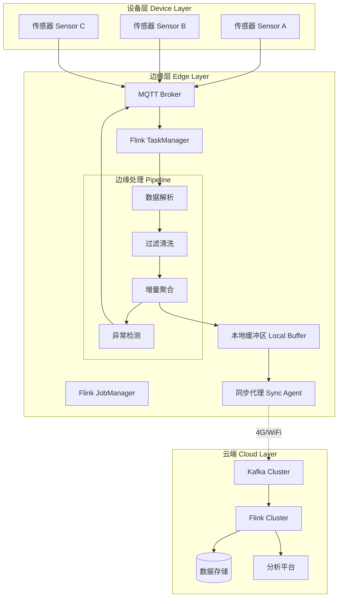
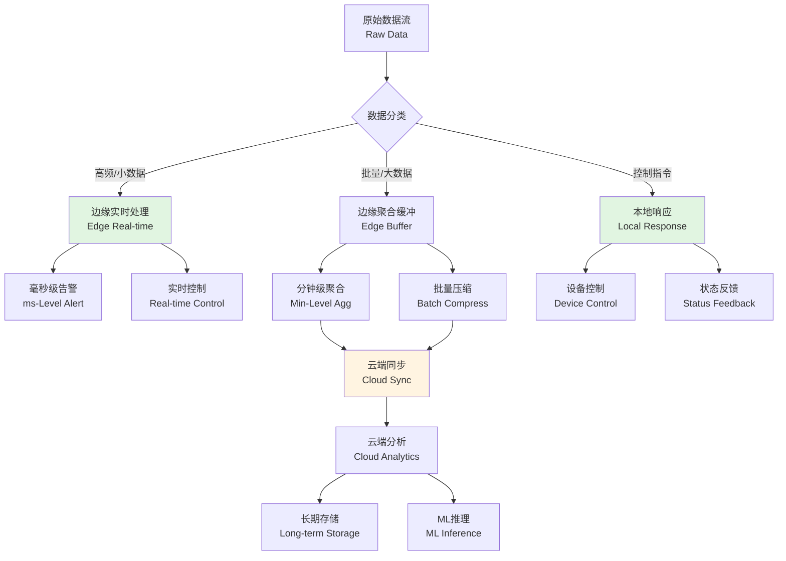
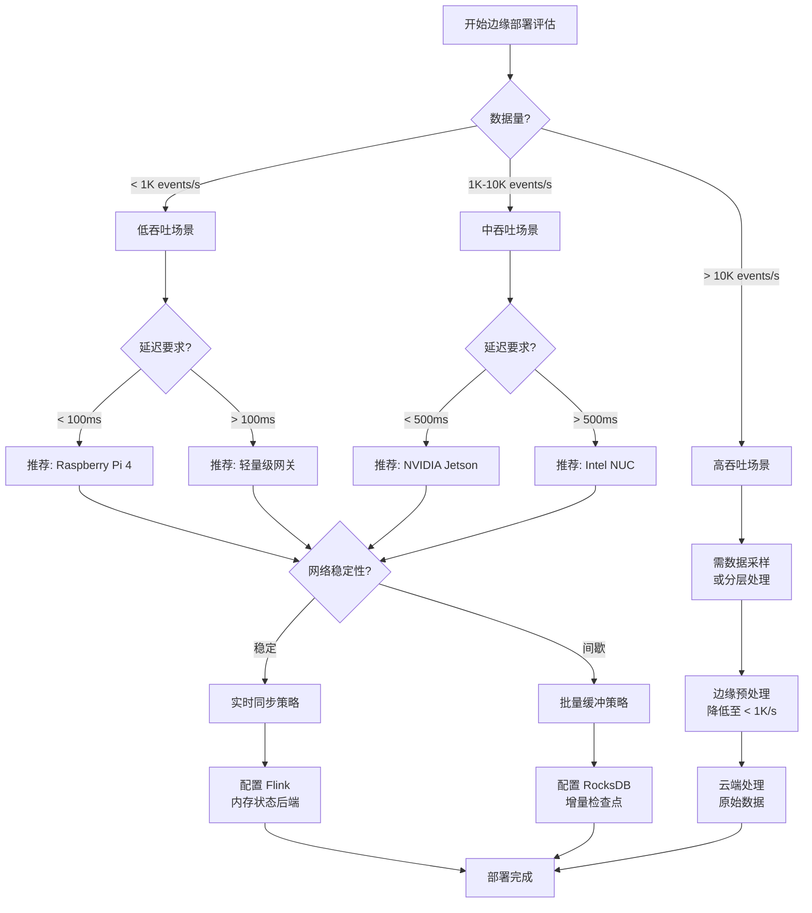

# Flink 边缘流处理完整指南 (Flink Edge Streaming Guide)

> **所属阶段**: Flink/09-practices/09.05-edge | **前置依赖**: [Flink 性能调优指南](../09.03-performance-tuning/performance-tuning-guide.md), [生产级配置模板](../09.03-performance-tuning/production-config-templates.md) | **形式化等级**: L3

---

## 目录

- [Flink 边缘流处理完整指南 (Flink Edge Streaming Guide)](#flink-边缘流处理完整指南-flink-edge-streaming-guide)
  - [目录](#目录)
  - [1. 概念定义 (Definitions)](#1-概念定义-definitions)
    - [Def-F-09-05-01 (边缘流处理系统 Edge Stream Processing System)](#def-f-09-05-01-边缘流处理系统-edge-stream-processing-system)
    - [Def-F-09-05-02 (资源约束空间 Resource Constraint Space)](#def-f-09-05-02-资源约束空间-resource-constraint-space)
    - [Def-F-09-05-03 (边缘-云端协同模型 Edge-Cloud Collaboration Model)](#def-f-09-05-03-边缘-云端协同模型-edge-cloud-collaboration-model)
    - [Def-F-09-05-04 (间歇性网络拓扑 Intermittent Network Topology)](#def-f-09-05-04-间歇性网络拓扑-intermittent-network-topology)
  - [2. 属性推导 (Properties)](#2-属性推导-properties)
    - [Lemma-F-09-05-01 (边缘算子的资源下界)](#lemma-f-09-05-01-边缘算子的资源下界)
    - [Lemma-F-09-05-02 (本地缓冲的容量边界)](#lemma-f-09-05-02-本地缓冲的容量边界)
    - [Prop-F-09-05-01 (边缘部署的可行性条件)](#prop-f-09-05-01-边缘部署的可行性条件)
  - [3. 关系建立 (Relations)](#3-关系建立-relations)
    - [关系 1: 边缘约束与算子选择的映射](#关系-1-边缘约束与算子选择的映射)
    - [关系 2: 网络质量与同步策略的关系](#关系-2-网络质量与同步策略的关系)
    - [关系 3: 边缘-云端数据流的一致性保证](#关系-3-边缘-云端数据流的一致性保证)
  - [4. 论证过程 (Argumentation)](#4-论证过程-argumentation)
    - [4.1 边缘场景的分层处理模型](#41-边缘场景的分层处理模型)
    - [4.2 资源受限下的算子优化策略](#42-资源受限下的算子优化策略)
    - [4.3 间歇性网络的容错设计](#43-间歇性网络的容错设计)
    - [4.4 反例: 忽略资源约束的后果](#44-反例-忽略资源约束的后果)
  - [5. 形式证明 / 工程论证 (Proof / Engineering Argument)](#5-形式证明-工程论证-proof-engineering-argument)
    - [Thm-F-09-05-01 (边缘流处理可行性定理)](#thm-f-09-05-01-边缘流处理可行性定理)
    - [工程推论 (Engineering Corollaries)](#工程推论-engineering-corollaries)
  - [6. 实例验证 (Examples)](#6-实例验证-examples)
    - [6.1 边缘流处理部署架构](#61-边缘流处理部署架构)
    - [6.2 Flink 边缘配置实例](#62-flink-边缘配置实例)
    - [6.3 Docker Compose 部署配置](#63-docker-compose-部署配置)
    - [6.4 边缘数据流拓扑示例](#64-边缘数据流拓扑示例)
    - [6.5 生产环境检查清单](#65-生产环境检查清单)
  - [7. 可视化 (Visualizations)](#7-可视化-visualizations)
    - [边缘-云端协同架构图](#边缘-云端协同架构图)
    - [边缘流处理分层模型](#边缘流处理分层模型)
    - [边缘部署决策树](#边缘部署决策树)
  - [8. 引用参考 (References)](#8-引用参考-references)

---

## 1. 概念定义 (Definitions)

### Def-F-09-05-01 (边缘流处理系统 Edge Stream Processing System)

**边缘流处理系统**（Edge Stream Processing System）是在资源受限的边缘设备上部署的流计算框架，形式化定义为七元组：

$$
\mathcal{E} = (H_{edge}, R_{limit}, N_{inter}, S_{local}, \mathcal{O}_{light}, \mathcal{B}_{buf}, \mathcal{F}_{sync})
$$

其中：

| 符号 | 语义 | 边缘场景典型值 | 云端对比 |
|------|------|---------------|----------|
| $H_{edge}$ | 边缘硬件环境 | ARM Cortex-A72 / x86 嵌入式 | 服务器级 CPU |
| $R_{limit}$ | 资源约束空间 | CPU 2-4核, 内存 4-8GB | CPU 32-128核, 内存 64-512GB |
| $N_{inter}$ | 网络拓扑 | 间歇性连接，带宽 1-10Mbps | 稳定连接，带宽 1-10Gbps |
| $S_{local}$ | 本地存储 | SD卡/eMMC 16-64GB | SSD/HDD 1-10TB |
| $\mathcal{O}_{light}$ | 轻量级算子集 | 过滤、映射、简单聚合 | 复杂窗口、Join、ML推理 |
| $\mathcal{B}_{buf}$ | 本地缓冲机制 | 环形缓冲区，容量受限 | 分布式日志，海量存储 |
| $\mathcal{F}_{sync}$ | 同步策略 | 批量压缩、断点续传 | 实时流式传输 |

**边缘约束矩阵**：

| 约束维度 | 云端 | 边缘 | 应对策略 |
|----------|------|------|----------|
| **CPU** | 无限制 | 2-4核 | 轻量级算子、降低并行度 |
| **内存** | 64GB+ | 4-8GB | 内存状态限制、外存溢出 |
| **网络** | 稳定 | 间歇性 | 本地缓冲+批量同步 |
| **存储** | SSD/HDD | SD卡/eMMC | 最小化日志、循环覆盖 |
| **电源** | 持续供电 | 电池/太阳能 | 低功耗模式、动态调频 [^1][^2] |

---

### Def-F-09-05-02 (资源约束空间 Resource Constraint Space)

**资源约束空间**定义边缘部署环境中可用资源的上界：

$$
\mathcal{R}_{edge} = \{(c, m, s, p) \in \mathbb{R}^4_+ \mid c \leq C_{max}, m \leq M_{max}, s \leq S_{max}, p \leq P_{max}\}
$$

其中：

- $C_{max}$: 最大可用 CPU 核数（典型值：2-4）
- $M_{max}$: 最大可用内存（典型值：4-8GB）
- $S_{max}$: 最大本地存储（典型值：16-64GB）
- $P_{max}$: 最大功率预算（典型值：5-15W）

**资源使用效率指标**：

$$
\eta_{resource} = \frac{T_{throughput}}{C \cdot M \cdot P} \quad [events/(core \cdot GB \cdot W)]
$$

---

### Def-F-09-05-03 (边缘-云端协同模型 Edge-Cloud Collaboration Model)

**边缘-云端协同模型**描述数据在边缘和云端之间的流动与处理分工：

$$
\mathcal{C}_{ec} = (D_{raw}, \mathcal{P}_{edge}, D_{agg}, \mathcal{P}_{cloud}, \mathcal{F}_{sync}, \mathcal{C}_{consist})
$$

| 组件 | 功能描述 | 执行位置 |
|------|----------|----------|
| $D_{raw}$ | 原始传感器数据流 | 边缘接入 |
| $\mathcal{P}_{edge}$ | 边缘预处理流水线（过滤、归一化、简单聚合） | 边缘节点 |
| $D_{agg}$ | 聚合后的数据流（数据压缩率 $\rho = 1 - |D_{agg}|/|D_{raw}|$） | 边缘输出 |
| $\mathcal{P}_{cloud}$ | 云端复杂分析（ML推理、全局聚合、历史关联） | 云端集群 |
| $\mathcal{F}_{sync}$ | 边缘-云端同步函数 | 网络通道 |
| $\mathcal{C}_{consist}$ | 一致性保证机制 | 端到端 |

**典型数据压缩率**：$\rho \in [0.8, 0.99]$，即边缘预处理可减少 80%-99% 的上行数据量 [^3]。

---

### Def-F-09-05-04 (间歇性网络拓扑 Intermittent Network Topology)

**间歇性网络拓扑**刻画边缘场景下网络连接的时变特性：

$$
\mathcal{N}_{inter}(t) = (A(t), B(t), L(t), T_{offline})
$$

其中：

- $A(t) \in \{0, 1\}$: 网络可用性指示函数
- $B(t)$: 时变带宽函数
- $L(t)$: 时变延迟函数
- $T_{offline}$: 离线持续时间的随机变量

**网络状态分类**：

| 状态 | 条件 | 同步策略 |
|------|------|----------|
| **在线** | $A(t) = 1, B(t) \geq B_{min}$ | 实时增量同步 |
| **弱网** | $A(t) = 1, B(t) < B_{min}$ | 批量压缩同步 |
| **离线** | $A(t) = 0$ | 本地缓冲，延迟同步 |

---

## 2. 属性推导 (Properties)

### Lemma-F-09-05-01 (边缘算子的资源下界)

**陈述**：在边缘设备上执行流处理算子，存在资源消耗的下界约束。

**形式化**：对于任意算子 $op$，其在边缘设备上的资源消耗满足：

$$
\begin{cases}
C(op) \geq C_{base} + k_c \cdot |op| \\
M(op) \geq M_{base} + k_m \cdot S_{state}(op) \\
P(op) \geq P_{base} + k_p \cdot C(op)
\end{cases}
$$

其中 $C_{base}, M_{base}, P_{base}$ 为基础开销，$k_c, k_m, k_p$ 为比例系数。

**推导**：边缘设备上 Flink MiniCluster 的基础开销约为：

| 资源类型 | 基础开销 | 单位增量 |
|----------|----------|----------|
| CPU | 0.5核 | 0.1核/算子 |
| 内存 | 512MB | 100MB/状态算子 |
| 存储 | 100MB | 10MB/检查点 |

---

### Lemma-F-09-05-02 (本地缓冲的容量边界)

**陈述**：本地缓冲区的容量受限于边缘设备的存储空间，需满足：

$$
B_{max} = \min\left(S_{available}, \frac{T_{offline}^{max} \cdot R_{in}}{\rho_{compress}}\right)
$$

其中：

- $S_{available}$: 可用存储空间
- $T_{offline}^{max}$: 最大预期离线时间
- $R_{in}$: 数据摄入速率
- $\rho_{compress}$: 压缩率

**示例计算**：

```
边缘设备:Raspberry Pi 4 (4GB RAM, 32GB SD卡)
数据摄入:1,000 events/sec × 200 bytes/event = 200 KB/sec
压缩率:ρ = 0.8 (80%压缩)
最大离线时间:24小时

B_max = min(20GB, 24×3600×200KB×0.2) = min(20GB, 3.46GB) = 3.46GB
```

---

### Prop-F-09-05-01 (边缘部署的可行性条件)

**陈述**：Flink 作业在边缘设备上可部署的充分必要条件：

$$
\forall op \in Ops: C(op) \leq C_{max} \land M(op) \leq M_{max} \land B_{cp} \leq S_{available}
$$

其中 $B_{cp}$ 为检查点存储需求。

**可行性评估矩阵**：

| 作业类型 | CPU需求 | 内存需求 | 边缘可行性 | 推荐设备 |
|----------|---------|----------|------------|----------|
| 简单ETL | <1核 | <1GB | ✅ 高 | Raspberry Pi 4 |
| 窗口聚合 | 1-2核 | 1-2GB | ✅ 中 | NVIDIA Jetson Nano |
| 复杂Join | 2-4核 | 2-4GB | ⚠️ 低 | Intel NUC |
| ML推理 | 4核+ | 4GB+ | ❌ 不可行 | 需云端卸载 |

---

## 3. 关系建立 (Relations)

### 关系 1: 边缘约束与算子选择的映射

| 约束条件 | 推荐算子 | 避免算子 | 原因 |
|----------|----------|----------|------|
| CPU受限 | Map, Filter, FlatMap | 复杂UDF, ML推理 | 轻量级计算 |
| 内存受限 | 增量聚合, 简单窗口 | 大窗口Join, Session窗口 | 状态占用小 |
| 网络受限 | 预聚合, 数据过滤 | 全量数据上传 | 减少传输 |
| 存储受限 | 内存状态后端 | RocksDB大状态 | 避免磁盘I/O |

### 关系 2: 网络质量与同步策略的关系

$$
\mathcal{F}_{sync}^* = \arg\min_{\mathcal{F}} \left( L_{sync}(\mathcal{F}) + \lambda \cdot R_{data}(\mathcal{F}) \right)
$$

| 网络质量 | 最优同步策略 | 参数配置 |
|----------|--------------|----------|
| $B \geq 10Mbps, L < 50ms$ | 实时同步 | `batch.size=100`, `linger.ms=5` |
| $1Mbps \leq B < 10Mbps$ | 批量压缩 | `batch.size=1000`, `compression=gzip` |
| $B < 1Mbps$ | 聚合后同步 | `aggregation.window=60s` |
| 间歇性 | 断点续传 | `checkpoint.interval=60s`, `local.recovery=true` |

### 关系 3: 边缘-云端数据流的一致性保证

| 一致性级别 | 边缘保证 | 云端保证 | 适用场景 |
|------------|----------|----------|----------|
| At-Most-Once | 无 | 无 | 可容忍丢失的日志 |
| At-Least-Once | 本地缓冲+重试 | 幂等消费 | 大多数IoT场景 |
| Exactly-Once | 两阶段提交 | 事务性Sink | 金融交易、计费 |

---

## 4. 论证过程 (Argumentation)

### 4.1 边缘场景的分层处理模型

边缘流处理采用**分层处理模型**，将计算任务按复杂度分层：

```
┌─────────────────────────────────────────────────────────┐
│  云端 (Cloud Layer)                                      │
│  ├─ 全局聚合与关联分析                                    │
│  ├─ 机器学习模型推理                                      │
│  ├─ 长期趋势分析与预测                                    │
│  └─ 大规模图计算                                          │
├─────────────────────────────────────────────────────────┤
│  边缘网关 (Edge Gateway Layer)                           │
│  ├─ 协议转换 (MQTT/CoAP/HTTP)                            │
│  ├─ 数据清洗与格式标准化                                  │
│  ├─ 本地聚合与窗口计算                                    │
│  ├─ 异常检测与告警触发                                    │
│  └─ 数据压缩与批量上传                                    │
├─────────────────────────────────────────────────────────┤
│  设备层 (Device Layer)                                   │
│  ├─ 传感器数据采集                                        │
│  ├─ 本地预处理(采样、滤波)                              │
│  └─ 边缘协议发布                                          │
└─────────────────────────────────────────────────────────┘
```

**分层原则**：

1. **实时性原则**：延迟敏感的处理放在边缘（<100ms）
2. **资源效率原则**：计算密集型任务卸载到云端
3. **带宽优化原则**：边缘预处理减少上行数据量 80%+

### 4.2 资源受限下的算子优化策略

**策略 1: 算子融合**

将多个轻量级算子合并为单个算子，减少序列化开销：

```java
// [伪代码片段 - 不可直接运行] 仅展示核心逻辑
// 优化前:多个独立算子
dataStream
    .map(parseJson)
    .filter(validRecord)
    .map(extractFields)
    .filter(nonNullFilter);

// 优化后:融合为单一算子
dataStream
    .map(new FusedParseAndFilter());
```

**策略 2: 增量计算**

使用增量聚合替代全量计算：

```java

// [伪代码片段 - 不可直接运行] 仅展示核心逻辑
import org.apache.flink.streaming.api.windowing.time.Time;

// 优化前:全量窗口计算
.window(TumblingEventTimeWindows.of(Time.minutes(5)))
.apply(new FullWindowFunction());

// 优化后:增量聚合
.window(TumblingEventTimeWindows.of(Time.minutes(5)))
.aggregate(new IncrementalAggregate());
```

**策略 3: 状态优化**

| 优化手段 | 内存节省 | 适用场景 |
|----------|----------|----------|
| 状态TTL | 30-50% | 有时效性的数据 |
| 状态分区 | 20-30% | Keyed状态 |
| 增量检查点 | 50-80% | 大状态场景 |

### 4.3 间歇性网络的容错设计

**容错机制三层架构**：

```
┌────────────────────────────────────────┐
│  Layer 3: 应用层语义保证                │
│  ├─ 幂等性设计                          │
│  ├─ 去重机制                            │
│  └─ 事务性输出                          │
├────────────────────────────────────────┤
│  Layer 2: 传输层可靠传输                │
│  ├─ 本地WAL (Write-Ahead Log)           │
│  ├─ 批量压缩传输                        │
│  └─ 断点续传                            │
├────────────────────────────────────────┤
│  Layer 1: 网络层连接管理                │
│  ├─ 连接状态监测                        │
│  ├─ 自动重连机制                        │
│  └─ 心跳保活                            │
└────────────────────────────────────────┘
```

### 4.4 反例: 忽略资源约束的后果

**案例：某智能制造项目边缘部署失败**

| 问题 | 原因 | 后果 |
|------|------|------|
| OOM频繁 | 未限制状态大小，使用默认RocksDB配置 | 边缘网关每2小时崩溃 |
| 检查点超时 | SD卡I/O性能不足，检查点写入慢 | 故障后无法恢复 |
| 网络拥塞 | 全量数据上传，未做边缘聚合 | 4G流量超标，费用激增 |
| 延迟抖动 | 复杂窗口计算超出CPU能力 | 告警延迟从100ms恶化到5s |

---

## 5. 形式证明 / 工程论证 (Proof / Engineering Argument)

### Thm-F-09-05-01 (边缘流处理可行性定理)

**陈述**：给定边缘资源约束 $\mathcal{R}_{edge}$ 和数据流特征 $\mathcal{D}$，存在可行部署方案当且仅当：

$$
\exists \mathcal{P}_{edge}: \forall t \in [0, T]:
\begin{cases}
\sum_{op \in \mathcal{P}_{edge}} C(op, t) \leq C_{max} \\
\sum_{op \in \mathcal{P}_{edge}} M(op, t) \leq M_{max} \\
B_{buf}(t) \leq S_{available}
\end{cases}
$$

**证明**：

**步骤 1**: 建立资源消耗模型

- 每个算子 $op$ 的资源消耗为时间的函数：$C(op, t), M(op, t)$
- 本地缓冲区占用满足微分方程：$\frac{dB_{buf}}{dt} = R_{in}(t) - R_{out}(t) \cdot A(t)$

**步骤 2**: 分析可行性条件

- 当网络可用 $A(t)=1$ 时，需满足 $R_{out}(t) \geq R_{in}(t)$ 以避免缓冲区无限增长
- 当网络不可用 $A(t)=0$ 时，需满足 $B_{buf}(t) \leq S_{available}$ 对所有 $t$ 成立

**步骤 3**: 构造可行方案

- 选择轻量级算子集 $\mathcal{P}_{edge}$ 使得 $\sum C(op) \leq C_{max} \cdot \eta_{util}$（通常 $\eta_{util} = 0.7$）
- 配置状态TTL和增量检查点控制内存占用
- 设置缓冲区上限为 $B_{max} = S_{available} \cdot 0.8$

**步骤 4**: 验证充分性

- 在网络可用期间，数据实时同步，缓冲区不积累
- 在网络中断期间，缓冲区增长速率 $R_{in}$，最大可容纳 $T_{offline}^{max} = B_{max} / R_{in}$
- 因此方案可行 ∎

### 工程推论 (Engineering Corollaries)

**Cor-F-09-05-01 (边缘算子选择原则)**：

$$
\mathcal{P}_{edge}^* = \{op \in Ops \mid C(op) \leq \frac{C_{max}}{2} \land M(op) \leq \frac{M_{max}}{N_{ops}}\}
$$

**Cor-F-09-05-02 (缓冲容量规划公式)**：

$$
B_{plan} = R_{peak} \cdot T_{offline}^{max} \cdot (1 + \sigma_{safety})
$$

其中 $\sigma_{safety} = 0.2$ 为安全系数。

**Cor-F-09-05-03 (数据压缩率目标)**：

$$
\rho_{target} \geq 1 - \frac{B_{uplink} \cdot (1 - P_{offline})}{R_{raw}}
$$

---

## 6. 实例验证 (Examples)

### 6.1 边缘流处理部署架构

**典型工业IoT边缘部署**：

```yaml
# 边缘节点配置 edge_nodes:
  - name: edge-gateway-01
    device: NVIDIA Jetson Nano
    cpu: 4_cores
    memory: 4GB
    storage: 64GB_eMMC
    network: 4G_LTE

  - name: edge-gateway-02
    device: Raspberry Pi 4
    cpu: 4_cores
    memory: 4GB
    storage: 32GB_SD
    network: WiFi_Ethernet

# 云端集群 cloud_cluster:
  flink_version: 1.18
  taskmanagers: 10
  slots_per_tm: 4
  state_backend: rocksdb
```

### 6.2 Flink 边缘配置实例

**flink-conf.yaml (边缘优化配置)**：

```yaml
# =============================================================================
# Flink 边缘部署配置 - 资源受限环境优化
# =============================================================================

# -----------------------------------------------------------------------------
# 1. 基础资源限制
# ----------------------------------------------------------------------------- jobmanager.memory.process.size: 512m
taskmanager.memory.process.size: 2048m
taskmanager.numberOfTaskSlots: 2
parallelism.default: 2

# -----------------------------------------------------------------------------
# 2. 内存精细调优 (边缘设备内存有限)
# ----------------------------------------------------------------------------- taskmanager.memory.managed.fraction: 0.2
taskmanager.memory.network.fraction: 0.1
taskmanager.memory.task.heap.size: 1024m
taskmanager.memory.framework.heap.size: 256m

# -----------------------------------------------------------------------------
# 3. 检查点配置 (适应间歇性网络)
# ----------------------------------------------------------------------------- execution.checkpointing.interval: 60s
execution.checkpointing.min-pause-between-checkpoints: 30s
execution.checkpointing.max-concurrent-checkpoints: 1
execution.checkpointing.externalized-checkpoint-retention: RETAIN_ON_CANCELLATION

# 小状态使用内存状态后端,避免RocksDB开销 state.backend: hashmap
state.checkpoints.dir: file:///opt/flink/checkpoints

# -----------------------------------------------------------------------------
# 4. 网络优化
# ----------------------------------------------------------------------------- taskmanager.network.memory.buffer-size: 4096
taskmanager.network.memory.buffers-per-channel: 2
taskmanager.network.memory.floating-buffers-per-gate: 4

# -----------------------------------------------------------------------------
# 5. 重启策略 (适应资源受限)
# ----------------------------------------------------------------------------- restart-strategy: fixed-delay
restart-strategy.fixed-delay.attempts: 3
restart-strategy.fixed-delay.delay: 10s

# -----------------------------------------------------------------------------
# 6. 日志优化 (减少存储占用)
# ----------------------------------------------------------------------------- log4j.rootLogger: WARN, console
log4j.logger.org.apache.flink: WARN
log4j.logger.org.apache.flink.runtime.checkpoint: INFO
```

### 6.3 Docker Compose 部署配置

**docker-compose.yml (边缘网关)**：

```yaml
version: '3.8'

services:
  # MQTT Broker - 设备接入
  mosquitto:
    image: eclipse-mosquitto:2.0
    container_name: edge-mosquitto
    ports:
      - "1883:1883"
      - "9001:9001"
    volumes:
      - ./mosquitto/config:/mosquitto/config
      - ./mosquitto/data:/mosquitto/data
      - ./mosquitto/log:/mosquitto/log
    restart: unless-stopped
    mem_limit: 256m
    cpus: 0.5

  # Flink JobManager (MiniCluster模式)
  flink-jobmanager:
    image: flink:1.18-scala_2.12
    container_name: edge-flink-jm
    command: standalone-job --job-classname com.example.EdgeProcessingJob
    ports:
      - "8081:8081"
    volumes:
      - ./flink-conf.yaml:/opt/flink/conf/flink-conf.yaml
      - ./job.jar:/opt/flink/usrlib/job.jar
      - ./checkpoint-data:/opt/flink/checkpoints
    environment:
      - JOB_MANAGER_RPC_ADDRESS=flink-jobmanager
      - FLINK_PROPERTIES=
          jobmanager.memory.process.size=512m
          taskmanager.memory.process.size=1536m
    mem_limit: 512m
    cpus: 1.0
    depends_on:
      - mosquitto
    restart: unless-stopped

  # Flink TaskManager
  flink-taskmanager:
    image: flink:1.18-scala_2.12
    container_name: edge-flink-tm
    command: taskmanager
    volumes:
      - ./flink-conf.yaml:/opt/flink/conf/flink-conf.yaml
      - ./checkpoint-data:/opt/flink/checkpoints
    environment:
      - JOB_MANAGER_RPC_ADDRESS=flink-jobmanager
    mem_limit: 1536m
    cpus: 2.0
    depends_on:
      - flink-jobmanager
    restart: unless-stopped

  # 本地数据同步服务
  sync-agent:
    image: alpine:latest
    container_name: edge-sync-agent
    command: >
      sh -c "
        apk add --no-cache curl bash &&
        while true; do
          if curl -sf http://cloud-server:8080/health > /dev/null; then
            echo 'Network available, syncing data...'
            # 执行批量同步
            find /data/buffer -name '*.batch' -exec curl -X POST http://cloud-server:8080/ingest --data-binary @{} \; -delete
          else
            echo 'Network unavailable, buffering locally'
          fi
          sleep 60
        done
      "
    volumes:
      - ./buffer-data:/data/buffer
    mem_limit: 128m
    cpus: 0.2
    restart: unless-stopped

volumes:
  checkpoint-data:
  buffer-data:
```

### 6.4 边缘数据流拓扑示例

**Flink Java 作业代码**：

```java
import org.apache.flink.api.common.eventtime.WatermarkStrategy;
import org.apache.flink.api.common.functions.MapFunction;
import org.apache.flink.api.java.functions.KeySelector;
import org.apache.flink.connector.mqtt.source.MQTTSource;
import org.apache.flink.streaming.api.datastream.DataStream;
import org.apache.flink.streaming.api.environment.StreamExecutionEnvironment;
import org.apache.flink.streaming.api.windowing.assigners.TumblingEventTimeWindows;
import org.apache.flink.streaming.api.windowing.time.Time;

import org.apache.flink.api.common.functions.AggregateFunction;


/**
 * 边缘流处理作业 - IoT传感器数据预处理
 *
 * 功能:
 * 1. 接收MQTT传感器数据
 * 2. 数据清洗和验证
 * 3. 本地聚合(1分钟窗口)
 * 4. 异常检测
 * 5. 批量上传至云端
 */
public class EdgeProcessingJob {

    public static void main(String[] args) throws Exception {
        // 创建本地环境(边缘模式)
        StreamExecutionEnvironment env =
            StreamExecutionEnvironment.getExecutionEnvironment();

        // 配置检查点(适应间歇性网络)
        env.enableCheckpointing(60000); // 60秒检查点
        env.getCheckpointConfig().setMinPauseBetweenCheckpoints(30000);

        // 设置并行度(边缘资源受限)
        env.setParallelism(2);

        // =========================================================================
        // 1. 数据源: MQTT接入
        // =========================================================================
        MQTTSource<SensorReading> mqttSource = MQTTSource.<SensorReading>builder()
            .setBrokerUrl("tcp://localhost:1883")
            .setTopicPattern("sensors/+/data")
            .setDeserializationSchema(new SensorReadingSchema())
            .build();

        DataStream<SensorReading> sensorStream = env
            .fromSource(mqttSource, WatermarkStrategy
                .<SensorReading>forBoundedOutOfOrderness(Duration.ofSeconds(10))
                .withIdleness(Duration.ofMinutes(5)), "MQTT Source")
            .setParallelism(1); // 单线程接收,减少资源占用

        // =========================================================================
        // 2. 数据清洗(轻量级处理)
        // =========================================================================
        DataStream<SensorReading> cleanedStream = sensorStream
            .map(new DataCleaningFunction())
            .filter(reading -> reading.isValid())
            .name("Data Cleaning")
            .uid("data-cleaning");

        // =========================================================================
        // 3. 本地聚合(减少上行数据量)
        // =========================================================================
        DataStream<AggregatedReading> aggregatedStream = cleanedStream
            .keyBy(SensorReading::getSensorId)
            .window(TumblingEventTimeWindows.of(Time.minutes(1)))
            .aggregate(new IncrementalAggregateFunction())
            .name("Local Aggregation")
            .uid("local-aggregation");

        // =========================================================================
        // 4. 异常检测(边缘实时告警)
        // =========================================================================
        DataStream<AlertEvent> alertStream = aggregatedStream
            .filter(agg -> agg.getMaxValue() > agg.getThreshold())
            .map(agg -> new AlertEvent(
                agg.getSensorId(),
                "THRESHOLD_EXCEEDED",
                agg.getMaxValue(),
                System.currentTimeMillis()
            ))
            .name("Anomaly Detection")
            .uid("anomaly-detection");

        // 本地告警输出(MQTT通知)
        alertStream.addSink(new MQTTAlertSink("tcp://localhost:1883", "alerts/edge"))
            .name("Local Alert Sink")
            .uid("local-alert-sink");

        // =========================================================================
        // 5. 云端同步(批量压缩上传)
        // =========================================================================
        aggregatedStream
            .map(new BatchCompressionFunction(100, CompressionType.GZIP))
            .addSink(new CloudSyncSink(
                "http://cloud-server:8080/ingest",
                new ExponentialBackoffRetryStrategy()
            ))
            .name("Cloud Sync Sink")
            .uid("cloud-sync-sink");

        env.execute("Edge IoT Processing Job");
    }
}

/**
 * 数据清洗函数(轻量级)
 */
class DataCleaningFunction implements MapFunction<SensorReading, SensorReading> {
    @Override
    public SensorReading map(SensorReading reading) {
        // 范围验证
        if (reading.getValue() < -1000 || reading.getValue() > 1000) {
            reading.setValid(false);
            return reading;
        }
        // 单位转换
        reading.setValue(reading.getValue() * 0.1);
        reading.setValid(true);
        return reading;
    }
}

/**
 * 增量聚合函数(内存高效)
 */
class IncrementalAggregateFunction implements
    AggregateFunction<SensorReading, AggregateAccumulator, AggregatedReading> {

    @Override
    public AggregateAccumulator createAccumulator() {
        return new AggregateAccumulator();
    }

    @Override
    public AggregateAccumulator add(SensorReading value, AggregateAccumulator acc) {
        acc.add(value.getValue());
        return acc;
    }

    @Override
    public AggregatedReading getResult(AggregateAccumulator acc) {
        return new AggregatedReading(
            acc.getSensorId(),
            acc.getMin(),
            acc.getMax(),
            acc.getAvg(),
            acc.getCount(),
            acc.getTimestamp()
        );
    }

    @Override
    public AggregateAccumulator merge(AggregateAccumulator a, AggregateAccumulator b) {
        return a.merge(b);
    }
}
```

### 6.5 生产环境检查清单

**边缘流处理生产部署检查清单**：

| 类别 | 检查项 | 验收标准 | 检查方式 |
|------|--------|----------|----------|
| **资源** | CPU限制配置 | Task CPU ≤ 设备核心数 × 70% | `docker stats` |
| | 内存限制配置 | Task 内存 ≤ 设备内存 × 80% | `free -h` |
| | 存储空间检查 | 可用空间 ≥ 总容量 × 20% | `df -h` |
| | 交换空间禁用 | swap = 0 (避免性能抖动) | `swapon -s` |
| **网络** | 离线容忍时间 | 缓冲区可支撑 ≥ 24小时离线 | 计算验证 |
| | 数据压缩启用 | 压缩率 ≥ 80% | 日志监控 |
| | 断点续传配置 | 检查点间隔 ≤ 5分钟 | 配置审核 |
| | 网络超时设置 | 连接超时 ≤ 30秒 | 配置审核 |
| **Flink** | 检查点配置 | 间隔 30s-5min，本地存储 | `flink-conf.yaml` |
| | 状态后端选择 | 小状态使用 HashMap | 配置审核 |
| | 状态TTL设置 | 设置合理的TTL(如24h) | 代码审核 |
| | 并行度设置 | 并行度 ≤ 设备核心数 | 配置审核 |
| | 日志级别 | 生产环境为 WARN 级别 | `log4j.properties` |
| **可靠性** | 重启策略 | 固定延迟，最多3次 | 配置审核 |
| | 本地恢复 | `local.recovery=true` | 配置审核 |
| | 健康检查 | HTTP端点可用 | `curl localhost:8081` |
| | 监控指标 | CPU/内存/磁盘告警 | Prometheus/Grafana |
| **安全** | 容器权限 | 非root运行 | `Dockerfile` |
| | 敏感信息 | 无硬编码密码 | 代码审核 |
| | 网络安全 | 仅开放必要端口 | `netstat -tlnp` |

---

## 7. 可视化 (Visualizations)

### 边缘-云端协同架构图



### 边缘流处理分层模型



### 边缘部署决策树



---

## 8. 引用参考 (References)

[^1]: Apache Flink Documentation, "Deployment & Operations", 2024. <https://nightlies.apache.org/flink/flink-docs-stable/docs/deployment/>

[^2]: K3s Documentation, "Lightweight Kubernetes", Rancher Labs, 2024. <https://docs.k3s.io/>

[^3]: Eclipse Mosquitto, "MQTT Broker for IoT", Eclipse Foundation, 2024. <https://mosquitto.org/documentation/>
