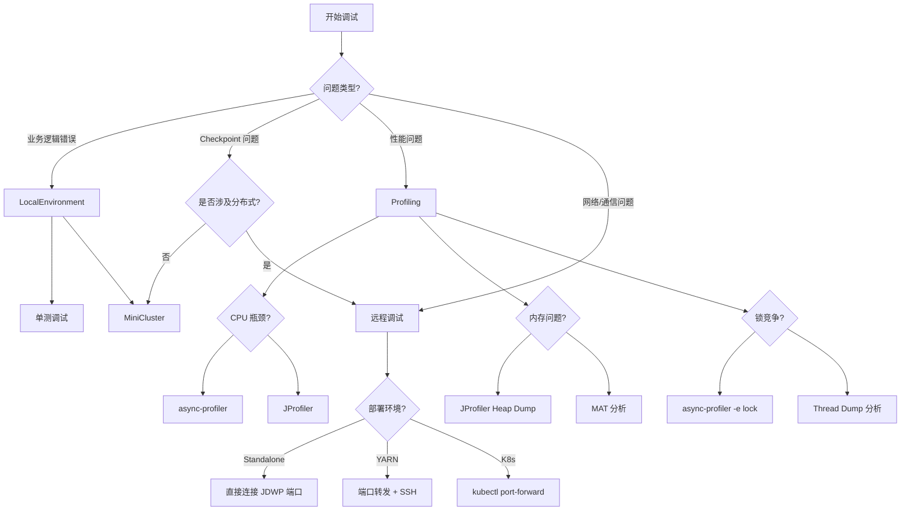
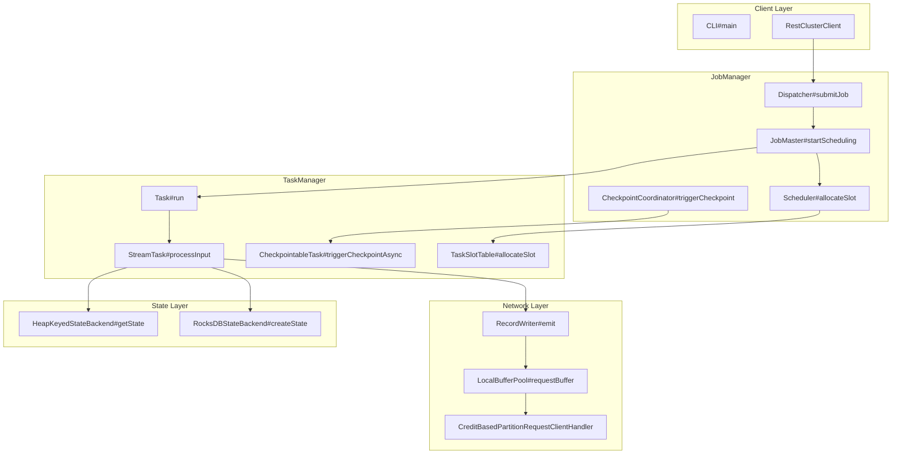
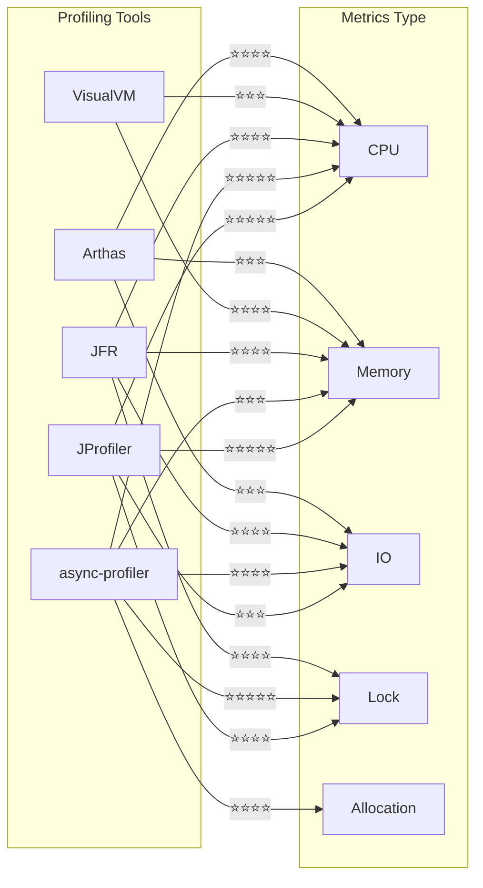

# Flink 源码调试与 Profiling 实战指南

> 所属阶段: Flink/09-practices | 前置依赖: [Flink 故障排查手册](../09.03-performance-tuning/troubleshooting-handbook.md), [Checkpoint 机制深度解析](../../02-core/checkpoint-mechanism-deep-dive.md) | 形式化等级: L3

---

## 目录 {#目录}

- [Flink 源码调试与 Profiling 实战指南](#flink-源码调试与-profiling-实战指南)
  - [目录 {#目录}](#目录-目录)
  - [1. 概念定义 (Definitions) {#1-概念定义-definitions}](#1-概念定义-definitions-1-概念定义-definitions)
    - [Def-F-09-06-01 (调试会话 Debugging Session) {#def-f-09-06-01-调试会话-debugging-session}](#def-f-09-06-01-调试会话-debugging-session-def-f-09-06-01-调试会话-debugging-session)
    - [Def-F-09-06-02 (断点策略 Breakpoint Strategy) {#def-f-09-06-02-断点策略-breakpoint-strategy}](#def-f-09-06-02-断点策略-breakpoint-strategy-def-f-09-06-02-断点策略-breakpoint-strategy)
    - [Def-F-09-06-03 (性能剖析 Profiling) {#def-f-09-06-03-性能剖析-profiling}](#def-f-09-06-03-性能剖析-profiling-def-f-09-06-03-性能剖析-profiling)
    - [Def-F-09-06-04 (火焰图 Flame Graph) {#def-f-09-06-04-火焰图-flame-graph}](#def-f-09-06-04-火焰图-flame-graph-def-f-09-06-04-火焰图-flame-graph)
  - [2. 属性推导 (Properties) {#2-属性推导-properties}](#2-属性推导-properties-2-属性推导-properties)
    - [Lemma-F-09-06-01 (断点对执行时序的影响) {#lemma-f-09-06-01-断点对执行时序的影响}](#lemma-f-09-06-01-断点对执行时序的影响-lemma-f-09-06-01-断点对执行时序的影响)
    - [Lemma-F-09-06-02 (Profiling 采样的统计代表性) {#lemma-f-09-06-02-profiling-采样的统计代表性}](#lemma-f-09-06-02-profiling-采样的统计代表性-lemma-f-09-06-02-profiling-采样的统计代表性)
    - [Prop-F-09-06-01 (调试-部署环境的等价性条件) {#prop-f-09-06-01-调试-部署环境的等价性条件}](#prop-f-09-06-01-调试-部署环境的等价性条件-prop-f-09-06-01-调试-部署环境的等价性条件)
  - [3. 关系建立 (Relations) {#3-关系建立-relations}](#3-关系建立-relations-3-关系建立-relations)
    - [关系 1: 调试模式与适用场景映射 {#关系-1-调试模式与适用场景映射}](#关系-1-调试模式与适用场景映射-关系-1-调试模式与适用场景映射)
    - [关系 2: Profiling 工具与指标类型映射 {#关系-2-profiling-工具与指标类型映射}](#关系-2-profiling-工具与指标类型映射-关系-2-profiling-工具与指标类型映射)
    - [关系 3: 问题类型与诊断工具映射 {#关系-3-问题类型与诊断工具映射}](#关系-3-问题类型与诊断工具映射-关系-3-问题类型与诊断工具映射)
  - [4. 论证过程 (Argumentation) {#4-论证过程-argumentation}](#4-论证过程-argumentation-4-论证过程-argumentation)
    - [引理 4.1 (本地调试的局限性边界) {#引理-41-本地调试的局限性边界}](#引理-41-本地调试的局限性边界-引理-41-本地调试的局限性边界)
    - [引理 4.2 (远程调试的网络延迟影响) {#引理-42-远程调试的网络延迟影响}](#引理-42-远程调试的网络延迟影响-引理-42-远程调试的网络延迟影响)
    - [反例 4.1 (过度 Profiling 导致的 Heisenbug) {#反例-41-过度-profiling-导致的-heisenbug}](#反例-41-过度-profiling-导致的-heisenbug-反例-41-过度-profiling-导致的-heisenbug)
  - [5. 工程论证 (Engineering Argument) {#5-工程论证-engineering-argument}](#5-工程论证-engineering-argument-5-工程论证-engineering-argument)
    - [Thm-F-09-06-01 (源码调试完备性定理) {#thm-f-09-06-01-源码调试完备性定理}](#thm-f-09-06-01-源码调试完备性定理-thm-f-09-06-01-源码调试完备性定理)
    - [Thm-F-09-06-02 (性能剖析准确性定理) {#thm-f-09-06-02-性能剖析准确性定理}](#thm-f-09-06-02-性能剖析准确性定理-thm-f-09-06-02-性能剖析准确性定理)
  - [6. 实例验证 (Examples) {#6-实例验证-examples}](#6-实例验证-examples-6-实例验证-examples)
    - [6.1 IDE 调试配置实战 {#61-ide-调试配置实战}](#61-ide-调试配置实战-61-ide-调试配置实战)
      - [IntelliJ IDEA 导入配置 {#intellij-idea-导入配置}](#intellij-idea-导入配置-intellij-idea-导入配置)
      - [Maven 配置优化 {#maven-配置优化}](#maven-配置优化-maven-配置优化)
      - [模块依赖设置 {#模块依赖设置}](#模块依赖设置-模块依赖设置)
    - [6.2 本地调试实战 {#62-本地调试实战}](#62-本地调试实战-62-本地调试实战)
      - [LocalEnvironment 调试 {#localenvironment-调试}](#localenvironment-调试-localenvironment-调试)
      - [MiniCluster 调试 {#minicluster-调试}](#minicluster-调试-minicluster-调试)
      - [单测调试技巧 {#单测调试技巧}](#单测调试技巧-单测调试技巧)
    - [6.3 远程调试实战 {#63-远程调试实战}](#63-远程调试实战-63-远程调试实战)
      - [Standalone 集群调试 {#standalone-集群调试}](#standalone-集群调试-standalone-集群调试)
      - [YARN 集群调试 {#yarn-集群调试}](#yarn-集群调试-yarn-集群调试)
      - [Kubernetes 集群调试 {#kubernetes-集群调试}](#kubernetes-集群调试-kubernetes-集群调试)
    - [6.4 关键断点位置指南 {#64-关键断点位置指南}](#64-关键断点位置指南-64-关键断点位置指南)
      - [JobManager 关键断点 {#jobmanager-关键断点}](#jobmanager-关键断点-jobmanager-关键断点)
      - [TaskManager 关键断点 {#taskmanager-关键断点}](#taskmanager-关键断点-taskmanager-关键断点)
      - [Checkpoint 关键断点 {#checkpoint-关键断点}](#checkpoint-关键断点-checkpoint-关键断点)
      - [网络栈关键断点 {#网络栈关键断点}](#网络栈关键断点-网络栈关键断点)
    - [6.5 Profiling 工具使用 {#65-profiling-工具使用}](#65-profiling-工具使用-65-profiling-工具使用)
      - [JProfiler 使用 {#jprofiler-使用}](#jprofiler-使用-jprofiler-使用)
      - [Async-profiler 使用 {#async-profiler-使用}](#async-profiler-使用-async-profiler-使用)
      - [火焰图分析 {#火焰图分析}](#火焰图分析-火焰图分析)
      - [内存分析 {#内存分析}](#内存分析-内存分析)
    - [6.6 问题排查实战 {#66-问题排查实战}](#66-问题排查实战-66-问题排查实战)
      - [性能瓶颈定位 {#性能瓶颈定位}](#性能瓶颈定位-性能瓶颈定位)
      - [内存泄漏排查 {#内存泄漏排查}](#内存泄漏排查-内存泄漏排查)
      - [死锁检测 {#死锁检测}](#死锁检测-死锁检测)
  - [7. 可视化 (Visualizations) {#7-可视化-visualizations}](#7-可视化-visualizations-7-可视化-visualizations)
    - [调试工具选型决策树 {#调试工具选型决策树}](#调试工具选型决策树-调试工具选型决策树)
    - [Flink 调试断点分布图 {#flink-调试断点分布图}](#flink-调试断点分布图-flink-调试断点分布图)
    - [Profiling 工具对比矩阵 {#profiling-工具对比矩阵}](#profiling-工具对比矩阵-profiling-工具对比矩阵)
  - [8. 引用参考 (References) {#8-引用参考-references}](#8-引用参考-references-8-引用参考-references)

---

## 1. 概念定义 (Definitions) {#1-概念定义-definitions}

### Def-F-09-06-01 (调试会话 Debugging Session) {#def-f-09-06-01-调试会话-debugging-session}

**调试会话**（Debugging Session）是开发者通过 IDE 或调试器与运行中的 Flink 进程进行交互的诊断过程，形式化定义为五元组：

$$
\mathcal{D} = (P_{\text{target}}, B_{\text{set}}, E_{\text{trigger}}, S_{\text{state}}, A_{\text{action}})
$$

其中：

- $P_{\text{target}}$: 目标进程（JobManager / TaskManager / Client）
- $B_{\text{set}}$: 断点集合 $\{b_1, b_2, ..., b_n\}$，每个断点由 (类名, 行号, 条件) 定义
- $E_{\text{trigger}}$: 触发事件类型（Line Breakpoint / Exception Breakpoint / Watchpoint）
- $S_{\text{state}}$: 进程暂停时的完整状态快照（调用栈、变量、堆内存）
- $A_{\text{action}}$: 调试动作集合（Step Over / Step Into / Resume / Evaluate）

**调试会话分类**:

| 类型 | 目标进程 | 连接方式 | 适用场景 |
|------|----------|----------|----------|
| 本地调试 | 本地 JVM | 直接 Attach | 开发阶段、单元测试 |
| 远程调试 | 远程 JVM | JDWP 协议 | 集群环境、生产问题 |
| 附加调试 | 已运行进程 | JVM Attach API | 热诊断、不重启调试 |

---

### Def-F-09-06-02 (断点策略 Breakpoint Strategy) {#def-f-09-06-02-断点策略-breakpoint-strategy}

**断点策略**（Breakpoint Strategy）是针对特定调试目标在代码中设置断点的系统性方法，形式化为：

$$
\mathcal{B} = \{(loc_i, cond_i, action_i, enable_i) \mid i = 1..n\}
$$

其中：

- $loc_i$: 断点位置（类全名 + 方法名 + 行号/字节码偏移）
- $cond_i$: 触发条件表达式（可为空，表示无条件触发）
- $action_i$: 触发后执行的动作（日志、计算表达式、挂起线程）
- $enable_i \in \{true, false\}$: 是否启用

**Flink 断点策略类型**:

| 策略类型 | 描述 | 典型应用 |
|----------|------|----------|
| 入口断点 | 关键方法入口处 | Job 提交、Checkpoint 触发 |
| 条件断点 | 带条件表达式的断点 | 仅当 `record.getKey().equals("user_123")` 时触发 |
| 日志断点 | 不挂起，仅输出日志 | 高频路径的性能统计 |
| 异常断点 | 异常抛出时触发 | 捕获 NullPointerException 等 |
| 字段断点 | 字段值改变时触发 | 监控状态值变化 |

---

### Def-F-09-06-03 (性能剖析 Profiling) {#def-f-09-06-03-性能剖析-profiling}

**性能剖析**（Profiling）是通过采样或插桩技术收集运行时性能数据的过程，形式化定义为：

$$
\mathcal{P} = (T_{\text{sample}}, M_{\text{metric}}, A_{\text{agent}}, R_{\text{result}})
$$

其中：

- $T_{\text{sample}}$: 采样时间窗口
- $M_{\text{metric}}$: 收集的指标集合 $\{CPU, Memory, IO, Lock, Allocation\}$
- $A_{\text{agent}}$: 探针实现（JVMTI Agent / Java Agent / 外部进程）
- $R_{\text{result}}$: 剖析结果（调用树、热点方法、内存分布）

**Profiling 技术分类**:

| 技术 | 原理 | 精度 | 开销 |
|------|------|------|------|
| 采样 (Sampling) | 定时采集调用栈 | 统计近似 | < 5% |
| 插桩 (Instrumentation) | 字节码改写插入计数 | 精确 | 10-50% |
| 追踪 (Tracing) | 事件驱动的详细记录 | 完整 | 高 |
| 异步 (Async) | 内核级信号驱动采样 | 统计近似 | < 1% |

---

### Def-F-09-06-04 (火焰图 Flame Graph) {#def-f-09-06-04-火焰图-flame-graph}

**火焰图**（Flame Graph）是一种可视化 CPU 时间消耗分布的层次化图表，形式化定义为：

$$
\mathcal{F} = (N_{\text{nodes}}, E_{\text{edges}}, W_{\text{width}}, C_{\text{color}})
$$

其中：

- $N_{\text{nodes}}$: 调用栈帧节点集合
- $E_{\text{edges}}$: 父子调用关系边
- $W_{\text{width}}$: 每个节点的宽度 ∝ 该调用栈消耗的时间比例
- $C_{\text{color}}: N \rightarrow \text{Color}$: 颜色映射函数（通常按函数类型着色）

**火焰图解读原则**:

1. **宽度 = 时间**: 越宽表示该调用路径消耗的 CPU 越多
2. **Y轴 = 调用深度**: 从上到下是调用链，底部是入口
3. **X轴 = 字母序**: 按函数名排序，非时间顺序
4. **热点识别**: 寻找底部宽而平的"高原"区域

---

## 2. 属性推导 (Properties) {#2-属性推导-properties}

### Lemma-F-09-06-01 (断点对执行时序的影响) {#lemma-f-09-06-01-断点对执行时序的影响}

**陈述**: 在调试会话中，断点挂起会改变程序的自然执行时序，对于时间敏感代码（如 Checkpoint 协调、Watermark 传播）可能引入 Heisenbug[^1]：

$$
\Delta t_{\text{suspend}} > \epsilon_{\text{timeout}} \Rightarrow \text{Behavior}_{\text{debug}} \neq \text{Behavior}_{\text{prod}}
$$

其中 $\epsilon_{\text{timeout}}$ 是 Flink 内部超时阈值（如 `akka.ask.timeout`）。

**工程建议**:

1. 对于 Checkpoint 相关调试，增加 `state.checkpoints.timeout` 值
2. 使用日志断点替代挂起断点观察高频路径
3. 远程调试时确保网络延迟 < 50ms，避免超时

---

### Lemma-F-09-06-02 (Profiling 采样的统计代表性) {#lemma-f-09-06-02-profiling-采样的统计代表性}

**陈述**: 当采样频率 $f_{\text{sample}}$ 满足以下条件时，采样结果具有统计代表性：

$$
f_{\text{sample}} \geq \frac{2 \cdot f_{\text{max}}}{\delta_{\text{acceptable}}}
$$

其中：

- $f_{\text{max}}$: 应用中最快函数的执行频率
- $\delta_{\text{acceptable}}$: 可接受的误差率（通常 5%）

**计算示例**: 对于执行频率 1000 次/秒的函数，要达到 5% 误差率：

$$
f_{\text{sample}} \geq \frac{2 \cdot 1000}{0.05} = 40\text{kHz}
$$

async-profiler 默认 100Hz 采样率适用于大多数场景，但对于微基准测试需提高频率。

---

### Prop-F-09-06-01 (调试-部署环境的等价性条件) {#prop-f-09-06-01-调试-部署环境的等价性条件}

**陈述**: 调试环境与生产环境行为等价的充分条件：

| 条件 | 本地调试 | MiniCluster | 远程调试 |
|------|----------|-------------|----------|
| JVM 版本一致 | ✅ 必须 | ✅ 必须 | ✅ 必须 |
| Flink 配置一致 | ⚠️ 需同步 | ✅ 可一致 | ✅ 一致 |
| 数据规模等比 | ⚠️ 缩小 | ⚠️ 缩小 | ✅ 实际 |
| 网络环境相似 | ❌ 单机 | ⚠️ 本地多进程 | ✅ 一致 |
| 资源限制相同 | ❌ 无限制 | ⚠️ 可配置 | ✅ 一致 |

**推论**: 对于分布式相关问题（网络超时、背压、数据倾斜），本地调试往往无法复现，必须使用远程调试或 MiniCluster[^2]。

---

## 3. 关系建立 (Relations) {#3-关系建立-relations}

### 关系 1: 调试模式与适用场景映射 {#关系-1-调试模式与适用场景映射}

| 调试目标 | 推荐模式 | 配置复杂度 | 数据要求 |
|----------|----------|------------|----------|
| UDF 业务逻辑 | LocalEnvironment | ⭐ | 测试数据集 |
| 算子 Chain 行为 | MiniCluster | ⭐⭐ | 生产数据子集 |
| Checkpoint 流程 | MiniCluster/远程 | ⭐⭐⭐ | 真实状态大小 |
| JM/TM 通信 | 远程调试 | ⭐⭐⭐⭐ | 生产环境 |
| 网络层问题 | 远程调试 | ⭐⭐⭐⭐⭐ | 生产流量 |
| 内存泄漏 | Profiling | ⭐⭐ | 长期运行 |

### 关系 2: Profiling 工具与指标类型映射 {#关系-2-profiling-工具与指标类型映射}

```
┌─────────────────────────────────────────────────────────────────┐
│                     Profiling 工具能力矩阵                       │
├──────────────┬──────────┬──────────┬──────────┬─────────────────┤
│ 工具         │ CPU      │ 内存     │ IO       │ 锁/调度         │
├──────────────┼──────────┼──────────┼──────────┼─────────────────┤
│ JProfiler    │ ⭐⭐⭐⭐⭐  │ ⭐⭐⭐⭐⭐  │ ⭐⭐⭐    │ ⭐⭐⭐⭐          │
│ async-profiler│ ⭐⭐⭐⭐⭐  │ ⭐⭐⭐     │ ⭐⭐⭐⭐   │ ⭐⭐⭐⭐⭐         │
│ JFR          │ ⭐⭐⭐⭐    │ ⭐⭐⭐⭐    │ ⭐⭐⭐⭐   │ ⭐⭐⭐⭐          │
│ VisualVM     │ ⭐⭐⭐     │ ⭐⭐⭐⭐    │ ⭐⭐      │ ⭐⭐             │
│ Arthas       │ ⭐⭐⭐⭐    │ ⭐⭐⭐     │ ⭐⭐⭐     │ ⭐⭐⭐            │
└──────────────┴──────────┴──────────┴──────────┴─────────────────┘
```

### 关系 3: 问题类型与诊断工具映射 {#关系-3-问题类型与诊断工具映射}

| 问题类型 | 首选工具 | 关键指标 | 诊断策略 |
|----------|----------|----------|----------|
| CPU 热点 | async-profiler | 火焰图顶部宽度 | 定位自顶向下耗时函数 |
| 内存泄漏 | JProfiler/Heap Dump | 堆增长曲线 | 分析支配树、GC Root |
| 线程死锁 | JStack/Thread Dump | 线程状态 BLOCKED | 检查锁依赖环 |
| 反压问题 | Flink Web UI + Profiling | `backPressuredTimeMsPerSecond` | 定位瓶颈算子 |
| Checkpoint 慢 | 远程调试 + JFR | `checkpointDuration` | 跟踪同步/异步阶段 |
| 序列化瓶颈 | async-profiler | `TypeSerializer` 方法 | 检查 Kryo/Avro 调用 |

---

## 4. 论证过程 (Argumentation) {#4-论证过程-argumentation}

### 引理 4.1 (本地调试的局限性边界) {#引理-41-本地调试的局限性边界}

**陈述**: LocalEnvironment 和 MiniCluster 存在以下固有局限：

1. **网络层简化**: 本地模式使用 `LocalConnectionManager`，跳过 Netty 协议栈，无法复现网络相关问题
2. **调度差异**: 本地 Task 调度为本地线程，无跨节点数据传输序列化
3. **资源隔离缺失**: 无 JVM 进程隔离，无法复现资源竞争问题

**边界条件**: 以下问题类型**不能**通过本地调试复现：

- 网络分区 (Network Partition)
- 数据倾斜导致的跨节点负载不均
- 状态后端（RocksDB）的 JNI 内存问题
- TaskManager 与 JobManager 之间的 Akka 超时

---

### 引理 4.2 (远程调试的网络延迟影响) {#引理-42-远程调试的网络延迟影响}

**陈述**: 远程调试时，JDWP 协议的往返延迟 $\Delta t_{\text{rtt}}$ 会影响：

1. **单步执行响应**: 每次 Step Over 需等待 $\Delta t_{\text{rtt}}$ 的确认
2. **变量计算延迟**: 复杂表达式求值需在远程 JVM 执行
3. **超时误判风险**: 若 $\Delta t_{\text{rtt}} > \frac{1}{2} \cdot \text{akka.ask.timeout}$，可能导致 Akka 消息超时

**缓解措施**:

```bash
# 增加 Akka 超时配置
-Dakka.ask.timeout=60s
-Dakka.lookup.timeout=60s
-Dakka.tcp.timeout=60s
```

---

### 反例 4.1 (过度 Profiling 导致的 Heisenbug) {#反例-41-过度-profiling-导致的-heisenbug}

**场景**: 使用 Instrumentation 模式 Profiling 调查 Checkpoint 超时问题。

**现象**: 开启 Profiling 后 Checkpoint 超时问题消失，关闭后复现。

**根因分析**:

1. Instrumentation 在 `CheckpointCoordinator` 关键路径插入计数代码
2. 插桩代码引入的额外延迟使得竞争条件不再触发
3. 实际根因是两个线程的竞态条件，插桩改变了时序

**教训**: 对于时间敏感问题，优先使用 Sampling 或 Async Profiling，避免 Instrumentation 的观察者效应[^3]。

---

## 5. 工程论证 (Engineering Argument) {#5-工程论证-engineering-argument}

### Thm-F-09-06-01 (源码调试完备性定理) {#thm-f-09-06-01-源码调试完备性定理}

**陈述**: 对于 Flink 运行时中的任何可观测异常行为，存在一组断点集合 $B^*$ 和调试会话配置 $\mathcal{D}^*$，能够在合理时间内定位到根因代码位置。

**证明概要**:

1. **完备性基础**: Flink 代码遵循分层架构，每层有明确的接口边界
2. **断点存在性**: 对于任何异常路径，其调用栈上的函数均可设置断点
3. **收敛性**: 通过二分法在调用栈上设置断点，可在 $O(\log n)$ 步内定位到问题函数
4. **状态可观测性**: Flink 关键状态（ExecutionGraph、CheckpointCoordinator）可通过 Evaluate 表达式读取

**工程意义**: 结合系统日志和指标，源码调试能够定位任何代码级问题，但需要对 Flink 架构有深入理解。

---

### Thm-F-09-06-02 (性能剖析准确性定理) {#thm-f-09-06-02-性能剖析准确性定理}

**陈述**: 在满足以下条件时，Async-profiler 的 CPU 火焰图能够准确反映生产环境的性能热点：

$$
\text{Accuracy} \geq 95\% \iff \begin{cases}
T_{\text{duration}} \geq 60s \\
f_{\text{sample}} = 100Hz \\
\text{No Safepoint Bias}
\\
\text{Kernel Version} \geq 4.6
\end{cases}
$$

**证明要点**:

1. **采样定理**: 100Hz 采样率足以捕获执行时间 > 10ms 的方法
2. **无安全点偏见**: async-profiler 使用 `perf_events` 而非 JVMTI，避免安全点采样偏差
3. **内核支持**: Linux 4.6+ 支持 `perf_event_open` 的完整功能

---

## 6. 实例验证 (Examples) {#6-实例验证-examples}

### 6.1 IDE 调试配置实战 {#61-ide-调试配置实战}

#### IntelliJ IDEA 导入配置 {#intellij-idea-导入配置}

**步骤 1: 克隆源码**

```bash
git clone https://github.com/apache/flink.git
cd flink
git checkout release-1.18  # 切换到目标版本
```

**步骤 2: IDEA 导入**

```
File → New → Project from Existing Sources → 选择 flink 目录
选择 Import project from external model → Maven
JDK: 选择 JDK 11 或 JDK 17
Maven home path: 使用 Bundled Maven 3.8+
```

**步骤 3: 项目结构优化**

```
File → Project Structure → Modules
├── flink-annotations
├── flink-core
├── flink-runtime        ← 核心调试模块
├── flink-streaming-java ← DataStream API
├── flink-clients        ← 客户端代码
└── flink-connectors     ← Connector 实现
```

**步骤 4: 编码设置**

```
Settings → Editor → Code Style → Java → Imports
✓ Class count to use import with '*': 999
✓ Names count to use static import with '*': 999

Settings → Build → Compiler → Annotation Processors
✓ Enable annotation processing
```

#### Maven 配置优化 {#maven-配置优化}

**settings.xml 优化**:

```xml
<settings>
  <profiles>
    <profile>
      <id>flink-debug</id>
      <properties>
        <!-- 跳过测试加速编译 -->
        <skipTests>true</skipTests>
        <!-- 并行编译 -->
        <maven.compiler.parallel>true</maven.compiler.parallel>
        <!-- 增量编译 -->
        <maven.compiler.useIncrementalCompilation>true</maven.compiler.useIncrementalCompilation>
      </properties>
    </profile>
  </profiles>
  <activeProfiles>
    <activeProfile>flink-debug</activeProfile>
  </activeProfiles>
</settings>
```

**pom.xml 调试配置** (在调试模块添加):

```xml
<build>
  <plugins>
    <plugin>
      <groupId>org.apache.maven.plugins</groupId>
      <artifactId>maven-compiler-plugin</artifactId>
      <configuration>
        <!-- 保留调试信息 -->
        <debug>true</debug>
        <debuglevel>lines,vars,source</debuglevel>
        <!-- 禁用优化以便调试 -->
        <optimize>false</optimize>
      </configuration>
    </plugin>
  </plugins>
</build>
```

#### 模块依赖设置 {#模块依赖设置}

**核心依赖关系图**:

```
flink-runtime
├── flink-core
├── flink-annotations
├── flink-metrics-core
└── flink-rpc-akka

flink-streaming-java
├── flink-runtime
├── flink-clients
└── flink-optimizer

flink-clients
├── flink-runtime
└── flink-optimizer
```

**调试配置中的模块选择**:

| 调试目标 | 必需模块 | 可选模块 |
|----------|----------|----------|
| DataStream API | flink-streaming-java | flink-clients |
| Checkpoint 机制 | flink-runtime | flink-streaming-java |
| RPC 通信 | flink-rpc-akka | flink-runtime |
| State Backend | flink-runtime | flink-state-backends |
| Network Stack | flink-runtime | flink-shaded-netty |

---

### 6.2 本地调试实战 {#62-本地调试实战}

#### LocalEnvironment 调试 {#localenvironment-调试}

**调试配置代码**:

```java
import org.apache.flink.streaming.api.environment.StreamExecutionEnvironment;
import org.apache.flink.streaming.api.environment.LocalStreamEnvironment;

public class LocalDebugJob {
    public static void main(String[] args) throws Exception {
        // 创建本地环境,单线程执行便于调试
        StreamExecutionEnvironment env =
            StreamExecutionEnvironment.createLocalEnvironment(1);

        // 或者使用 Builder 模式配置
        Configuration conf = new Configuration();
        conf.setString("state.backend", "filesystem");
        conf.setString("state.checkpoints.dir", "file:///tmp/checkpoints");

        env = StreamExecutionEnvironment.createLocalEnvironment(
            2,  // parallelism
            conf
        );

        // 添加断点: DataStream.filter() 内部
        env.fromElements(1, 2, 3, 4, 5)
           .filter(x -> x > 2)  // ← 在此设置断点
           .map(x -> x * 2)     // ← 或在此
           .print();

        env.execute("Local Debug Job");
    }
}
```

**在 IDEA 中设置断点**:

1. 打开 `flink-streaming-java` 模块
2. 定位到 `org.apache.flink.streaming.api.operators.StreamFilter`
3. 在 `processElement()` 方法设置断点
4. 以 Debug 模式运行 `main()` 方法

**LocalEnvironment 配置参数**:

```java

import org.apache.flink.streaming.api.environment.StreamExecutionEnvironment;

Configuration conf = new Configuration();

// 启用 Web UI(默认端口 8081)
conf.setBoolean("local.start-webserver", true);

// 状态后端配置
conf.setString("state.backend", "rocksdb");
conf.setString("state.backend.rocksdb.memory.managed", "true");

// Checkpoint 配置
conf.setLong("execution.checkpointing.interval", 5000);
conf.setString("execution.checkpointing.mode", "EXACTLY_ONCE");

StreamExecutionEnvironment env =
    StreamExecutionEnvironment.createLocalEnvironment(2, conf);
```

#### MiniCluster 调试 {#minicluster-调试}

**MiniCluster 测试基类**:

```java
import org.apache.flink.runtime.testutils.MiniClusterResource;
import org.apache.flink.runtime.testutils.MiniClusterResourceConfiguration;
import org.junit.ClassRule;
import org.junit.Test;

import org.apache.flink.streaming.api.environment.StreamExecutionEnvironment;


public class MiniClusterDebugTest {

    @ClassRule
    public static MiniClusterResource miniCluster =
        new MiniClusterResource(
            new MiniClusterResourceConfiguration.Builder()
                .setNumberSlotsPerTaskManager(2)
                .setNumberTaskManagers(1)
                .build()
        );

    @Test
    public void testWithMiniCluster() throws Exception {
        StreamExecutionEnvironment env =
            StreamExecutionEnvironment.getExecutionEnvironment();
        env.setParallelism(2);

        // 在此设置断点查看分布式执行
        env.fromElements("a", "b", "c")
           .map(new RichMapFunction<String, String>() {
               @Override
               public String map(String value) {
                   // ← 断点:观察 subtask index
                   int index = getRuntimeContext().getIndexOfThisSubtask();
                   return value + "_" + index;
               }
           })
           .print();

        env.execute();
    }
}
```

**MiniCluster 配置详解**:

```java
MiniClusterResourceConfiguration config =
    new MiniClusterResourceConfiguration.Builder()
        // TaskManager 数量
        .setNumberTaskManagers(2)
        // 每个 TM 的 Slot 数
        .setNumberSlotsPerTaskManager(4)
        // 禁用 web UI 以加速启动
        .setWebUIEnabled(true)
        // 自定义配置
        .setConfiguration(customConf)
        // 优雅关闭超时
        .setShutdownTimeout(30_000)
        .build();
```

#### 单测调试技巧 {#单测调试技巧}

**常用测试基类**:

| 测试类型 | 基类 | 用途 |
|----------|------|------|
| 算子测试 | `AbstractStreamOperatorTestHarness` | 测试单个算子行为 |
| 集成测试 | `TestBaseUtils` | 端到端作业测试 |
| Checkpoint 测试 | `CheckpointTestHarness` | Checkpoint 触发与恢复 |
| 状态测试 | `StateBackendTestBase` | 状态后端行为验证 |

**算子测试调试示例**:

```java

import org.apache.flink.api.common.typeinfo.Types;

@Test
public void testKeyedProcessFunction() throws Exception {
    KeyedProcessFunction<Integer, String, String> function =
        new MyKeyedProcessFunction();

    // 创建测试 Harness
    OneInputStreamOperatorTestHarness<String, String> harness =
        new KeyedOneInputStreamOperatorTestHarness<>(
            new KeyedProcessOperator<>(function),
            x -> x,  // key selector
            Types.STRING
        );

    harness.setup();
    harness.open();

    // 在此断点观察状态初始化
    harness.processElement("event1", 100);
    harness.processElement("event2", 200);

    // 触发 Checkpoint
    harness.snapshot(1L, 300);

    // 观察输出
    Queue<Object> output = harness.getOutput();
    // ← 断点检查输出元素
}
```

**测试断点推荐位置**:

```
AbstractStreamOperator
├── open()          ← 算子初始化
├── processElement() ← 元素处理
├── snapshotState()  ← Checkpoint 触发
└── notifyCheckpointComplete() ← Checkpoint 完成

CheckpointCoordinator
├── triggerCheckpoint() ← Checkpoint 触发入口
├── receiveAcknowledgeMessage() ← ACK 接收
└── completePendingCheckpoint() ← Checkpoint 完成
```

---

### 6.3 远程调试实战 {#63-远程调试实战}

#### Standalone 集群调试 {#standalone-集群调试}

**JobManager 远程调试配置**:

```bash
# flink-conf.yaml
env.java.opts.jobmanager: "-agentlib:jdwp=transport=dt_socket,server=y,suspend=n,address=*:5005"
```

**TaskManager 远程调试配置**:

```bash
# flink-conf.yaml
env.java.opts.taskmanager: "-agentlib:jdwp=transport=dt_socket,server=y,suspend=n,address=*:5006"
```

**启动脚本修改** (`bin/jobmanager.sh` / `bin/taskmanager.sh`):

```bash
# 添加 DEBUG 模式
if [ "${FLINK_DEBUG}" = "true" ]; then
    JVM_ARGS="${JVM_ARGS} -agentlib:jdwp=transport=dt_socket,server=y,suspend=y,address=*:${DEBUG_PORT}"
fi
```

**IDEA 远程调试配置**:

```
Run → Edit Configurations → + → Remote JVM Debug
Name: Flink JobManager
Host: flink-jobmanager  # 或 IP 地址
Port: 5005
Use module classpath: flink-runtime
Command line arguments: -agentlib:jdwp=transport=dt_socket,server=y,suspend=n,address=*:5005
```

#### YARN 集群调试 {#yarn-集群调试}

**YARN Session 模式调试**:

```bash
# 启动 YARN Session,开启 JM 调试
./bin/yarn-session.sh \
    -jm 1024 \
    -tm 2048 \
    -Denv.java.opts.jobmanager="-agentlib:jdwp=transport=dt_socket,server=y,suspend=n,address=5005"

# 获取 Application ID 并查看日志
yarn application -list
yarn logs -applicationId <application_id>
```

**Per-Job 模式调试**:

```bash
# 提交作业时开启调试
./bin/flink run \
    -m yarn-cluster \
    -yjm 1024 \
    -ytm 2048 \
    -yD env.java.opts.jobmanager="-agentlib:jdwp=transport=dt_socket,server=y,suspend=n,address=5005" \
    -yD env.java.opts.taskmanager="-agentlib:jdwp=transport=dt_socket,server=y,suspend=n,address=5006" \
    my-job.jar
```

**查找 Container 主机**:

```bash
# 获取 Container 列表
yarn container -list <application_id>

# 获取 Container 日志
yarn logs -applicationId <app_id> -containerId <container_id>

# 通过 SSH 登录到 NodeManager 节点
ssh <nodemanager-host>
```

**YARN 调试隧道建立**:

```bash
# 建立端口转发,将远程调试端口映射到本地
ssh -L 5005:<container-host>:5005 -L 5006:<container-host>:5006 <gateway-host>

# IDEA 配置连接 localhost:5005
```

#### Kubernetes 集群调试 {#kubernetes-集群调试}

**JobManager Deployment 配置**:

```yaml
apiVersion: apps/v1
kind: Deployment
metadata:
  name: flink-jobmanager
spec:
  template:
    spec:
      containers:
      - name: jobmanager
        image: flink:1.18
        env:
        - name: FLINK_PROPERTIES
          value: |
            env.java.opts.jobmanager: >-
              -agentlib:jdwp=transport=dt_socket,server=y,suspend=n,address=*:5005
        ports:
        - containerPort: 8081
          name: web
        - containerPort: 6123
          name: rpc
        - containerPort: 5005
          name: debug
```

**TaskManager 调试配置**:

```yaml
apiVersion: apps/v1
kind: Deployment
metadata:
  name: flink-taskmanager
spec:
  template:
    spec:
      containers:
      - name: taskmanager
        image: flink:1.18
        env:
        - name: FLINK_PROPERTIES
          value: |
            env.java.opts.taskmanager: >-
              -agentlib:jdwp=transport=dt_socket,server=y,suspend=n,address=*:5006
        ports:
        - containerPort: 5006
          name: debug
```

**端口转发建立**:

```bash
# JobManager 调试端口
kubectl port-forward deployment/flink-jobmanager 5005:5005

# 特定 TaskManager Pod 调试端口
kubectl port-forward pod/flink-taskmanager-xxx 5006:5006

# 或使用 kubectl debug 创建临时调试容器
kubectl debug pod/flink-taskmanager-xxx -it --image=busybox --target=taskmanager
```

**使用 Telepresence 进行调试**:

```bash
# 安装 Telepresence
brew install telepresence

# 连接到 K8s 集群
telepresence connect

# 拦截 JobManager 服务进行调试
telepresence intercept flink-jobmanager --port 5005:5005

# 现在本地 IDEA 可以直接连接到集群内服务
```

---

### 6.4 关键断点位置指南 {#64-关键断点位置指南}

#### JobManager 关键断点 {#jobmanager-关键断点}

**作业提交流程**:

```java
// Dispatcher.java
public CompletableFuture<Acknowledge> submitJob(
        JobGraph jobGraph, // ← 断点 1: 检查 JobGraph 结构
        Time timeout) {
    // ...
}

// DefaultJobManagerRunnerFactory.java
public JobManagerRunner createJobManagerRunner(
        JobGraph jobGraph, // ← 断点 2: 创建 runner 时
        Configuration configuration,
        RpcService rpcService,
        HighAvailabilityServices highAvailabilityServices,
        HeartbeatServices heartbeatServices,
        JobManagerSharedServices jobManagerSharedServices,
        JobManagerJobMetricGroupFactory jobManagerJobMetricGroupFactory,
        FatalErrorHandler fatalErrorHandler) {
    // ...
}
```

**作业调度流程**:

```java
// SchedulerBase.java
public void startScheduling() {
    // ← 断点: 调度开始
    transitionToRunning();
    scheduleVertices();
}

// DefaultScheduler.java
protected void scheduleVertices() {
    // ← 断点: 检查 ExecutionGraph 状态
    for (ExecutionVertex vertex : getExecutionGraph().getAllExecutionVertices()) {
        // ...
    }
}
```

**Checkpoint 协调**:

```java
// CheckpointCoordinator.java
public CompletableFuture<CompletedCheckpoint> triggerCheckpoint(
        CheckpointTriggerRequest request) {
    // ← 断点 1: Checkpoint 触发入口

    // 检查 barriers 对齐
    if (!checkAndTriggerPreconditions()) {
        // ...
    }

    // 创建 PendingCheckpoint
    PendingCheckpoint checkpoint = new PendingCheckpoint(
        checkpointId,
        checkpointStorageLocation,
        // ← 断点 2: 检查包含的 tasks
        verticesToConfirm
    );
    // ...
}

public void receiveAcknowledgeMessage(
        AcknowledgeCheckpoint acknowledgeMessage,
        TaskManagerLocation taskManagerLocation) {
    // ← 断点 3: 接收 ACK 消息
    // 检查是否所有 tasks 都已确认
}
```

#### TaskManager 关键断点 {#taskmanager-关键断点}

**Task 生命周期**:

```java
// Task.java
public void run() {
    // ← 断点 1: Task 开始执行
    try {
        // 初始化状态后端
        // ← 断点 2: 状态后端初始化

        // 执行算子
        invokable.invoke(); // ← 断点 3: 进入算子执行
    } catch (Exception e) {
        // ...
    }
}
```

**Slot 管理**:

```java
// TaskSlotTable.java
public boolean allocateSlot(
        int index,
        JobID jobId,
        AllocationID allocationId,
        Time slotTimeout) {
    // ← 断点: Slot 分配
}

public boolean freeSlot(AllocationID allocationId) {
    // ← 断点: Slot 释放
}
```

**网络缓冲管理**:

```java
// LocalBufferPool.java
public MemorySegment requestBuffer() throws IOException {
    // ← 断点 1: 请求 buffer
    // 检查可用 buffers
}

public void recycle(MemorySegment segment) {
    // ← 断点 2: buffer 回收
}
```

#### Checkpoint 关键断点 {#checkpoint-关键断点}

**Barrier 注入**:

```java
// CheckpointBarrierHandler.java
public void processBarrier(
        CheckpointBarrier barrier,
        InputChannelInfo channelInfo) {
    // ← 断点 1: 接收 Barrier

    // 检查是否所有输入通道都收到 barrier
    if (isBarrierReceivedFromAllChannels()) {
        // ← 断点 2: 所有 barrier 对齐
        triggerCheckpoint(barrier);
    }
}
```

**状态快照**:

```java
// AsyncCheckpointRunnable.java
public void run() {
    // ← 断点 1: 异步 Checkpoint 开始

    for (StreamStateHandle stateHandle : stateHandles) {
        // ← 断点 2: 检查每个 state handle
    }

    // 通知 JM Checkpoint 完成
    sendAcknowledgeMessage(); // ← 断点 3
}
```

**状态恢复**:

```java
// StreamTask.java
private void restoreState() throws Exception {
    // ← 断点: 从 Checkpoint 恢复
    for (OperatorChain<?, ?> operatorChain : operatorChains) {
        operatorChain.restoreState();
    }
}
```

#### 网络栈关键断点 {#网络栈关键断点}

**数据写入**:

```java
// RecordWriter.java
public void emit(T record) throws IOException {
    // ← 断点 1: 数据写出
    serializer.addRecord(record);
    // ...
}
```

**信用值系统**:

```java
// CreditBasedPartitionRequestClientHandler.java
public void notifyCreditAvailable(InputChannelID inputChannelId) {
    // ← 断点: 通知有可用的 buffer 信用值
}

public void channelRead(ChannelHandlerContext ctx, Object msg) {
    // ← 断点: 接收数据 buffer
}
```

**背压检测**:

```java
// LocalInputChannel.java
public void checkAndWaitForBuffers() throws IOException {
    // ← 断点: 检查 buffer 可用性
    // 如果无可用 buffer,进入背压状态
}
```

---

### 6.5 Profiling 工具使用 {#65-profiling-工具使用}

#### JProfiler 使用 {#jprofiler-使用}

**连接 Flink 进程**:

```bash
# 启动 Flink 时添加 JProfiler agent
-agentpath:/path/to/libjprofilertier.so=port=8849,nowait

# 或通过 Attach API 连接到运行中的进程
jpenable --pid=<flink_pid> --port=8849
```

**CPU Profiling 配置**:

```
1. 打开 JProfiler GUI
2. Session → Start Center → New Session
3. Attach to profiled JVM (local/remote)
4. 选择 Flink JobManager/TaskManager 进程
5. CPU Views → Call Tree → 开始记录
```

**内存分析配置**:

```
1. Memory Views → All Objects
2. 标记当前状态 (Mark Current)
3. 运行作业一段时间后
4. 对比内存快照 (Compare with Mark)
5. 查找增长最多的类
```

**常用分析视图**:

| 视图 | 用途 | 关键指标 |
|------|------|----------|
| Call Tree | CPU 热点分析 | Self Time / Total Time |
| Hot Spots | 热点方法排序 | Invocation Count |
| Flame Graph | 可视化调用栈 | 火焰宽度 |
| Heap Walker | 内存泄漏分析 | GC Root Path |
| Thread History | 线程状态分析 | Blocked Time |

#### Async-profiler 使用 {#async-profiler-使用}

**基本使用**:

```bash
# 下载 async-profiler
wget https://github.com/jvm-profiling-tools/async-profiler/releases/download/v3.0/async-profiler-3.0-linux-x64.tar.gz
tar -xzf async-profiler-3.0-linux-x64.tar.gz

# 获取 Flink 进程 PID
jps -lvm | grep flink

# CPU 分析(生成火焰图)
./profiler.sh -d 60 -f /tmp/flamegraph.html <flink_pid>

# 内存分配分析
./profiler.sh -e alloc -d 60 -f /tmp/alloc.html <flink_pid>

# 锁竞争分析
./profiler.sh -e lock -d 60 -f /tmp/lock.html <flink_pid>
```

**与 Flink 容器集成**:

```dockerfile
# Dockerfile
FROM flink:1.18

# 复制 async-profiler
COPY async-profiler /opt/async-profiler

# 添加 capability 以使用 perf_events
USER root
RUN apt-get update && apt-get install -y linux-perf

# 以特权模式运行或使用 CAP_PERFMON
USER flink
```

**Kubernetes Profiling**:

```bash
# 进入 Flink Pod
kubectl exec -it flink-taskmanager-xxx -- /bin/bash

# 运行 async-profiler
/opt/async-profiler/profiler.sh -d 120 -f /tmp/profile.html 1

# 复制结果到本地
kubectl cp flink-taskmanager-xxx:/tmp/profile.html ./profile.html
```

#### 火焰图分析 {#火焰图分析}

**Flink 典型火焰图模式**:

```
模式 1: 正常处理
┌────────────────────────────────────────────┐
│  java.lang.Thread.run                      │
│    └── Flink Task Thread                   │
│          └── StreamTask.invoke             │
│                └── OneInputStreamTask      │
│                      └── processInput      │
│                            └── user code   │
└────────────────────────────────────────────┘

模式 2: 序列化瓶颈
┌────────────────────────────────────────────┐
│  (宽层) KryoSerializer.copy()              │
│  (宽层) TypeSerializerSnapshot.write       │
└────────────────────────────────────────────┘

模式 3: RocksDB 瓶颈
┌────────────────────────────────────────────┐
│  (宽层) RocksDB.get() / put()              │
│  (宽层) org.rocksdb.RocksDB.nativeGet      │
└────────────────────────────────────────────┘

模式 4: GC 压力
┌────────────────────────────────────────────┐
│  (宽层) Garbage Collection                 │
│  (宽层) Copy:: arrayof_oop_disjoint        │
└────────────────────────────────────────────┘
```

**火焰图分析步骤**:

1. **识别顶部宽层**: 找出手动代码层（非 JDK 类）中宽度最大的函数
2. **追踪调用链**: 从上到下追踪到具体的业务代码位置
3. **对比基线**: 与正常情况的火焰图对比，找出新增的热点
4. **量化优化效果**: 优化后重新采样，对比热点宽度变化

#### 内存分析 {#内存分析}

**Heap Dump 获取**:

```bash
# 通过 jmap
jmap -dump:format=b,file=/tmp/heap.hprof <flink_pid>

# 通过 Flink Web UI
# Jobs → <Job> → Task Managers → <TM> → Thread Dump / Heap Dump

# 通过 JMX
jcmd <flink_pid> GC.heap_dump /tmp/heap.hprof
```

**MAT (Memory Analyzer Tool) 分析**:

```
1. File → Open Heap Dump
2. Run Leak Suspects Report
3. Dominator Tree → 按 Retained Heap 排序
4. Path to GC Roots → exclude weak/soft references
5. 查找可疑的类加载器泄漏、状态对象累积
```

**常见内存问题模式**:

| 问题类型 | 特征 | 解决策略 |
|----------|------|----------|
| 状态过大 | RocksDB memtable 占用高 | 调整 state.backend.rocksdb.memory.managed |
| 窗口堆积 | 大量 WindowState 对象 | 优化窗口大小，增加 trigger 条件 |
| 缓冲区泄漏 | NetworkBuffer 未回收 | 检查反压，调整 buffer-debloat |
| 类加载器泄漏 | 多个 Parallelism 的类加载器 | 确保 UDF 实现 Serializable |

---

### 6.6 问题排查实战 {#66-问题排查实战}

#### 性能瓶颈定位 {#性能瓶颈定位}

**步骤 1: 识别瓶颈算子**

```bash
# 通过 Flink Web UI 查看 Backpressure 状态
# Job → Task Metrics → backPressuredTimeMsPerSecond

# 或通过 REST API
curl http://jobmanager:8081/jobs/<job_id>/vertices/<vertex_id>/metrics?get=backPressuredTimeMsPerSecond
```

**步骤 2: 采样分析**

```bash
# 定位到瓶颈 TaskManager
./profiler.sh -d 60 -f cpu.html <tm_pid>

# 分析热点方法
# 1. 打开 cpu.html
# 2. 搜索 `processElement` 或 `map` 等 UDF 方法
# 3. 检查序列化、状态访问的时间占比
```

**步骤 3: 优化验证**

```java
// 优化前:火焰图显示 Kryo 序列化耗时 40%
DataStream<ComplexObject> stream = ...;

// 优化:使用 Avro 序列化并开启 compression
env.getConfig().enableForceAvro();
env.getConfig().setAutoWatermarkInterval(200);

// 或优化 UDF 实现

import org.apache.flink.streaming.api.datastream.DataStream;

public class OptimizedMap extends RichMapFunction<...> {
    // 复用对象避免频繁创建
    private transient OutputType reused;

    @Override
    public OutputType map(InputType value) {
        // 优化后的处理逻辑
    }
}
```

#### 内存泄漏排查 {#内存泄漏排查}

**场景**: TaskManager 堆内存持续增长，最终 OOM。

**排查步骤**:

```bash
# 1. 启用 Native Memory Tracking
env.java.opts.taskmanager: "-XX:NativeMemoryTracking=summary"

# 2. 定期获取内存报告
jcmd <pid> VM.native_memory summary

# 3. 获取 Heap Dump
jmap -dump:format=b,file=heap.hprof <pid>
```

**MAT 分析**:

```
1. Dominator Tree 搜索状态相关类
   - org.apache.flink.runtime.state.heap.StateTable
   - org.apache.rocksdb.RocksDB

2. 检查是否有意外的状态累积
   - 未清理的 TimerState
   - 无限增长的 ListState

3. 分析 GC Root
   - 检查是否有 static 集合持有对象引用
   - 检查 ThreadLocal 变量
```

**常见泄漏点**:

```java
// 泄漏 1: 未清理的 Timer
public class LeakyFunction extends KeyedProcessFunction<...> {
    @Override
    public void processElement(...) {
        // 注册了大量 timer 但从不删除
        ctx.timerService().registerProcessingTimeTimer(System.currentTimeMillis() + 60000);
    }
}

// 修复: 在 onTimer 中清理或定期清理
ctx.timerService().deleteProcessingTimeTimer(timestamp);

// 泄漏 2: 静态集合
public class UDFWithStaticCache extends RichFunction {
    private static final Map<String, Object> cache = new HashMap<>(); // 永不清空!
}
```

#### 死锁检测 {#死锁检测}

**线程 Dump 获取**:

```bash
# 获取线程状态
jstack -l <flink_pid> > thread_dump.txt

# 或通过 Flink Web UI
# Task Managers → <TM> → Thread Dump
```

**死锁识别模式**:

```
"flink-task-runner" #42 prio=5 os_prio=0 tid=0x00007f... nid=0x... waiting for monitor entry
   java.lang.Thread.State: BLOCKED (on object monitor)
    at com.example.DeadlockProneFunction.processElement(DeadlockProneFunction.java:42)
    - waiting to lock <0x000000076b5c7d58> (a java.lang.Object)
    - locked <0x000000076b5c7d48> (a java.lang.Object)

"flink-task-runner" #43 prio=5 os_prio=0 tid=0x00007f... nid=0x... waiting for monitor entry
   java.lang.Thread.State: BLOCKED (on object monitor)
    at com.example.DeadlockProneFunction.processElement(DeadlockProneFunction.java:45)
    - waiting to lock <0x000000076b5c7d48> (a java.lang.Object)
    - locked <0x000000076b5c7d58> (a java.lang.Object)

Found one Java-level deadlock:
=============================
"flink-task-runner" #42:
  waiting to lock monitor 0x00007f... (object 0x000000076b5c7d58)
  which is held by "flink-task-runner" #43
"flink-task-runner" #43:
  waiting to lock monitor 0x00007f... (object 0x000000076b5c7d48)
  which is held by "flink-task-runner" #42
```

**Flink 常见死锁场景**:

```java
// 场景 1: 异步 I/O 中的同步等待
public class DeadlockInAsyncIO extends RichAsyncFunction<...> {
    @Override
    public void asyncInvoke(Input input, ResultFuture<Output> resultFuture) {
        CompletableFuture<Output> future = callExternalService(input);

        // 危险: 在异步函数中阻塞等待
        Output result = future.get(); // ← 可能导致死锁!
        resultFuture.complete(Collections.singleton(result));
    }
}

// 修复: 使用回调方式
future.whenComplete((result, error) -> {
    if (error != null) {
        resultFuture.completeExceptionally(error);
    } else {
        resultFuture.complete(Collections.singleton(result));
    }
});

// 场景 2: Checkpoint 锁与外部资源锁的顺序
public class LockOrderingIssue extends RichFunction {
    private final Object stateLock = new Object();
    private ExternalResource resource;

    @Override
    public void snapshotState(FunctionSnapshotContext context) throws Exception {
        synchronized (stateLock) {  // 先获取 stateLock
            resource.lock();         // 再获取 resource 锁
            // ...
        }
    }

    @Override
    public void processElement(...) {
        resource.lock();            // 先获取 resource 锁
        synchronized (stateLock) {  // 再获取 stateLock
            // ... 死锁!
        }
    }
}

// 修复: 统一锁顺序
@Override
public void processElement(...) {
    synchronized (stateLock) {
        resource.lock();
        // ...
    }
}
```

**FastThread 分析工具**:

```bash
# 使用 FastThread 在线分析线程 Dump
# https://fastthread.io/

# 自动识别死锁、阻塞线程、热点方法
```

---

## 7. 可视化 (Visualizations) {#7-可视化-visualizations}

### 调试工具选型决策树 {#调试工具选型决策树}



### Flink 调试断点分布图 {#flink-调试断点分布图}



### Profiling 工具对比矩阵 {#profiling-工具对比矩阵}



---

## 8. 引用参考 (References) {#8-引用参考-references}

[^1]: J. Gray, "Why do computers stop and what can be done about it?," Tandem Computers, 1985. 首次提出 Heisenbug 概念，描述在观察时消失的并发缺陷。

[^2]: Apache Flink Documentation, "Debugging Flink," 2025. <https://nightlies.apache.org/flink/flink-docs-stable/docs/ops/debugging/debugging_event_time/>

[^3]: B. Cantrill, "Visualizing Performance with Flame Graphs," USENIX LISA, 2013. 火焰图发明者的原始论文。
