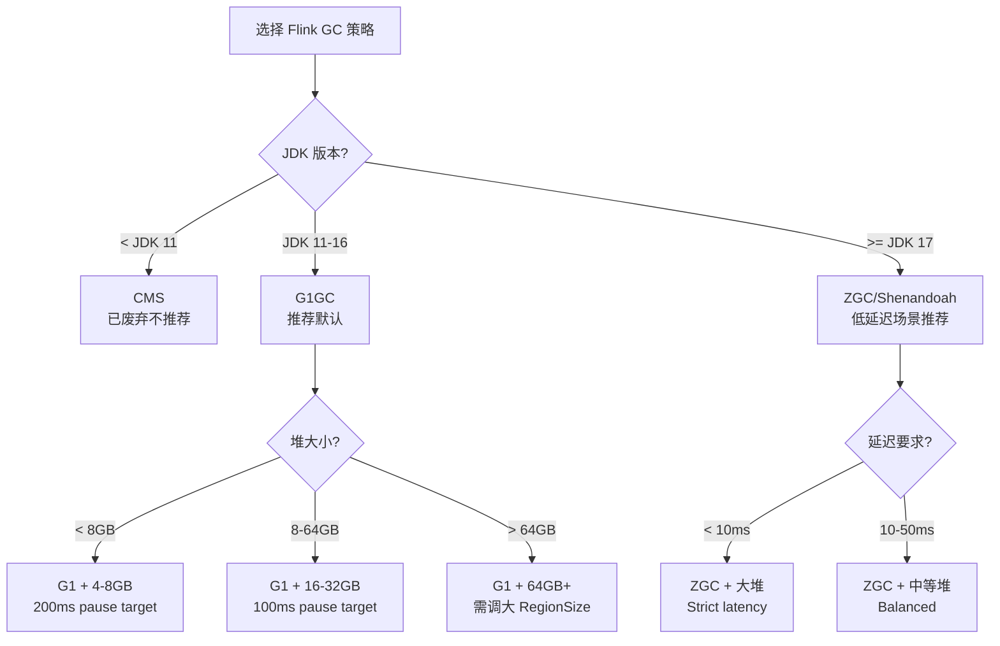
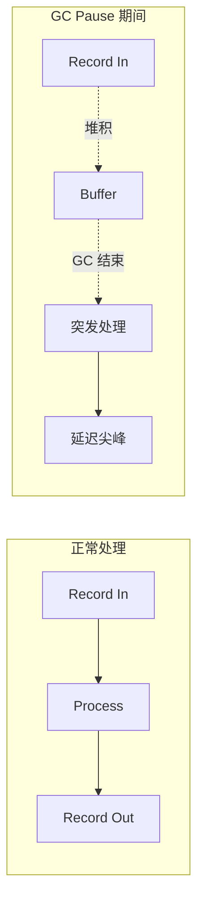

# Flink JVM GC 调优指南

> **所属阶段**: Flink/09-practices/ | **前置依赖**: [Flink 性能调优方法论](./flink-performance-tuning-methodology.md) | **形式化等级**: L4

---

## 1. 概念定义 (Definitions)

**Def-F-GC-01: 垃圾回收停顿 (GC Pause)**
JVM 垃圾回收器在执行垃圾回收时，为了维护堆内存一致性而停止应用线程执行的时间段。对于 Flink 这类延迟敏感的流处理引擎，长时间的 GC Pause 会直接导致处理延迟激增和 Checkpoint 超时。

**Def-F-GC-02: G1 Garbage Collector**
G1（Garbage-First）是一种面向服务端应用的低延迟垃圾回收器，采用 Region-based 内存布局和增量回收策略，目标是将 GC Pause 控制在可配置的最大停顿时间（MaxGCPauseMillis）以内。

**Def-F-GC-03: Z Garbage Collector (ZGC)**
ZGC 是 JDK 11+ 引入的可扩展低延迟垃圾回收器，支持 TB 级堆内存和亚毫秒级（<10ms）GC Pause。Flink 2.0+ 在 JDK 17+ 环境下可实验性使用 ZGC。

---

## 2. 属性推导 (Properties)

**Lemma-F-GC-01: GC 频率与吞吐的负相关**
在其他条件不变时，GC 频率越高（即单位时间内 GC 次数越多），应用线程可用于执行 Flink 算子逻辑的时间片越少，有效吞吐越低。

**Lemma-F-GC-02: 堆内存大小与 GC 停顿的权衡**
增大堆内存可以减少 Full GC 频率，但会增加单次 GC 的扫描工作量。对于 G1，适度的堆内存（16GB-64GB）配合合理的 Region 大小通常能取得最优的停顿-吞吐平衡。

**Prop-F-GC-01: Off-Heap 内存可规避 Young GC 影响**
Flink 的 Managed Memory（用于 RocksDB、网络缓冲区等）分配在 JVM 堆外，不受 Young GC 直接扫描，因此将大量短命对象移出堆外或复用对象池可显著降低 Young GC 频率。

---

## 3. 关系建立 (Relations)

### 3.1 GC 选型决策矩阵



### 3.2 内存区域与 GC 影响

| 内存区域 | 用途 | GC 影响 |
|---------|------|---------|
| JVM Heap (Young) | 用户对象、临时状态 | Young GC 频繁扫描 |
| JVM Heap (Old) | 长生命周期对象、缓存 | G1 Mixed/Full GC 扫描 |
| Managed Memory | RocksDB、网络缓冲区、排序 | 不受 GC 扫描 |
| Direct Memory | NIO ByteBuffer、JNI | 不受 GC 扫描 |
| JVM Metaspace | 类元数据 | 仅 Full GC / 并发回收 |

---

## 4. 论证过程 (Argumentation)

### 4.1 为什么 Flink 对 GC 敏感？

1. **延迟敏感**：流处理要求毫秒级到秒级延迟，一次 1 秒的 GC Pause 可能导致大量数据积压
2. **Checkpoint 耦合**：Checkpoint Barrier 的传播需要各 Task 线程协同，GC Pause 可能触发 Checkpoint 超时
3. **背压放大**：GC 期间算子暂停处理，上游数据在缓冲区堆积，恢复后容易形成脉冲式背压

### 4.2 GC 日志分析要点

使用 `-Xlog:gc*:file=gc.log` 收集日志后，关注以下指标：

- **GC 频率**：Young GC 每分钟 > 30 次通常意味着对象分配过频
- **GC 停顿时间**：P99 GC Pause 应 < 200ms（G1）或 < 10ms（ZGC）
- **堆回收效率**：每次 Young GC 回收后 Old Gen 增长趋势，预判 Full GC 风险

---

## 5. 形式证明 / 工程论证 (Proof / Engineering Argument)

### 5.1 G1 GC 调优的系统性方法

**定理 (Thm-F-GC-01)**: 对于 Flink 的 G1 GC 配置，存在一组参数 $(HeapSize, RegionSize, MaxGCPauseMillis)$ 使得在给定工作负载下，P99 处理延迟与 GC Pause 之和最小。

**工程论证**：

1. **基线测量**：在默认 G1 参数下运行典型负载，记录 GC Pause 分布和吞吐
2. **HeapSize 扫描**：固定其他参数，逐步调整 HeapSize（如 16GB → 32GB → 64GB），观察 GC 频率和停顿时间的变化曲线
3. **RegionSize 优化**：对于大堆（>32GB），将 `-XX:G1HeapRegionSize` 从默认 1MB 提升到 16MB 或 32MB，减少 Region 管理开销
4. **MaxGCPauseMillis 约束**：从 200ms 逐步收紧到 100ms，观察吞吐下降是否在可接受范围内
5. **收敛验证**：重复步骤 2-4，直到找到帕累托最优点

---

## 6. 实例验证 (Examples)

### 6.1 推荐 G1 GC 配置（32GB Heap）

```bash
# flink-conf.yaml 中通过 env.java.opts.taskmanager 传入 env.java.opts.taskmanager: >
  -XX:+UseG1GC
  -Xms32g -Xmx32g
  -XX:MaxGCPauseMillis=100
  -XX:G1HeapRegionSize=16m
  -XX:+UnlockExperimentalVMOptions
  -XX:+UseContainerSupport
  -Xlog:gc*:file=/opt/flink/log/gc.log:time,uptime:filecount=5,filesize=100m
```

### 6.2 ZGC 配置示例（JDK 17+，大堆低延迟场景）

```bash
env.java.opts.taskmanager: >
  -XX:+UseZGC
  -Xms64g -Xmx64g
  -XX:+ZGenerational
  -XX:ZCollectionInterval=5
  -Xlog:gc*:file=/opt/flink/log/gc.log:time,uptime:filecount=5,filesize=100m
```

### 6.3 GC 日志分析命令

```bash
# 使用 jvm-tools 或 gcviewer 分析 java -jar gcviewer.jar gc.log

# 关键输出指标
# Throughput:     > 95% 为优秀
# Avg Pause:      < 100ms 为优秀
# Max Pause:      < 500ms 为可接受
# Full GC Count:  0 为最佳
```

---

## 7. 可视化 (Visualizations)

### 7.1 GC 影响下的延迟波动模型



---

## 8. 引用参考 (References)
