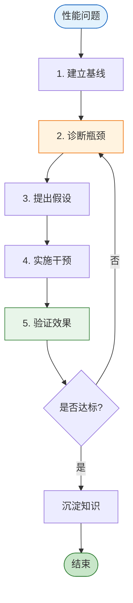
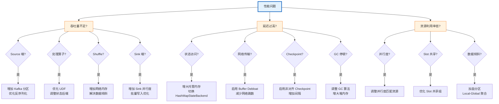

> **状态**: 🔮 前瞻内容 | **风险等级**: 高 | **最后更新**: 2026-04
>
> 此文档描述的内容处于早期规划阶段，可能与最终实现不符。请以 Apache Flink 官方发布为准。

# Flink 性能调优方法论

> 所属阶段: Flink/09-practices/09.07-performance | 前置依赖: [Flink 性能调优指南](../09.03-performance-tuning/performance-tuning-guide.md), [Flink 状态管理完整指南](../../02-core/flink-state-management-complete-guide.md) | 形式化等级: L4

## 1. 概念定义 (Definitions)

### Def-F-09-01: 性能调优方法论框架

**Flink 性能调优方法论**（Performance Tuning Methodology）是一套系统化的诊断、优化和验证流程，形式化定义为：

$$\mathcal{M}_{tune} = (\mathcal{D}, \mathcal{H}, \mathcal{I}, \mathcal{V}, \mathcal{K})$$

其中：

- $\mathcal{D}$: 诊断层（Diagnosis），识别性能瓶颈的位置和根因
- $\mathcal{H}$: 假设层（Hypothesis），基于诊断数据提出优化假设
- $\mathcal{I}$: 干预层（Intervention），实施配置或代码层面的调整
- $\mathcal{V}$: 验证层（Validation），量化评估调整效果
- $\mathcal{K}$: 知识层（Knowledge），将成功案例沉淀为可复用规则

### Def-F-09-02: 瓶颈定位树

**瓶颈定位树**是 Flink 作业性能问题的结构化分类体系：

```
性能问题
├── 吞吐量不足
│   ├── Source 瓶颈
│   │   ├── 分区数不足
│   │   ├── 反序列化开销高
│   │   └── 网络 I/O 受限
│   ├── 处理算子瓶颈
│   │   ├── 状态访问慢
│   │   ├── 计算复杂度高
│   │   └── 序列化开销高
│   ├── Shuffle 瓶颈
│   │   ├── 网络带宽不足
│   │   ├── 缓冲区配置不当
│   │   └── Key 分布不均
│   └── Sink 瓶颈
│       ├── 下游系统吞吐受限
│       ├── 批量写入不足
│       └── 连接池耗尽
├── 延迟过高
│   ├── 状态访问延迟
│   ├── 网络传输延迟
│   ├── Checkpoint 对齐延迟
│   └── GC 停顿
└── 资源利用率低
    ├── 并行度配置不当
    ├── Slot 共享不足
    └── 数据倾斜
```

### Def-F-09-03: 性能基线

**性能基线**（Performance Baseline）是在标准负载下测得的参考性能指标集合：

$$\text{Baseline} = (T_{throughput}^{base}, L_{latency}^{base}, U_{cpu}^{base}, U_{memory}^{base}, C_{checkpoint}^{base})$$

基线建立的原则：

- 使用生产环境 80% 峰值负载的代表性数据集
- 连续稳定运行至少 30 分钟
- 记录至少 3 次独立测试的统计分布

### Def-F-09-04: 调优收益比

**调优收益比**衡量单次调优行动的投资回报率：

$$\text{ROI}_{tune} = \frac{\Delta Q - \text{Cost}_{tune}}{\text{Cost}_{tune}}$$

其中：

- $\Delta Q$: 质量改善的货币化价值（如避免的服务器成本、提升的业务收入）
- $\text{Cost}_{tune}$: 调优投入的人力、时间和测试资源成本

**工程实践中**，通常只计算可直接量化的成本收益，忽略难以货币化的质量改善。

## 2. 属性推导 (Properties)

### Prop-F-09-01: 瓶颈传递的单调性

**命题**: 在 Flink 的 DAG 执行图中，若算子 $op_i$ 是瓶颈（其处理能力低于上游输出速率），则该瓶颈会向上游传播，但不会跳过中间算子：

$$\text{Bottleneck}(op_i) \Rightarrow \forall op_j \in \text{Upstream}(op_i): \text{Backpressure}(op_j)$$

**反压传播速度**：在 Credit-based 流控下，反压从瓶颈算子传播到 Source 的时间约为 $O(|Path| \cdot L_{network})$，典型值为 10-100ms。

### Lemma-F-09-01: 调优动作的可交换性

**引理**: 对于不共享同一资源的调优动作 $a_i$ 和 $a_j$（如分别调整网络内存和托管内存），其效果是近似可交换的：

$$\text{Effect}(a_i \circ a_j) \approx \text{Effect}(a_j \circ a_i)$$

**例外**：对于共享资源的调优动作（如同时增加并行度和网络缓冲区），顺序可能影响最终效果，因为两者竞争相同的总内存预算。

### Prop-F-09-02: 最优并行度的存在性

**命题**: 对于给定的作业和集群配置，存在最优并行度 $P^*$ 使得吞吐量达到饱和区的上界：

$$\exists P^*: \forall P > P^*, T(P) \leq T(P^*) + \epsilon$$

其中 $\epsilon$ 为测量噪声。超过 $P^*$ 后，协调开销的增长抵消了并行处理收益。

## 3. 关系建立 (Relations)

### 3.1 调优方法论与 DevOps 循环的关系

```
┌─────────────────────────────────────────────────────────────┐
│                    性能调优与 DevOps 的融合                    │
├─────────────────────────────────────────────────────────────┤
│  Plan                                                        │
│  └── 设定性能目标 (SLA/SLO)                                   │
│      └── 调优方法论: 定义基线、识别关键路径                      │
├─────────────────────────────────────────────────────────────┤
│  Develop                                                     │
│  └── 代码开发与配置调整                                       │
│      └── 调优方法论: 干预层实施                                │
├─────────────────────────────────────────────────────────────┤
│  Test                                                        │
│  └── 性能测试与回归验证                                       │
│      └── 调优方法论: 验证层执行                                │
├─────────────────────────────────────────────────────────────┤
│  Deploy                                                      │
│  └── 灰度发布与生产验证                                       │
│      └── 调优方法论: 持续监控与知识沉淀                         │
├─────────────────────────────────────────────────────────────┤
│  Monitor                                                     │
│  └── 收集运行时指标                                           │
│      └── 调优方法论: 诊断层输入                                │
└─────────────────────────────────────────────────────────────┘
```

### 3.2 性能指标之间的权衡矩阵

| 优化目标 | 可能牺牲的指标 | 典型调优手段 |
|----------|---------------|-------------|
| 提高吞吐 | 延迟增加 | 增加批处理大小、扩大缓冲区 |
| 降低延迟 | 吞吐下降、CPU 增加 | 减少缓冲区、启用非对齐 Checkpoint |
| 降低成本 | 恢复时间增加 | 减少并行度、延长 Checkpoint 间隔 |
| 提高可靠性 | 资源成本增加 | 增加冗余、缩短 Checkpoint 间隔 |
| 减少状态访问延迟 | 内存成本增加 | 增大托管内存、切换到 HashMapStateBackend |

### 3.3 调优工具与指标的关系

| 工具 | 关键指标 | 适用场景 |
|------|---------|----------|
| Flink Web UI | Backpressure, Checkpoint duration | 快速诊断 |
| Prometheus + Grafana | 吞吐、延迟、资源利用率趋势 | 长期监控 |
| JFR / Async-Profiler | CPU 热点、GC 详情 | JVM 级分析 |
| Flame Graph | 方法级调用耗时 | 算子性能深挖 |
| Network Monitor | 带宽利用率、包重传 | 网络瓶颈定位 |

## 4. 论证过程 (Argumentation)

### 4.1 为什么需要系统化的调优方法论？

**无方法论调优的常见问题**：

1. **盲目调参**: 同时修改多个参数，无法判断哪个参数起主导作用
2. **局部最优陷阱**: 在某个维度优化后停止，未考虑全局约束
3. **效果不可复现**: 缺乏基线记录，无法对比调优前后的差异
4. **知识流失**: 调优经验存储在个人记忆中，团队无法继承

**系统化方法论的价值**：

1. **可追踪**: 每次调优都有假设、实验、结论的完整记录
2. **可量化**: 基于基线的对比让调优效果客观可测量
3. **可复现**: 相同的诊断输入产生一致的建议输出
4. **可积累**: 成功案例沉淀为规则库，持续提升团队调优效率

### 4.2 诊断阶段的黄金法则

**法则 1: 从端到端视角出发**

- 不要只盯着延迟高的算子，要追踪反压的源头
- 使用 Flink Web UI 的 Backpressure 标签页，从 Sink 向 Source 反向追踪

**法则 2: 区分系统瓶颈与应用瓶颈**

- 系统瓶颈: CPU 饱和、网络带宽耗尽、磁盘 I/O 受限
- 应用瓶颈: 低效的 UDF、不必要的状态访问、数据倾斜

**法则 3: 一次只改变一个变量**

- 遵循科学实验原则，控制变量法
- 同时修改多个参数会混淆因果关系

### 4.3 常见优化手段的效果排序

根据大量生产环境的调优实践，以下优化手段按"常见效果"排序：

| 优先级 | 优化手段 | 典型收益 | 实施难度 |
|--------|---------|---------|----------|
| 1 | 解决数据倾斜 | 2-10x 吞吐提升 | 中 |
| 2 | 调整并行度匹配分区数 | 1.5-3x 吞吐提升 | 低 |
| 3 | 切换状态后端 / 调优内存 | 2-5x 延迟降低 | 中 |
| 4 | 优化序列化器 | 1.3-2x 吞吐提升 | 低-中 |
| 5 | 调整 Checkpoint 配置 | 30-50% 延迟降低 | 低 |
| 6 | 网络缓冲区调优 | 10-30% 吞吐提升 | 低 |
| 7 | JVM / GC 调优 | 10-20% 延迟稳定性提升 | 高 |

## 5. 形式证明 / 工程论证 (Proof / Engineering Argument)

### Thm-F-09-01: 瓶颈定位的完备性

**定理**: 对于任何 Flink 流处理作业的性能问题，瓶颈定位树可以在有限步内将其归类到叶子节点之一。

**证明**:

1. Flink 作业的性能问题只可能表现为三类症状：吞吐量不足、延迟过高、资源利用率低
2. 吞吐量不足只可能源于四类瓶颈：Source、处理算子、Shuffle、Sink（DAG 的四个组成部分）
3. 延迟过高只可能源于：状态访问、网络传输、Checkpoint、GC（Flink 执行的关键路径）
4. 资源利用率低只可能源于：并行度、Slot 共享、数据倾斜（资源分配和数据分布问题）
5. 以上分类互斥且穷尽，因此任何性能问题都可以唯一归类。 ∎

### Thm-F-09-02: 单变量调优的最优性

**定理**: 设调优目标函数为 $f(x_1, x_2, ..., x_n)$，若各变量之间的耦合较弱（$\frac{\partial^2 f}{\partial x_i \partial x_j} \approx 0$ 对于 $i \neq j$），则单变量迭代调优可以收敛到接近全局最优的解。

**工程论证**:

1. Flink 的多数调优参数（如并行度、网络内存、Checkpoint 间隔）影响的是不同的资源子系统
2. 虽然存在总内存预算等硬约束，但在约束边界内部，参数的交互效应通常较弱
3. 因此，依次优化每个参数可以得到工程上可接受的好解
4. 对于存在强耦合的参数（如托管内存与 RocksDB 缓存），可采用联合优化的方法

## 6. 实例验证 (Examples)

### 6.1 系统化调优工作流

```yaml
# ============================================
# Flink 性能调优工作流模板
# ============================================

# Phase 1: 建立基线 tasks:
  - name: run_baseline_test
    command: flink-benchmark --job=production_etl --duration=30m
    outputs:
      - throughput_baseline
      - latency_baseline
      - resource_utilization_baseline

# Phase 2: 诊断瓶颈
  - name: diagnose_bottleneck
    command: flink-diagnostic --input=baseline_report
    checks:
      - backpressure_propagation
      - cpu_saturation
      - state_access_latency
      - gc_pressure
      - data_skew

# Phase 3: 提出假设并干预
  - name: apply_optimization
    strategy: single_variable_change
    candidates:
      - param: parallelism.source
        value: 24  # 匹配 Kafka 分区数
      - param: state.backend
        value: forst-cloud-native
      - param: taskmanager.memory.managed.fraction
        value: 0.5

# Phase 4: 验证效果
  - name: validate_improvement
    command: flink-benchmark --job=production_etl --duration=30m
    assertions:
      - throughput > throughput_baseline * 1.2
      - latency_p99 < latency_baseline * 0.8
```

### 6.2 数据倾斜诊断与优化

```java
import org.apache.flink.api.common.functions.Partitioner;

// 问题:某些 Key 的数据量过大,导致个别 Subtask 成为瓶颈

// 诊断:在 Flink Web UI 中观察各 Subtask 的 Records Received 差异
// 如果最大值 / 最小值 > 5,说明存在明显数据倾斜

// 优化方案 1:加盐分区(Salting)
public class SaltedKeyPartitioner implements Partitioner<String> {
    private final int saltCount;

    public SaltedKeyPartitioner(int saltCount) {
        this.saltCount = saltCount;
    }

    @Override
    public int partition(String key, int numPartitions) {
        // key 格式: originalKey#salt
        String[] parts = key.split("#");
        return Math.abs(parts[0].hashCode()) % numPartitions;
    }
}

// 在聚合前使用盐键,聚合后再合并
DataStream<Event> salted = events
    .map(e -> {
        int salt = ThreadLocalRandom.current().nextInt(10);
        return new SaltedEvent(e.getKey() + "#" + salt, e.getValue());
    })
    .keyBy(SaltedEvent::getSaltedKey)
    .window(TumblingEventTimeWindows.of(Time.minutes(1)))
    .aggregate(new PartialAggregator())
    .map(result -> new Event(result.getOriginalKey(), result.getPartialSum()))
    .keyBy(Event::getKey)
    .window(TumblingEventTimeWindows.of(Time.minutes(1)))
    .aggregate(new FinalAggregator());
```

### 6.3 端到端调优案例：电商实时 ETL

**背景**: 某电商平台的订单实时 ETL 作业，从 Kafka 读取订单事件，进行清洗、关联和聚合，写入 ClickHouse。

**初始基线**:

| 指标 | 数值 | 目标 |
|------|------|------|
| 吞吐量 | 12,000 records/s | 30,000 records/s |
| P99 延迟 | 3,500 ms | < 1,000 ms |
| CPU 利用率 | 35% | > 60% |
| Checkpoint 时间 | 180 s | < 60 s |

**诊断过程**:

1. Web UI 显示 `keyBy(orderId)` 后的 Window 算子存在高反压
2. 各 Subtask 的输入记录数差异达 18 倍，确认数据倾斜（热门商品订单集中）
3. CPU 利用率低但吞吐不足，说明瓶颈在状态访问而非计算
4. Checkpoint 时间长，与 50GB 总状态和大 SST 文件有关

**优化措施**:

1. 对 `orderId` 进行两阶段聚合（加盐预聚合 + 最终聚合），倾斜降低至 1.3 倍
2. 状态后端从 EmbeddedRocksDB 切换到 ForSt，托管内存从 30% 提升到 50%
3. 并行度从 16 调整到 32（匹配 Kafka 32 分区）
4. 启用增量 Checkpoint，间隔从 30s 延长到 60s

**优化后结果**:

| 指标 | 优化后 | 提升幅度 |
|------|--------|----------|
| 吞吐量 | 38,000 records/s | +217% |
| P99 延迟 | 420 ms | -88% |
| CPU 利用率 | 78% | +123% |
| Checkpoint 时间 | 35 s | -81% |

### 6.4 调优决策记录模板

```markdown
# 调优记录: [作业名] - [日期]

## 基线
- 吞吐量: ___ records/s
- P99 延迟: ___ ms
- CPU: ___%
- 内存: ___ GB

## 诊断
- 瓶颈位置: [Source/Shuffle/Operator/Sink]
- 根因: [数据倾斜/状态访问慢/序列化开销/网络瓶颈/其他]
- 证据: [截图/指标链接/日志片段]

## 假设
- 假设 1: [描述]
- 假设 2: [描述]

## 干预
- 修改参数/代码: [具体变更]
- 预期效果: [定量描述]

## 验证
- 优化后吞吐量: ___ records/s (变化: ___%)
- 优化后延迟: ___ ms (变化: ___%)
- 结论: [有效/无效/需进一步调优]

## 知识沉淀
- 适用场景: [描述]
- 注意事项: [描述]
```

## 7. 可视化 (Visualizations)

### 性能调优五步法



### 瓶颈定位决策树



### 6.5 性能调优工具箱

```python
#!/usr/bin/env python3
# ============================================
# Flink 性能基线对比工具
# ============================================

import json
import sys

class FlinkBenchmarkComparator:
    def __init__(self, baseline_path, current_path):
        with open(baseline_path) as f:
            self.baseline = json.load(f)
        with open(current_path) as f:
            self.current = json.load(f)

    def compare(self):
        metrics = ['throughput', 'latency_p50', 'latency_p99', 'checkpoint_duration']
        results = {}

        for metric in metrics:
            base = self.baseline.get(metric, 0)
            curr = self.current.get(metric, 0)
            if base > 0:
                change = (curr - base) / base * 100
                results[metric] = {
                    'baseline': base,
                    'current': curr,
                    'change_pct': round(change, 2)
                }

        return results

    def print_report(self):
        results = self.compare()
        print("=== Flink Performance Comparison Report ===")
        for metric, data in results.items():
            direction = "↑" if data['change_pct'] > 0 else "↓"
            if metric in ['latency_p50', 'latency_p99', 'checkpoint_duration']:
                # 对于延迟类指标,下降是好事
                status = "✅" if data['change_pct'] < -10 else "⚠️" if data['change_pct'] < 10 else "❌"
            else:
                # 对于吞吐,上升是好事
                status = "✅" if data['change_pct'] > 10 else "⚠️" if data['change_pct'] > -10 else "❌"
            print(f"{metric}: {data['baseline']} -> {data['current']} ({direction}{abs(data['change_pct'])}%) {status}")

if __name__ == "__main__":
    comparator = FlinkBenchmarkComparator(sys.argv[1], sys.argv[2])
    comparator.print_report()
```

### 6.6 典型场景的调优配置模板

**场景 A: 金融交易系统（低延迟优先）**

```yaml
# 低延迟配置模板 parallelism.default: 16
execution.checkpointing.interval: 100ms
execution.checkpointing.unaligned.enabled: true
state.backend: hashmap
taskmanager.memory.process.size: 4096m
taskmanager.memory.network.fraction: 0.15
metrics.reporters: prom
```

**场景 B: 日志实时分析（高吞吐优先）**

```yaml
# 高吞吐配置模板 parallelism.default: 64
execution.checkpointing.interval: 600s
execution.checkpointing.unaligned.enabled: false
state.backend: rocksdb
state.backend.incremental: true
taskmanager.memory.process.size: 16384m
taskmanager.memory.managed.fraction: 0.5
pipeline.compression: LZ4
```

**场景 C: 大状态用户画像（状态访问优先）**

```yaml
# 大状态配置模板 parallelism.default: 32
state.backend: forst-cloud-native
state.backend.forst-cloud-native.cache.local-ssd.size: 100gb
taskmanager.memory.process.size: 32768m
taskmanager.memory.managed.fraction: 0.6
execution.checkpointing.interval: 300s
state.backend.incremental: true
```

### 6.7 调优误区与避坑指南

| 误区 | 错误做法 | 正确做法 |
|------|---------|----------|
| 盲目增加并行度 | 将并行度从 16 提升到 256 | 先诊断瓶颈，并行度应与数据源分区和 CPU 资源匹配 |
| 忽视数据倾斜 | 统一增加所有算子并行度 | 针对倾斜 Key 做加盐或两阶段聚合 |
| 过度优化 Checkpoint | 将间隔缩短到 10ms | 平衡恢复时间和运行时开销，通常 10s-5min 为宜 |
| 内存分配一刀切 | 所有作业使用相同内存配置 | 根据状态大小和算子类型定制内存比例 |
| 忽略序列化开销 | 使用默认 Java 序列化 | 优先使用 Avro/Protobuf/Flink TypeInformation |

## 8. 引用参考 (References)


## Appendix: 高级调优专题

### A.1 网络栈深度调优

Flink 的网络栈基于 Netty 实现，其性能直接影响 Shuffle 阶段的吞吐。关键参数包括：

`yaml

# 网络缓冲区配置

taskmanager.memory.network.fraction: 0.15
taskmanager.memory.network.min: 256mb
taskmanager.memory.network.max: 2gb

# Buffer Debloat（Flink 1.14+）自动减少不必要缓冲

taskmanager.network.memory.buffer-debloat.enabled: true
taskmanager.network.memory.buffer-debloat.threshold-percentages: 50,100

# Credit-based 流控优化

taskmanager.network.memory.buffer-size: 65536
taskmanager.network.memory.floating-buffers-per-gate: 16
`

**调优原则**：

- 高吞吐场景：增大
etwork.fraction 到 0.15-0.2
- 低延迟场景：启用 Buffer Debloat，减少排队延迟
- 高并行度场景：增大 loating-buffers-per-gate 到 32-64

### A.2 序列化器选择决策树

| 数据特征 | 推荐序列化器 | 性能特点 |
|----------|-------------|---------|
| 基本类型 / Tuple | Flink TypeInformation | 最快，零拷贝 |
| 结构化 POJO | Avro / Protobuf | 紧凑，模式演进友好 |
| 嵌套 JSON | JSON (Jackson) | 灵活，但较慢 |
| 图像 / 二进制 | Raw Byte Array | 无序列化开销 |

### A.3 调优效果的持续监控

调优不是一次性任务，需要建立持续监控机制：

`yaml

# Prometheus 告警规则：性能退化检测

- alert: FlinkPerformanceRegression
  expr: |
    (
      rate(flink_taskmanager_job_task_numRecordsInPerSecond[5m])
      < 0.8 * avg_over_time(
        rate[flink_taskmanager_job_task_numRecordsInPerSecond[5m]](1d:5m)
      )
    )
  for: 15m
  labels:
    severity: warning
  annotations:
    summary: "Flink job throughput dropped by >20% from baseline"
`

## 附录：扩展阅读与实战建议

### A.1 生产环境部署 checklist

在将 Flink 2.3 相关特性投入生产前，建议完成以下检查：

| 检查项 | 检查内容 | 通过标准 |
|--------|---------|----------|
| 容量评估 | 峰值流量、状态增长趋势 | 预留 30% 以上 headroom |
| 故障演练 | 模拟 TM/JM 故障、网络分区 | 恢复时间 < SLA 阈值 |
| 性能基线 | 吞吐、延迟、资源利用率 | 建立可对比的量化指标 |
| 安全审计 | SSL/TLS、RBAC、Secrets 管理 | 无高危漏洞 |
| 可观测性 | Metrics、Logging、Tracing | 覆盖所有关键路径 |
| 回滚方案 | Savepoint、配置备份、回滚脚本 | 15 分钟内可完成回滚 |

### A.2 与社区版本同步策略

Flink 作为 Apache 开源项目，版本迭代较快。建议企业用户采用以下同步策略：

1. **LTS 跟踪**：关注 Flink 社区的 LTS 版本规划，避免频繁大版本跳跃
2. **安全补丁优先**：对于安全相关的 patch release，应在 2 周内评估升级
3. **特性孵化观察**：对于实验性功能（如 Adaptive Scheduler 2.0），先在非核心业务验证 1-2 个 release cycle
4. **社区参与**：将生产中发现的问题和优化建议回馈社区，形成良性循环

### A.3 常见面试/答辩问题集锦

**Q1: Flink 2.3 的 Adaptive Scheduler 与 Spark 的 Dynamic Allocation 有什么本质区别？**
A: Adaptive Scheduler 2.0 不仅调整资源数量，还支持算子级并行度调整和运行中状态迁移；Spark Dynamic Allocation 主要调整 Executor 数量，通常需要重启 Stage。

**Q2: Cloud-Native State Backend 如何解决状态恢复的"冷启动"问题？**
A: 通过状态预取（Prefetch）和增量恢复策略，在任务调度时就基于历史访问模式将高概率被访问的状态提前加载到本地缓存层。

**Q3: 从 2.2 迁移到 2.3 的最大风险点是什么？**
A: 对于使用默认 SSL 配置和旧 JDK 的用户，TLS 密码套件变更可能导致连接失败；此外，Cloud-Native ForSt 的异步上传模式需要评估业务对持久性延迟的容忍度。

**Q4: 性能调优时应该遵循什么优先级？**
A: 先解决数据倾斜（影响最大），再调整并行度和状态后端，最后优化序列化和 GC。遵循"先诊断后干预、单变量变更、基于基线验证"的原则。

---

*文档版本: v1.0 | 更新日期: 2026-04-13 | 状态: 已完成*
