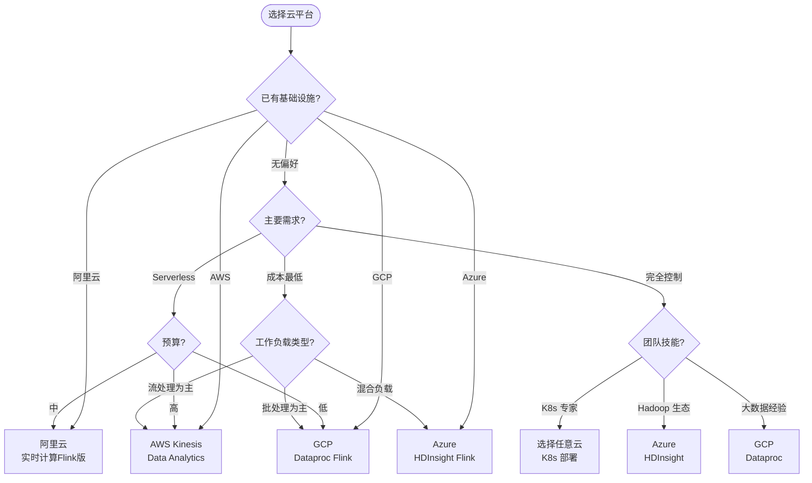
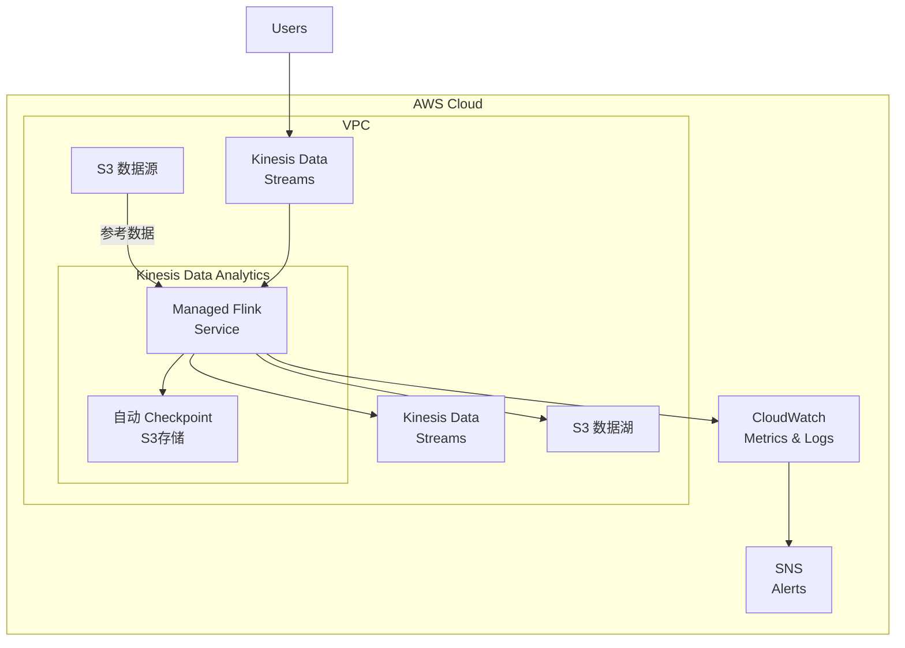
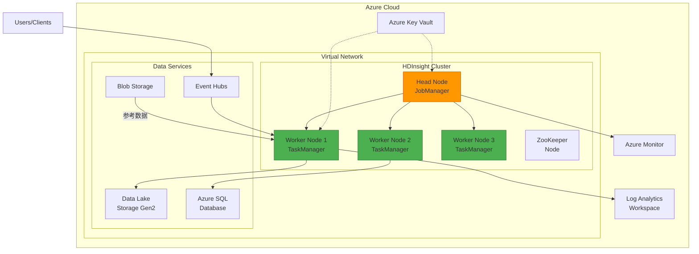
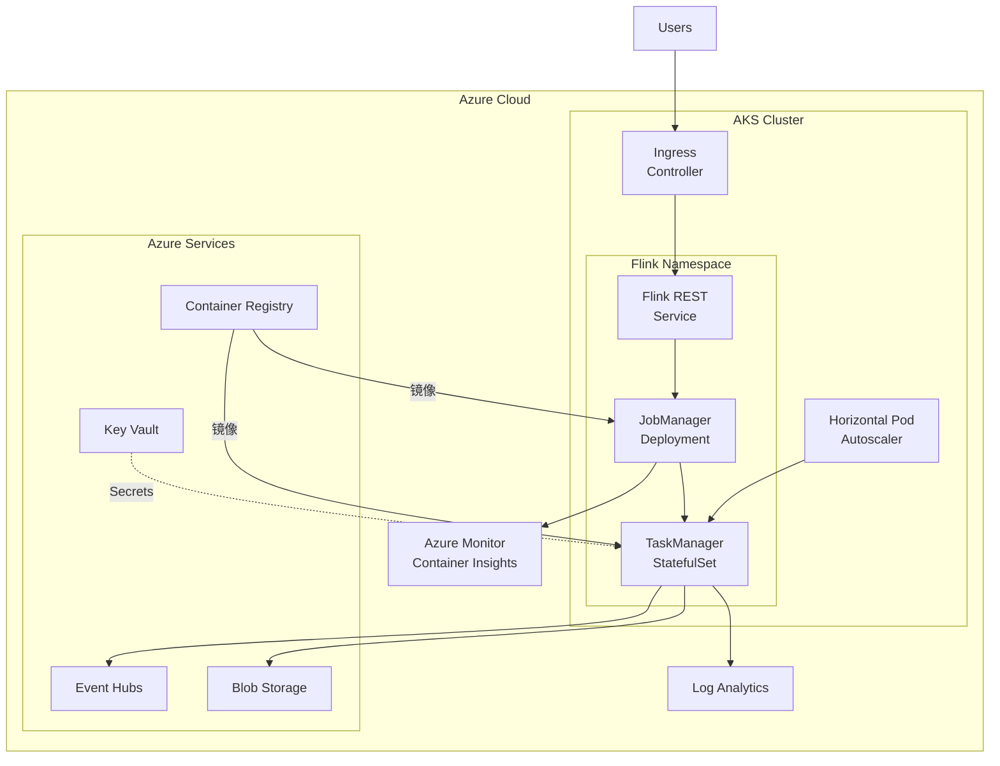
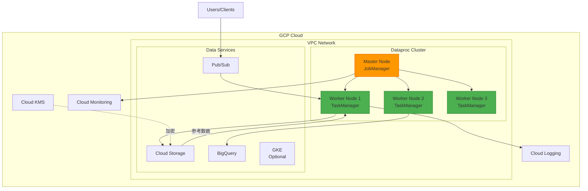
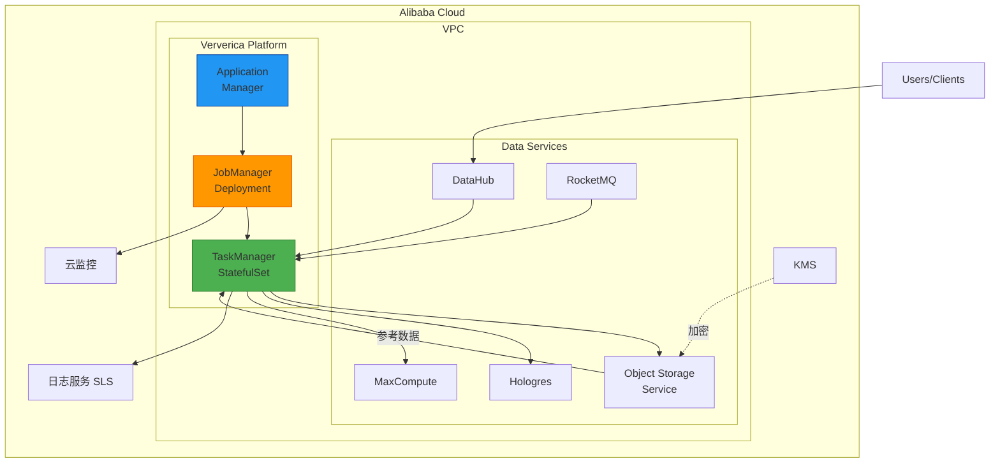
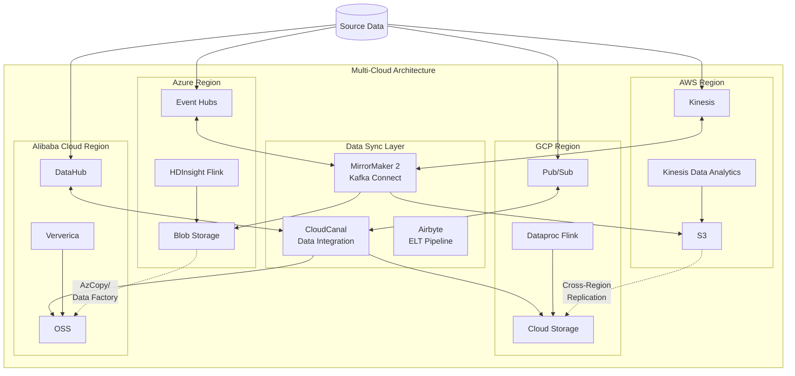
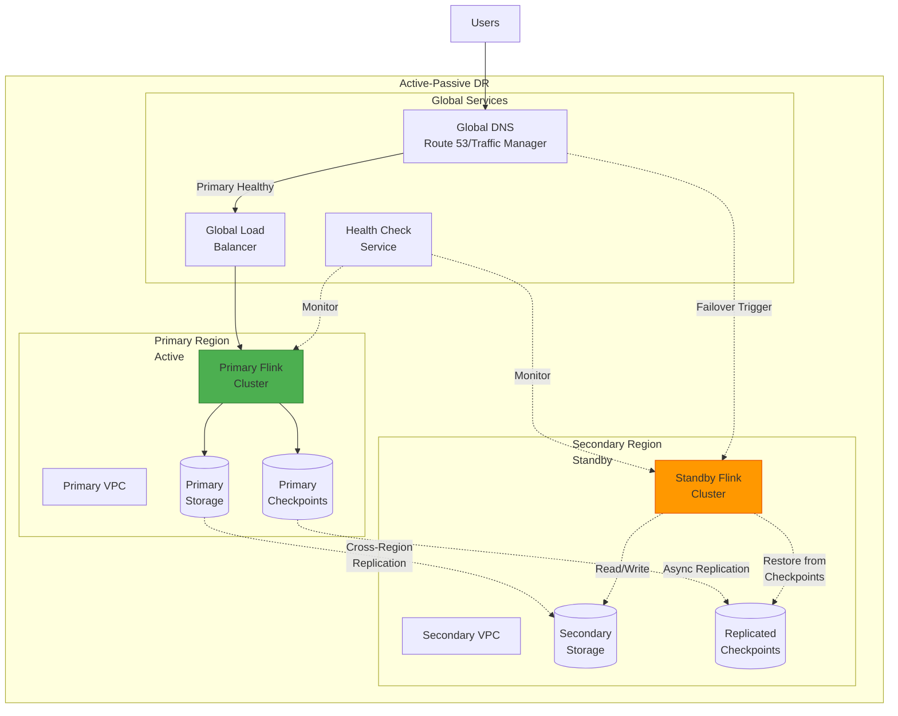
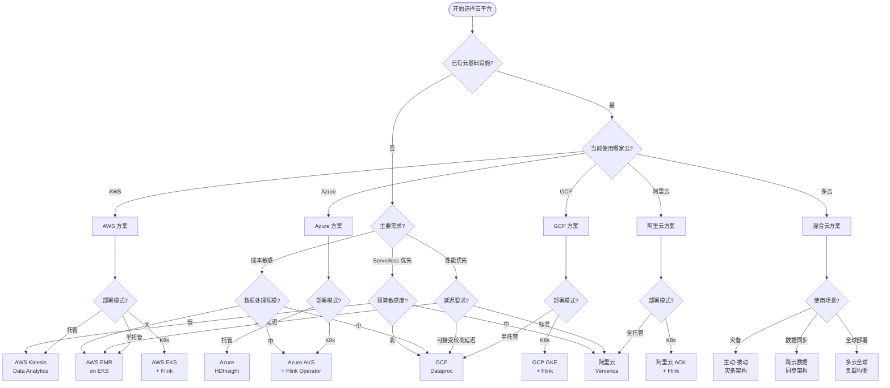
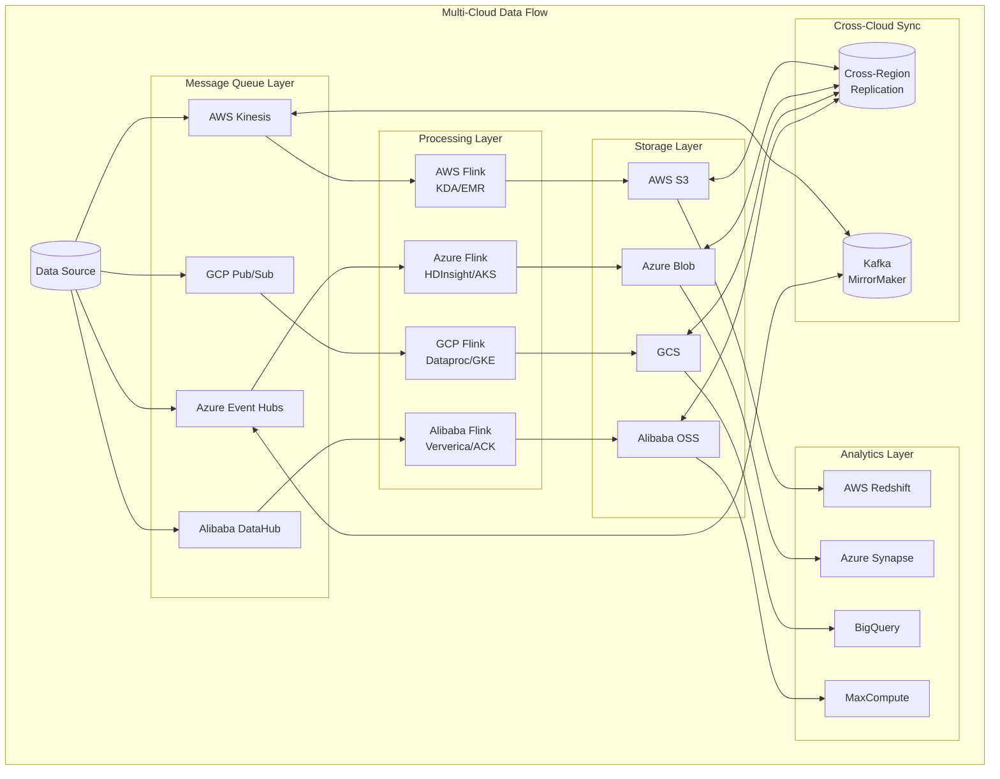

# Flink 多云部署模板

> **所属阶段**: Flink/ | **前置依赖**: [Flink Kubernetes部署指南](./kubernetes-deployment.md), [Flink 集群架构](../01-architecture/deployment-architectures.md) | **形式化等级**: L3
>
> **标签**: #Multi-Cloud #AWS #Azure #GCP #AlibabaCloud #Terraform #Bicep #DeploymentManager #ROS #EMR #HDInsight #Dataproc

---

## 目录

- [Flink 多云部署模板](#flink-多云部署模板)
  - [目录](#目录)
  - [1. 概念定义 (Definitions)](#1-概念定义-definitions)
    - [Def-F-10-01: 多云部署 (Multi-Cloud Deployment)](#def-f-10-01-多云部署-multi-cloud-deployment)
    - [Def-F-10-02: 基础设施即代码 (IaC)](#def-f-10-02-基础设施即代码-iac)
    - [Def-F-10-03: 托管 Flink 服务 (Managed Flink Service)](#def-f-10-03-托管-flink-服务-managed-flink-service)
  - [2. 属性推导 (Properties)](#2-属性推导-properties)
    - [Prop-F-10-01: 云服务商功能对比](#prop-f-10-01-云服务商功能对比)
    - [Prop-F-10-02: 成本模型差异](#prop-f-10-02-成本模型差异)
    - [Prop-F-10-03: 部署复杂度层级](#prop-f-10-03-部署复杂度层级)
  - [3. 关系建立 (Relations)](#3-关系建立-relations)
    - [多云部署架构关系](#多云部署架构关系)
    - [跨云服务映射](#跨云服务映射)
  - [4. 论证过程 (Argumentation)](#4-论证过程-argumentation)
    - [4.1 云选择决策树](#41-云选择决策树)
    - [4.2 部署模式对比分析](#42-部署模式对比分析)
  - [5. 形式证明 / 工程论证 (Proof / Engineering Argument)](#5-形式证明--工程论证-proof--engineering-argument)
    - [5.1 跨云一致性保证](#51-跨云一致性保证)
    - [5.2 成本优化策略](#52-成本优化策略)
  - [6. 实例验证 (Examples)](#6-实例验证-examples)
    - [6.1 AWS 部署](#61-aws-部署)
      - [6.1.1 EMR on EKS Flink 部署](#611-emr-on-eks-flink-部署)
      - [6.1.2 Kinesis Data Analytics (完全托管)](#612-kinesis-data-analytics-完全托管)
    - [6.2 Azure 部署](#62-azure-部署)
      - [6.2.1 HDInsight Flink 部署](#621-hdinsight-flink-部署)
      - [6.2.2 AKS (Azure Kubernetes Service) 部署](#622-aks-azure-kubernetes-service-部署)
    - [6.3 GCP 部署](#63-gcp-部署)
      - [6.3.1 Dataproc Flink 部署](#631-dataproc-flink-部署)

---

## 1. 概念定义 (Definitions)

### Def-F-10-01: 多云部署 (Multi-Cloud Deployment)

**定义**: 多云部署是指将 Apache Flink 应用程序部署到两个或多个云服务商的基础设施上，以实现以下目标：

1. **供应商独立性**: 避免对单一云服务商的依赖
2. **地理覆盖**: 利用不同云服务商的数据中心位置
3. **成本优化**: 根据价格差异选择最优部署方案
4. **灾备恢复**: 跨云实现高可用性
5. **合规要求**: 满足数据主权和监管要求

$$\text{MultiCloud} = \{(C_i, D_i, S_i) \mid i \in \{AWS, Azure, GCP, Aliyun\}\}$$

其中 $C_i$ 表示云服务商，$D_i$ 表示部署配置，$S_i$ 表示服务组件。

### Def-F-10-02: 基础设施即代码 (IaC)

**定义**: 基础设施即代码是一种使用声明式配置文件来管理云基础设施的方法，确保部署的可重复性和版本控制。

$$\text{IaC} = \langle \text{Template}, \text{Variables}, \text{State}, \text{Provider} \rangle$$

| 云服务商 | IaC 工具 | 模板格式 |
|---------|---------|---------|
| AWS | Terraform, CloudFormation | HCL, JSON/YAML |
| Azure | Bicep, Terraform | Bicep, HCL |
| GCP | Deployment Manager, Terraform | YAML, HCL |
| 阿里云 | ROS, Terraform | JSON/YAML, HCL |

### Def-F-10-03: 托管 Flink 服务 (Managed Flink Service)

**定义**: 托管 Flink 服务是由云服务商提供、完全托管的 Apache Flink 运行环境，用户无需管理底层基础设施。

| 云服务商 | 服务名称 | 部署模式 | 自动扩缩容 |
|---------|---------|---------|-----------|
| AWS | Kinesis Data Analytics | Serverless | 是 |
| Azure | HDInsight Flink | PaaS | 部分 |
| GCP | Dataproc Flink | IaaS/PaaS | 是 |
| 阿里云 | 实时计算Flink版 | Serverless | 是 |

---

## 2. 属性推导 (Properties)

### Prop-F-10-01: 云服务商功能对比

**命题**: 不同云服务商的托管 Flink 服务在功能上存在差异，需根据业务需求选择。

| 特性 | AWS KDA | Azure HDInsight | GCP Dataproc | 阿里云 Flink |
|-----|---------|-----------------|--------------|--------------|
| Flink 版本 | 1.19+ | 1.17+ | 1.18+ | 1.17/1.19+ |
| SQL 支持 | ✅ 完整 | ✅ 完整 | ✅ 完整 | ✅ 完整 |
| DataStream API | ⚠️ 受限 | ✅ 完整 | ✅ 完整 | ✅ 完整 |
| Table API | ✅ 完整 | ✅ 完整 | ✅ 完整 | ✅ 完整 |
| Python API | ✅ | ✅ | ✅ | ✅ |
| 自定义连接器 | ⚠️ 受限 | ✅ | ✅ | ✅ |
| 自动 Checkpoint | ✅ | ✅ | ✅ | ✅ |
| Exactly-Once 语义 | ✅ | ✅ | ✅ | ✅ |
| VPC 集成 | ✅ | ✅ | ✅ | ✅ |
| Private Link | ✅ | ✅ | ✅ | ✅ |

### Prop-F-10-02: 成本模型差异

**命题**: 各云服务商的计费模型不同，需根据工作负载特征进行成本优化。

**AWS Kinesis Data Analytics**:

- 基于 Kinesis Processing Units (KPUs)
- $0.11/KPU/小时
- 存储: $0.10/GB/月

**Azure HDInsight Flink**:

- 基于虚拟机实例类型
- 计算: 按 VM 规格计费
- 存储: 标准存储费率

**GCP Dataproc**:

- 基于计算实例运行时间
- 计算: 按秒计费
- 额外 Dataproc 溢价: ~$0.01/vCPU/小时

**阿里云实时计算Flink版**:

- 基于计算单元 (CU)
- 包年包月或按量付费
- 约 ¥0.35/CU/小时 (按量)

### Prop-F-10-03: 部署复杂度层级

**命题**: 部署复杂度随定制化需求增加而增加。

```
复杂度层级:
L1 (最低): 托管服务 (KDA, 阿里云 Flink) → 零运维
L2: 半托管 (HDInsight, Dataproc) → 部分配置
L3: Kubernetes 部署 (EKS, AKS, GKE, ACK) → 完全控制
L4 (最高): 自建虚拟机 → 完全自定义
```

---

## 3. 关系建立 (Relations)

### 多云部署架构关系

各云平台的 Flink 部署在架构层面具有相似性：

```
┌─────────────────────────────────────────────────────────────┐
│                    多云 Flink 部署抽象                        │
├─────────────────────────────────────────────────────────────┤
│  数据源层 → 消息队列 → Flink 计算层 → 存储层 → 应用层         │
├─────────────────────────────────────────────────────────────┤
│  AWS     : Kinesis    → KDA/EMR  → S3      → Lambda/EC2    │
│  Azure   : Event Hubs → HDInsight → ADLS   → Functions     │
│  GCP     : Pub/Sub    → Dataproc  → GCS    → Cloud Run     │
│  Alibaba : DataHub    → Flink版   → OSS    → Function Compute│
└─────────────────────────────────────────────────────────────┘
```

### 跨云服务映射

| 功能组件 | AWS | Azure | GCP | 阿里云 |
|---------|-----|-------|-----|-------|
| 对象存储 | S3 | Blob Storage | Cloud Storage | OSS |
| 消息队列 | MSK/Kinesis | Event Hubs | Pub/Sub | DataHub/RocketMQ |
| NoSQL 数据库 | DynamoDB | Cosmos DB | Firestore/Datastore | TableStore/HBase |
| 数据仓库 | Redshift | Synapse | BigQuery | MaxCompute/Hologres |
| 日志监控 | CloudWatch | Monitor/Log Analytics | Cloud Monitoring | 云监控/SLS |
| 密钥管理 | KMS | Key Vault | Cloud KMS | KMS |

---

## 4. 论证过程 (Argumentation)

### 4.1 云选择决策树



### 4.2 部署模式对比分析

| 部署模式 | 适用场景 | 优点 | 缺点 |
|---------|---------|------|------|
| **完全托管** | 快速启动、小型团队 | 零运维、自动扩缩容 | 灵活性受限、供应商锁定 |
| **半托管** | 中等规模、需要一定控制 | 平衡控制和便利性 | 需要一定运维投入 |
| **Kubernetes** | 大规模、多租户 | 完全控制、可移植 | 运维复杂度高 |
| **虚拟机** | 特殊需求、遗留系统 | 最大灵活性 | 最高运维负担 |

---

## 5. 形式证明 / 工程论证 (Proof / Engineering Argument)

### 5.1 跨云一致性保证

**定理 (Thm-F-10-01)**: 使用相同的 Checkpoint 机制和状态后端配置，可以实现跨云 Flink 作业的状态一致性。

**证明概要**:

1. Checkpoint 是 Flink 的核心容错机制，与底层云平台无关
2. 使用兼容的对象存储（S3、Blob、GCS、OSS）作为 Checkpoint 存储
3. 通过统一的 State Backend 配置确保状态恢复一致性
4. 跨云迁移时，只需复制 Checkpoint 数据并更新存储 URI

### 5.2 成本优化策略

**策略 1: 按需选择实例类型**

- 开发/测试: 使用 Spot/Preemptible 实例降低成本 60-90%
- 生产: 使用 On-Demand/Standard 实例确保稳定性

**策略 2: 自动扩缩容**

- 基于 CPU、内存、输入速率设置自动扩缩容规则
- 非工作时间自动缩容到最小配置

**策略 3: 预留实例/承诺使用折扣**

- AWS: Savings Plans, Reserved Instances
- Azure: Reserved VM Instances, Azure Hybrid Benefit
- GCP: Committed Use Discounts
- 阿里云: 包年包月、抢占式实例

---

## 6. 实例验证 (Examples)

### 6.1 AWS 部署

#### 6.1.1 EMR on EKS Flink 部署

**架构图**:

```mermaid
graph TB
    subgraph "AWS Cloud"
        subgraph "VPC"
            subgraph "EKS Cluster"
                JM[JobManager<br/>Pod]
                TM1[TaskManager<br/>Pod 1]
                TM2[TaskManager<br/>Pod 2]
                TM3[TaskManager<br/>Pod 3]
            end

            subgraph "EMR"
                EMR[EMR Controller]
            end

            subgraph "Data Sources"
                Kinesis[Kinesis Data Streams]
                MSK[MSK Kafka]
                S3Input[S3 Input]
            end

            subgraph "Data Sinks"
                S3Output[S3 Output]
                Redshift[Redshift]
                OpenSearch[OpenSearch]
            end
        end

        CW[CloudWatch]
        IRSA[IAM Roles for<br/>Service Accounts]
    end

    Users[Users/Clients] --> Kinesis
    JM --> TM1
    JM --> TM2
    JM --> TM3
    Kinesis --> TM1
    MSK --> TM2
    S3Input --> TM3
    TM1 --> S3Output
    TM2 --> Redshift
    TM3 --> OpenSearch
    JM --> CW
    IRSA --> JM
    IRSA --> TM1
    IRSA --> TM2
    IRSA --> TM3

    style JM fill:#ff9800,stroke:#e65100
    style TM1 fill:#4caf50,stroke:#2e7d32
    style TM2 fill:#4caf50,stroke:#2e7d32
    style TM3 fill:#4caf50,stroke:#2e7d32
```

**Terraform 配置**:

```hcl
# main.tf - EMR on EKS Flink Deployment
terraform {
  required_providers {
    aws = {
      source  = "hashicorp/aws"
      version = "~> 5.0"
    }
    kubernetes = {
      source  = "hashicorp/kubernetes"
      version = "~> 2.23"
    }
  }
}

provider "aws" {
  region = var.aws_region
}

# VPC and Networking
module "vpc" {
  source  = "terraform-aws-modules/vpc/aws"
  version = "~> 5.0"

  name = "flink-vpc"
  cidr = "10.0.0.0/16"

  azs             = ["${var.aws_region}a", "${var.aws_region}b", "${var.aws_region}c"]
  private_subnets = ["10.0.1.0/24", "10.0.2.0/24", "10.0.3.0/24"]
  public_subnets  = ["10.0.101.0/24", "10.0.102.0/24", "10.0.103.0/24"]

  enable_nat_gateway = true
  single_nat_gateway = true
  enable_dns_hostnames = true

  tags = {
    Environment = var.environment
    Project     = "flink-multi-cloud"
  }
}

# EKS Cluster
module "eks" {
  source  = "terraform-aws-modules/eks/aws"
  version = "~> 19.0"

  cluster_name    = "flink-eks-cluster"
  cluster_version = "1.29"

  vpc_id     = module.vpc.vpc_id
  subnet_ids = module.vpc.private_subnets

  cluster_endpoint_public_access = true

  eks_managed_node_groups = {
    flink = {
      desired_size = 3
      min_size     = 2
      max_size     = 10

      instance_types = ["m6i.2xlarge"]
      capacity_type  = "ON_DEMAND"

      labels = {
        workload = "flink"
      }

      taints = [{
        key    = "dedicated"
        value  = "flink"
        effect = "NO_SCHEDULE"
      }]

      tags = {
        Environment = var.environment
      }
    }
  }

  # EMR on EKS requires specific IAM permissions
  enable_emr_on_eks = true

  tags = {
    Environment = var.environment
    Project     = "flink-multi-cloud"
  }
}

# EMR on EKS Virtual Cluster
resource "aws_emrcontainers_virtual_cluster" "flink" {
  name = "flink-virtual-cluster"

  container_provider {
    id   = module.eks.cluster_name
    type = "EKS"

    info {
      eks_info {
        namespace = "flink"
      }
    }
  }
}

# S3 Bucket for Flink Checkpoints and Savepoints
resource "aws_s3_bucket" "flink_storage" {
  bucket = "${var.project_name}-flink-storage-${var.aws_account_id}"
}

resource "aws_s3_bucket_versioning" "flink_storage" {
  bucket = aws_s3_bucket.flink_storage.id
  versioning_configuration {
    status = "Enabled"
  }
}

# IAM Role for Flink Jobs
resource "aws_iam_role" "flink_job_role" {
  name = "flink-job-execution-role"

  assume_role_policy = jsonencode({
    Version = "2012-10-17"
    Statement = [
      {
        Action = "sts:AssumeRoleWithWebIdentity"
        Effect = "Allow"
        Principal = {
          Federated = module.eks.oidc_provider_arn
        }
        Condition = {
          StringEquals = {
            "${module.eks.oidc_provider}:aud" = "sts.amazonaws.com"
            "${module.eks.oidc_provider}:sub" = "system:serviceaccount:flink:flink-job-sa"
          }
        }
      }
    ]
  })
}

resource "aws_iam_role_policy" "flink_job_policy" {
  name = "flink-job-policy"
  role = aws_iam_role.flink_job_role.id

  policy = jsonencode({
    Version = "2012-10-17"
    Statement = [
      {
        Effect = "Allow"
        Action = [
          "s3:GetObject",
          "s3:PutObject",
          "s3:DeleteObject",
          "s3:ListBucket"
        ]
        Resource = [
          aws_s3_bucket.flink_storage.arn,
          "${aws_s3_bucket.flink_storage.arn}/*"
        ]
      },
      {
        Effect = "Allow"
        Action = [
          "kinesis:DescribeStream",
          "kinesis:GetShardIterator",
          "kinesis:GetRecords",
          "kinesis:PutRecord",
          "kinesis:PutRecords",
          "kinesis:ListShards"
        ]
        Resource = "arn:aws:kinesis:${var.aws_region}:${var.aws_account_id}:stream/flink-*"
      },
      {
        Effect = "Allow"
        Action = [
          "kafka:DescribeCluster",
          "kafka:GetBootstrapBrokers",
          "kafka:DescribeClusterOperation"
        ]
        Resource = "arn:aws:kafka:${var.aws_region}:${var.aws_account_id}:cluster/*"
      },
      {
        Effect = "Allow"
        Action = [
          "cloudwatch:PutMetricData",
          "cloudwatch:PutMetricAlarm",
          "logs:CreateLogGroup",
          "logs:CreateLogStream",
          "logs:PutLogEvents"
        ]
        Resource = "*"
      }
    ]
  })
}

# Kinesis Data Streams
resource "aws_kinesis_stream" "flink_input" {
  name             = "flink-input-stream"
  shard_count      = 4
  retention_period = 24

  stream_mode_details {
    stream_mode = "PROVISIONED"
  }

  tags = {
    Environment = var.environment
  }
}

resource "aws_kinesis_stream" "flink_output" {
  name             = "flink-output-stream"
  shard_count      = 2
  retention_period = 24

  tags = {
    Environment = var.environment
  }
}

# MSK Kafka Cluster
resource "aws_msk_cluster" "flink_kafka" {
  cluster_name           = "flink-msk-cluster"
  kafka_version          = "3.6.0"
  number_of_broker_nodes = 3

  broker_node_group_info {
    instance_type = "kafka.m5.large"
    client_subnets = module.vpc.private_subnets
    security_groups = [aws_security_group.msk.id]

    storage_info {
      ebs_storage_info {
        volume_size = 100
      }
    }
  }

  encryption_info {
    encryption_at_rest_kms_key_arn = aws_kms_key.msk.arn
    encryption_in_transit {
      client_broker = "TLS"
      in_cluster    = true
    }
  }

  open_monitoring {
    prometheus {
      jmx_exporter {
        enabled_in_broker = true
      }
      node_exporter {
        enabled_in_broker = true
      }
    }
  }

  tags = {
    Environment = var.environment
  }
}

# Security Group for MSK
resource "aws_security_group" "msk" {
  name_prefix = "msk-"
  vpc_id      = module.vpc.vpc_id

  ingress {
    from_port   = 9094
    to_port     = 9094
    protocol    = "tcp"
    cidr_blocks = [module.vpc.vpc_cidr_block]
  }

  tags = {
    Name = "msk-security-group"
  }
}

# KMS Key for MSK
resource "aws_kms_key" "msk" {
  description = "MSK encryption key"
}

# CloudWatch Log Group for Flink
resource "aws_cloudwatch_log_group" "flink" {
  name              = "/aws/emr-flink/${var.environment}"
  retention_in_days = 7
}

# CloudWatch Dashboard
resource "aws_cloudwatch_dashboard" "flink" {
  dashboard_name = "Flink-EMR-EKS-Dashboard"

  dashboard_body = jsonencode({
    widgets = [
      {
        type   = "metric"
        x      = 0
        y      = 0
        width  = 12
        height = 6
        properties = {
          title  = "TaskManager CPU Utilization"
          region = var.aws_region
          metrics = [
            ["ContainerInsights", "pod_cpu_utilization", "ClusterName", module.eks.cluster_name, "Namespace", "flink", { stat = "Average" }]
          ]
          period = 60
        }
      },
      {
        type   = "metric"
        x      = 12
        y      = 0
        width  = 12
        height = 6
        properties = {
          title  = "TaskManager Memory Utilization"
          region = var.aws_region
          metrics = [
            ["ContainerInsights", "pod_memory_utilization", "ClusterName", module.eks.cluster_name, "Namespace", "flink", { stat = "Average" }]
          ]
          period = 60
        }
      },
      {
        type   = "metric"
        x      = 0
        y      = 6
        width  = 8
        height = 6
        properties = {
          title  = "Kinesis Incoming Records"
          region = var.aws_region
          metrics = [
            ["AWS/Kinesis", "IncomingRecords", "StreamName", aws_kinesis_stream.flink_input.name, { stat = "Sum" }]
          ]
          period = 60
        }
      },
      {
        type   = "metric"
        x      = 8
        y      = 6
        width  = 8
        height = 6
        properties = {
          title  = "Kinesis GetRecords Latency"
          region = var.aws_region
          metrics = [
            ["AWS/Kinesis", "GetRecords.Latency", "StreamName", aws_kinesis_stream.flink_input.name, { stat = "Average" }]
          ]
          period = 60
        }
      },
      {
        type   = "log"
        x      = 16
        y      = 6
        width  = 8
        height = 6
        properties = {
          title  = "Flink JobManager Logs"
          region = var.aws_region
          query  = "SOURCE '/aws/emr-flink/${var.environment}' | fields @timestamp, @message | filter @message like /ERROR/ or @message like /WARN/ | sort @timestamp desc | limit 100"
        }
      }
    ]
  })
}

# CloudWatch Alarms
resource "aws_cloudwatch_metric_alarm" "high_cpu" {
  alarm_name          = "flink-high-cpu"
  comparison_operator = "GreaterThanThreshold"
  evaluation_periods  = "2"
  metric_name         = "pod_cpu_utilization"
  namespace           = "ContainerInsights"
  period              = "60"
  statistic           = "Average"
  threshold           = "80"
  alarm_description   = "This metric monitors Flink TaskManager CPU"
  alarm_actions       = [aws_sns_topic.flink_alerts.arn]

  dimensions = {
    ClusterName = module.eks.cluster_name
    Namespace   = "flink"
  }
}

resource "aws_cloudwatch_metric_alarm" "kinesis_iterator_age" {
  alarm_name          = "flink-kinesis-iterator-age"
  comparison_operator = "GreaterThanThreshold"
  evaluation_periods  = "1"
  metric_name         = "GetRecords.IteratorAgeMilliseconds"
  namespace           = "AWS/Kinesis"
  period              = "60"
  statistic           = "Average"
  threshold           = "30000"  # 30 seconds
  alarm_description   = "Kinesis iterator age is too high - potential lag"
  alarm_actions       = [aws_sns_topic.flink_alerts.arn]

  dimensions = {
    StreamName = aws_kinesis_stream.flink_input.name
  }
}

resource "aws_sns_topic" "flink_alerts" {
  name = "flink-alerts"
}
```

**变量定义 (variables.tf)**:

```hcl
variable "aws_region" {
  description = "AWS region"
  type        = string
  default     = "us-west-2"
}

variable "aws_account_id" {
  description = "AWS Account ID"
  type        = string
}

variable "environment" {
  description = "Environment name"
  type        = string
  default     = "production"
}

variable "project_name" {
  description = "Project name for resource naming"
  type        = string
  default     = "multicloud-flink"
}
```

**输出定义 (outputs.tf)**:

```hcl
output "eks_cluster_endpoint" {
  description = "EKS cluster endpoint"
  value       = module.eks.cluster_endpoint
}

output "eks_cluster_name" {
  description = "EKS cluster name"
  value       = module.eks.cluster_name
}

output "emr_virtual_cluster_id" {
  description = "EMR on EKS virtual cluster ID"
  value       = aws_emrcontainers_virtual_cluster.flink.id
}

output "s3_checkpoint_bucket" {
  description = "S3 bucket for Flink checkpoints"
  value       = aws_s3_bucket.flink_storage.bucket
}

output "kinesis_input_stream" {
  description = "Kinesis input stream name"
  value       = aws_kinesis_stream.flink_input.name
}

output "msk_bootstrap_brokers" {
  description = "MSK bootstrap brokers (TLS)"
  value       = aws_msk_cluster.flink_kafka.bootstrap_brokers_tls
  sensitive   = true
}

output "cloudwatch_dashboard" {
  description = "CloudWatch dashboard name"
  value       = aws_cloudwatch_dashboard.flink.dashboard_name
}
```

**部署命令**:

```bash
# 1. 初始化 Terraform
terraform init

# 2. 验证配置
terraform validate

# 3. 查看执行计划
terraform plan -var="aws_account_id=123456789012"

# 4. 应用配置
terraform apply -var="aws_account_id=123456789012" --auto-approve

# 5. 配置 kubectl
aws eks update-kubeconfig --region us-west-2 --name flink-eks-cluster

# 6. 创建 Flink 命名空间
kubectl create namespace flink

# 7. 创建 Service Account
kubectl create serviceaccount flink-job-sa -n flink

# 8. 提交 Flink 作业到 EMR on EKS
aws emr-containers start-job-run \
  --virtual-cluster-id $(terraform output -raw emr_virtual_cluster_id) \
  --name flink-streaming-job \
  --execution-role-arn $(terraform output -raw flink_job_role_arn) \
  --release-label emr-7.0.0-flink-latest \
  --job-driver '{
    "sparkSubmitJobDriver": {
      "entryPoint": "s3://your-bucket/flink-job.jar",
      "entryPointArguments": ["--checkpoint-dir", "s3://flink-checkpoints/"],
      "sparkSubmitParameters": "--class com.example.StreamingJob"
    }
  }' \
  --configuration-overrides '{
    "applicationConfiguration": [{
      "classification": "flink-conf",
      "properties": {
        "parallelism.default": "4",
        "taskmanager.memory.process.size": "4096m",
        "jobmanager.memory.process.size": "2048m"
      }
    }],
    "monitoringConfiguration": {
      "cloudWatchMonitoringConfiguration": {
        "logGroupName": "/aws/emr-flink/production",
        "logStreamNamePrefix": "flink-job"
      }
    }
  }'
```

---

#### 6.1.2 Kinesis Data Analytics (完全托管)

**架构图**:



**CloudFormation 模板**:

```yaml
# kinesis-data-analytics.yaml
AWSTemplateFormatVersion: '2010-09-09'
Description: 'Kinesis Data Analytics for Apache Flink'

Parameters:
  Environment:
    Type: String
    Default: production
    AllowedValues: [development, staging, production]

  FlinkVersion:
    Type: String
    Default: '1.19'
    AllowedValues: ['1.18', '1.19']

  Parallelism:
    Type: Number
    Default: 4
    MinValue: 1
    MaxValue: 64

  KPU:
    Type: Number
    Default: 2
    MinValue: 1
    MaxValue: 64

Resources:
  # S3 Bucket for Application Code and Checkpoints
  FlinkApplicationBucket:
    Type: AWS::S3::Bucket
    Properties:
      BucketName: !Sub '${AWS::StackName}-flink-${AWS::AccountId}'
      BucketEncryption:
        ServerSideEncryptionConfiguration:
          - ServerSideEncryptionByDefault:
              SSEAlgorithm: AES256
      LifecycleConfiguration:
        Rules:
          - Id: DeleteOldCheckpoints
            Status: Enabled
            ExpirationInDays: 30
            Prefix: checkpoints/
      Tags:
        - Key: Environment
          Value: !Ref Environment

  # Input Kinesis Stream
  InputStream:
    Type: AWS::Kinesis::Stream
    Properties:
      Name: !Sub '${AWS::StackName}-input'
      ShardCount: 4
      RetentionPeriodHours: 24
      StreamModeDetails:
        StreamMode: PROVISIONED
      Tags:
        - Key: Environment
          Value: !Ref Environment

  # Output Kinesis Stream
  OutputStream:
    Type: AWS::Kinesis::Stream
    Properties:
      Name: !Sub '${AWS::StackName}-output'
      ShardCount: 2
      RetentionPeriodHours: 24
      Tags:
        - Key: Environment
          Value: !Ref Environment

  # IAM Role for Kinesis Data Analytics
  FlinkApplicationRole:
    Type: AWS::IAM::Role
    Properties:
      RoleName: !Sub '${AWS::StackName}-flink-role'
      AssumeRolePolicyDocument:
        Version: '2012-10-17'
        Statement:
          - Effect: Allow
            Principal:
              Service: kinesisanalytics.amazonaws.com
            Action: sts:AssumeRole
      ManagedPolicyArns:
        - arn:aws:iam::aws:policy/CloudWatchFullAccess
      Policies:
        - PolicyName: FlinkApplicationPolicy
          PolicyDocument:
            Version: '2012-10-17'
            Statement:
              - Effect: Allow
                Action:
                  - s3:GetObject
                  - s3:PutObject
                  - s3:DeleteObject
                  - s3:ListBucket
                Resource:
                  - !GetAtt FlinkApplicationBucket.Arn
                  - !Sub '${FlinkApplicationBucket.Arn}/*'
              - Effect: Allow
                Action:
                  - kinesis:DescribeStream
                  - kinesis:GetShardIterator
                  - kinesis:GetRecords
                  - kinesis:PutRecord
                  - kinesis:PutRecords
                  - kinesis:ListShards
                Resource:
                  - !GetAtt InputStream.Arn
                  - !GetAtt OutputStream.Arn
              - Effect: Allow
                Action:
                  - logs:CreateLogGroup
                  - logs:CreateLogStream
                  - logs:PutLogEvents
                  - logs:DescribeLogGroups
                  - logs:DescribeLogStreams
                Resource: '*'
              - Effect: Allow
                Action:
                  - cloudwatch:PutMetricData
                  - cloudwatch:PutMetricAlarm
                Resource: '*'

  # CloudWatch Log Group
  FlinkLogGroup:
    Type: AWS::Logs::LogGroup
    Properties:
      LogGroupName: !Sub '/aws/kinesisanalytics/${AWS::StackName}'
      RetentionInDays: 7

  # Kinesis Data Analytics Application
  FlinkApplication:
    Type: AWS::KinesisAnalyticsV2::Application
    Properties:
      ApplicationName: !Sub '${AWS::StackName}-streaming-app'
      RuntimeEnvironment: !Sub 'FLINK-${FlinkVersion}'
      ServiceExecutionRole: !GetAtt FlinkApplicationRole.Arn
      ApplicationConfiguration:
        ApplicationCodeConfiguration:
          CodeContent:
            S3ContentLocation:
              BucketARN: !GetAtt FlinkApplicationBucket.Arn
              FileKey: flink-application.jar
          CodeContentType: ZIPFILE
        FlinkApplicationConfiguration:
          ParallelismConfiguration:
            Parallelism: !Ref Parallelism
            ParallelismPerKPU: 1
            AutoScalingEnabled: true
          MonitoringConfiguration:
            ConfigurationType: CUSTOM
            MetricsLevel: TASK
            LogLevel: INFO
          CheckpointConfiguration:
            ConfigurationType: DEFAULT
            CheckpointingEnabled: true
            CheckpointInterval: 60000
            MinPauseBetweenCheckpoints: 5000
        EnvironmentProperties:
          PropertyGroups:
            - PropertyGroupId: InputStreamConfig
              PropertyMap:
                stream.name: !Ref InputStream
                aws.region: !Ref AWS::Region
            - PropertyGroupId: OutputStreamConfig
              PropertyMap:
                stream.name: !Ref OutputStream
                aws.region: !Ref AWS::Region
            - PropertyGroupId: CheckpointConfig
              PropertyMap:
                s3.bucket: !Ref FlinkApplicationBucket
                s3.prefix: checkpoints

  # CloudWatch Alarm for High Iterator Age
  IteratorAgeAlarm:
    Type: AWS::CloudWatch::Alarm
    Properties:
      AlarmName: !Sub '${AWS::StackName}-iterator-age-high'
      AlarmDescription: 'Iterator age is too high - processing lag detected'
      MetricName: GetRecords.IteratorAgeMilliseconds
      Namespace: AWS/Kinesis
      Statistic: Average
      Period: 60
      EvaluationPeriods: 2
      Threshold: 30000
      ComparisonOperator: GreaterThanThreshold
      Dimensions:
        - Name: StreamName
          Value: !Ref InputStream
      AlarmActions:
        - !Ref AlertTopic

  # CloudWatch Alarm for Failed Records
  FailedRecordsAlarm:
    Type: AWS::CloudWatch::Alarm
    Properties:
      AlarmName: !Sub '${AWS::StackName}-failed-records'
      AlarmDescription: 'Failed to process records'
      MetricName: MillisBehindLatest
      Namespace: AWS/KinesisAnalytics
      Statistic: Average
      Period: 60
      EvaluationPeriods: 3
      Threshold: 1000
      ComparisonOperator: GreaterThanThreshold
      Dimensions:
        - Name: Application
          Value: !Ref FlinkApplication
      AlarmActions:
        - !Ref AlertTopic

  # SNS Topic for Alerts
  AlertTopic:
    Type: AWS::SNS::Topic
    Properties:
      TopicName: !Sub '${AWS::StackName}-alerts'

  # CloudWatch Dashboard
  FlinkDashboard:
    Type: AWS::CloudWatch::Dashboard
    Properties:
      DashboardName: !Sub '${AWS::StackName}-Flink-Dashboard'
      DashboardBody: !Sub |
        {
          "widgets": [
            {
              "type": "metric",
              "x": 0,
              "y": 0,
              "width": 12,
              "height": 6,
              "properties": {
                "title": "KPU Utilization",
                "region": "${AWS::Region}",
                "metrics": [
                  ["AWS/KinesisAnalytics", "KPUs", "Application", "${FlinkApplication}", { "stat": "Average" }]
                ],
                "period": 60
              }
            },
            {
              "type": "metric",
              "x": 12,
              "y": 0,
              "width": 12,
              "height": 6,
              "properties": {
                "title": "Millis Behind Latest",
                "region": "${AWS::Region}",
                "metrics": [
                  ["AWS/KinesisAnalytics", "MillisBehindLatest", "Application", "${FlinkApplication}", { "stat": "Average" }]
                ],
                "period": 60
              }
            },
            {
              "type": "metric",
              "x": 0,
              "y": 6,
              "width": 12,
              "height": 6,
              "properties": {
                "title": "Incoming Records (Input Stream)",
                "region": "${AWS::Region}",
                "metrics": [
                  ["AWS/Kinesis", "IncomingRecords", "StreamName", "${InputStream}", { "stat": "Sum" }]
                ],
                "period": 60
              }
            },
            {
              "type": "log",
              "x": 12,
              "y": 6,
              "width": 12,
              "height": 6,
              "properties": {
                "title": "Application Logs",
                "region": "${AWS::Region}",
                "query": "SOURCE '/aws/kinesisanalytics/${AWS::StackName}' | fields @timestamp, @message | sort @timestamp desc | limit 100"
              }
            }
          ]
        }

Outputs:
  ApplicationName:
    Description: Kinesis Data Analytics Application Name
    Value: !Ref FlinkApplication
    Export:
      Name: !Sub '${AWS::StackName}-AppName'

  InputStreamName:
    Description: Input Kinesis Stream Name
    Value: !Ref InputStream
    Export:
      Name: !Sub '${AWS::StackName}-InputStream'

  OutputStreamName:
    Description: Output Kinesis Stream Name
    Value: !Ref OutputStream
    Export:
      Name: !Sub '${AWS::StackName}-OutputStream'

  S3Bucket:
    Description: S3 Bucket for Application Code
    Value: !Ref FlinkApplicationBucket
    Export:
      Name: !Sub '${AWS::StackName}-S3Bucket'
```

**部署命令**:

```bash
# 1. 创建 CloudFormation Stack
aws cloudformation create-stack \
  --stack-name flink-kda-app \
  --template-body file://kinesis-data-analytics.yaml \
  --parameters \
    ParameterKey=Environment,ParameterValue=production \
    ParameterKey=FlinkVersion,ParameterValue=1.19 \
    ParameterKey=Parallelism,ParameterValue=4 \
    ParameterKey=KPU,ParameterValue=2 \
  --capabilities CAPABILITY_IAM CAPABILITY_AUTO_EXPAND

# 2. 等待 Stack 创建完成
aws cloudformation wait stack-create-complete --stack-name flink-kda-app

# 3. 上传 Flink 应用 JAR 到 S3
aws s3 cp flink-application.jar s3://$(aws cloudformation describe-stacks \
  --stack-name flink-kda-app \
  --query 'Stacks[0].Outputs[?OutputKey==`S3Bucket`].OutputValue' \
  --output text)/flink-application.jar

# 4. 启动应用
aws kinesisanalyticsv2 start-application \
  --application-name $(aws cloudformation describe-stacks \
    --stack-name flink-kda-app \
    --query 'Stacks[0].Outputs[?OutputKey==`ApplicationName`].OutputValue' \
    --output text) \
  --run-configuration "{\"FlinkRunConfiguration\": {\"AllowNonRestoredState\": false}}"

# 5. 查看应用状态
aws kinesisanalyticsv2 describe-application \
  --application-name $(aws cloudformation describe-stacks \
    --stack-name flink-kda-app \
    --query 'Stacks[0].Outputs[?OutputKey==`ApplicationName`].OutputValue' \
    --output text)

# 6. 发送测试数据到输入流
aws kinesis put-record \
  --stream-name $(aws cloudformation describe-stacks \
    --stack-name flink-kda-app \
    --query 'Stacks[0].Outputs[?OutputKey==`InputStreamName`].OutputValue' \
    --output text) \
  --partition-key user-123 \
  --data $(echo '{"user_id": "123", "event": "click", "timestamp": 1234567890}' | base64)
```

---

### 6.2 Azure 部署

#### 6.2.1 HDInsight Flink 部署

**架构图**:



**Bicep 模板**:

```bicep
// main.bicep - HDInsight Flink Deployment
@description('Azure region')
param location string = resourceGroup().location

@description('Environment name')
@allowed(['dev', 'staging', 'prod'])
param environment string = 'dev'

@description('HDInsight cluster name')
param clusterName string = 'flink-hdi-${uniqueString(resourceGroup().id)}'

@description('Flink version')
@allowed(['1.17', '1.18'])
param flinkVersion string = '1.17'

@description('Head node VM size')
@allowed(['Standard_D3_v2', 'Standard_D4_v2', 'Standard_D5_v2'])
param headNodeSize string = 'Standard_D4_v2'

@description('Worker node VM size')
@allowed(['Standard_D4_v2', 'Standard_D5_v2', 'Standard_D12_v2', 'Standard_D13_v2'])
param workerNodeSize string = 'Standard_D5_v2'

@description('Number of worker nodes')
@minValue(2)
@maxValue(50)
param workerNodeCount int = 3

@description('SSH public key for cluster access')
@secure()
param sshPublicKey string

@description('Admin username')
param adminUsername string = 'hdiadmin'

@description('Admin password')
@secure()
param adminPassword string

// Variables
var storageAccountName = 'flink${uniqueString(resourceGroup().id)}'
var eventHubNamespaceName = 'flink-eh-${uniqueString(resourceGroup().id)}'
var logAnalyticsName = 'flink-logs-${uniqueString(resourceGroup().id)}'
var keyVaultName = 'flink-kv-${uniqueString(resourceGroup().id)}'

// Storage Account for HDInsight
resource storageAccount 'Microsoft.Storage/storageAccounts@2023-01-01' = {
  name: storageAccountName
  location: location
  sku: {
    name: 'Standard_LRS'
  }
  kind: 'StorageV2'
  properties: {
    accessTier: 'Hot'
    supportsHttpsTrafficOnly: true
    minimumTlsVersion: 'TLS1_2'
    allowBlobPublicAccess: false
    networkAcls: {
      defaultAction: 'Deny'
      bypass: 'AzureServices'
    }
  }
}

// Blob Container for HDInsight
resource hdiBlobContainer 'Microsoft.Storage/storageAccounts/blobServices/containers@2023-01-01' = {
  name: '${storageAccountName}/default/hdicluster'
  dependsOn: [
    storageAccount
  ]
}

// Event Hubs Namespace
resource eventHubNamespace 'Microsoft.EventHub/namespaces@2024-01-01' = {
  name: eventHubNamespaceName
  location: location
  sku: {
    name: 'Standard'
    tier: 'Standard'
    capacity: 1
  }
  properties: {
    isAutoInflateEnabled: true
    maximumThroughputUnits: 10
    kafkaEnabled: true
  }
}

// Event Hub - Input
resource inputEventHub 'Microsoft.EventHub/namespaces/eventhubs@2024-01-01' = {
  parent: eventHubNamespace
  name: 'flink-input'
  properties: {
    partitionCount: 4
    messageRetentionInDays: 1
  }
}

// Event Hub - Output
resource outputEventHub 'Microsoft.EventHub/namespaces/eventhubs@2024-01-01' = {
  parent: eventHubNamespace
  name: 'flink-output'
  properties: {
    partitionCount: 2
    messageRetentionInDays: 1
  }
}

// Consumer Group for Flink
resource flinkConsumerGroup 'Microsoft.EventHub/namespaces/eventhubs/consumergroups@2024-01-01' = {
  parent: inputEventHub
  name: 'flink-consumer'
  properties: {}
}

// Log Analytics Workspace
resource logAnalytics 'Microsoft.OperationalInsights/workspaces@2023-09-01' = {
  name: logAnalyticsName
  location: location
  properties: {
    sku: {
      name: 'PerGB2018'
    }
    retentionInDays: 30
  }
}

// Key Vault
resource keyVault 'Microsoft.KeyVault/vaults@2023-07-01' = {
  name: keyVaultName
  location: location
  properties: {
    tenantId: subscription().tenantId
    sku: {
      family: 'A'
      name: 'standard'
    }
    accessPolicies: []
    enableRbacAuthorization: true
    enabledForTemplateDeployment: true
  }
}

// Virtual Network
resource vnet 'Microsoft.Network/virtualNetworks@2023-09-01' = {
  name: 'flink-vnet'
  location: location
  properties: {
    addressSpace: {
      addressPrefixes: ['10.0.0.0/16']
    }
    subnets: [
      {
        name: 'hdinsight-subnet'
        properties: {
          addressPrefix: '10.0.0.0/24'
          serviceEndpoints: [
            {
              service: 'Microsoft.Storage'
            }
            {
              service: 'Microsoft.EventHub'
            }
          ]
        }
      }
    ]
  }
}

// HDInsight Flink Cluster
resource hdInsightCluster 'Microsoft.HDInsight/clusters@2023-08-01-preview' = {
  name: clusterName
  location: location
  properties: {
    clusterVersion: '5.1'
    osType: 'Linux'
    tier: 'Standard'
    clusterDefinition: {
      kind: 'FLINK'
      configurations: {
        gateway: {
          restAuthCredential: {
            username: adminUsername
            password: adminPassword
          }
        }
        flink: {
          flinkVersion: flinkVersion
        }
      }
    }
    computeProfile: {
      roles: [
        {
          name: 'headnode'
          targetInstanceCount: 2
          hardwareProfile: {
            vmSize: headNodeSize
          }
          osProfile: {
            linuxOperatingSystemProfile: {
              username: adminUsername
              sshProfile: {
                publicKeys: [
                  {
                    certificateData: sshPublicKey
                  }
                ]
              }
            }
          }
        }
        {
          name: 'workernode'
          targetInstanceCount: workerNodeCount
          hardwareProfile: {
            vmSize: workerNodeSize
          }
          osProfile: {
            linuxOperatingSystemProfile: {
              username: adminUsername
              sshProfile: {
                publicKeys: [
                  {
                    certificateData: sshPublicKey
                  }
                ]
              }
            }
          }
        }
        {
          name: 'zookeepernode'
          targetInstanceCount: 3
          hardwareProfile: {
            vmSize: 'Standard_A2_v2'
          }
          osProfile: {
            linuxOperatingSystemProfile: {
              username: adminUsername
              sshProfile: {
                publicKeys: [
                  {
                    certificateData: sshPublicKey
                  }
                ]
              }
            }
          }
        }
      ]
    }
    storageProfile: {
      storageaccounts: [
        {
          name: replace('${storageAccountName}.blob.core.windows.net', '-', '')
          isDefault: true
          container: 'hdicluster'
          key: listKeys(storageAccount.id, '2023-01-01').keys[0].value
        }
      ]
    }
    networkProperties: {
      resourceProviderConnection: 'Outbound'
    }
  }
  dependsOn: [
    storageAccount
    vnet
  ]
}

// Diagnostic Settings for HDInsight
resource hdiDiagnostics 'Microsoft.Insights/diagnosticSettings@2021-05-01-preview' = {
  name: 'HDInsightDiagnostics'
  scope: hdInsightCluster
  properties: {
    workspaceId: logAnalytics.id
    logs: [
      {
        category: 'GatewayLogs'
        enabled: true
      }
      {
        category: 'GatewayRequestLogs'
        enabled: true
      }
    ]
    metrics: [
      {
        category: 'AllMetrics'
        enabled: true
      }
    ]
  }
}

// Azure Monitor Action Group
resource actionGroup 'Microsoft.Insights/actionGroups@2023-01-01' = {
  name: 'flink-alerts'
  location: 'global'
  properties: {
    groupShortName: 'FlinkAlerts'
    enabled: true
    emailReceivers: [
      {
        name: 'adminEmail'
        emailAddress: 'admin@example.com'
        useCommonAlertSchema: true
      }
    ]
  }
}

// Metric Alert - High CPU
resource cpuAlert 'Microsoft.Insights/metricAlerts@2018-03-01' = {
  name: 'flink-high-cpu'
  location: 'global'
  properties: {
    description: 'High CPU usage on Flink cluster'
    severity: 2
    enabled: true
    scopes: [
      hdInsightCluster.id
    ]
    evaluationFrequency: 'PT1M'
    windowSize: 'PT5M'
    criteria: {
      odataType: 'Microsoft.Azure.Monitor.SingleResourceMultipleMetricCriteria'
      allOf: [
        {
          name: 'CPU Usage'
          metricName: 'CoresUsed'
          operator: 'GreaterThan'
          threshold: 80
          timeAggregation: 'Average'
        }
      ]
    }
    actions: [
      {
        actionGroupId: actionGroup.id
      }
    ]
  }
}

// Metric Alert - Low Available Memory
resource memoryAlert 'Microsoft.Insights/metricAlerts@2018-03-01' = {
  name: 'flink-low-memory'
  location: 'global'
  properties: {
    description: 'Low available memory on Flink cluster'
    severity: 2
    enabled: true
    scopes: [
      hdInsightCluster.id
    ]
    evaluationFrequency: 'PT1M'
    windowSize: 'PT5M'
    criteria: {
      odataType: 'Microsoft.Azure.Monitor.SingleResourceMultipleMetricCriteria'
      allOf: [
        {
          name: 'Available Memory'
          metricName: 'MemoryAvailable'
          operator: 'LessThan'
          threshold: 2147483648  // 2GB
          timeAggregation: 'Average'
        }
      ]
    }
    actions: [
      {
        actionGroupId: actionGroup.id
      }
    ]
  }
}

// Outputs
output clusterName string = hdInsightCluster.name
output clusterUri string = hdInsightCluster.properties.clusterDefinition.kind == 'FLINK' ? 'https://${hdInsightCluster.name}.azurehdinsight.net' : ''
output storageAccountName string = storageAccount.name
output eventHubNamespace string = eventHubNamespace.name
output logAnalyticsWorkspaceId string = logAnalytics.id
output keyVaultName string = keyVault.name
output eventHubConnectionString string = listKeys(eventHubNamespace.id, '2024-01-01').primaryConnectionString
```

**参数文件 (parameters.json)**:

```json
{
  "$schema": "https://schema.management.azure.com/schemas/2019-04-01/deploymentParameters.json#",
  "contentVersion": "1.0.0.0",
  "parameters": {
    "environment": {
      "value": "prod"
    },
    "clusterName": {
      "value": "flink-hdi-prod"
    },
    "flinkVersion": {
      "value": "1.17"
    },
    "headNodeSize": {
      "value": "Standard_D4_v2"
    },
    "workerNodeSize": {
      "value": "Standard_D5_v2"
    },
    "workerNodeCount": {
      "value": 4
    },
    "sshPublicKey": {
      "value": "ssh-rsa AAAA..."
    },
    "adminUsername": {
      "value": "hdiadmin"
    },
    "adminPassword": {
      "value": "SecurePassword123!"
    }
  }
}
```

**部署命令**:

```bash
# 1. 登录 Azure
az login

# 2. 设置订阅
az account set --subscription "Your Subscription Name"

# 3. 创建资源组
az group create \
  --name flink-hdi-rg \
  --location eastus

# 4. 部署 Bicep 模板
az deployment group create \
  --resource-group flink-hdi-rg \
  --template-file main.bicep \
  --parameters @parameters.json

# 5. 获取 SSH 连接信息
az hdinsight show \
  --name flink-hdi-prod \
  --resource-group flink-hdi-rg \
  --query '{sshEndpoint:properties.connectivityProfile.sshEndpoint, user:properties.osProfile.linuxOperatingSystemProfile.username}'

# 6. SSH 连接到 Head Node
ssh hdiadmin@flink-hdi-prod-ssh.azurehdinsight.net

# 7. 提交 Flink 作业
flink run \
  --class com.example.StreamingJob \
  --parallelism 4 \
  /home/sshuser/flink-job.jar \
  --kafka.bootstrap.servers "${EVENTHUB_NAMESPACE}.servicebus.windows.net:9093" \
  --kafka.topic flink-input \
  --checkpoint.dir wasbs://hdicluster@${STORAGE_ACCOUNT}.blob.core.windows.net/checkpoints

# 8. 查看 Flink Web UI
# 在本地建立 SSH 隧道
ssh -L 8081:headnode0:8081 hdiadmin@flink-hdi-prod-ssh.azurehdinsight.net
# 然后访问 http://localhost:8081

# 9. 查看日志
az monitor log-analytics query \
  --workspace $(az deployment group show \
    --resource-group flink-hdi-rg \
    --name main \
    --query properties.outputs.logAnalyticsWorkspaceId.value \
    --output tsv) \
  --analytics-query "HDInsightGatewayLogs | where TimeGenerated > ago(1h) | limit 50"
```

---


#### 6.2.2 AKS (Azure Kubernetes Service) 部署

**架构图**:



**Bicep 模板 - AKS 部署**:

```bicep
// aks-flink.bicep - Flink on AKS
@description('Azure region')
param location string = resourceGroup().location

@description('AKS cluster name')
param clusterName string = 'flink-aks-${uniqueString(resourceGroup().id)}'

@description('Kubernetes version')
param kubernetesVersion string = '1.29'

@description('Node count')
@minValue(2)
@maxValue(50)
param nodeCount int = 3

@description('Node VM size')
param nodeVMSize string = 'Standard_D4s_v3'

@description('Enable auto-scaling')
param enableAutoScaling bool = true

@description('Min node count for auto-scaling')
param minNodeCount int = 2

@description('Max node count for auto-scaling')
param maxNodeCount int = 10

// Variables
var acrName = 'flink${uniqueString(resourceGroup().id)}'
var logAnalyticsName = 'flink-aks-logs-${uniqueString(resourceGroup().id)}'

// Log Analytics Workspace
resource logAnalytics 'Microsoft.OperationalInsights/workspaces@2023-09-01' = {
  name: logAnalyticsName
  location: location
  properties: {
    sku: {
      name: 'PerGB2018'
    }
    retentionInDays: 30
  }
}

// Container Registry
resource acr 'Microsoft.ContainerRegistry/registries@2023-11-01-preview' = {
  name: acrName
  location: location
  sku: {
    name: 'Standard'
  }
  properties: {
    adminUserEnabled: false
    policies: {
      trustPolicy: {
        status: 'disabled'
        type: 'Notary'
      }
      retentionPolicy: {
        status: 'enabled'
        days: 7
      }
    }
  }
}

// AKS Cluster
resource aks 'Microsoft.ContainerService/managedClusters@2024-02-01' = {
  name: clusterName
  location: location
  identity: {
    type: 'SystemAssigned'
  }
  properties: {
    kubernetesVersion: kubernetesVersion
    dnsPrefix: clusterName
    agentPoolProfiles: [
      {
        name: 'flinkpool'
        count: nodeCount
        vmSize: nodeVMSize
        osType: 'Linux'
        mode: 'System'
        enableAutoScaling: enableAutoScaling
        minCount: enableAutoScaling ? minNodeCount : null
        maxCount: enableAutoScaling ? maxNodeCount : null
        type: 'VirtualMachineScaleSets'
      }
    ]
    servicePrincipalProfile: {
      clientId: 'msi'
    }
    addonProfiles: {
      omsagent: {
        enabled: true
        config: {
          logAnalyticsWorkspaceResourceID: logAnalytics.id
        }
      }
      azureKeyvaultSecretsProvider: {
        enabled: true
        config: {
          enableSecretRotation: 'true'
        }
      }
    }
    networkProfile: {
      networkPlugin: 'azure'
      networkPolicy: 'azure'
      loadBalancerSku: 'standard'
    }
    securityProfile: {
      defender: {
        logAnalyticsWorkspaceResourceId: logAnalytics.id
        securityMonitoring: {
          enabled: true
        }
      }
    }
  }
}

// Role Assignment for AKS to pull from ACR
resource acrPullRole 'Microsoft.Authorization/roleAssignments@2022-04-01' = {
  name: guid(resourceGroup().id, aks.id, acr.id, 'acrpull')
  scope: acr
  properties: {
    principalId: aks.properties.identityProfile.kubeletidentity.objectId
    roleDefinitionId: subscriptionResourceId('Microsoft.Authorization/roleDefinitions', '7f951dda-4ed3-4680-a7ca-43fe172d538d')
    principalType: 'ServicePrincipal'
  }
}

// Event Hubs Namespace
resource eventHubNamespace 'Microsoft.EventHub/namespaces@2024-01-01' = {
  name: 'flink-aks-eh-${uniqueString(resourceGroup().id)}'
  location: location
  sku: {
    name: 'Standard'
    tier: 'Standard'
    capacity: 1
  }
  properties: {
    isAutoInflateEnabled: true
    maximumThroughputUnits: 10
  }
}

// Storage Account for Checkpoints
resource checkpointStorage 'Microsoft.Storage/storageAccounts@2023-01-01' = {
  name: 'flinkcp${uniqueString(resourceGroup().id)}'
  location: location
  sku: {
    name: 'Standard_LRS'
  }
  kind: 'StorageV2'
  properties: {
    accessTier: 'Hot'
    hierarchicalNamespaceEnabled: true
  }
}

// Key Vault for Secrets
resource keyVault 'Microsoft.KeyVault/vaults@2023-07-01' = {
  name: 'flink-aks-kv-${uniqueString(resourceGroup().id)}'
  location: location
  properties: {
    tenantId: subscription().tenantId
    sku: {
      family: 'A'
      name: 'standard'
    }
    enableRbacAuthorization: true
  }
}

// Key Vault Secret - Event Hub Connection String
resource ehConnectionStringSecret 'Microsoft.KeyVault/vaults/secrets@2023-07-01' = {
  parent: keyVault
  name: 'eventhub-connection-string'
  properties: {
    value: listKeys(eventHubNamespace.id, '2024-01-01').primaryConnectionString
  }
}

// Outputs
output aksClusterName string = aks.name
output aksResourceGroup string = resourceGroup().name
output acrLoginServer string = acr.properties.loginServer
output logAnalyticsWorkspaceId string = logAnalytics.id
output keyVaultUri string = keyVault.properties.vaultUri
```

**Flink Kubernetes 部署 YAML**:

```yaml
# flink-deployment.yaml
apiVersion: v1
kind: Namespace
metadata:
  name: flink
---
apiVersion: v1
kind: ServiceAccount
metadata:
  name: flink-service-account
  namespace: flink
---
apiVersion: rbac.authorization.k8s.io/v1
kind: Role
metadata:
  name: flink-role
  namespace: flink
rules:
- apiGroups: [""]
  resources: ["pods", "services", "configmaps"]
  verbs: ["create", "get", "watch", "list", "update", "delete", "patch"]
- apiGroups: ["apps"]
  resources: ["deployments", "statefulsets"]
  verbs: ["create", "get", "watch", "list", "update", "delete", "patch"]
---
apiVersion: rbac.authorization.k8s.io/v1
kind: RoleBinding
metadata:
  name: flink-role-binding
  namespace: flink
subjects:
- kind: ServiceAccount
  name: flink-service-account
  namespace: flink
roleRef:
  kind: Role
  name: flink-role
  apiGroup: rbac.authorization.k8s.io
---
apiVersion: v1
kind: ConfigMap
metadata:
  name: flink-config
  namespace: flink
data:
  flink-conf.yaml: |
    jobmanager.rpc.address: flink-jobmanager
    jobmanager.rpc.port: 6123
    jobmanager.memory.process.size: 2048m
    taskmanager.memory.process.size: 4096m
    taskmanager.numberOfTaskSlots: 4
    parallelism.default: 4
    state.backend: rocksdb
    state.backend.incremental: true
    state.checkpoints.dir: wasb://checkpoints@flinkcp{{uniqueId}}.blob.core.windows.net/checkpoints
    execution.checkpointing.interval: 60s
    execution.checkpointing.min-pause-between-checkpoints: 30s
    execution.checkpointing.max-concurrent-checkpoints: 1
    execution.checkpointing.externalized-checkpoint-retention: RETAIN_ON_CANCELLATION
    metrics.reporters: prom
    metrics.reporter.prom.class: org.apache.flink.metrics.prometheus.PrometheusReporter
    metrics.reporter.prom.port: 9249
---
apiVersion: apps/v1
kind: Deployment
metadata:
  name: flink-jobmanager
  namespace: flink
spec:
  replicas: 1
  selector:
    matchLabels:
      app: flink
      component: jobmanager
  template:
    metadata:
      labels:
        app: flink
        component: jobmanager
    spec:
      serviceAccountName: flink-service-account
      containers:
      - name: jobmanager
        image: flinkcp{{uniqueId}}.azurecr.io/flink:1.19-scala_2.12
        imagePullPolicy: Always
        args: ["jobmanager"]
        ports:
        - containerPort: 6123
          name: rpc
        - containerPort: 6124
          name: blob
        - containerPort: 8081
          name: webui
        - containerPort: 9249
          name: metrics
        livenessProbe:
          tcpSocket:
            port: 6123
          initialDelaySeconds: 30
          periodSeconds: 10
        readinessProbe:
          tcpSocket:
            port: 6123
          initialDelaySeconds: 5
          periodSeconds: 5
        volumeMounts:
        - name: flink-config-volume
          mountPath: /opt/flink/conf
        resources:
          requests:
            memory: "2Gi"
            cpu: "1"
          limits:
            memory: "2Gi"
            cpu: "2"
        env:
        - name: POD_NAME
          valueFrom:
            fieldRef:
              fieldPath: metadata.name
        - name: EVENTHUB_CONNECTION_STRING
          valueFrom:
            secretKeyRef:
              name: flink-secrets
              key: eventhub-connection-string
      volumes:
      - name: flink-config-volume
        configMap:
          name: flink-config
---
apiVersion: v1
kind: Service
metadata:
  name: flink-jobmanager
  namespace: flink
spec:
  type: ClusterIP
  ports:
  - name: rpc
    port: 6123
    targetPort: 6123
  - name: blob
    port: 6124
    targetPort: 6124
  - name: webui
    port: 8081
    targetPort: 8081
  selector:
    app: flink
    component: jobmanager
---
apiVersion: v1
kind: Service
metadata:
  name: flink-jobmanager-rest
  namespace: flink
spec:
  type: LoadBalancer
  ports:
  - name: rest
    port: 8081
    targetPort: 8081
  selector:
    app: flink
    component: jobmanager
---
apiVersion: apps/v1
kind: StatefulSet
metadata:
  name: flink-taskmanager
  namespace: flink
spec:
  serviceName: flink-taskmanager
  replicas: 3
  selector:
    matchLabels:
      app: flink
      component: taskmanager
  template:
    metadata:
      labels:
        app: flink
        component: taskmanager
    spec:
      serviceAccountName: flink-service-account
      containers:
      - name: taskmanager
        image: flinkcp{{uniqueId}}.azurecr.io/flink:1.19-scala_2.12
        imagePullPolicy: Always
        args: ["taskmanager"]
        ports:
        - containerPort: 6122
          name: rpc
        - containerPort: 9249
          name: metrics
        livenessProbe:
          tcpSocket:
            port: 6122
          initialDelaySeconds: 30
          periodSeconds: 10
        readinessProbe:
          tcpSocket:
            port: 6122
          initialDelaySeconds: 5
          periodSeconds: 5
        volumeMounts:
        - name: flink-config-volume
          mountPath: /opt/flink/conf
        resources:
          requests:
            memory: "4Gi"
            cpu: "2"
          limits:
            memory: "4Gi"
            cpu: "4"
        env:
        - name: POD_NAME
          valueFrom:
            fieldRef:
              fieldPath: metadata.name
      volumes:
      - name: flink-config-volume
        configMap:
          name: flink-config
---
apiVersion: autoscaling/v2
kind: HorizontalPodAutoscaler
metadata:
  name: flink-taskmanager-hpa
  namespace: flink
spec:
  scaleTargetRef:
    apiVersion: apps/v1
    kind: StatefulSet
    name: flink-taskmanager
  minReplicas: 2
  maxReplicas: 10
  metrics:
  - type: Resource
    resource:
      name: cpu
      target:
        type: Utilization
        averageUtilization: 70
  - type: Resource
    resource:
      name: memory
      target:
        type: Utilization
        averageUtilization: 80
  behavior:
    scaleUp:
      stabilizationWindowSeconds: 60
      policies:
      - type: Percent
        value: 100
        periodSeconds: 60
    scaleDown:
      stabilizationWindowSeconds: 300
      policies:
      - type: Percent
        value: 10
        periodSeconds: 60
---
apiVersion: secrets-store.csi.x-k8s.io/v1
kind: SecretProviderClass
metadata:
  name: azure-kv-flink
  namespace: flink
spec:
  provider: azure
  parameters:
    usePodIdentity: "false"
    useVMManagedIdentity: "true"
    userAssignedIdentityID: ""
    keyvaultName: "flink-aks-kv-{{uniqueId}}"
    cloudName: ""
    objects: |
      array:
        - |
          objectName: eventhub-connection-string
          objectType: secret
          objectVersion: ""
    tenantId: "{{tenantId}}"
  secretObjects:
  - secretName: flink-secrets
    type: Opaque
    data:
    - objectName: eventhub-connection-string
      key: eventhub-connection-string
```

**部署命令**:

```bash
# 1. 部署 AKS 基础设施
az deployment group create \
  --resource-group flink-aks-rg \
  --template-file aks-flink.bicep

# 2. 获取 AKS 凭证
az aks get-credentials \
  --name flink-aks-{{uniqueId}} \
  --resource-group flink-aks-rg \
  --overwrite-existing

# 3. 构建并推送 Flink 镜像
az acr build \
  --registry flink{{uniqueId}} \
  --image flink:1.19-scala_2.12 \
  --file Dockerfile .

# 4. 安装 Secrets Store CSI Driver
helm repo add secrets-store-csi-driver https://kubernetes-sigs.github.io/secrets-store-csi-driver/charts
helm install csi-secrets-store secrets-store-csi-driver/secrets-store-csi-driver \
  --namespace kube-system

# 5. 安装 Azure Key Vault Provider
helm repo add azure-keyvault-provider https://azure.github.io/secrets-store-csi-driver-provider-azure/charts
helm install azure-keyvault-provider azure-keyvault-provider/csi-secrets-store-provider-azure \
  --namespace kube-system

# 6. 部署 Flink
kubectl apply -f flink-deployment.yaml

# 7. 查看部署状态
kubectl get pods -n flink -w

# 8. 获取 Flink Web UI 地址
kubectl get svc flink-jobmanager-rest -n flink

# 9. 提交 Flink 作业
kubectl exec -it flink-jobmanager-xxxxx -n flink -- \
  flink run /opt/flink/examples/streaming/StateMachineExample.jar

# 10. 查看日志
kubectl logs -f -l app=flink,component=jobmanager -n flink
kubectl logs -f -l app=flink,component=taskmanager -n flink

# 11. 监控 - 使用 Azure Monitor
az monitor metrics list \
  --resource $(az aks show --name flink-aks-{{uniqueId}} --resource-group flink-aks-rg --query id -o tsv) \
  --metric "node_cpu_usage_percentage" \
  --interval PT1M
```

---

### 6.3 GCP 部署

#### 6.3.1 Dataproc Flink 部署

**架构图**:



**Deployment Manager 模板**:

```yaml
# dataproc-flink.yaml
imports:
- path: flink-cluster.jinja

resources:
- name: flink-dataproc-cluster
  type: flink-cluster.jinja
  properties:
    zone: us-central1-a
    region: us-central1
    clusterName: flink-cluster
    masterMachineType: n2-standard-4
    masterDiskSize: 500
    workerMachineType: n2-standard-8
    workerDiskSize: 1000
    numWorkers: 3
    numPreemptibleWorkers: 2
    imageVersion: '2.2'
    optionalComponents:
      - FLINK
      - DOCKER
    properties:
      dataproc:dataproc.logging.stackdriver.enable: 'true'
      dataproc:dataproc.monitoring.stackdriver.enable: 'true'
      flink:taskmanager.memory.process.size: 8192m
      flink:jobmanager.memory.process.size: 4096m
      flink:parallelism.default: '4'
```

**Jinja 模板 (flink-cluster.jinja)**:

```jinja
{# flink-cluster.jinja #}
resources:
- name: {{ properties['clusterName'] }}
  type: dataproc.v1.cluster
  properties:
    region: {{ properties['region'] }}
    projectId: {{ env['project'] }}
    clusterName: {{ properties['clusterName'] }}
    config:
      configBucket: {{ properties['configBucket'] | default('') }}
      gceClusterConfig:
        zoneUri: https://www.googleapis.com/compute/v1/projects/{{ env['project'] }}/zones/{{ properties['zone'] }}
        networkUri: {{ properties['network'] | default('') }}
        subnetworkUri: {{ properties['subnetwork'] | default('') }}
        internalIpOnly: {{ properties['internalIpOnly'] | default(false) }}
        serviceAccountScopes:
        - https://www.googleapis.com/auth/cloud-platform
        metadata:
          flink-conf: |
            jobmanager.memory.process.size: {{ properties['properties']['flink:jobmanager.memory.process.size'] | default('4096m') }}
            taskmanager.memory.process.size: {{ properties['properties']['flink:taskmanager.memory.process.size'] | default('8192m') }}
            taskmanager.numberOfTaskSlots: {{ properties['properties']['flink:taskmanager.numberOfTaskSlots'] | default('4') }}
            parallelism.default: {{ properties['properties']['flink:parallelism.default'] | default('4') }}
            state.backend: rocksdb
            state.checkpoints.dir: gs://{{ env['project'] }}-flink-checkpoints/checkpoints
            execution.checkpointing.interval: 60s
      masterConfig:
        numInstances: 1
        machineTypeUri: https://www.googleapis.com/compute/v1/projects/{{ env['project'] }}/zones/{{ properties['zone'] }}/machineTypes/{{ properties['masterMachineType'] }}
        diskConfig:
          bootDiskSizeGb: {{ properties['masterDiskSize'] }}
          bootDiskType: pd-ssd
      workerConfig:
        numInstances: {{ properties['numWorkers'] }}
        machineTypeUri: https://www.googleapis.com/compute/v1/projects/{{ env['project'] }}/zones/{{ properties['zone'] }}/machineTypes/{{ properties['workerMachineType'] }}
        diskConfig:
          bootDiskSizeGb: {{ properties['workerDiskSize'] }}
          bootDiskType: pd-ssd
          numLocalSsds: {{ properties['numLocalSsds'] | default(0) }}
      
      secondaryWorkerConfig:
        numInstances: {{ properties['numPreemptibleWorkers'] }}
        machineTypeUri: https://www.googleapis.com/compute/v1/projects/{{ env['project'] }}/zones/{{ properties['zone'] }}/machineTypes/{{ properties['workerMachineType'] }}
        diskConfig:
          bootDiskSizeGb: {{ properties['workerDiskSize'] }}
          bootDiskType: pd-ssd
        isPreemptible: true
      
      softwareConfig:
        imageVersion: {{ properties['imageVersion'] }}
        properties:
          dataproc:dataproc.logging.stackdriver.enable: {{ properties['properties']['dataproc:dataproc.logging.stackdriver.enable'] | default('true') }}
          dataproc:dataproc.monitoring.stackdriver.enable: {{ properties['properties']['dataproc:dataproc.monitoring.stackdriver.enable'] | default('true') }}
          capacity-scheduler:yarn.scheduler.capacity.root.default.ordering-policy: fair
        optionalComponents: {{ properties['optionalComponents'] | default([]) }}
      initializationActions:
      - executableFile: gs://goog-dataproc-initialization-actions-{{ properties['region'] }}/flink/flink.sh
        executionTimeout: 600s
      - executableFile: gs://goog-dataproc-initialization-actions-{{ properties['region'] }}/kafka/kafka.sh
        executionTimeout: 600s
      encryptionConfig:
        gcePdKmsKeyName: {{ properties['kmsKey'] | default('') }}
    labels:
      environment: {{ properties['environment'] | default('production') }}
```

**Terraform 配置 (推荐)**:

```hcl
# main.tf - GCP Dataproc Flink
terraform {
  required_providers {
    google = {
      source  = "hashicorp/google"
      version = "~> 5.0"
    }
  }
}

provider "google" {
  project = var.project_id
  region  = var.region
  zone    = var.zone
}

# VPC Network
resource "google_compute_network" "flink_vpc" {
  name                    = "flink-vpc"
  auto_create_subnetworks = false
}

resource "google_compute_subnetwork" "flink_subnet" {
  name          = "flink-subnet"
  ip_cidr_range = "10.0.0.0/16"
  region        = var.region
  network       = google_compute_network.flink_vpc.id

  private_ip_google_access = true

  log_config {
    aggregation_interval = "INTERVAL_5_SEC"
    flow_sampling        = 0.5
    metadata             = "INCLUDE_ALL_METADATA"
  }
}

# Firewall Rules
resource "google_compute_firewall" "flink_internal" {
  name    = "flink-internal"
  network = google_compute_network.flink_vpc.name

  allow {
    protocol = "tcp"
    ports    = ["0-65535"]
  }

  allow {
    protocol = "udp"
    ports    = ["0-65535"]
  }

  allow {
    protocol = "icmp"
  }

  source_ranges = ["10.0.0.0/16"]
}

resource "google_compute_firewall" "flink_webui" {
  name    = "flink-webui"
  network = google_compute_network.flink_vpc.name

  allow {
    protocol = "tcp"
    ports    = ["8081"]
  }

  source_ranges = [var.allowed_source_ranges]
}

# Cloud Storage Buckets
resource "google_storage_bucket" "flink_checkpoints" {
  name          = "${var.project_id}-flink-checkpoints"
  location      = var.region
  storage_class = "STANDARD"

  versioning {
    enabled = true
  }

  lifecycle_rule {
    condition {
      age = 30
    }
    action {
      type = "Delete"
    }
  }

  encryption {
    default_kms_key_name = google_kms_crypto_key.flink_key.id
  }
}

resource "google_storage_bucket" "dataproc_staging" {
  name          = "${var.project_id}-dataproc-staging"
  location      = var.region
  storage_class = "STANDARD"
}

# KMS Key
resource "google_kms_key_ring" "flink" {
  name     = "flink-keyring"
  location = var.region
}

resource "google_kms_crypto_key" "flink_key" {
  name            = "flink-key"
  key_ring        = google_kms_key_ring.flink.id
  rotation_period = "7776000s" # 90 days

  version_template {
    algorithm        = "GOOGLE_SYMMETRIC_ENCRYPTION"
    protection_level = "HSM"
  }
}

# Service Account
resource "google_service_account" "dataproc_sa" {
  account_id   = "dataproc-flink"
  display_name = "Dataproc Flink Service Account"
}

resource "google_project_iam_member" "dataproc_roles" {
  for_each = toset([
    "roles/dataproc.worker",
    "roles/storage.objectAdmin",
    "roles/logging.logWriter",
    "roles/monitoring.metricWriter",
    "roles/pubsub.subscriber",
    "roles/pubsub.publisher",
    "roles/bigquery.dataEditor",
    "roles/bigquery.jobUser"
  ])

  project = var.project_id
  role    = each.value
  member  = "serviceAccount:${google_service_account.dataproc_sa.email}"
}

# Pub/Sub Topics
resource "google_pubsub_topic" "flink_input" {
  name = "flink-input"

  message_retention_duration = "86600s"

  labels = {
    environment = var.environment
  }
}

resource "google_pubsub_topic" "flink_output" {
  name = "flink-output"

  labels = {
    environment = var.environment
  }
}

resource "google_pubsub_subscription" "flink_input_sub" {
  name  = "flink-input-subscription"
  topic = google_pubsub_topic.flink_input.name

  ack_deadline_seconds = 60

  message_retention_duration = "1200s"
  retain_acked_messages      = false

  expiration_policy {
    ttl = "300000.5s"
  }
}

# Dataproc Cluster
resource "google_dataproc_cluster" "flink" {
  name   = "flink-dataproc-cluster"
  region = var.region

  depends_on = [google_project_iam_member.dataproc_roles]

  cluster_config {
    staging_bucket = google_storage_bucket.dataproc_staging.name

    gce_cluster_config {
      network       = google_compute_network.flink_vpc.id
      subnetwork    = google_compute_subnetwork.flink_subnet.id
      zone          = var.zone
      service_account = google_service_account.dataproc_sa.email
      service_account_scopes = [
        "cloud-platform"
      ]
      internal_ip_only = false
    }

    master_config {
      num_instances = 1
      machine_type  = "n2-standard-4"

      disk_config {
        boot_disk_size_gb = 500
        boot_disk_type    = "pd-ssd"
      }
    }

    worker_config {
      num_instances = 3
      machine_type  = "n2-standard-8"

      disk_config {
        boot_disk_size_gb = 1000
        boot_disk_type    = "pd-ssd"
        num_local_ssds    = 1
      }

      preemptible_worker_config {
        num_instances = 2
      }
    }

    software_config {
      image_version = "2.2-debian12"

      override_properties = {
        "dataproc:dataproc.logging.stackdriver.enable"    = "true"
        "dataproc:dataproc.monitoring.stackdriver.enable" = "true"
        "capacity-scheduler:yarn.scheduler.capacity.root.default.ordering-policy" = "fair"
      }

      optional_components = ["FLINK", "DOCKER", "ZOOKEEPER"]
    }

    encryption_config {
      kms_key_name = google_kms_crypto_key.flink_key.id
    }

    initialization_action {
      script = "gs://goog-dataproc-initialization-actions-${var.region}/flink/flink.sh"
      timeout_sec = 600
    }
  }

  labels = {
    environment = var.environment
  }
}

# Cloud Monitoring Dashboard
resource "google_monitoring_dashboard" "flink_dashboard" {
  dashboard_json = jsonencode({
    displayName = "Flink Dataproc Dashboard"
    gridLayout = {
      columns = "2"
      widgets = [
        {
          title = "YARN Memory"
          xyChart = {
            dataSets = [{
              timeSeriesQuery = {
                timeSeriesFilter = {
                  filter = "resource.type=\"gce_instance\" AND metric.type=\"yarn.googleapis.com/yarn/memory_size\""
                  aggregation = {
                    alignmentPeriod = "60s"
                    perSeriesAligner = "ALIGN_MEAN"
                  }
                }
              }
            }]
          }
        },
        {
          title = "YARN Containers"
          xyChart = {
            dataSets = [{
              timeSeriesQuery = {
                timeSeriesFilter = {
                  filter = "resource.type=\"gce_instance\" AND metric.type=\"yarn.googleapis.com/yarn/containers\""
                  aggregation = {
                    alignmentPeriod = "60s"
                    perSeriesAligner = "ALIGN_MEAN"
                  }
                }
              }
            }]
          }
        },
        {
          title = "Pub/Sub Subscription Backlog"
          xyChart = {
            dataSets = [{
              timeSeriesQuery = {
                timeSeriesFilter = {
                  filter = "resource.type=\"pubsub_subscription\" AND metric.type=\"pubsub.googleapis.com/subscription/num_undelivered_messages\""
                  aggregation = {
                    alignmentPeriod = "60s"
                    perSeriesAligner = "ALIGN_MEAN"
                  }
                }
              }
            }]
          }
        },
        {
          title = "Pub/Sub Oldest Unacked Message Age"
          xyChart = {
            dataSets = [{
              timeSeriesQuery = {
                timeSeriesFilter = {
                  filter = "resource.type=\"pubsub_subscription\" AND metric.type=\"pubsub.googleapis.com/subscription/oldest_unacked_message_age\""
                  aggregation = {
                    alignmentPeriod = "60s"
                    perSeriesAligner = "ALIGN_MEAN"
                  }
                }
              }
            }]
          }
        }
      ]
    }
  })
}

# Alerting Policies
resource "google_monitoring_alert_policy" "high_cpu" {
  display_name = "Flink High CPU"
  combiner     = "OR"
  conditions {
    display_name = "CPU usage"
    condition_threshold {
      filter          = "resource.type=\"gce_instance\" AND metric.type=\"compute.googleapis.com/instance/cpu/utilization\""
      duration        = "300s"
      comparison      = "COMPARISON_GT"
      threshold_value = 0.8
      trigger {
        count = 1
      }
      aggregations {
        alignment_period   = "60s"
        per_series_aligner = "ALIGN_MEAN"
      }
    }
  }

  notification_channels = [google_monitoring_notification_channel.email.id]

  alert_strategy {
    auto_close = "86400s"
  }
}

resource "google_monitoring_alert_policy" "pubsub_backlog" {
  display_name = "Pub/Sub High Backlog"
  combiner     = "OR"
  conditions {
    display_name = "Undelivered messages"
    condition_threshold {
      filter          = "resource.type=\"pubsub_subscription\" AND metric.type=\"pubsub.googleapis.com/subscription/num_undelivered_messages\""
      duration        = "300s"
      comparison      = "COMPARISON_GT"
      threshold_value = 10000
      trigger {
        count = 1
      }
      aggregations {
        alignment_period   = "60s"
        per_series_aligner = "ALIGN_MEAN"
      }
    }
  }

  notification_channels = [google_monitoring_notification_channel.email.id]
}

resource "google_monitoring_notification_channel" "email" {
  display_name = "Flink Alert Email"
  type         = "email"
  labels = {
    email_address = var.alert_email
  }
}
```

**部署命令**:

```bash
# 1. 设置 GCP 项目
gcloud config set project YOUR_PROJECT_ID

# 2. 启用必要 API
gcloud services enable dataproc.googleapis.com

gcloud services enable compute.googleapis.com

gcloud services enable storage.googleapis.com

gcloud services enable monitoring.googleapis.com

gcloud services enable pubsub.googleapis.com

gcloud services enable cloudkms.googleapis.com

# 3. 使用 Deployment Manager 部署
gcloud deployment-manager deployments create flink-dataproc \
  --config dataproc-flink.yaml \
  --properties zone=us-central1-a

# 4. 使用 Terraform 部署
cd terraform/
terraform init
terraform plan -var="project_id=YOUR_PROJECT_ID"
terraform apply -var="project_id=YOUR_PROJECT_ID" --auto-approve

# 5. SSH 到 Master Node
gcloud compute ssh flink-dataproc-cluster-m \
  --zone=us-central1-a

# 6. 提交 Flink 作业
flink run \
  --class com.example.StreamingJob \
  --parallelism 4 \
  gs://your-bucket/flink-job.jar \
  --pubsub.input.project ${PROJECT_ID} \
  --pubsub.input.subscription flink-input-subscription \
  --checkpoint.dir gs://${PROJECT_ID}-flink-checkpoints/checkpoints

# 7. 查看 Flink Web UI
# 在本地建立隧道
gcloud compute ssh flink-dataproc-cluster-m \
  --zone=us-central1-a \
  -- -L 8081:localhost:8081
# 访问 http://localhost:8081

# 8. 查看日志
gcloud logging read "resource.type=cloud_dataproc_cluster AND jsonPayload.cluster_name=flink-dataproc-cluster" --limit=50

# 9. 监控 - 使用 Cloud Monitoring Console
gcloud monitoring dashboards list
gcloud monitoring metrics list --filter="metric.type:yarn"

# 10. 发布测试消息到 Pub/Sub
gcloud pubsub topics publish flink-input \
  --message='{"user_id": "123", "event": "click", "timestamp": 1234567890}'

# 11. 清理资源
gcloud deployment-manager deployments delete flink-dataproc --quiet
# 或
cd terraform/
terraform destroy --auto-approve
```

---

### 6.4 阿里云部署

#### 6.4.1 实时计算 Flink 版 (Ververica Platform)

**架构图**:



**ROS (Resource Orchestration Service) 模板**:

```yaml
# flink-ververica-ros.yaml
ROSTemplateFormatVersion: '2015-09-01'
Description: Ververica Platform (Alibaba Cloud Flink) Deployment

Parameters:
  VpcId:
    Type: String
    Description: VPC ID
  
  VSwitchId:
    Type: String
    Description: VSwitch ID in the VPC
  
  ZoneId:
    Type: String
    Description: Availability Zone
    Default: cn-hangzhou-b
  
  ClusterName:
    Type: String
    Description: Flink Cluster Name
    Default: flink-ververica-cluster
  
  FlinkVersion:
    Type: String
    Description: Flink Version
    Default: vvr-8.0.6-flink-1.17
    AllowedValues:
      - vvr-8.0.6-flink-1.17
      - vvr-8.0.6-flink-1.18
      - vvr-8.0.6-flink-1.19
  
  CuSize:
    Type: Number
    Description: Computing Unit (CU) Size
    Default: 4
    MinValue: 2
    MaxValue: 100
  
  EngineType:
    Type: String
    Description: Flink Engine Type
    Default: Blink
    AllowedValues:
      - Blink
      - Flink
  
  OssBucketName:
    Type: String
    Description: OSS Bucket for Checkpoints
  
  LogStoreProject:
    Type: String
    Description: SLS Project Name
    Default: flink-logs

Resources:
  # OSS Bucket for Checkpoints
  OssBucket:
    Type: ALIYUN::OSS::Bucket
    Properties:
      BucketName:
        Ref: OssBucketName
      StorageClass: Standard
      RedundancyType: LRS
      ServerSideEncryptionConfiguration:
        SSEAlgorithm: KMS
        KMSMasterKeyID:
          Ref: KmsKey
      LifecycleConfiguration:
        Rules:
          - ID: DeleteOldCheckpoints
            Status: Enabled
            Prefix: checkpoints/
            Expiration:
              Days: 30
          - ID: TransitionToIA
            Status: Enabled
            Prefix: archived/
            Transitions:
              - StorageClass: IA
                Days: 90

  # KMS Key
  KmsKey:
    Type: ALIYUN::KMS::Key
    Properties:
      KeyUsage: ENCRYPT/DECRYPT
      Description: KMS Key for Flink
      PendingWindowInDays: 7

  # KMS Key Alias
  KmsKeyAlias:
    Type: ALIYUN::KMS::Alias
    Properties:
      KeyId:
        Ref: KmsKey
      AliasName: alias/flink-key

  # SLS Project
  SlsProject:
    Type: ALIYUN::SLS::Project
    Properties:
      Name:
        Ref: LogStoreProject
      Description: Flink Logs Project

  # SLS Logstore
  SlsLogstore:
    Type: ALIYUN::SLS::Logstore
    Properties:
      ProjectName:
        Ref: LogStoreProject
      LogstoreName: flink-job-logs
      TTL: 30
      ShardCount: 2

  # RAM Role for Flink
  RamRole:
    Type: ALIYUN::RAM::Role
    Properties:
      RoleName: FlinkServiceRole
      AssumeRolePolicyDocument:
        Version: '1'
        Statement:
          - Effect: Allow
            Action: sts:AssumeRole
            Principal:
              RAM:
                - acs:ram::${ALIYUN::AccountId}:root
          - Effect: Allow
            Action: sts:AssumeRole
            Principal:
              Service:
                - ververica.aliyuncs.com

  # RAM Policy for Flink
  RamPolicy:
    Type: ALIYUN::RAM::ManagedPolicy
    Properties:
      PolicyName: FlinkServicePolicy
      PolicyDocument:
        Version: '1'
        Statement:
          - Effect: Allow
            Action:
              - oss:GetObject
              - oss:PutObject
              - oss:DeleteObject
              - oss:ListBucket
            Resource:
              - Fn::Join:
                  - ''
                  - - 'acs:oss:*:*:'
                    - Ref: OssBucketName
              - Fn::Join:
                  - ''
                  - - 'acs:oss:*:*:'
                    - Ref: OssBucketName
                    - '/*'
          - Effect: Allow
            Action:
              - log:PostLogStoreLogs
              - log:PutLogs
              - log:GetLogStoreLogs
            Resource:
              - Fn::Join:
                  - ''
                  - - 'acs:log:*:*:project/'
                    - Ref: LogStoreProject
                    - '/logstore/*'
          - Effect: Allow
            Action:
              - kms:Encrypt
              - kms:Decrypt
              - kms:GenerateDataKey
            Resource:
              - Fn::GetAtt:
                  - KmsKey
                  - Arn
          - Effect: Allow
            Action:
              - datahub:*
              - rocketmq:*
              - hologres:*
            Resource: '*'
      Roles:
        - Ref: RamRole

  # Security Group
  SecurityGroup:
    Type: ALIYUN::ECS::SecurityGroup
    Properties:
      SecurityGroupName: flink-sg
      VpcId:
        Ref: VpcId
      SecurityGroupIngress:
        - SourceCidrIp: 10.0.0.0/8
          IpProtocol: tcp
          NicType: intranet
          PortRange: 8081/8081
          Description: Flink Web UI
        - SourceCidrIp: 10.0.0.0/8
          IpProtocol: tcp
          NicType: intranet
          PortRange: 6123/6123
          Description: Flink RPC

  # DataHub Project
  DataHubProject:
    Type: ALIYUN::DataHub::Project
    Properties:
      Comment: Flink DataHub Project

  # DataHub Topic - Input
  DataHubInputTopic:
    Type: ALIYUN::DataHub::Topic
    Properties:
      ProjectName:
        Ref: DataHubProject
      Comment: Flink Input Topic
      RecordType: TUPLE
      ShardCount: 4
      LifeCycle: 7
      Schema:
        - Name: user_id
          Type: STRING
        - Name: event_type
          Type: STRING
        - Name: timestamp
          Type: TIMESTAMP
        - Name: data
          Type: STRING

  # DataHub Topic - Output
  DataHubOutputTopic:
    Type: ALIYUN::DataHub::Topic
    Properties:
      ProjectName:
        Ref: DataHubProject
      Comment: Flink Output Topic
      RecordType: TUPLE
      ShardCount: 2
      LifeCycle: 7
      Schema:
        - Name: user_id
          Type: STRING
        - Name: event_count
          Type: BIGINT
        - Name: window_start
          Type: TIMESTAMP
        - Name: window_end
          Type: TIMESTAMP

  # Ververica Namespace
  VervericaNamespace:
    Type: ALIYUN::Ververica::Namespace
    Properties:
      Namespace: flink-namespace
      VpcId:
        Ref: VpcId
      VSwitchId:
        Ref: VSwitchId
      SecurityGroupId:
        Ref: SecurityGroup
      ResourceSpec:
        Cpu: 8
        MemoryGB: 32
      Storage:
        Type: OSS
        Oss:
          Bucket:
            Ref: OssBucketName

  # Ververica Deployment
  VervericaDeployment:
    Type: ALIYUN::Ververica::Deployment
    Properties:
      Workspace: default
      DeploymentName:
        Ref: ClusterName
      EngineVersion:
        Ref: FlinkVersion
      EngineType:
        Ref: EngineType
      Resource:
        MaxCU:
          Ref: CuSize
        MinCU: 2
      Logging:
        Log4j2ConfigurationTemplate: |
          <?xml version="1.0" encoding="UTF-8"?>
          <Configuration>
            <Appenders>
              <Console name="Console" target="SYSTEM_OUT">
                <PatternLayout pattern="%d{yyyy-MM-dd HH:mm:ss} %-5p %c{1}:%L - %m%n"/>
              </Console>
            </Appenders>
            <Loggers>
              <Root level="INFO">
                <AppenderRef ref="Console"/>
              </Root>
            </Loggers>
          </Configuration>
        LoggingProperties:
          log.level: INFO
      FlinkConfiguration:
        parallelism.default: '4'
        taskmanager.numberOfTaskSlots: '2'
        state.backend: rocksdb
        state.checkpoint-storage: filesystem
        state.checkpoints.dir: |
          Fn::Join:
            - ''
            - - 'oss://'
              - Ref: OssBucketName
              - '/checkpoints'
        execution.checkpointing.interval: 60s
        execution.checkpointing.min-pause-between-checkpoints: 30s
        execution.checkpointing.max-concurrent-checkpoints: '1'
        metrics.reporter.slf4j.class: org.apache.flink.metrics.slf4j.Slf4jReporter
        metrics.reporter.slf4j.interval: 60s
      Artifact:
        JarUrl: |
          Fn::Join:
            - ''
            - - 'oss://'
              - Ref: OssBucketName
              - '/jobs/flink-job.jar'
        MainClass: com.example.StreamingJob
        Args:
          - --input-topic
          - Fn::GetAtt:
              - DataHubInputTopic
              - TopicName
          - --output-topic
          - Fn::GetAtt:
              - DataHubOutputTopic
              - TopicName

  # Cloud Monitor Alarm Rule - High CPU
  CpuAlarm:
    Type: ALIYUN::CloudMonitor::AlarmRule
    Properties:
      RuleName: FlinkHighCPU
      Namespace: acs_stream
      MetricName: cpu_usage
      Statistics: Average
      ComparisonOperator: GreaterThanOrEqualToThreshold
      Threshold: 80
      EvaluationCount: 3
      Period: 60
      ContactGroups:
        - FlinkAdmins
      Dimensions:
        - Key: clusterId
          Value:
            Ref: VervericaDeployment

  # Cloud Monitor Alarm Rule - Memory Usage
  MemoryAlarm:
    Type: ALIYUN::CloudMonitor::AlarmRule
    Properties:
      RuleName: FlinkHighMemory
      Namespace: acs_stream
      MetricName: memory_usage
      Statistics: Average
      ComparisonOperator: GreaterThanOrEqualToThreshold
      Threshold: 85
      EvaluationCount: 3
      Period: 60
      ContactGroups:
        - FlinkAdmins
      Dimensions:
        - Key: clusterId
          Value:
            Ref: VervericaDeployment

Outputs:
  ClusterId:
    Description: Ververica Cluster ID
    Value:
      Ref: VervericaDeployment
  
  OssBucket:
    Description: OSS Bucket for Checkpoints
    Value:
      Ref: OssBucketName
  
  SlsProject:
    Description: SLS Project
    Value:
      Ref: LogStoreProject
  
  DataHubProject:
    Description: DataHub Project
    Value:
      Ref: DataHubProject
  
  SecurityGroupId:
    Description: Security Group ID
    Value:
      Ref: SecurityGroup
```

**Terraform 配置**:

```hcl
# main.tf - Alibaba Cloud Flink (Ververica)
terraform {
  required_providers {
    alicloud = {
      source  = "aliyun/alicloud"
      version = "~> 1.220"
    }
  }
}

provider "alicloud" {
  region = var.region
}

# VPC
resource "alicloud_vpc" "flink" {
  vpc_name   = "flink-vpc"
  cidr_block = "10.0.0.0/16"
}

# VSwitch
resource "alicloud_vswitch" "flink" {
  vswitch_name = "flink-vswitch"
  vpc_id       = alicloud_vpc.flink.id
  cidr_block   = "10.0.1.0/24"
  zone_id      = var.zone_id
}

# Security Group
resource "alicloud_security_group" "flink" {
  name   = "flink-sg"
  vpc_id = alicloud_vpc.flink.id
}

resource "alicloud_security_group_rule" "flink_internal" {
  type              = "ingress"
  ip_protocol       = "tcp"
  nic_type          = "intranet"
  policy            = "accept"
  port_range        = "1/65535"
  priority          = 1
  security_group_id = alicloud_security_group.flink.id
  cidr_ip           = "10.0.0.0/16"
}

# OSS Bucket
resource "alicloud_oss_bucket" "flink" {
  bucket = var.oss_bucket_name
  acl    = "private"

  server_side_encryption_rule {
    sse_algorithm = "KMS"
  }

  lifecycle_rule {
    id      = "delete-old-checkpoints"
    enabled = true
    prefix  = "checkpoints/"

    expiration {
      days = 30
    }
  }
}

# KMS Key
resource "alicloud_kms_key" "flink" {
  description            = "Flink encryption key"
  pending_window_in_days = 7
  status                 = "Enabled"
}

# RAM Role
resource "alicloud_ram_role" "flink" {
  name     = "FlinkServiceRole"
  document = jsonencode({
    Statement = [{
      Action = "sts:AssumeRole"
      Effect = "Allow"
      Principal = {
        Service = ["ververica.aliyuncs.com"]
      }
    }]
    Version = "1"
  })
  description = "Service role for Flink"
}

resource "alicloud_ram_policy" "flink" {
  policy_name = "FlinkServicePolicy"
  policy_document = jsonencode({
    Statement = [
      {
        Effect = "Allow"
        Action = [
          "oss:GetObject",
          "oss:PutObject",
          "oss:DeleteObject",
          "oss:ListBucket"
        ]
        Resource = [
          "acs:oss:*:*:${var.oss_bucket_name}",
          "acs:oss:*:*:${var.oss_bucket_name}/*"
        ]
      },
      {
        Effect = "Allow"
        Action = [
          "log:PostLogStoreLogs",
          "log:PutLogs"
        ]
        Resource = "acs:log:*:*:project/*/logstore/*"
      },
      {
        Effect = "Allow"
        Action = [
          "datahub:GetTopic",
          "datahub:ListShard",
          "datahub:GetCursor",
          "datahub:GetRecords",
          "datahub:PutRecords"
        ]
        Resource = "*"
      }
    ]
    Version = "1"
  })
}

resource "alicloud_ram_role_policy_attachment" "flink" {
  policy_name = alicloud_ram_policy.flink.name
  policy_type = alicloud_ram_policy.flink.type
  role_name   = alicloud_ram_role.flink.name
}

# DataHub Project
resource "alicloud_datahub_project" "flink" {
  name    = "flink-datahub"
  comment = "Flink DataHub Project"
}

# DataHub Topic - Input
resource "alicloud_datahub_topic" "input" {
  project_name = alicloud_datahub_project.flink.name
  name         = "flink_input"
  record_type  = "TUPLE"
  shard_count  = 4
  life_cycle   = 7

  record_schema = {
    user_id   = "STRING"
    event_type = "STRING"
    timestamp = "TIMESTAMP"
    data      = "STRING"
  }
}

# DataHub Topic - Output
resource "alicloud_datahub_topic" "output" {
  project_name = alicloud_datahub_project.flink.name
  name         = "flink_output"
  record_type  = "TUPLE"
  shard_count  = 2
  life_cycle   = 7

  record_schema = {
    user_id      = "STRING"
    event_count  = "BIGINT"
    window_start = "TIMESTAMP"
    window_end   = "TIMESTAMP"
  }
}

# SLS Project
resource "alicloud_log_project" "flink" {
  name        = var.sls_project_name
  description = "Flink Logs"
}

resource "alicloud_log_store" "flink" {
  project_name = alicloud_log_project.flink.name
  name         = "flink-job-logs"
  retention_period = 30
  shard_count  = 2
}

# Ververica Namespace
resource "alicloud_ververica_namespace" "flink" {
  namespace = "flink-namespace"
  vpc_id    = alicloud_vpc.flink.id
  vswitch_id = alicloud_vswitch.flink.id
  security_group_id = alicloud_security_group.flink.id
  resource_spec {
    cpu       = 8
    memory_gb = 32
  }
  storage {
    type = "OSS"
    oss {
      bucket = alicloud_oss_bucket.flink.bucket
    }
  }
}

# Cloud Monitor Contact Group
resource "alicloud_cms_alarm_contact_group" "flink" {
  alarm_contact_group_name = "FlinkAdmins"
  contacts = var.alert_contacts
}

# Cloud Monitor Alarm - CPU
resource "alicloud_cms_alarm" "cpu" {
  name    = "FlinkHighCPU"
  project = "acs_stream"
  metric  = "cpu_usage"
  dimensions = {
    clusterId = alicloud_ververica_namespace.flink.id
  }
  statistics          = "Average"
  operator            = ">="
  threshold           = 80
  triggered_count     = 3
  contact_groups      = [alicloud_cms_alarm_contact_group.flink.alarm_contact_group_name]
  effective_interval  = "00:00-23:59"
  silence_time        = 3600
}

# Cloud Monitor Alarm - Memory
resource "alicloud_cms_alarm" "memory" {
  name    = "FlinkHighMemory"
  project = "acs_stream"
  metric  = "memory_usage"
  dimensions = {
    clusterId = alicloud_ververica_namespace.flink.id
  }
  statistics          = "Average"
  operator            = ">="
  threshold           = 85
  triggered_count     = 3
  contact_groups      = [alicloud_cms_alarm_contact_group.flink.alarm_contact_group_name]
  effective_interval  = "00:00-23:59"
  silence_time        = 3600
}

# Outputs
output "vpc_id" {
  value = alicloud_vpc.flink.id
}

output "oss_bucket" {
  value = alicloud_oss_bucket.flink.bucket
}

output "datahub_project" {
  value = alicloud_datahub_project.flink.name
}

output "sls_project" {
  value = alicloud_log_project.flink.name
}

output "ververica_namespace" {
  value = alicloud_ververica_namespace.flink.id
}
```

**部署命令**:

```bash
# 1. 使用 ROS 控制台或 CLI 部署
aliyun ros CreateStack \
  --StackName flink-ververica-stack \
  --TemplateURL oss://your-bucket/flink-ververica-ros.yaml \
  --Parameters '[{"ParameterKey":"VpcId","ParameterValue":"vpc-xxxxx"},{"ParameterKey":"VSwitchId","ParameterValue":"vsw-xxxxx"},{"ParameterKey":"OssBucketName","ParameterValue":"flink-checkpoints"}]' \
  --RegionId cn-hangzhou

# 2. 使用 Terraform 部署
cd terraform/
terraform init
terraform plan -var="region=cn-hangzhou" -var="oss_bucket_name=flink-checkpoints"
terraform apply -var="region=cn-hangzhou" -var="oss_bucket_name=flink-checkpoints" --auto-approve

# 3. 上传 Flink 作业 JAR 到 OSS
ossutil cp flink-job.jar oss://flink-checkpoints/jobs/

# 4. 配置 Ververica Platform CLI
vvpctl config set-context default \
  --base-url https://vvp-cn-hangzhou.ververica.cn \
  --api-token YOUR_API_TOKEN

# 5. 创建 Deployment
vvpctl create deployment \
  --namespace flink-namespace \
  --name flink-streaming-job \
  --spec '{
    "spec": {
      "template": {
        "spec": {
          "artifact": {
            "kind": "JAR",
            "jarUri": "oss://flink-checkpoints/jobs/flink-job.jar",
            "mainClass": "com.example.StreamingJob"
          },
          "flinkConfiguration": {
            "parallelism.default": "4",
            "taskmanager.numberOfTaskSlots": "2",
            "state.backend": "rocksdb",
            "state.checkpoints.dir": "oss://flink-checkpoints/checkpoints"
          },
          "resource": {
            "cpu": 4,
            "memory": "8Gi"
          }
        }
      }
    }
  }'

# 6. 启动作业
vvpctl apply deployment \
  --namespace flink-namespace \
  --name flink-streaming-job

# 7. 查看作业状态
vvpctl get deployments --namespace flink-namespace
vvpctl get jobs --namespace flink-namespace

# 8. 查看日志
aliyun log GetLogs \
  --project=flink-logs \
  --logstore=flink-job-logs \
  --from=$(date -d '1 hour ago' +%s) \
  --to=$(date +%s) \
  --query="*"

# 9. 发送测试数据到 DataHub
aliyun datahub PutRecords \
  --ProjectName flink-datahub \
  --TopicName flink_input \
  --Records '[{"user_id":"123","event_type":"click","timestamp":1234567890,"data":"{}"}]'

# 10. 监控 - 使用阿里云控制台
open https://stream.console.aliyun.com/

# 11. 清理资源
aliyun ros DeleteStack --StackName flink-ververica-stack --RegionId cn-hangzhou
# 或
cd terraform/
terraform destroy --auto-approve
```

---

### 6.5 混合云策略

#### 6.5.1 跨云数据同步架构

**架构图**:



#### 6.5.2 灾备架构

**主动-被动灾备模式**:



**灾备配置示例**:

```yaml
# dr-config.yaml - 灾备配置文件
primary:
  provider: aws
  region: us-west-2
  cluster:
    name: flink-primary
    checkpoint_interval: 60s
    state_backend: rocksdb
    checkpoint_storage: s3://primary-flink-checkpoints
  replication:
    enabled: true
    target_regions:
      - us-east-1
      - eu-west-1
    replication_factor: 2
    replication_mode: async

secondary:
  provider: azure
  region: eastus
  cluster:
    name: flink-secondary
    mode: standby
    auto_failover: true
    restore_from_checkpoint: true
    checkpoint_source: s3://primary-flink-checkpoints
  activation:
    trigger: manual  # or automatic
    health_check_interval: 30s
    failover_threshold: 3

dns:
  provider: route53
  record_name: flink-app.example.com
  health_check:
    protocol: HTTP
    port: 8081
    path: /overview
    interval: 30
    failure_threshold: 3

monitoring:
  global_dashboard: true
  alert_channels:
    - type: pagerduty
      service_key: "YOUR_PD_KEY"
    - type: slack
      webhook_url: "YOUR_SLACK_WEBHOOK"
  
  dr_metrics:
    - replication_lag_seconds
    - checkpoint_upload_duration
    - failover_time_seconds
    - rto_seconds  # Recovery Time Objective
    - rpo_seconds  # Recovery Point Objective
```

#### 6.5.3 成本对比分析

**托管服务成本对比 (月度估算，基于 10 CU / 约 40 vCPU)**:

| 云服务商 | 服务 | 计算成本/月 | 存储成本/月 | 网络成本/月 | 总成本/月 |
|---------|------|------------|------------|------------|----------|
| AWS | Kinesis Data Analytics | $950 | $50 | $100 | $1,100 |
| Azure | HDInsight Flink | $1,200 | $40 | $80 | $1,320 |
| GCP | Dataproc Flink | $900 | $30 | $90 | $1,020 |
| Alibaba | Ververica | ¥7,000 ($980) | ¥200 ($28) | ¥400 ($56) | ¥7,600 ($1,064) |

**Kubernetes 部署成本对比 (10 节点，n2-standard-4 同等规格)**:

| 云服务商 | 控制平面 | 计算节点/月 | 负载均衡 | 总成本/月 |
|---------|---------|------------|---------|----------|
| AWS EKS | $73 | $730 | $25 | $828 |
| Azure AKS | $0 | $780 | $20 | $800 |
| GCP GKE | $0 | $650 | $20 | $670 |
| Alibaba ACK | ¥300 ($42) | ¥5,000 ($700) | ¥100 ($14) | ¥5,400 ($756) |

**成本优化建议**:

1. **Spot/Preemptible 实例**:
   - AWS Spot: 节省 60-90%
   - Azure Spot: 节省 60-90%
   - GCP Preemptible: 节省 60-91%
   - 阿里云抢占式实例: 节省 50-90%

2. **预留实例/承诺使用折扣**:
   - AWS Reserved Instances: 1年 40% 折扣，3年 60% 折扣
   - Azure Reserved VM: 1年 40% 折扣，3年 60% 折扣
   - GCP Committed Use: 1年 37% 折扣，3年 55% 折扣
   - 阿里云包年包月: 1年 15-30% 折扣，3年 30-50% 折扣

3. **自动扩缩容**:
   - 非工作时间自动缩容
   - 基于负载的自动扩容
   - 预计节省 20-40%

---

## 7. 可视化 (Visualizations)

### 7.1 多云部署决策树



### 7.2 多云数据流架构图



---

## 8. 引用参考 (References)

[^1]: Apache Flink Documentation, "Deployment", 2025. https://nightlies.apache.org/flink/flink-docs-stable/docs/deployment/

[^2]: AWS Documentation, "Amazon EMR on EKS", 2025. https://docs.aws.amazon.com/emr/latest/EMR-on-EKS-DevelopmentGuide/emr-eks.html

[^3]: AWS Documentation, "Amazon Kinesis Data Analytics", 2025. https://docs.aws.amazon.com/kinesisanalytics/latest/java/what-is.html

[^4]: Azure Documentation, "HDInsight Flink", 2025. https://learn.microsoft.com/en-us/azure/hdinsight/flink/

[^5]: Azure Documentation, "Azure Kubernetes Service (AKS)", 2025. https://learn.microsoft.com/en-us/azure/aks/

[^6]: Google Cloud Documentation, "Dataproc Flink", 2025. https://cloud.google.com/dataproc/docs/concepts/components/flink

[^7]: Google Cloud Documentation, "Google Kubernetes Engine", 2025. https://cloud.google.com/kubernetes-engine

[^8]: Alibaba Cloud Documentation, "Realtime Compute for Apache Flink", 2025. https://www.alibabacloud.com/help/en/realtime-compute-for-apache-flink/

[^9]: Ververica Platform Documentation, "Deployment", 2025. https://docs.ververica.com/

[^10]: Terraform Documentation, "Provider Registry", 2025. https://registry.terraform.io/

[^11]: Bicep Documentation, "Microsoft Learn", 2025. https://learn.microsoft.com/en-us/azure/azure-resource-manager/bicep/

[^12]: Google Cloud Documentation, "Deployment Manager", 2025. https://cloud.google.com/deployment-manager/docs

[^13]: Alibaba Cloud Documentation, "Resource Orchestration Service (ROS)", 2025. https://www.alibabacloud.com/help/en/ros/

---

*文档版本: 2026.04-v1.0 | 最后更新: 2026-04-04 | 维护者: Multi-Cloud Deployment Team*
