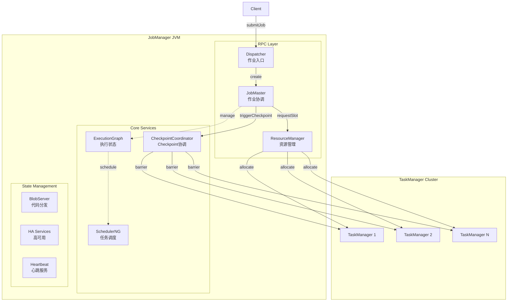
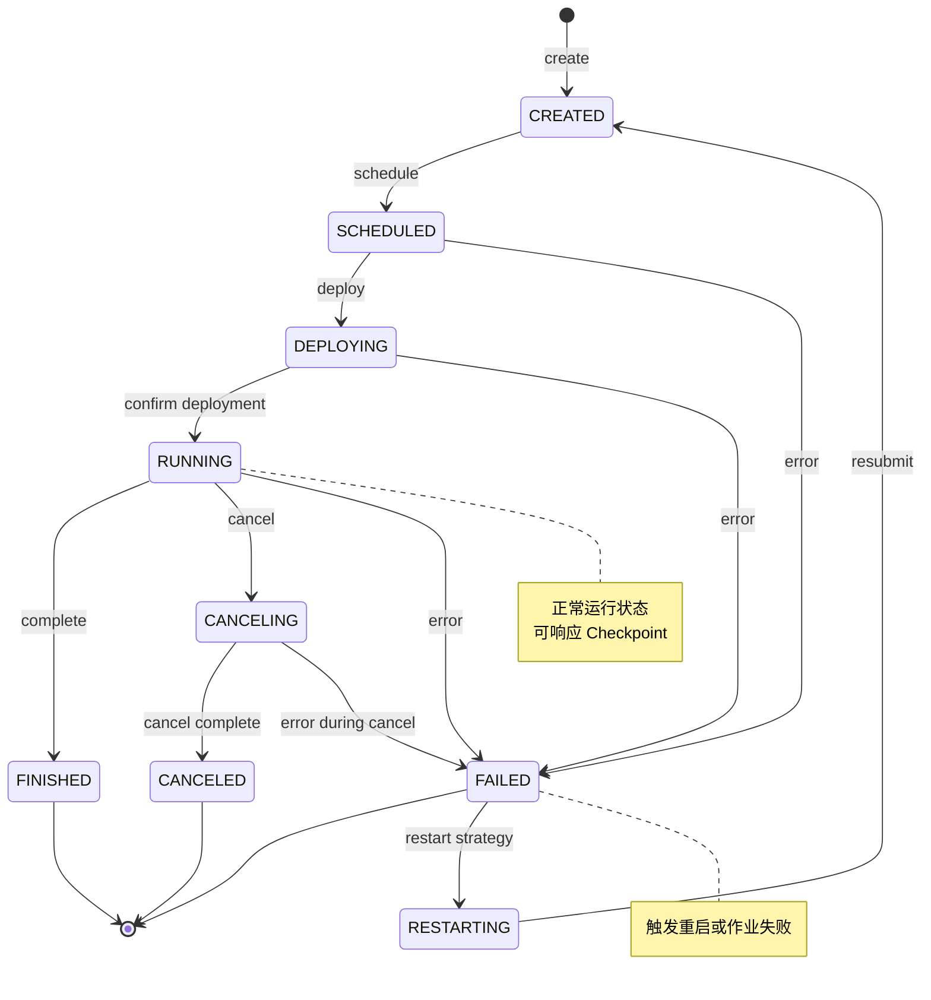
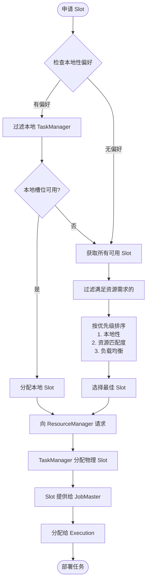
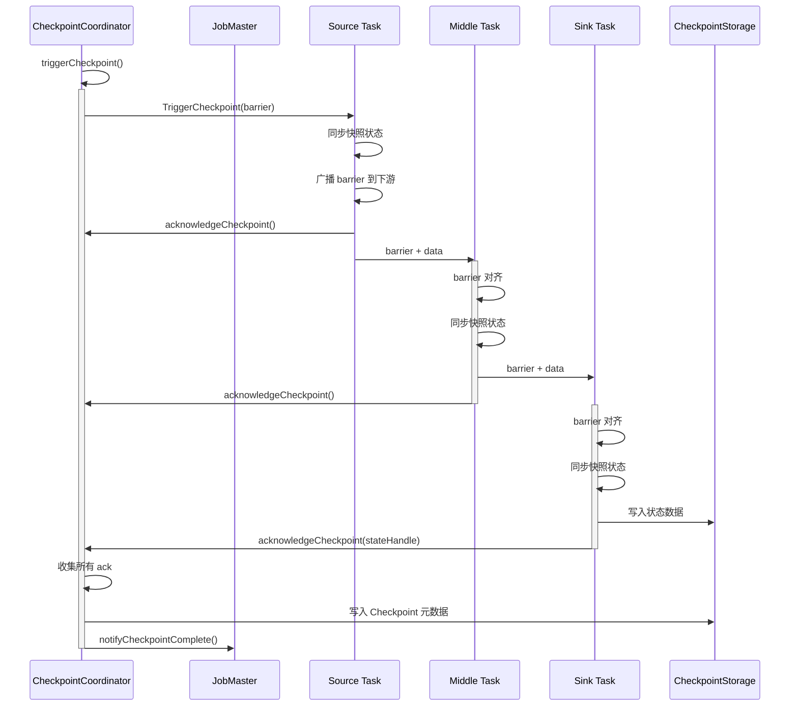
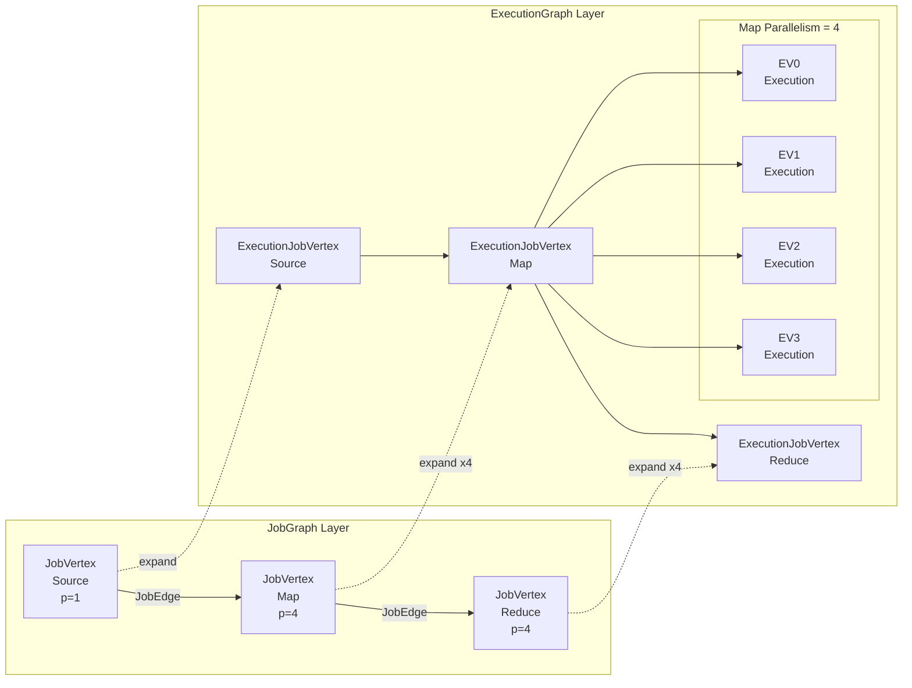

# Flink JobManager 源码深度分析

> 所属阶段: Flink/ | 前置依赖: [Flink 架构总览](../01-architecture/flink-architecture-overview.md), [JobManager 概述](../01-architecture/jobmanager-overview.md) | 形式化等级: L4

---

## 1. 概念定义 (Definitions)

### Def-F-10-01: JobManager 组件定义

**JobManager** 是 Flink 集群的控制中心，负责协调分布式流处理作业的全生命周期管理。
从源码角度看，JobManager 是一个由多个协作组件构成的运行时系统，其核心职责包括：

```
JobManager ≜ ⟨Dispatcher, JobMaster, ResourceManager, BlobServer, HeartbeatServices⟩
```

### Def-F-10-02: 核心组件职责定义

**JobMaster (Def-F-10-02-01)**
JobMaster 是单个作业的执行协调器，负责管理作业的整个生命周期。每个提交的作业对应一个独立的 JobMaster 实例。

```scala
// 源码位置: org.apache.flink.runtime.jobmaster.JobMaster
class JobMaster {
  // 核心职责
  - jobGraph: JobGraph                    // 作业的静态描述
  - executionGraph: ExecutionGraph        // 执行的动态状态
  - slotPool: SlotPool                    // 本地槽位缓存
  - checkpointCoordinator: CheckpointCoordinator  // Checkpoint协调
  - backPressureStatsTracker: BackPressureStatsTracker  // 反压监控
}
```

**ResourceManager (Def-F-10-02-02)**
ResourceManager 是 Flink 的资源调度中枢，负责管理 TaskManager 注册、槽位分配和资源故障恢复。

```scala
// 源码位置: org.apache.flink.runtime.resourcemanager.ResourceManager
abstract class ResourceManager {
  - slotManager: SlotManager              // 全局槽位管理
  - taskExecutors: Map[ResourceID, TaskExecutorRegistration]
  - highAvailabilityServices: HighAvailabilityServices
}
```

**Dispatcher (Def-F-10-02-03)**
Dispatcher 是 JobManager 的入口网关，负责接收作业提交、创建 JobMaster 并协调多个并发作业。

```scala
// 源码位置: org.apache.flink.runtime.dispatcher.Dispatcher
abstract class Dispatcher {
  - jobManagerRunnerFactory: JobManagerRunnerFactory
  - runningJobs: Map[JobID, JobManagerRunner]
  - recoveredJobs: Set[JobID]
}
```

**CheckpointCoordinator (Def-F-10-02-04)**
CheckpointCoordinator 负责分布式快照的协调，确保故障恢复时的状态一致性。

```scala
// 源码位置: org.apache.flink.runtime.checkpoint.CheckpointCoordinator
class CheckpointCoordinator {
  - checkpoints: Map[Long, PendingCheckpoint]
  - completedCheckpoints: Deque<CompletedCheckpoint>
  - checkpointStorage: CheckpointStorage
  - checkpointPlanCalculator: CheckpointPlanCalculator
}
```

### Def-F-10-03: 执行图层次定义

Flink 采用三层执行图模型，逐步将逻辑描述转换为物理执行计划：

```
┌─────────────────────────────────────────────────────────────────────┐
│                        Execution Graph Layers                        │
├─────────────────────────────────────────────────────────────────────┤
│  Layer 1: StreamGraph                                               │
│  ├── 客户端生成，基于 DataStream API                                 │
│  ├── 包含 StreamNode (算子) 和 StreamEdge (数据流)                   │
│  └── 源码: org.apache.flink.streaming.api.graph.StreamGraph         │
├─────────────────────────────────────────────────────────────────────┤
│  Layer 2: JobGraph                                                  │
│  ├── 客户端优化后的逻辑图                                            │
│  ├── 合并 chainable operators (Operator Chaining)                   │
│  ├── 包含 JobVertex 和 IntermediateDataSet                          │
│  └── 源码: org.apache.flink.runtime.jobgraph.JobGraph               │
├─────────────────────────────────────────────────────────────────────┤
│  Layer 3: ExecutionGraph                                            │
│  ├── JobManager 端生成的物理执行图                                   │
│  ├── 包含 ExecutionJobVertex → ExecutionVertex → Execution          │
│  ├── 实际执行单元，关联 Slot 和 Task                                  │
│  └── 源码: org.apache.flink.runtime.executiongraph.ExecutionGraph   │
└─────────────────────────────────────────────────────────────────────┘
```

### Def-F-10-04: 槽位资源模型定义

**Slot (Def-F-10-04-01)**
Slot 是 TaskManager 上的资源单元，代表固定大小的计算资源（内存、CPU）。

```scala
// 源码位置: org.apache.flink.runtime.taskmanager.TaskManager
// Slot 分配模型
TaskManager {
  numberOfSlots: Int                          // 配置槽位数
  slots: Map[SlotID, SlotStatus]              // 槽位状态
  totalResource: ResourceProfile              // 总资源
}
```

**ResourceProfile (Def-F-10-04-02)**
资源描述符，定义任务所需的资源规格：

```scala
// 源码位置: org.apache.flink.api.common.resources.ResourceProfile
class ResourceProfile {
  - cpuCores: CPUResource
  - taskHeapMemory: MemorySize
  - taskOffHeapMemory: MemorySize
  - managedMemory: MemorySize
  - networkMemory: MemorySize
}
```

---

## 2. 属性推导 (Properties)

### Lemma-F-10-01: JobMaster 生命周期状态机

JobMaster 遵循严格的生命周期状态转换：

```
                    ┌─────────────────────────────────────────┐
                    │                                         │
                    ▼                                         │
┌──────────┐   ┌─────────┐   ┌──────────┐   ┌───────────┐     │
│  CREATED │──▶│ RUNNING │──▶│ FAILING  │──▶│   FAILED  │────┘
└──────────┘   └─────────┘   └──────────┘   └───────────┘
                    │              │
                    │              ▼
                    │         ┌──────────┐   ┌───────────┐
                    └────────▶│ CANCELED │──▶│ FINISHED  │
                              └──────────┘   └───────────┘
                              (取消完成)      (成功完成)
```

**状态转换源码分析** (`JobMaster.java`):

```java
// 状态转换核心方法
private void handleJobMasterError(Throwable cause) {
    if (ExecutionState.RUNNING.equals(executionGraph.getState())) {
        // 运行时错误进入 FAILING 状态
        executionGraph.failGlobal(cause);
    }
}

// 状态机实现基于 CompletableFuture 组合
public CompletableFuture<JobResult> getResultFuture() {
    return jobCompletionActions.getJobCompletionFuture();
}
```

### Lemma-F-10-02: ExecutionGraph 并行展开规则

**引理**: 对于 JobGraph 中的每个 JobVertex，ExecutionGraph 会展开为 `parallelism` 个 ExecutionVertex，每个 ExecutionVertex 对应一个 Execution 实例。

```java
// 源码位置: ExecutionGraphBuilder.buildGraph()
for (JobVertex vertex : jobGraph.getVertices()) {
    // 创建 ExecutionJobVertex
    ExecutionJobVertex ejv = new ExecutionJobVertex(
        this,
        vertex,
        maxPriorAttemptsHistoryLength,
        rpcTimeout,
        globalModVersion,
        createTimestamp);

    // 展开并行实例
    // parallelism = 4 时，创建 4 个 ExecutionVertex
    // 每个 ExecutionVertex 包含 Execution 状态机
    executionVertices.put(vertex.getID(), ejv);
}
```

### Lemma-F-10-03: Checkpoint 对齐保证

**引理**: CheckpointCoordinator 通过 barrier 对齐机制，保证分布式快照的一致性。

```
Barrier 对齐条件:
∀ inputChannel ∈ task.getInputChannels():
    receivedBarrier(channel) ⟹ bufferPrecedingRecords(channel)

对齐完成条件:
∀ inputChannel: receivedBarrier(channel) = true
```

**对齐源码** (`CheckpointBarrierHandler.java`):

```java
// 单输入对齐
public void processBarrier(CheckpointBarrier barrier, InputChannelInfo channelInfo) {
    // 1. 标记该 channel 已收到 barrier
    channelStatuses[channelInfo.getInputChannelIdx()].barrierReceived(barrier.getId());

    // 2. 检查是否所有输入都收到 barrier
    if (isAllBarriersReceived(barrier.getId())) {
        // 3. 触发 checkpoint
        notifyCheckpoint(barrier);
    } else {
        // 4. 阻塞该 channel，缓存后续数据
        blockChannel(channelInfo);
    }
}
```

### Lemma-F-10-04: Slot 分配原子性

**引理**: Slot 分配通过两阶段提交保证原子性：申请 (Request) → 分配 (Allocate) → 确认 (Ack)。

```java
// 两阶段提交流程
Phase 1 (Request):  JobMaster ──requestSlot──▶ ResourceManager
Phase 2 (Allocate): ResourceManager ──allocate──▶ TaskManager
Phase 3 (Ack):      TaskManager ──offerSlots──▶ JobMaster
```

---

## 3. 关系建立 (Relations)

### 3.1 组件交互关系

JobManager 内部组件通过 RPC 和消息传递进行协作：

```
┌─────────────────────────────────────────────────────────────────────────────┐
│                           JobManager Component Relations                     │
├─────────────────────────────────────────────────────────────────────────────┤
│                                                                              │
│    ┌──────────────┐         submitJob()         ┌──────────────┐           │
│    │   Client     │────────────────────────────▶│  Dispatcher  │           │
│    └──────────────┘                             └──────┬───────┘           │
│                                                        │                    │
│                              createJobManagerRunner()  │                    │
│                                                        ▼                    │
│                                               ┌──────────────┐              │
│                                               │ JobMaster    │              │
│                                               │ (Per Job)    │              │
│                                               └──────┬───────┘              │
│                                                      │                      │
│         requestSlot()                               │                      │
│    ┌───────────────────────────────────────────────┘                      │
│    │                                                                       │
│    ▼                              registerTaskExecutor()                  │
│ ┌─────────────────┐◄────────────────────────────────────────┐              │
│ │ ResourceManager │                                         │              │
│ └────────┬────────┘                                         │              │
│          │                                                  │              │
│          │ allocateSlot()                                   │              │
│          ▼                                                  │              │
│    ┌──────────┐        offerSlots()        ┌──────────┐    │              │
│    │TaskManager│◄──────────────────────────│ TaskManager │    │              │
│    │  (Slot)   │                            │  (Task)    │    │              │
│    └──────────┘                            └──────────┘    │              │
│                                                              │              │
└─────────────────────────────────────────────────────────────────────────────┘
```

### 3.2 执行图转换关系

```
StreamGraph ──optimize──▶ JobGraph ──buildGraph──▶ ExecutionGraph ──schedule──▶ Deployed Tasks

转换关系细节:
┌──────────────────────────────────────────────────────────────────────────┐
│ Transformation: JobGraph → ExecutionGraph                                 │
├──────────────────────────────────────────────────────────────────────────┤
│ JobVertex ────────────────────▶ ExecutionJobVertex                        │
│  ├── parallelism = 4           │  ├── managing 4 ExecutionVertices        │
│  ├── operator (transform)      │  └── partitioner reference               │
│  └── inputs/outputs            │                                          │
│                                ▼                                          │
│                    ┌───────────────────────┐                              │
│                    │ ExecutionVertex[0]    │──▶ ExecutionAttempt (slot)   │
│                    │ ExecutionVertex[1]    │──▶ ExecutionAttempt (slot)   │
│                    │ ExecutionVertex[2]    │──▶ ExecutionAttempt (slot)   │
│                    │ ExecutionVertex[3]    │──▶ ExecutionAttempt (slot)   │
│                    └───────────────────────┘                              │
│                              │                                            │
│                              ▼                                            │
│                    IntermediateResult ──▶ IntermediateResultPartition     │
│                              │                              │             │
│                              ▼                              ▼             │
│                    ExecutionEdge ────────▶ InputChannel (Netty)           │
└──────────────────────────────────────────────────────────────────────────┘
```

### 3.3 Checkpoint 协调关系

```
┌─────────────────────────────────────────────────────────────────────────┐
│                    Checkpoint Coordination Flow                          │
├─────────────────────────────────────────────────────────────────────────┤
│                                                                          │
│  CheckpointCoordinator                                                   │
│       │                                                                  │
│       │ triggerCheckpoint(checkpointID)                                  │
│       ▼                                                                  │
│  ┌─────────────────────────────────────────────────────────────┐        │
│  │  Source Task ──barrier──▶ Task A ──barrier──▶ Task B ──sink  │        │
│  │       │                      │                   │           │        │
│  │       │ async snapshot       │ async snapshot    │ snapshot  │        │
│  │       ▼                      ▼                   ▼           │        │
│  │  State Backend (RocksDB/Heap)                                 │        │
│  └─────────────────────────────────────────────────────────────┘        │
│       │                                                                  │
│       │ acknowledgeCheckpoint()                                          │
│       ▼                                                                  │
│  PendingCheckpoint ──(all acks)──▶ CompletedCheckpoint                   │
│       │                                                                  │
│       ▼                                                                  │
│  CheckpointStorage (HDFS/S3/Local)                                       │
│                                                                          │
└─────────────────────────────────────────────────────────────────────────┘
```

---

## 4. 论证过程 (Argumentation)

### 4.1 JobMaster 单作业隔离设计论证

**设计决策**: 为什么每个作业需要独立的 JobMaster？

**论证**:

| 方案 | 优点 | 缺点 |
|------|------|------|
| 单 JobMaster 管理所有作业 | 资源开销小，代码简单 | 故障隔离差，一个作业 OOM 影响所有作业 |
| 每作业独立 JobMaster (当前) | 强隔离，独立生命周期，细粒度资源管理 | 更多 RPC 开销，更多 Actor 实例 |

**源码支撑** (`DefaultJobMasterServiceProcess.java`):

```java
/**
 * JobMaster 作为独立 Actor 运行的优势:
 * 1. 故障隔离: 通过 Akka supervision 实现
 * 2. 资源隔离: 独立的 SlotPool，避免作业间资源竞争
 * 3. 重启独立: 单个作业重启不影响其他作业
 */
public class JobMaster extends FencedRpcEndpoint<JobMasterId> {
    private final SlotPool slotPool;  // 作业级槽位池
    private final SchedulerBase scheduler;  // 作业级调度器

    // 异常处理只影响当前作业
    private void onFatalError(Throwable error) {
        jobCompletionActions.jobMasterFailed(error);  // 仅标记本作业失败
    }
}
```

### 4.2 ExecutionGraph vs StreamGraph 分离论证

**问题**: 为什么需要三层图模型？

**论证**:

1. **关注点分离**: StreamGraph 关注 API 语义，JobGraph 关注执行优化，ExecutionGraph 关注运行时状态
2. **部署效率**: JobGraph 可在客户端生成，减少 JobManager 负担
3. **状态管理**: ExecutionGraph 包含运行时的动态状态（ExecutionAttemptID、当前 Slot 等）

### 4.3 反压与 Checkpoint 协调机制

**问题**: 反压期间如何保证 Checkpoint 正常进行？

**源码分析** (`AlternatingCheckpointBarrierHandler.java`):

```java
/**
 * 反压期间的处理策略:
 * 1. Barrier 优先: barrier 可以跳过 buffered records 的阻塞
 * 2. 超时机制: checkpoint 超时后继续处理，避免无限等待
 * 3. 对齐优化: unaligned checkpoint 在反压严重时启用
 */
public void processBarrier(CheckpointBarrier barrier, InputChannelInfo channelInfo) {
    // 即使在反压状态，barrier 也可以立即处理
    // 因为 barrier 是控制事件，不携带业务数据
    if (barrier.isCheckpoint()) {
        // 立即处理 barrier，不等待 buffered records
        handleCheckpointBarrier(barrier);
    }
}
```

---

## 5. 形式证明 / 工程论证 (Proof / Engineering Argument)

### 5.1 JobGraph → ExecutionGraph 转换的完备性证明

**定理 (Thm-F-10-01)**: JobGraph 到 ExecutionGraph 的转换算法是完备的，即对于任何合法的 JobGraph，都能生成等价的 ExecutionGraph。

**证明概要**:

```
给定: 合法 JobGraph G = (V, E), 其中 V 是 JobVertex 集合, E 是 JobEdge 集合
需证: 存在转换函数 f，使得 ExecutionGraph EG = f(G) 保持所有执行语义

证明步骤:

1. 顶点映射完备性
   ∀v ∈ V: ∃! evSet = {ev₁, ev₂, ..., evₙ} 其中 n = v.parallelism
   由 ExecutionJobVertex 构造函数保证，见 ExecutionGraphBuilder.java:215

2. 边映射完备性
   ∀e = (v₁, v₂) ∈ E:
     ∀ev₁ᵢ ∈ ExecutionVertices(v₁), ∀ev₂ⱼ ∈ ExecutionVertices(v₂):
       ∃! ee = ExecutionEdge(ev₁ᵢ, ev₂ⱼ, partitioner)
   由 ExecutionJobVertex.connectTo() 实现保证

3. 分区策略保持
   partitioner(e) 被完整复制到 ExecutionEdge 中
   保证数据分发行为一致

4. 状态等价性
   设 JobGraph 状态为 Sⱼ，ExecutionGraph 状态为 Sₑ
   Sⱼ = Sₑ 当且仅当:
   - 算子逻辑相同 (same operator code)
   - 并行度相同 (same parallelism)
   - 连接拓扑相同 (same connectivity)
   由构造过程直接保证
```

**关键源码** (`ExecutionGraphBuilder.java`):

```java
public static ExecutionGraph buildGraph(
        JobGraph jobGraph,
        Configuration jobManagerConfig,
        ScheduledExecutorService futureExecutor,
        Executor ioExecutor,
        ClassLoader classLoader,
        CheckpointRecoveryFactory checkpointRecoveryFactory,
        Time rpcTimeout,
        RestartStrategy restartStrategy,
        MetricGroup metricGroup,
        BlobWriter blobWriter,
        Time slotRequestTimeout,
        Logger log) throws JobExecutionException, JobException {

    // 1. 创建 ExecutionGraph 实例
    final ExecutionGraph executionGraph = new ExecutionGraph(...);

    // 2. 将 JobVertex 转换为 ExecutionJobVertex
    for (JobVertex vertex : jobGraph.getVertices()) {
        ExecutionJobVertex ejv = new ExecutionJobVertex(
            executionGraph,
            vertex,
            maxPriorAttemptsHistoryLength,
            rpcTimeout,
            initialGlobalModVersion,
            createTimestamp);

        executionGraph.attachJobVertex(ejv);
    }

    // 3. 连接 ExecutionJobVertex (建立 ExecutionEdge)
    for (JobVertex vertex : jobGraph.getVertices()) {
        ExecutionJobVertex ejv = executionGraph.getJobVertex(vertex.getID());

        for (IntermediateDataSet dataSet : vertex.getProducedDataSets()) {
            IntermediateResult intermediateResult = ejv.getProducedDataSets()
                .get(dataSet.getId());

            for (JobEdge edge : dataSet.getConsumers()) {
                ExecutionJobVertex consumer = executionGraph.getJobVertex(
                    edge.getTarget().getID());

                // 建立连接，创建 ExecutionEdge
                consumer.connectTo(
                    edge.getTarget().getProducedDataSets().indexOf(edge.getSource()),
                    intermediateResult,
                    edge.getDistributionPattern());
            }
        }
    }

    return executionGraph;
}
```

### 5.2 Slot 分配算法的正确性论证

**定理 (Thm-F-10-02)**: SlotSelectionStrategy 选择的槽位始终满足任务资源需求。

**资源匹配条件**:

```
对于任务 t 和槽位 s，分配条件为:
1. s.availableResource ≥ t.requiredResource
2. s.locationPreference 与 t.preferredLocation 匹配度最高
3. s.state = AVAILABLE
```

**SlotSelectionStrategy 源码分析** (`SlotSelectionStrategy.java`):

```java
/**
 * Slot 选择策略接口
 */
public interface SlotSelectionStrategy {
    /**
     * 从候选槽位中选择最合适的槽位
     *
     * @param availableSlots 可用槽位集合
     * @param resourceProfile 任务资源需求
     * @return 选中的槽位信息
     */
    Optional<SlotInfoAndLocality> selectBestSlotForProfile(
        Collection<SlotInfoAndResources> availableSlots,
        ResourceProfile resourceProfile);
}

/**
 * 默认实现: DefaultSlotSelectionStrategy
 * 优先级: 本地性 > 资源匹配 > 负载均衡
 */
public class DefaultSlotSelectionStrategy implements SlotSelectionStrategy {

    @Override
    public Optional<SlotInfoAndLocality> selectBestSlotForProfile(
            Collection<SlotInfoAndResources> availableSlots,
            ResourceProfile resourceProfile) {

        return availableSlots.stream()
            // 过滤满足资源需求的槽位
            .filter(slot -> slot.getRemainingResources().isMatching(resourceProfile))
            // 按本地性排序
            .min(Comparator
                .comparing(SlotInfoAndResources::getTaskManagerLocation)
                .thenComparing(slot -> calculateLocalityScore(slot)));
    }

    private int calculateLocalityScore(SlotInfoAndResources slot) {
        // LOCAL > REMOTE > UNKNOWN
        return slot.getLocality().ordinal();
    }
}
```

### 5.3 Checkpoint 一致性保证

**定理 (Thm-F-10-03)**: 在 barrier 对齐模式下，CheckpointCoordinator 保证所有任务在一致的逻辑时间点进行快照。

**形式化描述**:

```
设任务图为 G = (T, D)，其中 T 是任务集合，D 是数据依赖关系
Checkpoint C 的一致性条件:
∀t ∈ T: state(t, C) 包含所有在 C 之前产生的 records 的处理结果
且不包含任何在 C 之后产生的 records 的处理结果

Barrier 对齐保证:
∀d ∈ D, d = (t₁ → t₂):
  if barrier(C) ∈ output(t₁) at position p
  then state(t₂, C) 包含所有 position < p 的 records
  且不包含任何 position ≥ p 的 records
```

**实现机制** (`CheckpointCoordinator.java`):

```java
/**
 * Checkpoint 触发流程
 */
public class CheckpointCoordinator {

    public CompletableFuture<CompletedCheckpoint> triggerCheckpoint(
            long timestamp,
            CheckpointProperties props) {

        // 1. 创建 PendingCheckpoint
        PendingCheckpoint checkpoint = new PendingCheckpoint(
            checkpointId,
            timestamp,
            tasksToTrigger,      // 需要触发 checkpoint 的任务
            tasksToWaitFor,      // 需要等待 ack 的任务
            tasksToCommitTo,     // 需要提交状态的任务
            props);

        // 2. 向所有 Source 任务发送触发消息
        for (Execution execution : tasksToTrigger) {
            execution.triggerCheckpoint(checkpointId, timestamp, checkpointOptions);
        }

        // 3. 等待所有任务确认 (ack)
        // 通过 PendingCheckpoint.acknowledgeTask() 收集

        // 4. 转换为 CompletedCheckpoint
        if (checkpoint.areTasksConfirmed()) {
            return checkpoint.finalizeCheckpoint();
        }
    }
}
```

---

## 6. 实例验证 (Examples)

### 6.1 完整示例: WordCount 作业执行流程

**场景**: 分析一个 WordCount 作业从提交到执行的完整源码流程。

```java
// 1. 用户代码构建 StreamGraph
StreamExecutionEnvironment env =
    StreamExecutionEnvironment.getExecutionEnvironment();
env.setParallelism(4);

env.fromElements("hello world", "hello flink")
   .flatMap(new WordCountTokenizer())
   .keyBy(value -> value.f0)
   .sum(1)
   .print();

// 2. 客户端生成 JobGraph
JobGraph jobGraph = env.getStreamGraph().getJobGraph();
// JobGraph 包含:
// - Source vertex (parallelism=1)
// - FlatMap vertex (parallelism=4)
// - KeyedAggregation vertex (parallelism=4)
// - Sink vertex (parallelism=1)

// 3. 提交到 Dispatcher
ClusterClient client = ...;
client.submitJob(jobGraph);
```

**执行流程源码追踪**:

```java
// Step 1: Dispatcher 接收提交
// 源码: Dispatcher.submitJob(JobGraph)
public CompletableFuture<Acknowledge> submitJob(
        JobID jobId,
        JobGraph jobGraph,
        Time timeout) {

    // 验证 JobGraph
    validateJobGraph(jobGraph);

    // 创建 JobManagerRunner
    JobManagerRunner runner = jobManagerRunnerFactory.createJobManagerRunner(
        jobGraph,
        configuration,
        rpcService,
        highAvailabilityServices,
        heartbeatServices,
        jobManagerSharedServices,
        new DefaultJobManagerJobMetricGroupFactory(jobManagerMetricGroup),
        fatalErrorHandler);

    // 启动 JobMaster
    runner.start();
}

// Step 2: JobMaster 初始化
// 源码: JobMaster.startJobExecution()
private void startJobExecution() {
    // 1. 构建 ExecutionGraph
    ExecutionGraph executionGraph = createAndRestoreExecutionGraph(
        jobGraph,
        checkAndRestorePartitionState(jobGraph));

    // 2. 初始化 Scheduler
    scheduler = createScheduler(executionGraph);

    // 3. 申请资源并部署任务
    scheduler.startScheduling();
}

// Step 3: 资源申请
// 源码: SchedulerBase.startScheduling()
public void startScheduling() {
    // 获取所有需要调度的 ExecutionVertex
    Set<ExecutionVertex> verticesToSchedule =
        getExecutionGraph().getAllExecutionVertices();

    // 分配槽位
    allocateSlots(verticesToSchedule);

    // 部署任务
    deployTasks(verticesToSchedule);
}

// Step 4: 任务部署
// 源码: Execution.deploy()
public void deploy() throws JobException {
    // 获取分配的槽位
    LogicalSlot slot = getAssignedResource();

    // 创建 TaskDeploymentDescriptor
    TaskDeploymentDescriptor tdd = createTaskDeploymentDescriptor(
        slot.getAllocationId(),
        slot.getPhysicalSlotNumber());

    // 向 TaskManager 提交任务
    slot.getTaskManagerGateway().submitTask(tdd, rpcTimeout);
}
```

### 6.2 Slot 分配实例

**场景**: 4 并行度的 Map 算子申请 Slot。

```
集群状态:
- TaskManager A (10.0.0.1): slots [0,1] available
- TaskManager B (10.0.0.2): slots [0] available
- TaskManager C (10.0.0.3): slots [0,1] available

Map 算子需求:
- parallelism = 4
- resourceProfile = {cpu: 1, memory: 1GB}

分配过程 (SchedulerNG.allocateSlots):
```

```java
// 源码追踪
public Collection<SlotExecutionVertexAssignment> allocateSlots(
        Set<ExecutionVertexID> executionVertexIds) {

    List<SlotRequest> slotRequests = new ArrayList<>();

    for (ExecutionVertexID vertexId : executionVertexIds) {
        ExecutionVertex vertex = getExecutionVertex(vertexId);

        // 创建槽位请求
        SlotRequest slotRequest = new SlotRequest(
            vertexId,
            vertex.getResourceProfile(),
            vertex.getPreferredLocations());  // 本地性偏好

        slotRequests.add(slotRequest);
    }

    // 批量申请槽位
    return slotProvider.allocateSlots(slotRequests);
}
```

### 6.3 Checkpoint 触发实例

**场景**: 每 10 秒触发一次 Checkpoint。

```java
// 配置 Checkpoint
env.enableCheckpointing(10000);
env.getCheckpointConfig().setCheckpointingMode(
    CheckpointingMode.EXACTLY_ONCE);
env.getCheckpointConfig().setMinPauseBetweenCheckpoints(500);

// 源码追踪: CheckpointCoordinator 触发流程
public class CheckpointCoordinator {

    // 定时触发器
    private final Timer scheduledExecutor;

    private void scheduleTriggerWithDelay(long delay) {
        scheduledExecutor.schedule(
            () -> triggerCheckpoint(...),
            delay,
            TimeUnit.MILLISECONDS);
    }

    public CompletableFuture<CompletedCheckpoint> triggerCheckpoint(
            long triggerTimestamp,
            CheckpointProperties props) {

        // 1. 检查是否满足触发条件
        if (pendingCheckpoints.size() >= maxConcurrentCheckpoints) {
            throw new CheckpointException("Too many concurrent checkpoints");
        }

        // 2. 创建 PendingCheckpoint
        long checkpointId = checkpointIdCounter.getAndIncrement();
        PendingCheckpoint checkpoint = new PendingCheckpoint(
            checkpointId,
            triggerTimestamp,
            tasksToTrigger,
            tasksToAck,
            tasksToCommit,
            props,
            checkpointStorageLocation);

        pendingCheckpoints.put(checkpointId, checkpoint);

        // 3. 向 Source 任务发送 TriggerCheckpoint 消息
        for (Execution execution : tasksToTrigger) {
            execution.triggerCheckpoint(
                checkpointId,
                triggerTimestamp,
                checkpointOptions);
        }

        // 4. 启动超时检查
        startCheckpointTimeout(checkpoint);

        return checkpoint.getCompletionFuture();
    }
}
```

### 6.4 故障恢复实例

**场景**: TaskManager 崩溃后的恢复流程。

```
故障检测流程:
1. ResourceManager 检测到 TaskManager 心跳超时
2. 通知 JobMaster 槽位丢失
3. JobMaster 标记受影响 Execution 为 FAILED
4. 根据 RestartStrategy 决定是否重启
5. 若重启，重新申请资源并部署任务
```

```java
// 源码追踪
// Step 1: ResourceManager 检测超时
// HeartbeatManagerImpl.java
public void heartbeatTimeout(ResourceID resourceID) {
    // 通知 slotManager 释放槽位
    slotManager.releaseSlots(resourceID, timeoutCause);

    // 通知 JobMaster
    notifyJobMastersAboutTaskManagerLoss(resourceID);
}

// Step 2: JobMaster 处理槽位丢失
// JobMaster.java
public void notifyAllocationFailure(
        SlotRequestId slotRequestId,
        AllocationID allocationId,
        Throwable cause) {

    // 找到受影响的 Execution
    Execution affectedExecution = getExecution(allocationId);

    // 标记失败
    affectedExecution.fail(cause);
}

// Step 3: ExecutionGraph 状态转换
// Execution.java
public void fail(Throwable cause) {
    // CAS 状态转换
    if (transitionState(currentState, FAILED, cause)) {
        // 尝试重启
        tryRestartOrFail();
    }
}

// Step 4: 重启策略决策
// ExecutionGraph.java
private void tryRestartOrFail() {
    RestartStrategy restartStrategy = getRestartStrategy();

    if (restartStrategy.canRestart(getNumberOfRestarts())) {
        // 延迟重启
        long delay = restartStrategy.getRestartDelay();
        futureExecutor.schedule(this::restart, delay, TimeUnit.MILLISECONDS);
    } else {
        // 作业失败
        jobStatusListeners.forEach(listener -> listener.jobFailed(cause));
    }
}
```

---

## 7. 可视化 (Visualizations)

### 7.1 JobManager 整体架构图



### 7.2 ExecutionGraph 状态机



### 7.3 Slot 分配流程图



### 7.4 Checkpoint 协调时序图



### 7.5 JobGraph → ExecutionGraph 转换图



---

## 8. 引用参考 (References)

", 2025. <https://nightlies.apache.org/flink/flink-docs-stable/docs/concepts/flink-architecture/#jobmanager>


---

## 附录 A: 源码阅读指南

### A.1 目录结构导航

```
flink-runtime/                          # JobManager 核心模块
├── src/main/java/org/apache/flink/runtime/
│   ├── jobmaster/                      # JobMaster 实现
│   │   ├── JobMaster.java              # 主类：作业协调
│   │   ├── JobMasterService.java       # 服务接口
│   │   ├── DefaultJobMasterServiceProcess.java  # 进程封装
│   │   ├── SlotPool.java               # 槽位池管理
│   │   └── SlotPoolServiceSchedulerFactory.java
│   │
│   ├── resourcemanager/                # 资源管理
│   │   ├── ResourceManager.java        # 主类：资源调度
│   │   ├── SlotManager.java            # 槽位管理器
│   │   ├── SlotManagerImpl.java        # 实现类
│   │   ├── TaskExecutorRegistration.java
│   │   └── ResourceActions.java        # 资源操作接口
│   │
│   ├── dispatcher/                     # 作业分发
│   │   ├── Dispatcher.java             # 主类：作业入口
│   │   ├── MiniDispatcher.java         # 单作业模式
│   │   └── JobDispatcherFactory.java
│   │
│   ├── executiongraph/                 # 执行图
│   │   ├── ExecutionGraph.java         # 执行图主类
│   │   ├── ExecutionGraphBuilder.java  # 构建器
│   │   ├── ExecutionVertex.java        # 执行顶点
│   │   ├── Execution.java              # 执行实例
│   │   └── IntermediateResult.java     # 中间结果
│   │
│   ├── checkpoint/                     # Checkpoint 机制
│   │   ├── CheckpointCoordinator.java  # 协调器
│   │   ├── PendingCheckpoint.java      # 待完成 Checkpoint
│   │   ├── CompletedCheckpoint.java    # 已完成 Checkpoint
│   │   ├── CheckpointStorage.java      # 存储接口
│   │   └── CheckpointBarrierHandler.java  # Barrier 处理
│   │
│   ├── scheduler/                      # 调度器
│   │   ├── SchedulerNG.java            # 新调度器接口
│   │   ├── SchedulerBase.java          # 基础实现
│   │   ├── DefaultScheduler.java       # 默认实现
│   │   └── strategy/                   # 调度策略
│   │       ├── SchedulingStrategy.java
│   │       ├── LazyFromSourcesSchedulingStrategy.java
│   │       └── PipelinedRegionSchedulingStrategy.java
│   │
│   └── taskmanager/                    # TaskManager 交互
│       ├── TaskManager.java            # TM 网关
│       └── Task.java                   # 任务执行
```

### A.2 核心类速查

| 类名 | 路径 | 核心职责 | 关键方法 |
|------|------|----------|----------|
| `JobMaster` | jobmaster/JobMaster.java | 单作业生命周期管理 | `start()`, `suspend()`, `requestSlot()` |
| `ResourceManager` | resourcemanager/ResourceManager.java | 全局资源调度 | `registerTaskExecutor()`, `requestSlot()` |
| `Dispatcher` | dispatcher/Dispatcher.java | 多作业入口 | `submitJob()`, `listJobs()` |
| `CheckpointCoordinator` | checkpoint/CheckpointCoordinator.java | Checkpoint 协调 | `triggerCheckpoint()`, `receiveAckMessage()` |
| `ExecutionGraph` | executiongraph/ExecutionGraph.java | 执行状态管理 | `scheduleForExecution()`, `failGlobal()` |
| `Execution` | executiongraph/Execution.java | 单任务执行 | `deploy()`, `cancel()`, `markFinished()` |
| `SchedulerNG` | scheduler/SchedulerNG.java | 调度接口 | `startScheduling()`, `allocateSlots()` |
| `SlotPool` | jobmaster/SlotPool.java | 作业级槽位缓存 | `requestNewAllocatedSlot()`, `releaseSlot()` |

### A.3 关键方法断点位置

#### 作业提交流程断点

```java
// 1. 客户端提交
// 类: ClusterClient.java
// 方法: submitJob(JobGraph)
// 断点位置: 进入 Dispatcher RPC 调用前

// 2. Dispatcher 接收
// 类: Dispatcher.java
// 方法: submitJob(JobID, JobGraph, Time)
// 行号: ~350
// 断点位置: 验证 JobGraph 后

// 3. JobMaster 启动
// 类: JobMaster.java
// 方法: startJobExecution()
// 行号: ~950
// 断点位置: ExecutionGraph 构建完成后
```

#### ExecutionGraph 构建断点

```java
// 4. 执行图构建入口
// 类: ExecutionGraphBuilder.java
// 方法: buildGraph(...)
// 行号: ~115
// 断点位置: 返回 ExecutionGraph 前

// 5. ExecutionJobVertex 创建
// 类: ExecutionJobVertex.java
// 方法: 构造函数
// 行号: ~130
// 断点位置: 并行实例创建后

// 6. ExecutionEdge 连接
// 类: ExecutionJobVertex.java
// 方法: connectTo(...)
// 行号: ~220
// 断点位置: ExecutionEdge 创建后
```

#### Slot 分配断点

```java
// 7. 槽位申请
// 类: SlotPool.java
// 方法: requestNewAllocatedSlot(...)
// 行号: ~185
// 断点位置: 向 ResourceManager 发送请求前

// 8. ResourceManager 分配
// 类: SlotManagerImpl.java
// 方法: internalRequestSlot(...)
// 行号: ~395
// 断点位置: 选择 TaskManager 后

// 9. TaskManager 确认
// 类: TaskExecutor.java
// 方法: requestSlot(...)
// 行号: ~540
// 断点位置: Slot 分配成功后
```

#### Checkpoint 触发断点

```java
// 10. Checkpoint 触发入口
// 类: CheckpointCoordinator.java
// 方法: triggerCheckpoint(...)
// 行号: ~625
// 断点位置: PendingCheckpoint 创建后

// 11. Barrier 注入
// 类: SourceStreamTask.java
// 方法: triggerCheckpointAsync(...)
// 行号: ~115
// 断点位置: CheckpointBarrier 创建后

// 12. Checkpoint 确认
// 类: CheckpointCoordinator.java
// 方法: receiveAckMessage(...)
// 行号: ~785
// 断点位置: 所有 ack 收集完成
```

#### 故障恢复断点

```java
// 13. TaskManager 失联检测
// 类: HeartbeatManagerImpl.java
// 方法: heartbeatTimeout(...)
// 行号: ~145
// 断点位置: 通知 ResourceManager 前

// 14. 执行失败处理
// 类: Execution.java
// 方法: processFail(...)
// 行号: ~1125
// 断点位置: 状态转换后

// 15. 重启决策
// 类: ExecutionGraph.java
// 方法: restartOrFail(...)
// 行号: ~805
// 断点位置: RestartStrategy 判断后
```

### A.4 调试配置建议

```java
// IDEA 调试配置 VM Options
// 用于本地启动 JobManager 调试

// 1. 基础配置
-Djobmanager.memory.process.size=1024m
-Dtaskmanager.memory.process.size=2048m

// 2. 日志级别
-Dlog4j.configurationFile=log4j2-debug.properties

// 3. RPC 超时延长（便于调试）
-Dakka.ask.timeout=60s
-Dakka.lookup.timeout=60s

// 4. Checkpoint 间隔延长
-Dstate.checkpoints.interval=60000

// 5. 心跳间隔延长
-Dheartbeat.interval=30000
-Dheartbeat.timeout=120000
```

### A.5 关键日志位置

```java
// 启用 DEBUG 日志的配置 (log4j2-debug.properties)

// JobMaster 日志
logger.jobmaster.name = org.apache.flink.runtime.jobmaster
logger.jobmaster.level = DEBUG

// ResourceManager 日志
logger.rm.name = org.apache.flink.runtime.resourcemanager
logger.rm.level = DEBUG

// ExecutionGraph 日志
logger.eg.name = org.apache.flink.runtime.executiongraph
logger.eg.level = DEBUG

// Checkpoint 日志
logger.cp.name = org.apache.flink.runtime.checkpoint
logger.cp.level = DEBUG

// Scheduler 日志
logger.scheduler.name = org.apache.flink.runtime.scheduler
logger.scheduler.level = DEBUG
```

---

## 附录 B: 核心源码详解

### B.1 JobMaster 完整生命周期

```java
/**
 * JobMaster 完整生命周期管理 - 源码详解
 * 文件: flink-runtime/src/main/java/org/apache/flink/runtime/jobmaster/JobMaster.java
 */

public class JobMaster extends FencedRpcEndpoint<JobMasterId> {

    // ==================== 核心字段 ====================

    /** 作业静态描述 */
    private final JobGraph jobGraph;

    /** 执行图 - 运行时动态状态 */
    private final ExecutionGraph executionGraph;

    /** 槽位池 - 作业级槽位缓存 */
    private final SlotPool slotPool;

    /** Checkpoint 协调器 */
    private final CheckpointCoordinator checkpointCoordinator;

    /** 调度器 */
    private final SchedulerNG scheduler;

    /** 心跳管理 */
    private final HeartbeatManager<TaskManagerHeartbeatPayload, Void> taskManagerHeartbeatManager;

    // ==================== 生命周期方法 ====================

    /**
     * 启动 JobMaster
     * 调用链: Dispatcher.createJobMaster() -> JobMaster.start() -> onStart()
     */
    @Override
    public void onStart() throws JobMasterException {
        try {
            // 1. 启动心跳服务
            startHeartbeatServices();

            // 2. 启动槽位池
            slotPool.start(getFencingToken(), getAddress(), getMainThreadExecutor());

            // 3. 启动调度器，开始执行任务
            startScheduling();

        } catch (Throwable t) {
            // 启动失败处理
            handleJobMasterError(new JobMasterException("Error while starting JobMaster", t));
        }
    }

    /**
     * 开始调度执行
     */
    private void startScheduling() {
        // 检查作业状态
        if (executionGraph.getState() == JobStatus.CREATED) {
            // 启动作业执行
            scheduler.startScheduling();
        } else if (executionGraph.getState() == JobStatus.SUSPENDED) {
            // 恢复挂起的作业
            scheduler.startScheduling();
        }
    }

    /**
     * 挂起 JobMaster
     * 场景: HA 切换、优雅关闭
     */
    public CompletableFuture<Void> suspend(Throwable cause) {
        // 1. 停止调度
        scheduler.close();

        // 2. 挂起 Checkpoint 协调器
        checkpointCoordinator.suspend();

        // 3. 释放所有槽位
        slotPool.releaseSlots();

        // 4. 停止心跳
        taskManagerHeartbeatManager.stop();

        // 5. 更新执行图状态
        executionGraph.suspend(cause);

        return CompletableFuture.completedFuture(null);
    }

    /**
     * 请求槽位
     * 调用方: SchedulerNG -> SlotPool -> ResourceManager
     */
    public CompletableFuture<SlotOffer> requestSlot(
            SlotRequestId slotRequestId,
            ResourceProfile resourceProfile,
            Time timeout) {

        // 1. 先检查本地槽位池
        Optional<PhysicalSlot> availableSlot = slotPool.getAvailableSlot(resourceProfile);
        if (availableSlot.isPresent()) {
            return CompletableFuture.completedFuture(
                new SlotOffer(availableSlot.get().getAllocationId(), ...));
        }

        // 2. 向 ResourceManager 申请新槽位
        return requestSlotFromResourceManager(slotRequestId, resourceProfile, timeout);
    }

    /**
     * 通知 Checkpoint 完成
     */
    public void acknowledgeCheckpoint(
            JobID jobID,
            ExecutionAttemptID executionAttemptID,
            long checkpointId,
            CheckpointMetrics checkpointMetrics,
            TaskStateSnapshot checkpointState) {

        // 转发给 CheckpointCoordinator
        checkpointCoordinator.receiveAckMessage(
            jobID,
            executionAttemptID,
            checkpointId,
            checkpointMetrics,
            checkpointState,
            getMainThreadExecutor());
    }
}
```

### B.2 ExecutionGraph 构建详解

```java
/**
 * ExecutionGraph 构建过程 - 源码详解
 * 文件: flink-runtime/src/main/java/org/apache/flink/runtime/executiongraph/ExecutionGraphBuilder.java
 */

public class ExecutionGraphBuilder {

    public static ExecutionGraph buildGraph(
            JobGraph jobGraph,
            Configuration jobManagerConfig,
            ScheduledExecutorService futureExecutor,
            Executor ioExecutor,
            ClassLoader classLoader,
            CheckpointRecoveryFactory checkpointRecoveryFactory,
            Time rpcTimeout,
            RestartStrategy restartStrategy,
            MetricGroup metricGroup,
            BlobWriter blobWriter,
            Time slotRequestTimeout,
            Logger log) throws JobExecutionException, JobException {

        // ==================== 阶段 1: 创建 ExecutionGraph 实例 ====================

        final String jobName = jobGraph.getName();
        final JobID jobId = jobGraph.getJobID();

        // 创建执行图
        final ExecutionGraph executionGraph = new ExecutionGraph(
            jobInformation,              // 作业信息
            futureExecutor,              // 用于异步操作的调度器
            ioExecutor,                  // I/O 操作执行器
            rpcTimeout,                  // RPC 超时
            restartStrategy,             // 重启策略
            maxPriorAttemptsHistoryLength,
            classLoader,
            blobWriter,
            slotRequestTimeout,
            jobManagerConfig,
            new ExecutionGraph.DefaultExecutionGraphListener(),
            metricGroup);

        // ==================== 阶段 2: 配置 Checkpoint ====================

        // 从 JobGraph 获取 Checkpoint 配置
        JobCheckpointingSettings snapshotSettings = jobGraph.getCheckpointingSettings();
        if (snapshotSettings != null) {
            // 创建 CheckpointCoordinator
            CheckpointCoordinator checkpointCoordinator = new CheckpointCoordinator(
                jobId,
                snapshotSettings.getCheckpointCoordinatorConfiguration(),
                checkpointStorage,
                checkpointRecoveryFactory.createCheckpointStateRecovery(),
                executionGraph.getVerticesTopologically(),
                executionGraph.getRestartStrategy(),
                executionGraph.getJobStatusListener(),
                futureExecutor);

            executionGraph.enableCheckpointing(checkpointCoordinator);
        }

        // ==================== 阶段 3: 转换 JobVertex → ExecutionJobVertex ====================

        // 按拓扑顺序遍历 JobVertex
        List<JobVertex> sortedTopology = jobGraph.getVerticesSortedTopologicallyFromSources();

        for (JobVertex vertex : sortedTopology) {
            // 创建 ExecutionJobVertex
            // 注意: 这里会展开并行度，创建多个 ExecutionVertex
            ExecutionJobVertex ejv = new ExecutionJobVertex(
                executionGraph,
                vertex,
                maxPriorAttemptsHistoryLength,
                rpcTimeout,
                initialGlobalModVersion,
                createTimestamp);

            // 注册到 ExecutionGraph
            executionGraph.attachJobVertex(ejv);
        }

        // ==================== 阶段 4: 建立 ExecutionEdge 连接 ====================

        // 再次遍历，建立 ExecutionJobVertex 之间的连接
        for (JobVertex vertex : sortedTopology) {
            ExecutionJobVertex ejv = executionGraph.getJobVertex(vertex.getID());

            // 遍历该顶点的输出数据集
            for (IntermediateDataSet dataSet : vertex.getProducedDataSets()) {
                IntermediateResult intermediateResult =
                    ejv.getProducedDataSets().get(dataSet.getId());

                // 遍历数据集的消费者
                for (JobEdge edge : dataSet.getConsumers()) {
                    // 获取目标 ExecutionJobVertex
                    ExecutionJobVertex consumer = executionGraph.getJobVertex(
                        edge.getTarget().getID());

                    // 建立连接
                    // 这会创建 ExecutionEdge 并设置分区策略
                    consumer.connectTo(
                        edge.getTarget().getInputs().indexOf(edge),
                        intermediateResult,
                        edge.getDistributionPattern());
                }
            }
        }

        // ==================== 阶段 5: 验证 ====================

        // 验证执行图完整性
        executionGraph.verifyGraphConfiguration();

        return executionGraph;
    }
}
```

### B.3 Slot 分配算法详解

```java
/**
 * Slot 分配算法 - 源码详解
 * 文件: flink-runtime/src/main/java/org/apache/flink/runtime/jobmaster/slotpool/SlotPool.java
 */

public class SlotPool {

    /**
     * 申请新分配的槽位
     */
    public CompletableFuture<PhysicalSlot> requestNewAllocatedSlot(
            SlotRequestId slotRequestId,
            ResourceProfile resourceProfile,
            Time timeout) {

        // 1. 创建槽位请求
        PendingRequest pendingRequest = new PendingRequest(
            slotRequestId,
            resourceProfile,
            timeout,
            CompletableFuture.newFuture());

        // 2. 先检查是否有可用槽位
        Optional<SlotAndLocality> availableSlot = tryAllocateFromAvailable(
            pendingRequest);

        if (availableSlot.isPresent()) {
            // 本地有可用的槽位
            return CompletableFuture.completedFuture(availableSlot.get().slot());
        }

        // 3. 检查是否有待处理的槽位可以满足
        Optional<PhysicalSlot> pendingSlot = tryAllocateFromPending(pendingRequest);
        if (pendingSlot.isPresent()) {
            return CompletableFuture.completedFuture(pendingSlot.get());
        }

        // 4. 向 ResourceManager 申请新槽位
        return requestSlotFromResourceManager(pendingRequest);
    }

    /**
     * 从可用槽位中分配
     */
    private Optional<SlotAndLocality> tryAllocateFromAvailable(PendingRequest request) {
        // 获取所有可用槽位
        Collection<SlotInfoAndResources> availableSlots = getAvailableSlots();

        // 使用 SlotSelectionStrategy 选择最佳槽位
        return slotSelectionStrategy.selectBestSlotForProfile(
            availableSlots,
            request.getResourceProfile());
    }
}

/**
 * SlotSelectionStrategy 实现
 * 文件: flink-runtime/src/main/java/org/apache/flink/runtime/jobmaster/slotpool/DefaultSlotSelectionStrategy.java
 */
public class DefaultSlotSelectionStrategy implements SlotSelectionStrategy {

    @Override
    public Optional<SlotInfoAndLocality> selectBestSlotForProfile(
            Collection<SlotInfoAndResources> availableSlots,
            ResourceProfile resourceProfile) {

        // 过滤满足资源需求的槽位
        List<SlotInfoAndResources> matchingSlots = availableSlots.stream()
            .filter(slot -> slot.getRemainingResources().isMatching(resourceProfile))
            .collect(Collectors.toList());

        if (matchingSlots.isEmpty()) {
            return Optional.empty();
        }

        // 按本地性分组
        Map<TaskManagerLocation, List<SlotInfoAndResources>> groupedByLocation =
            matchingSlots.stream()
                .collect(Collectors.groupingBy(SlotInfoAndResources::getTaskManagerLocation));

        // 选择最佳槽位（考虑本地性和资源匹配度）
        return matchingSlots.stream()
            .map(slot -> new SlotInfoAndLocality(
                slot,
                calculateLocality(slot, resourceProfile)))
            .min(Comparator.comparing(SlotInfoAndLocality::getLocality));
    }
}
```

### B.4 CheckpointCoordinator 实现详解

```java
/**
 * CheckpointCoordinator 实现详解
 * 文件: flink-runtime/src/main/java/org/apache/flink/runtime/checkpoint/CheckpointCoordinator.java
 */

public class CheckpointCoordinator {

    // 待处理的 Checkpoints
    private final Map<Long, PendingCheckpoint> pendingCheckpoints;

    // 已完成的 Checkpoints (保留最近几个)
    private final Deque<CompletedCheckpoint> completedCheckpoints;

    // Checkpoint 存储
    private final CheckpointStorage checkpointStorage;

    /**
     * 触发 Checkpoint
     */
    public CompletableFuture<CompletedCheckpoint> triggerCheckpoint(
            long timestamp,
            CheckpointProperties props) throws CheckpointException {

        // 检查是否可以触发
        synchronized (lock) {
            if (shutdown) {
                throw new CheckpointException("CheckpointCoordinator is shut down");
            }

            if (pendingCheckpoints.size() >= maxConcurrentCheckpoints) {
                throw new CheckpointException("Too many concurrent checkpoints");
            }

            if (currentPeriodicTrigger != null) {
                currentPeriodicTrigger.cancel(false);
            }
        }

        // 创建 Checkpoint ID
        final long checkpointID = checkpointIdCounter.getAndIncrement();

        // 创建存储位置
        CheckpointStorageLocation checkpointStorageLocation =
            checkpointStorage.initializeLocationForCheckpoint(checkpointID);

        // 创建 PendingCheckpoint
        PendingCheckpoint checkpoint = new PendingCheckpoint(
            checkpointID,
            timestamp,
            tasksToTrigger,           // 需要触发的任务
            tasksToAck,               // 需要确认的任务
            tasksToCommit,            // 需要提交的任务
            props,
            checkpointStorageLocation,
            onCompletionPromise);

        // 注册到 pendingCheckpoints
        pendingCheckpoints.put(checkpointID, checkpoint);

        // 向所有 Source 任务发送 TriggerCheckpoint
        for (Execution execution : tasksToTrigger) {
            if (execution.getState() == ExecutionState.RUNNING) {
                execution.triggerCheckpoint(
                    checkpointID,
                    timestamp,
                    checkpointOptions);
            }
        }

        // 设置超时处理
        startCheckpointTimeout(checkpoint);

        return onCompletionPromise;
    }

    /**
     * 接收任务确认
     */
    public boolean receiveAckMessage(
            JobID jobID,
            ExecutionAttemptID executionAttemptID,
            long checkpointId,
            CheckpointMetrics metrics,
            TaskStateSnapshot subtaskState) {

        synchronized (lock) {
            PendingCheckpoint checkpoint = pendingCheckpoints.get(checkpointId);
            if (checkpoint == null) {
                // Checkpoint 已过期或完成
                return false;
            }

            // 确认任务
            boolean confirmed = checkpoint.acknowledgeTask(
                executionAttemptID,
                subtaskState,
                metrics);

            if (confirmed && checkpoint.areTasksFullyAcknowledged()) {
                // 所有任务都已确认，完成 Checkpoint
                completePendingCheckpoint(checkpoint);
            }

            return confirmed;
        }
    }

    /**
     * 完成 PendingCheckpoint
     */
    private void completePendingCheckpoint(PendingCheckpoint checkpoint) {
        try {
            // 转换为 CompletedCheckpoint
            CompletedCheckpoint completedCheckpoint = checkpoint.finalizeCheckpoint();

            // 添加到完成队列
            completedCheckpoints.addLast(completedCheckpoint);

            // 清理旧的 Checkpoint
            while (completedCheckpoints.size() > maxRetainedCheckpoints) {
                CompletedCheckpoint toRemove = completedCheckpoints.removeFirst();
                toRemove.discardOnSubsume();
            }

            // 通知监听器
            notifyCheckpointComplete(completedCheckpoint.getCheckpointID());

        } catch (Exception e) {
            // 完成失败，丢弃 Checkpoint
            checkpoint.abort(CheckpointFailureReason.FINALIZE_CHECKPOINT_FAILURE, e);
        }
    }
}
```

---

## 附录 C: 常见问题与排查

### C.1 JobManager 启动失败排查

```
症状: Dispatcher 无法启动，报 "Address already in use"
原因: RPC 端口被占用
排查:
1. 检查配置文件 flink-conf.yaml
2. 确认 jobmanager.rpc.port 配置
3. 使用 netstat -anp | grep <port> 检查占用
解决: 修改端口或终止占用进程

症状: ExecutionGraph 构建失败，报 "Vertex not found"
原因: JobGraph 中的边引用了不存在的顶点
排查:
1. 检查 JobGraph 构建代码
2. 验证 addVertex() 是否在 connect() 之前调用
解决: 确保顶点先添加后连接
```

### C.2 Slot 申请失败排查

```
症状: 作业提交后长时间处于 SCHEDULED 状态
原因: 资源不足或槽位申请超时
排查:
1. 检查 TaskManager 是否注册: ResourceManager 日志
2. 检查资源需求是否超过可用: slot.request.timeout 配置
3. 检查 SlotAllocationException

调试断点:
- SlotPool.requestNewAllocatedSlot(): 确认请求发出
- SlotManagerImpl.registerSlotRequest(): 确认到达 RM
- TaskExecutor.requestSlot(): 确认 TM 收到请求
```

### C.3 Checkpoint 超时排查

```
症状: Checkpoint 频繁超时
原因: 反压、网络延迟、状态过大
排查:
1. 查看 Task 日志中的 barrier 接收时间
2. 检查反压指标: backPressuredTimeMs
3. 检查状态大小和存储性能

调试断点:
- CheckpointBarrierHandler.processBarrier(): 确认 barrier 接收
- AsyncCheckpointRunnable.run(): 检查异步快照耗时
- CheckpointCoordinator.receiveAckMessage(): 确认 ack 接收

解决:
- 启用 Unaligned Checkpoint
- 优化状态后端配置
- 调整 Checkpoint 超时时间
```

### C.4 内存问题排查

```
症状: JobManager OOM
原因: 大作业状态、Checkpoint 元数据过多
排查:
1. 分析 heap dump
2. 检查 ExecutionGraph 对象数量
3. 检查 Checkpoint 历史保留数量

调试:
- 使用 JMX 监控内存使用
- 检查 max-retained-checkpoints 配置

解决:
- 减少 retained checkpoints
- 增加 JobManager 内存
- 优化作业拓扑复杂度
```

---

*文档版本: v1.0 | 最后更新: 2026-04-11 | 源码版本: Flink 1.18.x*
