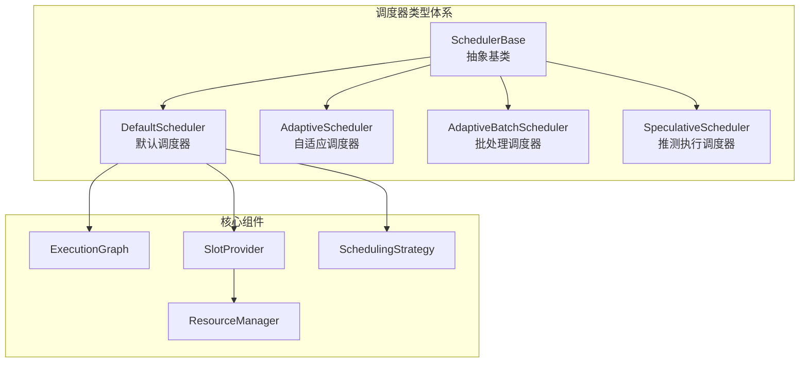
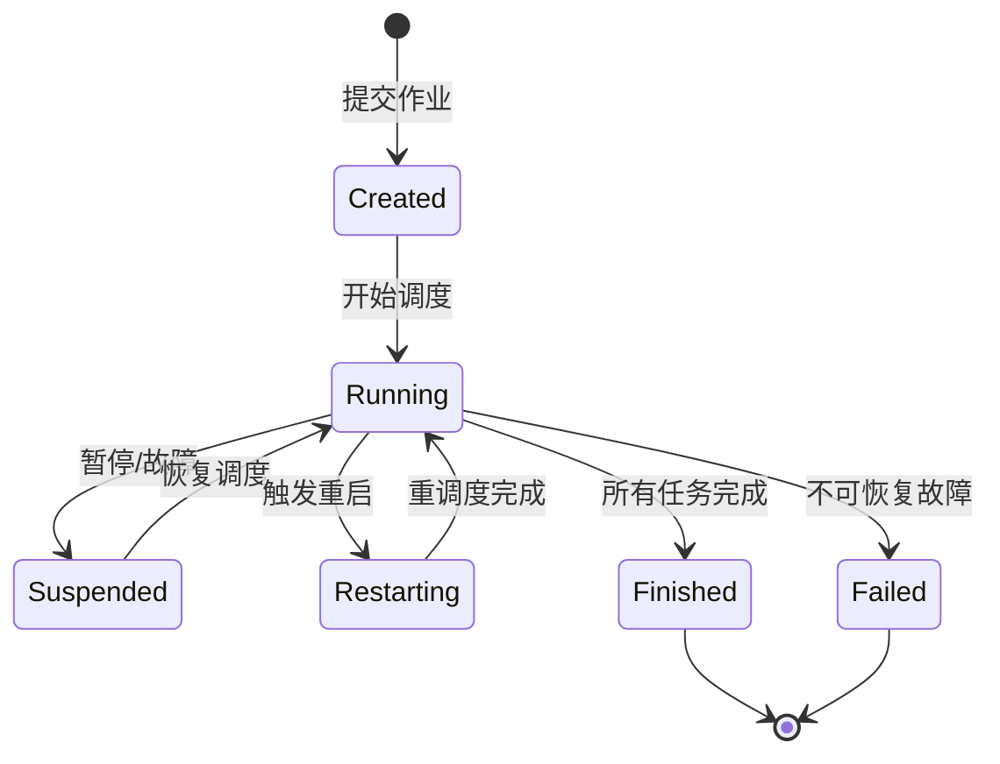
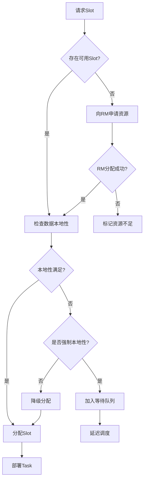
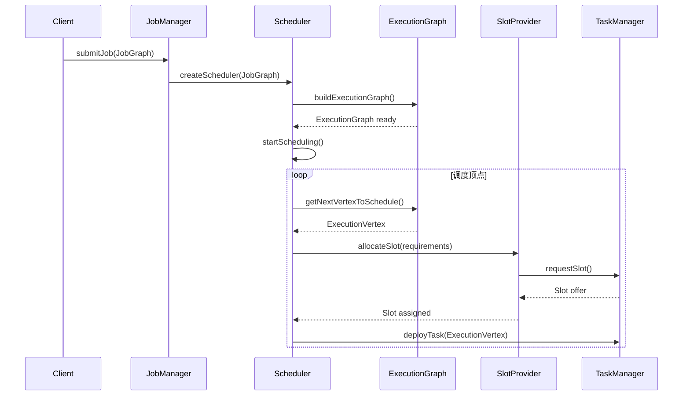
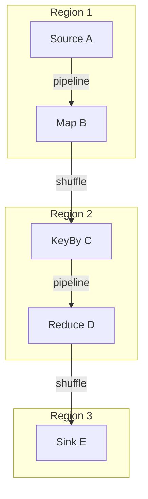
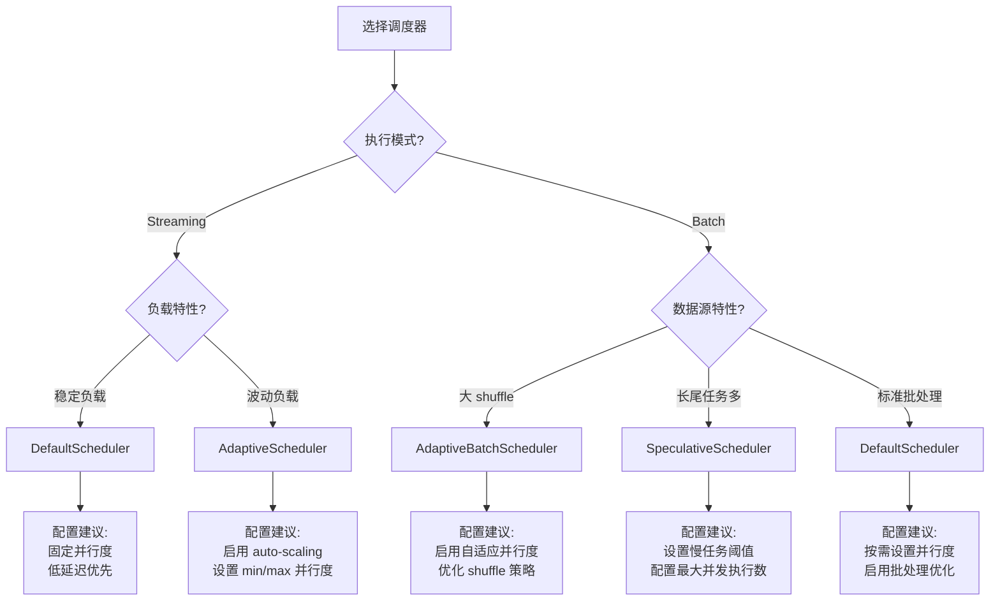
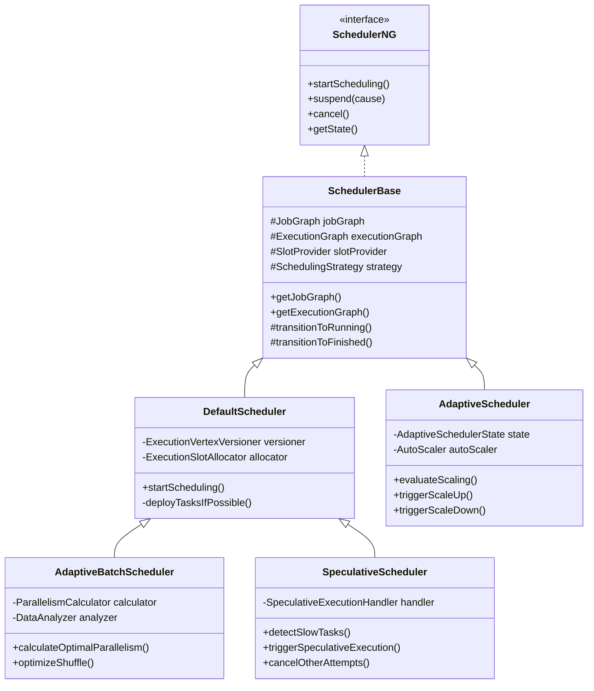
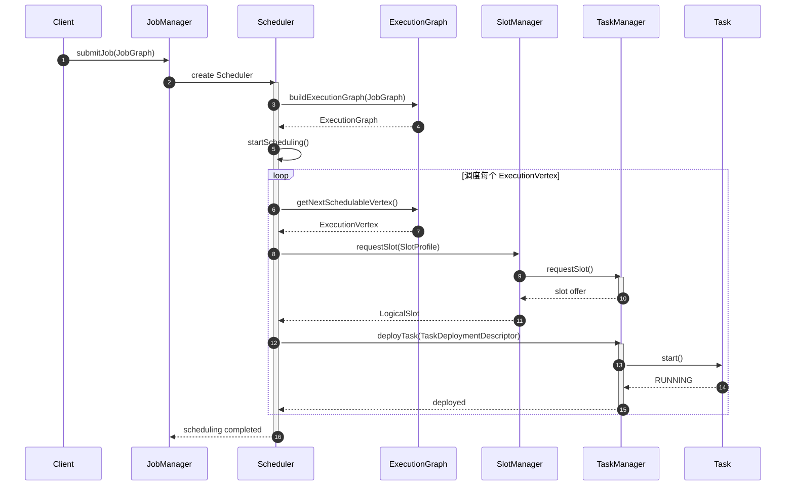
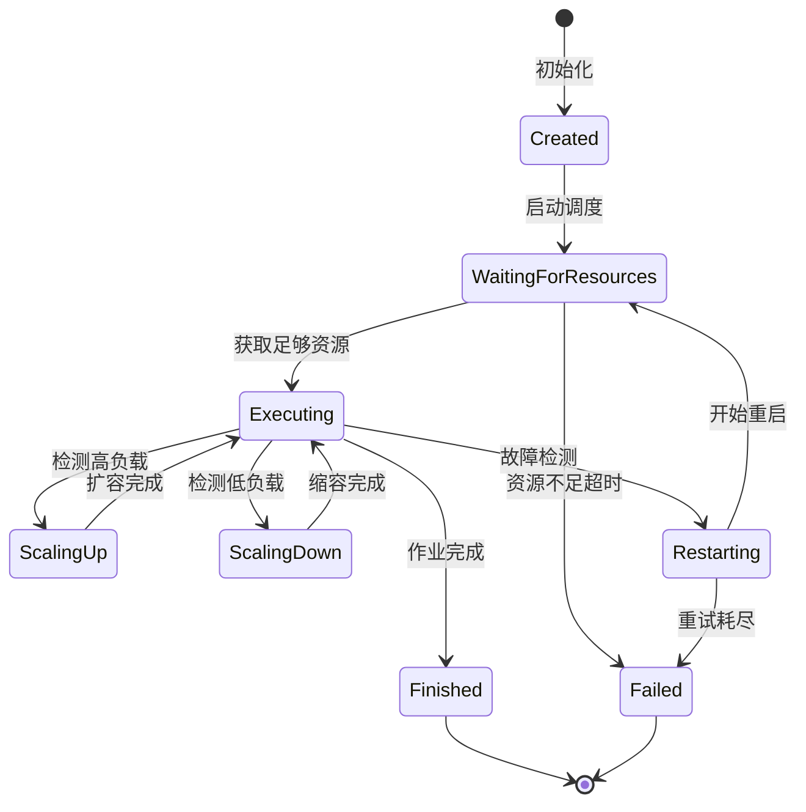
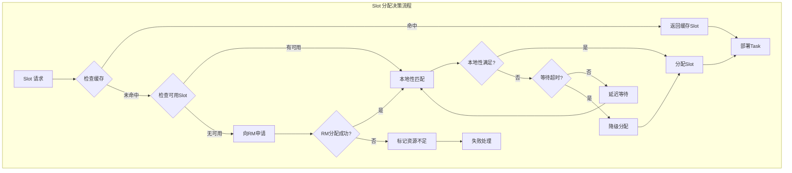

> **状态**: 🔮 前瞻内容 | **风险等级**: 高 | **最后更新**: 2026-04
>
> 此文档描述的内容处于早期规划阶段，可能与最终实现不符。请以 Apache Flink 官方发布为准。
>
# Flink 调度器源码深度分析

> **所属阶段**: Flink | **前置依赖**: [Flink 架构概述](../01-concepts/flink-architecture-evolution-1x-to-2x.md), [Checkpoint机制](../02-core/checkpoint-mechanism-deep-dive.md) | **形式化等级**: L4

---

## 1. 概念定义 (Definitions)

### Def-F-10-01: 调度器 (Scheduler)

**定义**: 调度器是 Flink Runtime 的核心组件，负责将逻辑执行计划（JobGraph）转换为物理执行计划（ExecutionGraph），并管理 Task 在集群资源上的分配、部署与执行。

**形式化描述**:
设 $J$ 为 JobGraph，$R$ 为集群资源集合，$S$ 为 Slot 集合，则调度器 $\mathcal{S}$ 可定义为映射：

$$\mathcal{S}: J \times R \rightarrow \{(e_i, s_j) \mid e_i \in \text{Execution}, s_j \in S\}$$

其中每个 Execution $e_i$ 被分配到一个 Slot $s_j$ 上执行。

### Def-F-10-02: ExecutionGraph

**定义**: ExecutionGraph 是 JobGraph 的并行化展开形式，表示作业执行的物理视图。它是一个有向无环图 $G = (V, E)$，其中：

- $V = \{v_{i,j} \mid 0 \leq i < n, 0 \leq j < p_i\}$ 表示所有 ExecutionVertex 集合，$n$ 为算子数量，$p_i$ 为第 $i$ 个算子的并行度
- $E \subseteq V \times V$ 表示 ExecutionEdge 集合，描述数据流依赖关系

### Def-F-10-03: Slot 与 SlotSharingGroup

**定义**:

- **Slot** ($s$): TaskManager 上的资源容器，具有固定的 CPU 和内存配额。形式化表示为 $s = (\text{cpu}, \text{mem}, \text{tm}_{id}, \text{loc})$。
- **SlotSharingGroup** ($ssg$): 允许不同 Task 共享同一 Slot 执行的逻辑分组。属于同一 $ssg$ 的 Task 可以调度到同一个 Slot 上串行执行。

### Def-F-10-04: 调度策略 (SchedulingStrategy)

**定义**: 调度策略 $\pi$ 是决定 ExecutionVertex 调度顺序的算法：

$$\pi: 2^V \rightarrow V^*$$

其中 $V^*$ 表示调度顺序序列。常见策略包括：

- **Eager**: 尽可能并行调度所有顶点
- **Lazy**: 按需调度（适用于批处理）
- **Pipelined**: 按数据流管道顺序调度

---

## 2. 属性推导 (Properties)

### Prop-F-10-01: 调度器类型的完备性

**命题**: Flink 2.x 调度器架构覆盖了流处理、批处理、自适应和推测执行四种主要场景。

**推导**:
设调度器类型空间为 $\mathcal{T}$，则：

$$\mathcal{T} = \{\text{Default}, \text{Adaptive}, \text{AdaptiveBatch}, \text{Speculative}\}$$

各调度器的适用场景满足：

- $\text{Default}: \text{Streaming} \land \text{StaticParallelism}$
- $\text{Adaptive}: \text{Streaming} \land \text{DynamicScaling}$
- $\text{AdaptiveBatch}: \text{Batch} \land \text{ShuffleOptimization}$
- $\text{Speculative}: \text{Batch} \land \text{StragglerMitigation}$

### Prop-F-10-02: Slot 本地性级别

**命题**: Flink 支持四级数据本地性优先级，优先级递减顺序为：

$$\text{LOCAL} > \text{HOST} > \text{RACK} > \text{OFF}$$

**推导**:
设任务数据位置为 $d$，Slot 位置为 $l$，则本地性得分函数为：

$$\text{locality}(d, l) = \begin{cases}
4 & \text{if } d = l \text{ (同一 JVM)} \\
3 & \text{if } \text{host}(d) = \text{host}(l) \text{ (同一主机)} \\
2 & \text{if } \text{rack}(d) = \text{rack}(l) \text{ (同一机架)} \\
1 & \text{otherwise} \text{ (跨机架)}
\end{cases}$$

### Prop-F-10-03: 故障恢复与调度重试

**命题**: 调度器支持可配置的故障恢复策略，重启策略满足幂等性。

**推导**:
设故障恢复次数为 $r$，最大重试次数为 $R_{max}$，则：

$$\forall r \leq R_{max}, \mathcal{S}_r(J) \cong \mathcal{S}_0(J)$$

其中 $\cong$ 表示执行语义等价，即重试后的调度结果与原语义一致。

### Lemma-F-10-01: Slot 分配的约束条件

**引理**: 有效的 Slot 分配必须满足以下约束：

1. **资源约束**: $\sum_{e \in s} \text{resource}(e) \leq \text{capacity}(s)$
2. **位置约束**: 若 $e$ 需要数据本地性，则 $\text{locality}(e, s) \geq \text{min_locality}$
3. **共享约束**: 若 $e_1, e_2 \in s$，则 $\text{coLocation}(e_1, e_2) \lor \text{slotSharingGroup}(e_1) = \text{slotSharingGroup}(e_2)$

---

## 3. 关系建立 (Relations)

### 3.1 调度器架构层次关系



### 3.2 调度器与执行模式映射

| 调度器类型 | 执行模式 | 并行度特性 | 主要优化目标 |
|-----------|---------|-----------|-------------|
| DefaultScheduler | Streaming | 静态 | 低延迟、高吞吐 |
| AdaptiveScheduler | Streaming | 动态伸缩 | 资源利用率 |
| AdaptiveBatchScheduler | Batch | 动态自适应 | 批处理优化、Shuffle效率 |
| SpeculativeScheduler | Batch | 静态+推测 | 长尾任务缓解 |

### 3.3 调度流程状态机



### 3.4 Slot 分配决策树



---

## 4. 论证过程 (Argumentation)

### 4.1 调度器设计的演进动机

**论证**: Flink 调度器从 1.x 到 2.x 的演进反映了流批一体架构的深化需求。

**分析**:
1. **1.x 时期**: DefaultScheduler 专注于流处理，批处理通过 DataSet API 单独实现
2. **1.12+**: 引入 AdaptiveScheduler 支持动态扩缩容，响应流式负载变化
3. **1.15+**: AdaptiveBatchScheduler 统一批处理调度，优化 Shuffle 和并行度自适应
4. **1.17+**: SpeculativeScheduler 解决批处理中的长尾问题

**结论**: 调度器架构演进遵循"流批统一 → 动态自适应 → 性能优化"的路径。

### 4.2 不同调度器的适用边界

**论证**: 四种调度器各有明确的适用边界，选择不当会导致性能问题。

**边界分析**:

| 调度器 | 适用场景 | 不适用场景 | 风险 |
|-------|---------|-----------|-----|
| DefaultScheduler | 稳定流作业 | 负载波动大 | 资源浪费或不足 |
| AdaptiveScheduler | 负载变化流作业 | 批处理 | 频繁扩缩容开销 |
| AdaptiveBatchScheduler | 大数据批处理 | 低延迟流处理 | 调度延迟高 |
| SpeculativeScheduler | 异构集群批处理 | 确定性流处理 | 资源竞争 |

### 4.3 Slot 共享的权衡分析

**论证**: SlotSharingGroup 提供了资源隔离与利用率之间的权衡机制。

**分析**:
- **完全共享**: 资源利用率高，但隔离性差，一个 Task 故障影响其他 Task
- **完全隔离**: 资源利用率低，但故障隔离性好
- **选择性共享**: Flink 的策略，将 pipeline 连接的 Task 放入同一 Slot，减少网络开销

**数学模型**:
设作业有 $n$ 个 Task，每个 Task 资源需求为 $r_i$，则：
- 完全隔离所需 Slot 数: $N_{isolated} = \sum_{i=1}^n p_i$ ( $p_i$ 为并行度)
- 完全共享所需 Slot 数: $N_{shared} = \max_i p_i$
- Flink 策略: $N_{flink}$ 满足 $\max_i p_i \leq N_{flink} \leq \sum_{i=1}^n p_i$

---

## 5. 形式证明 / 工程论证 (Proof / Engineering Argument)

### 5.1 核心类架构分析

#### 5.1.1 SchedulerBase - 调度器抽象基类

**源码位置**: `org.apache.flink.runtime.scheduler.SchedulerBase`

**核心职责**:
```java
public abstract class SchedulerBase implements SchedulerNG {
    // 核心组件
    protected final JobGraph jobGraph;
    protected final ExecutionGraph executionGraph;
    protected final SlotProvider slotProvider;
    protected final SchedulingStrategy schedulingStrategy;

    // 核心方法
    public abstract void startScheduling();
    public abstract void suspend(Throwable cause);
    public abstract void cancel();

    // 状态管理
    protected void transitionToRunning() { ... }
    protected void transitionToFinished() { ... }
}
```

**设计模式**: 模板方法模式 (Template Method Pattern)
- 定义调度生命周期骨架: `startScheduling() → deployTasks() → monitorExecution()`
- 子类实现具体调度策略

#### 5.1.2 DefaultScheduler - 默认调度器

**源码位置**: `org.apache.flink.runtime.scheduler.DefaultScheduler`

**核心实现**:
```java
public class DefaultScheduler extends SchedulerBase {
    private final ExecutionVertexVersioner executionVertexVersioner;
    private final ExecutionSlotAllocator executionSlotAllocator;
    private final DeploymentHandleFactory deploymentHandleFactory;

    @Override
    public void startScheduling() {
        // 1. 初始化 ExecutionGraph
        executionGraph.start(ComponentMainThreadExecutor);

        // 2. 启动调度策略
        schedulingStrategy.startScheduling();

        // 3. 开始部署任务
        deployTasksIfPossible();
    }

    private void deployTasksIfPossible() {
        // 获取可调度的 ExecutionVertex
        Set<ExecutionVertex> verticesToDeploy =
            schedulingStrategy.getVerticesToDeploy();

        // 分配 Slot 并部署
        for (ExecutionVertex vertex : verticesToDeploy) {
            allocateSlotAndDeploy(vertex);
        }
    }
}
```

**关键流程**:
1. **输入**: JobGraph + 配置参数
2. **转换**: JobGraph → ExecutionGraph (并行化展开)
3. **调度**: 按 SchedulingStrategy 顺序请求 Slot
4. **部署**: Slot 就绪后部署 Task
5. **监控**: 监听 Task 状态变化

#### 5.1.3 AdaptiveScheduler - 自适应调度器

**源码位置**: `org.apache.flink.runtime.scheduler.adaptive.AdaptiveScheduler`

**状态机实现**:
```java
public class AdaptiveScheduler extends SchedulerBase {
    // 自适应调度状态
    private enum State {
        Created,
        WaitingForResources,
        Executing,
        Restarting,
        Finished,
        Failed
    }

    // 自动扩缩容逻辑
    private void evaluateScaling() {
        if (shouldScaleUp()) {
            triggerScaleUp();
        } else if (shouldScaleDown()) {
            triggerScaleDown();
        }
    }

    private boolean shouldScaleUp() {
        // 检查背压指标
        return backPressureRatio > SCALE_UP_THRESHOLD;
    }
}
```

**自适应机制**:
- **监控指标**: 背压、吞吐量、延迟
- **决策逻辑**: 基于阈值和趋势预测
- **执行动作**: 动态调整并行度，申请/释放 Slot

#### 5.1.4 AdaptiveBatchScheduler - 批处理调度器

**源码位置**: `org.apache.flink.runtime.scheduler.adaptivebatch.AdaptiveBatchScheduler`

**批处理优化特性**:
```java
public class AdaptiveBatchScheduler extends DefaultScheduler {
    // 动态并行度推导
    private ParallelismCalculator parallelismCalculator;

    // 批处理专用优化
    @Override
    protected void initializeVertices() {
        // 1. 分析数据分布
        DataStatistics stats = analyzeDataDistribution();

        // 2. 计算最优并行度
        int optimalParallelism = parallelismCalculator.calculate(stats);

        // 3. 调整 ExecutionGraph
        adjustParallelism(optimalParallelism);
    }
}
```

#### 5.1.5 SpeculativeScheduler - 推测执行调度器

**源码位置**: `org.apache.flink.runtime.scheduler.speculative.SpeculativeScheduler`

**推测执行机制**:
```java
public class SpeculativeScheduler extends DefaultScheduler {
    private final SpeculativeExecutionHandler speculativeExecutionHandler;

    // 检测慢任务
    private void detectSlowTasks() {
        for (ExecutionVertex vertex : executionVertices) {
            if (isSlowTask(vertex)) {
                // 启动推测执行实例
                triggerSpeculativeExecution(vertex);
            }
        }
    }

    // 选择最快完成的实例
    private void onTaskComplete(ExecutionAttemptID id) {
        ExecutionVertex vertex = getVertex(id);
        if (hasSpeculativeAttempt(vertex)) {
            // 取消其他推测实例
            cancelOtherAttempts(vertex, id);
        }
    }
}
```

### 5.2 ExecutionGraph 调度机制

#### 5.2.1 ExecutionGraph 构建过程

```java
import java.util.List;

public class ExecutionGraph {
    // 构建阶段
    public void attachJobGraph(List<JobVertex> vertices) {
        // 1. 为每个 JobVertex 创建 ExecutionJobVertex
        for (JobVertex vertex : vertices) {
            ExecutionJobVertex ejv = new ExecutionJobVertex(
                this,
                vertex,
                vertex.getParallelism()
            );

            // 2. 为每个并行实例创建 ExecutionVertex
            for (int i = 0; i < vertex.getParallelism(); i++) {
                ExecutionVertex ev = new ExecutionVertex(
                    ejv,
                    i,
                    intermediateResults
                );
            }
        }

        // 3. 建立 ExecutionEdge 连接
        connectVertices();
    }
}
```

#### 5.2.2 调度触发流程



### 5.3 SlotProvider 与资源分配

#### 5.3.1 SlotProvider 接口设计

```java
public interface SlotProvider {
    // 同步分配（阻塞式）
    CompletableFuture<LogicalSlot> allocateSlot(
        SlotRequestId slotRequestId,
        ScheduledUnit scheduledUnit,
        SlotProfile slotProfile,
        Time allocationTimeout
    );

    // 取消分配
    void cancelSlotRequest(SlotRequestId slotRequestId);
}
```

#### 5.3.2 SlotProfile - 资源需求描述

```java
public class SlotProfile {
    private final ResourceProfile resourceProfile;
    private final Collection<TaskManagerLocation> preferredLocations;
    private final Collection<TaskManagerLocation> previousAllocations;
    private final SlotSharingGroupId slotSharingGroupId;

    // 本地性要求
    public Locality getLocalityRequirement() {
        return localityPreference;
    }
}
```

#### 5.3.3 资源匹配算法

```java
import java.util.Collection;

public class SlotSelectionStrategy {
    // 多维度资源匹配
    public Optional<SlotInfo> selectBestSlot(
        Collection<SlotInfo> availableSlots,
        SlotProfile requirements
    ) {
        return availableSlots.stream()
            .filter(slot -> satisfiesResource(slot, requirements))
            .filter(slot -> satisfiesLocality(slot, requirements))
            .max(Comparator.comparingInt(
                slot -> calculateScore(slot, requirements)
            ));
    }

    private int calculateScore(SlotInfo slot, SlotProfile req) {
        int score = 0;
        // 本地性得分
        score += localityScore(slot, req) * LOCALITY_WEIGHT;
        // 资源匹配度
        score += resourceMatchScore(slot, req) * RESOURCE_WEIGHT;
        // 负载均衡
        score += loadBalanceScore(slot) * BALANCE_WEIGHT;
        return score;
    }
}
```

### 5.4 调度算法详解

#### 5.4.1 延迟调度 (Delay Scheduling)

**原理**: 当数据本地性无法满足时，短暂等待以期望所需 Slot 变为可用，而非立即降级分配。

**实现**:
```java
public class DelayedSchedulingStrategy implements SchedulingStrategy {
    private static final Duration DELAY_THRESHOLD = Duration.ofMillis(50);

    @Override
    public Set<ExecutionVertex> getVerticesToDeploy() {
        Set<ExecutionVertex> ready = new HashSet<>();

        for (ExecutionVertex vertex : pendingVertices) {
            Optional<SlotInfo> preferred = findPreferredSlot(vertex);

            if (preferred.isPresent()) {
                ready.add(vertex);
            } else if (waitTimeFor(vertex) < DELAY_THRESHOLD) {
                // 继续等待
                scheduleRetry(vertex);
            } else {
                // 超时，降级分配
                ready.add(vertex);
            }
        }
        return ready;
    }
}
```

**数学模型**:
设等待时间为 $t$，本地性收益为 $L$，等待成本为 $C(t)$，则延迟调度的决策函数为：

$$\text{decision}(t) = \begin{cases}
\text{wait} & \text{if } t < t_{threshold} \land \mathbb{E}[L] > C(t) \\
\text{degrade} & \text{otherwise}
\end{cases}$$

#### 5.4.2 公平调度 (Fair Scheduling)

**原理**: 在多个作业之间公平分配资源，防止单一作业垄断集群。

**实现**:
```java
public class FairSchedulingStrategy extends DefaultSchedulingStrategy {
    private final Map<JobID, Double> jobWeights;
    private final Map<JobID, Integer> allocatedSlots;

    @Override
    public void allocateResources() {
        // 计算最小份额
        double totalWeight = jobWeights.values().stream().mapToDouble(Double::doubleValue).sum();

        for (JobID jobId : pendingJobs) {
            double fairShare = (jobWeights.get(jobId) / totalWeight) * totalSlots;
            int currentShare = allocatedSlots.getOrDefault(jobId, 0);

            if (currentShare < fairShare) {
                // 优先分配
                allocateSlotToJob(jobId);
            }
        }
    }
}
```

**公平性度量**: 使用最大最小公平性 (Max-Min Fairness)

$$\max \min_i \frac{x_i}{w_i}$$

其中 $x_i$ 为作业 $i$ 分配的资源，$w_i$ 为作业权重。

#### 5.4.3 容量调度 (Capacity Scheduling)

**原理**: 将集群资源划分为多个队列，每个队列有预设容量，支持资源抢占和弹性分配。

**实现**:
```java
public class CapacitySchedulingStrategy implements SchedulingStrategy {
    private final Map<String, QueueCapacity> queueCapacities;

    public void schedule() {
        for (String queue : queues) {
            QueueCapacity capacity = queueCapacities.get(queue);
            int used = getUsedCapacity(queue);
            int guaranteed = capacity.getGuaranteedCapacity();
            int max = capacity.getMaxCapacity();

            if (used < guaranteed) {
                // 满足保证容量
                allocateForQueue(queue, guaranteed - used);
            } else if (used < max && hasIdleResources()) {
                // 弹性分配
                allocateForQueue(queue, Math.min(
                    max - used,
                    getIdleResources()
                ));
            }
        }
    }
}
```

#### 5.4.4 本地性优先调度 (Locality-aware)

**原理**: 优先将任务调度到数据所在的节点，减少网络传输开销。

**实现**:
```java
public class LocalityAwareSlotSelectionStrategy implements SlotSelectionStrategy {
    @Override
    public Optional<SlotInfo> select(
        Collection<SlotInfo> candidates,
        SlotProfile requirements
    ) {
        // 按本地性级别分组
        Map<Locality, List<SlotInfo>> byLocality = candidates.stream()
            .collect(Collectors.groupingBy(
                slot -> computeLocality(slot, requirements)
            ));

        // 按优先级选择
        for (Locality locality : Locality.values()) {
            List<SlotInfo> slots = byLocality.get(locality);
            if (slots != null && !slots.isEmpty()) {
                return Optional.of(selectBestFrom(slots, requirements));
            }
        }
        return Optional.empty();
    }
}
```

**本地性计算**:
```java
private Locality computeLocality(SlotInfo slot, SlotProfile req) {
    TaskManagerLocation slotLoc = slot.getTaskManagerLocation();

    for (TaskManagerLocation preferred : req.getPreferredLocations()) {
        if (slotLoc.equals(preferred)) {
            return Locality.LOCAL;  // 同一 TM
        }
        if (slotLoc.getHostname().equals(preferred.getHostname())) {
            return Locality.HOST;   // 同一主机
        }
        if (sameRack(slotLoc, preferred)) {
            return Locality.RACK;   // 同一机架
        }
    }
    return Locality.OFF;  // 无本地性
}
```

### 5.5 故障恢复调度

#### 5.5.1 Failover 策略架构

```java
public interface FailoverStrategy {
    // 获取需要重启的顶点集合
    Set<ExecutionVertexID> getTasksNeedingRestart(
        ExecutionVertexID failedTask,
        Throwable cause
    );
}

// 全局重启
public class RestartAllStrategy implements FailoverStrategy {
    public Set<ExecutionVertexID> getTasksNeedingRestart(...) {
        // 重启所有顶点
        return allVertices;
    }
}

// 区域重启 (Region-based)
public class RestartPipelinedRegionStrategy implements FailoverStrategy {
    public Set<ExecutionVertexID> getTasksNeedingRestart(...) {
        // 只重启受影响的 Pipelined Region
        return getPipelinedRegion(failedTask);
    }
}
```

#### 5.5.2 Pipelined Region 故障恢复



**恢复流程**:
```java
public class FailoverCoordinator {
    public void onTaskFailure(ExecutionAttemptID failedTask, Throwable error) {
        // 1. 确定故障范围
        Set<ExecutionVertex> affected = failoverStrategy
            .getTasksNeedingRestart(failedTask);

        // 2. 取消受影响任务
        for (ExecutionVertex vertex : affected) {
            cancelExecution(vertex);
        }

        // 3. 等待取消完成
        waitForCancellation(affected);

        // 4. 重新调度
        for (ExecutionVertex vertex : affected) {
            Execution newAttempt = vertex.createNewExecutionAttempt();
            scheduleExecution(newAttempt);
        }
    }
}
```

#### 5.5.3 Checkpoint 恢复机制

```java
import java.util.Set;

public class CheckpointCoordinator {
    public boolean restoreLatestCheckpointedState(
        Set<ExecutionVertex> vertices,
        boolean allowNonRestoredState
    ) {
        // 1. 获取最新完成的 Checkpoint
        CompletedCheckpoint latest = completedCheckpointStore.getLatestCheckpoint();

        // 2. 验证状态兼容性
        if (!isCompatible(latest, vertices, allowNonRestoredState)) {
            return false;
        }

        // 3. 分配状态到 Execution
        for (ExecutionVertex vertex : vertices) {
            Map<OperatorID, OperatorState> operatorStates = latest.getOperatorStates();

            for (OperatorID opId : vertex.getOperatorIDs()) {
                OperatorState state = operatorStates.get(opId);
                if (state != null) {
                    vertex.getCurrentExecution().setInitialState(
                        state.getState(subtaskIndex)
                    );
                }
            }
        }
        return true;
    }
}
```

---

## 6. 实例验证 (Examples)

### 6.1 调度器配置示例

#### 6.1.1 DefaultScheduler 配置

```java

import org.apache.flink.streaming.api.environment.StreamExecutionEnvironment;
import org.apache.flink.streaming.api.windowing.time.Time;

// flink-conf.yaml
jobmanager.scheduler: default

// 程序配置
StreamExecutionEnvironment env =
    StreamExecutionEnvironment.getExecutionEnvironment();

// 设置调度模式
env.setRuntimeMode(RuntimeExecutionMode.STREAMING);

// 配置重启策略
env.setRestartStrategy(RestartStrategies.fixedDelayRestart(
    3,                    // 重试次数
    Time.seconds(10)      // 重试间隔
));
```

#### 6.1.2 AdaptiveScheduler 配置

```java
// flink-conf.yaml
jobmanager.scheduler: adaptive
scheduler-mode: reactive

// 扩缩容配置
scheduler.adaptive.scale-up.interval: 10s
scheduler.adaptive.scale-down.interval: 60s
scheduler.adaptive.min-parallelism: 1
scheduler.adaptive.max-parallelism: 128
```

#### 6.1.3 AdaptiveBatchScheduler 配置

```java

import org.apache.flink.streaming.api.environment.StreamExecutionEnvironment;

// 批处理配置
StreamExecutionEnvironment env =
    StreamExecutionEnvironment.getExecutionEnvironment();
env.setRuntimeMode(RuntimeExecutionMode.BATCH);

// 启用自适应批处理调度
Configuration config = new Configuration();
config.set(JobManagerOptions.SCHEDULER, "AdaptiveBatch");

// 配置动态并行度
config.set(BatchExecutionOptions.ADAPTIVE_AUTO_PARALLELISM_ENABLED, true);
config.set(BatchExecutionOptions.ADAPTIVE_AUTO_PARALLELISM_MIN_PARALLELISM, 1);
config.set(BatchExecutionOptions.ADAPTIVE_AUTO_PARALLELISM_MAX_PARALLELISM, 1000);
```

#### 6.1.4 SpeculativeScheduler 配置

```java
// flink-conf.yaml
jobmanager.scheduler: speculative

// 推测执行配置
speculative.execution.enabled: true
speculative.execution.max-concurrent-executions: 2
speculative.execution.batch-slow-task-threshold: 1.5
speculative.execution.batch-slow-task-detection-threshold: 100
```

### 6.2 Slot 分配策略配置

#### 6.2.1 数据本地性配置

```java
// 强制本地性
slot.request.timeout: 300000  // 5分钟
scheduler.locality-recover-on-start: true

// 程序中设置
ExecutionConfig config = env.getConfig();
config.setAutoTypeRegistrationEnabled(true);
```

#### 6.2.2 Slot 共享组配置

```java

import org.apache.flink.streaming.api.datastream.DataStream;

DataStream<Event> source = env.addSource(new KafkaSource<>())
    .slotSharingGroup("source-group");

DataStream<Result> processed = source
    .map(new Deserializer())
    .keyBy(Event::getKey)
    .process(new StatefulProcessor())
    .slotSharingGroup("processing-group");

processed.addSink(new ElasticsearchSink<>())
    .slotSharingGroup("sink-group");
```

### 6.3 故障恢复配置示例

#### 6.3.1 区域重启配置

```java
// flink-conf.yaml
jobmanager.execution.failover-strategy: region
restart-strategy: fixed-delay
restart-strategy.fixed-delay.attempts: 10
restart-strategy.fixed-delay.delay: 10s

// 配置 Checkpoint
execution.checkpointing.interval: 30s
execution.checkpointing.mode: EXACTLY_ONCE
execution.checkpointing.max-concurrent-checkpoints: 1
```

#### 6.3.2 程序级故障恢复

```java

import org.apache.flink.streaming.api.environment.StreamExecutionEnvironment;
import org.apache.flink.streaming.api.windowing.time.Time;

StreamExecutionEnvironment env =
    StreamExecutionEnvironment.getExecutionEnvironment();

// 固定延迟重启
env.setRestartStrategy(RestartStrategies.fixedDelayRestart(
    5,                    // 5次重试
    Time.of(30, TimeUnit.SECONDS)
));

// 指数退避重启
env.setRestartStrategy(RestartStrategies.exponentialDelayRestart(
    Time.milliseconds(100),   // 初始延迟
    Time.milliseconds(10000), // 最大延迟
    1.5,                       // 指数倍数
    Time.milliseconds(50),    // 抖动
    Time.hours(1)             // 重置延迟时间
));
```

### 6.4 调度器选择决策树



---

## 7. 可视化 (Visualizations)

### 7.1 调度器类继承体系



### 7.2 调度流程时序图



### 7.3 自适应调度器状态机



### 7.4 Slot 分配决策矩阵



### 7.5 调度器性能对比雷达图

```mermaid
graph TB
    subgraph "调度器特性对比"
        direction TB

        Radar[" ```
         调度器性能雷达图 (相对值 1-10)

                     延迟敏感度
                        10
                         |
            故障恢复 8 --+-- 8 资源利用率
            恢复速度    /|\\    动态调整
                      / | \\
                   7 /  |  \\ 7
                    /   |   \\
        可预测性 6 -----+----- 9 批处理优化
                   \\   |   /
                    \\  |  / 6
                   5 \\ | / 推测执行
            流处理优化  \\+/  效率
                        8
         ```

        Legend["
        DefaultScheduler:    [●●●○○●●●○○] 流处理强
        AdaptiveScheduler:   [●●○●●○○○○○] 自适应强
        AdaptiveBatch:       [○○○●●●●●○○] 批处理强
        SpeculativeScheduler:[○○○●○○○○●●] 推测执行强

        维度: 延迟/利用率/批优化/推测/流优化/可预测/恢复/动态
        "]
    end
```

---

## 8. 引用参考 (References)

[^1]: Apache Flink Documentation, "Scheduler", 2025. https://nightlies.apache.org/flink/flink-docs-stable/docs/internals/job_scheduling/

[^2]: Apache Flink Source Code, `org.apache.flink.runtime.scheduler` package, GitHub, 2025. https://github.com/apache/flink/tree/main/flink-runtime/src/main/java/org/apache/flink/runtime/scheduler

[^3]: Apache Flink FLIP-160, "Adaptive Batch Scheduler", 2022. https://github.com/apache/flink/blob/main/flink-docs/docs/flips/FLIP-160.md

[^4]: Apache Flink FLIP-168, "Speculative Execution for Batch Jobs", 2022. https://github.com/apache/flink/blob/main/flink-docs/docs/flips/FLIP-168.md

[^5]: Apache Flink FLIP-138, "Declarative Resource Management", 2020. https://github.com/apache/flink/blob/main/flink-docs/docs/flips/FLIP-138.md

[^6]: Zaharia, M., et al. "Delay Scheduling: A Simple Technique for Achieving Locality and Fairness in Cluster Scheduling." EuroSys 2010.

[^7]: Ghodsi, A., et al. "Dominant Resource Fairness: Fair Allocation of Multiple Resource Types." NSDI 2011.

[^8]: Apache Hadoop YARN Documentation, "Capacity Scheduler", https://hadoop.apache.org/docs/stable/hadoop-yarn/hadoop-yarn-site/CapacityScheduler.html

[^9]: Flink Forward 2023, "Deep Dive into Flink's Adaptive Scheduler", Presented by Apache Flink Committers.

[^10]: Carbone, P., et al. "Apache Flink: Stream and Batch Processing in a Single Engine." IEEE Data Engineering Bulletin, 2015.

---

## 附录 A: 源码关键类索引

| 类名 | 包路径 | 核心功能 |
|-----|-------|---------|
| SchedulerBase | `org.apache.flink.runtime.scheduler` | 调度器抽象基类 |
| DefaultScheduler | `org.apache.flink.runtime.scheduler` | 默认调度器实现 |
| AdaptiveScheduler | `org.apache.flink.runtime.scheduler.adaptive` | 自适应调度器 |
| AdaptiveBatchScheduler | `org.apache.flink.runtime.scheduler.adaptivebatch` | 自适应批处理调度器 |
| SpeculativeScheduler | `org.apache.flink.runtime.scheduler.speculative` | 推测执行调度器 |
| ExecutionGraph | `org.apache.flink.runtime.executiongraph` | 执行图 |
| ExecutionVertex | `org.apache.flink.runtime.executiongraph` | 执行顶点 |
| ExecutionEdge | `org.apache.flink.runtime.executiongraph` | 执行边 |
| SlotProvider | `org.apache.flink.runtime.jobmaster.slotpool` | Slot 提供接口 |
| PhysicalSlotProvider | `org.apache.flink.runtime.jobmaster.slotpool` | 物理 Slot 提供 |
| SchedulingStrategy | `org.apache.flink.runtime.scheduler.strategy` | 调度策略接口 |
| PipelinedRegionSchedulingStrategy | `org.apache.flink.runtime.scheduler.strategy` | 管道区域调度 |
| SlotSelectionStrategy | `org.apache.flink.runtime.jobmaster.slotpool` | Slot 选择策略 |
| LocationPreferenceSlotSelectionStrategy | `org.apache.flink.runtime.jobmaster.slotpool` | 本地性优先策略 |
| DefaultExecutionDeployer | `org.apache.flink.runtime.scheduler` | 任务部署器 |
| FailoverStrategy | `org.apache.flink.runtime.executiongraph.failover` | 故障恢复策略 |
| RestartPipelinedRegionStrategy | `org.apache.flink.runtime.executiongraph.failover` | 区域重启策略 |

---

## 附录 B: 调度器版本演进

| Flink 版本 | 调度器特性 | 主要改进 |
|-----------|-----------|---------|
| 1.0-1.11 | DefaultScheduler | 基础流处理调度 |
| 1.12 | AdaptiveScheduler (Preview) | 引入动态扩缩容 |
| 1.14 | AdaptiveScheduler (GA) | 自适应调度稳定版 |
| 1.15 | AdaptiveBatchScheduler | 批处理自适应调度 |
| 1.17 | SpeculativeScheduler | 推测执行支持 |
| 1.19+ | 统一调度框架 | 流批调度统一架构 |

---

*文档版本: v1.0 | 创建日期: 2026-04-11 | 最后更新: 2026-04-11*
