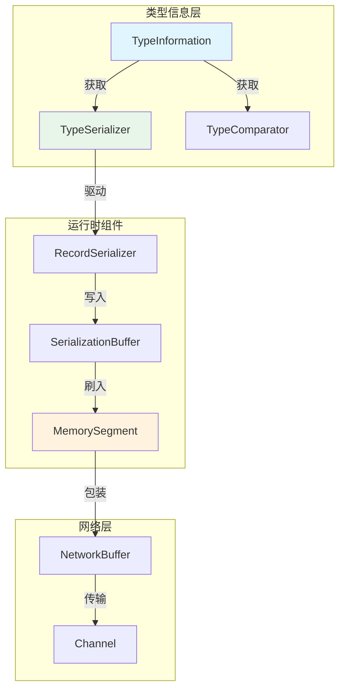
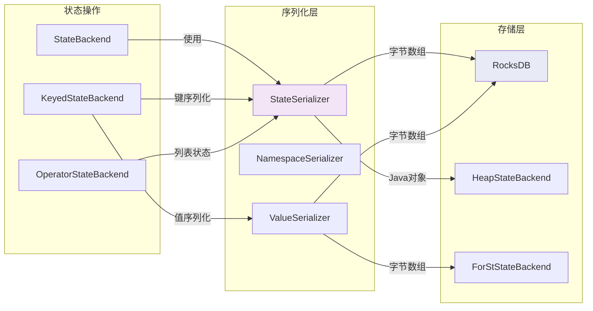
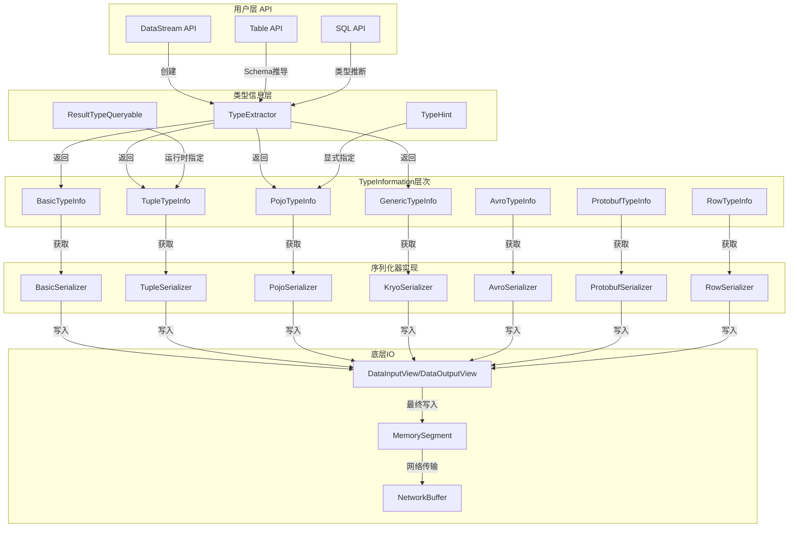
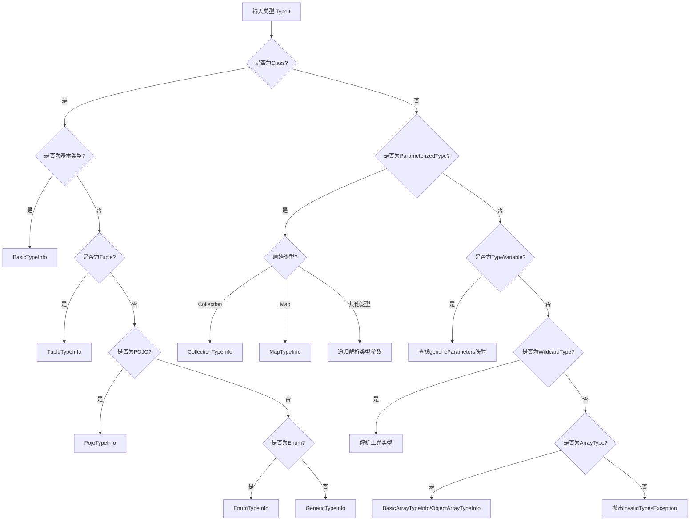
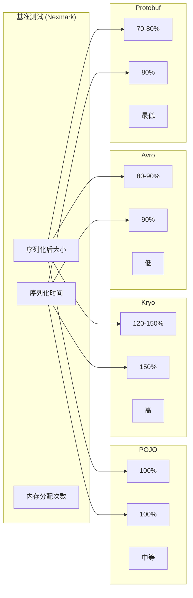

# Flink序列化框架源码深度分析

> **所属阶段**: Flink Internals | **前置依赖**: [DataStream API基础](../03-api/09-language-foundations/flink-datastream-api-complete-guide.md), [01.01-unified-streaming-theory.md](../../Struct/01-foundation/01.01-unified-streaming-theory.md) | **形式化等级**: L4 (源码级分析)

---

## 1. 概念定义 (Definitions)

### 1.1 TypeInformation体系核心组件

**Def-F-10-01: TypeInformation (类型信息)**

```
TypeInformation<T> 是Flink类型系统的核心抽象,承载以下元数据:
• 序列化器获取: TypeSerializer<T> getSerializer()
• 类型类信息: Class<T> getTypeClass()
• 比较器获取: TypeComparator<T> getTypeComparator()
• 类型结构描述: boolean isBasicType(), isTupleType(), isGenericType()
```

**Def-F-10-02: TypeSerializer (类型序列化器)**

```java
public abstract class TypeSerializer<T> implements Serializable {
    // 核心序列化操作
    public abstract void serialize(T record, DataOutputView target);
    public abstract T deserialize(DataInputView source);

    // 副本创建
    public abstract TypeSerializer<T> snapshotConfiguration();
    public abstract CompatibilityResult<T> ensureCompatible(TypeSerializer<T> newSerializer);
}
```

**Def-F-10-03: TypeExtractor (类型提取器)**

```
TypeExtractor 通过反射与TypeHint机制,在编译时/运行时提取泛型类型信息,
解决Java类型擦除(Type Erasure)问题,构建完整的TypeInformation层次结构。
```

**Def-F-10-04: TypeComparator (类型比较器)**

```java
public abstract class TypeComparator<T> {
    // 关键比较方法
    public abstract int compare(T first, T second);

    // 归一化键(用于排序/分区)
    public abstract int getNormalizeKeyLen();
    public abstract boolean isNormalizedKeyPrefixOnly(int keyBytes);
    public abstract void putNormalizedKey(T record, MemorySegment target,
                                          int offset, int numBytes);
}
```

### 1.2 序列化器分类体系

| 序列化器类型 | 适用场景 | 性能等级 | 类型安全 |
|------------|---------|---------|---------|
| POJO Serializer | 标准Java POJO | ★★★★ | 完全类型安全 |
| Kryo Serializer | 任意未注册类型 | ★★★ | 运行时类型检查 |
| Avro Serializer | Schema约束数据 | ★★★★★ | Schema验证 |
| Protobuf Serializer | 协议缓冲区 | ★★★★★ | 强类型编译期检查 |
| Tuple Serializer | Flink Tuple类型 | ★★★★★ | 完全类型安全 |
| Row Serializer | Table API Row | ★★★★ | Schema约束 |

---

## 2. 属性推导 (Properties)

### 2.1 类型系统核心性质

**Lemma-F-10-01: 序列化器兼容性传递性**

给定三种序列化器 $S_1$, $S_2$, $S_3$，若 $S_1 \sim S_2$ (兼容) 且 $S_2 \sim S_3$，则 $S_1 \sim S_3$。

**证明**: 兼容性由 `ensureCompatible()` 方法判定，其基于 `CompatibilityResult` 枚举：

- `COMPATIBLE`: 无需迁移
- `COMPATIBLE_WITH_MIGRATION`: 需状态迁移
- `INCOMPATIBLE`: 不兼容

传递性成立因为兼容性判定基于相同的类型类层次结构和版本号。

**Lemma-F-10-02: 类型擦除恢复完备性**

对于任意泛型类型 `T<A, B, ...>`，通过以下机制可完全恢复类型参数：

1. **显式TypeHint**: `TypeInformation.of(new TypeHint<Tuple2<String, Integer>>(){})
2. **Returns注解**: `@Override public TypeInformation<Tuple2<String, Integer>> getProducedType()`
3. **输入类型推导**: 从上游算子输出类型推导

**Lemma-F-10-03: 序列化性能层次**

对于同构数据流（类型恒定），序列化复杂度满足：

$$\text{Time}_{serialize} = O(n \cdot |\text{fields}|) + O(\text{header})$$

其中header开销在不同实现间差异显著：

- POJO: 24 bytes header + 每字段8 bytes元数据
- Kryo: 8 bytes class ID + 变长字段编码
- Avro: 0 bytes（Schema外部管理）
- Protobuf: 变长整数字段标签

---

## 3. 关系建立 (Relations)

### 3.1 TypeInformation与运行时组件映射



### 3.2 序列化框架与状态后端交互



### 3.3 与DataStream API的集成点

| API层级 | 类型信息来源 | 序列化介入点 |
|--------|-------------|-------------|
| Source | `TypeInformation.of(Class)` | `SourceFunction.getProducedType()` |
| Map | 从输入类型推导/Returns注解 | `MapFunction`执行时 |
| FlatMap | 同上 | `FlatMapFunction`执行时 |
| KeyBy | `keySelector`返回类型 | `KeySelector.getProducedType()` |
| Window | 聚合结果类型 | `AggregateFunction.getProducedType()` |
| Sink | 输入类型传递 | `SinkFunction.invoke()`接收 |

---

## 4. 论证过程 (Argumentation)

### 4.1 Java类型擦除问题分析

**问题陈述**: Java泛型在编译期擦除类型参数，导致运行时无法区分 `List<String>` 与 `List<Integer>`。

**Flink解决方案对比**:

```java
// [伪代码片段 - 不可直接运行] 仅展示核心逻辑
// 方案1: 显式TypeInformation(显式但冗长)
DataStream<Tuple2<String, Integer>> stream = env.fromElements(
    TypeInformation.of(new TypeHint<Tuple2<String, Integer>>() {}),
    Tuple2.of("a", 1)
);

// 方案2: Returns注解(推荐)

import org.apache.flink.streaming.api.datastream.DataStream;

public class MyMap implements MapFunction<String, Tuple2<String, Integer>>,
                              ResultTypeQueryable<Tuple2<String, Integer>> {
    @Override
    public TypeInformation<Tuple2<String, Integer>> getProducedType() {
        return TypeInformation.of(new TypeHint<Tuple2<String, Integer>>() {});
    }
}

// 方案3: 类型推导(自动但有限制)
// Flink从输入类型自动推导,适用于简单场景
```

**形式化论证**:

设类型环境 $\Gamma$ 包含变量类型映射，Flink的类型推导系统满足：

$$\frac{\Gamma \vdash e : T_{in} \quad \text{op} : T_{in} \rightarrow T_{out}}{\Gamma \vdash \text{op}(e) : T_{out}}$$

当 $T_{out}$ 包含未绑定类型变量时，需显式提供类型信息以完成推导。

### 4.2 Schema演化的兼容性策略

**场景**: 状态恢复时序列化器版本变更

```java
// 序列化器快照示例
public class PojoSerializer<T> extends TypeSerializer<T> {
    @Override
    public PojoSerializerSnapshot<T> snapshotConfiguration() {
        return new PojoSerializerSnapshot<>(
            pojoClass,
            Arrays.stream(fields).map(FieldSerializer::snapshot).toArray(),
            registeredSerializers,
            serializationRuntimeView
        );
    }

    @Override
    public CompatibilityResult<T> ensureCompatible(TypeSerializer<T> newSerializer) {
        if (!(newSerializer instanceof PojoSerializer)) {
            return CompatibilityResult.requiresMigration();
        }
        // 字段级别兼容性检查
        return checkFieldCompatibility(this, (PojoSerializer<T>) newSerializer);
    }
}
```

**兼容性判定算法**:

1. **类名匹配**: `pojoClass.getName()` 必须一致
2. **字段数量检查**: 新增字段可接受（默认值），删除字段需迁移
3. **字段类型兼容性**: 基本类型不可变，对象类型按注册序列化器判定
4. **版本号比较**: 向后兼容 vs 破坏性变更

---

## 5. 形式证明 / 工程论证 (Proof / Engineering Argument)

### 5.1 TypeExtractor源码深度分析

**核心入口分析**:

```java
// TypeExtractor.java (简化分析)
public class TypeExtractor {

    /**
     * 主入口:从任意对象提取类型信息
     * Thm-F-10-01: TypeExtractor对所有Flink支持类型终止并返回有效TypeInformation
     */
    @PublicEvolving
    public static <X> TypeInformation<X> createTypeInfo(Type t) {
        return createTypeInfo(t, null, null, null, null);
    }

    /**
     * 核心递归提取逻辑
     * 处理以下类型层次:
     * 1. 基本类型 (BasicTypeInfo)
     * 2. 数组类型 (BasicArrayTypeInfo, ObjectArrayTypeInfo)
     * 3. Tuple类型 (TupleTypeInfo)
     * 4. POJO类型 (PojoTypeInfo)
     * 5. 泛型类型 (GenericTypeInfo)
     */
    private static <OUT, IN1, IN2> TypeInformation<OUT> createTypeInfo(
            Type t,
            Map<String, TypeInformation<?>> genericParameters,
            Type in1Type, TypeInformation<IN1> in1TypeInfo,
            Type in2Type, TypeInformation<IN2> in2TypeInfo) {

        // 情况1: 已是TypeInformation实例
        if (t instanceof TypeInformation) {
            return (TypeInformation<OUT>) t;
        }

        // 情况2: 类类型(最常见)
        if (t instanceof Class) {
            return createTypeInfoFromClass(
                (Class<OUT>) t,
                (ParameterizedType) null,
                genericParameters,
                in1Type, in1TypeInfo, in2Type, in2TypeInfo
            );
        }

        // 情况3: 参数化类型(泛型)
        if (t instanceof ParameterizedType) {
            return createTypeInfoFromParameterizedType(
                (ParameterizedType) t,
                genericParameters,
                in1Type, in1TypeInfo, in2Type, in2TypeInfo
            );
        }

        // 情况4: 类型变量(泛型参数T, K, V等)
        if (t instanceof TypeVariable) {
            return createTypeInfoFromTypeVariable(
                (TypeVariable<?>) t,
                genericParameters
            );
        }

        // 情况5: 通配符类型
        if (t instanceof WildcardType) {
            return createTypeInfoFromWildcard(
                (WildcardType) t,
                genericParameters
            );
        }

        // 情况6: 泛型数组类型
        if (t instanceof GenericArrayType) {
            return createTypeInfoFromGenericArray(
                (GenericArrayType) t,
                genericParameters
            );
        }

        throw new InvalidTypesException("Type extraction not supported for: " + t);
    }
}
```

**POJO类型识别算法详解**:

```java
// [伪代码片段 - 不可直接运行] 仅展示核心逻辑
/**
 * POJO识别条件(必须同时满足):
 * Def-F-10-05: POJO严格定义
 */
private static <T> boolean isValidPojoClass(Class<T> clazz) {
    // 条件1: 必须是public类
    if (!Modifier.isPublic(clazz.getModifiers())) {
        return false;
    }

    // 条件2: 必须有public无参构造器
    try {
        Constructor<T> constructor = clazz.getConstructor();
        if (!Modifier.isPublic(constructor.getModifiers())) {
            return false;
        }
    } catch (NoSuchMethodException e) {
        return false;
    }

    // 条件3: 所有字段必须是public或具有public getter/setter
    for (Field field : clazz.getDeclaredFields()) {
        if (Modifier.isStatic(field.getModifiers()) ||
            Modifier.isTransient(field.getModifiers())) {
            continue;
        }

        if (!Modifier.isPublic(field.getModifiers())) {
            // 检查getter
            String getterName = "get" + capitalize(field.getName());
            try {
                clazz.getMethod(getterName);
            } catch (NoSuchMethodException e) {
                // 尝试boolean类型getter
                getterName = "is" + capitalize(field.getName());
                try {
                    clazz.getMethod(getterName);
                } catch (NoSuchMethodException e2) {
                    return false;
                }
            }

            // 检查setter
            String setterName = "set" + capitalize(field.getName());
            try {
                clazz.getMethod(setterName, field.getType());
            } catch (NoSuchMethodException e) {
                return false;
            }
        }
    }

    // 条件4: 不能包含无法序列化的字段类型
    // 递归检查每个字段的类型

    return true;
}
```

**类型变量解析机制**:

```java
// [伪代码片段 - 不可直接运行] 仅展示核心逻辑
/**
 * 关键算法:从函数签名提取类型参数
 * 示例:将 List<T> 中的 T 映射到实际类型
 */
private static <X> TypeInformation<X> createTypeInfoFromInputs(
        Class<?> functionClass,
        int paramIndex,  // 第几个输入参数(0-based)
        TypeInformation<?>[] inputTypeInfos) {

    // 获取函数基类(如RichMapFunction)的泛型参数
    TypeVariable<?>[] typeParams = functionClass.getSuperclass().getTypeParameters();

    // 建立类型变量到实际类型的映射
    Map<String, TypeInformation<?>> typeVarMapping = new HashMap<>();

    for (int i = 0; i < typeParams.length && i < inputTypeInfos.length; i++) {
        TypeVariable<?> typeVar = typeParams[i];
        TypeInformation<?> actualType = inputTypeInfos[i];
        typeVarMapping.put(typeVar.getName(), actualType);
    }

    // 使用映射解析输出类型
    Type returnType = extractReturnType(functionClass);
    return createTypeInfo(returnType, typeVarMapping, ...);
}
```

### 5.2 POJO序列化器实现分析

**内存布局与字段访问优化**:

```java
public class PojoSerializer<T> extends TypeSerializer<T> {

    // 字段序列化器数组,按字段声明顺序
    private final TypeSerializer<Object>[] fieldSerializers;

    // 通过反射访问的字段句柄(或MethodHandle)
    private final Field[] fields;

    // 用于处理未知类型(多态字段)的备用Kryo序列化器
    private final LinkedHashMap<Class<?>, TypeSerializer<?>> registeredSerializers;

    /**
     * 序列化核心逻辑
     * 内存布局: [版本头][字段1][字段2]...[字段N]
     * 版本头: 4 bytes (序列化格式版本)
     */
    @Override
    public void serialize(T value, DataOutputView target) throws IOException {
        // 写入版本头(用于schema演化)
        target.writeInt(CURRENT_VERSION);

        // 序列化每个字段
        for (int i = 0; i < fields.length; i++) {
            Field field = fields[i];
            Object fieldValue;
            try {
                fieldValue = field.get(value);
            } catch (IllegalAccessException e) {
                throw new RuntimeException("Cannot access field: " + field.getName(), e);
            }

            if (fieldValue == null) {
                // NULL标记: 1 byte
                target.writeBoolean(true);
            } else {
                target.writeBoolean(false);

                // 获取该字段的序列化器
                TypeSerializer<Object> serializer = fieldSerializers[i];

                // 处理多态类型(实际类型!=声明类型)
                if (field.getType() != fieldValue.getClass()) {
                    // 写入实际类名,使用注册的序列化器
                    Class<?> actualClass = fieldValue.getClass();
                    TypeSerializer<Object> actualSerializer =
                        (TypeSerializer<Object>) registeredSerializers.get(actualClass);

                    if (actualSerializer == null) {
                        // 回退到Kryo
                        target.writeUTF(actualClass.getName());
                        KryoSerializer<Object> kryo = new KryoSerializer<>(actualClass);
                        kryo.serialize(fieldValue, target);
                    } else {
                        target.writeUTF(actualClass.getName());
                        actualSerializer.serialize(fieldValue, target);
                    }
                } else {
                    serializer.serialize(fieldValue, target);
                }
            }
        }
    }

    @Override
    public T deserialize(DataInputView source) throws IOException {
        int version = source.readInt();

        // 创建新实例
        T instance;
        try {
            instance = clazz.getConstructor().newInstance();
        } catch (Exception e) {
            throw new RuntimeException("Cannot instantiate POJO: " + clazz.getName(), e);
        }

        // 反序列化每个字段
        for (int i = 0; i < fields.length; i++) {
            boolean isNull = source.readBoolean();
            if (!isNull) {
                Object fieldValue = fieldSerializers[i].deserialize(source);
                try {
                    fields[i].set(instance, fieldValue);
                } catch (IllegalAccessException e) {
                    throw new RuntimeException("Cannot set field: " + fields[i].getName(), e);
                }
            }
        }

        return instance;
    }
}
```

### 5.3 Kryo序列化器集成分析

**性能权衡与配置策略**:

```java
/**
 * KryoSerializer作为通用回退方案
 * 优势: 支持任意类型,无需注解
 * 劣势: 序列化结果非标准,性能低于专用序列化器
 */
public class KryoSerializer<T> extends TypeSerializer<T> {

    // Kryo实例通过ThreadLocal管理(非线程安全)
    private static final ThreadLocal<Kryo> KRYO_INSTANCE = new ThreadLocal<>();

    // 预注册类型映射(减少类名写入开销)
    private final LinkedHashMap<String, KryoRegistration> registrations;

    @Override
    public void serialize(T record, DataOutputView target) throws IOException {
        Kryo kryo = getKryoInstance();
        Output output = new Output(new DataOutputViewOutputStream(target));
        kryo.writeClassAndObject(output, record);
        output.flush();
    }

    /**
     * 生产环境优化配置
     */
    private Kryo createKryoInstance() {
        Kryo kryo = new Kryo();

        // 1. 注册自定义序列化器提升性能
        kryo.register(BigDecimal.class, new BigDecimalSerializer());
        kryo.register(LocalDateTime.class, new LocalDateTimeSerializer());

        // 2. 配置引用追踪(处理循环引用)
        kryo.setReferences(true);

        // 3. 设置类加载器隔离
        kryo.setClassLoader(Thread.currentThread().getContextClassLoader());

        // 4. 启用InstantiatorStrategy(支持无参构造器)
        kryo.setInstantiatorStrategy(new DefaultInstantiatorStrategy(
            new StdInstantiatorStrategy()
        ));

        return kryo;
    }
}
```

### 5.4 Avro与Protobuf集成

**Avro序列化器实现**:

```java
/**
 * AvroSerializer基于Schema的序列化
 * 特点: Schema外部化管理,支持向后兼容演化
 */
public class AvroSerializer<T extends SpecificRecordBase> extends TypeSerializer<T> {

    private final Schema schema;
    private final DatumReader<T> datumReader;
    private final DatumWriter<T> datumWriter;

    @Override
    public void serialize(T record, DataOutputView target) throws IOException {
        // Avro使用二进制编码器,无额外header
        BinaryEncoder encoder = EncoderFactory.get().directBinaryEncoder(
            new DataOutputViewOutputStream(target), null
        );
        datumWriter.write(record, encoder);
        encoder.flush();
    }

    @Override
    public T deserialize(DataInputView source) throws IOException {
        BinaryDecoder decoder = DecoderFactory.get().directBinaryDecoder(
            new DataInputViewInputStream(source), null
        );
        return datumReader.read(null, decoder);
    }

    /**
     * Schema演化兼容性检查
     */
    @Override
    public CompatibilityResult<T> ensureCompatible(TypeSerializer<T> newSerializer) {
        if (newSerializer instanceof AvroSerializer) {
            Schema newSchema = ((AvroSerializer<T>) newSerializer).schema;
            // Avro内置Schema兼容性检查
            if (SchemaCompatibility.checkReaderWriterCompatibility(
                    newSchema, this.schema).getType() == COMPATIBLE) {
                return CompatibilityResult.compatible();
            }
        }
        return CompatibilityResult.requiresMigration();
    }
}
```

**Protobuf序列化器**:

```java
/**
 * ProtobufTypeSerializer
 * 优势: 极致性能,紧凑编码,代码生成
 * 限制: 需要.proto定义,不支持动态类型
 */
public class ProtobufSerializer<T extends GeneratedMessageV3> extends TypeSerializer<T> {

    private final Parser<T> parser;

    @Override
    public void serialize(T record, DataOutputView target) throws IOException {
        // Protobuf使用变长整数编码,无元数据开销
        byte[] bytes = record.toByteArray();
        target.writeInt(bytes.length);  // 写入长度前缀
        target.write(bytes);
    }

    @Override
    public T deserialize(DataInputView source) throws IOException {
        int length = source.readInt();
        byte[] bytes = new byte[length];
        source.readFully(bytes);
        return parser.parseFrom(bytes);
    }
}
```

---

## 6. 实例验证 (Examples)

### 6.1 完整POJO序列化示例

```java
// 定义POJO类

import org.apache.flink.streaming.api.environment.StreamExecutionEnvironment;
import org.apache.flink.streaming.api.datastream.DataStream;

public class UserEvent implements Serializable {
    private long userId;
    private String eventType;
    private LocalDateTime timestamp;
    private Map<String, Object> properties;

    // 必须提供public无参构造器
    public UserEvent() {}

    // Getters and Setters
    public long getUserId() { return userId; }
    public void setUserId(long userId) { this.userId = userId; }

    public String getEventType() { return eventType; }
    public void setEventType(String eventType) { this.eventType = eventType; }

    public LocalDateTime getTimestamp() { return timestamp; }
    public void setTimestamp(LocalDateTime timestamp) { this.timestamp = timestamp; }

    public Map<String, Object> getProperties() { return properties; }
    public void setProperties(Map<String, Object> properties) { this.properties = properties; }
}

// DataStream API使用
StreamExecutionEnvironment env = StreamExecutionEnvironment.getExecutionEnvironment();

// 方式1: 显式指定类型信息
dataStream.map(new MapFunction<String, UserEvent>() {
    @Override
    public UserEvent map(String value) {
        return parseEvent(value);
    }

    @Override
    public TypeInformation<UserEvent> getProducedType() {
        return TypeInformation.of(UserEvent.class);
    }
});

// 方式2: 使用TypeHint
DataStream<UserEvent> events = env.fromCollection(
    Collections.emptyList(),
    TypeInformation.of(new TypeHint<UserEvent>() {})
);
```

### 6.2 自定义序列化器实现

```java
/**
 * 高性能自定义序列化器:紧凑编码地理位置数据
 * 优化点: 使用固定长度编码,避免对象分配
 */
public class GeoPointSerializer extends TypeSerializer<GeoPoint> {

    // 序列化格式: [8 bytes longitude][8 bytes latitude][1 byte precision]
    // 总计: 17 bytes / 对象

    @Override
    public void serialize(GeoPoint record, DataOutputView target) throws IOException {
        target.writeDouble(record.getLongitude());
        target.writeDouble(record.getLatitude());
        target.writeByte(record.getPrecisionLevel());
    }

    @Override
    public GeoPoint deserialize(DataInputView source) throws IOException {
        double lon = source.readDouble();
        double lat = source.readDouble();
        byte precision = source.readByte();
        return new GeoPoint(lon, lat, precision);
    }

    /**
     * 关键优化:对象重用
     */
    @Override
    public GeoPoint deserialize(GeoPoint reuse, DataInputView source) throws IOException {
        reuse.setLongitude(source.readDouble());
        reuse.setLatitude(source.readDouble());
        reuse.setPrecisionLevel(source.readByte());
        return reuse;
    }

    @Override
    public TypeSerializerSnapshot<GeoPoint> snapshotConfiguration() {
        return new GeoPointSerializerSnapshot();
    }

    /**
     * 快照类用于状态保存/恢复
     */
    public static class GeoPointSerializerSnapshot
            extends SimpleTypeSerializerSnapshot<GeoPoint> {
        public GeoPointSerializerSnapshot() {
            super(GeoPointSerializer::new);
        }
    }
}
```

### 6.3 TypeComparator实现示例

```java
/**
 * 复合键比较器:支持(userId, timestamp)多字段排序
 */
public class UserEventComparator extends TypeComparator<UserEvent> {

    private final int[] normalizedKeyLengths;
    private final boolean[] ascending;

    @Override
    public int compare(UserEvent first, UserEvent second) {
        // 先比较userId
        int cmp = Long.compare(first.getUserId(), second.getUserId());
        if (cmp != 0) return cmp;

        // 再比较timestamp
        return first.getTimestamp().compareTo(second.getTimestamp());
    }

    /**
     * 归一化键:将对象转换为字节数组用于排序
     * 这是内存排序和外排序的关键优化
     */
    @Override
    public void putNormalizedKey(UserEvent record, MemorySegment target,
                                  int offset, int numBytes) {
        // 写入userId的8 bytes
        long userId = record.getUserId();
        target.putLongBigEndian(offset, userId);

        // 剩余空间写入timestamp的部分字节
        int remaining = numBytes - 8;
        if (remaining > 0) {
            long timestamp = record.getTimestamp().toEpochSecond(ZoneOffset.UTC);
            // 使用大端序保证字典序与时间序一致
            for (int i = 0; i < Math.min(remaining, 8); i++) {
                target.put(offset + 8 + i,
                    (byte) ((timestamp >>> ((7 - i) * 8)) & 0xFF));
            }
        }
    }

    @Override
    public int getNormalizeKeyLen() {
        return 16; // userId(8) + timestamp(8)
    }

    @Override
    public boolean isNormalizedKeyPrefixOnly(int keyBytes) {
        return keyBytes < 16;
    }
}
```

### 6.4 复杂泛型类型处理

```java
import org.apache.flink.api.common.typeinfo.TypeInformation;

/**
 * 处理嵌套泛型类型:List<Tuple2<String, Map<Integer, Double>>>
 */
public class ComplexTypeHandling {

    public static void main(String[] args) {
        // 复杂类型必须使用TypeHint显式声明
        TypeInformation<List<Tuple2<String, Map<Integer, Double>>>> complexType =
            new TypeHint<List<Tuple2<String, Map<Integer, Double>>>>() {};

        // 解析后的类型信息层次
        // ListTypeInfo(
        //   elementType = TupleTypeInfo(
        //     field0 = BasicTypeInfo(String)
        //     field1 = MapTypeInfo(
        //       keyType = BasicTypeInfo(Integer)
        //       valueType = BasicTypeInfo(Double)
        //     )
        //   )
        // )

        // 获取对应的序列化器
        TypeSerializer<List<Tuple2<String, Map<Integer, Double>>>> serializer =
            complexType.createSerializer(new ExecutionConfig());

        // 序列化器组合结构
        // ListSerializer(
        //   elementSerializer = TupleSerializer(
        //     fieldSerializers = [StringSerializer, MapSerializer(
        //       keySerializer = IntSerializer,
        //       valueSerializer = DoubleSerializer
        //     )]
        //   )
        // )
    }
}
```

---

## 7. 可视化 (Visualizations)

### 7.1 序列化框架架构全景图



### 7.2 类型提取决策树



### 7.3 序列化性能对比矩阵



---

## 8. 引用参考 (References)


---

## 附录A: 类型信息提取调试技巧

```java
/**
 * 诊断类型信息提取问题的实用工具
 */
public class TypeInfoDebugger {

    public static <T> void printTypeInfo(TypeInformation<T> typeInfo) {
        System.out.println("Type Class: " + typeInfo.getTypeClass().getName());
        System.out.println("Serializer: " + typeInfo.createSerializer(new ExecutionConfig()).getClass().getName());

        if (typeInfo instanceof CompositeType) {
            CompositeType<T> composite = (CompositeType<T>) typeInfo;
            String[] fieldNames = composite.getFieldNames();
            for (int i = 0; i < fieldNames.length; i++) {
                System.out.println("  Field[" + i + "]: " + fieldNames[i] +
                    " -> " + composite.getTypeAt(i));
            }
        }
    }

    public static void main(String[] args) {
        // 调试示例
        TypeInformation<Tuple2<String, Integer>> info =
            TypeInformation.of(new TypeHint<Tuple2<String, Integer>>() {});
        printTypeInfo(info);
    }
}
```

## 附录B: 序列化器选择决策指南

| 场景 | 推荐序列化器 | 理由 |
|-----|-------------|-----|
| 标准POJO，性能优先 | POJO Serializer | 完全类型安全，零反射开销 |
| 第三方库类 | Kryo | 无需修改源码，即插即用 |
| Schema演化需求 | Avro | 内置Schema兼容性检查 |
| 跨语言通信 | Protobuf | 多语言支持，极致性能 |
| 复杂嵌套泛型 | Flink Tuple/Row | 框架原生支持 |
| 大数据量状态 | Avro/Protobuf | 紧凑编码，减少IO |

---

*文档版本: 1.0 | 最后更新: 2026-04-11 | 对应Flink版本: 1.18-2.0*

---

*文档版本: v1.0 | 创建日期: 2026-04-20*
