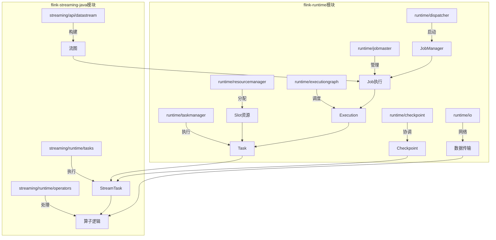
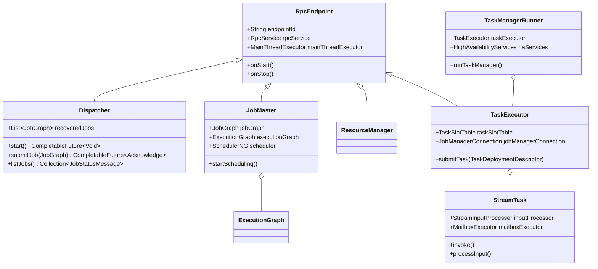
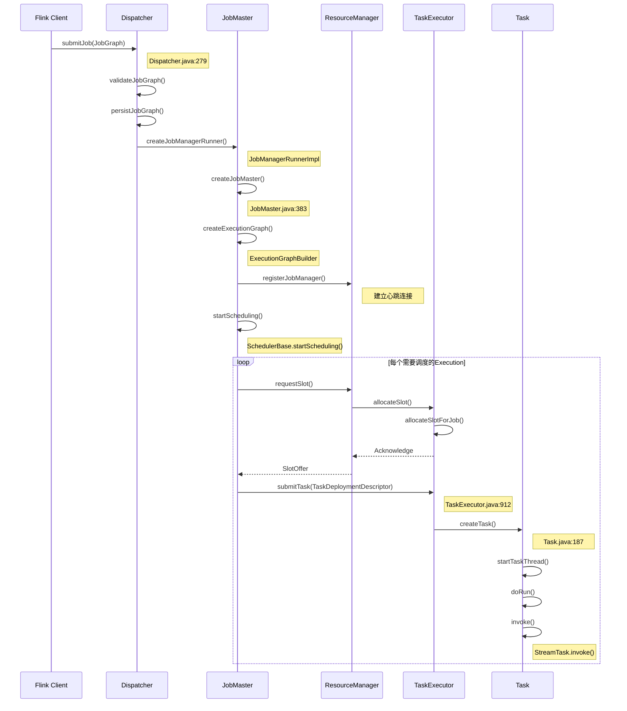
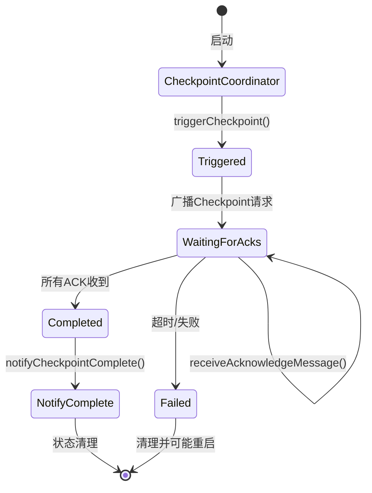
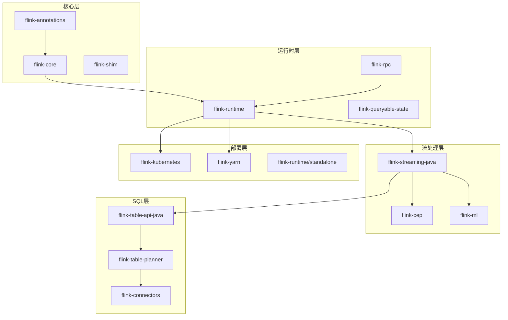
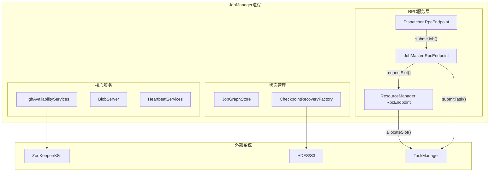
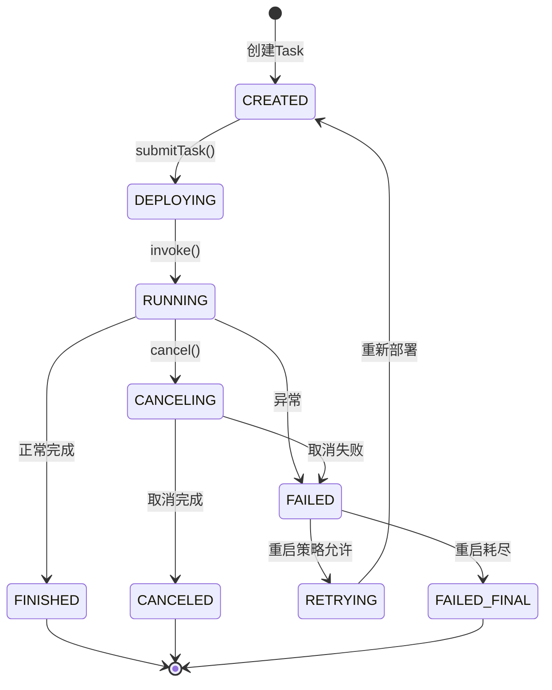
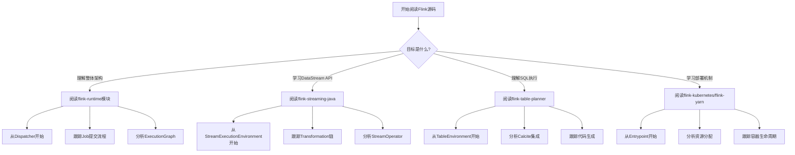

# Flink 源码阅读指南

> 所属阶段: Flink/10-internals | 前置依赖: [Flink架构概览](../04-runtime/flink-architecture-overview.md), [Flink运行机制](../04-runtime/flink-runtime-mechanisms.md) | 形式化等级: L3 (工程实践)

## 1. 概念定义 (Definitions)

### Def-F-10-01: 源码阅读的认知模型

**定义**: Flink源码阅读是一个**分层渐进的知识构建过程**，通过建立代码实体与运行时概念的映射关系，形成对分布式流计算系统的深度理解。

$$\text{CodeUnderstanding} = \langle \text{Structure}, \text{Behavior}, \text{State}, \text{Interaction} \rangle$$

其中：

- **Structure**: 模块组织、包结构、类层次
- **Behavior**: 方法调用链、执行流程、事件处理
- **State**: 状态变量、配置参数、运行时数据
- **Interaction**: 组件通信、协议交互、数据流动

### Def-F-10-02: 关键入口点 (Entry Points)

**定义**: 入口点是代码执行流的起始位置，具备以下特征：

1. 包含 `main()` 方法或等效启动方法
2. 负责初始化核心组件和配置
3. 建立与其他系统的连接（RPC、网络、文件系统等）

```
入口点分类:
├── 进程入口
│   ├── StandaloneSessionClusterEntrypoint (JobManager standalone模式)
│   ├── TaskManagerRunner (TaskManager入口)
│   └── CliFrontend (CLI客户端入口)
├── 服务入口
│   ├── Dispatcher (Job接收与分发)
│   ├── ResourceManager (资源管理)
│   └── JobMaster (Job执行管理)
└── API入口
    ├── StreamExecutionEnvironment (DataStream API)
    ├── TableEnvironment (Table API)
    └── DataSet API (已废弃)
```

### Def-F-10-03: 代码导航维度

**定义**: 源码导航的四个核心维度：

| 维度 | 描述 | 典型问题 |
|------|------|----------|
| **纵向** | 调用链深度跟踪 | "这个方法最终调用了什么？" |
| **横向** | 同层组件关系 | "还有哪些类似的实现？" |
| **时序** | 执行流程顺序 | "这个操作在什么时机发生？" |
| **状态** | 数据变换过程 | "这个变量何时被修改？" |

---

## 2. 属性推导 (Properties)

### Prop-F-10-01: 模块依赖层次性

**命题**: Flink模块遵循严格的分层依赖原则。

**证明概要**:

```
flink-core (基础类型与接口)
    ↓ (仅依赖)
flink-runtime (运行时核心)
    ↓ (仅依赖)
flink-streaming-java (流处理实现)
    ↓ (仅依赖)
flink-table-planner (SQL层)
```

**推导性质**:

- 下层模块不依赖上层模块（无循环依赖）
- 理解下层是理解上层的前提
- 修改下层影响范围更广

### Prop-F-10-02: 核心组件生命周期对应关系

**命题**: 代码中的组件生命周期与运行时进程生命周期存在严格对应。

| 代码组件 | 运行时实例 | 生命周期 |
|----------|------------|----------|
| `Dispatcher` | JobManager进程内服务 | 进程级 |
| `JobMaster` | 每个Job一个 | Job级 |
| `ExecutionGraph` | 每个Job一个 | Job级 |
| `Task` | 每个TaskManager内多个 | Task级 |
| `StreamTask` | 每个Task一个 | Task级 |

### Prop-F-10-03: 数据流与代码流的同构性

**命题**: 数据在系统中的流动路径与代码调用链存在同构映射。

**示例映射**:

```
数据流: Source → Map → Filter → Sink
         ↓      ↓       ↓       ↓
代码链: SourceFunction.map().filter().addSink()
         ↓      ↓       ↓       ↓
运行时: StreamSource → OneInputStreamTask → ... → StreamSink
```

---

## 3. 关系建立 (Relations)

### 3.1 模块结构与运行时组件映射



### 3.2 关键类继承与组合关系



---

## 4. 论证过程 (Argumentation)

### 4.1 为什么选择Dispatcher作为JobManager阅读入口

**论证**:

1. **架构位置**: Dispatcher是JobManager的核心入口组件，负责接收所有Job提交请求
2. **职责清晰**: 单一职责——Job的生命周期管理（提交、查询、取消）
3. **依赖完整**: 从Dispatcher可以自然扩展到ResourceManager、JobMaster等核心组件
4. **代码质量**: 作为核心服务，代码规范、注释完整

**阅读路径设计**:

```
Dispatcher.submitJob()
    ↓
JobManagerRunnerImpl.createJobManagerRunner() [standalone模式]
    ↓
JobMaster.start() → ExecutionGraphBuilder.buildGraph()
    ↓
SchedulerBase.startScheduling() → DefaultScheduler.startSchedulingInternal()
    ↓
Execution.deploy() → TaskExecutorGateway.submitTask()
```

### 4.2 TaskManager阅读入口选择的合理性

**论证**:

TaskManagerRunner作为入口的理由：

1. **进程边界**: 它是TaskManager进程的启动类，包含完整的初始化流程
2. **配置加载**: 展示如何从flink-conf.yaml解析配置
3. **服务启动**: 展示如何启动RPC、网络、内存管理等核心服务
4. **心跳机制**: 包含与JobManager建立连接的完整逻辑

**关键扩展点**:

```
TaskManagerRunner
    ↓ 创建
TaskExecutor (RPC Endpoint)
    ↓ 管理
TaskSlotTable (Slot资源)
    ↓ 执行
Task (Runtime层)
    ↓ 包装
StreamTask (Streaming层)
    ↓ 调用
StreamOperator (业务逻辑)
```

---

## 5. 形式证明 / 工程论证 (Proof / Engineering Argument)

### 5.1 Job提交流程的完整跟踪

**定理**: Job从提交到执行的完整流程可追踪为确定的调用链。

**工程论证**:



**关键代码位置**:

| 阶段 | 类 | 方法 | 行号(约) |
|------|-----|------|----------|
| Job提交入口 | `Dispatcher` | `submitJob()` | 279 |
| JobMaster创建 | `JobManagerRunnerImpl` | `createJobManagerRunner()` | 142 |
| ExecutionGraph构建 | `ExecutionGraphBuilder` | `buildGraph()` | 118 |
| 调度启动 | `DefaultScheduler` | `startSchedulingInternal()` | 183 |
| Task提交 | `TaskExecutor` | `submitTask()` | 912 |
| Task执行 | `StreamTask` | `invoke()` | 575 |

### 5.2 Checkpoint流程的源码跟踪

**论证**:

Checkpoint是Flink容错的核心，其协调流程如下：

```
CheckpointCoordinator.triggerCheckpoint()
    ↓
Execution.triggerCheckpoint() [向所有Task发送checkpoint请求]
    ↓
TaskExecutorGateway.triggerCheckpoint() [RPC调用]
    ↓
StreamTask.triggerCheckpointAsync() [异步处理]
    ↓
CheckpointableElement.snapshotState() [各算子状态快照]
    ↓
StateBackend.createCheckpointStorage() [状态存储]
    ↓
CheckpointCoordinator.receiveAcknowledgeMessage() [收集ACK]
    ↓
CheckpointCoordinator.completePendingCheckpoint() [完成Checkpoint]
```

**关键状态转换**:



### 5.3 数据传输流程的源码级理解

**论证**:

Flink的数据传输涉及网络层的高效实现：

```
RecordWriter.emit(record)
    ↓
ChannelSelector.selectChannels(record) [选择目标通道]
    ↓
BufferBuilder.append(record) [序列化到Buffer]
    ↓
LocalBufferPool.requestBuffer() [获取Buffer]
    ↓
PartitionRequestQueue.enqueue() [加入发送队列]
    ↓
CreditBasedPartitionRequestHandler.channelRead() [接收端处理]
    ↓
RemoteInputChannel.getNextBuffer() [消费Buffer]
    ↓
StreamInputProcessor.processInput() [反序列化并处理]
```

---

## 6. 实例验证 (Examples)

### 6.1 从DataStream API到执行的完整跟踪示例

**示例场景**: 简单的Word Count程序

```java

import org.apache.flink.streaming.api.environment.StreamExecutionEnvironment;
import org.apache.flink.streaming.api.datastream.DataStream;

// 用户代码
StreamExecutionEnvironment env =
    StreamExecutionEnvironment.getExecutionEnvironment();

DataStream<String> text = env.socketTextStream("localhost", 9999);

DataStream<Tuple2<String, Integer>> counts = text
    .flatMap(new Tokenizer())
    .keyBy(0)
    .sum(1);

counts.print();
env.execute("WordCount");
```

**源码跟踪路径**:

**Step 1: 环境创建**

```java

import org.apache.flink.streaming.api.environment.StreamExecutionEnvironment;

// StreamExecutionEnvironment.java
public static StreamExecutionEnvironment getExecutionEnvironment() {
    // 根据上下文创建本地或远程环境
    if (contextEnvironmentFactory != null) {
        return contextEnvironmentFactory.createExecutionEnvironment();
    }
    // 默认创建本地环境
    return createLocalEnvironment();
}
```

**Step 2: DataStream转换**

```java
// DataStream.java
public <R> SingleOutputStreamOperator<R> flatMap(
        FlatMapFunction<T, R> flatMapper) {
    // 获取类型信息
    TypeInformation<R> outType = TypeExtractor.getFlatMapReturnTypes(
        clean(flatMapper), getType(), Utils.getCallLocationName(), true);

    // 创建转换节点
    return transform("Flat Map", outType,
        new StreamFlatMap<>(clean(flatMapper)));
}
```

**Step 3: Transformation添加到图**

```java

import org.apache.flink.streaming.api.environment.StreamExecutionEnvironment;

// StreamExecutionEnvironment.java
protected <T> SingleOutputStreamOperator<T> addOperator(
        String operatorName,
        TypeInformation<T> outTypeInfo,
        StreamOperatorFactory<T> operatorFactory) {

    // 创建Transformation节点
    OneInputTransformation<T> transformation = new OneInputTransformation<>(
        inputStream.getTransformation(),
        operatorName,
        operatorFactory,
        outTypeInfo,
        environment.getParallelism());

    // 添加到transformation列表
    transformations.add(transformation);

    return new SingleOutputStreamOperator<>(environment, transformation);
}
```

**Step 4: 执行计划生成**

```java
// StreamGraphGenerator.java
public StreamGraph generate() {
    streamGraph = new StreamGraph(executionConfig, checkpointConfig, savepointRestoreSettings);

    // 为每个Transformation创建StreamNode
    for (Transformation<?> transformation : transformations) {
        transform(transformation);
    }

    // 连接StreamNode形成边
    connectEdges();

    return streamGraph;
}
```

**Step 5: JobGraph构建**

```java
// StreamingJobGraphGenerator.java
public JobGraph createJobGraph(StreamGraph streamGraph) {
    // 设置调度模式
    jobGraph.setScheduleMode(streamGraph.getScheduleMode());

    // 生成JobVertex
    setChaining(streamGraph, hash -> streamGraph.getStreamNode(hash));

    // 配置物理边
    setPhysicalEdges();

    // 设置内存配置
    setResources();

    return jobGraph;
}
```

**Step 6: ExecutionGraph构建**

```java
// ExecutionGraphBuilder.java
public static ExecutionGraph buildGraph(...)
    throws JobExecutionException {

    // 创建ExecutionJobVertex
    for (JobVertex jobVertex : jobGraph.getVertices()) {
        ExecutionJobVertex ejv = new ExecutionJobVertex(
            executionGraph, jobVertex, ...)
    }

    // 连接ExecutionVertex
    connectVertices();

    return executionGraph;
}
```

### 6.2 自定义Operator的调试跟踪

**示例**: 实现带调试日志的自定义FlatMapFunction

```java
public class DebuggableTokenizer extends RichFlatMapFunction<String, Tuple2<String, Integer>> {

    private transient Counter counter;

    @Override
    public void open(Configuration parameters) {
        // 调试点1: 生命周期方法
        System.out.println("[DEBUG] Operator opened at: " +
            getRuntimeContext().getIndexOfThisSubtask());
        counter = getRuntimeContext().getMetricGroup().counter("recordCount");
    }

    @Override
    public void flatMap(String value, Collector<Tuple2<String, Integer>> out) {
        // 调试点2: 数据处理
        System.out.println("[DEBUG] Processing: " + value);
        counter.inc();

        for (String word : value.toLowerCase().split("\\W+")) {
            if (word.length() > 0) {
                // 调试点3: 输出收集
                System.out.println("[DEBUG] Emitting: " + word);
                out.collect(new Tuple2<>(word, 1));
            }
        }
    }

    @Override
    public void close() {
        // 调试点4: 清理
        System.out.println("[DEBUG] Operator closed");
    }
}
```

**IDE断点设置建议**:

| 位置 | 类 | 方法 | 目的 |
|------|-----|------|------|
| Operator生命周期 | `AbstractStreamOperator` | `open()` | 验证初始化 |
| 数据处理 | `StreamFlatMap` | `processElement()` | 跟踪数据流 |
| 状态访问 | `RuntimeContext` | `getState()` | 验证状态 |
| Checkpoint触发 | `StreamTask` | `triggerCheckpointAsync()` | 验证容错 |

---

## 7. 可视化 (Visualizations)

### 7.1 Flink源码模块依赖图



### 7.2 JobManager内部组件交互图



### 7.3 Task执行状态机



### 7.4 源码阅读决策树



---

## 8. 调试技巧详解

### 8.1 IntelliJ IDEA配置指南

#### 项目导入

**Step 1: Maven项目导入**

```
1. File → New → Project from Existing Sources
2. 选择Flink源码根目录下的 pom.xml
3. 选择 "Import Maven projects automatically"
4. 等待依赖下载完成（约10-20分钟，视网络而定）
```

**Step 2: 源码关联配置**

```
1. File → Project Structure → Libraries
2. 确认所有Flink模块源码已正确关联
3. 对于SNAPSHOT版本，添加Maven仓库源码
```

**Step 3: 编译配置**

```
1. Settings → Build, Execution, Deployment → Compiler → Java Compiler
2. 设置Target bytecode version: 11 (Flink 1.17+)
3. 设置Project bytecode version: 11
```

### 8.2 断点设置策略

#### 关键断点位置清单

| 组件 | 类 | 方法 | 行号 | 观察变量 |
|------|-----|------|------|----------|
| Job提交 | `Dispatcher` | `submitJob()` | ~279 | jobGraph |
| JobMaster启动 | `JobMaster` | `onStart()` | ~380 | jobGraph, executionGraph |
| 调度器启动 | `DefaultScheduler` | `startSchedulingInternal()` | ~183 | schedulingStrategy |
| Task提交 | `TaskExecutor` | `submitTask()` | ~912 | taskDeploymentDescriptor |
| Task启动 | `Task` | `run()` | ~545 | invokable |
| StreamTask执行 | `StreamTask` | `invoke()` | ~575 | configuration |
| 算子处理 | `StreamFlatMap` | `processElement()` | ~47 | element |
| Checkpoint触发 | `CheckpointCoordinator` | `triggerCheckpoint()` | ~652 | checkpointID |
| Checkpoint完成 | `CheckpointCoordinator` | `completePendingCheckpoint()` | ~891 | pendingCheckpoint |

#### 条件断点示例

**场景**: 只在特定Job ID时断点

```java
// 在Dispatcher.submitJob()设置条件断点
jobGraph.getJobID().toString().equals("your-job-id")
```

**场景**: 只在特定Task时断点

```java
// 在TaskExecutor.submitTask()设置条件断点
taskDeploymentDescriptor.getJobID().toString().equals("your-job-id") &&
taskDeploymentDescriptor.getTaskInfo().getTaskName().contains("Map")
```

### 8.3 日志分析技巧

#### 日志级别配置

```yaml
# conf/log4j.properties
rootLogger.level = INFO

# 关键组件DEBUG级别
logger.runtime.name = org.apache.flink.runtime
logger.runtime.level = DEBUG

logger.streaming.name = org.apache.flink.streaming
logger.streaming.level = DEBUG

# Checkpoint详细跟踪
logger.checkpoint.name = org.apache.flink.runtime.checkpoint
logger.checkpoint.level = TRACE

# 网络层跟踪
logger.network.name = org.apache.flink.runtime.io.network
logger.network.level = DEBUG
```

#### 关键日志模式

```
# Job生命周期
[JobID] Created JobManagerRunner for job
[JobID] Starting JobMaster
[JobID] Successfully created execution graph from job graph
[JobID] Starting scheduling with scheduling strategy

# Task生命周期
[JobID] Deploying [task name] to [task manager]
[JobID] Received task [task name] at [task manager]
[JobID] [task name] switched from CREATED to DEPLOYING
[JobID] [task name] switched from DEPLOYING to RUNNING

# Checkpoint生命周期
[JobID] Triggering checkpoint [checkpointID]
[JobID] Received acknowledge message for checkpoint [checkpointID]
[JobID] Completed checkpoint [checkpointID]
[JobID] Notifying task [task name] of checkpoint [checkpointID] completion

# 故障恢复
[JobID] Restarting failed job with restart strategy
[JobID] Cancelling job because of [failure cause]
[JobID] Failed job because of [failure cause]
```

### 8.4 远程调试配置

#### Standalone模式远程调试

**Step 1: 修改启动脚本**

```bash
# bin/jobmanager.sh (添加调试参数)
export JVM_ARGS="$JVM_ARGS -agentlib:jdwp=transport=dt_socket,server=y,suspend=n,address=5005"
```

**Step 2: IntelliJ配置**

```
1. Run → Edit Configurations → + → Remote JVM Debug
2. Name: Flink JobManager Debug
3. Host: localhost (或远程主机IP)
4. Port: 5005
5. Use module classpath: flink-runtime
```

**Step 3: 启动调试会话**

```
1. 先启动Flink集群
2. 在IntelliJ中点击Debug按钮连接
3. 设置断点并提交Job
```

#### TaskManager远程调试

```bash
# bin/taskmanager.sh
export JVM_ARGS="$JVM_ARGS -agentlib:jdwp=transport=dt_socket,server=y,suspend=n,address=5006"
```

**多TaskManager调试技巧**:

```bash
# 使用不同端口启动多个TM
TM1: address=5006
TM2: address=5007
TM3: address=5008
```

### 8.5 内存与性能分析

#### 堆内存分析

```bash
# 生成堆转储
jmap -dump:format=b,file=flink.hprof <pid>

# 使用Eclipse MAT或VisualVM分析
# 重点关注:
# - org.apache.flink.runtime.executiongraph.ExecutionGraph
# - org.apache.flink.streaming.runtime.tasks.StreamTask
# - NetworkBufferPool
```

#### 线程Dump分析

```bash
# 获取线程Dump
jstack <pid> > thread-dump.txt

# 关键线程模式
"flink-akka.actor.default-dispatcher" - Akka消息处理
"Checkpoint Timer" - Checkpoint定时器
"AsyncCheckpointRunnable" - 异步Checkpoint线程
"Flink-MetricRegistry" - 指标收集
```

---

## 9. 源码阅读路径推荐

### 9.1 初学者路径 (2-3周)

```
Week 1: 基础概念与API
├── Day 1-2: 阅读flink-core的types和configuration包
├── Day 3-4: 阅读StreamExecutionEnvironment和DataStream
└── Day 5-7: 跟踪一个简单的Job从API到StreamGraph的流程

Week 2: 运行时基础
├── Day 1-2: 阅读StreamGraph和JobGraph的构建
├── Day 3-4: 理解ExecutionGraph的结构
└── Day 5-7: 跟踪Job提交流程（从CLI到Execution）

Week 3: Task执行
├── Day 1-2: 阅读StreamTask的生命周期
├── Day 3-4: 理解StreamOperator的链式调用
└── Day 5-7: 跟踪数据在Task之间的传输
```

### 9.2 进阶路径 (3-4周)

```
Week 1: 调度与资源管理
├── Day 1-2: 深入Scheduler实现（DefaultScheduler）
├── Day 3-4: 阅读SlotPool和SlotSharingManager
└── Day 5-7: 理解Slot分配策略

Week 2: Checkpoint与容错
├── Day 1-2: 阅读CheckpointCoordinator
├── Day 3-4: 理解Barrier对齐与反压
└── Day 5-7: 阅读StateBackend实现（HeapStateBackend）

Week 3: 网络层
├── Day 1-2: 阅读RecordWriter和ChannelSelector
├── Day 3-4: 理解Buffer池和Credit-based流控
└── Day 5-7: 阅读Netty服务器与客户端实现

Week 4: 高级特性
├── Day 1-2: 阅读Async I/O实现
├── Day 3-4: 理解Broadcast State机制
└── Day 5-7: 阅读Queryable State实现
```

### 9.3 专家路径 (4-6周)

```
Week 1-2: SQL与Table API
├── Calcite集成与优化器
├── 物理计划生成
└── 代码生成机制

Week 3-4: 部署与HA
├── Kubernetes集成
├── ZooKeeper高可用
└── 故障恢复机制

Week 5-6: 性能优化与调优
├── 序列化框架（TypeInformation）
├── 内存管理与Unsafe操作
└── Metrics系统实现
```

---

## 10. 常见问题 (FAQ)

### Q1: 如何快速定位某个功能的具体实现？

**A**: 使用以下搜索策略：

```bash
# 1. 按类名搜索
grep -r "class.*CheckpointCoordinator" --include="*.java" flink-runtime/

# 2. 按方法名搜索
grep -r "triggerCheckpoint" --include="*.java" flink-runtime/

# 3. 按注释关键词搜索
grep -r "TODO.*checkpoint" --include="*.java" flink-runtime/

# 4. IntelliJ中双击Shift使用Search Everywhere
```

### Q2: 源码中大量Akka代码如何理解？

**A**: Flink的RPC层基于Akka，关键概念映射：

| Akka概念 | Flink实现 | 对应位置 |
|----------|-----------|----------|
| Actor | RpcEndpoint | flink-rpc |
| ActorRef | RpcGateway | 接口定义 |
| ActorSystem | RpcService | 创建和管理 |
| Props | RpcEndpoint构造函数 | 实例化参数 |

**简化理解**: 把 `RpcEndpoint` 想象成带RPC能力的类，方法调用自动通过网络转发。

### Q3: 如何理解Flink的类型系统？

**A**: 类型系统核心类层次：

```
TypeInformation<T> (抽象类型信息)
    ├── BasicTypeInfo<T> (基础类型)
    ├── TupleTypeInfo<T> (Tuple类型)
    ├── PojoTypeInfo<T> (POJO类型)
    ├── GenericTypeInfo<T> (Kryo序列化)
    └── PrimitiveArrayTypeInfo<T> (数组类型)
```

**关键点**:

- 类型信息用于序列化/反序列化
- 优先使用BasicTypeInfo和TupleTypeInfo（性能更好）
- POJO类型需要满足特定条件（无参构造、getter/setter）

### Q4: Checkpoint失败如何排查？

**A**: 排查清单：

```
1. 检查Checkpoint超时配置
   - state.checkpoints.timeout (默认10分钟)

2. 查看Checkpoint日志
   - grep "checkpoint" logs/flink-*-jobmanager.log

3. 确认State Backend配置
   - state.backend (filesystem/rocksdb)
   - state.checkpoints.dir (Checkpoint目录)

4. 检查网络缓冲区
   - taskmanager.memory.network.fraction

5. 查看TaskManager日志中的Barrier处理
   - grep "barrier" logs/flink-*-taskmanager.log
```

### Q5: 如何贡献代码到Flink社区？

**A**: 贡献流程：

```
1. 订阅dev@flink.apache.org邮件列表

2. 从JIRA选择issue或创建新issue
   - https://issues.apache.org/jira/projects/FLINK

3. Fork Flink GitHub仓库
   - https://github.com/apache/flink

4. 创建分支并开发
   git checkout -b FLINK-XXXX-short-description

5. 遵循代码规范
   - 使用mvn spotless:apply格式化
   - 添加单元测试
   - 更新相关文档

6. 提交Pull Request
   - PR标题格式: [FLINK-XXXX] 描述
   - 关联JIRA issue
```

### Q6: 源码阅读中常见的迷惑点有哪些？

**A**: 常见迷惑点解析：

| 迷惑点 | 解释 |
|--------|------|
| RpcGateway和RpcEndpoint的区别 | Gateway是客户端接口，Endpoint是服务端实现 |
| ExecutionGraph和JobGraph的区别 | JobGraph是逻辑图，ExecutionGraph是执行图（含并行实例） |
| StreamTask和Task的区别 | Task是Runtime层概念，StreamTask是Streaming层封装 |
| ResultPartition和IntermediateResult的区别 | ResultPartition是物理分区，IntermediateResult是逻辑结果 |
| LocalKeyBy和GlobalKeyBy的区别 | LocalKeyBy先本地聚合减少网络传输 |

### Q7: 如何跟踪一个数据记录从输入到输出的完整路径？

**A**: 跟踪步骤：

```
1. Source端
   - SourceFunction.run() → collect(record)

2. 序列化
   - RecordWriter.emit() → serializer.serialize(record)

3. 网络传输
   - RemoteInputChannel.getNextBuffer() → Buffer反序列化

4. 反序列化
   - StreamInputProcessor.processInput() → deserializer.deserialize()

5. 算子处理
   - StreamFlatMap.processElement() → userFunction.flatMap()

6. 输出收集
   - TimestampedCollector.collect() → RecordWriter.emit()

7. Sink端
   - SinkFunction.invoke() → 写出到外部系统
```

**调试技巧**: 在RecordWriter.emit()和StreamInputProcessor.processInput()设置条件断点，过滤特定记录内容。

### Q8: Flink版本升级时如何跟踪API变化？

**A**: 版本跟踪策略：

```
1. 查看Release Notes
   - https://nightlies.apache.org/flink/flink-docs-stable/release-notes/

2. 对比Deprecated注解
   - grep -r "@Deprecated" --include="*.java" flink-streaming-java/

3. 使用IntelliJ的Compare with Branch功能
   - 对比不同版本的源码差异

4. 关注FLIP提案
   - https://github.com/apache/flink/tree/main/flink-docs/docs/flips/
```

---

## 引用参考 (References)


---

*文档版本: 1.0 | 最后更新: 2026-04-11 | 适用Flink版本: 1.17+*
