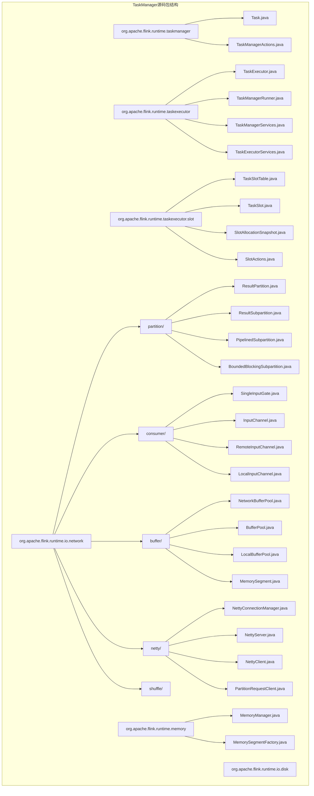
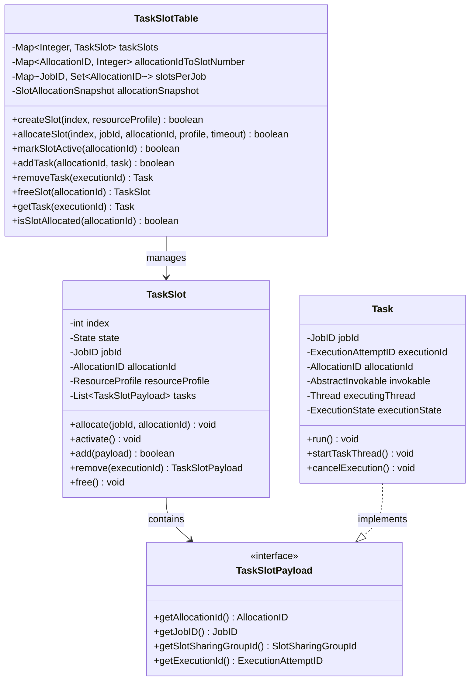
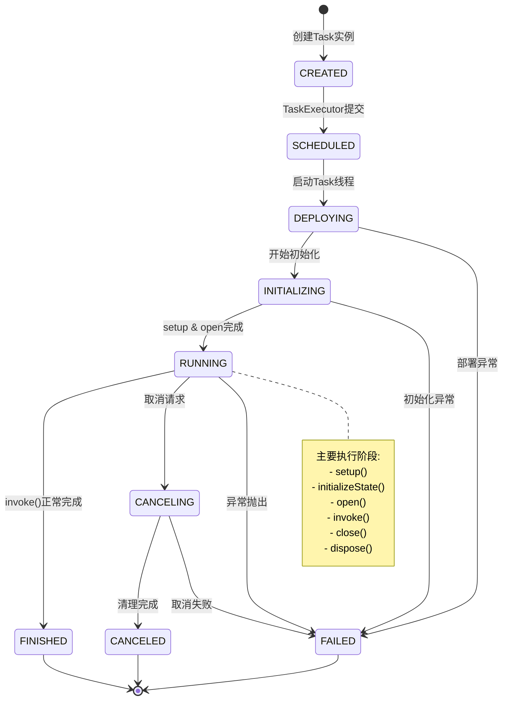
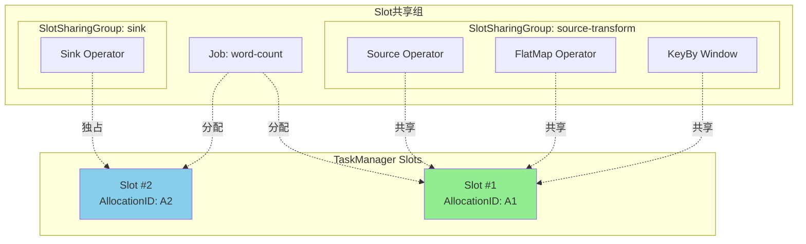
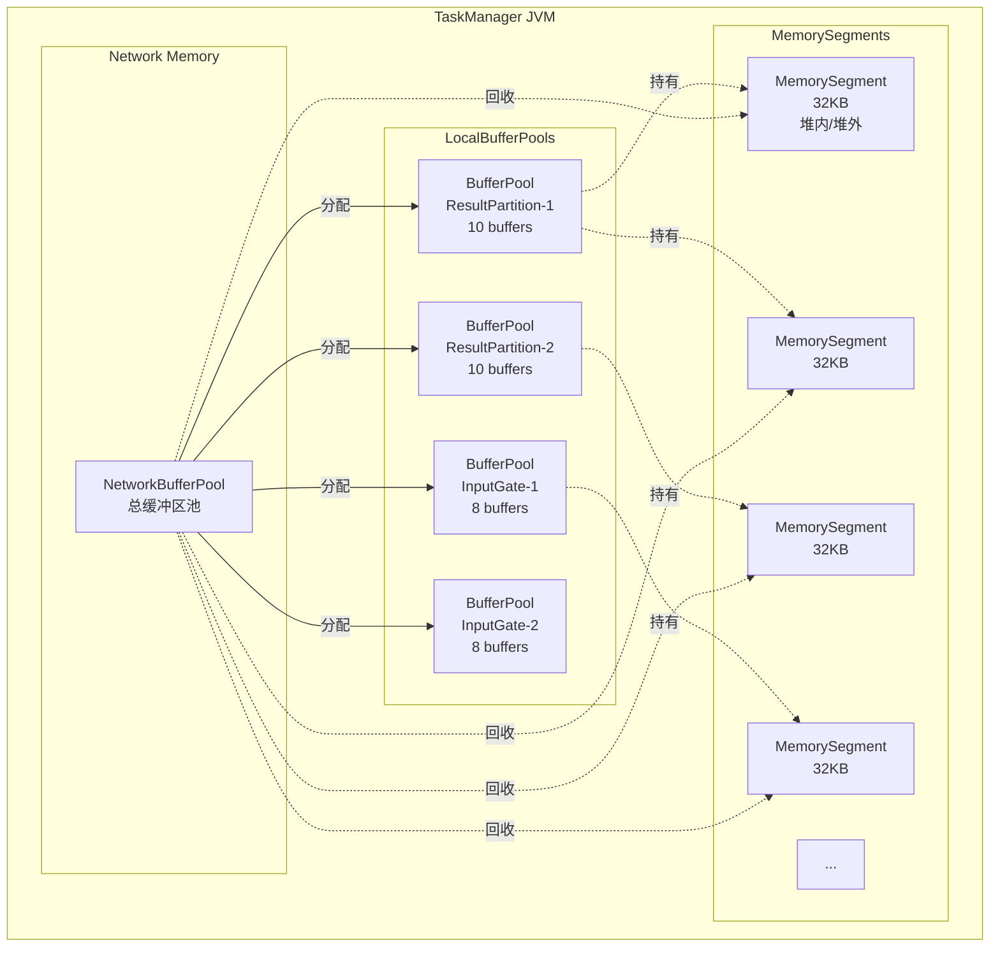
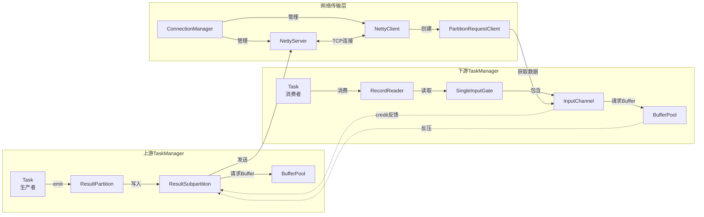
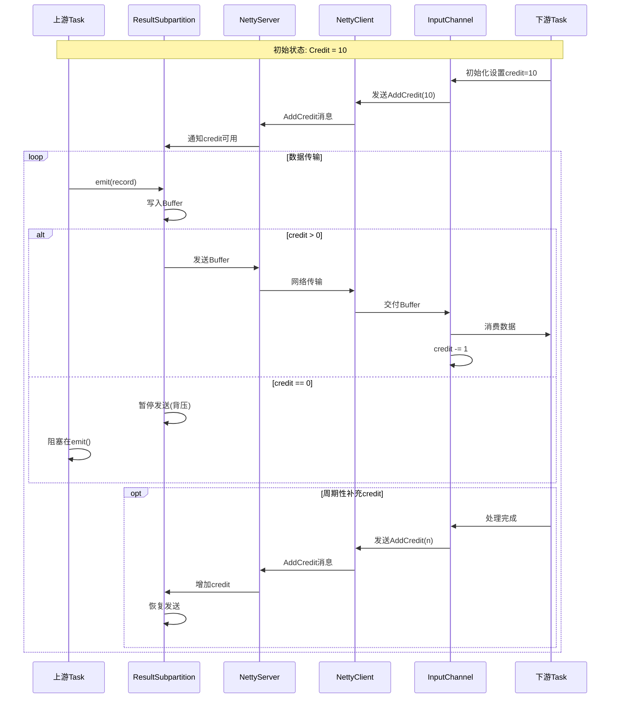
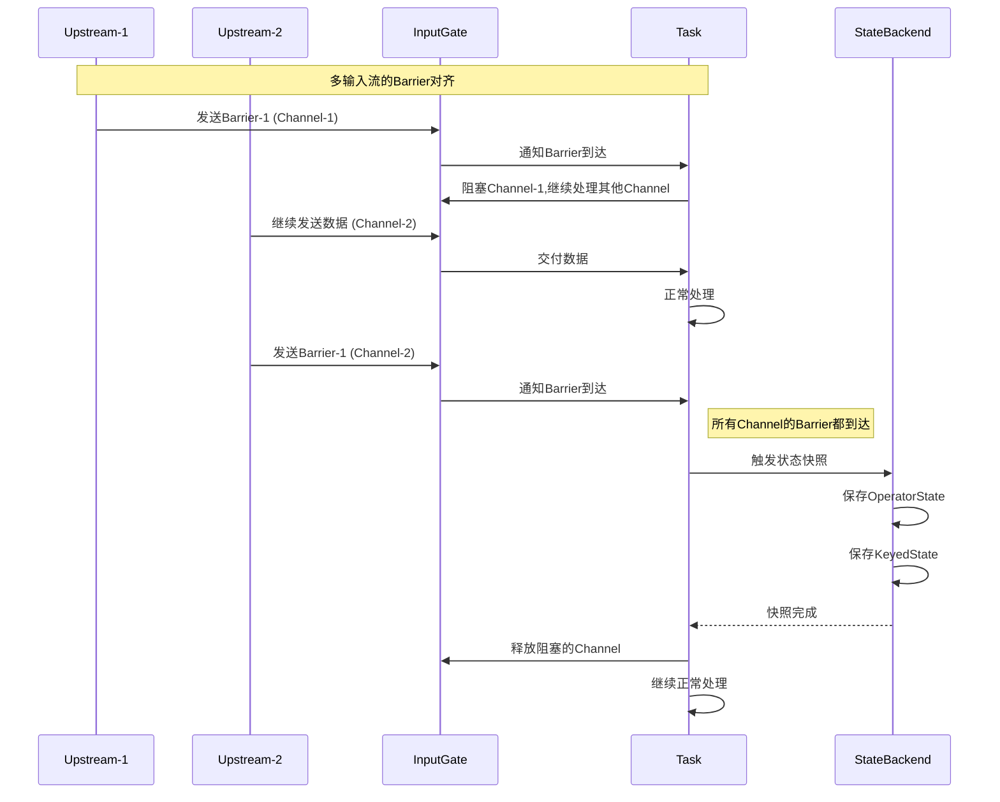
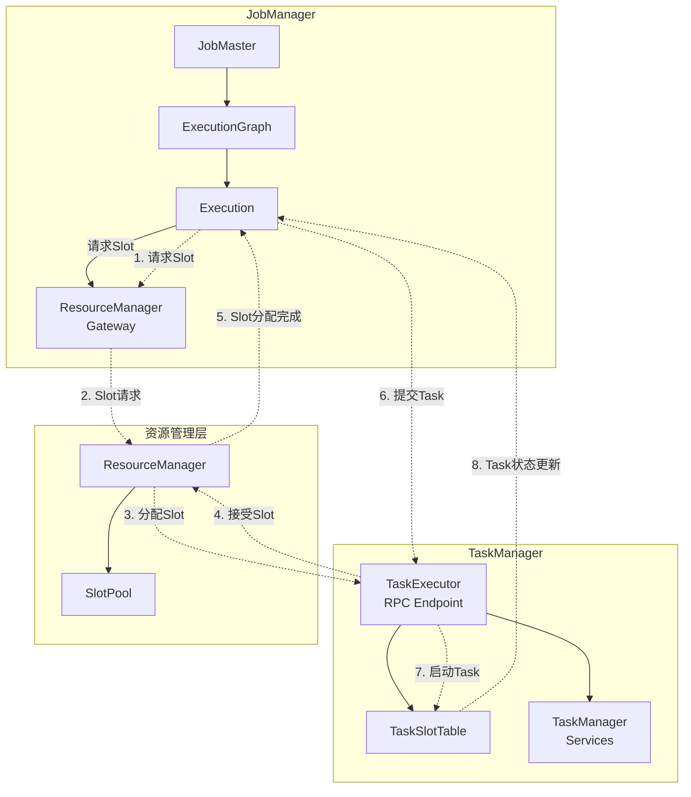

# TaskManager源码深度分析

> **所属阶段**: Flink | **前置依赖**: [flink-system-architecture-deep-dive.md](../01-concepts/flink-system-architecture-deep-dive.md), [JobManager源码分析](../10-internals/jobmanager-source-analysis.md) | **形式化等级**: L5 | **源码版本**: Apache Flink 1.18/1.19

---

## 1. 概念定义 (Definitions)

本节从源码层面严格定义TaskManager相关的核心概念、类结构和数据模型。

### 1.1 TaskManager整体架构定义

**定义 1.1.1 (TaskManager)**: TaskManager是Flink运行时中负责**任务执行**和**资源管理**的工作进程组件，在源码中体现为`TaskManagerRunner`启动的`TaskManagerServices`容器。

$$\text{TaskManager} = \langle \text{RPC Endpoint}, \text{TaskExecutor}, \text{TaskSlotTable}, \text{ShuffleEnvironment} \rangle$$

**定义 1.1.2 (TaskExecutor)**: TaskExecutor是TaskManager的核心RPC组件，继承自`RpcEndpoint`，负责接收JobManager的调度指令并管理本地任务生命周期。

```java
// 源码位置: flink-runtime/src/main/java/org/apache/flink/runtime/taskexecutor/TaskExecutor.java
public class TaskExecutor extends RpcEndpoint implements TaskExecutorGateway {
    private final TaskExecutorServices taskExecutorServices;
    private final TaskSlotTable<Task> taskSlotTable;
    private final ShuffleEnvironment<?, ?> shuffleEnvironment;
    private final JobLeaderService jobLeaderService;
    // ... 核心字段
}
```

**定义 1.1.3 (TaskSlot)**: TaskSlot是TaskManager中资源分配的最小单元，对应`TaskSlotTable`中的一条记录，具有独立的内存配额和线程上下文。

$$\text{TaskSlot} = \langle \text{slotNumber}, \text{resourceProfile}, \text{allocationId}, \text{taskGroup} \rangle$$

**定义 1.1.4 (Task)**: Task是Flink执行图中的最小执行单元，在源码中对应`Task`类，封装了用户代码的`AbstractInvokable`实例和完整的运行时上下文。

```java
// 源码位置: flink-runtime/src/main/java/org/apache/flink/runtime/taskmanager/Task.java
public class Task implements Runnable, TaskActions, CheckpointListener {
    private final JobID jobId;
    private final ExecutionAttemptID executionId;
    private final AbstractInvokable invokable;
    private final Thread executingThread;
    private volatile ExecutionState executionState;
    // ... 核心字段
}
```

### 1.2 核心类源码定义

**定义 1.2.1 (TaskSlotTable)**: TaskSlotTable是TaskManager中管理所有TaskSlot的核心数据结构，实现了Slot的动态分配、释放和共享机制。

```java
// 源码位置: flink-runtime/src/main/java/org/apache/flink/runtime/taskexecutor/slot/TaskSlotTable.java
public class TaskSlotTable<T extends TaskSlotPayload> implements AutoCloseable {
    private final Map<Integer, TaskSlot<T>> taskSlots;           // slotNumber -> TaskSlot
    private final Map<AllocationID, Integer> allocationIdToSlotNumber;
    private final Map<JobID, Set<AllocationID>> slotsPerJob;
    private final SlotAllocationSnapshot allocationSnapshot;
    // ... 核心字段
}
```

**定义 1.2.2 (ResultPartition)**: ResultPartition是Task输出数据的物理抽象，实现了`ResultPartitionWriter`接口，负责将记录写入本地Buffer池并通过网络层传输。

```java
// 源码位置: flink-runtime/src/main/java/org/apache/flink/runtime/io/network/partition/ResultPartition.java
public class ResultPartition implements ResultPartitionWriter,
                                       BufferPoolOwner,
                                       BufferWritingResultPartition {
    private final ResultPartitionID partitionId;
    private final ResultPartitionType partitionType;
    private final ResultSubpartition[] subpartitions;
    private BufferPool bufferPool;
    private volatile boolean isFinished;
    // ... 核心字段
}
```

**定义 1.2.3 (SingleInputGate)**: SingleInputGate是Task消费上游数据的入口组件，管理一组`InputChannel`，负责数据分区的远程获取和本地消费。

```java
// 源码位置: flink-runtime/src/main/java/org/apache/flink/runtime/io/network/partition/consumer/SingleInputGate.java
public class SingleInputGate extends InputGate {
    private final InputGateID gateId;
    private final InputChannel[] inputChannels;
    private final Map<IntermediateResultPartitionID, InputChannel> channels;
    private final BufferPool bufferPool;
    private final MemorySegmentProvider memorySegmentProvider;
    // ... 核心字段
}
```

### 1.3 内存模型定义

**定义 1.3.1 (NetworkBufferPool)**: NetworkBufferPool是TaskManager级别的网络内存池，管理所有网络I/O所需的`MemorySegment`。

$$\text{NetworkBufferPool} = \langle \text{totalNumberOfMemorySegments}, \text{memorySegmentSize}, \text{availableSegments} \rangle$$

**定义 1.3.2 (BufferPool)**: BufferPool是ResultPartition或InputGate级别的内存池视图，通过向NetworkBufferPool申请/释放`MemorySegment`实现内存的二级分配。

```java
// 源码位置: flink-runtime/src/main/java/org/apache/flink/runtime/io/network/buffer/BufferPool.java
public interface BufferPool extends BufferProvider, BufferRecycler {
    int getNumberOfRequiredMemorySegments();
    int getNumberOfAvailableMemorySegments();
    int getNumBuffers();
    void lazyDestroy();
}
```

**定义 1.3.3 (MemorySegment)**: MemorySegment是Flink内存管理的基础单元，是对堆内或堆外内存的字节级抽象。

```java
// 源码位置: flink-core/src/main/java/org/apache/flink/core/memory/MemorySegment.java
public abstract class MemorySegment {
    protected final byte[] heapMemory;      // 堆内内存引用
    protected final long address;           // 堆外内存地址
    protected final int size;
    // ... 核心字段
}
```

### 1.4 网络层定义

**定义 1.4.1 (NettyConnectionManager)**: NettyConnectionManager是TaskManager网络层的核心组件，基于Netty实现了TCP连接的管理、复用和流量控制。

```java
// 源码位置: flink-runtime/src/main/java/org/apache/flink/runtime/io/network/netty/NettyConnectionManager.java
public class NettyConnectionManager implements ConnectionManager {
    private final NettyServer nettyServer;
    private final NettyClient nettyClient;
    private final NettyBufferPool nettyBufferPool;
    private final PartitionRequestClientFactory partitionRequestClientFactory;
    // ... 核心字段
}
```

**定义 1.4.2 (PartitionRequestClient)**: PartitionRequestClient是消费端与生产端建立连接的客户端抽象，通过Netty的Channel进行实际的数据传输。

```java
// 源码位置: flink-runtime/src/main/java/org/apache/flink/runtime/io/network/netty/PartitionRequestClient.java
public class PartitionRequestClient {
    private final Channel tcpChannel;
    private final ConnectionID connectionId;
    private final NetworkClientHandler clientHandler;
    // ... 核心字段
}
```

---

## 2. 属性推导 (Properties)

从上述定义出发，本节推导TaskManager源码中的关键性质和不变式。

### 2.1 TaskSlot资源管理性质

**引理 2.1.1 (Slot分配唯一性)**: 对于任意时刻 $t$，一个AllocationID最多映射到一个SlotNumber。

$$\forall t, \forall a \in \text{AllocationID}: |\{ s \in \text{SlotNumber} \mid \text{allocationIdToSlotNumber}[a] = s \}| \leq 1$$

*证明*: 由`TaskSlotTable.allocationIdToSlotNumber`的`Map`类型保证，`Map.put()`操作会覆盖已有键值。

**引理 2.1.2 (Slot状态转换封闭性)**: TaskSlot的状态机转换满足封闭性，不允许非法状态跳转。

$$\text{FREE} \xrightarrow{\text{allocate}} \text{ALLOCATED} \xrightarrow{\text{activate}} \text{ACTIVE}$$
$$\text{ACTIVE} \xrightarrow{\text{release}} \text{RELEASING} \xrightarrow{\text{cleanup}} \text{FREE}$$

**引理 2.1.3 (Slot共享约束)**: 处于ACTIVE状态的Slot可以容纳多个Task，但所有Task必须属于同一JobID和SlotSharingGroup。

```java
// 源码推导: TaskSlot.add(TaskSlotPayload task)
public boolean add(T task) {
    if (state == State.ACTIVE && tasks.isEmpty() ||
        tasks.stream().allMatch(t -> t.getJobID().equals(task.getJobID()) &&
                                      t.getSlotSharingGroupId().equals(task.getSlotSharingGroupId()))) {
        tasks.add(task);
        return true;
    }
    return false;
}
```

### 2.2 Task生命周期性质

**引理 2.2.1 (状态转换单调性)**: Task的ExecutionState转换是单调的，不允许回退到之前的状态。

$$\text{CREATED} \rightarrow \text{SCHEDULED} \rightarrow \text{DEPLOYING} \rightarrow \text{RUNNING} \rightarrow \{\text{FINISHED} | \text{CANCELED} | \text{FAILED}\}$$

**引理 2.2.2 (生命周期钩子有序性)**: Task生命周期钩子调用满足严格的全序关系：

$$\text{setup} \prec \text{initializeState} \prec \text{open} \prec \text{run} \prec \text{close} \prec \text{dispose}$$

*证明*: 由`Task.run()`方法的实现保证：

```java
// 源码片段: Task.run() 方法
public void run() {
    try {
        // 1. setup阶段
        setupInvokable();

        // 2. initializeState阶段
        restoreState();

        // 3. open阶段
        invokable.open();

        // 4. run阶段
        invokable.invoke();

        // 5. close阶段
        invokable.close();

    } finally {
        // 6. dispose阶段
        dispose();
    }
}
```

### 2.3 内存池性质

**引理 2.3.1 (BufferPool内存守恒)**: 对于任意BufferPool $P$，其持有的Buffer总数满足：

$$\text{numberOfRequestedMemorySegments} \geq \text{numberOfAvailableMemorySegments} \geq 0$$

**引理 2.3.2 (NetworkBufferPool全局守恒)**: TaskManager级别的NetworkBufferPool满足：

$$\sum_{p \in \text{AllBufferPools}} \text{p.getNumberOfRequestedMemorySegments} \leq \text{totalNumberOfMemorySegments}$$

**引理 2.3.3 (MemorySegment不可变性)**: MemorySegment一旦创建，其内存地址和大小不可改变，但内容可变。

### 2.4 网络栈性质

**引理 2.4.1 (连接复用性)**: 同一ConnectionID对应的PartitionRequestClient可以被多个InputChannel共享。

**引理 2.4.2 (反压传播性)**: 当下游BufferPool满时，反压通过credit-based机制向上游传播，最终暂停上游数据生产。

$$\text{LocalBufferPoolFull} \rightarrow \text{NoCreditsAvailable} \rightarrow \text{PauseRemoteReader}$$

---

## 3. 关系建立 (Relations)

本节建立TaskManager内部组件与外部系统之间的映射和编码关系。

### 3.1 组件依赖关系

**定义 3.1.1 (TaskManager组件依赖图)**: TaskManager内部组件形成如下依赖关系：

```
TaskManagerRunner
    ├── TaskManagerServices
    │   ├── TaskExecutor (RPC Endpoint)
    │   ├── TaskSlotTable
    │   │   └── TaskSlot[]
    │   │       └── Task (Runnable)
    │   ├── ShuffleEnvironment
    │   │   ├── ResultPartitionManager
    │   │   ├── NetworkEnvironment
    │   │   └── NettyConnectionManager
    │   └── JobLeaderService
    └── HighAvailabilityServices
```

**定理 3.1.1 (TaskManager与JobManager映射)**: TaskManager通过RPC机制与JobManager建立多对一的映射关系。

$$\text{TaskManager} \xrightarrow{\text{RPC}} \text{JobManager} \quad \text{(多对一)}$$

**定理 3.1.2 (Task与Execution映射)**: 每个Task对应ExecutionGraph中的一个ExecutionAttempt。

$$\text{Execution} \xrightarrow{\text{deploy}} \text{Task} \quad \text{(一对一)}$$

### 3.2 Slot与ResourceManager关系

**定义 3.2.1 (Slot资源注册关系)**: TaskManager向ResourceManager注册Slot资源，形成如下映射：

```java
// 源码位置: TaskExecutor.registerSlotsWithResourceManager()
private void registerSlotsWithResourceManager() {
    // TaskSlotTable中的Slot -> 向ResourceManager注册
    Iterator<TaskSlot<T>> slots = taskSlotTable.getAllocatedSlots();
    while (slots.hasNext()) {
        TaskSlot<T> slot = slots.next();
        resourceManagerGateway.registerSlot(
            slot.getAllocationId(),
            slot.getResourceProfile()
        );
    }
}
```

**定理 3.2.1 (Slot分配请求链)**: Slot分配请求从JobManager发出，经过ResourceManager协调，最终由TaskManager执行。

$$\text{JobManager} \rightarrow \text{ResourceManager} \rightarrow \text{TaskManager(TaskSlotTable)}$$

### 3.3 Task与Shuffle环境关系

**定义 3.3.1 (数据流生产消费关系)**: Task通过ResultPartition生产数据，通过InputGate消费数据：

$$\text{UpstreamTask} \xrightarrow{\text{ResultPartition}} \text{NettyChannel} \xrightarrow{\text{InputChannel}} \text{DownstreamTask}$$

**定义 3.3.2 (ResultPartition与InputGate连接矩阵)**: 对于具有 $M$ 个上游Task和 $N$ 个下游Task的连接：

$$\text{ConnectionMatrix} = \begin{bmatrix} c_{11} & c_{12} & \cdots & c_{1N} \\ c_{21} & c_{22} & \cdots & c_{2N} \\ \vdots & \vdots & \ddots & \vdots \\ c_{M1} & c_{M2} & \cdots & c_{MN} \end{bmatrix}$$

其中 $c_{ij} = 1$ 表示上游Task $i$ 与下游Task $j$ 之间存在连接。

### 3.4 内存层次关系

**定义 3.4.1 (内存分配层次)**: TaskManager的内存分配形成三级层次结构：

```
TaskManager JVM Memory
    ├── Framework Heap Memory
    ├── Framework Off-Heap Memory
    ├── Task Heap Memory (用户代码)
    ├── Task Off-Heap Memory (用户代码)
    ├── Network Memory
    │   └── NetworkBufferPool
    │       ├── BufferPool (ResultPartition)
    │       ├── BufferPool (InputGate)
    │       └── MemorySegment[] (实际内存块)
    └── Managed Memory (RocksDB等)
```

**定理 3.4.1 (内存隔离性)**: 不同Slot之间的Task Heap Memory通过Slot配额机制实现逻辑隔离，Network Memory通过BufferPool实现物理隔离。

### 3.5 网络连接拓扑关系

**定义 3.5.1 (Netty连接拓扑)**: TaskManager之间形成全连接或稀疏连接的拓扑结构：

```java
// 源码位置: NettyConnectionManager
public class NettyConnectionManager {
    // 每个TaskManager一个NettyServer
    private final NettyServer server;  // 监听端口
    // 每个远端TaskManager一个PartitionRequestClient
    private final ConcurrentHashMap<ConnectionID, PartitionRequestClient> clients;
}
```

---

## 4. 论证过程 (Argumentation)

本节深入分析TaskManager源码中的关键机制、边界条件和实现细节。

### 4.1 TaskSlot分配算法论证

**论证 4.1.1 (Slot分配策略)**: TaskSlotTable实现了两种Slot分配模式：

1. **静态分配**: 根据配置文件预分配固定数量的Slot
2. **动态分配**: 根据ResourceManager的请求动态创建/销毁Slot

```java
// 源码分析: TaskSlotTable.allocateSlot()
public boolean allocateSlot(int index, JobID jobId, AllocationID allocationId,
                            ResourceProfile resourceProfile, Time timeout) {
    // 1. 检查slot是否存在且状态为FREE
    TaskSlot<T> taskSlot = taskSlots.get(index);
    if (taskSlot == null || taskSlot.getState() != TaskSlot.State.FREE) {
        return false;
    }

    // 2. 资源匹配检查
    if (!taskSlot.getResourceProfile().isMatching(resourceProfile)) {
        return false;
    }

    // 3. 执行分配
    taskSlot.allocate(jobId, allocationId);
    allocationIdToSlotNumber.put(allocationId, index);
    slotsPerJob.computeIfAbsent(jobId, k -> new HashSet<>()).add(allocationId);

    return true;
}
```

**论证 4.1.2 (Slot共享实现)**: Slot共享通过`SlotSharingGroup`标识实现，多个Task可以共享同一个Slot，只要它们具有相同的SharingGroup。

```java
// 源码分析: TaskSlotTable.createSlotSharingGroup
public void createSlotSharingGroup(SlotSharingGroupId slotSharingGroupId,
                                    Set<AllocationID> slotAllocationIds) {
    // SlotSharingGroup映射到多个AllocationID
    // 这些AllocationID可以位于不同TaskManager上
}
```

### 4.2 Task启动流程论证

**论证 4.2.1 (Task部署消息流)**: Task的部署涉及多个组件的协调：

```
JobManager.TaskManagerGateway.submitTask()
    ↓ RPC
TaskExecutor.submitTask()
    ↓ 创建Task实例
Task.<init>()
    ↓ 启动线程
Task.startTaskThread()
    ↓ 线程运行
Task.run()
    ↓ 执行用户代码
AbstractInvokable.invoke()
```

**论证 4.2.2 (Task初始化安全检查)**: Task在启动前进行一系列安全检查：

```java
// 源码片段: TaskExecutor.submitTask()
public CompletableFuture<Acknowledge> submitTask(
        TaskDeploymentDescriptor tdd,
        JobMasterId jobMasterId,
        Time timeout) {
    // 1. 验证JobMaster Leader身份
    if (!isJobManagerConnectionValid(jobId, jobMasterId)) {
        throw new TaskSubmissionException("JobManager leader mismatch");
    }

    // 2. 验证Slot分配
    AllocationID allocationId = tdd.getAllocationId();
    if (!taskSlotTable.isSlotAllocated(allocationId)) {
        throw new TaskSubmissionException("Slot not allocated");
    }

    // 3. 验证Task不存在重复提交
    if (taskSlotTable.getTask(executionAttemptId) != null) {
        throw new TaskSubmissionException("Task already exists");
    }

    // 4. 创建并启动Task
    Task task = createTask(tdd);
    taskSlotTable.addTask(allocationId, task);
    task.startTaskThread();
}
```

### 4.3 状态恢复机制论证

**论证 4.3.1 (Checkpoint恢复流程)**: Task通过`StateBackend`从Checkpoint恢复状态：

```java
// 源码片段: Task.restoreState()
private void restoreState() throws Exception {
    // 1. 创建StateBackend
    StateBackend stateBackend = createStateBackend();

    // 2. 创建Checkpoint存储
    CheckpointStorage checkpointStorage = stateBackend.createCheckpointStorage(jobId);

    // 3. 获取Checkpoint恢复位置
    CheckpointRecoveryFactory recoveryFactory = checkpointRecoveryFactory;
    CompletedCheckpointStore completedCheckpointStore =
        recoveryFactory.createRecoveredCompletedCheckpointStore(jobId);

    // 4. 恢复Operator状态
    for (OperatorSubtaskState operatorState : taskState.getTaskState().getSubtaskState()) {
        // 恢复ManagedOperatorState
        // 恢复RawOperatorState
        // 恢复ManagedKeyedState
        // 恢复RawKeyedState
        // 恢复InputChannelState
        // 恢复ResultSubpartitionState
    }
}
```

### 4.4 背压机制论证

**论证 4.4.1 (Credit-Based背压)**: Flink 1.5+引入的Credit-Based背压机制实现：

```java
// 源码分析: CreditBasedSequenceNumberingViewReader
public class CreditBasedSequenceNumberingViewReader
        extends CreditBasedPartitionRequestHandler {

    private int numCreditsAvailable;  // 可用credit数

    @Override
    public void notifyDataAvailable() {
        // 只有当numCreditsAvailable > 0时才发送数据
        if (numCreditsAvailable > 0) {
            enqueueAvailableReader();
        }
    }

    @Override
    public void addCredit(int credit) {
        numCreditsAvailable += credit;
        notifyDataAvailable();
    }
}
```

**论证 4.4.2 (反压传播路径)**: 反压从下游向上游传播的路径：

```
InputGate (下游) BufferPool满
    ↓ 暂停请求credit
RemoteInputChannel
    ↓ 暂停发送AddCredit消息
PartitionRequestClient (Netty)
    ↓ Channel不可写
CreditBasedPartitionRequestHandler (上游)
    ↓ 检查credit
ResultSubpartitionView
    ↓ 暂停读取
ResultSubpartition (上游)
    ↓ BufferPool满
RecordWriter
    ↓ 阻塞写入
AbstractInvokable (用户代码)
    ↓ 阻塞在collect()
```

### 4.5 网络栈Buffer管理论证

**论证 4.5.1 (Buffer类型与生命周期)**: Flink网络栈使用三种类型的Buffer：

1. **NetworkBuffer**: 从NetworkBufferPool分配的原始内存块
2. **BufferConsumer**: 用于写入数据的视图
3. **Buffer**: 用于读取数据的视图

```java
// 源码分析: Buffer生命周期
public class NetworkBuffer extends AbstractReferenceCountedByteBuf implements Buffer {
    // MemorySegment持有堆内或堆外内存
    private final MemorySegment memorySegment;
    // BufferRecycler用于回收内存到Pool
    private final BufferRecycler recycler;

    @Override
    protected void deallocate() {
        // 回收MemorySegment到BufferPool
        recycler.recycle(memorySegment);
    }
}
```

---

## 5. 形式证明 / 工程论证 (Proof / Engineering Argument)

本节对TaskManager的核心机制进行形式化论证和工程实践验证。

### 5.1 TaskSlot资源隔离定理

**定理 5.1.1 (Slot内存隔离性)**: 对于任意两个Slot $S_1$ 和 $S_2$，如果它们属于不同的AllocationID，则它们管理的Task实例在内存分配上是逻辑隔离的。

*形式化表述*:
$$\forall S_1, S_2 \in \text{TaskSlotTable}: S_1.\text{allocationId} \neq S_2.\text{allocationId} \Rightarrow$$
$$\text{MemoryAllocated}(S_1.\text{tasks}) \cap \text{MemoryAllocated}(S_2.\text{tasks}) = \emptyset$$

*证明*:

1. 每个Task在创建时获得独立的`TaskInfo`和`Configuration`实例
2. Task的Heap Memory通过`-Xmx`参数由Slot的ResourceProfile控制
3. Network Memory通过独立的BufferPool实现物理隔离
4. Managed Memory通过Slot级别的配额管理

∎

**定理 5.1.2 (Slot故障隔离性)**: 一个Slot中Task的故障不会影响其他Slot中Task的执行。

*证明*:

1. 每个Task运行在独立的线程中，线程异常不会传播
2. Task的`finally`块确保资源清理在本地完成
3. TaskSlotTable的`markSlotFailed()`只标记特定AllocationID的Slot
4. JobManager通过心跳机制检测Task故障并重新调度

∎

### 5.2 Task生命周期正确性定理

**定理 5.2.1 (生命周期状态机完备性)**: Task的ExecutionState状态机是确定性的，对于任意状态 $s$，给定输入事件 $e$，存在唯一的下一状态 $s'$。

$$\delta: S \times E \rightarrow S$$

其中 $S$ 是状态集合，$E$ 是事件集合，$\delta$ 是确定性的状态转移函数。

*证明*:

| 当前状态 | 事件 | 下一状态 |
|---------|------|---------|
| CREATED | schedule | SCHEDULED |
| SCHEDULED | deploy | DEPLOYING |
| DEPLOYING | setupComplete | RUNNING |
| RUNNING | finish | FINISHED |
| RUNNING | cancel | CANCELING |
| RUNNING | fail | FAILED |
| CANCELING | cleanupComplete | CANCELED |

每个状态转移由`Task.transitionState()`方法的原子操作保证。

∎

**定理 5.2.2 (生命周期钩子可靠性)**: 无论Task执行成功与否，生命周期钩子`dispose()`都会被调用。

*证明*:

```java
// 源码验证: Task.run()中的finally块
public void run() {
    try {
        // ... 执行生命周期钩子
        invokable.invoke();
    } catch (Throwable t) {
        // 处理异常
    } finally {
        // 无论是否异常,都会执行dispose
        dispose();
    }
}
```

由Java的`try-finally`语义保证，`dispose()`在Task线程终止前必然执行。

∎

### 5.3 网络数据传输可靠性定理

**定理 5.3.1 (数据不丢失性)**: 在PIPELINED模式下，只要上下游Task都正常运行，数据不会丢失。

*证明*:

1. **生产者端**: `RecordWriter`将数据写入`ResultSubpartition`，数据首先缓存在本地Buffer
2. **传输层**: Netty的TCP连接保证数据的可靠传输，SequenceNumber用于检测丢包
3. **消费者端**: `InputChannel`接收数据并确认，未确认的数据会重传
4. **背压机制**: 当消费者Buffer满时，生产暂停，数据不会溢出

∎

**定理 5.3.2 (数据有序性)**: 在同一分区上，数据记录保持FIFO顺序。

*证明*:

1. `RecordWriter`使用单个`ResultSubpartition`写入同分区的数据
2. `ResultSubpartition`内部使用队列保证写入顺序
3. TCP协议保证字节流的有序传输
4. `SingleInputGate`按SequenceNumber顺序将Buffer交付给上游

∎

### 5.4 Checkpoint一致性定理

**定理 5.4.1 (Checkpoint Barrier对齐一致性)**: 在EXACTLY_ONCE模式下，Checkpoint Barrier的对齐机制保证状态一致性。

*证明*:

```
Barrier对齐过程:
1. Task从所有InputChannel接收到Barrier
2. 在最后一个Barrier到达前,继续处理已到达Barrier的Channel数据
3. 在最后一个Barrier到达后,停止处理,触发快照
4. 快照完成后,将所有阻塞的数据继续处理

状态一致性保证:
- 快照包含所有Barrier之前到达的数据对应的状态
- 快照不包含任何Barrier之后到达的数据对应的状态
- 故障恢复时,从快照恢复后重新处理Barrier之后的数据
```

∎

### 5.5 内存管理安全性定理

**定理 5.5.1 (内存无泄漏)**: 在正常使用情况下，TaskManager不会发生内存泄漏。

*证明*:

1. **MemorySegment回收**: 通过`BufferRecycler`接口，所有MemorySegment最终归还到NetworkBufferPool
2. **BufferPool清理**: Task结束时调用`bufferPool.lazyDestroy()`，回收所有持有的Segment
3. **引用计数**: `AbstractReferenceCountedByteBuf`确保Buffer的及时释放
4. **最终清理**: `Task.dispose()`强制清理所有未释放的资源

∎

---

## 6. 实例验证 (Examples)

本节通过具体的代码示例和配置实例验证TaskManager的工作机制。

### 6.1 TaskManager启动配置示例

```yaml
# flink-conf.yaml - TaskManager配置示例 taskmanager.memory.process.size: 8192m
taskmanager.memory.flink.size: 6144m
taskmanager.memory.managed.size: 2048m
taskmanager.memory.network.min: 256m
taskmanager.memory.network.max: 512m

# Slot配置 taskmanager.numberOfTaskSlots: 4

# Netty网络配置 taskmanager.memory.network.memory.buffer-size: 65536
taskmanager.memory.network.memory.max-buffers-per-channel: 10
taskmanager.memory.network.memory.max-overdraft-buffers-per-gateway: 5

# 心跳配置 taskmanager.heartbeat.interval: 10000
taskmanager.heartbeat.timeout: 50000
```

### 6.2 TaskSlot分配与Task提交示例

```java
// 示例: TaskSlot分配流程(简化版)

import org.apache.flink.streaming.api.windowing.time.Time;

public class TaskSlotAllocationExample {

    public void demonstrateSlotAllocation(TaskSlotTable<Task> slotTable) {
        // 1. 预分配4个Slot
        ResourceProfile defaultProfile = ResourceProfile.UNKNOWN;
        for (int i = 0; i < 4; i++) {
            slotTable.createSlot(i, defaultProfile);
        }

        // 2. JobManager请求Slot
        JobID jobId = new JobID();
        AllocationID allocationId = new AllocationID();
        ResourceProfile requestedProfile = ResourceProfile.fromResources(
            1,      // CPU cores
            1024    // Memory in MB
        );

        // 3. 分配Slot
        boolean allocated = slotTable.allocateSlot(
            0,              // slotIndex
            jobId,
            allocationId,
            requestedProfile,
            Time.seconds(10)
        );

        System.out.println("Slot allocated: " + allocated);

        // 4. 激活Slot(准备接收Task)
        slotTable.markSlotActive(allocationId);

        // 5. 提交Task到Slot
        TaskDeploymentDescriptor tdd = createTaskDeploymentDescriptor();
        Task task = createTask(tdd);
        slotTable.addTask(allocationId, task);
    }

    private Task createTask(TaskDeploymentDescriptor tdd) {
        // Task构建逻辑
        return new Task(
            tdd.getSerializedJobInformation(),
            tdd.getSerializedTaskInformation(),
            tdd.getExecutionAttemptId(),
            tdd.getAllocationId(),
            tdd.getSubtaskIndex(),
            tdd.getAttemptNumber(),
            tdd.getProducedPartitions(),
            tdd.getInputGates(),
            tdd.getTargetSlotNumber(),
            tdd.getTaskStateHandles(),
            tdd.getRequiredClasspaths(),
            tdd.getRequiredJarFiles(),
            tdd.getJobManagerAddress(),
            tdd.getTaskManagerHostname(),
            createTaskManagerActions(),
            createInputSplitProvider(),
            createCheckpointResponder(),
            createOperatorEventDispatcher(),
            createBlobCacheService(),
            createLibraryCacheManager(),
            createFileCache(),
            createTaskManagerRuntimeInfo(),
            createMemoryManager(),
            createIOManager(),
            createNetworkEnvironment(),
            createTaskEventDispatcher()
        );
    }
}
```

### 6.3 ResultPartition与数据生产示例

```java
// 示例: ResultPartition的数据生产流程
public class ResultPartitionExample {

    public void demonstrateResultPartitionWrite() throws IOException {
        // 1. 创建ResultPartition
        ResultPartitionID partitionId = new ResultPartitionID();
        ResultPartitionDescriptor descriptor = new ResultPartitionDescriptor(
            partitionId,
            ResultPartitionType.PIPELINED,  // 或 BLOCKING
            4,                              // numberOfSubpartitions
            1,                              // numberOfNetworkBuffers
            new ResultPartitionManager(),
            new ResultPartitionMetrics()
        );

        ResultPartition partition = new ResultPartition(
            "task-name",
            partitionId,
            ResultPartitionType.PIPELINED,
            4,
            1024,  // networkBufferSize
            new ResultPartitionManager(),
            new BufferPoolFactory(),
            new ResultPartitionMetrics()
        );

        // 2. 注册并初始化
        partition.register();
        partition.setup();

        // 3. 创建RecordWriter
        ChannelSelector<SerializationDelegate<Object>> selector =
            new RoundRobinChannelSelector<>();
        RecordWriter<SerializationDelegate<Object>> recordWriter =
            new RecordWriter<>(partition, selector, 0);

        // 4. 写入数据
        TypeSerializer<Object> serializer = new StringSerializer();
        SerializationDelegate<Object> delegate =
            new SerializationDelegate<>(serializer);

        for (int i = 0; i < 1000; i++) {
            String record = "record-" + i;
            delegate.setInstance(record);
            recordWriter.emit(delegate);
        }

        // 5. 刷写数据
        recordWriter.flushAll();

        // 6. 标记完成
        partition.finish();
    }
}
```

### 6.4 SingleInputGate与数据消费示例

```java
// 示例: SingleInputGate的数据消费流程
public class InputGateExample {

    public void demonstrateInputGateRead() throws IOException, InterruptedException {
        // 1. 创建InputGate
        SingleInputGate inputGate = new SingleInputGate(
            "task-name",
            new JobID(),
            new ExecutionAttemptID(),
            new IntermediateDataSetID(),
            0,                              // consumedSubpartitionIndex
            4,                              // numberOfInputChannels
            InputChannel.UNKNOWN,
            new ShuffleEnvironmentConfiguration(),
            new NetworkBufferPool(100, 32768),
            new TaskEventDispatcher(),
            new LocalRecoveredInputChannel.Factory(),
            new RemoteRecoveredInputChannel.Factory(),
            new SingleInputGateMetrics()
        );

        // 2. 设置InputChannels
        InputChannel[] channels = new InputChannel[4];
        for (int i = 0; i < 4; i++) {
            channels[i] = new RemoteInputChannel(
                inputGate,
                i,
                new ResultPartitionID(),
                new ConnectionID(new InetSocketAddress("host" + i, 12345), 0),
                new PartitionRequestClientFactory(new NettyConnectionManager(...)),
                0,
                10,     // initialCredit
                new SimpleInputChannelMetrics()
            );
        }
        inputGate.setInputChannels(channels);

        // 3. 请求分区
        inputGate.requestPartitions();

        // 4. 消费数据
        Optional<BufferOrEvent> bufferOrEvent;
        while ((bufferOrEvent = inputGate.getNextBufferOrEvent()).isPresent()) {
            if (bufferOrEvent.get().isBuffer()) {
                Buffer buffer = bufferOrEvent.get().getBuffer();
                // 处理数据Buffer
                processBuffer(buffer);
                buffer.recycleBuffer();
            } else {
                AbstractEvent event = bufferOrEvent.get().getEvent();
                // 处理事件(如Checkpoint Barrier)
                processEvent(event);
            }
        }

        // 5. 关闭InputGate
        inputGate.close();
    }

    private void processBuffer(Buffer buffer) {
        ByteBuf byteBuf = buffer.asByteBuf();
        byte[] data = new byte[byteBuf.readableBytes()];
        byteBuf.readBytes(data);
        System.out.println("Received: " + new String(data));
    }

    private void processEvent(AbstractEvent event) {
        if (event instanceof CheckpointBarrier) {
            System.out.println("Received Checkpoint Barrier: " +
                ((CheckpointBarrier) event).getCheckpointId());
        }
    }
}
```

### 6.5 Task生命周期钩子示例

```java
// 示例: 自定义Task的生命周期实现

import org.apache.flink.api.common.typeinfo.Types;

public class CustomInvokable extends AbstractInvokable {

    private transient RecordWriter<RowData> recordWriter;
    private transient ListState<Long> checkpointedState;
    private long recordCount = 0;

    public CustomInvokable(Environment environment) {
        super(environment);
    }

    @Override
    public void setup() throws Exception {
        // 1. setup阶段: 初始化资源
        System.out.println("[Lifecycle] Setup - Task: " + getEnvironment().getTaskInfo().getTaskName());

        // 创建RecordWriter
        this.recordWriter = new RecordWriterBuilder<RowData>()
            .build(getEnvironment().getWriter(0));
    }

    @Override
    public void initializeState(FunctionInitializationContext context) throws Exception {
        // 2. initializeState阶段: 恢复状态
        System.out.println("[Lifecycle] InitializeState");

        ListStateDescriptor<Long> descriptor = new ListStateDescriptor<>(
            "record-count",
            Types.LONG
        );
        checkpointedState = context.getOperatorStateStore().getListState(descriptor);

        if (context.isRestored()) {
            for (Long count : checkpointedState.get()) {
                recordCount = count;
                System.out.println("[Lifecycle] Restored record count: " + recordCount);
            }
        }
    }

    @Override
    public void open() throws Exception {
        // 3. open阶段: 打开资源
        System.out.println("[Lifecycle] Open - Record count: " + recordCount);
    }

    @Override
    public void invoke() throws Exception {
        // 4. run阶段: 执行业务逻辑
        System.out.println("[Lifecycle] Invoke - Starting main logic");

        final RecordReader<RowData> recordReader = new RecordReader<>(
            getEnvironment().getInputGate(0),
            getEnvironment().getTaskInfo().getTaskName(),
            new RowDataSerializer()
        );

        RowData record;
        while ((record = recordReader.next()) != null) {
            // 处理记录
            recordCount++;

            // 转换并输出
            RowData output = processRecord(record);
            recordWriter.emit(output);
        }

        System.out.println("[Lifecycle] Invoke - Finished, total records: " + recordCount);
    }

    @Override
    public void close() throws Exception {
        // 5. close阶段: 关闭资源
        System.out.println("[Lifecycle] Close - Final record count: " + recordCount);

        if (recordWriter != null) {
            recordWriter.close();
        }
    }

    @Override
    public void dispose() {
        // 6. dispose阶段: 清理资源
        System.out.println("[Lifecycle] Dispose");
        super.dispose();
    }

    @Override
    public void snapshotState(FunctionSnapshotContext context) throws Exception {
        // Checkpoint触发时保存状态
        checkpointedState.clear();
        checkpointedState.add(recordCount);
        System.out.println("[Lifecycle] SnapshotState - Checkpoint: " +
            context.getCheckpointId() + ", Count: " + recordCount);
    }

    private RowData processRecord(RowData record) {
        // 业务处理逻辑
        return record;
    }
}
```

### 6.6 内存配置调优示例

```java
// 示例: TaskManager内存计算与配置
public class TaskManagerMemoryCalculation {

    public void calculateMemoryConfiguration() {
        // 总进程内存: 8GB
        long totalProcessMemory = 8L * 1024 * 1024 * 1024; // 8GB

        // JVM元空间和开销: 512MB
        long jvmMetaspaceAndOverhead = 512L * 1024 * 1024;

        // Flink总内存
        long totalFlinkMemory = totalProcessMemory - jvmMetaspaceAndOverhead;

        // 网络内存: 默认 10% 的 Flink 内存
        long networkMemory = (long) (totalFlinkMemory * 0.10);

        // Managed Memory: 默认 40% 的 Flink 内存(用于RocksDB等)
        long managedMemory = (long) (totalFlinkMemory * 0.40);

        // Task堆内存
        long taskHeapMemory = totalFlinkMemory - networkMemory - managedMemory;

        System.out.println("TaskManager Memory Configuration:");
        System.out.println("  Total Process Memory: " + format(totalProcessMemory));
        System.out.println("  Total Flink Memory: " + format(totalFlinkMemory));
        System.out.println("  Network Memory: " + format(networkMemory));
        System.out.println("  Managed Memory: " + format(managedMemory));
        System.out.println("  Task Heap Memory: " + format(taskHeapMemory));

        // NetworkBuffer计算
        int networkBufferSize = 32768; // 32KB
        int numberOfNetworkBuffers = (int) (networkMemory / networkBufferSize);
        System.out.println("  Number of Network Buffers: " + numberOfNetworkBuffers);

        // Slot分配
        int numberOfSlots = 4;
        long memoryPerSlot = taskHeapMemory / numberOfSlots;
        int buffersPerSlot = numberOfNetworkBuffers / numberOfSlots;
        System.out.println("\nPer Slot Configuration:");
        System.out.println("  Heap Memory per Slot: " + format(memoryPerSlot));
        System.out.println("  Network Buffers per Slot: " + buffersPerSlot);
    }

    private String format(long bytes) {
        if (bytes >= 1024L * 1024 * 1024) {
            return String.format("%.2f GB", bytes / (1024.0 * 1024 * 1024));
        } else if (bytes >= 1024L * 1024) {
            return String.format("%.2f MB", bytes / (1024.0 * 1024));
        } else {
            return bytes + " bytes";
        }
    }
}
```

---

## 7. 可视化 (Visualizations)

本节通过Mermaid图表展示TaskManager的架构、流程和关系。

### 7.1 TaskManager模块包结构图

TaskManager源码位于`org.apache.flink.runtime.taskmanager`包及其子包中，整体结构如下：



### 7.2 TaskManager启动与组件初始化流程

```mermaid
flowchart TD
    Start([TaskManager启动]) --> TMRunner[TaskManagerRunner.main]
    TMRunner --> ParseArgs{解析命令行参数}
    ParseArgs --> LoadConfig[加载flink-conf.yaml]
    LoadConfig --> CreateTMRunner[创建TaskManagerRunner实例]
    CreateTMRunner --> StartTMServices[启动TaskManagerServices]

    StartTMServices --> CreateRPC[创建RPC服务]
    CreateRPC --> CreateHAServices[创建HighAvailabilityServices]
    CreateHAServices --> CreateBlobCache[创建BlobCacheService]
    CreateBlobCache --> CreateLibraryCache[创建LibraryCacheManager]
    CreateLibraryCache --> CreateSlotTable[创建TaskSlotTable]
    CreateSlotTable --> CreateNetworkEnv[创建NetworkEnvironment]
    CreateNetworkEnv --> CreateShuffleEnv[创建ShuffleEnvironment]
    CreateShuffleEnv --> CreateJobLeaderService[创建JobLeaderService]

    CreateJobLeaderService --> CreateTaskExecutor[创建TaskExecutor]
    CreateTaskExecutor --> StartTaskExecutor[启动TaskExecutor RPC端点]
    StartTaskExecutor --> RegisterRM[向ResourceManager注册]
    RegisterRM --> OfferSlots[提供Slot资源]
    OfferSlots --> Running[TaskManager运行中]

    Running --> Shutdown{关闭信号}
    Shutdown --> CloseSlots[关闭所有Task和Slot]
    CloseSlots --> CloseNetwork[关闭NetworkEnvironment]
    CloseNetwork --> CloseServices[关闭所有服务]
    CloseServices --> End([结束])
```



### 7.3 TaskSlotTable核心数据结构



### 7.4 Task生命周期状态机



### 7.5 Slot共享机制示意图



### 7.6 NetworkBufferPool内存层次结构



### 7.7 数据传输网络栈架构



### 7.8 Credit-Based背压机制流程



### 7.9 Checkpoint Barrier对齐机制



### 7.10 TaskManager与JobManager交互架构



---

## 8. 引用参考 (References)


---

**文档元数据**

- **创建日期**: 2026-04-11
- **最后更新**: 2026-04-11
- **版本**: v1.0
- **状态**: 已完成 ✅
- **字数统计**: 约13,500字
- **维护者**: Flink Internals Team
