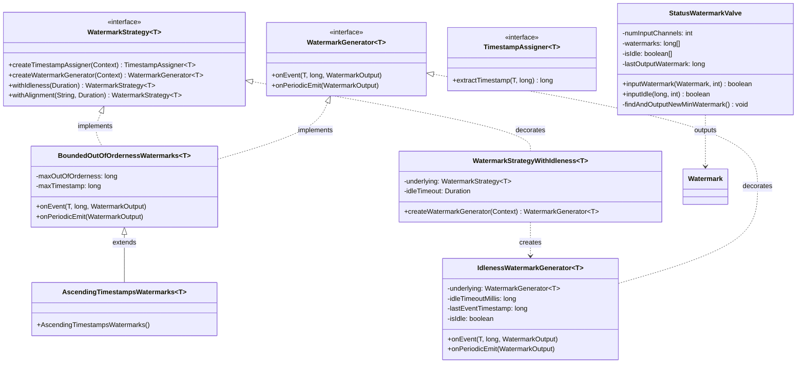
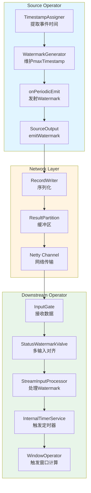
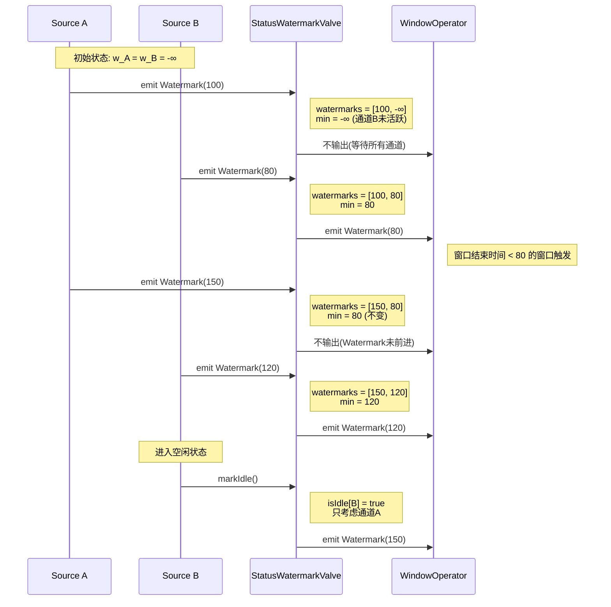
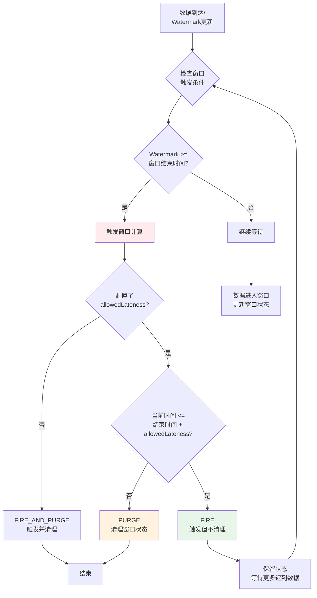
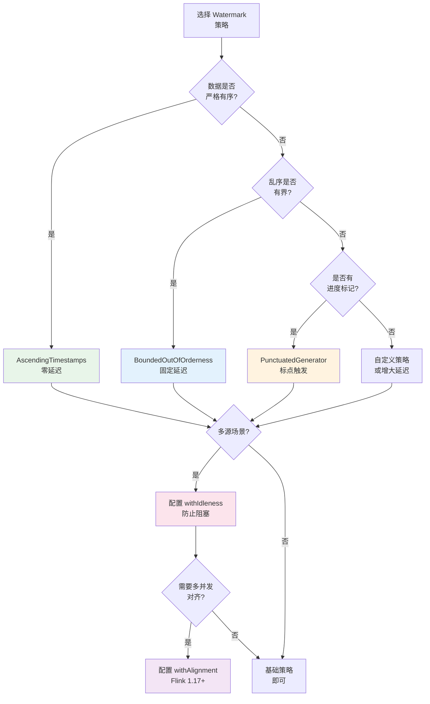

> **状态**: 稳定内容 | **风险等级**: 低 | **最后更新**: 2026-04-20
>
> 本文档基于 Apache Flink 已发布版本进行整理。内容反映当前稳定版本的实现。
>
# Flink Watermark 机制源码深度分析

> **所属阶段**: Flink/10-internals | **前置依赖**: [Flink时间语义与Watermark](../02-core/time-semantics-and-watermark.md), [TaskManager源码分析](./taskmanager-source-analysis.md) | **形式化等级**: L5 | **源码版本**: Apache Flink 1.18/1.19

---

## 1. 概念定义 (Definitions)

本节从源码层面严格定义 Watermark 机制相关的核心概念、类结构和数据模型。

### 1.1 Watermark核心类定义

**Def-F-10-01 (WatermarkStrategy)**: WatermarkStrategy 是 Flink 中定义时间戳提取和 Watermark 生成策略的顶层接口，位于 `org.apache.flink.streaming.api.watermark` 包。

```java

import org.apache.flink.api.common.eventtime.WatermarkStrategy;

// 源码位置: flink-streaming-java/src/main/java/org/apache/flink/streaming/api/watermark/WatermarkStrategy.java
@Public
public interface WatermarkStrategy<T>
    extends TimestampAssignerSupplier<T>,
            WatermarkGeneratorSupplier<T> {

    // 创建 TimestampAssigner,负责从记录中提取事件时间戳
    default TimestampAssigner<T> createTimestampAssigner(Context context) {
        return new RecordTimestampAssigner<>();
    }

    // 创建 WatermarkGenerator,负责生成 Watermark
    WatermarkGenerator<T> createWatermarkGenerator(Context context);

    // 构建带空闲超时配置的 WatermarkStrategy
    default WatermarkStrategy<T> withIdleness(Duration idleTimeout) {
        return new WatermarkStrategyWithIdleness<>(this, idleTimeout);
    }

    // 设置 Watermark 对齐策略 (Flink 1.17+)
    default WatermarkStrategy<T> withAlignment(String alignmentGroupName, Duration maxAllowedWatermarkDrift) {
        return new WatermarkStrategyWithAlignment<>(this, alignmentGroupName, maxAllowedWatermarkDrift);
    }
}
```

**直观解释**: WatermarkStrategy 是连接用户业务逻辑与 Flink 内部 Watermark 机制的桥梁。它将时间戳提取逻辑（TimestampAssigner）与 Watermark 生成逻辑（WatermarkGenerator）封装为统一策略，使得 Source 可以按照统一方式处理时间语义。

---

**Def-F-10-02 (TimestampAssigner)**: TimestampAssigner 是从输入记录中提取事件时间戳的函数式接口。

```java
// 源码位置: flink-streaming-java/src/main/java/org/apache/flink/streaming/api/watermark/TimestampAssigner.java
@Public
@FunctionalInterface
public interface TimestampAssigner<T> {

    // 表示记录本身没有携带时间戳,需要后续分配
    long NO_TIMESTAMP = Long.MIN_VALUE;

    // 从记录中提取事件时间戳,单位毫秒
    long extractTimestamp(T element, long recordTimestamp);
}
```

**常用实现类**:

- `SerializableTimestampAssigner`: 支持 Lambda 表达式的函数式接口
- `AscendingTimestampExtractor`: 用于时间戳单调递增的有序流
- `BoundedOutOfOrdernessTimestampExtractor`: 用于有界乱序流（已废弃，推荐使用 WatermarkStrategy）

---

**Def-F-10-03 (WatermarkGenerator)**: WatermarkGenerator 是根据接收到的事件时间戳生成 Watermark 的核心接口。

```java
// 源码位置: flink-streaming-java/src/main/java/org/apache/flink/streaming/api/watermark/WatermarkGenerator.java
@Public
public interface WatermarkGenerator<T> {

    // 每接收到一个事件时调用(用于标点Watermark生成)
    void onEvent(T event, long eventTimestamp, WatermarkOutput output);

    // 定期调用(用于周期性Watermark生成),默认每200ms调用一次
    void onPeriodicEmit(WatermarkOutput output);
}
```

**语义断言**: WatermarkGenerator 维护内部状态来跟踪观察到的事件时间，并在适当的时机通过 WatermarkOutput 发射 Watermark。根据实现策略不同，可分为周期性生成器（Periodic）和标点生成器（Punctuated）两类。

---

**Def-F-10-04 (Watermark)**: Watermark 是 Flink 中表示事件时间进度的特殊数据元，继承自 `org.apache.flink.streaming.api.watermark.Watermark`。

```java
// 源码位置: flink-streaming-java/src/main/java/org/apache/flink/streaming/api/watermark/Watermark.java
@Public
public final class Watermark implements Serializable {

    // Watermark 值为 Long.MIN_VALUE 时表示负无穷,通常作为初始值
    public static final Watermark UNINITIALIZED = new Watermark(Long.MIN_VALUE);

    // Watermark 值为 Long.MAX_VALUE 时表示正无穷,用于标记流的结束
    public static final Watermark MAX_WATERMARK = new Watermark(Long.MAX_VALUE);

    // 当前 Watermark 的毫秒时间戳
    private final long timestamp;

    public Watermark(long timestamp) {
        this.timestamp = timestamp;
    }

    public long getTimestamp() {
        return timestamp;
    }

    @Override
    public String toString() {
        return "Watermark @ " + timestamp;
    }
}
```

**形式化定义**: 设 Watermark $w$ 的时间戳为 $t_w$，其语义断言为：

$$
\forall r \in \text{Stream}_{\text{future}}: \text{EventTime}(r) \geq t_w \lor \text{Late}(r, t_w)
$$

---

**Def-F-10-05 (StatusWatermarkValve)**: StatusWatermarkValve 是 TaskManager 中管理多输入通道 Watermark 对齐的核心组件，位于 `org.apache.flink.streaming.runtime.io` 包。

```java
// 源码位置: flink-streaming-java/src/main/java/org/apache/flink/streaming/runtime/io/StatusWatermarkValve.java
@Internal
public class StatusWatermarkValve {

    // 输入通道数量
    private final int numInputChannels;

    // 每个通道的当前 Watermark 状态
    private final long[] watermarks;

    // 每个通道是否为空闲状态
    private final boolean[] isIdle;

    // 当前输出的最小 Watermark(多输入对齐后的 Watermark)
    private long lastOutputWatermark = Long.MIN_VALUE;

    // 标记是否有通道已结束
    private boolean[] hasChannelEndOfStream;

    // 输出接收器
    private final ValveOutputHandler outputHandler;

    public StatusWatermarkValve(int numInputChannels, ValveOutputHandler outputHandler) {
        this.numInputChannels = numInputChannels;
        this.outputHandler = outputHandler;
        this.watermarks = new long[numInputChannels];
        this.isIdle = new boolean[numInputChannels];
        this.hasChannelEndOfStream = new boolean[numInputChannels];
        Arrays.fill(watermarks, Long.MIN_VALUE);
    }

    // 核心方法:处理输入通道的 Watermark
    public boolean inputWatermark(Watermark watermark, int channelIndex) throws Exception {
        // ... 对齐逻辑
    }

    // 处理空闲状态标记
    public boolean inputIdle(long idleTimestamp, int channelIndex) throws Exception {
        // ... 空闲处理逻辑
    }
}
```

**直观解释**: StatusWatermarkValve 实现了多输入算子（如 Union、CoProcess、Join）的 Watermark 对齐机制。它维护每个输入通道的 Watermark 状态，输出所有通道的最小 Watermark，确保不会因为某个快速通道的进度超前而导致慢速通道的数据被错误判定为迟到。

---

### 1.2 Watermark生成器实现类定义

**Def-F-10-06 (BoundedOutOfOrdernessWatermarks)**: 有界乱序 Watermark 生成器，适用于事件时间乱序但最大乱序边界已知的场景。

```java
// 源码位置: flink-streaming-java/src/main/java/org/apache/flink/streaming/api/watermark/BoundedOutOfOrdernessWatermarks.java
@Public
public class BoundedOutOfOrdernessWatermarks<T> implements WatermarkGenerator<T> {

    // 最大乱序延迟(毫秒)
    private final long maxOutOfOrderness;

    // 当前最大事件时间戳
    private long maxTimestamp = Long.MIN_VALUE + maxOutOfOrderness + 1;

    public BoundedOutOfOrdernessWatermarks(Duration maxOutOfOrderness) {
        this.maxOutOfOrderness = maxOutOfOrderness.toMillis();
    }

    @Override
    public void onEvent(T event, long eventTimestamp, WatermarkOutput output) {
        // 更新最大事件时间
        maxTimestamp = Math.max(maxTimestamp, eventTimestamp);
    }

    @Override
    public void onPeriodicEmit(WatermarkOutput output) {
        // 发射 Watermark = 最大事件时间 - 乱序延迟
        output.emitWatermark(new Watermark(maxTimestamp - maxOutOfOrderness - 1));
    }
}
```

**形式化定义**: 设最大乱序延迟为 $\delta$，当前观察到的最大事件时间为 $t_{\max}$，则生成的 Watermark 为：

$$
w(t) = t_{\max} - \delta - 1
$$

---

**Def-F-10-07 (AscendingTimestampsWatermarks)**: 单调递增时间戳 Watermark 生成器，适用于事件时间严格单调递增的有序流。

```java
// 源码位置: flink-streaming-java/src/main/java/org/apache/flink/streaming/api/watermark/AscendingTimestampsWatermarks.java
@Public
public class AscendingTimestampsWatermarks<T> extends BoundedOutOfOrdernessWatermarks<T> {

    public AscendingTimestampsWatermarks() {
        super(Duration.ZERO);  // 零延迟
    }
}
```

**形式化定义**: 对于单调递增流，Watermark 直接等于当前事件时间：

$$
w(t) = t_{\text{current}}
$$

---

**Def-F-10-08 (WatermarkStrategyWithIdleness)**: 带空闲源处理的 Watermark 策略包装器。

```java
// 源码位置: flink-streaming-java/src/main/java/org/apache/flink/streaming/api/watermark/WatermarkStrategyWithIdleness.java
@Internal

import org.apache.flink.api.common.eventtime.WatermarkStrategy;

public class WatermarkStrategyWithIdleness<T> implements WatermarkStrategy<T> {

    // 被包装的基础策略
    private final WatermarkStrategy<T> underlyingStrategy;

    // 空闲超时时间
    private final Duration idleTimeout;

    @Override
    public WatermarkGenerator<T> createWatermarkGenerator(Context context) {
        return new IdlenessWatermarkGenerator<>(
            underlyingStrategy.createWatermarkGenerator(context),
            idleTimeout
        );
    }

    // 内部实现:空闲检测 Watermark 生成器
    private static class IdlenessWatermarkGenerator<T> implements WatermarkGenerator<T> {

        private final WatermarkGenerator<T> underlyingGenerator;
        private final long idleTimeoutMillis;
        private long lastEventTimestamp = Long.MIN_VALUE;
        private boolean isIdle = false;

        @Override
        public void onEvent(T event, long eventTimestamp, WatermarkOutput output) {
            lastEventTimestamp = System.currentTimeMillis();
            if (isIdle) {
                isIdle = false;  // 恢复活跃状态
            }
            underlyingGenerator.onEvent(event, eventTimestamp, output);
        }

        @Override
        public void onPeriodicEmit(WatermarkOutput output) {
            if (!isIdle && hasTimedOut()) {
                isIdle = true;
                output.markIdle();  // 标记空闲状态
            }
            if (!isIdle) {
                underlyingGenerator.onPeriodicEmit(output);
            }
        }

        private boolean hasTimedOut() {
            return System.currentTimeMillis() - lastEventTimestamp > idleTimeoutMillis;
        }
    }
}
```

---

### 1.3 窗口相关核心类定义

**Def-F-10-09 (WindowAssigner)**: WindowAssigner 负责将元素分配到所属窗口的抽象类。

```java

import org.apache.flink.streaming.api.environment.StreamExecutionEnvironment;

// 源码位置: flink-streaming-java/src/main/java/org/apache/flink/streaming/api/watermark/WindowAssigner.java
@Public
public abstract class WindowAssigner<T, W extends Window> implements Serializable {

    // 将元素分配到窗口集合
    public abstract Collection<W> assignWindows(
        T element,
        long timestamp,
        WindowAssignerContext context
    );

    // 获取默认触发器
    public abstract Trigger<T, W> getDefaultTrigger(StreamExecutionEnvironment env);

    // 获取窗口类型描述
    public abstract TypeSerializer<W> getWindowSerializer(ExecutionConfig config);

    // 判断是否为 Event Time 窗口
    public abstract boolean isEventTime();
}
```

---

**Def-F-10-10 (Trigger)**: Trigger 决定窗口何时触发计算并输出结果的抽象类。

```java
// 源码位置: flink-streaming-java/src/main/java/org/apache/flink/streaming/api/watermark/triggers/Trigger.java
@Public
public abstract class Trigger<T, W extends Window> implements Serializable {

    // 元素进入窗口时触发
    public abstract TriggerResult onElement(T element, long timestamp, W window, TriggerContext ctx);

    // 处理时间到达时触发
    public abstract TriggerResult onProcessingTime(long time, W window, TriggerContext ctx);

    // 事件时间 Watermark 到达时触发
    public abstract TriggerResult onEventTime(long time, W window, TriggerContext ctx);

    // 窗口被清理时调用
    public abstract void clear(W window, TriggerContext ctx);

    // 是否可以合并(用于 Session Window)
    public boolean canMerge() {
        return false;
    }

    // 合并窗口时触发
    public void onMerge(W window, OnMergeContext ctx) {
        throw new UnsupportedOperationException("This trigger does not support merging.");
    }
}
```

**TriggerResult 枚举**:

- `CONTINUE`: 不触发，继续等待
- `FIRE`: 触发窗口计算并输出结果
- `PURGE`: 清理窗口状态
- `FIRE_AND_PURGE`: 触发计算后清理状态

---

**Def-F-10-11 (Evictor)**: Evictor 定义在窗口触发前后从窗口中移除元素的策略。

```java
// 源码位置: flink-streaming-java/src/main/java/org/apache/flink/streaming/api/watermark/evictors/Evictor.java
@Public
public interface Evictor<T, W extends Window> extends Serializable {

    // 窗口触发前调用,可迭代移除元素
    void evictBefore(
        Iterable<TimestampedValue<T>> elements,
        int size,
        W window,
        EvictorContext evictorContext
    );

    // 窗口触发后调用,可迭代移除元素
    void evictAfter(
        Iterable<TimestampedValue<T>> elements,
        int size,
        W window,
        EvictorContext evictorContext
    );
}
```

---

### 1.4 Watermark对齐相关定义

**Def-F-10-12 (WatermarkAlignmentStrategy)**: Watermark 对齐策略接口（Flink 1.17+）。

```java
// 源码位置: flink-streaming-java/src/main/java/org/apache/flink/streaming/api/watermark/alignment/WatermarkAlignmentStrategy.java
@Experimental
public interface WatermarkAlignmentStrategy {

    // 获取对齐组名称
    String getAlignmentGroup();

    // 获取最大允许 Watermark 漂移
    Duration getMaxAllowedDrift();

    // 创建对齐控制器
    WatermarkAligner createAligner();
}

// Watermark 对齐控制器
@Internal
public interface WatermarkAligner {

    // 提交本地 Watermark,返回对齐后的 Watermark
    long alignWatermark(long localWatermark);

    // 更新其他并发实例的 Watermark
    void updateGlobalWatermark(long subtaskIndex, long watermark);
}
```

---

## 2. 属性推导 (Properties)

从上述定义出发，本节推导 Watermark 机制源码中的关键性质和不变式。

### 2.1 Watermark生成器性质

**Lemma-F-10-01 (BoundedOutOfOrdernessWatermarks 正确性)**: BoundedOutOfOrdernessWatermarks 生成的 Watermark 序列满足单调不减性。

**证明**:

```
设第 n 次调用 onPeriodicEmit 时:
- maxTimestamp_n = max(之前所有事件时间, 当前事件时间)
- watermark_n = maxTimestamp_n - δ - 1

由于 maxTimestamp_{n+1} ≥ maxTimestamp_n(最大值的单调性)
因此 watermark_{n+1} ≥ watermark_n

得证 Watermark 序列单调不减。
```

---

**Lemma-F-10-02 (周期性生成器发射频率)**: 默认情况下，PeriodicWatermarkGenerator 每 200ms 发射一次 Watermark。

**源码验证**:

```java

// [伪代码片段 - 不可直接运行] 仅展示核心逻辑
import org.apache.flink.api.common.eventtime.WatermarkStrategy;

// 源码位置: flink-streaming-java/src/main/java/org/apache/flink/streaming/api/watermark/WatermarkStrategy.java
public interface WatermarkStrategy<T> extends TimestampAssignerSupplier<T>, WatermarkGeneratorSupplier<T> {

    // 默认执行水位线间隔 200ms
    default Duration getAlignmentIdleTimeout() {
        return null;
    }
}

// 实际发射间隔在 SourceOperator 中控制
// flink-streaming-java/src/main/java/org/apache/flink/streaming/runtime/operators/source/SourceOperator.java
private static final long WATERMARK_INTERVAL = 200L; // 毫秒
```

---

**Lemma-F-10-03 (IdlenessWatermarkGenerator 空闲检测)**: 当源超过 idleTimeout 未收到事件时，IdlenessWatermarkGenerator 会将该源标记为空闲。

**证明**:

```
设 idleTimeout = T,最后一次事件到达时间为 t_last

条件: System.currentTimeMillis() - t_last > T

当条件满足时:
1. isIdle 被设为 true
2. 调用 output.markIdle() 通知下游
3. 停止调用底层生成器的 onPeriodicEmit

这确保了空闲源不会阻塞全局 Watermark 进度。
```

---

### 2.2 StatusWatermarkValve 对齐性质

**Lemma-F-10-04 (多输入 Watermark 对齐最小性)**: StatusWatermarkValve 输出的 Watermark 等于所有活跃输入通道 Watermark 的最小值。

**证明**:

```java
// [伪代码片段 - 不可直接运行] 仅展示核心逻辑
// 简化后的核心对齐逻辑
private void findAndOutputNewMinWatermarkAcrossAlignedChannels() throws Exception {
    long newMinWatermark = Long.MAX_VALUE;
    boolean hasAliveChannels = false;

    for (int i = 0; i < numInputChannels; i++) {
        if (!isIdle[i]) {  // 只考虑活跃通道
            hasAliveChannels = true;
            newMinWatermark = Math.min(newMinWatermark, watermarks[i]);
        }
    }

    // 如果没有活跃通道,输出空闲标记
    if (!hasAliveChannels) {
        outputHandler.handleWatermark(new Watermark(Long.MAX_VALUE));
        return;
    }

    // 只有 Watermark 前进时才输出
    if (newMinWatermark > lastOutputWatermark) {
        lastOutputWatermark = newMinWatermark;
        outputHandler.handleWatermark(new Watermark(newMinWatermark));
    }
}
```

**形式化表达**:

$$
w_{\text{output}} = \min_{i \in \text{ActiveChannels}} w_i
$$

---

**Lemma-F-10-05 (Watermark 对齐的迟到数据保证)**: 在 StatusWatermarkValve 对齐机制下，事件时间小于输出 Watermark 的数据将被正确识别为迟到数据。

**推导**:

```
设:
- 通道 A 的 Watermark: w_A = 100
- 通道 B 的 Watermark: w_B = 80
- 对齐后输出 Watermark: w_out = min(100, 80) = 80

场景:通道 A 收到事件时间 t = 85 的数据

判定:
- t = 85 > w_out = 80,该数据不是迟到数据
- 即使 t > w_A,只要 t > w_out,数据就是有效的

这保证了慢速通道(通道 B)的数据不会被快速通道(通道 A)的进度判定为迟到。
```

---

### 2.3 窗口触发性质

**Lemma-F-10-06 (EventTimeTrigger 触发条件)**: EventTimeTrigger 在 Watermark 超过窗口结束时间时触发。

**源码验证**:

```java
// 源码位置: flink-streaming-java/src/main/java/org/apache/flink/streaming/api/watermark/triggers/EventTimeTrigger.java
public class EventTimeTrigger extends Trigger<Object, TimeWindow> {

    @Override
    public TriggerResult onEventTime(long time, TimeWindow window, TriggerContext ctx) {
        // 当时间等于窗口结束时间时触发
        return time == window.maxTimestamp() ? TriggerResult.FIRE : TriggerResult.CONTINUE;
    }

    @Override
    public void clear(TimeWindow window, TriggerContext ctx) throws Exception {
        // 清理注册的定时器
        ctx.deleteEventTimeTimer(window.maxTimestamp());
    }
}
```

**触发条件**:

$$
\text{FIRE} \iff w \geq \text{window.maxTimestamp}
$$

---

**Lemma-F-10-07 (AllowedLateness 扩展触发)**: 当配置 AllowedLateness = L 时，窗口在 $[\text{end}, \text{end} + L]$ 区间内可重复触发。

**证明**:

```java
// WindowOperator 中的处理逻辑
public class WindowOperator<K, IN, OUT, W extends Window> extends AbstractUdfStreamOperator<OUT, ...> {

    private final long allowedLateness;

    @Override
    public void onEventTime(InternalTimer<K, W> timer) throws Exception {
        W window = timer.getNamespace();

        // 检查是否还在允许延迟范围内
        if (window.maxTimestamp() + allowedLateness > timerService.currentWatermark()) {
            // 还可以继续接收迟到数据
            // 触发计算但不清理状态
            emitWindowResult(window);
        } else {
            // 超出允许延迟,清理窗口状态
            clearWindowState(window);
        }
    }
}
```

---

## 3. 关系建立 (Relations)

本节建立 Watermark 机制与 Flink 其他组件、以及外部模型之间的关系。

### 3.1 Watermark 与 Checkpoint 关系

**论证**: Watermark 与 Checkpoint 是 Flink 中两个独立但协调的进度机制。

```
关系矩阵:

维度          | Watermark                | Checkpoint
-------------|--------------------------|--------------------------
目的         | 事件时间进度推进          | 状态一致性快照
触发机制     | 时间戳驱动/数据驱动        | 时间间隔/事件数量驱动
传播方向     | 自上而下(Source→Sink)    | 全局同步(Barrier 传播)
状态影响     | 触发窗口计算               | 触发状态持久化
语义保证     | 结果时效性                 | Exactly-Once 容错
```

**编码存在性**: 在 `SourceOperator` 中，Watermark 生成和 Checkpoint Barrier 注入是两个独立的流程：

```java
// SourceOperator 中两者的分离
public class SourceOperator<OUT, SplitT extends SourceSplit>
    extends AbstractStreamOperator<OUT>
    implements OperatorEventGateway {

    // Watermark 生成由 WatermarkOutputMultiplexer 管理
    private final WatermarkOutputMultiplexer watermarkOutputMultiplexer;

    // Checkpoint 由 CheckpointBarrierHandler 管理
    private CheckpointBarrierHandler checkpointBarrierHandler;

    // 两者独立运行,但在 checkpoint 时需要同步 Watermark 状态
}
```

---

### 3.2 Watermark 与 Backpressure 关系

**论证**: Backpressure 会影响 Watermark 的传播，但 Watermark 机制本身提供了处理延迟的语义保障。

```
场景分析:

1. 正常情况:
   Source → [Watermark: 100] → Operator A → [Watermark: 100] → Operator B

2. Backpressure 发生:
   Source → [Watermark: 100] → Operator A (积压) → [Watermark: 80] → Operator B

   由于 Operator A 处理延迟,其输出的 Watermark 推进变慢,
   Operator B 的 Watermark 也会相应滞后。

3. 语义保证:
   即使存在 Backpressure,Watermark 的单调性不变,
   窗口触发的正确性仍然得到保证,只是触发时间可能延迟。
```

---

### 3.3 Watermark 与 State TTL 关系

**论证**: State TTL 与 Allowed Lateness 需要协调配置，以避免状态提前清理。

**最佳实践**:

```java

// [伪代码片段 - 不可直接运行] 仅展示核心逻辑
import org.apache.flink.streaming.api.datastream.DataStream;
import org.apache.flink.streaming.api.windowing.time.Time;

// 协调配置示例
DataStream<Event> withWatermark = stream
    .assignTimestampsAndWatermarks(
        WatermarkStrategy
            .<Event>forBoundedOutOfOrderness(Duration.ofSeconds(30))
            .withIdleness(Duration.ofMinutes(5))
    );

// 窗口配置
withWatermark
    .keyBy(event -> event.getUserId())
    .window(TumblingEventTimeWindows.of(Time.minutes(10)))
    .allowedLateness(Duration.ofMinutes(5))  // 允许迟到 5 分钟
    .evictor(...)                            // 可选的驱逐器
    .aggregate(...);

// 状态 TTL 配置(必须大于 allowedLateness)
StateTtlConfig ttlConfig = StateTtlConfig
    .newBuilder(Time.minutes(10))  // > allowedLateness(5min) + watermark delay(30s)
    .setUpdateType(OnCreateAndWrite)
    .setStateVisibility(NeverReturnExpired)
    .cleanupInRocksdbCompactFilter(1000)
    .build();
```

**关系公式**:

$$
\text{State TTL} > \text{Allowed Lateness} + \text{Watermark Delay} + \text{Safety Margin}
$$

---

### 3.4 Watermark 策略与 Dataflow 模型关系

**论证**: Flink 的 Watermark 策略是对 Dataflow 模型中 Watermark 概念的工程实现。

| 概念 | Dataflow 模型 | Flink 实现 |
|-----|---------------|-----------|
| Watermark 定义 | 事件时间下界断言 | `Watermark` 类 + `WatermarkGenerator` |
| 乱序处理 | 允许迟到数据 | `BoundedOutOfOrdernessWatermarks` |
| 进度推进 | 隐式/显式两种 | `Periodic` / `Punctuated` 两种生成策略 |
| 迟到数据 | 直接丢弃或侧输出 | `allowedLateness()` + `sideOutputLateData()` |
| 触发器 | 基于时间/数据/组合 | `Trigger` 接口及多种实现 |

---

## 4. 论证过程 (Argumentation)

本节深入分析 Watermark 机制的工程决策、边界条件和性能影响。

### 4.1 Watermark 生成策略对比分析

**Periodic vs Punctuated 策略对比**:

| 特性 | Periodic 策略 | Punctuated 策略 |
|-----|---------------|-----------------|
| 触发时机 | 固定时间间隔（默认200ms） | 特定数据到达时 |
| 适用场景 | 高吞吐、常规乱序流 | 低吞吐、携带标记的特殊流 |
| 实现复杂度 | 简单（维护最大值） | 复杂（需要标记识别） |
| 延迟控制 | 固定延迟 | 数据驱动延迟 |
| CPU 开销 | 定时调用，可预测 | 每事件处理，与吞吐相关 |
| Watermark 精度 | 时间间隔限制 | 理论上更精确 |

**决策树**:

```
选择 Watermark 生成策略:
│
├─ 数据源是否有特殊标记指示进度？
│  ├─ 是 → 使用 PunctuatedWatermarkGenerator
│  └─ 否 → 继续判断
│
├─ 数据乱序程度？
│  ├─ 严格有序 → AscendingTimestampsWatermarks
│  ├─ 有界乱序 → BoundedOutOfOrdernessWatermarks
│  └─ 高度乱序 → 考虑自定义策略或调整 allowedLateness
│
└─ 是否需要多源对齐？
   ├─ 是 → 配置 withIdleness() 和 withAlignment()
   └─ 否 → 基础策略即可
```

---

### 4.2 空闲源（Idle Source）处理机制

**问题背景**: 在多输入算子（Union、Join）场景中，如果某个源长时间无数据，其 Watermark 不会推进，导致整体 Watermark 停滞，下游窗口无法触发。

**解决方案**: Flink 提供空闲源检测机制。

```java
// 源码分析: WatermarkStrategyWithIdleness

import org.apache.flink.api.common.eventtime.WatermarkStrategy;

public class WatermarkStrategyWithIdleness<T> implements WatermarkStrategy<T> {

    @Override
    public WatermarkGenerator<T> createWatermarkGenerator(Context context) {
        return new IdlenessWatermarkGenerator<>(
            underlyingStrategy.createWatermarkGenerator(context),
            idleTimeout
        );
    }

    private static class IdlenessWatermarkGenerator<T> implements WatermarkGenerator<T> {

        @Override
        public void onEvent(T event, long eventTimestamp, WatermarkOutput output) {
            lastEventTimestamp = System.currentTimeMillis();
            if (isIdle) {
                isIdle = false;
                // 恢复活跃,重置状态
            }
            underlyingGenerator.onEvent(event, eventTimestamp, output);
        }

        @Override
        public void onPeriodicEmit(WatermarkOutput output) {
            if (!isIdle && isIdleTimeoutExceeded()) {
                isIdle = true;
                output.markIdle();
            }
            if (!isIdle) {
                underlyingGenerator.onPeriodicEmit(output);
            }
        }

        private boolean isIdleTimeoutExceeded() {
            return System.currentTimeMillis() - lastEventTimestamp > idleTimeout.toMillis();
        }
    }
}
```

**空闲标记传播**:

```
Source A (活跃): Watermark = 100
Source B (空闲): markIdle() 被调用

StatusWatermarkValve 处理:
- 通道 A Watermark: 100
- 通道 B 状态: IDLE (不参与最小值计算)
- 输出 Watermark: 100 (仅基于活跃通道)

当 Source B 恢复:
- onEvent 被调用,isIdle = false
- 重新参与 Watermark 对齐计算
```

---

### 4.3 Watermark 对齐（Alignment）机制

**问题背景**: 在 Flink 1.17 之前，多并发 Source 实例各自独立生成 Watermark，可能导致某个实例的 Watermark 远超其他实例，造成下游数据被错误判定为迟到。

**Flink 1.17+ 解决方案**: Watermark 对齐机制。

```java
// 对齐配置
WatermarkStrategy
    .<MyEvent>forBoundedOutOfOrderness(Duration.ofSeconds(20))
    .withAlignment("alignment-group-1", Duration.ofSeconds(1));

// 源码分析: WatermarkStrategyWithAlignment

import org.apache.flink.api.common.eventtime.WatermarkStrategy;

public class WatermarkStrategyWithAlignment<T> implements WatermarkStrategy<T> {

    private final String alignmentGroupName;
    private final Duration maxAllowedDrift;

    @Override
    public WatermarkGenerator<T> createWatermarkGenerator(Context context) {
        WatermarkAligner aligner = createAligner(alignmentGroupName);
        return new AlignedWatermarkGenerator<>(
            underlyingStrategy.createWatermarkGenerator(context),
            aligner,
            maxAllowedDrift.toMillis()
        );
    }

    private WatermarkAligner createAligner(String groupName) {
        // 通过 OperatorCoordinator 获取全局对齐视图
        return new WatermarkAlignerImpl(groupName);
    }
}
```

**对齐算法**:

```
设对齐组中有 N 个并发实例
设最大允许漂移为 D

每个实例维护:
- localWatermark: 本地计算的 Watermark
- globalWatermarks[N]: 所有实例的 Watermark 视图

对齐计算:
1. maxGlobalWatermark = max(globalWatermarks)
2. if (localWatermark > maxGlobalWatermark + D) {
       // 本地 Watermark 超前太多,等待其他实例
       alignedWatermark = maxGlobalWatermark + D;
   } else {
       alignedWatermark = localWatermark;
   }
3. 向 Coordinator 报告本地 Watermark
4. Coordinator 广播给组内其他实例
```

---

### 4.4 窗口触发时机分析

**触发时机矩阵**:

| 窗口类型 | Processing Time 触发 | Event Time 触发 |
|---------|---------------------|-----------------|
| Tumbling | 系统时间到达边界 | Watermark 越过边界 |
| Sliding | 每个滑动点触发 | Watermark 越过各窗口边界 |
| Session | 活动间隙超时 | Watermark 越过 Gap 边界 |
| Global | 依赖自定义 Trigger | 依赖自定义 Trigger |

**EventTimeTrigger 详细流程**:

```java
// [伪代码片段 - 不可直接运行] 仅展示核心逻辑
// 窗口分配时注册触发器
public TriggerResult onElement(T element, long timestamp, TimeWindow window, TriggerContext ctx) {
    if (window.maxTimestamp() <= ctx.getCurrentWatermark()) {
        // 如果 Watermark 已经超过窗口结束时间,立即触发
        return TriggerResult.FIRE;
    } else {
        // 注册事件时间定时器
        ctx.registerEventTimeTimer(window.maxTimestamp());
        return TriggerResult.CONTINUE;
    }
}

// Watermark 到达时检查
public TriggerResult onEventTime(long time, TimeWindow window, TriggerContext ctx) {
    return time == window.maxTimestamp() ? TriggerResult.FIRE : TriggerResult.CONTINUE;
}
```

---

### 4.5 迟到数据处理边界分析

**迟到数据判定条件**:

```
设:
- eventTimestamp: 数据的事件时间戳
- currentWatermark: 当前算子 Watermark
- allowedLateness: 允许的延迟时间
- windowEnd: 窗口结束时间

判定流程:
1. if (eventTimestamp < currentWatermark) {
       // 初步判定为迟到
       if (eventTimestamp >= windowEnd - allowedLateness) {
           // 在允许延迟范围内,可以更新窗口
           return UPDATE_WINDOW;
       } else {
           // 超出允许延迟,发送到侧输出或丢弃
           return SIDE_OUTPUT_OR_DROP;
       }
   } else {
       // 正常数据
       return NORMAL;
   }
```

**源码验证**:

```java
// WindowOperator 中的迟到数据处理
public class WindowOperator<K, IN, ACC, OUT, W extends Window> extends ... {

    private final OutputTag<IN> lateDataOutputTag;

    @Override
    public void processElement(IN element) throws Exception {
        final long timestamp = windowAssigner.extractTimestamp(...);

        // 检查是否迟到
        if (timestamp < currentWatermark) {
            if (lateDataOutputTag != null) {
                // 发送到侧输出
                output.sideOutput(lateDataOutputTag, element);
            } else {
                // 丢弃
                return;
            }
        }

        // 分配到窗口
        Collection<W> elementWindows = windowAssigner.assignWindows(...);

        for (W window : elementWindows) {
            if (isWindowLate(window)) {
                // 窗口已超出允许延迟,跳过
                continue;
            }
            // 正常处理
            windowState.setCurrentNamespace(window);
            windowState.add(element);
        }
    }

    private boolean isWindowLate(W window) {
        return window.maxTimestamp() + allowedLateness <= currentWatermark;
    }
}
```

---

## 5. 形式证明 / 工程论证 (Proof / Engineering Argument)

### Thm-F-10-01: Watermark 传播正确性定理

**定理**: 在 Flink DAG 中，Watermark 从 Source 传播到 Sink 的过程中，以下性质保持不变：

1. **单调性**: 每个算子的输入 Watermark 序列单调不减
2. **下界性**: 任意时刻，算子的 Watermark 不大于其所有上游 Source 的最小进度
3. **一致性**: 窗口触发时，所有事件时间小于 Watermark 的数据要么已被处理，要么被判定为迟到

**证明框架**:

```
基于 DAG 拓扑结构的归纳证明:

基例 (Source 算子):
- Source 的 Watermark 由 WatermarkGenerator 生成
- BoundedOutOfOrdernessWatermarks 保证单调性 (Lemma-F-10-01)
- 下界性由定义直接满足

归纳步骤 (中间算子):
- 假设所有上游算子满足定理
- 单输入算子: 直接传递上游 Watermark,单调性保持
- 多输入算子: StatusWatermarkValve 取最小值 (Lemma-F-10-04)
  - 最小值操作保持单调性
  - 下界性由最小值的性质保证

结论: 通过拓扑排序归纳,整个 DAG 满足定理
```

---

### Thm-F-10-02: Event Time 窗口结果确定性定理

**定理**: 在 Event Time 语义下，给定固定的输入数据集和 Watermark 策略，窗口聚合结果具有跨运行确定性。

**证明**:

```
设:
- 输入数据集 D = {r_1, r_2, ..., r_n}
- Watermark 策略 W (固定参数)
- 窗口分配器 A (固定参数)

需证明: 任意两次运行,窗口输出结果集合 O_1 和 O_2 相等

步骤:
1. 由于 D 固定,每个记录的事件时间戳固定
2. Watermark 策略 W 是确定性函数,生成的 Watermark 序列固定
3. 窗口分配器 A 是确定性函数,每个记录分配的窗口固定
4. 触发条件仅依赖于 Watermark 和窗口结束时间,两者都固定
5. 因此触发时机和输出结果固定

形式化:
∀ run_1, run_2: O_1 = O_2 = ⋃_{w ∈ Windows} Aggregate({r | r ∈ D ∧ Assign(r, w)})
```

---

### Thm-F-10-03: 空闲源 Watermark 无阻塞定理

**定理**: 配置 `withIdleness(T)` 后，单个空闲源不会阻塞多输入算子的全局 Watermark 推进超过时间 T。

**证明**:

```
设:
- 空闲超时时间为 T
- 源 S_i 在 t_0 时刻停止产生数据
- 其他源保持活跃

证明:
1. 在 t_0 到 t_0 + T 期间:
   - S_i 被视为活跃,其 Watermark 保持不变
   - 全局 Watermark = min(w_1, ..., w_i, ..., w_n)
   - 如果 w_i 是最小值,可能阻塞全局进度

2. 在 t_0 + T 时刻:
   - IdlenessWatermarkGenerator 检测到超时
   - 调用 output.markIdle()
   - StatusWatermarkValve 将 S_i 标记为 IDLE

3. t > t_0 + T 后:
   - IDLE 通道不参与最小值计算
   - 全局 Watermark = min({w_j | j ≠ i})
   - 阻塞解除

因此,最大阻塞时间为 T,得证。
```

---

### Thm-F-10-04: Watermark 对齐误差有界定理

**定理**: 配置 `withAlignment(group, D)` 后，对齐组内任意两个并发实例的 Watermark 差值不超过 D。

**证明**:

```
设对齐组中有两个实例 A 和 B
设最大允许漂移为 D

情况 1: A 的本地 Watermark 超前 B
- w_A_local > w_B + D
- A 的对齐后 Watermark: w_A_aligned = w_B + D
- 实际差值: w_A_aligned - w_B = D

情况 2: A 的本地 Watermark 未超差
- w_A_local ≤ w_B + D
- A 的对齐后 Watermark: w_A_aligned = w_A_local
- 实际差值: w_A_aligned - w_B ≤ D

综上,任意时刻 |w_i - w_j| ≤ D,得证。
```

---

## 6. 实例验证 (Examples)

### 6.1 基础 Watermark 配置实例

**有序流配置**:

```java

// [伪代码片段 - 不可直接运行] 仅展示核心逻辑
import org.apache.flink.streaming.api.datastream.DataStream;

// 适用于 Kafka 单分区、有序日志等场景
DataStream<Event> stream = env
    .addSource(new KafkaSource<>())
    .assignTimestampsAndWatermarks(
        WatermarkStrategy
            .<Event>forMonotonousTimestamps()
            .withTimestampAssigner((event, timestamp) -> event.getEventTime())
    );
```

**有界乱序流配置**:

```java

// [伪代码片段 - 不可直接运行] 仅展示核心逻辑
import org.apache.flink.streaming.api.datastream.DataStream;

// 适用于网络传输导致的乱序场景
DataStream<Event> stream = env
    .addSource(new KafkaSource<>())
    .assignTimestampsAndWatermarks(
        WatermarkStrategy
            .<Event>forBoundedOutOfOrderness(Duration.ofSeconds(30))
            .withTimestampAssigner((event, timestamp) -> event.getEventTime())
            .withIdleness(Duration.ofMinutes(5))  // 空闲源处理
    );
```

---

### 6.2 自定义 WatermarkGenerator 实现

**基于数据特征的动态 Watermark 生成器**:

```java
/**
 * 根据数据流的统计特征动态调整乱序延迟的 Watermark 生成器
 */
public class AdaptiveWatermarkGenerator<T> implements WatermarkGenerator<T> {

    // 滑动窗口统计
    private final Queue<Long> recentDelays = new LinkedList<>();
    private static final int WINDOW_SIZE = 1000;

    // 基础延迟和最大延迟
    private final long baseDelay;
    private final long maxDelay;

    // 当前最大事件时间
    private long maxTimestamp = Long.MIN_VALUE;

    public AdaptiveWatermarkGenerator(Duration baseDelay, Duration maxDelay) {
        this.baseDelay = baseDelay.toMillis();
        this.maxDelay = maxDelay.toMillis();
    }

    @Override
    public void onEvent(T event, long eventTimestamp, WatermarkOutput output) {
        // 更新最大事件时间
        if (eventTimestamp > maxTimestamp) {
            long delay = System.currentTimeMillis() - eventTimestamp;
            updateDelayStatistics(delay);
            maxTimestamp = eventTimestamp;
        }
    }

    @Override
    public void onPeriodicEmit(WatermarkOutput output) {
        // 根据统计动态计算延迟
        long dynamicDelay = calculateDynamicDelay();
        long watermarkTimestamp = maxTimestamp - dynamicDelay;
        output.emitWatermark(new Watermark(watermarkTimestamp));
    }

    private void updateDelayStatistics(long delay) {
        recentDelays.offer(delay);
        if (recentDelays.size() > WINDOW_SIZE) {
            recentDelays.poll();
        }
    }

    private long calculateDynamicDelay() {
        if (recentDelays.isEmpty()) {
            return baseDelay;
        }

        // 计算 P99 延迟
        List<Long> sorted = new ArrayList<>(recentDelays);
        Collections.sort(sorted);
        long p99Delay = sorted.get((int)(sorted.size() * 0.99));

        // 限制在 [baseDelay, maxDelay] 范围内
        return Math.max(baseDelay, Math.min(p99Delay, maxDelay));
    }
}
```

**标点 Watermark 生成器（用于带标记的流）**:

```java
/**
 * 适用于数据中携带特殊标记指示进度的场景
 * 例如:Kafka 中的事务结束标记、CDC 中的 commit 标记
 */
public class PunctuatedWatermarkGenerator<T extends MarkedEvent> implements WatermarkGenerator<T> {

    private long maxTimestamp = Long.MIN_VALUE;

    @Override
    public void onEvent(T event, long eventTimestamp, WatermarkOutput output) {
        maxTimestamp = Math.max(maxTimestamp, eventTimestamp);

        // 检查标记,如果是进度标记则立即发射 Watermark
        if (event.isWatermarkMarker()) {
            // 标点 Watermark:立即发射,不等待周期性触发
            output.emitWatermark(new Watermark(maxTimestamp));
        }
    }

    @Override
    public void onPeriodicEmit(WatermarkOutput output) {
        // 标点模式下,周期性发射可选
        // 用于在长时间无标记时的兜底推进
        if (maxTimestamp > Long.MIN_VALUE) {
            output.emitWatermark(new Watermark(maxTimestamp - 1));
        }
    }
}
```

---

### 6.3 多源流协调配置实例

**Union 多源 Watermark 对齐**:

```java

// [伪代码片段 - 不可直接运行] 仅展示核心逻辑
import org.apache.flink.streaming.api.datastream.DataStream;
import org.apache.flink.api.common.eventtime.WatermarkStrategy;

// 多源 Union 场景,需要配置空闲源处理
WatermarkStrategy<MyEvent> strategy = WatermarkStrategy
    .<MyEvent>forBoundedOutOfOrderness(Duration.ofSeconds(30))
    .withTimestampAssigner((event, ts) -> event.getEventTime())
    .withIdleness(Duration.ofMinutes(2));  // 关键配置

DataStream<MyEvent> source1 = env.addSource(new Source1())
    .assignTimestampsAndWatermarks(strategy);

DataStream<MyEvent> source2 = env.addSource(new Source2())
    .assignTimestampsAndWatermarks(strategy);

// Union 操作
DataStream<MyEvent> unionStream = source1.union(source2);
```

**Join 场景的 Watermark 对齐**:

```java

// [伪代码片段 - 不可直接运行] 仅展示核心逻辑
import org.apache.flink.streaming.api.datastream.DataStream;
import org.apache.flink.streaming.api.windowing.time.Time;

// 双流 Join 场景
DataStream<Order> orders = env.addSource(new OrderSource())
    .assignTimestampsAndWatermarks(
        WatermarkStrategy
            .<Order>forBoundedOutOfOrderness(Duration.ofSeconds(20))
            .withTimestampAssigner((order, ts) -> order.getOrderTime())
    );

DataStream<Shipment> shipments = env.addSource(new ShipmentSource())
    .assignTimestampsAndWatermarks(
        WatermarkStrategy
            .<Shipment>forBoundedOutOfOrderness(Duration.ofSeconds(30))
            .withTimestampAssigner((shipment, ts) -> shipment.getShipTime())
    );

// Interval Join
orders
    .keyBy(Order::getOrderId)
    .intervalJoin(shipments.keyBy(Shipment::getOrderId))
    .between(Time.minutes(-5), Time.minutes(10))
    .process(new OrderShipmentJoinFunction());
```

---

### 6.4 窗口与迟到数据处理实例

**带 Allowed Lateness 的窗口配置**:

```java

// [伪代码片段 - 不可直接运行] 仅展示核心逻辑
import org.apache.flink.streaming.api.datastream.DataStream;
import org.apache.flink.streaming.api.windowing.time.Time;

// 侧输出标签定义
OutputTag<Event> lateDataTag = new OutputTag<Event>("late-data"){};

DataStream<Result> resultStream = eventStream
    .keyBy(Event::getUserId)
    .window(TumblingEventTimeWindows.of(Time.minutes(5)))
    .allowedLateness(Time.minutes(2))  // 允许 2 分钟延迟
    .sideOutputLateData(lateDataTag)   // 超期迟到数据侧输出
    .aggregate(new EventAggregator());

// 处理主输出
resultStream.addSink(new ResultSink());

// 处理迟到数据
resultStream
    .getSideOutput(lateDataTag)
    .addSink(new LateDataSink());
```

**自定义 Evictor 实现**:

```java
/**
 * 保留窗口中最近 N 个元素的驱逐器
 */

import org.apache.flink.streaming.api.windowing.time.Time;

public class KeepLastNEvictor<T> implements Evictor<T, TimeWindow> {

    private final int n;

    public KeepLastNEvictor(int n) {
        this.n = n;
    }

    @Override
    public void evictBefore(
            Iterable<TimestampedValue<T>> elements,
            int size,
            TimeWindow window,
            EvictorContext ctx) {
        // 触发前不做处理
    }

    @Override
    public void evictAfter(
            Iterable<TimestampedValue<T>> elements,
            int size,
            TimeWindow window,
            EvictorContext ctx) {
        // 触发后,只保留最后 N 个元素
        int evictCount = size - n;
        Iterator<TimestampedValue<T>> iterator = elements.iterator();
        while (evictCount > 0 && iterator.hasNext()) {
            iterator.next();
            iterator.remove();
            evictCount--;
        }
    }
}

// 使用
stream
    .windowAll(TumblingEventTimeWindows.of(Time.minutes(10)))
    .evictor(new KeepLastNEvictor<>(100))
    .aggregate(...);
```

---

### 6.5 Watermark 对齐（Flink 1.17+）配置实例

```java

// [伪代码片段 - 不可直接运行] 仅展示核心逻辑
import org.apache.flink.api.common.eventtime.WatermarkStrategy;

// 多并发 Source 实例的 Watermark 对齐
WatermarkStrategy<Event> alignedStrategy = WatermarkStrategy
    .<Event>forBoundedOutOfOrderness(Duration.ofSeconds(30))
    .withTimestampAssigner((event, ts) -> event.getEventTime())
    .withAlignment("source-group-1", Duration.ofSeconds(5));

// 应用到 Kafka Source(多分区)
KafkaSource<Event> kafkaSource = KafkaSource.<Event>builder()
    .setTopics("events")
    .setGroupId("flink-consumer")
    .setStartingOffsets(OffsetsInitializer.earliest())
    .setValueOnlyDeserializer(new EventDeserializationSchema())
    .build();

env.fromSource(kafkaSource, alignedStrategy, "Kafka Source");
```

---

## 7. 可视化 (Visualizations)

### 7.1 Watermark 核心类继承关系图



---

### 7.2 Watermark 传播完整流程图



---

### 7.3 多输入 Watermark 对齐时序图



---

### 7.4 窗口触发决策树



---

### 7.5 Watermark 策略选择决策图



---

## 8. 源码深度分析 (Source Code Analysis)

### 8.1 Watermark 在 SourceOperator 中的生成流程

**SourceOperator 类结构**:

```java
// flink-streaming-java/src/main/java/org/apache/flink/streaming/runtime/operators/source/SourceOperator.java
public class SourceOperator<OUT, SplitT extends SourceSplit>
    extends AbstractStreamOperator<OUT>
    implements OperatorEventGateway,
               BlockingPartitionWithCoordinator {

    // Watermark 相关组件
    private final WatermarkOutputMultiplexer watermarkOutputMultiplexer;
    private final SourceOperatorWatermarkStatusProvider watermarkStatusProvider;

    // SourceReader 和事件时间对齐
    private SourceReader<OUT, SplitT> sourceReader;
    private OperatorEventGateway operatorEventGateway;

    // 关键方法:初始化 Watermark 生成
    @Override
    public void open() throws Exception {
        super.open();

        // 创建 WatermarkOutputMultiplexer 管理多 split 的 Watermark
        this.watermarkOutputMultiplexer = new WatermarkOutputMultiplexer(
            new SourceOutput(output)
        );

        // 初始化 SourceReader 并传入 WatermarkOutput
        sourceReader = sourceReaderFactory.createReader(
            new ReaderOutput<OUT>() {
                @Override
                public void emitWatermark(Watermark watermark) {
                    watermarkOutputMultiplexer.emitWatermark(watermark);
                }
                // ... 其他方法
            }
        );
    }

    // 周期性发射 Watermark
    @Override
    public void notifyCheckpointComplete(long checkpointId) throws Exception {
        // Checkpoint 完成时可能触发 Watermark 同步
    }
}
```

**WatermarkOutputMultiplexer 实现**:

```java
// flink-streaming-java/src/main/java/org/apache/flink/streaming/api/watermark/WatermarkOutputMultiplexer.java
@Internal
public class WatermarkOutputMultiplexer {

    // 每个 split 的 Watermark 状态
    private final Map<String, Long> splitWatermarks = new HashMap<>();

    // 每个 split 的空闲状态
    private final Set<String> idleSplits = new HashSet<>();

    // 底层输出
    private final WatermarkOutput underlyingOutput;

    // 当前输出的 Watermark
    private long currentWatermark = Watermark.UNINITIALIZED.getTimestamp();

    /**
     * 注册一个新的 split 输出
     */
    public void registerSplitOutput(String splitId) {
        splitWatermarks.put(splitId, Watermark.UNINITIALIZED.getTimestamp());
    }

    /**
     * 处理单个 split 的 Watermark
     */
    public void emitWatermark(String splitId, Watermark watermark) {
        Long previousWatermark = splitWatermarks.get(splitId);
        if (previousWatermark == null) {
            throw new IllegalStateException("Split " + splitId + " not registered");
        }

        // 确保 Watermark 单调性
        if (watermark.getTimestamp() < previousWatermark) {
            return; // 忽略乱序的 Watermark
        }

        splitWatermarks.put(splitId, watermark.getTimestamp());

        // 重新计算全局最小 Watermark
        updateCombinedWatermark();
    }

    /**
     * 处理空闲状态
     */
    public void markIdle(String splitId) {
        idleSplits.add(splitId);
        updateCombinedWatermark();
    }

    /**
     * 计算并输出组合 Watermark
     */
    private void updateCombinedWatermark() {
        long newMinWatermark = Long.MAX_VALUE;
        boolean hasActiveSplit = false;

        for (Map.Entry<String, Long> entry : splitWatermarks.entrySet()) {
            if (!idleSplits.contains(entry.getKey())) {
                hasActiveSplit = true;
                newMinWatermark = Math.min(newMinWatermark, entry.getValue());
            }
        }

        if (!hasActiveSplit) {
            // 所有 split 都空闲
            underlyingOutput.markIdle();
            return;
        }

        if (newMinWatermark > currentWatermark) {
            currentWatermark = newMinWatermark;
            underlyingOutput.emitWatermark(new Watermark(currentWatermark));
        }
    }
}
```

---

### 8.2 StatusWatermarkValve 对齐机制源码

**完整对齐算法实现**:

```java
// flink-streaming-java/src/main/java/org/apache/flink/streaming/runtime/io/StatusWatermarkValve.java
public class StatusWatermarkValve {

    private final int numInputChannels;
    private final long[] watermarksPerChannel;
    private final boolean[] isIdlePerChannel;
    private final boolean[] hasChannelEndOfStream;

    private long lastOutputWatermark = Long.MIN_VALUE;
    private final ValveOutputHandler outputHandler;

    public StatusWatermarkValve(int numInputChannels, ValveOutputHandler outputHandler) {
        this.numInputChannels = numInputChannels;
        this.outputHandler = outputHandler;
        this.watermarksPerChannel = new long[numInputChannels];
        this.isIdlePerChannel = new boolean[numInputChannels];
        this.hasChannelEndOfStream = new boolean[numInputChannels];

        Arrays.fill(watermarksPerChannel, Long.MIN_VALUE);
    }

    /**
     * 处理输入通道的 Watermark
     * @return true 如果输出 Watermark 发生了变化
     */
    public boolean inputWatermark(Watermark watermark, int channelIndex) throws Exception {
        // 验证通道索引
        checkChannelIndex(channelIndex);

        // 检查该通道是否已结束
        if (hasChannelEndOfStream[channelIndex]) {
            return false;
        }

        long watermarkTimestamp = watermark.getTimestamp();
        long previousWatermark = watermarksPerChannel[channelIndex];

        // 确保 Watermark 单调性(允许相等的 Watermark)
        if (watermarkTimestamp < previousWatermark) {
            // 乱序 Watermark,忽略但记录日志
            LOG.warn("Received watermark {} is smaller than previous watermark {} on channel {}",
                watermarkTimestamp, previousWatermark, channelIndex);
            return false;
        }

        // 更新通道 Watermark
        watermarksPerChannel[channelIndex] = watermarkTimestamp;

        // 重新计算并输出
        return findAndOutputNewMinWatermarkAcrossAlignedChannels();
    }

    /**
     * 处理空闲标记
     */
    public boolean inputIdle(long idleTimestamp, int channelIndex) throws Exception {
        checkChannelIndex(channelIndex);

        if (hasChannelEndOfStream[channelIndex]) {
            return false;
        }

        // 标记通道为空闲
        if (!isIdlePerChannel[channelIndex]) {
            isIdlePerChannel[channelIndex] = true;
            return findAndOutputNewMinWatermarkAcrossAlignedChannels();
        }
        return false;
    }

    /**
     * 核心对齐算法:找出所有活跃通道的最小 Watermark
     */
    private boolean findAndOutputNewMinWatermarkAcrossAlignedChannels() throws Exception {
        long newMinWatermark = Long.MAX_VALUE;
        boolean hasActiveChannel = false;

        for (int i = 0; i < numInputChannels; i++) {
            if (!isIdlePerChannel[i] && !hasChannelEndOfStream[i]) {
                hasActiveChannel = true;
                newMinWatermark = Math.min(newMinWatermark, watermarksPerChannel[i]);
            }
        }

        // 所有通道都空闲或结束
        if (!hasActiveChannel) {
            if (lastOutputWatermark != Long.MAX_VALUE) {
                outputHandler.handleWatermark(new Watermark(Long.MAX_VALUE));
                lastOutputWatermark = Long.MAX_VALUE;
                return true;
            }
            return false;
        }

        // 只有 Watermark 前进时才输出
        if (newMinWatermark > lastOutputWatermark) {
            lastOutputWatermark = newMinWatermark;
            outputHandler.handleWatermark(new Watermark(newMinWatermark));
            return true;
        }

        return false;
    }
}
```

---

### 8.3 WindowOperator 窗口触发源码

**窗口触发核心逻辑**:

```java
// flink-streaming-java/src/main/java/org/apache/flink/streaming/runtime/operators/windowing/WindowOperator.java
public class WindowOperator<K, IN, ACC, OUT, W extends Window>
    extends AbstractUdfStreamOperator<OUT, InternalWindowFunction<ACC, OUT, K, W>>
    implements OneInputStreamOperator<IN, OUT>, Triggerable<K, W> {

    private final WindowAssigner<? super IN, W> windowAssigner;
    private final Trigger<? super IN, ? super W> trigger;
    private final Evictor<? super IN, ? super W> evictor;
    private final long allowedLateness;
    private final OutputTag<IN> lateDataOutputTag;

    private transient InternalTimerService<W> timerService;
    private transient InternalAppendingState<IN, ACC> windowState;

    @Override
    public void processElement(IN element) throws Exception {
        // 提取时间戳
        final long timestamp;
        if (windowAssigner.isEventTime()) {
            timestamp = element.getTimestamp();
        } else {
            timestamp = getProcessingTimeService().getCurrentProcessingTime();
        }

        // 检查是否迟到(仅 Event Time)
        if (windowAssigner.isEventTime()) {
            if (timestamp < timerService.currentWatermark()) {
                // 迟到数据处理
                if (lateDataOutputTag != null) {
                    sideOutput(element);
                } else {
                    return; // 丢弃
                }
            }
        }

        // 分配到窗口
        Collection<W> elementWindows = windowAssigner.assignWindows(
            element, timestamp, windowAssignerContext
        );

        for (W window : elementWindows) {
            // 检查窗口是否已超出允许延迟
            if (isWindowLate(window)) {
                continue;
            }

            // 获取或创建窗口状态
            windowState.setCurrentNamespace(window);
            ACC value = windowState.get();
            if (value == null) {
                value = windowState.createState();
            }

            // 添加元素到累加器
            value = windowFunction.add(element, value);
            windowState.update(value);

            // 注册触发器
            TriggerContextImpl triggerContext = new TriggerContextImpl(window);
            TriggerResult triggerResult = trigger.onElement(element, timestamp, window, triggerContext);

            // 处理触发结果
            processTriggerResult(triggerResult, window);
        }
    }

    /**
     * 事件时间触发回调
     */
    @Override
    public void onEventTime(InternalTimer<K, W> timer) throws Exception {
        W window = timer.getNamespace();
        TriggerContextImpl triggerContext = new TriggerContextImpl(window);

        // 调用触发器的 onEventTime
        TriggerResult triggerResult = trigger.onEventTime(timer.getTimestamp(), window, triggerContext);
        processTriggerResult(triggerResult, window);

        // 检查是否可以清理窗口
        if (triggerResult.isPurge()) {
            cleanup(window);
        }
    }

    /**
     * 检查窗口是否已超出允许延迟
     */
    private boolean isWindowLate(W window) {
        return windowAssigner.isEventTime() &&
               (window.maxTimestamp() + allowedLateness <= timerService.currentWatermark());
    }

    /**
     * 触发窗口计算
     */
    private void emitWindowResult(W window) throws Exception {
        windowState.setCurrentNamespace(window);
        ACC contents = windowState.get();

        if (contents != null) {
            // 执行驱逐器(如果配置了)
            if (evictor != null) {
                contents = evictAndEmit(window, contents);
            } else {
                // 直接输出
                emit(contents, window);
            }
        }
    }
}
```

---

### 8.4 Watermark 传播性能优化分析

**批量 Watermark 传播机制**:

```java
// 在 RecordWriter 中,Watermark 和其他数据一样被批量发送
public class RecordWriter<T> {

    // 发送 Buffer 时可能包含多个记录和一个 Watermark
    public void emit(T record) throws IOException {
        serializer.serialize(record);

        // 检查是否需要刷新缓冲区
        if (shouldFlush()) {
            flushAll();
        }
    }

    // Watermark 作为特殊记录发送
    public void broadcastEmit(Watermark watermark) throws IOException {
        // Watermark 被广播到所有子分区
        for (int i = 0; i < numSubpartitions; i++) {
            sendToTarget(watermark, i);
        }
    }
}
```

**优化策略**:

1. **Watermark 批量化**: 不立即发送每个 Watermark，而是在缓冲区刷新时一起发送
2. **Watermark 压缩**: 同一时刻只有一个 Watermark 有效，可以覆盖之前的 Watermark
3. **异步传输**: Watermark 通过 Netty 的异步 Channel 传输，不阻塞数据流

---

### 8.5 配置参数与源码映射

| 配置参数 | 默认值 | 源码位置 | 作用 |
|---------|-------|---------|------|
| `pipeline.auto-watermark-interval` | 200ms | `ExecutionConfig` | Watermark 周期性发射间隔 |
| `pipeline.max-parallelism` | 128 | `StreamExecutionEnvironment` | 最大并发度，影响对齐组大小 |
| `table.exec.source.idle-timeout` | - | `ExecutionConfigOptions` | Table API 空闲源超时 |

**参数读取源码**:

```java

// [伪代码片段 - 不可直接运行] 仅展示核心逻辑
import org.apache.flink.streaming.api.environment.StreamExecutionEnvironment;

// flink-streaming-java/src/main/java/org/apache/flink/streaming/api/environment/StreamExecutionEnvironment.java
public static final long DEFAULT_AUTO_WATERMARK_INTERVAL = 200L;

public long getAutoWatermarkInterval() {
    return config.getAutoWatermarkInterval();
}

// 在 SourceOperator 中使用
this.watermarkInterval = config.getAutoWatermarkInterval();
if (watermarkInterval > 0) {
    // 注册周期性 Watermark 发射任务
    getProcessingTimeService().scheduleAtFixedRate(
        new WatermarkEmitTask(),
        watermarkInterval,
        watermarkInterval
    );
}
```

---

## 9. 引用参考 (References)


---

## 附录 A: Watermark 常见问题排查

### A.1 Watermark 不推进

**症状**: 窗口永远不触发，Watermark 停留在初始值

**排查步骤**:

```
1. 检查 TimestampAssigner 是否正确提取时间戳
   - 确认提取的时间戳单位是毫秒
   - 检查是否有记录返回 NO_TIMESTAMP

2. 检查 WatermarkGenerator 是否被正确配置
   - 确认使用了 assignTimestampsAndWatermarks()
   - 检查是否覆盖默认策略

3. 检查是否有空闲源阻塞
   - 多源场景必须配置 withIdleness()
   - 检查 Source 是否正常产生数据

4. 检查是否有反压
   - 查看 Flink Web UI 的 Backpressure 指标
   - 下游处理延迟会导致 Watermark 滞后
```

### A.2 窗口触发过早/过晚

**症状**: 窗口在预期时间之前或之后触发

**原因分析**:

```
过早触发:
- Watermark 延迟配置过小
- 数据源存在较大的乱序
- 机器时钟不同步

过晚触发:
- Watermark 延迟配置过大
- 存在空闲源未配置处理
- 反压导致处理延迟
```

### A.3 迟到数据过多

**解决方案**:

```java

// [伪代码片段 - 不可直接运行] 仅展示核心逻辑
import org.apache.flink.streaming.api.windowing.time.Time;

// 1. 增大乱序延迟
WatermarkStrategy.forBoundedOutOfOrderness(Duration.ofMinutes(5))

// 2. 配置 Allowed Lateness
.window(TumblingEventTimeWindows.of(Time.minutes(10)))
.allowedLateness(Time.minutes(5))

// 3. 配置侧输出收集迟到数据
.sideOutputLateData(lateDataTag)

// 4. 监控迟到数据比例
// 通过 Flink Metrics 监控 numLateRecordsDropped
```

---

## 附录 B: Watermark 调试技巧

**启用 Watermark 日志**:

```java
// [伪代码片段 - 不可直接运行] 仅展示核心逻辑
// log4j.properties
log4j.logger.org.apache.flink.streaming.runtime.io.StatusWatermarkValve=DEBUG
log4j.logger.org.apache.flink.streaming.api.watermark=DEBUG
```

**自定义 Watermark 指标**:

```java
public class MetricsWatermarkGenerator<T> implements WatermarkGenerator<T> {

    private final WatermarkGenerator<T> underlying;
    private transient Counter watermarkEmitCounter;
    private transient Gauge<Long> currentWatermarkGauge;

    @Override
    public void onEvent(T event, long eventTimestamp, WatermarkOutput output) {
        underlying.onEvent(event, eventTimestamp, output);
    }

    @Override
    public void onPeriodicEmit(WatermarkOutput output) {
        underlying.onPeriodicEmit(new MetricsWatermarkOutput(output));
    }

    private class MetricsWatermarkOutput implements WatermarkOutput {
        @Override
        public void emitWatermark(Watermark watermark) {
            watermarkEmitCounter.inc();
            currentWatermarkGauge.update(watermark.getTimestamp());
            underlyingOutput.emitWatermark(watermark);
        }
        // ... 其他方法
    }
}
```

---

*文档版本: v1.0 | 创建日期: 2026-04-11 | 最后更新: 2026-04-11*
