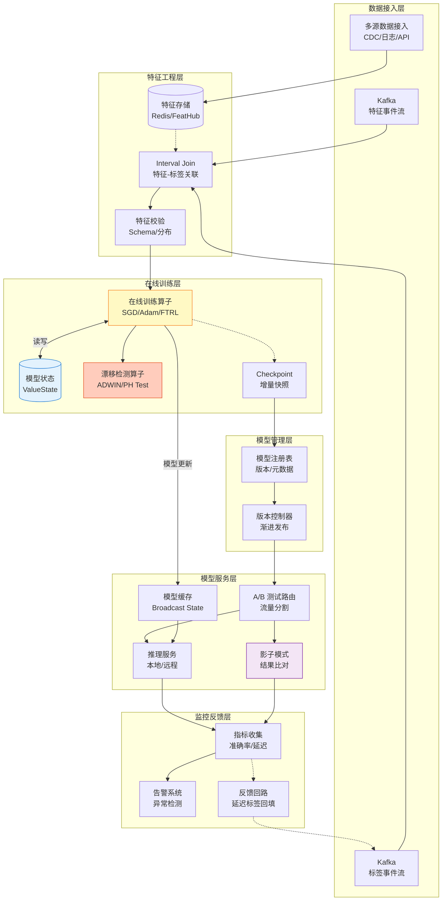
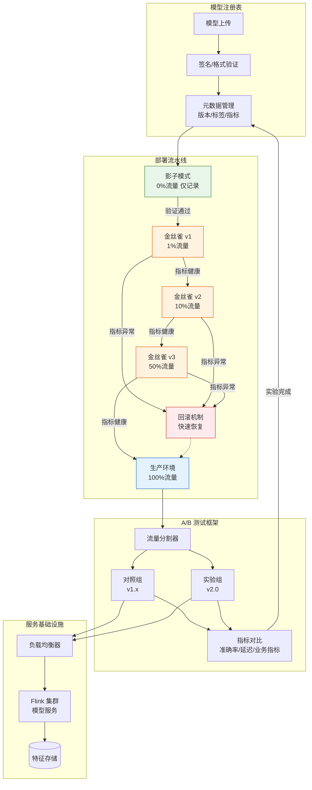
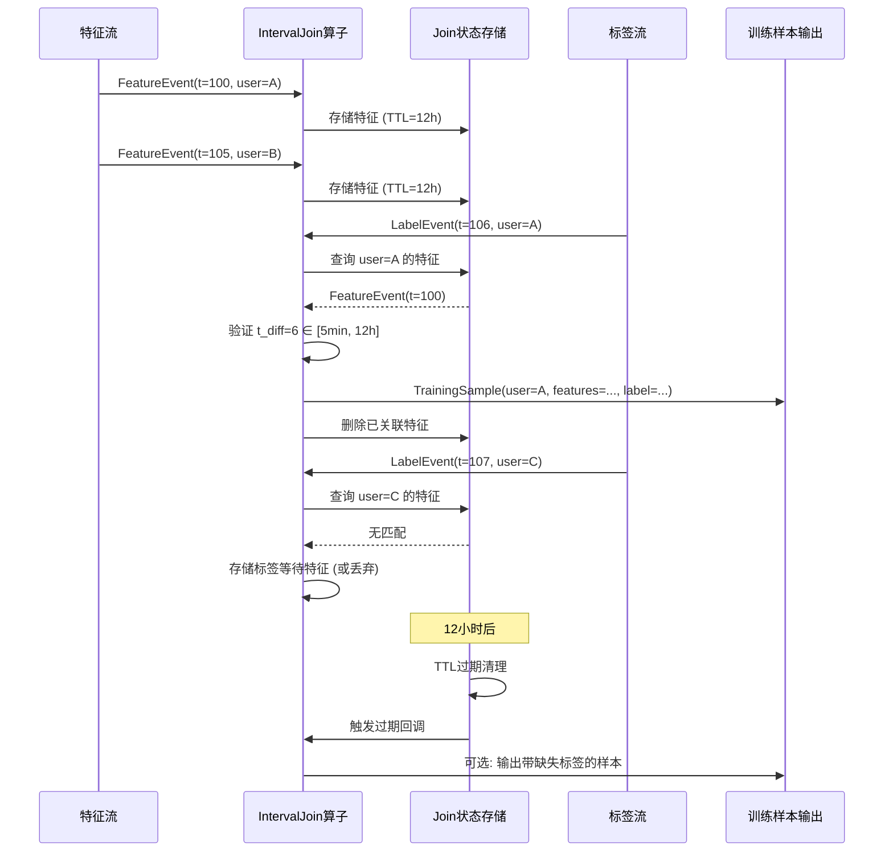
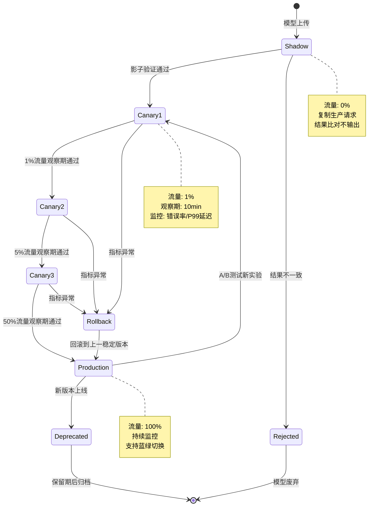

# 在线学习生产实践 - 流式ML系统构建指南

> 所属阶段: Flink/12-ai-ml | 前置依赖: [online-learning-algorithms.md](./online-learning-algorithms.md), [model-serving-streaming.md](./model-serving-streaming.md) | 形式化等级: L4

---

## 1. 概念定义 (Definitions)

### Def-F-12-10: 在线学习范式 (Online Learning Paradigm)

**在线学习**是一种模型随数据流持续更新的机器学习范式，与批量学习形成对比。形式化定义为四元组：

$$
\mathcal{OL} = \langle \mathcal{D}_{stream}, \mathcal{U}_{incremental}, \Theta_t, \mathcal{C}_{drift} \rangle
$$

其中：

- $\mathcal{D}_{stream} = \{(x_t, y_t)\}_{t=1}^{\infty}$：无限数据流，$x_t \in \mathcal{X}$ 为特征，$y_t \in \mathcal{Y}$ 为标签
- $\mathcal{U}_{incremental}: \Theta \times (\mathcal{X} \times \mathcal{Y}) \to \Theta$：增量更新算子，$\theta_{t+1} = \mathcal{U}(\theta_t, (x_t, y_t))$
- $\Theta_t$：$t$ 时刻的模型参数空间
- $\mathcal{C}_{drift}$：概念漂移处理组件

**在线学习协议**：

```
初始化: θ₀ ← 随机初始化或预训练模型
对于每个时间步 t = 1, 2, ...:
    接收样本: (xₜ, yₜ) ← Stream.next()
    预测: ŷₜ = f(θₜ₋₁; xₜ)
    计算损失: ℓₜ = L(ŷₜ, yₜ)
    增量更新: θₜ = U(θₜ₋₁, (xₜ, yₜ), ηₜ)
    可选: 持久化 checkpoint(θₜ)
```

---

### Def-F-12-11: 增量学习 vs 批量学习 (Incremental vs Batch Learning)

**增量学习 (Incremental Learning)** 与 **批量学习 (Batch Learning)** 的本质区别：

| 维度 | 批量学习 $\mathcal{L}_{batch}$ | 增量学习 $\mathcal{L}_{incremental}$ |
|------|-------------------------------|-------------------------------------|
| **数据假设** | 固定数据集 $D = \{(x_i, y_i)\}_{i=1}^N$ | 数据流 $\mathcal{D}_{stream}$，$N \to \infty$ |
| **更新触发** | 显式训练阶段，周期调度 | 每个样本到达即时更新 |
| **计算复杂度** | $O(N \cdot T_{epoch})$ | $O(1)$ 每样本 |
| **内存需求** | 需存储完整数据集 | 仅需维护模型参数 |
| **适应性** | 无法适应分布变化 | 实时适应概念漂移 |
| **灾难性遗忘** | 不涉及 | 需显式处理 |

**形式化对比**：

**批量学习优化目标**：
$$
\theta^* = \arg\min_{\theta} \frac{1}{N} \sum_{i=1}^{N} \mathcal{L}(f(\theta; x_i), y_i)
$$

**在线学习优化目标**（后悔最小化）：
$$
\min_{\theta_1, ..., \theta_T} \sum_{t=1}^{T} \mathcal{L}(f(\theta_t; x_t), y_t) - \min_{\theta} \sum_{t=1}^{T} \mathcal{L}(f(\theta; x_t), y_t)
$$

---

### Def-F-12-12: 模型持续训练架构 (Continuous Training Architecture)

**持续训练架构**是在线学习系统的核心工程实现，定义为六元组：

$$
\mathcal{A}_{CT} = \langle \mathcal{P}_{ingest}, \mathcal{P}_{feature}, \mathcal{P}_{train}, \mathcal{P}_{serve}, \mathcal{S}_{state}, \mathcal{M}_{version} \rangle
$$

其中：

- $\mathcal{P}_{ingest}$：数据接入管道，支持多源异构数据流
- $\mathcal{P}_{feature}$：实时特征工程管道，保证训练-推理特征一致性
- $\mathcal{P}_{train}$：在线训练管道，执行增量更新算法
- $\mathcal{P}_{serve}$：模型服务管道，提供低延迟推理
- $\mathcal{S}_{state}$：分布式状态存储，持久化模型参数与优化器状态
- $\mathcal{M}_{version}$：模型版本管理系统

**架构拓扑约束**：
$$
\mathcal{P}_{train} \cap \mathcal{P}_{serve} \neq \emptyset \quad \text{(共享模型状态)}
$$

---

### Def-F-12-13: 实时特征-标签关联 (Real-time Feature-Label Join)

**特征-标签关联**是构建训练样本的关键操作，定义为时序窗口连接：

$$
\mathcal{J}_{FL}: \mathcal{D}_{feature} \times \mathcal{D}_{label} \times \Delta T \to \mathcal{D}_{training}
$$

其中：

- $\mathcal{D}_{feature} = \{(t_i, x_i)\}$：带时间戳的特征流
- $\mathcal{D}_{label} = \{(t_j, y_j)\}$：带时间戳的标签流
- $\Delta T = [T_{min}, T_{max}]$：标签延迟容忍窗口

**关联语义**：
$$
(x, y) \in \mathcal{D}_{training} \iff \exists (t_x, x) \in \mathcal{D}_{feature}, (t_y, y) \in \mathcal{D}_{label}: t_y - t_x \in \Delta T \land \text{key}(x) = \text{key}(y)
$$

**延迟标签问题 (Delayed Labels)**：

实际系统中标签到达存在延迟 $\delta$，需设计等待策略：

| 策略 | 描述 | 适用场景 |
|------|------|----------|
| **固定窗口等待** | 等待固定时长 $W$ 后无标签则丢弃 | 延迟稳定 |
| **预测填充** | 用模型预测作为伪标签 | 冷启动阶段 |
| **延迟样本重放** | 标签到达后重放历史特征 | 延迟波动大 |

---

### Def-F-12-14: 模型版本管理与 A/B 测试 (Model Versioning & A/B Testing)

**模型版本空间**定义为带版本标识的模型集合：

$$
\mathcal{M} = \{M^{(v)} | v = (major, minor, patch, timestamp, git_commit)\}
$$

**版本生命周期状态机**：

$$
\mathcal{S}_{lifecycle} = \{Development, Staging, Canary, Production, Deprecated, Archived\}
$$

状态转移：
$$
\delta_{lifecycle}: \mathcal{S}_{lifecycle} \times \mathcal{E}_{trigger} \to \mathcal{S}_{lifecycle}
$$

**A/B 测试路由策略**：

$$
\pi_{AB}: Request \times \mathcal{M} \to M^{(v)}
$$

常见策略：

- **均匀随机**: $\pi_{AB}(r) = M^{(v_i)}$ with $P(v_i) = w_i$
- **一致性哈希**: $\pi_{AB}(r) = M^{(v_{hash(user\_id) \% n})}$
- **上下文感知**: $\pi_{AB}(r) = \arg\max_{v} p(v | context(r))$

---

### Def-F-12-15: 影子模式与渐进发布 (Shadow Mode & Progressive Rollout)

**影子模式 (Shadow Mode)** 是一种零风险验证新模型的部署策略：

$$
\mathcal{Shadow} = \langle M_{production}, M_{candidate}, \mathcal{D}_{shadow}, \mathcal{C}_{compare} \rangle
$$

其中：

- $M_{production}$：生产环境主模型，响应实际请求
- $M_{candidate}$：候选模型，接收流量复制但不输出
- $\mathcal{D}_{shadow}$：影子流量，$\mathcal{D}_{shadow} = \{(x, y_{prod}, y_{cand})\}$
- $\mathcal{C}_{compare}$：结果比对组件

**渐进发布 (Progressive Rollout)** 是流量从旧版本向新版本逐步迁移的过程：

$$
\mathcal{R}(t): [0, T] \to [0, 1], \quad \mathcal{R}(t) = \text{Traffic}_{M_{new}}(t)
$$

常见发布曲线：

- **线性增长**: $\mathcal{R}(t) = \frac{t}{T}$
- **阶梯发布**: $\mathcal{R}(t) = \sum_{i} \alpha_i \cdot \mathbb{1}_{[t_i, t_{i+1})}(t)$
- **基于置信度**: $\mathcal{R}(t) = \sigma(\text{metrics}(t))$

---

## 2. 属性推导 (Properties)

### Lemma-F-12-05: 特征-标签关联完备性边界

**引理**: 设特征流到达率为 $\lambda_f$，标签流到达率为 $\lambda_l$，关联窗口为 $\Delta T$，则成功关联率为：

$$
P_{join} = \frac{\lambda_l}{\lambda_f} \cdot (1 - e^{-\lambda_f \cdot \Delta T})
$$

**工程含义**：

- 当 $\lambda_f >> \lambda_l$ 时，需增大 $\Delta T$ 或采用特征缓存
- 关联失败率随窗口线性增长，但计算成本也随之增加

---

### Lemma-F-12-06: 影子模式无偏性保证

**引理**: 在影子模式下，候选模型 $M_{candidate}$ 的评估指标是无偏的，当且仅当：

$$
\mathbb{E}_{\mathcal{D}_{shadow}}[\mathcal{L}(M_{candidate}(x), y)] = \mathbb{E}_{\mathcal{D}_{production}}[\mathcal{L}(M_{candidate}(x), y)]
$$

**充分条件**：

1. 影子流量是生产流量的完美复制
2. 候选模型不改变下游系统行为（不输出到生产）
3. 特征提取逻辑一致

---

### Prop-F-12-05: 渐进发布风险边界

**命题**: 设新版本模型 $M_{new}$ 存在缺陷概率为 $p_{defect}$，缺陷损失为 $L_{defect}$，则在渐进发布策略 $\mathcal{R}(t)$ 下的期望风险为：

$$
\mathbb{E}[Risk(t)] = \mathcal{R}(t) \cdot p_{defect} \cdot L_{defect}
$$

**最优发布时间**: 若持续监控指标 $m(t)$，当检测到异常立即回滚，则最优发布速率为：

$$
\frac{d\mathcal{R}}{dt} = \frac{\epsilon_{alert}}{|\frac{\partial m}{\partial t}|}
$$

其中 $\epsilon_{alert}$ 为告警阈值。

---

## 3. 关系建立 (Relations)

### 关系 1: 持续训练 ⟺ 在线学习算法

持续训练架构实现在线学习算法的工程化部署：

```
在线学习算法 (理论)          持续训练架构 (工程)
─────────────────────────────────────────────────────────
增量更新 U(θ, (x,y))    →   带 Checkpoint 的状态更新算子
损失函数 L(ŷ, y)        →   训练指标流 + 监控告警
学习率调度 ηₜ           →   动态超参调整服务
概念漂移处理 C_drift    →   漂移检测算子 + 模型重置策略
```

### 关系 2: 特征-标签关联 ⟺ Flink Interval Join

实时特征-标签关联可直接映射为 Flink 的 Interval Join 操作：

```java
DataStream<Sample> trainingSamples = featureStream
    .keyBy(FeatureEvent::getUserId)
    .intervalJoin(labelStream.keyBy(LabelEvent::getUserId))
    .between(Time.minutes(5), Time.hours(24))  // ΔT 窗口
    .process(new SampleBuilder());
```

### 关系 3: A/B 测试 ⟺ Flink Broadcast State

模型版本路由可利用 Flink 的 Broadcast State 机制实现动态流量切换：

```
控制流 (模型版本配置) ──► Broadcast Stream
                                   │
                                   ▼
数据流 ──► KeyBy ──► ProcessFunction (ReadOnlyContext)
                         │
                         ▼
                    根据 Broadcast State
                    选择模型版本执行推理
```

---

## 4. 论证过程 (Argumentation)

### 4.1 持续训练架构设计决策

**决策 1: 训练-推理一体化 vs 分离**

| 方案 | 延迟 | 资源隔离 | 复杂度 | 适用场景 |
|------|------|----------|--------|----------|
| **一体化** | 极低 (<10ms) | 低 | 低 | 小型模型、实时性要求极高 |
| **分离 (同集群)** | 中 (10-50ms) | 中 | 中 | 中等规模模型、需独立扩缩容 |
| **分离 (异构集群)** | 高 (50ms+) | 高 | 高 | 大型深度学习模型、GPU 需求 |

**推荐架构**: 混合模式 —— 简单模型（线性、树模型）采用一体化，复杂模型（深度神经网络）采用分离部署。

**决策 2: 同步训练 vs 异步训练**

- **同步训练**: 训练与推理串行，模型更新立即生效
  - 优点：一致性简单
  - 缺点：训练阻塞推理，无法独立扩缩容

- **异步训练**: 训练与推理解耦，通过模型版本同步
  - 优点：独立扩缩容，训练失败不影响推理
  - 缺点：模型版本滞后，需处理版本一致性

**推荐**: 生产环境采用异步训练，通过版本广播实现模型热更新。

### 4.2 特征-标签关联策略选择

**场景分析**:

| 业务场景 | 标签延迟 | 推荐策略 | 技术实现 |
|----------|----------|----------|----------|
| 点击率预测 | 数秒 | 固定窗口等待 | Interval Join |
| 欺诈检测 | 数分钟-数小时 | 延迟样本重放 | Pattern + State |
| 用户留存 | 数天 | 离线回填 + 在线预测填充 | Lambda 架构 |
| 推荐转化 | 数小时-数天 | 多阶段标签聚合 | CEP + Temporal Table |

### 4.3 影子模式设计要点

**关键考量**:

1. **流量复制开销**: 100% 流量复制意味着双倍计算，需评估成本收益
2. **延迟一致性**: 影子模型响应不应影响生产请求的超时判定
3. **结果比对延迟**: 允许影子模型慢于生产模型，但需设置上限
4. **数据隔离**: 影子请求不应写入生产存储或触发副作用

**优化策略**: 采样复制（如 10% 流量）而非全量复制，保持统计显著性同时降低成本。

---

## 5. 形式证明 / 工程论证 (Proof / Engineering Argument)

### Thm-F-12-03: 持续训练系统收敛性保证

**定理**: 在以下条件下，基于 Flink 的持续训练系统保证在线学习收敛：

1. **状态持久化**: Checkpoint 间隔 $I$ 满足 $I < \frac{\epsilon_{recovery}}{\lambda_{update}}$，其中 $\epsilon_{recovery}$ 为可接受的状态回滚量
2. **标签完备性**: 特征-标签关联率 $P_{join} > 1 - \delta$，$\delta$ 为可接受的数据损失率
3. **资源充足性**: 训练算子并行度 $P$ 满足 $P \geq \frac{\lambda_{data}}{\mu_{update}}$，其中 $\mu_{update}$ 为单线程更新吞吐

**证明概要**:

设 $t_k$ 为第 $k$ 次 Checkpoint 时刻，$\theta_{t_k}$ 为持久化状态。故障恢复后：

$$
\theta_{recovered} = \theta_{t_k} + \sum_{i=t_k+1}^{t_{failure}} \Delta\theta_i \cdot \mathbb{1}_{[sample\,i\,joined]}
$$

期望偏差：

$$
\mathbb{E}[\|\theta_{recovered} - \theta_{actual}\|] \leq (t_{failure} - t_k) \cdot \eta_{max} \cdot G_{max} \cdot (1 - P_{join})
$$

在条件 1-3 保证下，偏差可控，收敛性得以保持。

---

### Thm-F-12-04: A/B 测试统计有效性保证

**定理**: 为保证 A/B 测试的统计显著性（统计功效 $1-\beta = 0.8$，显著性水平 $\alpha = 0.05$），所需最小样本量为：

$$
n_{min} = \frac{2\sigma^2(z_{1-\alpha/2} + z_{1-\beta})^2}{\Delta^2}
$$

其中 $\sigma^2$ 为指标方差，$\Delta$ 为期望检测的最小效应量。

**工程约束推导**:

设流量分配比例为 $\gamma$ 流向实验组，则达到最小样本量所需时间：

$$
T_{test} = \frac{n_{min}}{\gamma \cdot \lambda_{daily}} \text{ days}
$$

**业务权衡**:

- $\gamma$ 过大 → 风险暴露增加
- $\gamma$ 过小 → 测试周期延长

最优分配需满足：$\gamma^* = \arg\min_{\gamma} (T_{test} \cdot Risk_{exposure})$

---

## 6. 实例验证 (Examples)

### 6.1 完整持续训练 Pipeline

```java
public class ContinuousTrainingPipeline {

    public static void main(String[] args) throws Exception {
        StreamExecutionEnvironment env =
            StreamExecutionEnvironment.getExecutionEnvironment();
        env.enableCheckpointing(60000);

        // 1. 数据接入层
        DataStream<FeatureEvent> features = env
            .addSource(new KafkaSource<>("features-topic"))
            .map(new FeatureExtractor());

        DataStream<LabelEvent> labels = env
            .addSource(new KafkaSource<>("labels-topic"))
            .map(new LabelExtractor());

        // 2. 特征-标签关联 (Interval Join)
        DataStream<TrainingSample> samples = features
            .keyBy(FeatureEvent::getUserId)
            .intervalJoin(labels.keyBy(LabelEvent::getUserId))
            .between(Time.minutes(5), Time.hours(12))
            .process(new SampleJoinFunction());

        // 3. 在线训练 (带状态管理)
        SingleOutputStreamOperator<ModelUpdate> modelUpdates = samples
            .keyBy(TrainingSample::getModelKey)
            .process(new OnlineTrainer(
                new OnlineLogisticRegression()
                    .setLearningRate(0.01)
                    .setRegularization(0.1)
            ));

        // 4. 模型版本广播
        BroadcastStream<ModelVersion> modelVersions = modelUpdates
            .broadcast(ModelVersion.STATE_DESCRIPTOR);

        // 5. 推理服务 (读取 Broadcast State)
        DataStream<Prediction> predictions = env
            .addSource(new InferenceRequestSource())
            .keyBy(InferenceRequest::getUserId)
            .connect(modelVersions)
            .process(new ModelServingFunction());

        // 6. 结果输出
        predictions.addSink(new KafkaSink<>("predictions-topic"));

        env.execute("Continuous Training Pipeline");
    }
}
```

### 6.2 在线训练算子实现

```java
public class OnlineTrainer extends KeyedProcessFunction<String,
        TrainingSample, ModelUpdate> {

    // 模型参数状态
    private ValueState<DenseVector> weightsState;
    private ValueState<Double> biasState;
    private ValueState<Long> iterationState;

    // 优化器状态 (Adam)
    private ValueState<DenseVector> mState;
    private ValueState<DenseVector> vState;

    // 训练指标
    private ListState<TrainingMetric> metricBuffer;

    private final OnlineLearningAlgorithm algorithm;
    private final double learningRate = 0.001;
    private final double beta1 = 0.9, beta2 = 0.999;

    @Override
    public void open(Configuration parameters) {
        StateTtlConfig ttlConfig = StateTtlConfig
            .newBuilder(Time.hours(24))
            .setUpdateType(StateTtlConfig.UpdateType.OnCreateAndWrite)
            .setStateVisibility(StateTtlConfig.StateVisibility.NeverReturnExpired)
            .build();

        weightsState = getRuntimeContext().getState(
            new ValueStateDescriptor<>("weights", DenseVector.class));
        biasState = getRuntimeContext().getState(
            new ValueStateDescriptor<>("bias", Double.class));
        iterationState = getRuntimeContext().getState(
            new ValueStateDescriptor<>("iter", Long.class));
        mState = getRuntimeContext().getState(
            new ValueStateDescriptor<>("m", DenseVector.class));
        vState = getRuntimeContext().getState(
            new ValueStateDescriptor<>("v", DenseVector.class));

        ValueStateDescriptor<TrainingMetric> metricDesc =
            new ValueStateDescriptor<>("metrics", TrainingMetric.class);
        metricDesc.enableTimeToLive(ttlConfig);
    }

    @Override
    public void processElement(TrainingSample sample, Context ctx,
            Collector<ModelUpdate> out) throws Exception {

        DenseVector w = weightsState.value();
        double b = biasState.value();
        long t = iterationState.value() + 1;

        // 前向传播
        double z = w.dot(sample.getFeatures()) + b;
        double pred = sigmoid(z);

        // 计算梯度
        double error = pred - sample.getLabel();
        DenseVector gradW = sample.getFeatures().scale(error);

        // Adam 更新
        DenseVector m = mState.value().scale(beta1).add(gradW.scale(1 - beta1));
        DenseVector v = vState.value().scale(beta2).add(
            gradW.hadamard(gradW).scale(1 - beta2));

        DenseVector mHat = m.scale(1.0 / (1 - Math.pow(beta1, t)));
        DenseVector vHat = v.scale(1.0 / (1 - Math.pow(beta2, t)));

        // 更新参数
        for (int i = 0; i < w.size(); i++) {
            double update = learningRate * mHat.get(i) /
                (Math.sqrt(vHat.get(i)) + 1e-8);
            w.set(i, w.get(i) - update);
        }

        // 保存状态
        weightsState.update(w);
        biasState.update(b);
        iterationState.update(t);
        mState.update(m);
        vState.update(v);

        // 定期输出模型更新 (用于广播到推理节点)
        if (t % 1000 == 0) {
            out.collect(new ModelUpdate(t, w, b, computeLoss(pred, sample.getLabel())));
        }
    }
}
```

### 6.3 A/B 测试与流量路由

```java
public class ABTestRouter extends BroadcastProcessFunction<InferenceRequest,
        ModelVersion, Prediction> {

    private MapState<String, ModelVersion> activeVersions;
    private ValueState<Random> randomState;

    // 实验配置
    private static final double CANARY_TRAFFIC = 0.1;
    private static final double SHADOW_TRAFFIC = 0.05;

    @Override
    public void open(Configuration parameters) {
        activeVersions = getRuntimeContext().getMapState(
            new MapStateDescriptor<>("versions", String.class, ModelVersion.class));
        randomState = getRuntimeContext().getState(
            new ValueStateDescriptor<>("random", Random.class));
    }

    @Override
    public void processElement(InferenceRequest request, ReadOnlyContext ctx,
            Collector<Prediction> out) throws Exception {

        ModelVersion production = activeVersions.get("production");
        ModelVersion canary = activeVersions.get("canary");
        ModelVersion shadow = activeVersions.get("shadow");

        // 一致性哈希确保用户始终路由到同一版本
        int userHash = Math.abs(request.getUserId().hashCode()) % 100;

        // 选择模型版本
        ModelVersion selectedVersion;
        boolean isShadow = false;

        if (shadow != null && userHash < SHADOW_TRAFFIC * 100) {
            // 影子流量：同时执行生产模型和影子模型
            selectedVersion = shadow;
            isShadow = true;

            // 生产模型结果输出
            Prediction prodPred = production.predict(request);
            out.collect(prodPred);
        } else if (canary != null && userHash < (CANARY_TRAFFIC + SHADOW_TRAFFIC) * 100) {
            // 金丝雀流量
            selectedVersion = canary;
        } else {
            // 生产流量
            selectedVersion = production;
        }

        // 执行推理
        Prediction pred = selectedVersion.predict(request);
        pred.setModelVersion(selectedVersion.getId());
        pred.setIsShadow(isShadow);

        // 输出指标 (用于对比分析)
        ctx.output(metricsTag, new InferenceMetric(
            request.getUserId(),
            selectedVersion.getId(),
            pred.getScore(),
            System.currentTimeMillis(),
            isShadow
        ));

        if (!isShadow) {
            out.collect(pred);
        }
    }

    @Override
    public void processBroadcastElement(ModelVersion version, Context ctx,
            Collector<Prediction> out) throws Exception {
        // 更新版本配置
        activeVersions.put(version.getRole(), version);
    }
}
```

### 6.4 渐进发布控制器

```java
public class ProgressiveRolloutController {

    private final ModelVersion candidate;
    private final ModelVersion current;
    private final RolloutConfig config;

    private double currentTraffic = 0.0;
    private final List<RolloutStage> stages = Arrays.asList(
        new RolloutStage(0.01, Duration.ofMinutes(10)),   // 1% 观察 10 分钟
        new RolloutStage(0.05, Duration.ofMinutes(30)),   // 5% 观察 30 分钟
        new RolloutStage(0.20, Duration.ofHours(1)),      // 20% 观察 1 小时
        new RolloutStage(0.50, Duration.ofHours(2)),      // 50% 观察 2 小时
        new RolloutStage(1.00, Duration.ofHours(4))       // 100% 观察 4 小时
    );

    public RolloutDecision evaluate(MetricsSnapshot metrics) {
        // 检查当前阶段的健康指标
        if (metrics.getErrorRate() > config.getErrorThreshold() ||
            metrics.getLatencyP99() > config.getLatencyThreshold()) {
            return RolloutDecision.ROLLBACK;
        }

        // 检查当前阶段是否已稳定
        RolloutStage currentStage = getCurrentStage();
        if (metrics.getStageDuration().compareTo(currentStage.getDuration()) > 0 &&
            metrics.isStable()) {

            // 推进到下一阶段
            int nextStageIdx = stages.indexOf(currentStage) + 1;
            if (nextStageIdx < stages.size()) {
                currentTraffic = stages.get(nextStageIdx).getTrafficPercentage();
                return RolloutDecision.ADVANCE;
            } else {
                return RolloutDecision.COMPLETE;
            }
        }

        return RolloutDecision.HOLD;
    }

    public void executeRollout() {
        // 更新流量路由配置
        updateTrafficSplit(current, candidate, currentTraffic);
    }
}
```

---

## 7. 可视化 (Visualizations)

### 7.1 持续训练流水线架构图

持续训练流水线将数据接入、特征工程、在线训练、模型服务和监控反馈串联为闭环系统。特征存储和模型注册表作为共享基础设施，保证训练-推理一致性。



### 7.2 模型部署架构图

模型部署架构展示了从模型注册表到生产环境的完整流程。金丝雀发布逐步扩大流量比例，影子模式并行验证，A/B 测试支持多版本对比，回滚机制保障系统稳定性。



### 7.3 特征-标签关联时序图

特征-标签关联处理标签延迟到达问题。特征到达后进入等待窗口，标签在窗口内到达则成功关联，超时则触发回填策略或丢弃。



### 7.4 渐进发布状态机

渐进发布通过多个阶段逐步增加新版本流量比例，每个阶段有观察期和健康检查，任一阶段失败触发回滚。



---

## 8. 引用参考 (References)


---

*文档版本: v1.0 | 创建日期: 2026-04-02 | 形式化等级: L4*
