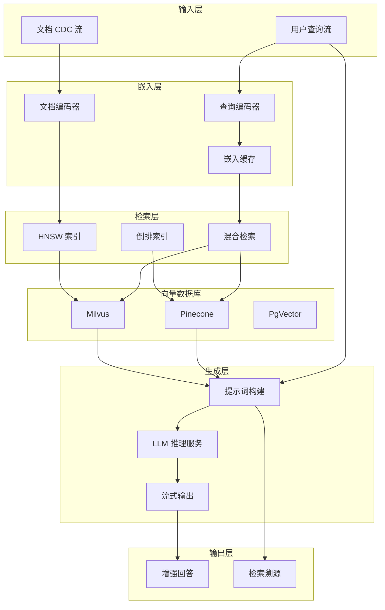
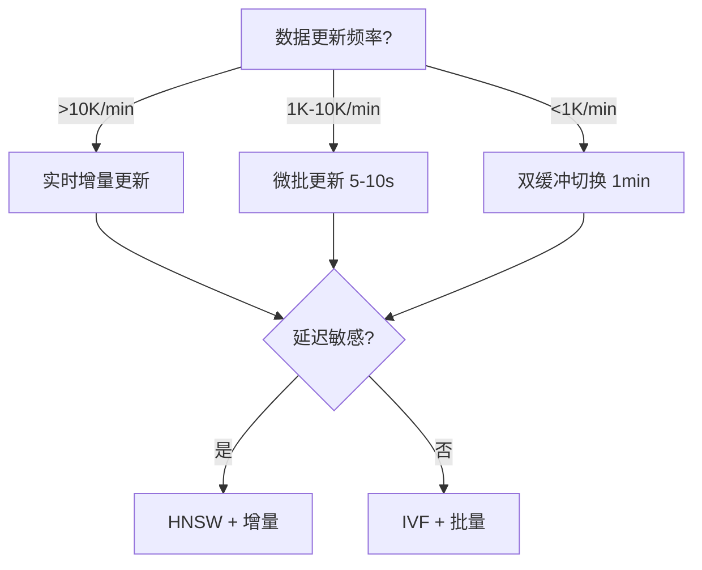
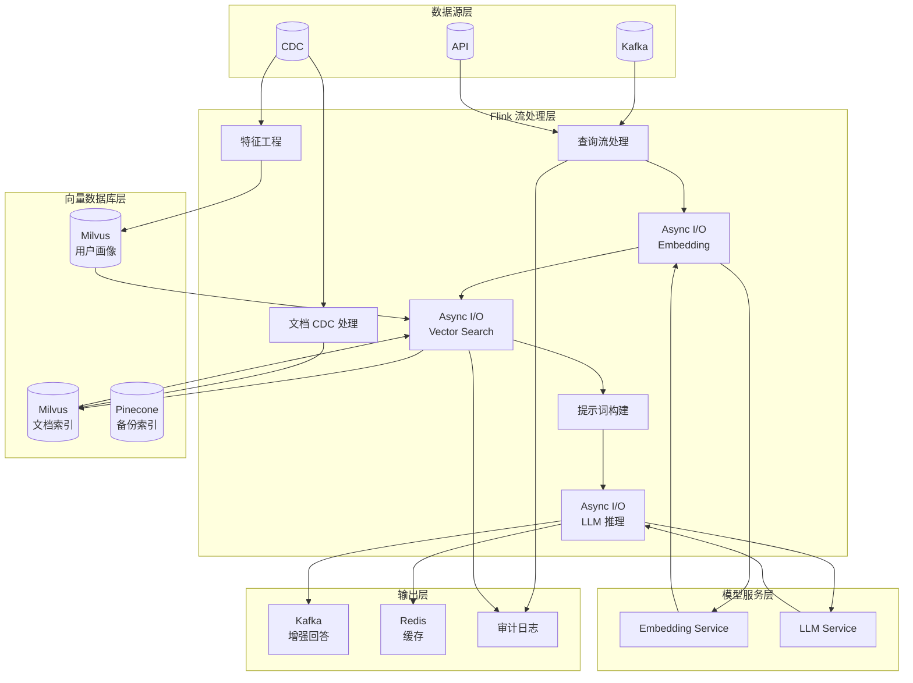
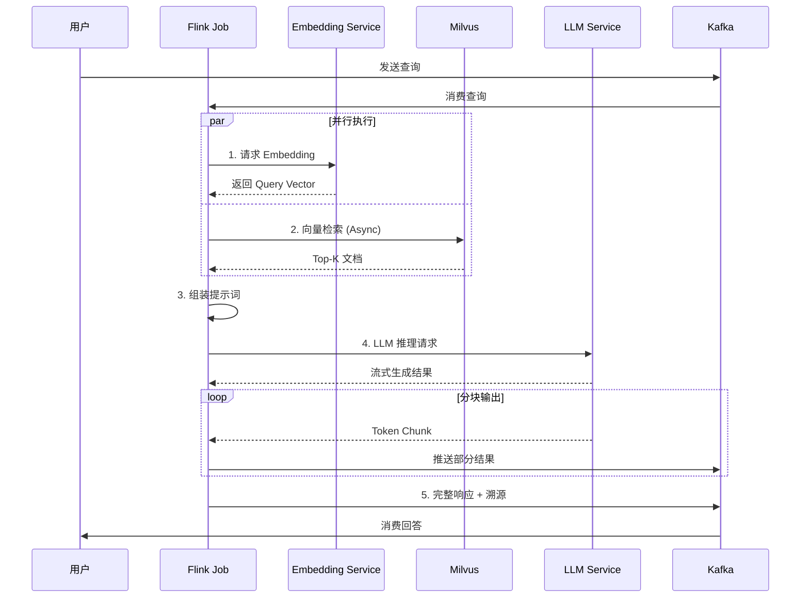
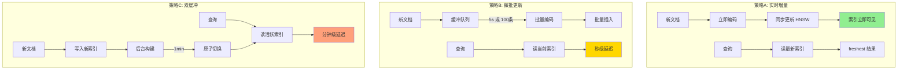
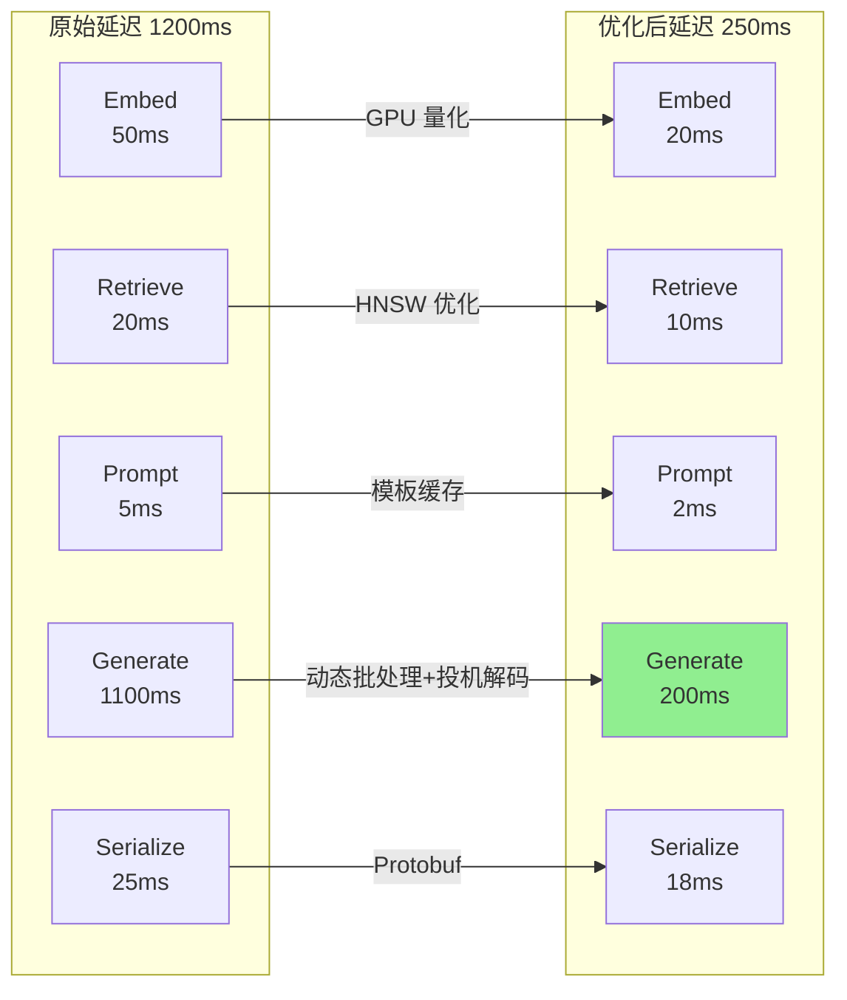

# 实时 RAG 流式架构 - Flink 驱动的检索增强生成

> 所属阶段: Flink | 前置依赖: [vector-database-integration.md](./vector-database-integration.md), [vector-search.md](../../03-sql-table-api/vector-search.md) | 形式化等级: L4-L5

## 1. 概念定义 (Definitions)

### Def-F-12-20: 流式 RAG 架构 (Streaming RAG Architecture)

**定义**: 流式 RAG 架构是一个支持实时上下文检索与生成增强的分布式系统，由以下六元组定义：

$$
\text{StreamingRAG} = \langle \mathcal{S}_{in}, \mathcal{E}, \mathcal{V}, \mathcal{R}, \mathcal{G}, \mathcal{S}_{out} \rangle
$$

其中：

- **输入流** $(\mathcal{S}_{in})$: 用户查询流 $\{(q_i, \tau_i, c_i)\}$，包含查询文本 $q_i$、时间戳 $\tau_i$、上下文元数据 $c_i$
- **嵌入模型** $(\mathcal{E})$: 查询编码函数 $\mathcal{E}: \mathcal{Q} \rightarrow \mathbb{R}^d$，将查询映射为 $d$ 维向量
- **向量存储** $(\mathcal{V})$: 支持增量更新的向量索引 $\mathcal{V}_t \subset \mathbb{R}^d \times \mathcal{D}$，其中 $\mathcal{D}$ 为文档集合
- **检索器** $(\mathcal{R})$: 上下文检索函数 $\mathcal{R}: \mathbb{R}^d \times \mathcal{V}_t \times \mathbb{N} \rightarrow 2^{\mathcal{D} \times \mathbb{R}}$，返回 Top-K 相关文档及其相似度分数
- **生成器** $(\mathcal{G})$: 大语言模型推理函数 $\mathcal{G}: \mathcal{Q} \times 2^{\mathcal{D}} \rightarrow \mathcal{A}$，基于检索上下文生成回答
- **输出流** $(\mathcal{S}_{out})$: 增强生成结果流 $\{(a_i, r_i, \tau'_i)\}$，包含答案 $a_i$、检索上下文 $r_i$、输出时间戳 $\tau'_i$

**形式化约束**:

$$
\forall (q, \tau) \in \mathcal{S}_{in}: \tau' - \tau \leq \Delta_{max}
$$

其中 $\Delta_{max}$ 为端到端延迟上界，典型值为 500ms-2s（取决于生成模型）。

**直观解释**: 流式 RAG 架构使 LLM 能够基于最新数据实时回答问题，通过将用户查询转换为向量、检索相关文档片段、构建增强提示词，最终生成上下文感知的回答。

---

### Def-F-12-21: 流式向量检索机制 (Streaming Vector Retrieval Mechanism)

**定义**: 流式向量检索机制是一个支持增量索引更新与低延迟查询的检索系统，由以下四元组定义：

$$
\text{SVR} = \langle \mathcal{I}, \mathcal{U}, \mathcal{Q}, \mathcal{C} \rangle
$$

其中：

- **索引结构** $(\mathcal{I})$: 近似最近邻索引，支持动态插入/删除，$\mathcal{I}_t = (V_t, E_t)$，其中 $V_t$ 为向量集合，$E_t$ 为索引结构（如 HNSW 图边集）
- **更新算子** $(\mathcal{U})$: 增量更新函数族
  - 插入: $\mathcal{U}_{ins}: \mathcal{I}_t \times (\mathbf{v}, d) \rightarrow \mathcal{I}_{t+1}$
  - 删除: $\mathcal{U}_{del}: \mathcal{I}_t \times id \rightarrow \mathcal{I}_{t+1}$
  - 刷新: $\mathcal{U}_{flush}: \mathcal{I}_t \rightarrow \mathcal{I}'_{t}$（索引优化）
- **查询算子** $(\mathcal{Q})$: 流式查询处理函数

$$
    \mathcal{Q}(\mathbf{q}, k, \mathcal{I}_t) = \{ (d_i, s_i) \mid s_i = \text{sim}(\mathbf{q}, \mathbf{v}_i), \text{top}_k(\{s_i\}) \}
    $$

- **一致性保证** $(\mathcal{C})$: 索引与源数据的一致性协议
  - 最终一致性: $\lim_{t \rightarrow \infty} \mathcal{I}_t = \mathcal{I}^*_{source}$
  - 强一致性: $\forall t: \mathcal{I}_t \sim_{\epsilon} \mathcal{I}^*_{source}$

**Def-F-12-21a: 双缓冲索引策略 (Double Buffering)**

为支持无停顿索引更新，采用活跃/备份双索引机制：

$$
\mathcal{I}^{active}_t = \begin{cases}
\mathcal{I}_A & \text{if } t \in [nT, (n+\frac{1}{2})T) \\
\mathcal{I}_B & \text{if } t \in [(n+\frac{1}{2})T, (n+1)T)
\end{cases}
$$

其中更新在备份索引异步进行，每 $T/2$ 周期切换一次。

---

### Def-F-12-22: 实时特征工程流水线 (Real-time Feature Engineering Pipeline)

**定义**: 实时特征工程流水线是将原始数据流转换为模型可用特征表示的连续处理管道，定义为：

$$
\text{RFEPipeline} = \langle \mathcal{F}_{raw}, \mathcal{T}, \mathcal{F}_{feat}, \mathcal{W}, \mathcal{A} \rangle
$$

其中：

- **原始特征** $(\mathcal{F}_{raw})$: 输入数据流中的原始字段集合
- **变换算子** $(\mathcal{T})$: 特征变换函数序列 $\mathcal{T} = [\tau_1, \tau_2, ..., \tau_m]$，每个 $\tau_i: \mathcal{X}_{in} \rightarrow \mathcal{X}_{out}$
- **派生特征** $(\mathcal{F}_{feat})$: 输出特征向量空间 $\mathcal{F}_{feat} \subseteq \mathbb{R}^d$
- **窗口策略** $(\mathcal{W})$: 时间窗口定义，$\mathcal{W}(t) = [t - \Delta, t)$，支持滚动/滑动/会话窗口
- **聚合函数** $(\mathcal{A})$: 窗口内聚合算子，如 $\text{mean}$, $\text{sum}$, $\text{count}$, $\text{unique}$ 等

**特征类型分类**:

| 特征类型 | 数学定义 | 状态需求 | 示例 |
|---------|---------|---------|------|
| **点特征** | $f(x_t)$ | 无状态 | 文本长度、ID 编码 |
| **窗口聚合** | $\text{agg}(\{x_i \mid i \in \mathcal{W}(t)\})$ | ValueState | 过去5分钟点击率 |
| **序列特征** | $[x_{t-n}, ..., x_t]$ | ListState | 最近10个浏览商品 |
| **交叉特征** | $f(x_t, y_t)$ | BroadcastState | 用户-商品交互 |
| **嵌入特征** | $\mathcal{E}(x_t)$ | 外部模型 | BERT 文本嵌入 |

**Def-F-12-22a: 特征一致性保证**

特征工程需满足训练-推理一致性：

$$
\forall t: \mathcal{T}_{train}(x_t) = \mathcal{T}_{inference}(x_t)
$$

通过版本化特征变换定义和确定性计算实现。

---

### Def-F-12-23: LLM 推理优化模式 (LLM Inference Optimization Patterns)

**定义**: LLM 推理优化是通过批处理、缓存和流式策略降低推理延迟、提高吞吐量的技术集合：

$$
\text{LLMOpt} = \langle \mathcal{B}, \mathcal{K}, \mathcal{P}, \mathcal{S} \rangle
$$

**Def-F-12-23a: 动态批处理 (Dynamic Batching)**

将多个独立请求合并为批量推理：

$$
\mathcal{B}_{dyn}(t, B_{max}, T_{max}) = \{ r_i \mid t_{arrive}(r_i) \leq t \land |\mathcal{B}| < B_{max} \land (t - t_{first}) < T_{max} \}
$$

其中 $B_{max}$ 为最大批次大小，$T_{max}$ 为最大等待时间。

吞吐量增益：

$$
\eta_{batch} = \frac{\text{throughput}(\mathcal{B})}{\text{throughput}(single)} \approx O(\log B) \text{ to } O(B^{0.8})
$$

**Def-F-12-23b: KV-Cache 管理**

自回归生成的键值缓存复用：

$$
\text{KV}_{cache}(t+1) = \text{Concat}(\text{KV}_{cache}(t), \text{ComputeKV}(x_{t+1}))
$$

缓存命中率与序列前缀共享度正相关。

**Def-F-12-23c: 流式生成 (Streaming Generation)**

分块输出生成结果，降低首 token 延迟：

$$
\mathcal{G}_{stream}(q, ctx) = \{ chunk_i \mid chunk_i = \mathcal{G}(q, ctx)_{[p_i, p_{i+1})} \}
$$

其中 $p_i$ 为输出位置，首块延迟 $L_{first} \ll L_{total}$。

---

## 2. 属性推导 (Properties)

### Prop-F-12-20: 流式 RAG 端到端延迟分解

**命题**: 流式 RAG 系统的端到端延迟 $L_{E2E}$ 满足以下上界：

$$
L_{E2E} \leq L_{embed} + L_{retrieve} + L_{prompt} + L_{generate} + L_{serialize}
$$

各分量定义：

| 分量 | 典型范围 | 优化策略 |
|------|---------|---------|
| $L_{embed}$ | 10-50ms | GPU 推理、模型量化 |
| $L_{retrieve}$ | 5-20ms | HNSW 索引、预过滤 |
| $L_{prompt}$ | 1-5ms | 模板预编译、并行组装 |
| $L_{generate}$ | 100-1000ms | 动态批处理、投机解码 |
| $L_{serialize}$ | 1-10ms | 二进制协议、压缩 |

**推导**: 各阶段流水线执行，总延迟为关键路径之和。通过异步流水线重叠嵌入与检索，可降低至：

$$
L_{E2E}^{optimized} \approx \max(L_{embed}, L_{retrieve}) + L_{generate} + O(1)
$$

---

### Prop-F-12-21: 向量检索召回率-延迟权衡

**命题**: 对于 HNSW 索引，检索参数 $ef$（搜索深度）与召回率 $R$、延迟 $L$ 满足：

$$
R(ef) = 1 - \alpha \cdot e^{-\beta \cdot ef}, \quad \alpha, \beta > 0
$$

$$
L(ef) = \gamma + \delta \cdot ef, \quad \gamma, \delta > 0
$$

**最优参数推导**: 给定目标召回率 $R_{target}$，最小延迟配置为：

$$
ef_{opt} = \left\lceil -\frac{1}{\beta} \cdot \ln\left(\frac{1 - R_{target}}{\alpha}\right) \right\rceil
$$

**工程意义**: $R_{target} = 0.95$ 时，$ef_{opt} \approx 64-128$（取决于数据分布）。

---

### Lemma-F-12-20: 特征 freshness 与模型性能关系

**引理**: 设特征时间戳为 $t_f$，推理时刻为 $t$，特征陈旧度 $\Delta = t - t_f$，模型性能衰减满足：

$$
\text{Perf}(\Delta) = \text{Perf}_0 \cdot e^{-\lambda \Delta}
$$

其中 $\lambda$ 为特征时效系数，实时特征（$\Delta < 1s$）性能保持率 > 95%。

---

## 3. 关系建立 (Relations)

### 3.1 RAG 架构组件关系图谱



### 3.2 与 Flink 核心能力映射

| RAG 组件 | Flink 能力 | 关系类型 |
|---------|-----------|---------|
| 实时嵌入 | Async I/O + ML_PREDICT | 原生集成 |
| 向量索引更新 | DataStream + Checkpoint | 状态一致性 |
| 特征工程 | ProcessFunction + State | 原生集成 |
| 动态批处理 | Window + Trigger | 扩展实现 |
| 流式生成 | AsyncFunction + SideOutput | 组合实现 |

### 3.3 向量数据库集成矩阵

| 特性 | Milvus | Pinecone | PgVector | 适用场景 |
|------|--------|----------|----------|---------|
| **部署模式** | 自托管/云 | 全托管 | PostgreSQL 扩展 | - |
| **流式更新** | 增量 HNSW | 自动优化 | 实时索引 | 高频更新 |
| **混合查询** | 标量过滤+向量 | 元数据过滤 | SQL 原生 | 结构化约束 |
| **Flink 集成** | gRPC Connector | REST Connector | JDBC | - |
| **延迟 (p99)** | <10ms | <50ms | <100ms | 延迟敏感 |

---

## 4. 论证过程 (Argumentation)

### 4.1 为何选择流式 RAG 而非批处理 RAG？

**对比论证**:

| 维度 | 批处理 RAG | 流式 RAG |
|------|-----------|---------|
| **数据新鲜度** | 小时级延迟 | 秒级延迟 |
| **索引更新** | 全量重建 | 增量更新 |
| **资源模式** | 脉冲式高负载 | 稳定负载 |
| **适用场景** | 静态知识库 | 动态内容平台 |
| **复杂度** | 低 | 中高 |

**决策边界**:

$$
\text{选择流式 RAG} \iff \frac{\Delta_{batch}}{\Delta_{stream}} > 10 \land \text{update\_frequency} > 1000/\text{day}
$$

### 4.2 流式索引更新策略对比

**策略 A: 实时增量更新**

- 每来一条文档立即更新索引
- 优点： freshest 索引
- 缺点：更新开销大（HNSW 图重构成本高）

**策略 B: 微批更新**

- 累积 $N$ 条或 $T$ 秒后批量更新
- 优点：摊销更新成本
- 缺点：秒级索引延迟

**策略 C: 双缓冲切换**

- 后台重建新索引，完成后原子切换
- 优点：查询零中断
- 缺点：双倍内存占用

**选型建议**:



### 4.3 嵌入模型服务化 vs 本地化

**服务化方案**:
- 独立 Embedding Service（REST/gRPC）
- 优点：模型独立升级、多语言支持
- 缺点：网络往返延迟、序列化开销

**本地化方案**:
- Flink UDF 内嵌模型（ONNX Runtime）
- 优点：零网络延迟、高吞吐
- 缺点：模型体积限制、JVM 内存压力

**混合策略**: 高频模型本地化，长尾模型服务化。

---

## 5. 形式证明 / 工程论证 (Proof / Engineering Argument)

### 5.1 流式 RAG 架构的形式化正确性

**定理 (Thm-F-12-20): 流式 RAG 语义等价性**

设批处理 RAG 结果为 $R_{batch}(q, D)$，流式 RAG 结果为 $R_{stream}(q, D(t))$，若满足：

1. 向量索引一致性: $\forall t: \mathcal{V}_t \supseteq D(t - \Delta_{sync})$
2. 嵌入确定性: $\mathcal{E}(q)$ 是纯函数
3. 检索单调性: $D_1 \subseteq D_2 \Rightarrow R(q, D_1) \subseteq R(q, D_2)$

则在同步延迟 $\Delta_{sync}$ 内，流式 RAG 与批处理 RAG 语义等价：

$$
\lim_{\Delta_{sync} \rightarrow 0} R_{stream}(q, D(t)) = R_{batch}(q, D(t))
$$

**证明概要**:

1. 由条件1，流式索引在时间 $t$ 包含至少 $t-\Delta_{sync}$ 的数据
2. 由条件2，查询嵌入结果唯一确定
3. 由条件3，索引增量更新不会丢失已存在结果
4. 当 $\Delta_{sync} \rightarrow 0$ 时，流式索引与批处理数据集合收敛
5. 因此检索结果集合收敛，证毕

---

### 5.2 特征工程流水线的状态边界分析

**工程论证**: Flink 状态存储需求计算

对于包含 $N$ 个键的特征工程流水线，各状态类型内存占用：

| 状态类型 | 单键占用 | 总内存估计 |
|---------|---------|-----------|
| ValueState | $O(d \cdot 4B)$ | $N \cdot d \cdot 4B$ |
| ListState (长度 $L$) | $O(L \cdot d \cdot 4B)$ | $N \cdot L \cdot d \cdot 4B$ |
| MapState (平均 $K$ 键) | $O(K \cdot (key + value))$ | $N \cdot K \cdot (|key| + |value|)$ |

**示例**: 1000万用户，每用户维护最近20个行为的嵌入向量（768维）：

$$
M = 10^7 \times 20 \times 768 \times 4B = 614.4GB
$$

采用增量压缩（Float16 + 稀疏编码）可降低至 ~150GB。

---

### 5.3 动态批处理的吞吐量优化

**论证**: 最优批大小 $B^*$ 的推导

设单请求延迟 $L_{single}$，批处理延迟 $L_{batch}(B)$，吞吐量优化目标：

$$
\max_B \eta(B) = \frac{B}{L_{batch}(B)}
$$

假设批处理延迟与批大小呈次线性关系：

$$
L_{batch}(B) = L_{fixed} + L_{variable} \cdot B^{\alpha}, \quad 0 < \alpha < 1
$$

求导并令 $\frac{d\eta}{dB} = 0$：

$$
B^* = \left( \frac{L_{fixed}}{L_{variable}} \cdot \frac{1}{\alpha - 1} \right)^{\frac{1}{\alpha}}
$$

**LLM 推理实测参数**:
- $L_{fixed}$ (启动开销): 20-50ms
- $L_{variable}$ (每 token): 5-10ms
- $\alpha$: 0.7-0.9

最优批大小 $B^* \approx 8-16$（平衡延迟与吞吐）。

---

## 6. 实例验证 (Examples)

### 6.1 完整流式 RAG Pipeline (Flink + Milvus + OpenAI)

```java
import org.apache.flink.streaming.api.datastream.DataStream;
import org.apache.flink.streaming.api.environment.StreamExecutionEnvironment;
import org.apache.flink.streaming.api.functions.async.AsyncFunction;
import org.apache.flink.streaming.api.functions.async.ResultFuture;

/**
 * 实时 RAG 系统完整实现
 * 架构: Flink -> Milvus -> LLM Service
 */
public class StreamingRAGPipeline {

    public static void main(String[] args) throws Exception {
        StreamExecutionEnvironment env =
            StreamExecutionEnvironment.getExecutionEnvironment();
        env.setParallelism(4);

        // ============================================
        // 1. 用户查询流
        // ============================================
        DataStream<UserQuery> queryStream = env
            .addSource(new KafkaSource<UserQuery>()
                .setTopics("user-queries")
                .setGroupId("rag-processor")
                .setStartingOffsets(OffsetsInitializer.latest()))
            .assignTimestampsAndWatermarks(
                WatermarkStrategy.<UserQuery>forBoundedOutOfOrderness(
                    Duration.ofSeconds(5))
                    .withTimestampAssigner((q, ts) -> q.getTimestamp()));

        // ============================================
        // 2. 查询嵌入 (Async I/O 调用 Embedding Service)
        // ============================================
        DataStream<EmbeddedQuery> embeddedStream = AsyncDataStream
            .unorderedWait(
                queryStream,
                new EmbeddingAsyncFunction("text-embedding-3-small"),
                Duration.ofMillis(100),  // 超时
                100                      // 并发度
            );

        // ============================================
        // 3. 向量检索 (Milvus Lookup)
        // ============================================
        DataStream<RetrievalResult> retrievalStream = AsyncDataStream
            .unorderedWait(
                embeddedStream,
                new MilvusRetrievalFunction(
                    "http://milvus-cluster:19530",
                    "knowledge_base",
                    5,        // topK
                    "COSINE"
                ),
                Duration.ofMillis(50),
                200
            );

        // ============================================
        // 4. 提示词构建 + LLM 推理
        // ============================================
        DataStream<LLMResponse> llmStream = AsyncDataStream
            .unorderedWait(
                retrievalStream,
                new LLMInferenceFunction(
                    "https://api.openai.com/v1/chat/completions",
                    "gpt-4",
                    512,      // max_tokens
                    0.7       // temperature
                ),
                Duration.ofSeconds(5),
                50        // LLM 并发限制
            );

        // ============================================
        // 5. 结果输出
        // ============================================
        llmStream
            .map(response -> new EnrichedAnswer(
                response.getQueryId(),
                response.getGeneratedText(),
                response.getRetrievedDocs(),
                response.getLatencyMs()
            ))
            .addSink(new KafkaSink<EnrichedAnswer>()
                .setBootstrapServers("kafka:9092")
                .setRecordSerializer(...)
                .build());

        env.execute("Streaming RAG Pipeline");
    }

    // ============================================
    // Embedding Async Function 实现
    // ============================================
    static class EmbeddingAsyncFunction
            extends RichAsyncFunction<UserQuery, EmbeddedQuery> {

        private transient HttpClient httpClient;
        private final String modelName;

        @Override
        public void open(Configuration parameters) {
            httpClient = HttpClient.newBuilder()
                .connectTimeout(Duration.ofSeconds(5))
                .build();
        }

        @Override
        public void asyncInvoke(UserQuery query,
                               ResultFuture<EmbeddedQuery> resultFuture) {

            // 调用 OpenAI Embedding API
            EmbeddingRequest request = new EmbeddingRequest(
                modelName,
                query.getText()
            );

            httpClient.sendAsync(
                HttpRequest.newBuilder()
                    .uri(URI.create("https://api.openai.com/v1/embeddings"))
                    .header("Authorization", "Bearer " + apiKey)
                    .header("Content-Type", "application/json")
                    .POST(BodyPublishers.ofString(toJson(request)))
                    .build(),
                BodyHandlers.ofString()
            ).thenAccept(response -> {
                EmbeddingResult result = parseResponse(response.body());
                resultFuture.complete(Collections.singletonList(
                    new EmbeddedQuery(
                        query.getQueryId(),
                        query.getText(),
                        result.getEmbedding(),  // float[1536]
                        query.getTimestamp()
                    )
                ));
            });
        }
    }

    // ============================================
    // Milvus 向量检索 Async Function
    // ============================================
    static class MilvusRetrievalFunction
            extends RichAsyncFunction<EmbeddedQuery, RetrievalResult> {

        private transient MilvusServiceClient milvusClient;
        private final String collectionName;
        private final int topK;
        private final String metricType;

        @Override
        public void open(Configuration parameters) {
            milvusClient = new MilvusServiceClient(
                ConnectParam.newBuilder()
                    .withUri(milvusUri)
                    .build()
            );
        }

        @Override
        public void asyncInvoke(EmbeddedQuery query,
                               ResultFuture<RetrievalResult> resultFuture) {

            SearchParam searchParam = SearchParam.newBuilder()
                .withCollectionName(collectionName)
                .withVectors(Collections.singletonList(query.getEmbedding()))
                .withVectorFieldName("content_vector")
                .withTopK(topK)
                .withMetricType(MetricType.valueOf(metricType))
                .withOutFields(Arrays.asList("doc_id", "content", "title"))
                .build();

            milvusClient.searchAsync(searchParam)
                .thenAccept(response -> {
                    List<Document> docs = parseSearchResults(response);
                    resultFuture.complete(Collections.singletonList(
                        new RetrievalResult(
                            query.getQueryId(),
                            query.getText(),
                            query.getEmbedding(),
                            docs,
                            System.currentTimeMillis()
                        )
                    ));
                });
        }
    }

    // ============================================
    // LLM 推理 Async Function (带动态批处理)
    // ============================================
    static class LLMInferenceFunction
            extends RichAsyncFunction<RetrievalResult, LLMResponse> {

        private transient BatchInferenceClient batchClient;

        @Override
        public void open(Configuration parameters) {
            // 使用客户端端动态批处理
            batchClient = new BatchInferenceClient(
                endpoint,
                modelName,
                8,        // maxBatchSize
                20        // maxWaitMs
            );
        }

        @Override
        public void asyncInvoke(RetrievalResult result,
                               ResultFuture<LLMResponse> resultFuture) {

            // 构建增强提示词
            String prompt = buildRAGPrompt(
                result.getQueryText(),
                result.getRetrievedDocs()
            );

            batchClient.submit(prompt)
                .thenAccept(generatedText -> {
                    resultFuture.complete(Collections.singletonList(
                        new LLMResponse(
                            result.getQueryId(),
                            generatedText,
                            result.getRetrievedDocs(),
                            System.currentTimeMillis() - result.getTimestamp()
                        )
                    ));
                });
        }

        private String buildRAGPrompt(String query, List<Document> docs) {
            StringBuilder context = new StringBuilder();
            context.append("基于以下参考文档回答问题:\n\n");
            for (int i = 0; i < docs.size(); i++) {
                context.append("[").append(i + 1).append("] ")
                       .append(docs.get(i).getTitle())
                       .append("\n")
                       .append(docs.get(i).getContent())
                       .append("\n\n");
            }
            context.append("用户问题: ").append(query).append("\n");
            context.append("回答:");
            return context.toString();
        }
    }
}
```

### 6.2 实时特征工程流水线示例

```java
/**
 * 用户实时兴趣特征工程
 * 输入: 用户行为流 (点击/收藏/购买)
 * 输出: 用户兴趣向量 (用于个性化检索)
 */
public class UserInterestFeaturePipeline {

    public static void main(String[] args) throws Exception {
        StreamExecutionEnvironment env =
            StreamExecutionEnvironment.getExecutionEnvironment();

        // 用户行为流
        DataStream<UserBehavior> behaviorStream = env
            .addSource(new KafkaSource<>())
            .assignTimestampsAndWatermarks(
                WatermarkStrategy.<UserBehavior>forBoundedOutOfOrderness(
                    Duration.ofSeconds(10)));

        // 商品向量广播流 (来自 Milvus 或 Feature Store)
        DataStream<Map<String, float[]>> itemVectorStream = env
            .addSource(new ItemVectorSource())
            .broadcast();

        // 特征工程处理
        DataStream<UserProfile> userProfileStream = behaviorStream
            .keyBy(UserBehavior::getUserId)
            .connect(itemVectorStream)
            .process(new InterestAggregationFunction());

        // 输出到向量数据库 (用户画像索引)
        userProfileStream
            .addSink(new MilvusSink<UserProfile>()
                .withCollection("user_profiles")
                .withVectorField("interest_vector"));

        env.execute("User Interest Feature Pipeline");
    }

    /**
     * 用户兴趣聚合 ProcessFunction
     * 状态: 最近行为序列 + 聚合兴趣向量
     */
    static class InterestAggregationFunction
            extends KeyedCoProcessFunction<String, UserBehavior,
                                           Map<String, float[]>, UserProfile> {

        // 状态声明
        private ValueState<float[]> interestVectorState;
        private ListState<UserBehavior> recentBehaviorsState;
        private MapState<String, Integer> categoryCountState;

        @Override
        public void open(Configuration parameters) {
            StateTtlConfig ttlConfig = StateTtlConfig
                .newBuilder(Time.hours(24))
                .setUpdateType(StateTtlConfig.UpdateType.OnCreateAndWrite)
                .setStateVisibility(
                    StateTtlConfig.StateVisibility.ReturnExpiredIfNotCleanedUp)
                .build();

            interestVectorState = getRuntimeContext().getState(
                new ValueStateDescriptor<>("interest_vector", float[].class));

            recentBehaviorsState = getRuntimeContext().getListState(
                new ListStateDescriptor<>("recent_behaviors", UserBehavior.class));

            categoryCountState = getRuntimeContext().getMapState(
                new MapStateDescriptor<>("category_count", String.class, Integer.class));
        }

        @Override
        public void processElement1(UserBehavior behavior, Context ctx,
                                   Collector<UserProfile> out) throws Exception {

            // 1. 更新最近行为列表 (滑动窗口效果)
            List<UserBehavior> recentBehaviors = new ArrayList<>();
            recentBehaviorsState.get().forEach(recentBehaviors::add);
            recentBehaviors.add(behavior);

            // 只保留最近 50 条
            if (recentBehaviors.size() > 50) {
                recentBehaviors = recentBehaviors.subList(
                    recentBehaviors.size() - 50, recentBehaviors.size());
            }
            recentBehaviorsState.update(recentBehaviors);

            // 2. 更新类别计数
            String category = behavior.getItemCategory();
            Integer count = categoryCountState.get(category);
            categoryCountState.put(category, count == null ? 1 : count + 1);

            // 3. 增量更新兴趣向量 (指数加权移动平均)
            float[] currentVector = interestVectorState.value();
            float[] itemVector = itemVectors.get(behavior.getItemId());

            if (currentVector == null) {
                currentVector = itemVector.clone();
            } else {
                // EWMA: v_new = alpha * v_item + (1-alpha) * v_current
                float alpha = getBehaviorWeight(behavior.getAction());
                for (int i = 0; i < currentVector.length; i++) {
                    currentVector[i] = alpha * itemVector[i] +
                                      (1 - alpha) * currentVector[i];
                }
            }
            interestVectorState.update(currentVector);

            // 4. 每分钟输出一次画像
            if (ctx.timestamp() % 60000 < 1000) {
                out.collect(new UserProfile(
                    ctx.getCurrentKey(),
                    currentVector,
                    extractTopCategories(categoryCountState),
                    recentBehaviors.size(),
                    ctx.timestamp()
                ));
            }
        }

        private float getBehaviorWeight(String action) {
            // 不同行为权重: purchase > cart > click
            switch (action) {
                case "purchase": return 0.5f;
                case "cart": return 0.3f;
                case "click": return 0.1f;
                default: return 0.05f;
            }
        }

        @Override
        public void processElement2(Map<String, float[]> vectors, Context ctx,
                                   Collector<UserProfile> out) {
            // 更新商品向量缓存
            this.itemVectors = vectors;
        }
    }
}
```

### 6.3 SQL API 实现 (Flink SQL + VECTOR_SEARCH)

```sql
-- ============================================
-- 流式 RAG: Flink SQL 完整示例
-- ============================================

-- 1. 用户查询流
CREATE TABLE user_queries (
    query_id STRING PRIMARY KEY,
    user_id STRING,
    query_text STRING,
    event_time TIMESTAMP(3),
    WATERMARK FOR event_time AS event_time - INTERVAL '5' SECOND
) WITH (
    'connector' = 'kafka',
    'topic' = 'user-queries',
    'properties.bootstrap.servers' = 'kafka:9092',
    'format' = 'json'
);

-- 2. 文档向量表 (Milvus 连接器)
CREATE TABLE document_vectors (
    doc_id STRING PRIMARY KEY,
    content STRING,
    title STRING,
    category STRING,
    content_vector ARRAY<FLOAT>,  -- 1536维嵌入
    update_time TIMESTAMP(3)
) WITH (
    'connector' = 'milvus',
    'uri' = 'http://milvus-cluster:19530',
    'collection' = 'knowledge_docs'
);

-- 3. LLM 推理结果表
CREATE TABLE llm_responses (
    request_id STRING PRIMARY KEY,
    response_text STRING,
    retrieved_doc_ids ARRAY<STRING>,
    latency_ms BIGINT,
    response_time TIMESTAMP(3)
) WITH (
    'connector' = 'kafka',
    'topic' = 'llm-responses',
    'format' = 'json'
);

-- ============================================
-- 实时 RAG Pipeline (SQL 实现)
-- ============================================

INSERT INTO llm_responses
WITH
-- 步骤1: 生成查询嵌入
query_embeddings AS (
    SELECT
        query_id,
        user_id,
        query_text,
        -- 调用 Embedding 模型
        ML_PREDICT('text-embedding-3-small', query_text) AS query_vector,
        event_time
    FROM user_queries
),

-- 步骤2: 向量检索 (Top-5 相关文档)
retrieved_contexts AS (
    SELECT
        q.query_id,
        q.user_id,
        q.query_text,
        COLLECT_SET(ROW(d.doc_id, d.title, d.content, d.similarity_score))
            AS context_docs,
        -- 组装上下文文本
        STRING_AGG(d.content, '\n---\n') AS context_text,
        q.event_time
    FROM query_embeddings q,
    LATERAL TABLE(VECTOR_SEARCH(
        query_vector := q.query_vector,
        index_table := 'document_vectors',
        top_k := 5,
        metric := 'COSINE',
        filter := 'category IS NOT NULL'
    )) AS d
    GROUP BY q.query_id, q.user_id, q.query_text, q.event_time
),

-- 步骤3: LLM 增强生成
llm_outputs AS (
    SELECT
        query_id AS request_id,
        -- 调用 LLM 生成回答
        ML_PREDICT('gpt-4',
            CONCAT(
                '基于以下参考文档回答问题:\n\n',
                context_text,
                '\n\n用户问题: ',
                query_text,
                '\n\n回答:'
            )
        ) AS response_text,
        TRANSFORM(context_docs, d -> d.doc_id) AS retrieved_doc_ids,
        event_time
    FROM retrieved_contexts
)

SELECT
    request_id,
    response_text,
    retrieved_doc_ids,
    0 AS latency_ms,  -- 实际应由 UDF 返回
    event_time AS response_time
FROM llm_outputs;
```

---

## 7. 可视化 (Visualizations)

### 7.1 流式 RAG 整体架构图



### 7.2 数据流时序图



### 7.3 向量索引更新策略对比图



### 7.4 延迟分解与优化路径图



---

## 8. 引用参考 (References)

[^1]: Lewis, P., et al. "Retrieval-Augmented Generation for Knowledge-Intensive NLP Tasks." NeurIPS 33 (2020): 9459-9474.

[^2]: Milvus Documentation, "Milvus Vector Database - Architecture Overview", 2025. https://milvus.io/docs/architecture_overview.md

[^3]: Pinecone Documentation, "Metadata Filtering and Hybrid Search", 2025. https://docs.pinecone.io/docs/metadata-filtering

[^4]: OpenAI Documentation, "Embeddings API - Best Practices", 2025. https://platform.openai.com/docs/guides/embeddings

[^5]: Apache Flink Documentation, "Async I/O for External Data Access", 2025. https://nightlies.apache.org/flink/flink-docs-stable/docs/dev/datastream/operators/asyncio/

[^6]: Malkov, Y.A. and Yashunin, D.A., "Efficient and robust approximate nearest neighbor search using Hierarchical Navigable Small World graphs", IEEE TPAMI, 42(4), 824-836, 2020.

[^7]: Kwon, W., et al. "vLLM: Efficient Memory Management for Large Language Model Serving with PagedAttention." SOSP 2023.

[^8]: Sheng, Y., et al. "FlexGen: High-Throughput Generative Inference of Large Language Models with a Single GPU." ICML 2023.

[^9]: Yu, G.I., et al. "Orca: A Distributed Serving System for Transformer-Based Generative Models." OSDI 2022.

[^10]: Apache Flink FLIP-393, "Add VECTOR_SEARCH Table Function", https://cwiki.apache.org/confluence/pages/viewpage.action?pageId=255069363
