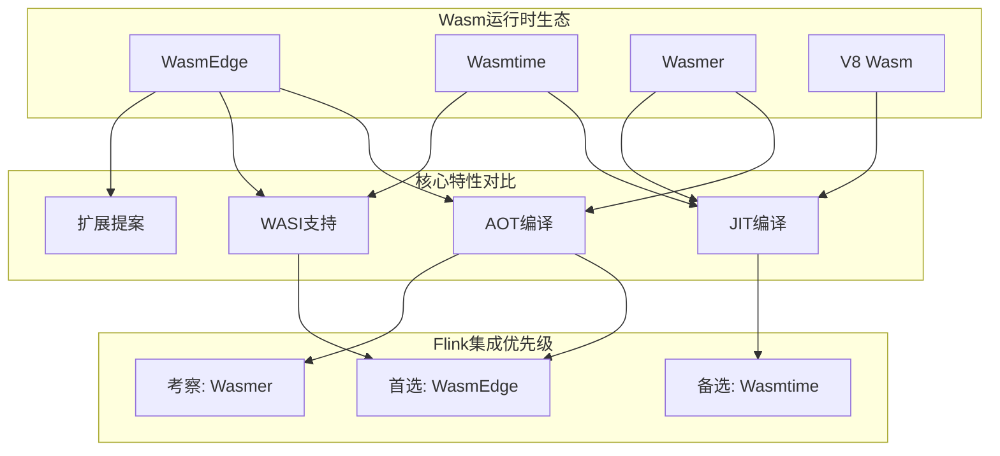
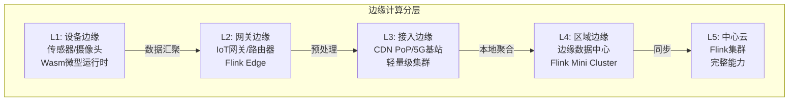
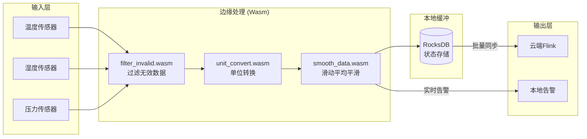
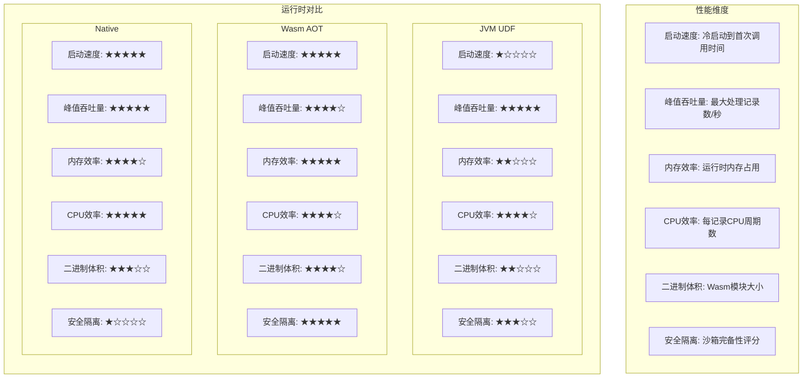
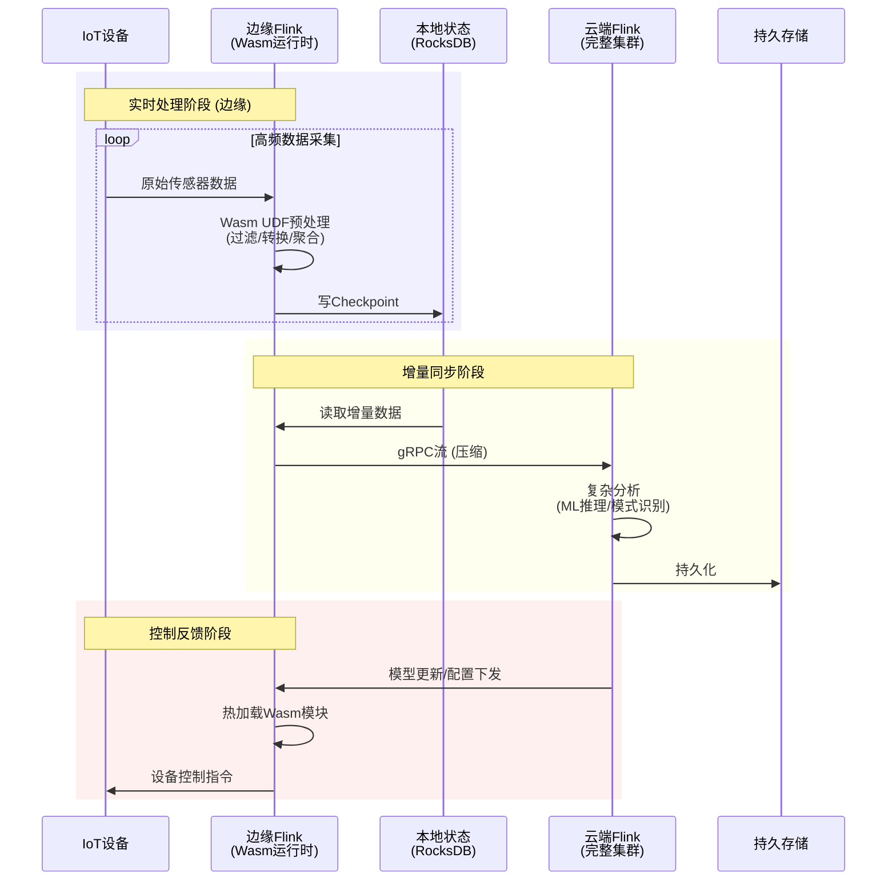
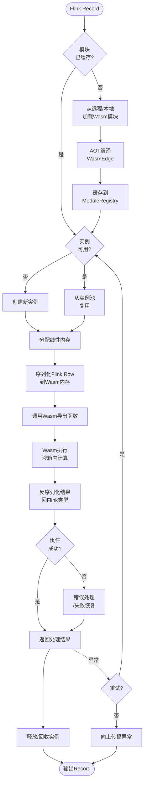

# WebAssembly与流计算 - 轻量级边缘计算

> 所属阶段: Flink | 前置依赖: [Flink架构概览](../01-architecture/flink-architecture-overview.md), [Flink UDF扩展](../05-udf/flink-udf-extension.md) | 形式化等级: L3

## 1. 概念定义 (Definitions)

### Def-F-13-01: WebAssembly (Wasm) 运行时

WebAssembly运行时是一个用于执行Wasm字节码的轻量级虚拟机环境，提供以下核心能力：

$$
\text{WasmRuntime} = \langle \text{Module}, \text{Memory}, \text{Table}, \text{Global}, \text{Export}, \text{Import} \rangle
$$

其中：

- **Module**: 已编译的Wasm二进制模块，包含函数、数据段、全局变量定义
- **Memory**: 线性内存空间（最大4GB），通过页（64KB）管理
- **Table**: 间接函数调用表，支持动态函数指针
- **Global**: 全局变量存储
- **Export/Import**: 与宿主环境交互的接口边界

**直观解释**: Wasm运行时如同一个"微型操作系统"，它在一个严格的沙箱中执行代码，与宿主系统隔离，同时通过明确的接口（WASI）进行受控的资源访问。

### Def-F-13-02: Wasm与Flink集成模式

Flink与Wasm的集成通过以下形式化映射定义：

$$
\text{FlinkWasmIntegration} = \langle \text{Source}, \text{Runtime}, \text{Bridge}, \text{Policy} \rangle
$$

- **Source**: Wasm模块来源（本地文件、远程URL、嵌入式二进制）
- **Runtime**: Wasm执行引擎（WasmEdge、Wasmer、Wasmtime）
- **Bridge**: Flink类型系统与Wasm线性内存的数据转换层
- **Policy**: 资源限制策略（CPU时间、内存上限、执行超时）

**集成架构**:

```
Flink TaskManager
    │
    ├── WasmRuntimeManager (生命周期管理)
    │       │
    │       ├── ModulePool (模块缓存)
    │       ├── InstancePool (实例复用)
    │       └── ResourceLimiter (资源管控)
    │
    └── WasmUDF (用户自定义函数)
            │
            ├── ScalarFunction → Wasm Function
            ├── TableFunction  → Wasm Iterator
            └── AsyncFunction  → Wasm Async/Await
```

### Def-F-13-03: 边缘计算运行时

边缘计算运行时定义为分布式计算拓扑中的轻量级执行节点：

$$
\text{EdgeRuntime} = \langle \text{Location}, \text{Capacity}, \text{Latency}, \text{Connectivity} \rangle
$$

- **Location**: 地理位置坐标，满足 $\text{Latency}(\text{Edge}, \text{Source}) < \text{Latency}(\text{Cloud}, \text{Source})$
- **Capacity**: 计算能力约束（CPU、内存、存储上限）
- **Latency**: 端到端延迟要求，通常为毫秒级
- **Connectivity**: 网络连接特性（间歇性、带宽受限、高移动性）

**边缘-云协同模型**:

```
┌─────────────────────────────────────────────────────────────┐
│                        Cloud Core                            │
│  ┌───────────────────────────────────────────────────────┐  │
│  │           Flink Cluster (Stateful Processing)          │  │
│  │     Complex Aggregation, ML Inference, Storage         │  │
│  └───────────────────────────────────────────────────────┘  │
└─────────────────────────────┬───────────────────────────────┘
                              │
                    Edge-Cloud Sync (Delta Updates)
                              │
┌─────────────────────────────┼───────────────────────────────┐
│                    Edge Layer                              │
│  ┌─────────────────────────┴─────────────────────────────┐  │
│  │              Flink Edge Runtime (Wasm)                 │  │
│  │  ┌─────────────┐  ┌─────────────┐  ┌─────────────┐    │  │
│  │  │  IoT Gateway │  │   CDN PoP   │  │  5G MEC     │    │  │
│  │  │  Wasm UDFs   │  │  Edge Cache │  │  Local Proc │    │  │
│  │  └─────────────┘  └─────────────┘  └─────────────┘    │  │
│  └─────────────────────────────────────────────────────────┘  │
└─────────────────────────────────────────────────────────────┘
```

---

## 2. 属性推导 (Properties)

### Prop-F-13-01: Wasm启动时间优势

**命题**: Wasm模块冷启动时间显著低于JVM。

**推导**:

设 $T_{\text{startup}}$ 为启动时间，$T_{\text{load}}$ 为模块加载时间，$T_{\text{init}}$ 为初始化时间：

$$
\begin{aligned}
T_{\text{startup}}^{\text{Wasm}} &= T_{\text{load}}^{\text{Wasm}} + T_{\text{init}}^{\text{Wasm}} \\
&\approx 1\text{ms} \sim 10\text{ms} \quad \text{(预编译场景)} \\
T_{\text{startup}}^{\text{JVM}} &= T_{\text{load}}^{\text{class}} + T_{\text{verify}} + T_{\text{JIT}} \\
&\approx 100\text{ms} \sim 1000\text{ms}
\end{aligned}
$$

因此：

$$
\frac{T_{\text{startup}}^{\text{Wasm}}}{T_{\text{startup}}^{\text{JVM}}} \in [0.001, 0.1]
$$

### Prop-F-13-02: Wasm沙箱安全边界

**命题**: Wasm模块具有严格的能力隔离性。

**推导**:

Wasm模块只能通过显式导入（imports）访问宿主能力，其安全模型可形式化为：

$$
\forall \text{capability}_i \in \text{HostCapabilities}: \\
\text{WasmModule.canAccess}(\text{capability}_i) \iff \text{capability}_i \in \text{Imports}_{\text{module}}
$$

即：Wasm模块无法突破其显式声明的权限边界，形成**基于能力的安全模型**（Capability-Based Security）。

### Prop-F-13-03: 跨平台可移植性

**命题**: Wasm模块可在任何支持Wasm标准的运行时上执行，无需重新编译。

**推导**:

设 $\mathcal{P}$ 为目标平台集合，$\mathcal{M}$ 为Wasm模块集合：

$$
\forall p \in \mathcal{P}, \forall m \in \mathcal{M}: \text{Exec}(m, p) = \text{Exec}(m, p') \quad \text{当满足 WASI 接口一致时}
$$

这意味着：

- 同一份Wasm二进制可在 x86、ARM、RISC-V 架构上运行
- 同一份Wasm二进制可在 Linux、Windows、macOS、嵌入式RTOS上运行
- 消除了"一次编译，到处运行"的JVM依赖问题

---

## 3. 关系建立 (Relations)

### 3.1 Wasm与Flink组件映射

| Flink组件 | Wasm对应物 | 映射说明 |
|-----------|-----------|---------|
| `ScalarFunction` | Wasm导出函数 | 一对一映射，输入输出通过线性内存传递 |
| `TableFunction` | Wasm迭代器模式 | 多值返回通过回调函数实现 |
| `AsyncFunction` | Wasm Future/Promise | 异步状态机编译为Wasm |
| `ProcessFunction` | Wasm事件处理器 | 状态管理通过宿主回调 |
| `KeyedProcessFunction` | Wasm状态机 | Key序列化后传入Wasm处理 |

### 3.2 Wasm运行时对比矩阵



### 3.3 边缘计算场景分层



---

## 4. 论证过程 (Argumentation)

### 4.1 Wasm作为Flink UDF执行引擎的可行性论证

**问题**: 为何选择Wasm而非传统JVM UDF？

**论证**:

1. **资源约束场景**
   - 边缘设备通常只有MB级内存，无法容纳完整JVM（~100MB+）
   - Wasm运行时（WasmEdge）仅需~10MB内存占用

2. **多语言生态**
   - Flink原生仅支持Java/Scala UDF
   - Wasm可将Rust、Go、C++、AssemblyScript编译为统一字节码
   - 形式化：$\text{Lang}_i \xrightarrow{\text{compile}} \text{Wasm} \xrightarrow{\text{execute}} \text{Flink}$

3. **冷启动敏感性**
   - 边缘场景FaaS需要快速扩缩容
   - Wasm冷启动比JVM快100-1000倍

### 4.2 数据序列化开销分析

**问题**: Flink类型系统与Wasm线性内存的转换成本？

**分析**:

| 数据类型 | 序列化方式 | 开销评估 | 优化策略 |
|---------|-----------|---------|---------|
| `INT` | 直接内存写入 | 极低 | 零拷贝传输 |
| `STRING` | UTF-8编码 | 低 | 预分配缓冲区 |
| `ROW` | FlatBuffers/CBOR | 中 | 列式存储布局 |
| `ARRAY` | 长度前缀+元素 | 中 | SIMD批量处理 |
| `DECIMAL` | 定点数表示 | 高 | 预转换为整数 |

**结论**: 对于简单标量类型，Wasm调用开销可控制在$<1\mu s$；复杂嵌套类型需要额外的序列化优化。

### 4.3 边界讨论：Wasm的局限性

1. **计算密集型任务**
   - Wasm在数值计算性能上接近Native（90-95%）
   - 但缺乏SIMD指令集完整支持时，性能可能下降至70%

2. **I/O密集型任务**
   - WASI标准仍在演进中，异步I/O支持有限
   - 需要通过宿主回调实现异步操作

3. **状态管理**
   - Wasm模块本身是无状态的
   - 状态必须外化到Flink的状态后端
   - 增加跨边界状态访问开销

---

## 5. 工程论证 (Engineering Argument)

### 5.1 Flink Wasm集成架构设计

**核心架构组件**:

```
┌────────────────────────────────────────────────────────────┐
│                    Flink TaskManager                        │
│  ┌──────────────────────────────────────────────────────┐  │
│  │              WasmFunctionOperator                     │  │
│  │  ┌────────────────────────────────────────────────┐  │  │
│  │  │         WasmModuleRegistry (单例)               │  │  │
│  │  │  ┌──────────┐  ┌──────────┐  ┌──────────┐      │  │  │
│  │  │  │ Module-1 │  │ Module-2 │  │ Module-N │      │  │  │
│  │  │  │ (cached) │  │ (cached) │  │ (cached) │      │  │  │
│  │  │  └──────────┘  └──────────┘  └──────────┘      │  │  │
│  │  └────────────────────────────────────────────────┘  │  │
│  │                         │                           │  │
│  │  ┌──────────────────────┼──────────────────────┐    │  │
│  │  │        WasmRuntimeContext                   │    │  │
│  │  │  ┌───────────────────┼───────────────────┐  │    │  │
│  │  │  │   WasmEdge Runtime │  Wasmtime Runtime │  │    │  │
│  │  │  │   (默认)           │  (可选)           │  │    │  │
│  │  │  └───────────────────┴───────────────────┘  │    │  │
│  │  │                                              │    │  │
│  │  │  ┌───────────────────────────────────────┐   │    │  │
│  │  │  │      TypeConverter (序列化层)          │   │    │  │
│  │  │  │  Flink Row → Wasm Memory → Flink Row  │   │    │  │
│  │  │  └───────────────────────────────────────┘   │    │  │
│  │  └──────────────────────────────────────────────┘    │  │
│  └──────────────────────────────────────────────────────┘  │
└────────────────────────────────────────────────────────────┘
```

### 5.2 性能基准测试方法论

**测试矩阵设计**:

| 维度 | 测试项 | 度量指标 |
|-----|-------|---------|
| 启动延迟 | 冷启动、热启动、模块加载 | p50/p99 延迟 |
| 吞吐量 | 单线程/多线程处理速率 | records/second |
| 内存占用 | 运行时、模块、实例 | MB/GB |
| CPU效率 | 计算密集型UDF | CPU cycles/record |
| 隔离性 | 故障传播、资源泄漏 | 失败恢复时间 |

**对比基准**:

- **Baseline**: Java UDF (JVM内联)
- **Wasm-AOT**: WasmEdge AOT编译模式
- **Wasm-JIT**: Wasmtime JIT模式
- **Native**: 直接链接本地库

### 5.3 部署模式论证

**模式一: 边缘独立运行**

适用场景：IoT网关、工业边缘设备

```yaml
# flink-edge.yaml
mode: edge-standalone
runtime:
  wasm_engine: wasmedge
  memory_limit: 128MB
  cpu_limit: 1.0
modules:
  - name: sensor_filter
    path: /opt/wasm/sensor_filter.wasm
    preload: true
```

**模式二: 边缘-云协同**

适用场景：CDN边缘节点

```yaml
# flink-edge-cloud.yaml
mode: edge-cloud-hybrid
edge:
  functions: [preprocess, filter]
  buffer_size: 1000
cloud:
  functions: [aggregate, ml_inference]
  checkpoint_interval: 30s
sync:
  protocol: grpc
  compression: zstd
```

---

## 6. 实例验证 (Examples)

### 6.1 边缘实时过滤UDF

**场景**: IoT传感器数据实时过滤异常值

**Rust实现**:

```rust
// sensor_filter.rs
#[no_mangle]
pub extern "C" fn filter_temperature(value: f64) -> i32 {
    const MIN_TEMP: f64 = -40.0;
    const MAX_TEMP: f64 = 85.0;

    if value >= MIN_TEMP && value <= MAX_TEMP {
        1  // 保留
    } else {
        0  // 过滤
    }
}

#[no_mangle]
pub extern "C" fn calculate_anomaly_score(readings: &[f64]) -> f64 {
    let n = readings.len() as f64;
    let mean = readings.iter().sum::<f64>() / n;
    let variance = readings.iter()
        .map(|x| (x - mean).powi(2))
        .sum::<f64>() / n;
    variance.sqrt()  // 标准差作为异常分数
}
```

**编译为Wasm**:

```bash
# 使用wasm32-wasi目标编译
rustup target add wasm32-wasi
cargo build --target wasm32-wasi --release

# 产物: target/wasm32-wasi/release/sensor_filter.wasm
```

**Flink SQL调用**:

```sql
-- 注册Wasm UDF
CREATE FUNCTION wasm_filter_temp AS 'com.flink.wasm.WasmScalarFunction'
USING JAR 'file:///opt/flink/wasm/flink-wasm-bridge.jar'
WITH (
    'wasm.module.path' = '/opt/wasm/sensor_filter.wasm',
    'wasm.function.name' = 'filter_temperature'
);

-- 使用Wasm UDF进行过滤
SELECT
    sensor_id,
    temperature,
    humidity
FROM sensor_readings
WHERE wasm_filter_temp(temperature) = 1;
```

### 6.2 图片预处理Wasm模块

**场景**: 边缘设备上执行图片压缩和格式转换

**Rust + image crate实现**:

```rust
// image_processor.rs
use image::{ImageFormat, DynamicImage};

#[no_mangle]
pub extern "C" fn resize_image(
    input_ptr: *const u8,
    input_len: usize,
    output_ptr: *mut u8,
    max_width: u32,
    max_height: u32
) -> usize {
    let input = unsafe { std::slice::from_raw_parts(input_ptr, input_len) };

    match image::load_from_memory(input) {
        Ok(img) => {
            let resized = img.resize(
                max_width,
                max_height,
                image::imageops::FilterType::Lanczos3
            );

            let mut output = Vec::new();
            if let Ok(_) = resized.write_to(
                &mut std::io::Cursor::new(&mut output),
                ImageFormat::WebP
            ) {
                let output_len = output.len();
                unsafe {
                    std::ptr::copy_nonoverlapping(
                        output.as_ptr(),
                        output_ptr,
                        output_len
                    );
                }
                output_len
            } else {
                0
            }
        }
        Err(_) => 0
    }
}
```

**Flink DataStream集成**:

```java
// Flink Wasm图片处理UDF
public class WasmImageProcessor extends ProcessFunction<ImageEvent, ProcessedImage> {

    private WasmRuntime runtime;
    private WasmModule module;

    @Override
    public void open(Configuration parameters) {
        runtime = WasmRuntime.create(WasmEngine.WASMEDGE);
        module = runtime.loadModule("/opt/wasm/image_processor.wasm");
    }

    @Override
    public void processElement(ImageEvent event, Context ctx,
                               Collector<ProcessedImage> out) {
        // 分配Wasm线性内存
        WasmMemory memory = runtime.allocateMemory(event.getImageData().length);

        // 写入输入数据
        memory.write(event.getImageData());

        // 调用Wasm函数
        int outputSize = module.call("resize_image",
            memory.getPtr(),
            event.getImageData().length,
            memory.getOutputPtr(),
            800,  // max_width
            600   // max_height
        );

        // 读取输出
        byte[] processed = memory.readOutput(outputSize);

        out.collect(new ProcessedImage(
            event.getImageId(),
            processed,
            "image/webp",
            System.currentTimeMillis() - event.getTimestamp()
        ));
    }
}
```

### 6.3 IoT传感器数据清洗Pipeline

**完整场景**: 边缘网关上的多阶段数据处理



**Wasm数据清洗链配置**:

```yaml
# edge-pipeline.yaml
pipeline:
  name: iot_data_cleaning

  sources:
    - type: mqtt
      broker: tcp://localhost:1883
      topics: [sensors/+/temperature, sensors/+/humidity]

  wasm_stages:
    - name: filter_stage
      module: filter_invalid.wasm
      functions:
        - name: validate_range
          input_type: double
          output_type: boolean
      config:
        min_value: -50.0
        max_value: 100.0

    - name: convert_stage
      module: unit_convert.wasm
      functions:
        - name: celsius_to_fahrenheit
          input_type: double
          output_type: double

    - name: smooth_stage
      module: smooth_data.wasm
      functions:
        - name: moving_average
          input_type: array<double>
          output_type: double
      state:
        type: sliding_window
        size: 10
        ttl: 60s

  sinks:
    - type: kafka
      brokers: cloud-kafka:9092
      topic: cleaned.sensor.data
      batch_size: 100
      flush_interval: 5s
```

---

## 7. 可视化 (Visualizations)

### 7.1 Wasm运行时性能对比雷达图



### 7.2 边缘-云协同数据处理时序图



### 7.3 Flink Wasm UDF执行流程图



---

## 8. 引用参考 (References)
