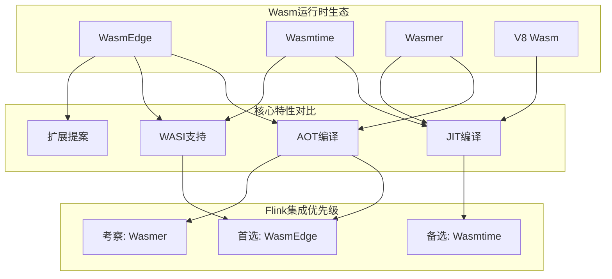
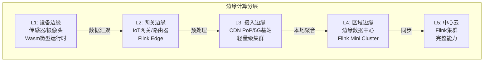
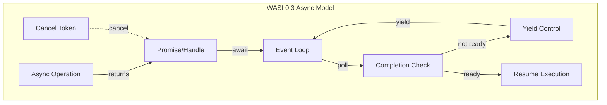
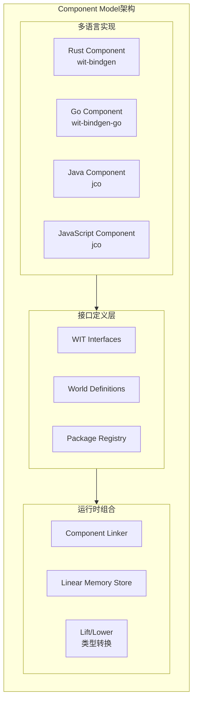
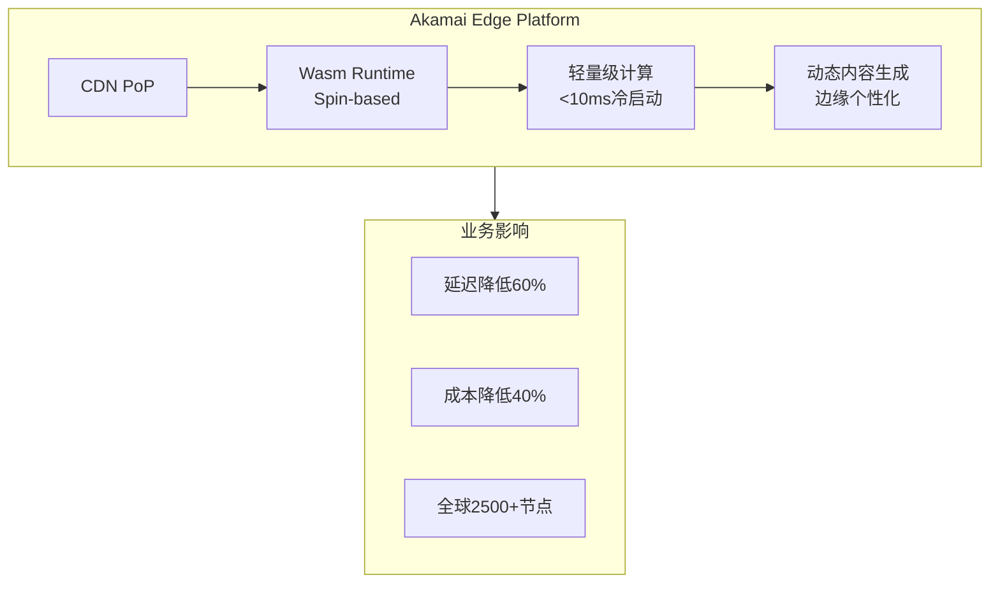
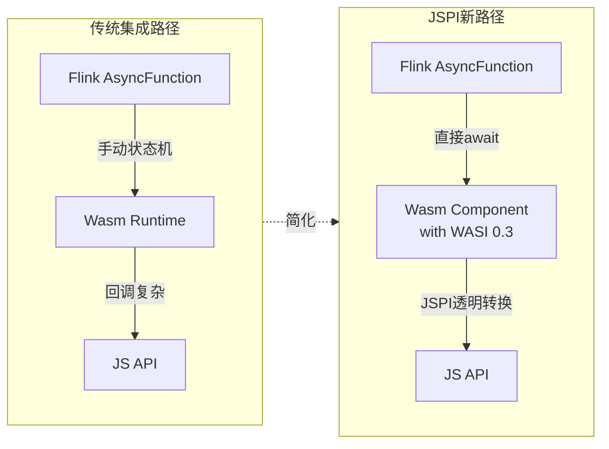
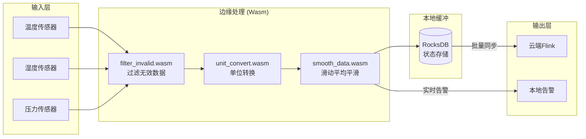
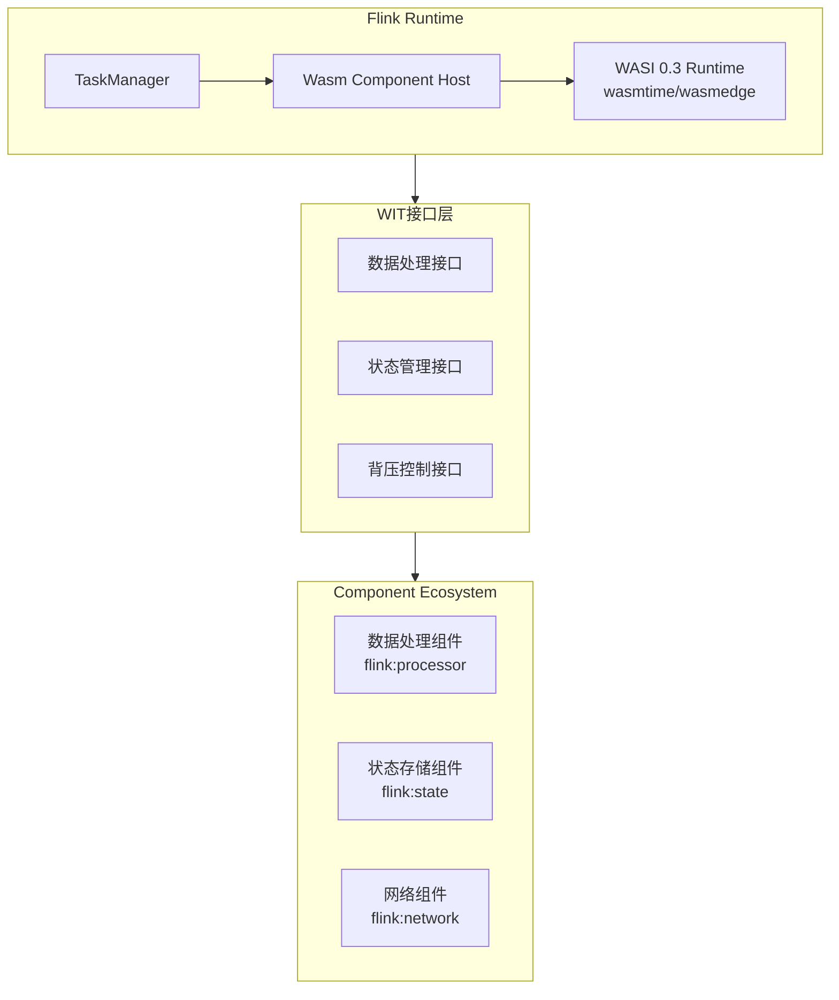
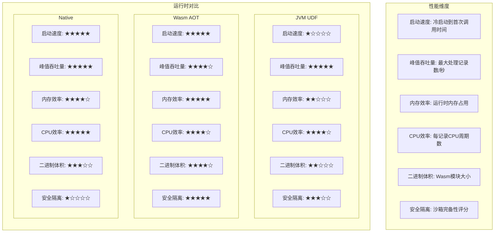
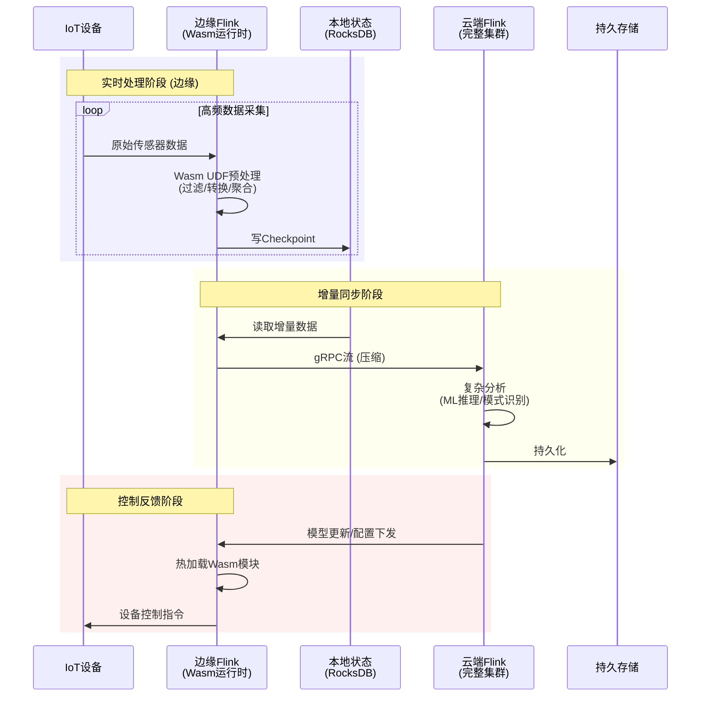

# WebAssembly与流计算 - 轻量级边缘计算

> 所属阶段: Flink | 前置依赖: [Flink架构概览](../01-architecture/flink-architecture-overview.md), [Flink UDF扩展](../05-udf/flink-udf-extension.md) | 形式化等级: L3

## 1. 概念定义 (Definitions)

### Def-F-13-01: WebAssembly (Wasm) 运行时

WebAssembly运行时是一个用于执行Wasm字节码的轻量级虚拟机环境，提供以下核心能力：

$$
\text{WasmRuntime} = \langle \text{Module}, \text{Memory}, \text{Table}, \text{Global}, \text{Export}, \text{Import} \rangle
$$

其中：

- **Module**: 已编译的Wasm二进制模块，包含函数、数据段、全局变量定义
- **Memory**: 线性内存空间（最大4GB），通过页（64KB）管理
- **Table**: 间接函数调用表，支持动态函数指针
- **Global**: 全局变量存储
- **Export/Import**: 与宿主环境交互的接口边界

**直观解释**: Wasm运行时如同一个"微型操作系统"，它在一个严格的沙箱中执行代码，与宿主系统隔离，同时通过明确的接口（WASI）进行受控的资源访问。

### Def-F-13-02: Wasm与Flink集成模式

Flink与Wasm的集成通过以下形式化映射定义：

$$
\text{FlinkWasmIntegration} = \langle \text{Source}, \text{Runtime}, \text{Bridge}, \text{Policy} \rangle
$$

- **Source**: Wasm模块来源（本地文件、远程URL、嵌入式二进制）
- **Runtime**: Wasm执行引擎（WasmEdge、Wasmer、Wasmtime）
- **Bridge**: Flink类型系统与Wasm线性内存的数据转换层
- **Policy**: 资源限制策略（CPU时间、内存上限、执行超时）

**集成架构**:

```
Flink TaskManager
    │
    ├── WasmRuntimeManager (生命周期管理)
    │       │
    │       ├── ModulePool (模块缓存)
    │       ├── InstancePool (实例复用)
    │       └── ResourceLimiter (资源管控)
    │
    └── WasmUDF (用户自定义函数)
            │
            ├── ScalarFunction → Wasm Function
            ├── TableFunction  → Wasm Iterator
            └── AsyncFunction  → Wasm Async/Await
```

### Def-F-13-03: 边缘计算运行时

边缘计算运行时定义为分布式计算拓扑中的轻量级执行节点：

$$
\text{EdgeRuntime} = \langle \text{Location}, \text{Capacity}, \text{Latency}, \text{Connectivity} \rangle
$$

- **Location**: 地理位置坐标，满足 $\text{Latency}(\text{Edge}, \text{Source}) < \text{Latency}(\text{Cloud}, \text{Source})$
- **Capacity**: 计算能力约束（CPU、内存、存储上限）
- **Latency**: 端到端延迟要求，通常为毫秒级
- **Connectivity**: 网络连接特性（间歇性、带宽受限、高移动性）

**边缘-云协同模型**:

```
┌─────────────────────────────────────────────────────────────┐
│                        Cloud Core                            │
│  ┌───────────────────────────────────────────────────────┐  │
│  │           Flink Cluster (Stateful Processing)          │  │
│  │     Complex Aggregation, ML Inference, Storage         │  │
│  └───────────────────────────────────────────────────────┘  │
└─────────────────────────────┬───────────────────────────────┘
                              │
                    Edge-Cloud Sync (Delta Updates)
                              │
┌─────────────────────────────┼───────────────────────────────┐
│                    Edge Layer                              │
│  ┌─────────────────────────┴─────────────────────────────┐  │
│  │              Flink Edge Runtime (Wasm)                 │  │
│  │  ┌─────────────┐  ┌─────────────┐  ┌─────────────┐    │  │
│  │  │  IoT Gateway │  │   CDN PoP   │  │  5G MEC     │    │  │
│  │  │  Wasm UDFs   │  │  Edge Cache │  │  Local Proc │    │  │
│  │  └─────────────┘  └─────────────┘  └─────────────┘    │  │
│  └─────────────────────────────────────────────────────────┘  │
└─────────────────────────────────────────────────────────────┘
```

---

## 2. 属性推导 (Properties)

### Prop-F-13-01: Wasm启动时间优势

**命题**: Wasm模块冷启动时间显著低于JVM。

**推导**:

设 $T_{\text{startup}}$ 为启动时间，$T_{\text{load}}$ 为模块加载时间，$T_{\text{init}}$ 为初始化时间：

$$
\begin{aligned}
T_{\text{startup}}^{\text{Wasm}} &= T_{\text{load}}^{\text{Wasm}} + T_{\text{init}}^{\text{Wasm}} \\
&\approx 1\text{ms} \sim 10\text{ms} \quad \text{(预编译场景)} \\
T_{\text{startup}}^{\text{JVM}} &= T_{\text{load}}^{\text{class}} + T_{\text{verify}} + T_{\text{JIT}} \\
&\approx 100\text{ms} \sim 1000\text{ms}
\end{aligned}
$$

因此：

$$
\frac{T_{\text{startup}}^{\text{Wasm}}}{T_{\text{startup}}^{\text{JVM}}} \in [0.001, 0.1]
$$

### Prop-F-13-02: Wasm沙箱安全边界

**命题**: Wasm模块具有严格的能力隔离性。

**推导**:

Wasm模块只能通过显式导入（imports）访问宿主能力，其安全模型可形式化为：

$$
\forall \text{capability}_i \in \text{HostCapabilities}: \\
\text{WasmModule.canAccess}(\text{capability}_i) \iff \text{capability}_i \in \text{Imports}_{\text{module}}
$$

即：Wasm模块无法突破其显式声明的权限边界，形成**基于能力的安全模型**（Capability-Based Security）。

### Prop-F-13-03: 跨平台可移植性

**命题**: Wasm模块可在任何支持Wasm标准的运行时上执行，无需重新编译。

**推导**:

设 $\mathcal{P}$ 为目标平台集合，$\mathcal{M}$ 为Wasm模块集合：

$$
\forall p \in \mathcal{P}, \forall m \in \mathcal{M}: \text{Exec}(m, p) = \text{Exec}(m, p') \quad \text{当满足 WASI 接口一致时}
$$

这意味着：

- 同一份Wasm二进制可在 x86、ARM、RISC-V 架构上运行
- 同一份Wasm二进制可在 Linux、Windows、macOS、嵌入式RTOS上运行
- 消除了"一次编译，到处运行"的JVM依赖问题

---

## 3. 关系建立 (Relations)

### 3.1 Wasm与Flink组件映射

| Flink组件 | Wasm对应物 | 映射说明 |
|-----------|-----------|---------|
| `ScalarFunction` | Wasm导出函数 | 一对一映射，输入输出通过线性内存传递 |
| `TableFunction` | Wasm迭代器模式 | 多值返回通过回调函数实现 |
| `AsyncFunction` | Wasm Future/Promise | 异步状态机编译为Wasm |
| `ProcessFunction` | Wasm事件处理器 | 状态管理通过宿主回调 |
| `KeyedProcessFunction` | Wasm状态机 | Key序列化后传入Wasm处理 |

### 3.2 Wasm运行时对比矩阵



### 3.3 边缘计算场景分层



---

## 4. 论证过程 (Argumentation)

### 4.1 Wasm作为Flink UDF执行引擎的可行性论证

**问题**: 为何选择Wasm而非传统JVM UDF？

**论证**:

1. **资源约束场景**
   - 边缘设备通常只有MB级内存，无法容纳完整JVM（~100MB+）
   - Wasm运行时（WasmEdge）仅需~10MB内存占用

2. **多语言生态**
   - Flink原生仅支持Java/Scala UDF
   - Wasm可将Rust、Go、C++、AssemblyScript编译为统一字节码
   - 形式化：$\text{Lang}_i \xrightarrow{\text{compile}} \text{Wasm} \xrightarrow{\text{execute}} \text{Flink}$

3. **冷启动敏感性**
   - 边缘场景FaaS需要快速扩缩容
   - Wasm冷启动比JVM快100-1000倍

### 4.2 数据序列化开销分析

**问题**: Flink类型系统与Wasm线性内存的转换成本？

**分析**:

| 数据类型 | 序列化方式 | 开销评估 | 优化策略 |
|---------|-----------|---------|---------|
| `INT` | 直接内存写入 | 极低 | 零拷贝传输 |
| `STRING` | UTF-8编码 | 低 | 预分配缓冲区 |
| `ROW` | FlatBuffers/CBOR | 中 | 列式存储布局 |
| `ARRAY` | 长度前缀+元素 | 中 | SIMD批量处理 |
| `DECIMAL` | 定点数表示 | 高 | 预转换为整数 |

**结论**: 对于简单标量类型，Wasm调用开销可控制在$<1\mu s$；复杂嵌套类型需要额外的序列化优化。

### 4.3 边界讨论：Wasm的局限性

1. **计算密集型任务**
   - Wasm在数值计算性能上接近Native（90-95%）
   - 但缺乏SIMD指令集完整支持时，性能可能下降至70%

2. **I/O密集型任务**
   - WASI标准仍在演进中，异步I/O支持有限
   - 需要通过宿主回调实现异步操作

3. **状态管理**
   - Wasm模块本身是无状态的
   - 状态必须外化到Flink的状态后端
   - 增加跨边界状态访问开销

---

## 5. 工程论证 (Engineering Argument)

### 5.1 Flink Wasm集成架构设计

**核心架构组件**:

```
┌────────────────────────────────────────────────────────────┐
│                    Flink TaskManager                        │
│  ┌──────────────────────────────────────────────────────┐  │
│  │              WasmFunctionOperator                     │  │
│  │  ┌────────────────────────────────────────────────┐  │  │
│  │  │         WasmModuleRegistry (单例)               │  │  │
│  │  │  ┌──────────┐  ┌──────────┐  ┌──────────┐      │  │  │
│  │  │  │ Module-1 │  │ Module-2 │  │ Module-N │      │  │  │
│  │  │  │ (cached) │  │ (cached) │  │ (cached) │      │  │  │
│  │  │  └──────────┘  └──────────┘  └──────────┘      │  │  │
│  │  └────────────────────────────────────────────────┘  │  │
│  │                         │                           │  │
│  │  ┌──────────────────────┼──────────────────────┐    │  │
│  │  │        WasmRuntimeContext                   │    │  │
│  │  │  ┌───────────────────┼───────────────────┐  │    │  │
│  │  │  │   WasmEdge Runtime │  Wasmtime Runtime │  │    │  │
│  │  │  │   (默认)           │  (可选)           │  │    │  │
│  │  │  └───────────────────┴───────────────────┘  │    │  │
│  │  │                                              │    │  │
│  │  │  ┌───────────────────────────────────────┐   │    │  │
│  │  │  │      TypeConverter (序列化层)          │   │    │  │
│  │  │  │  Flink Row → Wasm Memory → Flink Row  │   │    │  │
│  │  │  └───────────────────────────────────────┘   │    │  │
│  │  └──────────────────────────────────────────────┘    │  │
│  └──────────────────────────────────────────────────────┘  │
└────────────────────────────────────────────────────────────┘
```

### 5.2 性能基准测试方法论

**测试矩阵设计**:

| 维度 | 测试项 | 度量指标 |
|-----|-------|---------|
| 启动延迟 | 冷启动、热启动、模块加载 | p50/p99 延迟 |
| 吞吐量 | 单线程/多线程处理速率 | records/second |
| 内存占用 | 运行时、模块、实例 | MB/GB |
| CPU效率 | 计算密集型UDF | CPU cycles/record |
| 隔离性 | 故障传播、资源泄漏 | 失败恢复时间 |

**对比基准**:

- **Baseline**: Java UDF (JVM内联)
- **Wasm-AOT**: WasmEdge AOT编译模式
- **Wasm-JIT**: Wasmtime JIT模式
- **Native**: 直接链接本地库

### 5.3 部署模式论证

**模式一: 边缘独立运行**

适用场景：IoT网关、工业边缘设备

```yaml
# flink-edge.yaml
mode: edge-standalone
runtime:
  wasm_engine: wasmedge
  memory_limit: 128MB
  cpu_limit: 1.0
modules:
  - name: sensor_filter
    path: /opt/wasm/sensor_filter.wasm
    preload: true
```

**模式二: 边缘-云协同**

适用场景：CDN边缘节点

```yaml
# flink-edge-cloud.yaml
mode: edge-cloud-hybrid
edge:
  functions: [preprocess, filter]
  buffer_size: 1000
cloud:
  functions: [aggregate, ml_inference]
  checkpoint_interval: 30s
sync:
  protocol: grpc
  compression: zstd
```

### 5.4 WASI 0.3与Component Model

#### 5.4.1 WASI 0.3 (2026年2月发布)

WASI 0.3是WebAssembly系统接口的重大版本更新，引入了原生异步支持[^7]：

**核心特性**:

| 特性 | 说明 | Flink集成意义 |
|-----|------|--------------|
| 原生异步支持 | 内置async/await语义，无需状态机转换 | 简化Flink AsyncFunction实现 |
| 取消令牌 | 标准化取消信号传播机制 | 支持Flink检查点超时中断 |
| 流优化 | 背压感知的数据流接口 | 与Flink背压机制原生对接 |
| 线程支持 | 标准线程API和并发原语 | 多线程Wasm UDF执行 |

**WASI 0.3异步模型**:



**与Flink集成优势**:

$$
\text{AsyncLatency}_{\text{WASI 0.3}} = T_{\text{syscall}} + T_{\text{poll}} < T_{\text{context switch}}^{\text{traditional}}
$$

#### 5.4.2 WebAssembly Component Model

WebAssembly Component Model 1.0定义了Wasm模块的跨语言组合标准[^8]：

**Def-F-13-04: 组件模型核心概念**

$$
\text{Component} = \langle \text{Interface}, \text{Implementation}, \text{Dependency}, \text{Package} \rangle
$$

- **Interface**: WIT (Wasm Interface Types) 定义的类型契约
- **Implementation**: 一个或多个核心Wasm模块
- **Dependency**: 对其他组件的接口依赖
- **Package**: 版本化分发单元

**接口类型系统**:

```wit
// sensor-processor.wit
package flink:edge-sensor@0.1.0;

interface data-processing {
    record sensor-reading {
        sensor-id: string,
        timestamp: u64,
        value: f64,
        unit: string,
    }

    variant filter-result {
        valid(f64),
        invalid(string),
    }

    process: func(reading: sensor-reading) -> filter-result;
}

world sensor-processor {
    import flink:state/state-store@0.1.0;
    export data-processing;
}
```

**跨语言组合架构**:



**组件模型1.0路线图状态** (2026年):

| 阶段 | 特性 | 状态 |
|-----|------|------|
| Phase 1 | 核心规范 + WASI Preview 2 | ✅ 完成 |
| Phase 2 | 包管理器 (warg) | ✅ 完成 |
| Phase 3 | 多组件动态链接 | 🔄 Beta |
| Phase 4 | 完整生态系统工具链 | 🔄 RC |

#### 5.4.3 Wasm 3.0新特性

Wasm 3.0提案引入了多项关键特性，显著扩展了Wasm的应用场景[^9]：

**异常处理（exnref）**:

```wat
;; Wasm 3.0 异常处理示例
(module
  (tag $parse-error (param i32 i32))  ;; 异常类型定义

  (func $parse-json (param i32 i32) (result i32)
    ;; 解析逻辑
    (if (i32.eq (local.get 0) (i32.const 0))
      (throw $parse-error (i32.const 0) (i32.const 11))  ;; "parse failed"
    )
    (i32.const 1)  ;; 成功
  )

  (func $process-data (param i32 i32) (result i32)
    (block $handler (result i32 i32)
      (try
        (do (call $parse-json (local.get 0) (local.get 1)))
        (catch $parse-error (return (i32.const 0)))
      )
    )
  )
)
```

**JavaScript String Builtins**:

| 特性 | 描述 | 性能提升 |
|-----|------|---------|
| 共享字符串表示 | Wasm与JS共享UTF-16字符串 | 消除复制开销 |
| 内置编码API | 原生UTF-8/UTF-16转换 | 减少WASM-JS边界开销 |
| Stringref类型 | 直接引用JS字符串 | 零拷贝互操作 |

**垃圾回收（GC）**:

```rust
// 使用Wasm GC的类型定义（Rust示例）
#[wasm_bindgen]
pub struct StreamProcessor {
    config: ProcessingConfig,
    state: RefCell<ProcessingState>,
}

#[wasm_bindgen]
impl StreamProcessor {
    // Wasm GC自动管理内存，无需手动释放
    pub fn new(config: ProcessingConfig) -> StreamProcessor {
        StreamProcessor {
            config,
            state: RefCell::new(ProcessingState::default()),
        }
    }
}
```

**新语言支持状态**:

| 语言 | 编译目标 | 状态 | 适用场景 |
|-----|---------|------|---------|
| Java (TeaVM) | Wasm GC | ✅ 生产可用 | 企业级UDF迁移 |
| Kotlin (Wasm) | Wasm GC | ✅ 生产可用 | 安卓生态复用 |
| Dart | Wasm GC | ✅ 稳定 | Flutter边缘计算 |
| C# (Mono) | Wasm MVP + GC | 🔄 Beta | .NET生态集成 |
| Swift | Wasm MVP | 🔄 Alpha | iOS生态扩展 |

#### 5.4.4 边缘计算生产案例

**Akamai收购Fermyon** (2025年)[^10]:

Akamai于2025年完成对Fermyon的收购，将Wasm运行时整合到其全球CDN网络：



**Cloudflare Workers**:

Cloudflare Workers是最早大规模生产化部署Wasm的平台之一：

| 指标 | 数据 |
|-----|------|
| 部署规模 | 全球300+城市 |
| 冷启动 | <1ms (V8 isolates) |
| Wasm支持 | WASI Preview 1/2 |
| 语言生态 | Rust, C++, Go, AssemblyScript |

**Fastly Compute@Edge**:

Fastly基于Wasmtime构建的边缘计算平台：

```yaml
# fastly-compute.toml
name = "flink-edge-processor"
description = "Flink-compatible edge processor"
language = "rust"
manifest_version = 3

[local_server]
  [local_server.backends]
    [local_server.backends.flink-cloud]
      url = "https://flink-cluster.example.com"

[wasm]
  module = "target/wasm32-wasi/release/flink_edge_processor.wasm"
  wasi-preview-2 = true  # 启用WASI 0.3特性
```

#### 5.4.5 JSPI (JavaScript Promise Integration)

JSPI解决了Wasm与JavaScript异步API互操作的核心问题[^11]：

**Def-F-13-05: JSPI机制**

JSPI允许同步编译的Wasm代码调用异步JavaScript API，无需复杂的状态机转换：

$$
\text{JSPI}: \text{WasmSyncFunction} \times \text{JSAsyncAPI} \rightarrow \text{Promise}
$$

**浏览器支持状态** (2026年):

| 浏览器 | 支持状态 | 版本 |
|-------|---------|------|
| Chrome | ✅ 已支持 | 123+ |
| Edge | ✅ 已支持 | 123+ |
| Firefox | 🔄 开发中 | Nightly |
| Safari | ❌ 已移除反对 | WebKit立场不变 |

**JSPI使用示例**:

```javascript
// JSPI 集成示例
const { instance } = await WebAssembly.instantiate(module, {
  env: {
    // 异步外部函数
    async fetch_sensor_data(sensor_id) {
      const response = await fetch(`/api/sensors/${sensor_id}`);
      return response.json();
    }
  }
});

// Wasm内部以同步方式调用，JSPI自动处理异步转换
const result = instance.exports.process_sensor_data(sensor_id);
```

```rust
// Rust侧代码（使用wasm-bindgen-futures）
use wasm_bindgen::prelude::*;
use wasm_bindgen_futures::JsFuture;

#[wasm_bindgen]
extern "C" {
    async fn fetch_sensor_data(sensor_id: &str) -> JsValue;
}

#[wasm_bindgen]
pub async fn process_sensor_data(sensor_id: String) -> Result<JsValue, JsValue> {
    // 同步风格代码，JSPI自动转换为异步
    let data = fetch_sensor_data(&sensor_id).await;
    let processed = transform_data(data)?;
    Ok(processed)
}
```

**Flink集成新路径**:



---

## 6. 实例验证 (Examples)

### 6.1 边缘实时过滤UDF

**场景**: IoT传感器数据实时过滤异常值

**Rust实现**:

```rust
// sensor_filter.rs
#[no_mangle]
pub extern "C" fn filter_temperature(value: f64) -> i32 {
    const MIN_TEMP: f64 = -40.0;
    const MAX_TEMP: f64 = 85.0;

    if value >= MIN_TEMP && value <= MAX_TEMP {
        1  // 保留
    } else {
        0  // 过滤
    }
}

#[no_mangle]
pub extern "C" fn calculate_anomaly_score(readings: &[f64]) -> f64 {
    let n = readings.len() as f64;
    let mean = readings.iter().sum::<f64>() / n;
    let variance = readings.iter()
        .map(|x| (x - mean).powi(2))
        .sum::<f64>() / n;
    variance.sqrt()  // 标准差作为异常分数
}
```

**编译为Wasm**:

```bash
# 使用wasm32-wasi目标编译
rustup target add wasm32-wasi
cargo build --target wasm32-wasi --release

# 产物: target/wasm32-wasi/release/sensor_filter.wasm
```

**Flink SQL调用**:

```sql
-- 注册Wasm UDF
CREATE FUNCTION wasm_filter_temp AS 'com.flink.wasm.WasmScalarFunction'
USING JAR 'file:///opt/flink/wasm/flink-wasm-bridge.jar'
WITH (
    'wasm.module.path' = '/opt/wasm/sensor_filter.wasm',
    'wasm.function.name' = 'filter_temperature'
);

-- 使用Wasm UDF进行过滤
SELECT
    sensor_id,
    temperature,
    humidity
FROM sensor_readings
WHERE wasm_filter_temp(temperature) = 1;
```

### 6.2 图片预处理Wasm模块

**场景**: 边缘设备上执行图片压缩和格式转换

**Rust + image crate实现**:

```rust
// image_processor.rs
use image::{ImageFormat, DynamicImage};

#[no_mangle]
pub extern "C" fn resize_image(
    input_ptr: *const u8,
    input_len: usize,
    output_ptr: *mut u8,
    max_width: u32,
    max_height: u32
) -> usize {
    let input = unsafe { std::slice::from_raw_parts(input_ptr, input_len) };

    match image::load_from_memory(input) {
        Ok(img) => {
            let resized = img.resize(
                max_width,
                max_height,
                image::imageops::FilterType::Lanczos3
            );

            let mut output = Vec::new();
            if let Ok(_) = resized.write_to(
                &mut std::io::Cursor::new(&mut output),
                ImageFormat::WebP
            ) {
                let output_len = output.len();
                unsafe {
                    std::ptr::copy_nonoverlapping(
                        output.as_ptr(),
                        output_ptr,
                        output_len
                    );
                }
                output_len
            } else {
                0
            }
        }
        Err(_) => 0
    }
}
```

**Flink DataStream集成**:

```java
// Flink Wasm图片处理UDF
public class WasmImageProcessor extends ProcessFunction<ImageEvent, ProcessedImage> {

    private WasmRuntime runtime;
    private WasmModule module;

    @Override
    public void open(Configuration parameters) {
        runtime = WasmRuntime.create(WasmEngine.WASMEDGE);
        module = runtime.loadModule("/opt/wasm/image_processor.wasm");
    }

    @Override
    public void processElement(ImageEvent event, Context ctx,
                               Collector<ProcessedImage> out) {
        // 分配Wasm线性内存
        WasmMemory memory = runtime.allocateMemory(event.getImageData().length);

        // 写入输入数据
        memory.write(event.getImageData());

        // 调用Wasm函数
        int outputSize = module.call("resize_image",
            memory.getPtr(),
            event.getImageData().length,
            memory.getOutputPtr(),
            800,  // max_width
            600   // max_height
        );

        // 读取输出
        byte[] processed = memory.readOutput(outputSize);

        out.collect(new ProcessedImage(
            event.getImageId(),
            processed,
            "image/webp",
            System.currentTimeMillis() - event.getTimestamp()
        ));
    }
}
```

### 6.3 IoT传感器数据清洗Pipeline

**完整场景**: 边缘网关上的多阶段数据处理



**Wasm数据清洗链配置**:

```yaml
# edge-pipeline.yaml
pipeline:
  name: iot_data_cleaning

  sources:
    - type: mqtt
      broker: tcp://localhost:1883
      topics: [sensors/+/temperature, sensors/+/humidity]

  wasm_stages:
    - name: filter_stage
      module: filter_invalid.wasm
      functions:
        - name: validate_range
          input_type: double
          output_type: boolean
      config:
        min_value: -50.0
        max_value: 100.0

    - name: convert_stage
      module: unit_convert.wasm
      functions:
        - name: celsius_to_fahrenheit
          input_type: double
          output_type: double

    - name: smooth_stage
      module: smooth_data.wasm
      functions:
        - name: moving_average
          input_type: array<double>
          output_type: double
      state:
        type: sliding_window
        size: 10
        ttl: 60s

  sinks:
    - type: kafka
      brokers: cloud-kafka:9092
      topic: cleaned.sensor.data
      batch_size: 100
      flush_interval: 5s
```

### 6.4 WASI 0.3 API变更实现

**WASI 0.3异步I/O示例** (Rust + wasmtime):

```rust
// wasi03_async_processor.rs
use wasmtime::{Engine, Module, Store, Config};
use wasmtime_wasi::{WasiCtx, WasiCtxBuilder, async_trait};

#[async_trait]
trait AsyncProcessor {
    async fn process_stream(&self, data: Vec<u8>) -> Result<Vec<u8>, String>;
}

// WASI 0.3 支持原生async/await
pub async fn run_wasi03_component(component_path: &str) -> Result<(), Box<dyn Error>> {
    let mut config = Config::new();
    config.async_support(true);
    config.wasm_backtrace_details(wasmtime::WasmBacktraceDetails::Enable);

    let engine = Engine::new(&config)?;
    let module = Module::from_file(&engine, component_path)?;

    // WASI 0.3上下文
    let wasi = WasiCtxBuilder::new()
        .inherit_stdio()
        .inherit_network()
        .allow_ip_name_lookup(true)
        .build();

    let mut store = Store::new(&engine, wasi);

    // 异步实例化与执行
    let instance = wasmtime::component::Instance::new_async(
        &mut store,
        &module
    ).await?;

    // 调用异步导出函数
    let process_fn = instance
        .get_typed_func::<(Vec<u8>,), Vec<u8>>(&mut store, "process_async")?;

    let result = process_fn.call_async(&mut store, (input_data,)).await?;

    Ok(result)
}
```

### 6.5 Component Model开发流程

**完整开发工作流**:

```bash
# 1. 安装工具链
cargo install cargo-component wit-bindgen-cli wasm-tools

# 2. 创建组件项目
cargo component new sensor-processor --lib

# 3. 定义WIT接口
# wit/sensor-processor.wit (见5.4.2节)

# 4. 实现组件逻辑
# src/lib.rs
use bindings::exports::flink::edge::data_processing::{Guest, SensorReading, FilterResult};

struct Component;

impl Guest for Component {
    fn process(reading: SensorReading) -> FilterResult {
        if reading.value < -40.0 || reading.value > 85.0 {
            FilterResult::Invalid("out of range".to_string())
        } else {
            FilterResult::Valid(reading.value)
        }
    }
}

bindings::export!(Component with_types_in bindings);

# 5. 构建组件
cargo component build --release

# 6. 发布到注册表 (warg)
warg publish target/wasm32-wasi/release/sensor_processor.wasm \
    --registry https://warg.bytecodealliance.org \
    --package flink:edge-sensor@0.1.0
```

**Flink Component集成**:

```java
// Flink WASI 0.3 Component集成
public class WasmComponentUDF extends ScalarFunction {
    private ComponentInstance instance;
    private Store<WasiCtx> store;

    @Override
    public void open(Configuration parameters) {
        // 加载WASI 0.3组件
        Engine engine = new Engine.Builder()
            .asyncSupport(true)
            .build();

        Component component = Component.fromFile(engine, "sensor_processor.wasm");

        // WASI 0.3配置
        WasiCtx wasi = WasiCtxBuilder.newBuilder()
            .inheritNetwork()
            .inheritStdio()
            .build();

        store = Store.newBuilder(engine, wasi).build();

        // 实例化组件
        Linker linker = new Linker(engine);
        WasmtimeWasi.addToLinker(linker);

        instance = linker.instantiate(store, component);
    }

    public Boolean eval(Double temperature) {
        // 调用组件导出函数
        TypedFunc<Double, FilterResult> process = instance
            .getTypedFunc(store, "flink:edge/data-processing#process");

        FilterResult result = process.call(store, temperature);
        return result instanceof FilterResult.Valid;
    }
}
```

### 6.6 与Flink集成新路径

**基于Component Model的现代集成架构**:



**组件组合配置**:

```yaml
# flink-wasm-component.yaml
runtime:
  engine: wasmtime
  wasi_version: "0.3"
  async_support: true

components:
  - name: stream-processor
    package: "flink:stream-processor@0.2.0"
    source:
      registry: "https://warg.flink.apache.org"
    imports:
      - "flink:state/key-value-store@0.1.0"
      - "flink:metrics/prometheus@0.1.0"
    exports:
      - "process-record"
      - "checkpoint"

  - name: state-backend
    package: "flink:rocksdb-backend@0.1.0"
    source:
      path: "./backends/rocksdb.wasm"
    exports:
      - "get-state"
      - "put-state"
      - "snapshot"

composition:
  # 组件组合配置
  - from: stream-processor
    to: state-backend
    interface: "flink:state/key-value-store"
```

---

## 7. 可视化 (Visualizations)

### 7.1 Wasm运行时性能对比雷达图



### 7.2 边缘-云协同数据处理时序图



### 7.3 Flink Wasm UDF执行流程图


---

## 8. 引用参考 (References)


[^7]: Bytecode Alliance, "WASI 0.3 Release Notes", February 2026. <https://bytecodealliance.org/articles/wasi-0-3>

[^8]: WebAssembly Component Model Working Group, "Component Model 1.0 Specification", Bytecode Alliance, 2025. <https://component-model.bytecodealliance.org/>

[^9]: Wasm I/O 2026, "Wasm 3.0: The Next Generation of WebAssembly", Barcelona, March 2026.

[^10]: Akamai Technologies, "Akamai Completes Acquisition of Fermyon Technologies", Press Release, 2025. <https://www.akamai.com/company/press-room/press-releases/akamai-completes-fermyon-acquisition>

[^11]: Uno Platform, "State of WebAssembly 2025-2026", WebAssembly Survey Report, 2026. <https://platform.uno/blog/state-of-webassembly-2025-2026/>
