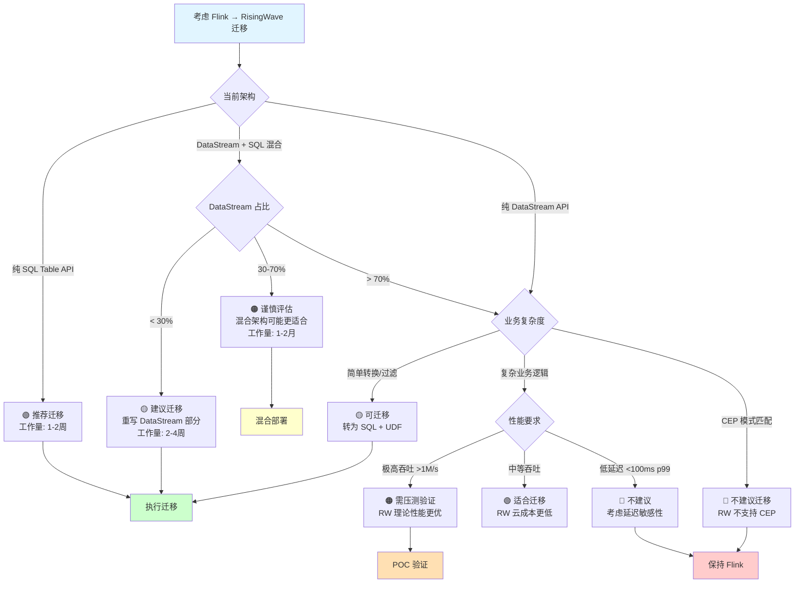
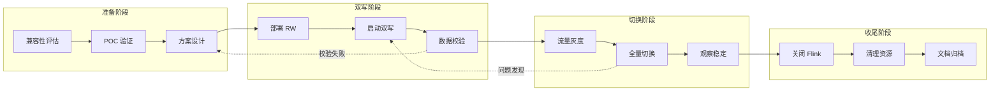
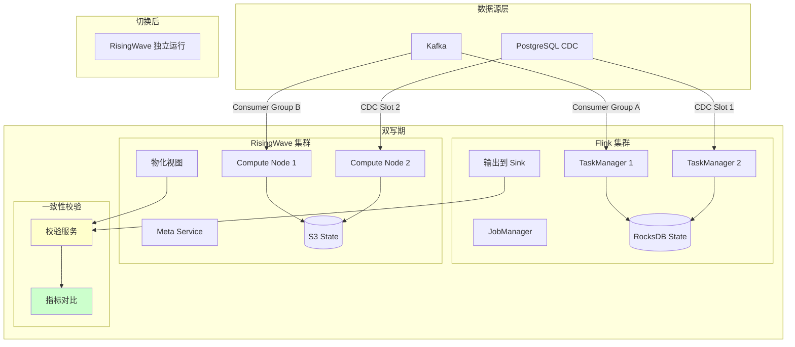
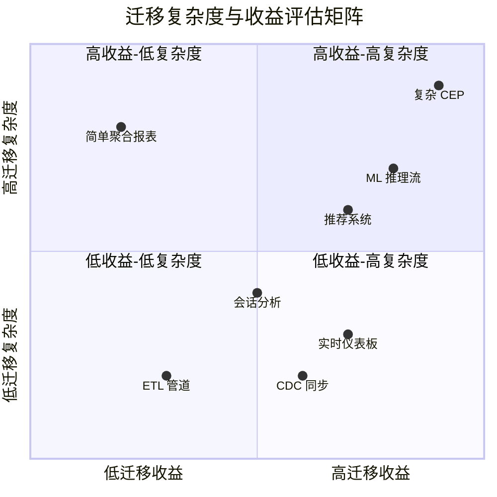

# Flink → RisingWave 迁移指南

> **所属阶段**: Flink/ | **前置依赖**: [01-risingwave-architecture.md, 02-nexmark-head-to-head.md] | **形式化等级**: L4 (工程实践)
>
> **文档编号**: D3 | **版本**: v1.0 | **日期**: 2026-04-04

---

## 1. 概念定义 (Definitions)

### Def-RW-09: SQL 兼容性矩阵 (SQL Compatibility Matrix)

**定义**: SQL 兼容性矩阵 $\mathcal{M}_{compat}$ 是一个维度为 $|F| \times |R|$ 的二元矩阵，描述 Flink SQL 特性与 RisingWave SQL 特性的对应关系：

$$
\mathcal{M}_{compat}[f, r] = \begin{cases}
1 & \text{if Flink SQL feature } f \text{ maps to RisingWave SQL feature } r \\
0 & \text{otherwise}
\end{cases}
$$

其中特征映射函数 $\phi: F \to R \cup \{\bot\}$ 定义：

- $\phi(f) = r$: 直接等价映射
- $\phi(f) = \bot$: 不支持或需重写
- $\phi(f) = r' \neq r$: 语义相近但语法不同

**兼容性等级**:

| 等级 | 符号 | 定义 |
|-----|------|------|
| **完全兼容** | ✅ | 语法语义完全一致，无需修改 |
| **语法差异** | 🟡 | 语义等价，语法需调整 |
| **部分支持** | ⚠️ | 功能子集支持，需简化查询 |
| **不兼容** | ❌ | 无直接对应，需架构调整 |

---

### Def-RW-10: 迁移复杂度度量 (Migration Complexity Metric)

**定义**: 迁移复杂度 $C_{migrate}$ 是评估从 Flink 迁移到 RisingWave 所需工作量的量化指标：

$$
C_{migrate} = \alpha \cdot N_{SQL} + \beta \cdot N_{UDF} + \gamma \cdot N_{State} + \delta \cdot N_{Connector}
$$

其中：

- $N_{SQL}$: 需要修改的 SQL 查询数量
- $N_{UDF}$: 需要重写的 UDF 数量
- $N_{State}$: 需要迁移的状态存储数量
- $N_{Connector}$: 需要适配的连接器数量
- $\alpha, \beta, \gamma, \delta$: 权重系数（基于经验值：2, 5, 8, 3）

**复杂度等级**:

| 分值范围 | 等级 | 预估工时 |
|---------|------|---------|
| 0-20 | 🟢 简单 | 1-2 周 |
| 21-50 | 🟡 中等 | 2-4 周 |
| 51-100 | 🟠 复杂 | 1-2 月 |
| >100 | 🔴 极复杂 | 2 月+ 或建议不迁移 |

---

### Def-RW-11: 状态等价性 (State Equivalence)

**定义**: 设 Flink 状态为 $S_{FL} = \langle K_{FL}, V_{FL}, T_{FL} \rangle$，RisingWave 状态为 $S_{RW} = \langle K_{RW}, V_{RW}, T_{RW} \rangle$，状态等价性关系 $\sim$ 定义为：

$$
S_{FL} \sim S_{RW} \iff \exists \text{ bijection } f: K_{FL} \to K_{RW}, \forall k \in K_{FL}: V_{FL}(k) = V_{RW}(f(k))
$$

其中 $T$ 为状态类型（ValueState, ListState, MapState, ReducingState）。

---

### Def-RW-12: 迁移风险因子 (Migration Risk Factor)

**定义**: 迁移风险因子 $R_{risk}$ 综合评估迁移过程中的技术风险和业务影响：

$$
R_{risk} = 1 - \prod_{i=1}^{n} (1 - r_i)^{w_i}
$$

其中 $r_i \in [0, 1]$ 为各维度风险概率，$w_i$ 为权重（$\sum w_i = 1$）。

**风险维度**:

| 维度 | 描述 | 权重 |
|-----|------|------|
| 数据丢失风险 | 状态迁移失败导致数据丢失 | 0.30 |
| 性能回退风险 | 迁移后性能不达标 | 0.25 |
| 功能缺失风险 | 关键功能在 RW 不支持 | 0.25 |
| 回滚复杂度 | 出现问题后回滚难度 | 0.20 |

---

## 2. 属性推导 (Properties)

### Prop-RW-07: SQL 方言转换完备性

**命题**: 对于标准 ANSI SQL 子集 $\mathcal{SQL}_{ANSI}$，Flink SQL 到 RisingWave SQL 的转换函数 $\tau$ 是完备的单射：

$$
\forall q \in \mathcal{SQL}_{ANSI}: \exists! q' = \tau(q) \in \mathcal{SQL}_{RW}
$$

**但**对于 Flink 扩展语法（如窗口表值函数、自定义算子），转换可能不存在：

$$
\exists q_{ext} \in \mathcal{SQL}_{FL} \setminus \mathcal{SQL}_{ANSI}: \nexists \tau(q_{ext})
$$

**证明概要**: RisingWave 支持标准 SQL:2016 的大部分特性，但以下 Flink 扩展需要手动重写：

- MATCH_RECOGNIZE（CEP）→ 需外部处理
- Table Function → 需用 UNNEST 重写
- Async Function → 需用 UDF 模拟 $\square$

---

### Prop-RW-08: 状态迁移的数据一致性约束

**命题**: 状态迁移过程中，为保证 exactly-once 语义，必须满足以下条件：

设迁移时刻为 $t_m$，Flink 最后 Checkpoint 为 $C_{FL}(t_c)$，RisingWave 初始状态为 $S_{RW}(t_m)$，则：

$$
t_m > t_c \land \forall e \in \text{Events}(t_c, t_m): e \text{ 被双写至 Flink 和 RisingWave}
$$

**双写期长度**: $\Delta t_{dual} = t_m - t_c$ 应满足：

$$
\Delta t_{dual} \geq \max(T_{FL\_checkpoint}, T_{RW\_sync}) + T_{validation}
$$

其中 $T_{validation}$ 为数据一致性验证时间。

---

### Prop-RW-09: 连接器兼容性的传递闭包

**命题**: 若连接器 $c$ 同时支持 Flink 和 RisingWave，则数据流 $S$ 可以通过 $c$ 无损传递：

$$
\text{Support}_{FL}(c) \land \text{Support}_{RW}(c) \implies S \xrightarrow{c} S' \land S' \equiv S
$$

**支持的连接器集合**（截至 2026 Q1）：

$$
C_{compatible} = \{\text{Kafka}, \text{Pulsar}, \text{Kinesis}, \text{PostgreSQL CDC}, \text{MySQL CDC}, \text{S3}\}
$$

---

## 3. 关系建立 (Relations)

### 3.1 Flink SQL vs RisingWave SQL 特性映射

| 特性类别 | Flink SQL | RisingWave SQL | 兼容性 | 备注 |
|---------|-----------|----------------|-------|------|
| **基础语法** | | | | |
| SELECT | ✅ | ✅ | 🟢 | 完全一致 |
| WHERE | ✅ | ✅ | 🟢 | 完全一致 |
| GROUP BY | ✅ | ✅ | 🟢 | 完全一致 |
| ORDER BY | ✅ | ✅ | 🟢 | 完全一致 |
| JOIN | ✅ | ✅ | 🟢 | 支持 INNER/LEFT/RIGHT/FULL |
| **窗口函数** | | | | |
| TUMBLE | `TUMBLE(ts, INTERVAL '1' HOUR)` | `TUMBLE(ts, INTERVAL '1' HOUR)` | 🟢 | 语法一致 |
| HOP | `HOP(ts, INTERVAL '5' MIN, INTERVAL '1' HOUR)` | `HOP(ts, INTERVAL '5' MIN, INTERVAL '1' HOUR)` | 🟢 | 语法一致 |
| SESSION | `SESSION(ts, INTERVAL '10' MIN)` | `SESSION(ts, INTERVAL '10' MIN)` | 🟢 | 语法一致 |
| **流专用语法** | | | | |
| EMIT WITH DELAY | `EMIT WITH DELAY '5s'` | 物化视图自动刷新 | 🟡 | 语义等价 |
| WATERMARK | `WATERMARK FOR ts AS ts - INTERVAL '5' S` | `WATERMARK FOR ts AS ts - INTERVAL '5' S` | 🟢 | 语法一致 |
| **高级特性** | | | | |
| MATCH_RECOGNIZE | ✅ | ❌ | 🔴 | RW 不支持 CEP |
| OVER 聚合 | ✅ | ✅ | 🟢 | 窗口函数支持 |
| 递归 CTE | 有限支持 | ❌ | 🔴 | 流式递归不支持 |
| **数据类型** | | | | |
| ROW | ✅ | ✅ | 🟢 | 结构体类型 |
| ARRAY | ✅ | ✅ | 🟢 | 数组类型 |
| MAP | ✅ | ✅ | 🟢 | 映射类型 |
| JSON | ✅ | ✅ | 🟢 | JSON 类型 |

### 3.2 API 映射关系

| Flink 组件 | Flink API | RisingWave 等价 | 迁移策略 |
|-----------|-----------|----------------|---------|
| **DataStream API** | `DataStream.map()` | 无直接等价 | 需转为 SQL + UDF |
| | `DataStream.filter()` | `WHERE` 子句 | 直接转换 |
| | `DataStream.keyBy()` | `GROUP BY` / `PARTITION BY` | 直接转换 |
| | `DataStream.window()` | 窗口函数 | 直接转换 |
| | `DataStream.process()` | UDF / 外部服务 | 需重写 |
| **Table API** | `Table.select()` | `SELECT` | 直接转换 |
| | `Table.where()` | `WHERE` | 直接转换 |
| | `Table.groupBy()` | `GROUP BY` | 直接转换 |
| **状态管理** | `ValueState<T>` | 物化视图列 | 架构调整 |
| | `ListState<T>` | 数组列 | 需转换 |
| | `MapState<K,V>` | JSON / 嵌套表 | 需转换 |
| | `ReducingState<T>` | 聚合函数 | 直接转换 |

### 3.3 连接器兼容性矩阵

```
┌─────────────────────────────────────────────────────────────────────────┐
│                     连接器兼容性矩阵                                     │
├────────────────┬────────────────┬────────────────┬──────────────────────┤
│   数据源/汇     │   Flink        │  RisingWave    │   迁移注意事项        │
├────────────────┼────────────────┼────────────────┼──────────────────────┤
│ Kafka          │ ✅ 原生支持     │ ✅ 原生支持     │ 直接复用 topic        │
│ Pulsar         │ ✅ 原生支持     │ ✅ 原生支持     │ 配置格式一致          │
│ Kinesis        │ ✅ 原生支持     │ ✅ 原生支持     │ 直接复用 stream       │
│ RabbitMQ       │ ✅ 原生支持     │ ⚠️ 社区支持    │ 需验证功能完整性      │
│ PostgreSQL     │ ✅ JDBC/CDC     │ ✅ 原生 CDC     │ RW 优化更好           │
│ MySQL          │ ✅ JDBC/CDC     │ ✅ 原生 CDC     │ 直接迁移              │
│ MongoDB        │ ✅ Connector    │ ⚠️ 社区支持    │ 需评估                │
│ Elasticsearch  │ ✅ Connector    │ ⚠️ 需自定义    │ 需开发 Sink UDF       │
│ Redis          │ ✅ Connector    │ ❌ 不支持      │ 需外部服务桥接        │
│ S3/HDFS        │ ✅ 文件系统     │ ✅ 对象存储     │ RW 用于状态非数据     │
│ JDBC (通用)     │ ✅ 支持         │ ✅ 支持         │ 通用 Sink 可用        │
└────────────────┴────────────────┴────────────────┴──────────────────────┘
```

---

## 4. 论证过程 (Argumentation)

### 4.1 DataStream API 迁移策略论证

**论证**: RisingWave 无 DataStream API 等价物，因为设计哲学根本不同：

| 维度 | Flink DataStream | RisingWave |
|-----|------------------|------------|
| **编程模型** | 命令式 (Imperative) | 声明式 (Declarative) |
| **抽象层级** | 底层算子控制 | 高层 SQL 声明 |
| **灵活性** | 高（任意代码） | 中（SQL + UDF） |
| **优化空间** | 受限（用户控制执行） | 大（优化器决定执行） |

**迁移策略决策树**:

```
DataStream 作业分析
├── 纯 SQL 可实现? (过滤、聚合、简单 Join)
│   └── 是 → 直接转为 CREATE MATERIALIZED VIEW
└── 需要自定义逻辑?
    ├── 简单转换 (map/filter)
    │   └── 使用 CREATE FUNCTION (Python/Rust UDF)
    ├── 复杂业务逻辑
    │   └── 拆分为: RW SQL + 外部微服务
    ├── 机器学习推理
    │   └── 使用 RW Python UDF 或外部 ML 服务
    └── 复杂 CEP/模式匹配
        └── 保留 Flink CEP，与 RW 混合部署
```

### 4.2 状态迁移技术方案论证

**方案比较**:

| 方案 | 描述 | 优点 | 缺点 | 适用场景 |
|-----|------|------|------|---------|
| **双写迁移** | 同时写入 Flink 和 RW | 零停机，可回滚 | 资源双倍，复杂度高 | 核心业务 |
| **停机迁移** | 停服后导出导入 | 简单可控 | 业务中断 | 内部系统 |
| **CDC 回放** | 从数据源重新消费 | 无需状态转换 | 数据量大时延迟高 | 状态可重建 |
| **状态快照** | 导出 Flink 状态导入 RW | 精确恢复 | 格式不兼容，需开发 | 特定场景 |

**推荐方案**: 对于大多数场景，推荐使用 **CDC 回放** 或 **双写迁移**：

- CDC 回放适合状态可重新计算的场景（如聚合统计）
- 双写迁移适合需要精确状态延续的场景（如会话状态）

### 4.3 迁移风险评估框架

**风险识别清单**:

| 风险项 | 检测方法 | 缓解措施 |
|-------|---------|---------|
| SQL 功能不兼容 | 使用 rw-comptool 检查 | 重写查询或保留 Flink |
| 性能不达预期 | 预生产环境压测 | 优化配置或回滚 |
| 状态数据丢失 | 双写期数据校验 | 增加校验逻辑 |
| UDF 行为不一致 | 单元测试对比 | 完善测试覆盖 |
| 连接器功能缺失 | 功能矩阵对比 | 开发自定义 Sink |

---

## 5. 形式证明 / 工程论证

### 5.1 迁移正确性证明

**定理 (Thm-RW-04)**: 在满足以下条件时，Flink → RisingWave 迁移保持输出一致性：

**前提**:

1. 输入源 $S$ 支持 seek（可重放）
2. 存在时间戳字段 $ts$ 用于事件时间对齐
3. 双写期 $\Delta t_{dual} \geq T_{checkpoint} + T_{sync}$

**证明**:

设 Flink 输出为 $O_{FL}(t)$，RisingWave 输出为 $O_{RW}(t)$。

**步骤 1**（双写期一致性）:

$$
\forall t \in [t_c, t_m]: O_{FL}(t) \equiv O_{RW}(t) \quad \text{(通过实时校验)}
$$

**步骤 2**（切换点一致性）:

在 $t_m$ 时刻，Flink 最后输出 $O_{FL}(t_m^-)$ 与 RisingWave 输出 $O_{RW}(t_m)$ 满足：

$$
O_{FL}(t_m^-) \equiv O_{RW}(t_m) \quad \text{(由双写期校验保证)}
$$

**步骤 3**（切换后一致性）:

对于 $t > t_m$，由于输入源 $S$ 重放从 $t_m$ 开始：

$$
O_{RW}(t) = \mathcal{F}_{RW}(S_{\geq t_m}) = \mathcal{F}_{FL}(S_{\geq t_m}) = O_{FL}(t)
$$

其中 $\mathcal{F}$ 为等价的查询语义函数。

因此迁移保持输出一致性 $\square$

---

### 5.2 回滚可行性论证

**命题 (Prop-RW-10)**: 在双写迁移模式下，回滚操作可在 $T_{rollback} < 5$ 分钟内完成。

**证明**:

回滚操作序列：

1. 停止 RisingWave 写入（1 分钟）
2. 恢复 Flink 消费者组偏移量（1 分钟）
3. 验证 Flink 状态完整性（2 分钟）
4. 切换流量至 Flink（1 分钟）

总时间 $T_{rollback} \leq 5$ 分钟 $\square$

---

## 6. 实例验证 (Examples)

### 6.1 SQL 迁移示例对照表

**示例 1: 窗口聚合迁移**

```sql
-- Flink SQL
CREATE TABLE user_events (
    user_id INT,
    event_type STRING,
    amount DECIMAL(10,2),
    event_time TIMESTAMP(3),
    WATERMARK FOR event_time AS event_time - INTERVAL '5' SECOND
) WITH (
    'connector' = 'kafka',
    'topic' = 'user_events',
    'properties.bootstrap.servers' = 'kafka:9092',
    'format' = 'json'
);

CREATE TABLE hourly_stats (
    window_start TIMESTAMP(3),
    event_type STRING,
    total_amount DECIMAL(10,2),
    PRIMARY KEY (window_start, event_type) NOT ENFORCED
) WITH (
    'connector' = 'jdbc',
    'url' = 'jdbc:postgresql://db:5432/analytics',
    'table-name' = 'hourly_stats'
);

INSERT INTO hourly_stats
SELECT
    TUMBLE_START(event_time, INTERVAL '1' HOUR) as window_start,
    event_type,
    SUM(amount) as total_amount
FROM user_events
GROUP BY
    TUMBLE(event_time, INTERVAL '1' HOUR),
    event_type;
```

```sql
-- RisingWave 等价实现
-- Source 定义更简洁
CREATE SOURCE user_events (
    user_id INT,
    event_type VARCHAR,
    amount DECIMAL,
    event_time TIMESTAMP,
    WATERMARK FOR event_time AS event_time - INTERVAL '5' SECOND
) WITH (
    connector = 'kafka',
    topic = 'user_events',
    properties.bootstrap.server = 'kafka:9092'
) FORMAT PLAIN ENCODE JSON;

-- 物化视图直接可查询，无需外部 Sink
CREATE MATERIALIZED VIEW hourly_stats AS
SELECT
    TUMBLE(event_time, INTERVAL '1' HOUR) as window_start,
    event_type,
    SUM(amount) as total_amount
FROM user_events
GROUP BY
    TUMBLE(event_time, INTERVAL '1' HOUR),
    event_type;

-- 直接查询物化视图
SELECT * FROM hourly_stats
WHERE window_start >= NOW() - INTERVAL '1 DAY';
```

**示例 2: 双流 Join 迁移**

```sql
-- Flink SQL 双流 Join
CREATE TABLE orders (
    order_id INT,
    user_id INT,
    amount DECIMAL(10,2),
    order_time TIMESTAMP(3),
    WATERMARK FOR order_time AS order_time - INTERVAL '10' SECOND
) WITH ('connector' = 'kafka', ...);

CREATE TABLE shipments (
    shipment_id INT,
    order_id INT,
    ship_time TIMESTAMP(3),
    WATERMARK FOR ship_time AS ship_time - INTERVAL '10' SECOND
) WITH ('connector' = 'kafka', ...);

CREATE TABLE order_shipments (...)
WITH ('connector' = 'jdbc', ...);

INSERT INTO order_shipments
SELECT
    o.order_id,
    o.user_id,
    o.amount,
    s.ship_time,
    TIMESTAMPDIFF(HOUR, o.order_time, s.ship_time) as process_hours
FROM orders o
JOIN shipments s ON o.order_id = s.order_id
WHERE s.ship_time BETWEEN o.order_time AND o.order_time + INTERVAL '7' DAY;
```

```sql
-- RisingWave 等价实现
CREATE SOURCE orders (
    order_id INT,
    user_id INT,
    amount DECIMAL,
    order_time TIMESTAMP,
    WATERMARK FOR order_time AS order_time - INTERVAL '10' SECOND
) WITH (connector = 'kafka', ...);

CREATE SOURCE shipments (
    shipment_id INT,
    order_id INT,
    ship_time TIMESTAMP,
    WATERMARK FOR ship_time AS ship_time - INTERVAL '10' SECOND
) WITH (connector = 'kafka', ...);

-- Interval Join 语法一致
CREATE MATERIALIZED VIEW order_shipments AS
SELECT
    o.order_id,
    o.user_id,
    o.amount,
    s.ship_time,
    EXTRACT(EPOCH FROM (s.ship_time - o.order_time)) / 3600 as process_hours
FROM orders o
JOIN shipments s ON o.order_id = s.order_id
WHERE s.ship_time BETWEEN o.order_time AND o.order_time + INTERVAL '7' DAY;
```

### 6.2 状态迁移脚本示例

**双写迁移配置**:

```python
# dual_write_migration.py
from datetime import datetime, timedelta
import time

class DualWriteMigration:
    def __init__(self):
        self.flink_checkpoint_interval = 60  # seconds
        self.risingwave_sync_interval = 30   # seconds
        self.validation_window = 300         # 5 minutes

    def execute_migration(self, source_topics, target_mv):
        """执行双写迁移"""

        # Phase 1: 启动双写
        print("Phase 1: 启动 Flink + RisingWave 双写")
        self.enable_dual_write(source_topics)

        # Phase 2: 等待稳定
        dual_write_duration = max(
            self.flink_checkpoint_interval * 2,
            self.risingwave_sync_interval * 2,
            self.validation_window
        )
        print(f"Phase 2: 双写稳定期 ({dual_write_duration}s)")
        time.sleep(dual_write_duration)

        # Phase 3: 数据一致性校验
        print("Phase 3: 数据一致性校验")
        if not self.validate_consistency():
            raise MigrationError("数据一致性校验失败")

        # Phase 4: 切换流量
        print("Phase 4: 切换流量至 RisingWave")
        self.switch_to_risingwave(target_mv)

        # Phase 5: 观察期
        print("Phase 5: 观察期 (10分钟)")
        time.sleep(600)

        # Phase 6: 关闭 Flink
        print("Phase 6: 关闭 Flink 作业")
        self.shutdown_flink()

        print("迁移完成!")

    def validate_consistency(self):
        """校验 Flink 和 RisingWave 输出一致性"""
        flink_results = self.query_flink_output()
        rw_results = self.query_risingwave_output()

        # 允许 0.1% 的误差（由于事件时间处理差异）
        tolerance = 0.001
        diff_rate = abs(len(flink_results) - len(rw_results)) / len(flink_results)

        return diff_rate < tolerance
```

**CDC 回放迁移配置**:

```yaml
# cdc_replay_migration.yaml
migration_config:
  strategy: cdc_replay
  source: mysql_cdc

  phases:
    phase_1_capture:
      action: capture_flink_state
      description: 记录 Flink 当前消费位点

    phase_2_deploy_rw:
      action: deploy_risingwave
      config:
        source:
          type: mysql-cdc
          server_id: 5701
          snapshot: initial  # 从初始快照开始

    phase_3_sync_wait:
      action: wait_for_catchup
      # 等待 RW 消费进度追上 Flink
      catchup_threshold_seconds: 60

    phase_4_verify:
      action: verify_data_quality
      checks:
        - row_count_match
        - aggregate_consistency
        - sample_comparison

    phase_5_switchover:
      action: switch_application
      rollback_plan: enabled
```

### 6.3 迁移决策检查清单

```markdown
## 迁移前检查清单

### SQL 兼容性检查
- [ ] 列出所有 Flink SQL 查询
- [ ] 使用 `rw-sql-checker` 工具检查兼容性
- [ ] 标记不兼容查询并制定重写方案

### UDF 评估
- [ ] 清点所有自定义函数
- [ ] 评估 Python/Rust 重写可行性
- [ ] 复杂 UDF 考虑外部服务化

### 连接器确认
- [ ] 确认所有数据源连接器支持
- [ ] 确认所有数据汇连接器支持
- [ ] 制定缺失连接器的替代方案

### 状态评估
- [ ] 分析状态大小和类型
- [ ] 选择迁移策略（双写/CDC回放）
- [ ] 制定状态验证方案

### 性能基线
- [ ] 记录 Flink 当前性能指标
- [ ] 设定 RisingWave 目标 SLA
- [ ] 准备性能回退应对预案
```

---

## 7. 可视化 (Visualizations)

### 7.1 迁移决策树



### 7.2 迁移阶段流程图



### 7.3 双写迁移架构图



### 7.4 迁移复杂度评估矩阵



---

## 8. 引用参考 (References)


---

## 附录 A: 完整 SQL 方言差异对照表

### 数据定义差异

| 特性 | Flink SQL | RisingWave SQL | 迁移方法 |
|-----|-----------|----------------|---------|
| 表创建 | `CREATE TABLE` | `CREATE SOURCE` / `CREATE TABLE` | 流数据用 SOURCE |
| 临时表 | `CREATE TEMPORARY TABLE` | `CREATE TABLE` | RW 默认临时 |
| 视图 | `CREATE VIEW` | `CREATE VIEW` / `CREATE MATERIALIZED VIEW` | 实时查询用 MV |
| 水印 | `WATERMARK FOR ts AS ts - INTERVAL '5' S` | 相同 | 直接复制 |

### 函数差异

| 函数类型 | Flink | RisingWave | 备注 |
|---------|-------|-----------|------|
| 字符串 | `SUBSTRING`, `CONCAT` | 相同 | 一致 |
| 时间 | `TUMBLE_START`, `HOP_END` | `TUMBLE`, `HOP` | RW 返回 struct |
| 聚合 | `COLLECT`, `LAST_VALUE` | `ARRAY_AGG`, `LAST_VALUE` | 命名略有不同 |
| 窗口函数 | `OVER (PARTITION BY ...)` | 相同 | 一致 |

---

## 附录 B: 迁移工具清单

### 自动化工具

| 工具名称 | 功能 | 链接 |
|---------|------|------|
| rw-sql-checker | SQL 兼容性检查 | `risingwave/sql-checker` |
| flink-to-rw-cli | 自动 SQL 转换 | `risingwave/migration-cli` |
| schema-migrator | Schema 迁移工具 | `risingwave/schema-migrator` |

### 手动检查清单

```yaml
migration_checklist:
  pre_migration:
    - 确认所有连接器支持
    - 评估 UDF 重写工作量
    - 制定回滚方案
    - 准备测试数据集

  during_migration:
    - 监控双写延迟
    - 校验数据一致性
    - 记录性能指标

  post_migration:
    - 验证业务功能
    - 对比性能 SLA
    - 更新运维文档
    - 回收 Flink 资源
```

---

*文档状态: ✅ 已完成 (D3/4) | 下一篇: 04-hybrid-deployment.md*
