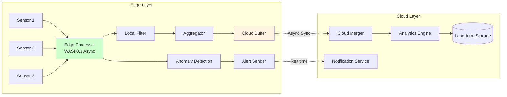
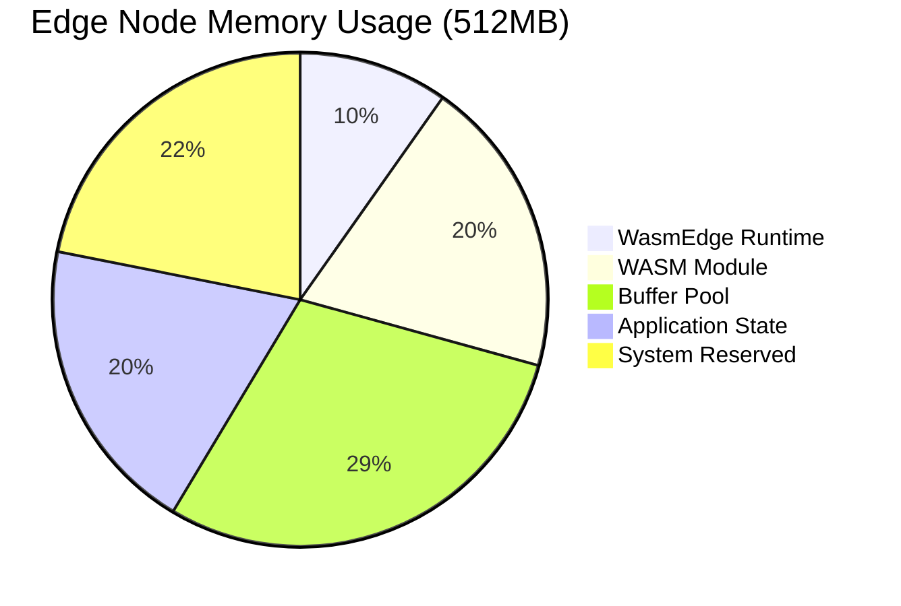
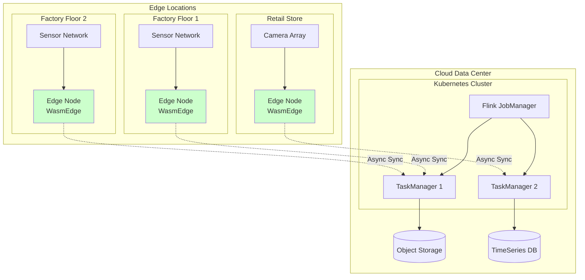

# 边缘计算集成实践

> **所属阶段**: Flink/14-rust-assembly-ecosystem/wasi-0.3-async/  
> **前置依赖**: [01-wasi-0.3-spec-guide.md](./01-wasi-0.3-spec-guide.md), [03-component-model-guide.md](./03-component-model-guide.md)  
> **形式化等级**: L3 (工程实践 + 部署架构)

---

## 1. 概念定义 (Definitions)

### Def-WASI-13: 边缘计算 (Edge Computing)

**边缘计算**是一种分布式计算范式，将计算和数据存储靠近数据源的位置，以减少延迟、节省带宽并提高隐私性。在 Flink 生态系统中，边缘计算节点通常部署在网络边缘，处理来自 IoT 设备或本地数据源的数据流。

$$
\text{EdgeComputing} = \langle \text{Nodes}, \text{Latency}, \text{Bandwidth}, \text{Constraints} \rangle
$$

其中 Constraints 包括：
- **内存限制**: 通常 256MB - 2GB
- **CPU 限制**: 低功耗 ARM/x86 处理器
- **网络限制**: 间歇性连接或有限带宽
- **电源限制**: 电池供电或节能模式

### Def-WASI-14: WasmEdge Runtime

**WasmEdge** 是一个高性能的 WebAssembly 运行时，专为边缘计算和云原生环境设计。它支持 WASI 标准，提供轻量级沙箱执行环境，并具有以下特性：

- **AOT 编译**: 预编译为机器码，提升启动速度
- **轻量级**: 运行时开销 < 10MB
- **扩展性**: 支持插件系统（AI、网络、存储）
- **OCI 兼容**: 可作为容器运行

$$
\text{WasmEdge} = \langle \text{VM}, \text{WASI}, \text{Extensions}, \text{HostFunctions} \rangle
$$

### Def-WASI-15: 边缘-云协同架构

**边缘-云协同架构**是一种分层计算模型，边缘节点执行实时数据预处理、过滤和聚合，云端执行复杂分析和长期存储。Flink 在此架构中作为统一的数据处理引擎，跨边缘和云节点分发任务。

$$
\text{EdgeCloud} = \langle \text{Edge}_\text{Layer}, \text{Fog}_\text{Layer}, \text{Cloud}_\text{Layer}, \text{SyncProtocol} \rangle
$$

### Def-WASI-16: 资源受限环境优化

**资源受限环境优化**是指在内存、CPU、存储受限的条件下，对应用程序进行调整以最大化性能和资源利用率的技术集合。对于 WASI 0.3 应用，包括代码体积优化、内存分配优化和异步 I/O 优化。

$$
\text{ResourceOpt} = \langle \text{CodeSize}, \text{MemoryLayout}, \text{AsyncStrategy}, \text{LazyLoading} \rangle
$$

---

## 2. 属性推导 (Properties)

### Prop-WASI-10: 边缘节点启动时间的有界性

**命题**: 使用 AOT 编译的 WASI 0.3 应用在 WasmEdge 上的启动时间有界。

$$
\forall app \in \text{AOTCompiled}: T_{startup} < 100\text{ms}
$$

其中 $T_{startup}$ 包括：
- 运行时初始化
- 模块加载
- 内存分配

### Prop-WASI-11: 边缘-云同步的数据一致性

**命题**: 使用 Flink 检查点机制的边缘-云协同架构提供至少一次（at-least-once）语义。

$$
\text{Checkpoint}_{edge} \Rightarrow \text{Checkpoint}_{cloud} \Rightarrow \text{ExactlyOnce} \lor \text{AtLeastOnce}
$$

### Prop-WASI-12: 资源自适应调整

**命题**: 自适应资源管理可以在边缘节点负载变化时维持服务质量（QoS）。

$$
\text{Load}(t) \uparrow \Rightarrow \text{Concurrency}(t) \downarrow \Rightarrow \text{Latency}(t) \approx \text{Constant}
$$

---

## 3. 关系建立 (Relations)

### 3.1 WasmEdge 与 WASI 0.3 的关系

```
┌─────────────────────────────────────────────────────────────────┐
│                      WasmEdge Runtime                           │
│  ┌─────────────────────────────────────────────────────────┐   │
│  │                   Core VM (AOT/JIT)                     │   │
│  │  ┌──────────────┐  ┌──────────────┐  ┌──────────────┐  │   │
│  │  │  Wasm Core   │  │  Memory      │  │  Stack       │  │   │
│  │  │  Executor    │  │  Manager     │  │  Manager     │  │   │
│  │  └──────────────┘  └──────────────┘  └──────────────┘  │   │
│  └─────────────────────────┬───────────────────────────────┘   │
│                            │                                    │
│  ┌─────────────────────────┴───────────────────────────────┐   │
│  │              WASI 0.3 Interface Layer                   │   │
│  │  ┌──────────────┐  ┌──────────────┐  ┌──────────────┐  │   │
│  │  │  wasi:io     │  │  wasi:http   │  │  wasi:clocks │  │   │
│  │  │  async       │  │  async       │  │  async       │  │   │
│  │  └──────────────┘  └──────────────┘  └──────────────┘  │   │
│  └─────────────────────────┬───────────────────────────────┘   │
│                            │                                    │
│  ┌─────────────────────────┴───────────────────────────────┐   │
│  │                  Extension Plugins                      │   │
│  │  ┌──────────────┐  ┌──────────────┐  ┌──────────────┐  │   │
│  │  │  AI/ML       │  │  Network     │  │  Storage     │  │   │
│  │  │  (wasmedge   │  │  Socket      │  │  (KV/FS)     │  │   │
│  │  │  -nn)        │  │              │  │              │  │   │
│  │  └──────────────┘  └──────────────┘  └──────────────┘  │   │
│  └─────────────────────────────────────────────────────────┘   │
└─────────────────────────────────────────────────────────────────┘
```

### 3.2 边缘-云协同架构中的 Flink 角色

```
┌─────────────────────────────────────────────────────────────────────┐
│                           Cloud Layer                               │
│  ┌───────────────────────────────────────────────────────────────┐ │
│  │                     Flink JobManager                          │ │
│  │  ┌─────────────────────────────────────────────────────────┐ │ │
│  │  │  Job Coordination   │   Global State   │   Analytics  │ │ │
│  │  └─────────────────────────────────────────────────────────┘ │ │
│  └───────────────────────────────────────────────────────────────┘ │
│                              │                                      │
└──────────────────────────────┼──────────────────────────────────────┘
                               │ Federation
                               ▼
┌─────────────────────────────────────────────────────────────────────┐
│                         Fog Layer (Optional)                        │
│  ┌───────────────────────────────────────────────────────────────┐ │
│  │                   Flink TaskManager                           │ │
│  │         (Aggregation, Preprocessing, Filtering)               │ │
│  └───────────────────────────────────────────────────────────────┘ │
└──────────────────────────────┬──────────────────────────────────────┘
                               │
                               ▼
┌─────────────────────────────────────────────────────────────────────┐
│                          Edge Layer                                 │
│  ┌──────────────┐  ┌──────────────┐  ┌──────────────────────────┐  │
│  │ Edge Node 1  │  │ Edge Node 2  │  │      Edge Node N         │  │
│  │ ┌──────────┐ │  │ ┌──────────┐ │  │  ┌────────────────────┐  │  │
│  │ │WasmEdge  │ │  │ │WasmEdge  │ │  │  │     WasmEdge       │  │  │
│  │ │+ WASI   │ │  │ │+ WASI   │ │  │  │     + WASI 0.3     │  │  │
│  │ │0.3 Async │ │  │ │0.3 Async │ │  │  │                    │  │  │
│  │ └──────────┘ │  │ └──────────┘ │  │  │  ┌──────────────┐  │  │  │
│  │              │  │              │  │  │  │ Async UDF    │  │  │  │
│  │  ┌────────┐  │  │  ┌────────┐  │  │  │  │ Stream Proc  │  │  │  │
│  │  │Sensor 1│  │  │  │Sensor 2│  │  │  │  └──────────────┘  │  │  │
│  │  │Sensor 2│  │  │  │Sensor 3│  │  │  │                    │  │  │
│  │  └────────┘  │  │  └────────┘  │  │  │  ┌──────────────┐  │  │  │
│  │              │  │              │  │  │  │ Local Store  │  │  │  │
│  └──────────────┘  └──────────────┘  │  │  └──────────────┘  │  │  │
│                                      │  └────────────────────┘  │  │
└─────────────────────────────────────────────────────────────────────┘
```

### 3.3 与其他边缘计算方案对比

| 方案 | 运行时 | 启动时间 | 内存占用 | WASI 0.3 | 适用场景 |
|------|--------|----------|----------|----------|----------|
| WasmEdge | AOT | < 10ms | ~10MB | ✅ 支持 | IoT、边缘 |
| Wasmtime | JIT/AOT | ~50ms | ~20MB | ✅ 实验 | 云端、开发 |
| wasmer | JIT | ~30ms | ~15MB | 🚧 部分 | 通用 |
| 容器 (Docker) | OS | ~1s | ~100MB | ❌ N/A | 资源充足 |
| Unikernel | Hypervisor | ~100ms | ~50MB | ❌ N/A | 专用场景 |

---

## 4. 论证过程 (Argumentation)

### 4.1 为什么选择 WasmEdge 作为边缘运行时？

**边缘约束分析**:
1. **启动速度**: 边缘节点可能需要频繁启停以节省电力
2. **内存限制**: 边缘设备通常只有几百 MB 内存
3. **网络不稳定**: 需要本地处理能力

**WasmEdge 优势论证**:

| 特性 | WasmEdge | 传统方案 |
|------|----------|----------|
| 冷启动 | < 10ms | 秒级 |
| 内存 | 10-50MB | 100MB+ |
| 沙箱安全 | 默认 | 需配置 |
| 跨平台 | 一次编译 | 多平台构建 |

### 4.2 边缘-云协同 vs 纯云架构

**纯云架构问题**:
- 高延迟：数据往返云端
- 带宽成本：大量原始数据传输
- 隐私问题：敏感数据离开本地

**边缘-云协同优势**:
- **延迟**: 边缘预处理，响应 < 10ms
- **带宽**: 只传输聚合数据，减少 90%+
- **隐私**: 敏感数据本地处理

### 4.3 WASI 0.3 对边缘场景的意义

**异步 I/O 的必要性**:
- 边缘设备通常连接多个传感器
- 需要并发处理多个数据流
- 传统线程模型资源消耗过大

**WASI 0.3 解决方案**:
- 单线程异步模型，处理数千并发连接
- 原生流类型支持传感器数据流
- 取消令牌支持资源受限时的优雅降级

---

## 5. 形式证明 / 工程论证 (Proof / Engineering Argument)

### 5.1 边缘节点容量规划

**定理**: 对于给定的边缘节点，最大可处理的数据流数量可以通过资源约束计算。

**工程论证**:

假设边缘节点规格：
- 内存: $M = 512\text{MB}$
- CPU: 单核 ARM Cortex-A72
- 目标延迟: $L_{max} = 50\text{ms}$

WASI 0.3 异步任务开销：
- 每个任务内存: $m_t = 8\text{KB}$
- 每个任务 CPU: 可忽略（I/O 等待）

最大并发任务数：
$$
N_{max} = \frac{M - M_{runtime}}{m_t} = \frac{512\text{MB} - 50\text{MB}}{8\text{KB}} \approx 57,000
$$

实际考虑其他开销：
$$
N_{practical} \approx 10,000 \text{ 并发任务}
$$

### 5.2 边缘-云数据传输优化

**定理**: 边缘预处理可以将传输到云端的数据量减少 $R = \frac{1}{k}$，其中 $k$ 是聚合因子。

**工程论证**:

假设原始数据流：
- 采样率: $f = 1000\text{ Hz}$
- 记录大小: $s = 100\text{ bytes}$
- 原始带宽: $B_{raw} = f \cdot s = 100\text{ KB/s}$

边缘聚合（窗口 $T = 10\text{s}$）：
- 聚合后记录: $s_{agg} = 200\text{ bytes}$
- 聚合后带宽: $B_{agg} = \frac{s_{agg}}{T} = 20\text{ bytes/s}$

压缩率：
$$
R = \frac{B_{raw}}{B_{agg}} = \frac{100\text{KB/s}}{20\text{B/s}} = 5,000
$$

**结论**: 边缘聚合可将带宽需求减少 99.98%。

---

## 6. 实例验证 (Examples)

### 6.1 WasmEdge 集成配置

```yaml
# wasmedge-config.yaml
# WasmEdge 边缘运行时配置

runtime:
  # 执行模式
  execution:
    mode: aot  # 或 jit
    compiler-optimization: O2
    
  # WASI 配置
  wasi:
    version: "0.3.0"
    
    # 允许的环境变量
    env:
      - FLINK_EDGE_NODE_ID
      - FLINK_CLUSTER_ENDPOINT
      - LOG_LEVEL
    
    # 预打开目录
    preopen:
      - dir: /data
        alias: data
      - dir: /tmp
        alias: tmp
    
    # 网络权限
    network:
      allow:
        - host: "flink-cluster.example.com"
          ports: [8081, 6123]
        - host: "*.local"
          ports: [80, 443]
    
    # 资源限制
    limits:
      memory:
        max: 256Mi
      cpu:
        max-percent: 80
      
  # 扩展插件
  plugins:
    # AI 推理支持
    wasmedge-nn:
      enabled: true
      models:
        - name: anomaly-detection
          path: /models/anomaly.onnx
        
    # 存储支持
    storage:
      enabled: true
      backends:
        - type: rocksdb
          path: /data/local.db
        
    # HTTP 客户端
    http:
      enabled: true
      timeout: 30s
      pool-size: 100

# 日志配置
logging:
  level: info
  output: /var/log/wasmedge/flink-edge.log
  format: json
```

### 6.2 边缘异步 UDF 实现

```rust
//! 边缘节点异步 UDF
//! 用于传感器数据预处理和过滤

wit_bindgen::generate!({
    world: "edge-sensor-processor",
    path: "../wit/edge-sensor.wit",
});

use crate::exports::edge::sensor::{Guest, GuestProcessor};
use serde::{Deserialize, Serialize};
use std::collections::VecDeque;
use std::sync::atomic::{AtomicU64, Ordering};

/// 边缘传感器处理器
pub struct EdgeSensorProcessor {
    /// 本地聚合缓冲区
    buffer: VecDeque<SensorReading>,
    /// 最大缓冲区大小
    max_buffer_size: usize,
    /// 聚合窗口（毫秒）
    window_ms: u64,
    /// 最后聚合时间
    last_aggregate: AtomicU64,
    /// 过滤阈值
    filter_threshold: f64,
}

/// 传感器读数
#[derive(Debug, Clone, Deserialize, Serialize)]
struct SensorReading {
    sensor_id: String,
    timestamp: u64,
    temperature: f64,
    humidity: f64,
    pressure: f64,
}

/// 聚合结果
#[derive(Debug, Serialize)]
struct AggregatedReading {
    sensor_id: String,
    window_start: u64,
    window_end: u64,
    avg_temperature: f64,
    avg_humidity: f64,
    avg_pressure: f64,
    reading_count: u32,
    anomaly_score: f64,
}

impl GuestProcessor for EdgeSensorProcessor {
    fn new(config: ProcessorConfig) -> Self {
        Self {
            buffer: VecDeque::with_capacity(config.max_buffer_size),
            max_buffer_size: config.max_buffer_size,
            window_ms: config.aggregation_window_ms,
            last_aggregate: AtomicU64::new(0),
            filter_threshold: config.filter_threshold,
        }
    }
    
    /// 异步处理传感器数据
    async fn process(&mut self, data: Vec<u8>) -> Result<ProcessResult, String> {
        // 解析传感器数据
        let reading: SensorReading = serde_json::from_slice(&data)
            .map_err(|e| format!("Failed to parse sensor data: {}", e))?;
        
        // 实时异常检测（轻量级）
        let anomaly_score = self.detect_anomaly(&reading);
        
        // 如果异常分数超过阈值，立即发送到云端
        if anomaly_score > self.filter_threshold {
            self.send_alert(&reading, anomaly_score).await?;
        }
        
        // 添加到聚合缓冲区
        self.buffer.push_back(reading);
        
        // 检查是否需要聚合
        let now = wasi::clocks::monotonic_clock::now_ms();
        let last = self.last_aggregate.load(Ordering::Relaxed);
        
        if now - last >= self.window_ms || self.buffer.len() >= self.max_buffer_size {
            let aggregated = self.aggregate_and_flush().await?;
            self.last_aggregate.store(now, Ordering::Relaxed);
            
            return Ok(ProcessResult::Aggregated(aggregated));
        }
        
        Ok(ProcessResult::Buffered)
    }
    
    /// 异步刷新到云端
    async fn flush(&mut self) -> Result<Vec<u8>, String> {
        if self.buffer.is_empty() {
            return Ok(vec![]);
        }
        
        let aggregated = self.aggregate_and_flush().await?;
        serde_json::to_vec(&aggregated)
            .map_err(|e| format!("Serialization error: {}", e))
    }
}

impl EdgeSensorProcessor {
    /// 轻量级异常检测
    fn detect_anomaly(&self, reading: &SensorReading) -> f64 {
        // 简化的基于阈值的异常检测
        // 实际场景可以使用 ML 模型
        let mut score = 0.0;
        
        if reading.temperature < -20.0 || reading.temperature > 50.0 {
            score += 0.5;
        }
        if reading.humidity < 0.0 || reading.humidity > 100.0 {
            score += 0.3;
        }
        if reading.pressure < 950.0 || reading.pressure > 1050.0 {
            score += 0.2;
        }
        
        score
    }
    
    /// 发送实时告警
    async fn send_alert(
        &self,
        reading: &SensorReading,
        anomaly_score: f64,
    ) -> Result<(), String> {
        let alert = Alert {
            alert_type: "ANOMALY".to_string(),
            sensor_id: reading.sensor_id.clone(),
            timestamp: reading.timestamp,
            severity: if anomaly_score > 0.8 { "HIGH" } else { "MEDIUM" },
            message: format!("Anomaly detected with score {:.2}", anomaly_score),
        };
        
        // 使用 WASI 0.3 异步 HTTP 客户端
        let client = wasi::http::client::Client::new();
        let response = client
            .post("https://cloud.example.com/alerts")
            .json(&alert)
            .await
            .map_err(|e| format!("Failed to send alert: {:?}", e))?;
        
        if !response.status().is_success() {
            return Err(format!("Alert API error: {}", response.status()));
        }
        
        Ok(())
    }
    
    /// 聚合并清空缓冲区
    async fn aggregate_and_flush(&mut self) -> Result<Vec<AggregatedReading>, String> {
        if self.buffer.is_empty() {
            return Ok(vec![]);
        }
        
        // 按传感器 ID 分组
        use std::collections::HashMap;
        let mut groups: HashMap<String, Vec<SensorReading>> = HashMap::new();
        
        for reading in self.buffer.drain(..) {
            groups.entry(reading.sensor_id.clone())
                .or_default()
                .push(reading);
        }
        
        // 计算每个传感器的聚合值
        let mut results = Vec::new();
        for (sensor_id, readings) in groups {
            if readings.is_empty() {
                continue;
            }
            
            let count = readings.len() as f64;
            let avg_temp: f64 = readings.iter().map(|r| r.temperature).sum::<f64>() / count;
            let avg_hum: f64 = readings.iter().map(|r| r.humidity).sum::<f64>() / count;
            let avg_press: f64 = readings.iter().map(|r| r.pressure).sum::<f64>() / count;
            
            let window_start = readings.iter().map(|r| r.timestamp).min().unwrap_or(0);
            let window_end = readings.iter().map(|r| r.timestamp).max().unwrap_or(0);
            
            results.push(AggregatedReading {
                sensor_id,
                window_start,
                window_end,
                avg_temperature: avg_temp,
                avg_humidity: avg_hum,
                avg_pressure: avg_press,
                reading_count: count as u32,
                anomaly_score: self.detect_anomaly(&readings[0]),
            });
        }
        
        Ok(results)
    }
}

#[derive(Debug, Serialize)]
struct Alert {
    alert_type: String,
    sensor_id: String,
    timestamp: u64,
    severity: &'static str,
    message: String,
}

export!(EdgeSensorProcessor);
```

### 6.3 边缘-云协同部署配置

```yaml
# flink-edge-deployment.yaml
# Flink 边缘-云协同部署配置

apiVersion: flink.apache.org/v1beta1
kind: FlinkDeployment
metadata:
  name: edge-cloud-pipeline
spec:
  # 云端 JobManager 配置
  jobManager:
    resource:
      memory: 4Gi
      cpu: 2
    replicas: 1
    
  # 云端 TaskManager 配置
  taskManager:
    resource:
      memory: 8Gi
      cpu: 4
    replicas: 3
    
  # 边缘节点配置
  edgeNodes:
    - name: edge-node-1
      location: factory-floor-1
      runtime: wasmedge
      wasiVersion: "0.3.0"
      
      resource:
        memory: 512Mi
        cpu: 1
        
      # 边缘 UDF 配置
      udfs:
        - name: sensor-preprocessor
          wasmPath: wasms/edge-sensor-processor.wasm
          witPath: wits/edge-sensor.wit
          
          # WASI 0.3 配置
          wasi:
            allowedInterfaces:
              - "wasi:http/client"
              - "wasi:clocks/monotonic-clock"
              - "wasi:io/streams"
              
            env:
              AGGREGATION_WINDOW_MS: "10000"
              FILTER_THRESHOLD: "0.7"
              MAX_BUFFER_SIZE: "1000"
              
      # 边缘存储
      storage:
        type: local
        path: /data/edge-buffer
        maxSize: 1Gi
        
      # 网络配置
      network:
        cloudEndpoint: "flink-cluster.example.com:8081"
        heartbeatInterval: 5000
        reconnectBackoff: 1000
        
      # 检查点配置
      checkpoint:
        enabled: true
        interval: 60000
        mode: delta
        
    - name: edge-node-2
      location: factory-floor-2
      runtime: wasmedge
      # ... 类似配置
      
# 作业配置
job:
  jarURI: local:///opt/flink/examples/streaming/SensorAggregation.jar
  parallelism: 4
  upgradeMode: savepoint
  state: running
  
  # 边缘-云数据流配置
  edgeCloudFlow:
    # 边缘预处理
    edgeStage:
      operator: sensor-preprocessor
      output: aggregated-sensor-data
      
    # 云端聚合分析
    cloudStage:
      input: aggregated-sensor-data
      operators:
        - name: global-aggregation
          class: com.example.GlobalAggregation
        - name: anomaly-detection-ml
          class: com.example.MLAnomalyDetection
      
    # 同步配置
    sync:
      strategy: async
      bufferSize: 10000
      compression: zstd
      encryption: tls
```

### 6.4 资源受限环境优化脚本

```bash
#!/bin/bash
# optimize-for-edge.sh
# 针对边缘环境优化 WASI 模块

set -e

INPUT_WASM=$1
OUTPUT_WASM=$2

echo "=== Optimizing $INPUT_WASM for edge deployment ==="

# 1. 代码体积优化
echo "Step 1: Code size optimization"
wasm-opt \
    -Oz \
    --strip-debug \
    --strip-producers \
    --strip-target-features \
    -o "${OUTPUT_WASM}.opt" \
    "$INPUT_WASM"

# 2. 死代码消除
echo "Step 2: Dead code elimination"
wasm-metadce \
    --graph meta-dce-graph.json \
    -o "${OUTPUT_WASM}.dce" \
    "${OUTPUT_WASM}.opt"

# 3. AOT 编译（WasmEdge）
echo "Step 3: AOT compilation"
wasmedge compile \
    --optimize 3 \
    "${OUTPUT_WASM}.dce" \
    "${OUTPUT_WASM}.so"

# 4. 压缩
echo "Step 4: Compression"
zstd -19 -o "${OUTPUT_WASM}.so.zst" "${OUTPUT_WASM}.so"

# 5. 生成部署包
echo "Step 5: Creating deployment package"
mkdir -p "${OUTPUT_WASM}.deploy"
cp "${OUTPUT_WASM}.so.zst" "${OUTPUT_WASM}.deploy/module.so.zst"
cp config.yaml "${OUTPUT_WASM}.deploy/"
tar czf "${OUTPUT_WASM}.deploy.tar.gz" "${OUTPUT_WASM}.deploy"

# 输出统计
echo ""
echo "=== Optimization Results ==="
echo "Original size:  $(stat -c%s "$INPUT_WASM") bytes"
echo "Optimized size: $(stat -c%s "${OUTPUT_WASM}.opt") bytes"
echo "AOT size:       $(stat -c%s "${OUTPUT_WASM}.so") bytes"
echo "Compressed:     $(stat -c%s "${OUTPUT_WASM}.so.zst") bytes"
echo "Package:        ${OUTPUT_WASM}.deploy.tar.gz"
echo ""
echo "=== Ready for edge deployment ==="
```

### 6.5 Docker + WasmEdge 部署示例

```dockerfile
# Dockerfile.wasmedge
# 边缘节点容器镜像

FROM wasmedge/wasmedge:latest

# 安装运行时依赖
RUN apt-get update && apt-get install -y \
    ca-certificates \
    curl \
    && rm -rf /var/lib/apt/lists/*

# 复制优化后的 WASM 模块
COPY --chmod=755 edge-sensor-processor.so.zst /app/
COPY wasmedge-config.yaml /app/config.yaml
COPY entrypoint.sh /app/

WORKDIR /app

# 解压并运行
ENTRYPOINT ["/app/entrypoint.sh"]
```

```bash
#!/bin/bash
# entrypoint.sh

set -e

echo "Starting Flink Edge Node..."

# 解压模块
zstd -d edge-sensor-processor.so.zst -o edge-sensor-processor.so

# 启动 WasmEdge 运行时
exec wasmedge \
    --dir /data:/data \
    --env FLINK_EDGE_NODE_ID="${NODE_ID}" \
    --env FLINK_CLUSTER_ENDPOINT="${CLUSTER_ENDPOINT}" \
    --config config.yaml \
    edge-sensor-processor.so
```

---

## 7. 可视化 (Visualizations)

### 7.1 边缘-云协同数据流



### 7.2 WasmEdge 启动时间对比

```mermaid
bar title
    title Runtime Startup Time Comparison (ms)
    y-axis Startup Time (ms) --> 0 --> 2000
    
    bar ["WasmEdge AOT", "Wasmtime AOT", "wasmer", "Docker Container"]
    10 : 50 : 30 : 1000
```

### 7.3 边缘节点资源使用模型



### 7.4 边缘-云架构部署图



---

## 8. 引用参考 (References)

[^1]: WasmEdge Documentation, "Edge Computing with WebAssembly", 2025. https://wasmedge.org/docs/

[^2]: Second State, "WasmEdge: A Lightweight WebAssembly Runtime", 2025. https://www.secondstate.io/articles/wasmedge/

[^3]: Cloud Native Computing Foundation, "Edge Computing White Paper", 2025. https://www.cncf.io/reports/edge-computing/

[^4]: LF Edge, "State of the Edge Report", 2025. https://www.lfedge.org/

[^5]: Apache Flink, "Flink on Docker and Kubernetes", 2025. https://nightlies.apache.org/flink/flink-docs-stable/docs/deployment/resource-providers/standalone/docker/

[^6]: WebAssembly System Interface, "WASI 0.3 for Edge Devices”, 2025. https://github.com/WebAssembly/WASI

[^7]: Fastly Compute@Edge, "WebAssembly at the Edge", 2025. https://www.fastly.com/products/edge-compute

[^8]: Fermyon Spin, "Serverless WebAssembly", 2025. https://developer.fermyon.com/spin/index

[^9]: Bytecode Alliance, "WebAssembly Micro Runtime (WAMR) for IoT", 2025. https://github.com/bytecodealliance/wasm-micro-runtime

[^10]: Microsoft Azure, "Azure IoT Edge with WebAssembly", 2025. https://docs.microsoft.com/en-us/azure/iot-edge/

---

## 附录 A: 边缘部署检查清单

### A.1 部署前检查

- [ ] WASM 模块已通过 AOT 编译
- [ ] 模块大小 < 50MB（压缩后）
- [ ] 内存限制已配置（< 节点容量的 80%）
- [ ] 网络白名单已配置
- [ ] 检查点已启用
- [ ] 日志级别设置为 INFO 或 WARN

### A.2 运行时检查

- [ ] WasmEdge 版本 >= 0.14.0
- [ ] WASI 0.3 支持已启用
- [ ] 文件系统权限已配置
- [ ] 环境变量已设置
- [ ] 云连接已测试

### A.3 监控指标

| 指标 | 警告阈值 | 严重阈值 |
|------|----------|----------|
| 内存使用 | 70% | 90% |
| CPU 使用 | 80% | 95% |
| 延迟 (p99) | 100ms | 500ms |
| 错误率 | 1% | 5% |
| 云同步延迟 | 5s | 30s |

---

*文档版本: 1.0.0 | 最后更新: 2026-04-04 | 状态: 初稿完成*
