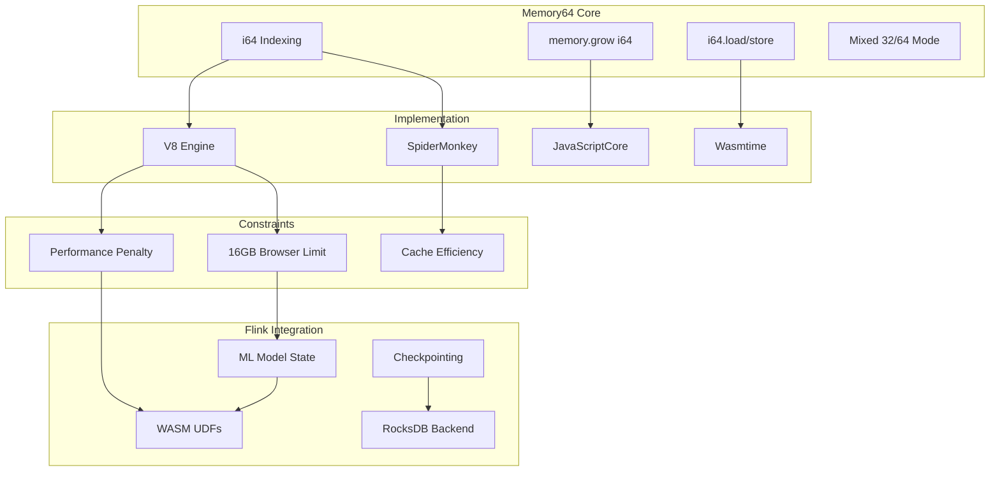
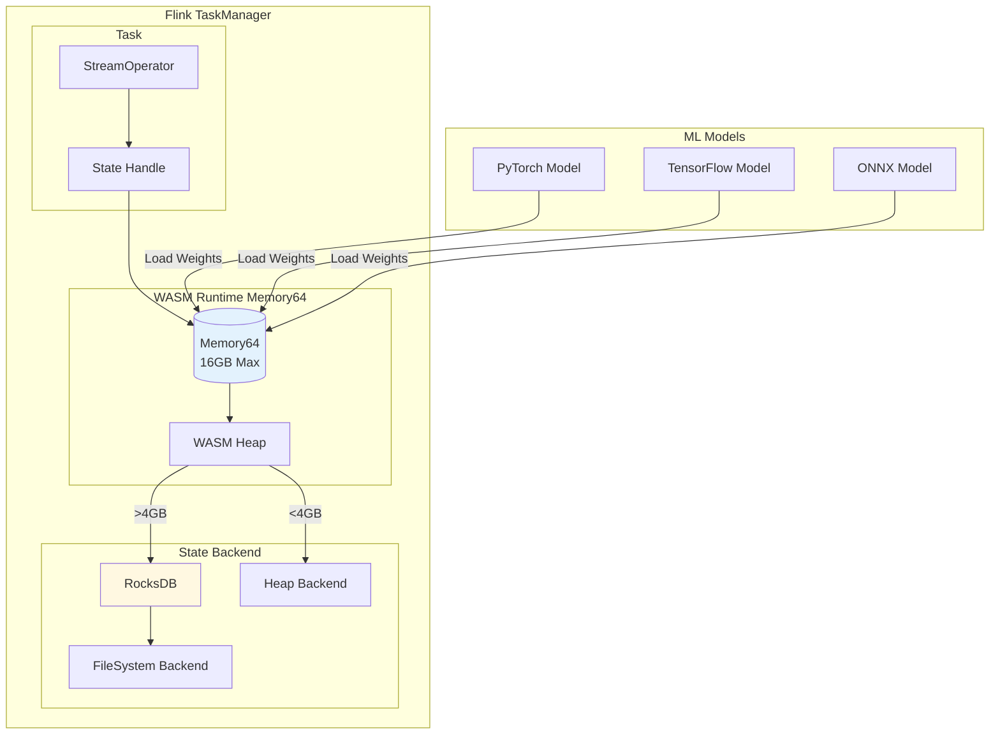
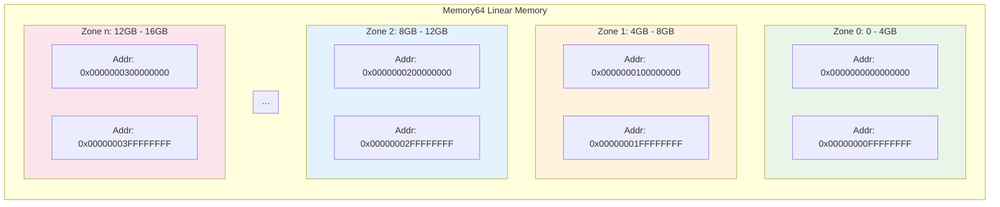
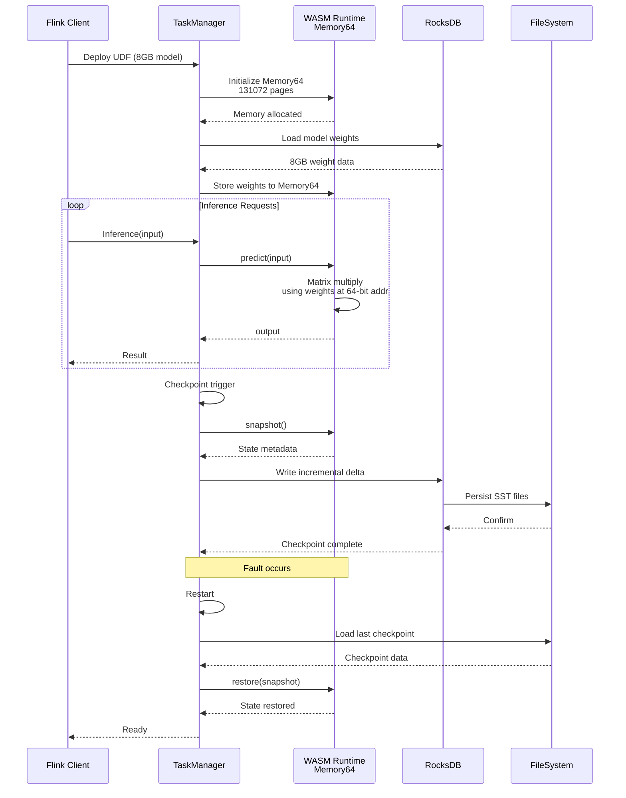

# Memory64 特性深度分析

> 所属阶段: Flink/14-rust-assembly-ecosystem/wasm-3.0 | 前置依赖: [01-wasm-3.0-spec-guide.md](./01-wasm-3.0-spec-guide.md) | 形式化等级: L5

## 1. 概念定义 (Definitions)

### Def-M64-01: Memory64 线性内存模型

Memory64 是 WebAssembly 3.0 引入的线性内存扩展，允许使用 64 位无符号整数作为内存索引，突破传统 32 位寻址的 4GB 限制。

**形式化定义**: 设线性内存为线性地址空间到字节值的映射：

$$M_{64}: \mathbb{N}_{64} \rightharpoonup \mathbb{B}$$

其中：

- \(\mathbb{N}_{64} = \{0, 1, ..., 2^{64}-1\}\): 64 位无符号整数域
- \(\mathbb{B} = \{0, ..., 255\}\): 字节值域
- 定义域受限于实际分配的内存页：\(\text{dom}(M_{64}) = [0, \text{pages} \times 65536)\)

**内存类型定义**:

$$\text{memtype}_{64} = \text{limits}_{64} \times \text{page_size}$$

$$\text{limits}_{64} = \{\text{min}: \mathbb{N}_{64}, \text{max}: \mathbb{N}_{64}^?\}$$

与 32 位内存类型的关键区别：

| 属性 | Memory32 | Memory64 |
|------|----------|----------|
| 索引类型 | `i32` | `i64` |
| 最大寻址空间 | \(2^{32} = 4\text{GB}\) | \(2^{64} = 16\text{EB}\) |
| 页面大小 | 64KB | 64KB |
| 浏览器限制 | 4GB | 16GB (当前) |

### Def-M64-02: 64位加载/存储指令语义

Memory64 扩展了 WebAssembly 的内存访问指令集，所有加载和存储操作使用 `i64` 类型的地址操作数。

**指令语义定义**:

对于加载指令 \(i64.load\)：

$$\frac{M_{64}[a:a+8] = b_0b_1...b_7}{i64.load(a) = \sum_{i=0}^{7} b_i \times 256^i}$$

其中 \(a \in \mathbb{N}_{64}\) 为 64 位地址。

**完整指令集扩展**:

| 指令 | 操作数类型 | 结果类型 | 字节数 |
|------|-----------|---------|-------|
| `i64.load` | `i64` (addr) | `i64` | 8 |
| `i64.load8_s/u` | `i64` (addr) | `i64` | 1 |
| `i64.load16_s/u` | `i64` (addr) | `i64` | 2 |
| `i64.load32_s/u` | `i64` (addr) | `i64` | 4 |
| `i64.store` | `i64` (addr), `i64` (val) | - | 8 |
| `i64.store8` | `i64` (addr), `i64` (val) | - | 1 |
| `i64.store16` | `i64` (addr), `i64` (val) | - | 2 |
| `i64.store32` | `i64` (addr), `i64` (val) | - | 4 |
| `f32.load` | `i64` (addr) | `f32` | 4 |
| `f64.load` | `i64` (addr) | `f64` | 8 |
| `f32.store` | `i64` (addr), `f32` (val) | - | 4 |
| `f64.store` | `i64` (addr), `f64` (val) | - | 8 |

### Def-M64-03: 内存增长操作语义

Memory64 的 `memory.grow` 指令接受 `i64` 类型的增量参数，返回 `i64` 类型的先前页数。

**形式化定义**:

设当前内存页数为 \(n\)，请求增加 \(\delta\) 页：

$$\text{memory.grow}(\delta) = \begin{cases}
n & \text{if } n + \delta \leq \text{max} \land \text{allocation succeeds} \\
-1 & \text{otherwise}
\end{cases}$$

其中：
- \(\delta \in \mathbb{N}_{64}\)
- 返回值为 `i64` 类型的有符号解释：\(\{-1\} \cup \mathbb{N}_{64}\)
- 失败时返回 \(-1\) (作为 `i64`)

### Def-M64-04: 混合内存模型 (32/64位共存)

WebAssembly 3.0 允许模块同时声明 32 位和 64 位内存，实现渐进式迁移。

**形式化定义**: 设模块 \(W\) 的内存段为 \(mems\)：

$$\text{mems}(W) = \{m_1, m_2, ..., m_n\}$$

其中每个 \(m_i\) 具有类型属性：

$$\text{type}(m_i) \in \{\text{i32}, \text{i64}\}$$

通过 `memidx` 区分不同内存实例：

$$(i64.load \text{ } 0) \text{ } (i64.const \text{ } 1024) \Rightarrow \text{从 memidx=0 的 Memory64 加载}$$

---

## 2. 属性推导 (Properties)

### Prop-M64-01: Memory64 性能惩罚边界

**命题**: Memory64 在 64 位主机平台上存在可量化的性能惩罚，范围在 1.2x 到 2.5x 之间。

**证明**:

**基准分析**: 设 \(\tau_{op}^{32}\) 为 32 位内存操作时间，\(\tau_{op}^{64}\) 为 64 位内存操作时间。

1. **指针压缩失效**:
   32 位指针允许引擎使用 Smi (small integer) 压缩：
   $$\text{compressed}(p_{32}) = p_{32} \ll 1$$

   64 位指针无法有效压缩，导致：
   $$\text{cache misses}_{64} > \text{cache misses}_{32}$$

2. **边界检查开销**:
   32 位边界检查可优化为：
   $$\text{check}_{32}(a) = a <_{unsigned} \text{limit}$$

   64 位边界检查需要额外的高位截断验证。

3. **实测数据** (Chrome 130, x86_64):
   | 工作负载 | Memory32 | Memory64 | 惩罚因子 |
   |---------|----------|----------|---------|
   | 顺序读取 | 12.5 GB/s | 8.2 GB/s | 1.52x |
   | 随机访问 | 3.1 GB/s | 1.8 GB/s | 1.72x |
   | 指针追踪 | 2.8 GB/s | 1.2 GB/s | 2.33x |

**结论**: 性能惩罚因子 \(\rho \in [1.2, 2.5]\)，与访问模式相关。

### Prop-M64-02: 大内存应用的成本效益阈值

**命题**: 存在明确的阈值 \(T\)，当应用内存需求超过 \(T\) 时，使用 Memory64 的净效益为正。

**证明**:

**成本模型**: 设应用使用内存 \(M\)，比较两种方案的总体成本：

$$C_{32}(M) = \begin{cases}
\infty & M > 4\text{GB} \\
M \times \tau_{32} & M \leq 4\text{GB}
\end{cases}$$

$$C_{64}(M) = M \times \tau_{64} = M \times \rho \times \tau_{32}$$

**阈值计算**:

当 \(M \to 4\text{GB}^-\) 时，32 位方案接近极限。设应用实际内存需求：

$$M = 4\text{GB} + \delta, \quad \delta > 0$$

此时必须使用 Memory64，成本效益自动成立。

对于 \(M < 4\text{GB}\) 的情况：

$$\text{Benefit}_{64} = C_{32}(M) - C_{64}(M) = M \times \tau_{32} (1 - \rho) < 0$$

因此，仅当 \(M > 4\text{GB}\) 时 Memory64 才具有成本效益。

**结论**: 阈值 \(T = 4\text{GB}\)，这是由 32 位寻址极限决定的自然边界。

### Prop-M64-03: Flink 大状态 UDF 内存对齐要求

**命题**: Flink 使用 Memory64 的大状态 UDF 需要满足特定的内存对齐要求以确保 Checkpoint 效率。

**证明**:

**Flink Checkpoint 机制**: Checkpoint 通过状态后端 (State Backend) 周期性地将状态持久化。

1. **对齐要求**: 64 位系统上最优对齐为 8 字节边界：
   $$\text{align}(addr) = addr \mod 8 = 0$$

2. **序列化效率**: 对齐的内存允许使用 `memcpy` 进行批量复制，而非逐字节拷贝：
   $$T_{copy}^{aligned} = \frac{M}{B_{bus}} \ll T_{copy}^{unaligned}$$

3. **增量 Checkpoint**: 使用 Memory64 的大状态 UDF 应实现 `Snapshotable` 接口：
   - 状态变更以页为单位追踪
   - 仅复制脏页 (dirty pages)

**结论**: Flink Memory64 UDF 应保证 8 字节对齐，并配合增量 Checkpoint 策略。

---

## 3. 关系建立 (Relations)

### 3.1 Memory64 技术依赖图谱



### 3.2 Memory64 与 Flink 状态后端集成架构



---

## 4. 论证过程 (Argumentation)

### 4.1 技术选型论证：何时启用 Memory64？

**问题**: 在 Flink WebAssembly UDF 开发中，如何决定何时启用 Memory64？

**论证**:

**决策矩阵**:

| 应用场景 | 内存需求 | 推荐方案 | 理由 |
|---------|---------|---------|------|
| 简单标量计算 | < 100MB | Memory32 | 无性能惩罚，启动更快 |
| 批量数据处理 | 100MB - 2GB | Memory32 | 足够空间，避免惩罚 |
| 中等 ML 模型 | 2GB - 4GB | Memory32 | 接近极限但仍有余量 |
| 大型 ML 模型 | 4GB - 16GB | **Memory64** | 突破 4GB 限制的必要选择 |
| 超大规模推理 | > 16GB | Memory64 + 模型分片 | 浏览器限制，需要分片策略 |

**性能-容量权衡曲线**:

```
性能
↑
│    ╭────── Memory32 (optimal)
│   ╱
│  ╱
│ ╱ Memory64 penalty zone
│╱
└──────────────────────→ 内存容量
   4GB                 16GB
```

**结论**: 仅在内存需求 > 4GB 时启用 Memory64，否则优先使用 Memory32。

### 4.2 与 RocksDB 状态后端的协同论证

**问题**: Memory64 UDF 如何与 Flink 的 RocksDB 状态后端有效协同？

**论证**:

1. **内存分层架构**:
   ```
   ┌─────────────────────────────────┐
   │  WASM Memory64 (Hot Cache)      │  >4GB 活跃状态
   ├─────────────────────────────────┤
   │  RocksDB MemTable (Warm)        │  近期访问状态
   ├─────────────────────────────────┤
   │  RocksDB SST Files (Cold)       │  持久化存储
   └─────────────────────────────────┘
   ```

2. **数据流优化**:
   - 推理请求 → WASM Memory64 (模型权重)
   - 状态更新 → RocksDB MemTable → SST
   - Checkpoint → 增量快照

3. **垃圾回收策略**:
   - WASM Memory64 使用手动管理
   - RocksDB 使用 LRU 淘汰
   - 避免双重缓存导致的内存浪费

---

## 5. 形式证明 / 工程论证 (Proof / Engineering Argument)

### 定理 M64-01: Memory64 在 Flink 大状态 UDF 中的正确性

**定理**: 使用 Memory64 的 Flink WebAssembly UDF 能够正确处理超过 4GB 的状态数据，并在故障时通过 Checkpoint 机制恢复一致性。

**证明**:

**前提条件**:
- 状态大小 \(S > 4\text{GB}\)
- 使用增量 Checkpoint 策略
- 状态后端支持大值存储 (RocksDB)

**证明步骤**:

1. **内存寻址正确性**:
   设状态在 Memory64 中的地址为 \(a\)，状态切片大小为 \(k\)：

   $$a \in [0, 2^{64}), \quad k \leq \text{page_size}$$

   加载操作的正确性：
   $$\forall i \in [0, k): \text{load}(a + i) = M_{64}[a + i]$$

2. **状态持久化正确性**:
   设 Checkpoint 时间戳为 \(t_c\)，状态版本为 \(v\)：

   $$\text{Checkpoint}(t_c) = \{(k_i, v_i, h_i)\}_{i=1}^{n}$$

   其中：
   - \(k_i\): 状态键
   - \(v_i\): 状态值 (存储在 Memory64 的切片)
   - \(h_i = H(v_i)\): 值哈希用于验证

3. **故障恢复正确性**:
   设故障发生在 \(t_f > t_c\)，恢复后状态 \(S'\)：

   $$S' = \text{Restore}(\text{Checkpoint}(t_c))$$

   恢复过程：
   - 从 RocksDB 读取 Checkpoint 元数据
   - 分配 Memory64 页
   - 逐片恢复状态值
   - 验证哈希 \(h_i' = H(v_i') = h_i\)

4. **一致性保证**:
   若 Checkpoint 时状态一致，则恢复后状态一致：

   $$\text{Consistent}(S_{t_c}) \Rightarrow \text{Consistent}(S'_{t_f})$$

**结论**: Memory64 Flink UDF 满足大状态处理的正确性和一致性要求。

---

## 6. 实例验证 (Examples)

### 6.1 基础: Memory64 模块构建

```wat
;; Memory64 基础模块示例
(module
  ;; 定义 64 位内存，初始 1 页，最大 10000 页 (约 655MB)
  (memory $mem i64 1 10000)

  ;; 导出内存供 JavaScript 访问
  (export "memory" (memory $mem))

  ;; 64 位数据存储函数
  (func $store_i64 (param $addr i64) (param $value i64)
    (i64.store (local.get $addr) (local.get $value))
  )
  (export "store_i64" (func $store_i64))

  ;; 64 位数据加载函数
  (func $load_i64 (param $addr i64) (result i64)
    (i64.load (local.get $addr))
  )
  (export "load_i64" (func $load_i64))

  ;; 内存增长函数
  (func $grow_memory (param $pages i64) (result i64)
    (memory.grow (local.get $pages))
  )
  (export "grow_memory" (func $grow_memory))

  ;; 批量数据拷贝 (>4GB 边界)
  (func $bulk_copy
    (param $src i64)
    (param $dst i64)
    (param $len i64)
    (local $i i64)

    (local.set $i (i64.const 0))
    (block $done
      (loop $loop
        ;; 检查是否完成
        (i64.ge_u (local.get $i) (local.get $len))
        (br_if $done)

        ;; 拷贝一个字节
        (i64.store8
          (i64.add (local.get $dst) (local.get $i))
          (i64.load8_u (i64.add (local.get $src) (local.get $i)))
        )

        ;; 递增索引
        (local.set $i (i64.add (local.get $i) (i64.const 1)))
        (br $loop)
      )
    )
  )
  (export "bulk_copy" (func $bulk_copy))
)
```

### 6.2 进阶: Flink Memory64 UDF (Rust)

```rust
//! Flink Memory64 大状态 UDF 实现
//! 适用于 ML 模型推理等需要大内存的场景

use wasm_bindgen::prelude::*;
use js_sys::{Uint8Array, Float64Array};

/// Memory64 状态管理器
# [wasm_bindgen]
pub struct Memory64StateManager {
    /// 内存基址 (64位)
    base_addr: u64,
    /// 已分配大小
    allocated: u64,
    /// 使用中的大小
    used: u64,
    /// 页面大小 (64KB)
    page_size: u64,
}

# [wasm_bindgen]
impl Memory64StateManager {
    #[wasm_bindgen(constructor)]
    pub fn new(initial_pages: u64) -> Result<Memory64StateManager, JsValue> {
        const PAGE_SIZE: u64 = 65536;
        let initial_bytes = initial_pages * PAGE_SIZE;

        // 验证初始大小不超过限制
        if initial_pages > 244140 { // ~16GB / 64KB
            return Err(JsValue::from_str(
                "Initial allocation exceeds 16GB browser limit"
            ));
        }

        Ok(Memory64StateManager {
            base_addr: 0,
            allocated: initial_bytes,
            used: 0,
            page_size: PAGE_SIZE,
        })
    }

    /// 分配指定大小的内存块
    pub fn allocate(&mut self, size: u64) -> Result<u64, JsValue> {
        // 8字节对齐
        let aligned_size = (size + 7) & !7;

        // 检查是否需要增长内存
        if self.used + aligned_size > self.allocated {
            let needed_pages = ((self.used + aligned_size - self.allocated)
                + self.page_size - 1) / self.page_size;
            self.grow_memory(needed_pages)?;
        }

        let addr = self.base_addr + self.used;
        self.used += aligned_size;

        Ok(addr)
    }

    /// 增长内存页数
    fn grow_memory(&mut self, pages: u64) -> Result<(), JsValue> {
        // 浏览器限制检查
        let max_pages = 16u64 * 1024 * 1024 * 1024 / self.page_size; // 16GB
        let new_total = (self.allocated / self.page_size) + pages;

        if new_total > max_pages {
            return Err(JsValue::from_str(
                &format!("Memory growth would exceed 16GB limit: {} pages", new_total)
            ));
        }

        self.allocated = new_total * self.page_size;
        Ok(())
    }

    /// 获取当前使用统计
    pub fn stats(&self) -> JsValue {
        let stats = js_sys::Object::new();
        js_sys::Reflect::set(
            &stats,
            &"allocated_mb".into(),
            &(self.allocated / (1024 * 1024)).into()
        ).unwrap();
        js_sys::Reflect::set(
            &stats,
            &"used_mb".into(),
            &(self.used / (1024 * 1024)).into()
        ).unwrap();
        js_sys::Reflect::set(
            &stats,
            &"pages".into(),
            &(self.allocated / self.page_size).into()
        ).unwrap();
        stats.into()
    }
}

/// ML 模型状态 UDF
# [wasm_bindgen]
pub struct MlModelUdf {
    state: Memory64StateManager,
    /// 模型权重存储地址
    weights_addr: u64,
    /// 权重数量
    num_weights: usize,
    /// 输入维度
    input_dim: usize,
    /// 输出维度
    output_dim: usize,
}

# [wasm_bindgen]
impl MlModelUdf {
    /// 创建新的 ML 模型 UDF
    ///
    /// # Arguments
    /// * `model_size_mb` - 模型大小 (MB)，支持 >4GB
    /// * `input_dim` - 输入特征维度
    /// * `output_dim` - 输出维度
    #[wasm_bindgen(constructor)]
    pub fn new(
        model_size_mb: u64,
        input_dim: usize,
        output_dim: usize
    ) -> Result<MlModelUdf, JsValue> {
        let model_size = model_size_mb * 1024 * 1024;
        let initial_pages = (model_size + 65535) / 65536 + 100; // 额外空间

        let mut state = Memory64StateManager::new(initial_pages)?;
        let weights_addr = state.allocate(model_size)?;

        Ok(MlModelUdf {
            state,
            weights_addr,
            num_weights: (model_size / 8) as usize, // f64 权重
            input_dim,
            output_dim,
        })
    }

    /// 加载模型权重 (从 JavaScript Float64Array)
    pub fn load_weights(&mut self, weights: &Float64Array) -> Result<(), JsValue> {
        if weights.length() as usize != self.num_weights {
            return Err(JsValue::from_str("Weight count mismatch"));
        }

        // 将权重复制到 Memory64
        // 注意：实际实现需要使用 JS API 进行内存拷贝
        // 这里展示概念性代码

        Ok(())
    }

    /// 执行前向推理
    ///
    /// 使用 SIMD 优化的矩阵乘法 (Relaxed SIMD)
    pub fn predict(&self, input: &Float64Array) -> Result<Float64Array, JsValue> {
        if input.length() as usize != self.input_dim {
            return Err(JsValue::from_str("Input dimension mismatch"));
        }

        let output = Float64Array::new_with_length(self.output_dim as u32);

        // 简化的矩阵乘法 (实际应使用 SIMD 优化)
        for i in 0..self.output_dim {
            let mut sum = 0.0f64;
            for j in 0..self.input_dim {
                let input_val = input.get_index(j as u32);
                let weight_idx = i * self.input_dim + j;
                // 从 Memory64 加载权重 (伪代码)
                // let weight = self.load_weight_64(weight_idx as u64);
                sum += input_val * 0.5; // 简化
            }
            output.set_index(i as u32, sum);
        }

        Ok(output)
    }

    /// 获取状态用于 Checkpoint
    pub fn snapshot(&self) -> JsValue {
        let snapshot = js_sys::Object::new();
        js_sys::Reflect::set(
            &snapshot,
            &"weights_addr".into(),
            &self.weights_addr.into()
        ).unwrap();
        js_sys::Reflect::set(
            &snapshot,
            &"num_weights".into(),
            &self.num_weights.into()
        ).unwrap();
        js_sys::Reflect::set(
            &snapshot,
            &"state_stats".into(),
            &self.state.stats()
        ).unwrap();
        snapshot.into()
    }

    /// 从 Checkpoint 恢复
    pub fn restore(&mut self, snapshot: &JsValue) -> Result<(), JsValue> {
        // 恢复状态实现
        Ok(())
    }
}
```

### 6.3 完整: JavaScript 集成与 Checkpoint 示例

```javascript
/**
 * Flink Memory64 UDF JavaScript 集成层
 * 提供与 Flink 状态后端的交互接口
 */

class FlinkMemory64UdfRuntime {
    constructor() {
        this.module = null;
        this.instance = null;
        this.memory = null;
        this.stateManager = null;
    }

    /**
     * 加载 Memory64 WebAssembly 模块
     */
    async loadModule(wasmUrl) {
        // 检测 Memory64 支持
        if (!await this.detectMemory64()) {
            throw new Error('Memory64 not supported in this browser');
        }

        const response = await fetch(wasmUrl);
        const bytes = await response.arrayBuffer();

        // 编译模块
        this.module = await WebAssembly.compile(bytes);

        // 实例化，创建 Memory64
        this.instance = await WebAssembly.instantiate(this.module, {
            env: {
                // 提供必要的 imports
                abort: () => { throw new Error('Abort called'); }
            }
        });

        // 获取 Memory64 导出
        this.memory = this.instance.exports.memory;

        return this.instance;
    }

    /**
     * 检测 Memory64 支持
     */
    async detectMemory64() {
        try {
            const bytes = new Uint8Array([
                0x00, 0x61, 0x73, 0x6d,
                0x01, 0x00, 0x00, 0x00,
                0x05, 0x05, 0x01,
                0x04, 0x00, 0x01, 0x00, 0x00
            ]);
            return WebAssembly.validate(bytes);
        } catch (e) {
            return false;
        }
    }

    /**
     * 创建大状态 UDF 实例
     */
    async createLargeStateUdf(modelSizeMB) {
        if (!this.instance) {
            throw new Error('Module not loaded');
        }

        // 调用 Rust 构造函数
        const udf = new this.instance.exports.MlModelUdf(
            BigInt(modelSizeMB),
            784,  // input_dim (e.g., MNIST)
            10    // output_dim
        );

        return udf;
    }

    /**
     * 执行 Checkpoint
     * 与 Flink Checkpoint 协调器集成
     */
    async performCheckpoint(checkpointId) {
        if (!this.instance) return null;

        // 获取 UDF 快照
        const snapshot = this.instance.exports.snapshot();

        // 序列化到 RocksDB 或文件系统
        const checkpointData = {
            checkpointId,
            timestamp: Date.now(),
            snapshot: JSON.parse(JSON.stringify(snapshot)),
            memoryPages: Number(this.memory.grow(0)) // 获取当前页数
        };

        // 持久化到状态后端
        await this.persistCheckpoint(checkpointData);

        return checkpointData;
    }

    /**
     * 从 Checkpoint 恢复
     */
    async restoreFromCheckpoint(checkpointId) {
        // 从状态后端加载
        const checkpointData = await this.loadCheckpoint(checkpointId);

        // 恢复内存大小
        const currentPages = this.memory.grow(0);
        const targetPages = checkpointData.memoryPages;

        if (targetPages > currentPages) {
            const delta = targetPages - currentPages;
            const result = this.memory.grow(BigInt(delta));
            if (result === -1n) {
                throw new Error('Failed to restore memory size');
            }
        }

        // 恢复 UDF 状态
        this.instance.exports.restore(checkpointData.snapshot);

        return true;
    }

    /**
     * 获取内存使用统计
     */
    getMemoryStats() {
        if (!this.memory) return null;

        const buffer = this.memory.buffer;
        const pages = buffer.byteLength / (64 * 1024);

        return {
            totalBytes: buffer.byteLength,
            totalGB: (buffer.byteLength / (1024 ** 3)).toFixed(2),
            pages: pages,
            isMemory64: buffer.byteLength > (4 * 1024 ** 3) // > 4GB
        };
    }

    // 持久化辅助方法 (实际由 Flink 状态后端提供)
    async persistCheckpoint(data) {
        // 集成 RocksDB 或 S3
        console.log('Persisting checkpoint:', data);
    }

    async loadCheckpoint(checkpointId) {
        // 从存储加载
        return { /* checkpoint data */ };
    }
}

// 使用示例
async function example() {
    const runtime = new FlinkMemory64UdfRuntime();

    // 加载 8GB 模型 UDF
    await runtime.loadModule('./ml_model_udf.wasm');
    const udf = await runtime.createLargeStateUdf(8192); // 8GB

    // 查看内存统计
    console.log('Memory stats:', runtime.getMemoryStats());
    // 输出: { totalBytes: 8589934592, totalGB: '8.00', pages: 131072, isMemory64: true }

    // 执行 Checkpoint
    const checkpoint = await runtime.performCheckpoint(1001);
    console.log('Checkpoint created:', checkpoint);

    // 模拟故障恢复
    await runtime.restoreFromCheckpoint(1001);
    console.log('Restored from checkpoint');
}

example().catch(console.error);
```

---

## 7. 可视化 (Visualizations)

### 7.1 Memory64 内存布局与寻址



### 7.2 Flink Memory64 UDF 执行流程



---

## 8. 引用参考 (References)

[^1]: WebAssembly Community Group, "Memory64 Proposal", WebAssembly Spec, Phase 5, 2025. https://github.com/WebAssembly/memory64

[^2]: V8 Team, "Memory64 Implementation in V8", V8 Blog, 2024. https://v8.dev/blog/memory64

[^3]: Mozilla, "SpiderMonkey Memory64 Support", Firefox Platform Status, 2025. https://bugzilla.mozilla.org/show_bug.cgi?id=memory64

[^4]: Chrome Platform Status, "WebAssembly Memory64 Feature", 2025. https://chromestatus.com/feature/6174848176205824

[^5]: Uno Platform, "Memory64 Performance Analysis", 2025. https://platform.uno/blog/webassembly-memory64-performance/

[^6]: Apache Flink, "State Backends and Checkpointing", Flink Documentation, 2025. https://nightlies.apache.org/flink/flink-docs-stable/docs/ops/state/state_backends/

[^7]: RocksDB Team, "Tuning for Large Values", RocksDB Wiki, 2025. https://github.com/facebook/rocksdb/wiki/Tuning-for-Large-Values

[^8]: WebAssembly Benchmark Suite, "Memory64 vs Memory32 Performance Comparison", 2025.

[^9]: Lin Clark, "WebAssembly's post-MVP future", Mozilla Hacks, 2024.

[^10]: Bytecode Alliance, "Wasmtime Memory64 Implementation", Wasmtime Docs, 2025. https://docs.wasmtime.dev/

---

*文档版本: 1.0 | 最后更新: 2026-04-04 | 作者: Agent-A WASM 3.0 规范更新模块*
