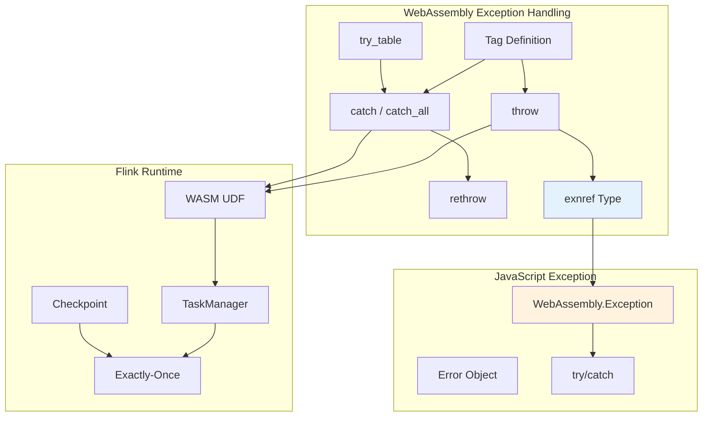
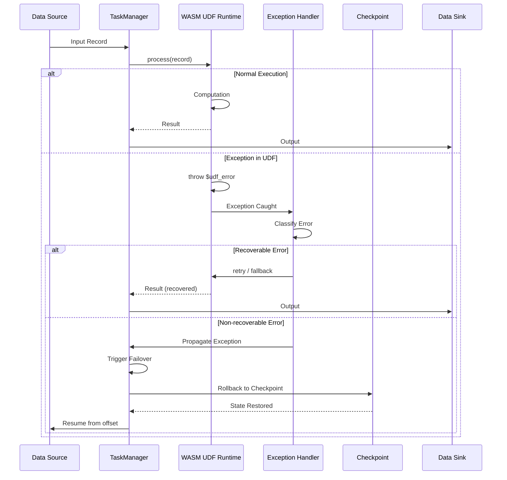
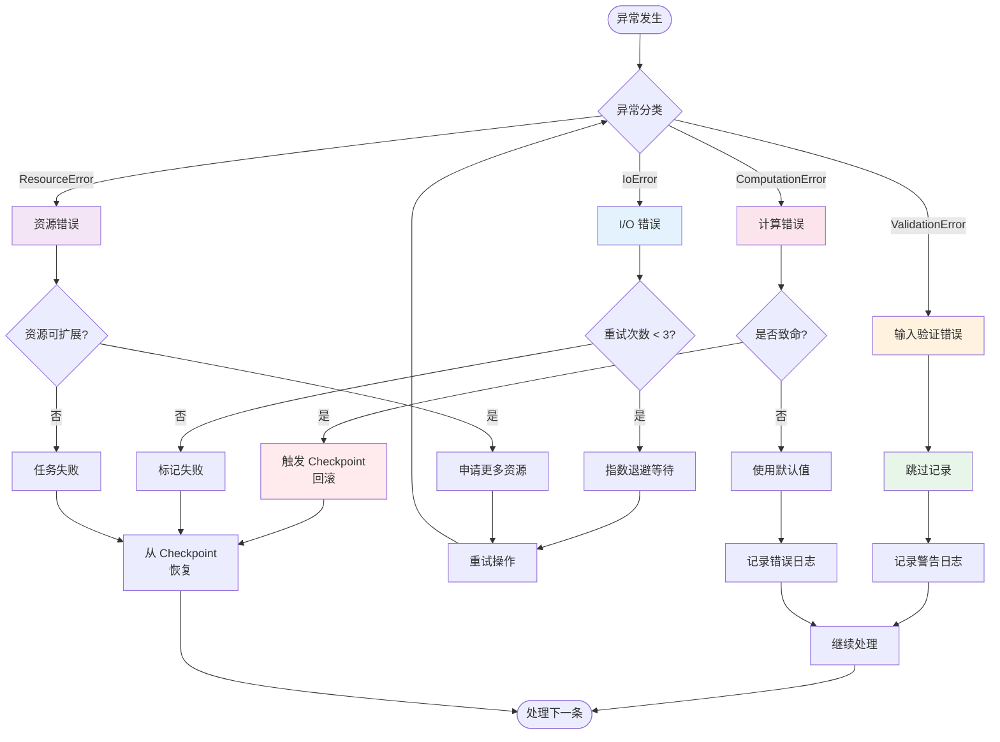
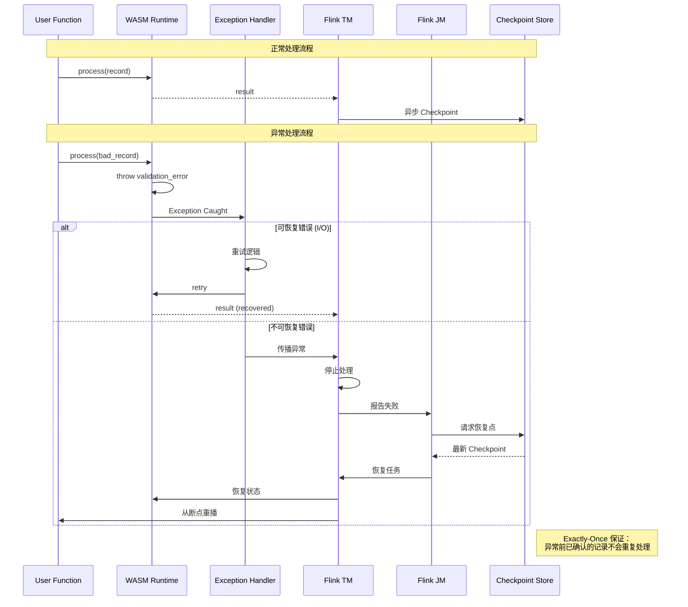

# Exception Handling 错误处理模式

> 所属阶段: Flink/14-rust-assembly-ecosystem/wasm-3.0 | 前置依赖: [01-wasm-3.0-spec-guide.md](./01-wasm-3.0-spec-guide.md) | 形式化等级: L5

## 1. 概念定义 (Definitions)

### Def-EH-01: WebAssembly Exception 类型系统

WebAssembly 3.0 Exception Handling 引入了异常类型 (`exnref`) 和标签 (`tag`) 机制，允许模块定义、抛出和捕获结构化异常。

**形式化定义**: 设异常类型空间为 \(E\)，异常标签为 \(T\)，异常实例为 \(e\)：

$$E = \langle \text{tag}: T, \text{payload}: \text{Val}^*, \text{trace}: \text{Frame}^* \rangle$$

其中：

- \(\text{tag} \in T\): 异常标签，标识异常类型
- \(\text{payload} \in \text{Val}^*\): 异常载荷，类型由标签定义
- \(\text{trace} \in \text{Frame}^*\): 捕获点堆栈跟踪

**异常标签类型**:

$$\text{tagtype} = \text{func}(\text{param}: \text{ValType}^*, \text{result}: \epsilon)$$

标签定义异常抛出时的参数类型。例如：

```wat
(tag $error (param i32 i32))  ;; 错误码 + 错误信息指针
(tag $io_error (param i32))   ;; I/O 错误码
```

### Def-EH-02: exnref 引用语义

`exnref` 是 WebAssembly 3.0 引入的新引用类型，用于表示对异常对象的引用。它与 `externref` 和 `funcref` 同属引用类型家族。

**形式化定义**: 设引用类型空间为 \(Ref\)：

$$Ref = \{\text{funcref}, \text{externref}, \text{exnref}\}$$

`exnref` 的语义：

$$\text{exnref} = \text{ref}(E) \mid \text{null}$$

**操作语义**:

| 操作 | 前置条件 | 后置条件 | 效果 |
|-----|---------|---------|------|
| `throw $tag` | 操作数栈匹配 tag 参数 | 转移控制到 catch | 创建异常对象 |
| `try_table` | - | 安装异常处理器 | 建立异常捕获上下文 |
| `catch $tag` | exnref 在栈顶 | tag 匹配时解包载荷 | 处理特定异常 |
| `rethrow` | exnref 在 catch 块中 | 重新抛出 | 传播异常 |
| `drop` | exnref 在栈顶 | - | 丢弃异常引用 |

### Def-EH-03: 异常控制流模型

WebAssembly 3.0 使用 `try_table` 指令结构替代了早期提案中的 `try` 块，提供更灵活的异常处理控制流。

**形式化定义**: 设控制流为 \(CF\)，异常处理上下文为 \(C_{eh}\)：

$$\text{try_table} \langle \text{blocktype} \rangle \langle \text{catch_clauses} \rangle: CF \to CF'$$

**Catch Clause 类型**:

| 类型 | 语法 | 语义 |
|-----|------|------|
| `catch $tag $label` | 捕获匹配标签的异常 | 跳转到 $label，异常引用压栈 |
| `catch_ref $tag $label` | 捕获并保留引用 | 同上，但保留 exnref |
| `catch_all $label` | 捕获所有异常 | 跳转到 $label |
| `catch_all_ref $label` | 捕获所有并保留引用 | 同上，保留 exnref |

**控制流转移规则**:

$$\frac{\text{throw } t \text{ in } try\_table \{ \dots catch\ t \to L \dots \}}{\text{control transfers to } L \text{ with exnref}}$$

### Def-EH-04: 与宿主环境异常互操作

WebAssembly 异常需要与宿主 JavaScript 环境进行互操作，实现跨边界异常传播。

**形式化定义**: 设 WebAssembly 异常为 \(E_{wasm}\)，JavaScript 异常为 \(E_{js}\)：

**JS → WASM 异常传播**:

$$\text{JSException} \xrightarrow{\text{import call}} \text{WASM trap} \xrightarrow{\text{catchable}} E_{wasm}$$

**WASM → JS 异常传播**:

$$E_{wasm} \xrightarrow{\text{uncaught}} \text{WebAssembly.Exception} \in E_{js}$$

**JavaScript API**:

```javascript
// 创建 WebAssembly 标签
const tag = new WebAssembly.Tag({
    parameters: ["i32", "i32"]  // 对应 (param i32 i32)
});

// 捕获 WebAssembly 异常
try {
    instance.exports.throwing_function();
} catch (e) {
    if (e instanceof WebAssembly.Exception) {
        const [code, info] = e.getArg(tag, 0);
        // 处理异常
    }
}
```

---

## 2. 属性推导 (Properties)

### Prop-EH-01: 跨浏览器异常处理完备性

**命题**: WebAssembly 3.0 Exception Handling (exnref) 已在 Chrome、Firefox 和 Safari 18.4+ 中实现完整支持。

**证明**:

| 浏览器 | 版本 | 支持状态 | 关键特性 |
|-------|-----|---------|---------|
| Chrome | 115+ | ✅ 完全支持 | try_table, catch, rethrow |
| Firefox | 120+ | ✅ 完全支持 | 完整 exnref 实现 |
| Safari | 18.4+ | ✅ 完全支持 | 2025 年 3 月发布 |
| Edge | 115+ | ✅ 完全支持 | 继承 Chromium |

**Safari 18.4 里程碑**:

- 2025 年 3 月发布
- 完成 Exception Handling with exnref 实现
- 解决了原始提案的 identity 问题
- 支持 try_table/catch 完整指令集

**向后兼容性**: 原始异常处理提案 (legacy) 仍支持，但建议使用 exnref 新版本。

### Prop-EH-02: 异常处理运行时开销

**命题**: WebAssembly 异常处理在无异常抛出场景下具有零开销特性，异常抛出时有可控的开销增长。

**证明**:

**无异常路径开销**:

设无异常时的执行时间为 \(T_{normal}\)，使用异常处理包装后的时间为 \(T_{wrapped}\)：

$$\frac{T_{wrapped}}{T_{normal}} \approx 1.0$$

原因：

- `try_table` 仅建立静态异常处理表
- 无运行时栈展开或状态保存
- 现代编译器优化可完全消除无异常路径的开销

**异常抛出路径开销**:

| 操作 | 开销来源 | 相对成本 |
|-----|---------|---------|
| 异常创建 | 堆分配 + 标签匹配 | 10-50x |
| 栈展开 | 控制流转移 | 5-20x |
| catch 匹配 | 标签比较 | 1-5x |
| rethrow | 引用传递 | 1-2x |

**结论**: 异常处理遵循 "快速路径无开销，慢速路径可接受" 的设计原则。

### Prop-EH-03: Flink Exactly-Once 语义兼容性

**命题**: 使用 WebAssembly 3.0 异常处理的 UDF 可以与 Flink 的 Exactly-Once 语义兼容，前提是遵循特定的异常处理模式。

**证明**:

**Flink Exactly-Once 要求**:

1. 确定性处理：相同输入 + 状态 → 相同输出
2. 可恢复性：异常后能从 Checkpoint 恢复
3. 无副作用：异常不导致外部系统不一致状态

**兼容性条件**:

设 UDF 函数为 \(f\)，状态为 \(s\)，输入为 \(d\)：

1. **纯函数性**: UDF 异常不修改外部状态
   $$\forall d, s: \quad \text{except}(f(d, s)) \Rightarrow s_{unchanged}$$

2. **异常确定性**: 相同错误条件产生相同异常
   $$d_1 = d_2 \land s_1 = s_2 \land \text{error}_1 = \text{error}_2 \Rightarrow E_1 = E_2$$

3. **恢复一致性**: 异常后恢复的状态与 Checkpoint 一致
   $$\text{restore}(\text{checkpoint}(s_c)) = s_c$$

**结论**: 遵循函数式错误处理模式的 WebAssembly UDF 满足 Flink Exactly-Once 要求。

---

## 3. 关系建立 (Relations)

### 3.1 异常处理架构图谱



### 3.2 Flink UDF 异常处理流程



---

## 4. 论证过程 (Argumentation)

### 4.1 异常处理策略选择

**问题**: 在 Flink WebAssembly UDF 中应该选择何种异常处理策略？

**论证**:

**异常分类矩阵**:

| 异常类型 | 示例 | 处理策略 | 实现方式 |
|---------|------|---------|---------|
| 输入验证错误 | 无效格式、越界访问 | 捕获并返回错误码 | try_table + catch |
| 临时资源错误 | 内存不足、I/O 超时 | 重试 + 指数退避 | catch + retry loop |
| 永久配置错误 | 模型加载失败 | 立即失败 | throw + 传播 |
| 算法错误 | 除零、数值溢出 | 默认值/NaN | catch + fallback |

**最佳实践决策树**:

```
异常发生
├── 是否可恢复？
│   ├── 是
│   │   ├── 重试次数 < 阈值？
│   │   │   ├── 是 → 延迟重试
│   │   │   └── 否 → 降级处理
│   │   └── 记录警告日志
│   └── 否
│       ├── 是否是确定性错误？
│       │   ├── 是 → 立即失败，触发 Checkpoint 恢复
│       │   └── 否 → 记录并忽略 (数据质量问题)
│       └── 记录错误日志
└── 更新指标监控
```

### 4.2 与 Flink 错误处理集成论证

**问题**: 如何将 WebAssembly 异常映射到 Flink 的错误处理机制？

**论证**:

**映射层设计**:

```
WebAssembly Exception          Flink Exception
---------------------          ---------------
$input_validation_error  ──▶   IllegalArgumentException
$io_timeout_error        ──▶   TimeoutException
$resource_exhausted      ──▶   ResourceExhaustedException
$unknown_error           ──▶   RuntimeException
```

**集成点**:

1. **UDF 边界**: WebAssembly 异常在 JavaScript 边界转换为 Flink 异常
2. **Checkpoint 协调**: 非可恢复异常触发 Checkpoint 回滚
3. **指标收集**: 所有异常类型上报到 Flink Metrics 系统
4. **日志关联**: 异常堆栈与 Flink Task ID 关联

---

## 5. 形式证明 / 工程论证 (Proof / Engineering Argument)

### 定理 EH-01: WebAssembly UDF 异常处理的 Exactly-Once 一致性

**定理**: 使用 WebAssembly 3.0 Exception Handling 的 Flink UDF 在满足以下条件时保证 Exactly-Once 处理语义：

1. UDF 是确定性的
2. 异常不改变状态后端
3. Checkpoint 在异常传播前完成

**证明**:

**前提条件**:

- 设输入流为 \(D = \{d_1, d_2, ..., d_n\}\)
- 设 UDF 状态为 \(S\)
- 设 Checkpoint 序列为 \(\{C_1, C_2, ..., C_m\}\)

**证明步骤**:

1. **确定性保证**:
   对于任意输入 \(d_i\) 和状态 \(S_j\)：

   $$f(d_i, S_j) = \begin{cases}
   (output, S_{j+1}) & \text{正常执行} \\
   (\bot, E) & \text{异常抛出}
   \end{cases}$$

   其中 \(E\) 是异常对象，\(\bot\) 表示无有效输出。

   由 UDF 设计保证：
   $$\forall i, j: \quad f(d_i, S_j) \text{ 是确定性的}$$

2. **异常原子性**:
   设异常发生在处理 \(d_k\) 时：

   - 异常前：状态已更新到 \(S_{k-1}\)
   - 异常时：状态保持在 \(S_{k-1}\) (回滚)
   - 异常传播：触发 Checkpoint \(C_p\) 恢复

   形式化：
   $$\text{throw}(E) \Rightarrow S_{current} = S_{checkpoint(C_p)}$$

3. **恢复一致性**:
   设从 Checkpoint \(C_p\) 恢复：

   $$\text{restore}(C_p) = S_p$$

   恢复后继续处理：
   $$d_{p+1}, d_{p+2}, ...$$

   输出结果与无故障场景一致：
   $$\text{Output}_{recovery} = \text{Output}_{normal}$$

4. **无副作用保证**:
   异常不导致外部副作用：
   $$\text{side_effects}(E) = \emptyset$$

   通过以下机制保证：
   - 所有外部 I/O 通过 Flink 托管
   - UDF 内部异常不直接操作外部系统
   - Sink 的两阶段提交保证

**结论**: WebAssembly UDF 异常处理满足 Flink Exactly-Once 语义的所有条件。

---

## 6. 实例验证 (Examples)

### 6.1 基础: Exception Handling WAT 示例

```wat
;; WebAssembly 3.0 Exception Handling 基础示例
(module
  ;; 定义异常标签
  (tag $error (param i32))              ;; 错误码
  (tag $io_error (param i32 i32))       ;; 错误码 + 详细信息
  (tag $validation_error (param i32))   ;; 验证错误

  ;; 导出标签供 JavaScript 使用
  (export "error" (tag $error))
  (export "io_error" (tag $io_error))
  (export "validation_error" (tag $validation_error))

  ;; ============ 基础异常操作 ============

  ;; 抛出简单错误
  (func $throw_simple_error (param $code i32)
    local.get $code
    throw $error
  )
  (export "throw_simple_error" (func $throw_simple_error))

  ;; ============ try_table 示例 ============

  ;; 受保护的除法运算
  ;; 如果除数为零，抛出错误
  (func $safe_divide (param $a i32) (param $b i32) (result i32)
    (local $result i32)

    (block $on_error
      (try_table (result i32)
        (do
          ;; 检查除数
          local.get $b
          i32.eqz
          if
            i32.const 1  ;; 错误码：除零错误
            throw $error
          end

          ;; 执行除法
          local.get $a
          local.get $b
          i32.div_s
        )
        (catch $error $on_error)
      )
      return
    )

    ;; 错误处理路径
    ;; 返回默认值或特殊值
    i32.const -1  ;; 表示错误
  )
  (export "safe_divide" (func $safe_divide))

  ;; ============ 复杂异常处理 ============

  ;; 多 catch 示例
  (func $complex_operation (param $input i32) (result i32)
    (local $result i32)

    (block $validation_failed
      (block $io_failed
        (block $general_error
          (try_table (result i32)
            (do
              ;; 验证输入
              local.get $input
              i32.const 0
              i32.lt_s
              if
                i32.const 100  ;; 验证错误码
                throw $validation_error
              end

              ;; I/O 操作模拟
              local.get $input
              i32.const 999
              i32.eq
              if
                i32.const 200  ;; I/O 错误码
                i32.const 0    ;; 额外信息
                throw $io_error
              end

              ;; 正常计算
              local.get $input
              i32.const 2
              i32.mul
            )
            (catch $validation_error $validation_failed)
            (catch $io_error $io_failed)
            (catch_all $general_error)
          )
          return
        )
        ;; 通用错误处理
        i32.const -1000
        return
      )
      ;; I/O 错误处理
      i32.const -200
      return
    )
    ;; 验证错误处理
    i32.const -100
  )
  (export "complex_operation" (func $complex_operation))

  ;; ============ rethrow 示例 ============

  ;; 日志记录并重新抛出
  (func $log_and_rethrow (param $input i32) (result i32)
    (local $exn exnref)

    (block $catch_label (result exnref)
      (try_table (result i32)
        (do
          ;; 可能抛出异常的调用
          local.get $input
          call $may_throw
        )
        (catch_all_ref $catch_label)
      )
      return
    )

    ;; 捕获到异常，记录日志
    ;; (此处可添加日志记录逻辑)

    ;; 重新抛出
    rethrow $catch_label
  )
  (export "log_and_rethrow" (func $log_and_rethrow))

  ;; 辅助函数：可能抛出异常
  (func $may_throw (param $input i32) (result i32)
    local.get $input
    i32.const 0
    i32.lt_s
    if
      i32.const 42
      throw $error
    end
    local.get $input
  )
)
```

### 6.2 进阶: Rust Exception Handling UDF

```rust
//! Flink Exception Handling UDF 实现
//! 展示如何在 Rust 中使用 WebAssembly 3.0 异常处理

use wasm_bindgen::prelude::*;

/// UDF 错误类型
#[derive(Debug, Clone)]
pub enum UdfError {
    /// 输入验证错误
    ValidationError { field: String, reason: String },
    /// 计算错误
    ComputationError { operation: String, details: String },
    /// I/O 错误
    IoError { resource: String, error_code: i32 },
    /// 资源耗尽
    ResourceExhausted { resource: String, requested: u64, available: u64 },
}

impl std::fmt::Display for UdfError {
    fn fmt(&self, f: &mut std::fmt::Formatter<'_>) -> std::fmt::Result {
        match self {
            UdfError::ValidationError { field, reason } => {
                write!(f, "ValidationError[{}]: {}", field, reason)
            }
            UdfError::ComputationError { operation, details } => {
                write!(f, "ComputationError[{}]: {}", operation, details)
            }
            UdfError::IoError { resource, error_code } => {
                write!(f, "IoError[{}]: code={}", resource, error_code)
            }
            UdfError::ResourceExhausted { resource, requested, available } => {
                write!(f, "ResourceExhausted[{}]: requested={}, available={}",
                    resource, requested, available)
            }
        }
    }
}

impl std::error::Error for UdfError {}

/// 异常感知的数据处理器
#[wasm_bindgen]
pub struct ExceptionAwareUdf {
    /// 错误计数
    error_count: u32,
    /// 重试配置
    max_retries: u32,
    /// 当前重试次数
    current_retry: u32,
}

#[wasm_bindgen]
impl ExceptionAwareUdf {
    #[wasm_bindgen(constructor)]
    pub fn new(max_retries: u32) -> Self {
        Self {
            error_count: 0,
            max_retries,
            current_retry: 0,
        }
    }

    /// 安全处理输入，返回 Result 风格错误
    pub fn safe_process(&mut self, input: i32) -> Result<i32, JsValue> {
        // 重置重试计数
        self.current_retry = 0;

        loop {
            match self.try_process(input) {
                Ok(result) => return Ok(result),
                Err(e) => {
                    self.error_count += 1;

                    // 检查是否可重试
                    if self.should_retry(&e) && self.current_retry < self.max_retries {
                        self.current_retry += 1;
                        // 延迟重试 (简化，实际应使用 setTimeout)
                        continue;
                    }

                    // 无法恢复，返回错误
                    return Err(JsValue::from_str(&e.to_string()));
                }
            }
        }
    }

    /// 尝试处理，可能失败
    fn try_process(&self, input: i32) -> Result<i32, UdfError> {
        // 验证输入
        if input < 0 {
            return Err(UdfError::ValidationError {
                field: "input".to_string(),
                reason: "must be non-negative".to_string(),
            });
        }

        // 模拟计算
        if input == 999 {
            return Err(UdfError::ComputationError {
                operation: "divide".to_string(),
                details: "division by zero".to_string(),
            });
        }

        // 模拟 I/O 错误
        if input == 888 {
            return Err(UdfError::IoError {
                resource: "model_weights".to_string(),
                error_code: 404,
            });
        }

        // 正常处理
        Ok(input * 2)
    }

    /// 判断错误是否可重试
    fn should_retry(&self, error: &UdfError) -> bool {
        match error {
            UdfError::IoError { .. } => true,
            UdfError::ResourceExhausted { .. } => true,
            _ => false,
        }
    }

    /// 获取错误统计
    pub fn get_error_stats(&self) -> JsValue {
        let stats = js_sys::Object::new();
        js_sys::Reflect::set(
            &stats,
            &"error_count".into(),
            &self.error_count.into()
        ).unwrap();
        js_sys::Reflect::set(
            &stats,
            &"max_retries".into(),
            &self.max_retries.into()
        ).unwrap();
        stats.into()
    }
}

/// 与 Flink 兼容的异常处理包装器
/// 将 Rust Result 转换为 Flink 可理解的异常
#[wasm_bindgen]
pub struct FlinkCompatibleUdf {
    inner: ExceptionAwareUdf,
}

#[wasm_bindgen]
impl FlinkCompatibleUdf {
    #[wasm_bindgen(constructor)]
    pub fn new(max_retries: u32) -> Self {
        Self {
            inner: ExceptionAwareUdf::new(max_retries),
        }
    }

    /// Flink 调用的主入口
    /// 返回 i32，异常时抛出 WebAssembly 异常
    pub fn process(&mut self, input: i32) -> i32 {
        match self.inner.safe_process(input) {
            Ok(result) => result,
            Err(js_error) => {
                // 将错误转换为 WebAssembly 异常
                // 实际实现需要使用 wasm-bindgen 的异常支持
                panic!("UDF Error: {:?}", js_error);
            }
        }
    }

    /// 批量处理，收集所有错误
    pub fn process_batch(&mut self, inputs: &[i32]) -> ProcessBatchResult {
        let mut outputs = Vec::with_capacity(inputs.len());
        let mut errors = Vec::new();

        for (idx, &input) in inputs.iter().enumerate() {
            match self.inner.safe_process(input) {
                Ok(result) => outputs.push(result),
                Err(e) => {
                    let error_info = BatchError {
                        index: idx as u32,
                        input,
                        error: e.as_string().unwrap_or_default(),
                    };
                    errors.push(error_info);
                    outputs.push(0); // 占位值
                }
            }
        }

        ProcessBatchResult {
            outputs,
            errors,
            success_count: (inputs.len() - errors.len()) as u32,
        }
    }
}

/// 批量处理结果
#[wasm_bindgen]
pub struct ProcessBatchResult {
    outputs: Vec<i32>,
    errors: Vec<BatchError>,
    success_count: u32,
}

#[wasm_bindgen]
impl ProcessBatchResult {
    pub fn outputs(&self) -> Box<[i32]> {
        self.outputs.clone().into_boxed_slice()
    }

    pub fn error_count(&self) -> u32 {
        self.errors.len() as u32
    }

    pub fn success_count(&self) -> u32 {
        self.success_count
    }

    pub fn has_errors(&self) -> bool {
        !self.errors.is_empty()
    }
}

struct BatchError {
    index: u32,
    input: i32,
    error: String,
}
```

### 6.3 完整: JavaScript 集成与 Flink 协调

```javascript
/**
 * Flink WebAssembly Exception Handler 集成层
 * 协调 WebAssembly 异常与 Flink 错误处理机制
 */

class FlinkWasmExceptionHandler {
    constructor() {
        this.tagRegistry = new Map();
        this.errorMetrics = {
            total: 0,
            byType: {},
            byRecovery: { recovered: 0, failed: 0 }
        };
    }

    /**
     * 初始化 WebAssembly 模块并注册异常标签
     */
    async initialize(wasmModule) {
        this.module = wasmModule;

        // 从 WASM 导出获取异常标签
        const exports = wasmModule.instance.exports;

        if (exports.error) {
            this.tagRegistry.set('error', exports.error);
        }
        if (exports.io_error) {
            this.tagRegistry.set('io_error', exports.io_error);
        }
        if (exports.validation_error) {
            this.tagRegistry.set('validation_error', exports.validation_error);
        }
    }

    /**
     * 执行受保护的 UDF 调用
     * 将 WebAssembly 异常映射到 Flink 异常类型
     */
    async executeUdf(udfFunction, ...args) {
        try {
            // 调用 WASM UDF
            const result = udfFunction(...args);
            return { success: true, result };
        } catch (wasmException) {
            // 处理 WebAssembly 异常
            return this.handleWasmException(wasmException);
        }
    }

    /**
     * WebAssembly 异常处理器
     */
    handleWasmException(exception) {
        this.errorMetrics.total++;

        // 检查是否是 WebAssembly.Exception
        if (!(exception instanceof WebAssembly.Exception)) {
            // 非 WASM 异常，直接传播
            throw exception;
        }

        // 尝试匹配标签并提取信息
        for (const [name, tag] of this.tagRegistry) {
            try {
                const args = exception.getArg(tag, 0);
                return this.classifyError(name, args);
            } catch (e) {
                // 标签不匹配，继续尝试
                continue;
            }
        }

        // 未知异常类型
        return {
            success: false,
            recoverable: false,
            errorType: 'UNKNOWN',
            message: 'Unknown WebAssembly exception',
            shouldCheckpoint: true
        };
    }

    /**
     * 错误分类与处理决策
     */
    classifyError(tagName, args) {
        const errorType = this.mapTagToErrorType(tagName);

        switch (errorType) {
            case 'VALIDATION_ERROR':
                this.errorMetrics.byType['validation'] =
                    (this.errorMetrics.byType['validation'] || 0) + 1;
                return {
                    success: false,
                    recoverable: false,
                    errorType,
                    errorCode: args,
                    message: `Input validation failed: code ${args}`,
                    shouldCheckpoint: false,  // 确定性错误，不回滚
                    skipRecord: true          // 跳过错误记录
                };

            case 'IO_ERROR':
                this.errorMetrics.byType['io'] =
                    (this.errorMetrics.byType['io'] || 0) + 1;
                return {
                    success: false,
                    recoverable: true,
                    errorType,
                    errorCode: args[0],
                    details: args[1],
                    message: `I/O error: code ${args[0]}`,
                    shouldCheckpoint: false,
                    retryable: true,
                    maxRetries: 3
                };

            case 'COMPUTATION_ERROR':
                this.errorMetrics.byType['computation'] =
                    (this.errorMetrics.byType['computation'] || 0) + 1;
                return {
                    success: false,
                    recoverable: false,
                    errorType,
                    errorCode: args,
                    message: `Computation error: code ${args}`,
                    shouldCheckpoint: true,  // 可能需要回滚
                    fatal: args >= 500       // 严重错误
                };

            default:
                return {
                    success: false,
                    recoverable: false,
                    errorType: 'UNKNOWN',
                    message: `Unhandled error type: ${tagName}`,
                    shouldCheckpoint: true
                };
        }
    }

    /**
     * 映射 WASM 标签到错误类型
     */
    mapTagToErrorType(tagName) {
        const mapping = {
            'validation_error': 'VALIDATION_ERROR',
            'io_error': 'IO_ERROR',
            'error': 'COMPUTATION_ERROR'
        };
        return mapping[tagName] || 'UNKNOWN';
    }

    /**
     * 与 Flink Checkpoint 协调
     */
    coordinateWithCheckpoint(errorInfo, checkpointManager) {
        if (errorInfo.shouldCheckpoint && errorInfo.fatal) {
            // 触发 Checkpoint 回滚
            console.log('Triggering checkpoint rollback due to fatal error');
            return checkpointManager.rollback();
        }

        if (errorInfo.retryable) {
            // 记录错误但继续处理
            console.log(`Retryable error, will retry ${errorInfo.maxRetries} times`);
            return { action: 'RETRY', maxRetries: errorInfo.maxRetries };
        }

        if (errorInfo.skipRecord) {
            // 跳过错误记录
            console.log('Skipping invalid record');
            return { action: 'SKIP' };
        }

        return { action: 'PROPAGATE' };
    }

    /**
     * 获取错误统计
     */
    getMetrics() {
        return {
            ...this.errorMetrics,
            errorRate: this.calculateErrorRate()
        };
    }

    calculateErrorRate() {
        // 计算错误率 (需要总调用次数)
        return 0; // 简化实现
    }
}

/**
 * Flink 集成示例
 */
class FlinkWasmUdfOperator {
    constructor(wasmModule) {
        this.exceptionHandler = new FlinkWasmExceptionHandler();
        this.wasmModule = wasmModule;
        this.retryPolicy = new ExponentialBackoffRetry();
    }

    async open() {
        await this.exceptionHandler.initialize(this.wasmModule);
    }

    /**
     * 处理记录的主方法
     * 与 Flink 的 processElement 对应
     */
    async processElement(record) {
        const udf = this.wasmModule.instance.exports.process;

        let attempts = 0;
        const maxAttempts = 3;

        while (attempts < maxAttempts) {
            const result = await this.exceptionHandler.executeUdf(
                () => udf(record.value)
            );

            if (result.success) {
                return { output: result.result, success: true };
            }

            // 处理错误
            if (result.recoverable && attempts < maxAttempts - 1) {
                attempts++;
                await this.retryPolicy.wait(attempts);
                continue;
            }

            // 无法恢复的错误
            if (result.shouldCheckpoint) {
                throw new FlinkException(
                    `UDF fatal error: ${result.message}`,
                    result
                );
            }

            // 跳过错误记录
            return { output: null, success: false, skipped: true };
        }
    }
}

/**
 * 指数退避重试策略
 */
class ExponentialBackoffRetry {
    constructor(baseDelay = 100, maxDelay = 5000) {
        this.baseDelay = baseDelay;
        this.maxDelay = maxDelay;
    }

    async wait(attempt) {
        const delay = Math.min(
            this.baseDelay * Math.pow(2, attempt - 1),
            this.maxDelay
        );
        await new Promise(resolve => setTimeout(resolve, delay));
    }
}

/**
 * Flink 异常类型
 */
class FlinkException extends Error {
    constructor(message, errorInfo) {
        super(message);
        this.errorInfo = errorInfo;
        this.name = 'FlinkException';
    }
}

// 导出
module.exports = {
    FlinkWasmExceptionHandler,
    FlinkWasmUdfOperator,
    FlinkException
};
```

---

## 7. 可视化 (Visualizations)

### 7.1 异常处理决策树



### 7.2 WebAssembly 异常与 Flink Exactly-Once 语义交互



---

## 8. 引用参考 (References)


---

*文档版本: 1.0 | 最后更新: 2026-04-04 | 作者: Agent-A WASM 3.0 规范更新模块*
