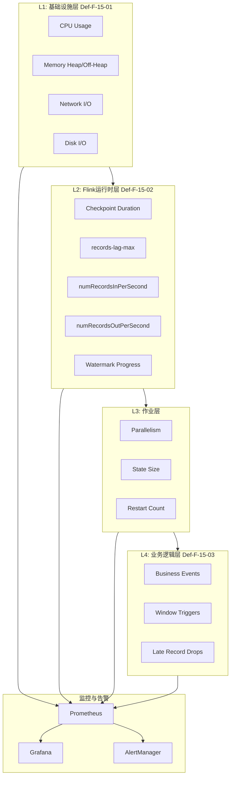
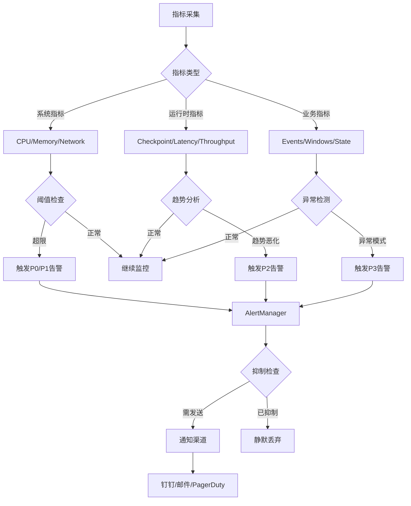
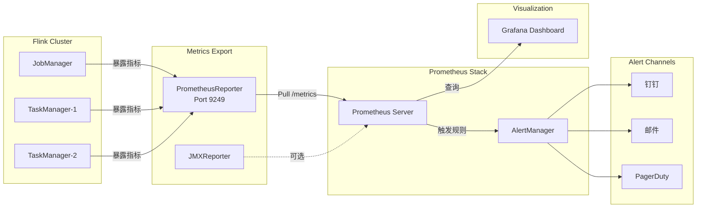

# Flink监控指标体系 - 从系统到业务

> 所属阶段: Flink | 前置依赖: [12-fault-tolerance/checkpoint-mechanism.md](../12-fault-tolerance/checkpoint-mechanism.md) | 形式化等级: L3

## 1. 概念定义 (Definitions)

### Def-F-15-01: 系统指标 (System Metrics)

系统指标描述Flink集群运行所依赖的基础设施资源状态，包括但不限于：

- **CPU利用率** (`system.CPU.usage`): 作业管理器(JM)和任务管理器(TM)的CPU使用率百分比
- **内存占用** (`system.memory.*`): 堆内存、非堆内存、直接内存的使用量和限制
- **网络I/O** (`system.network.*`): 网络收发字节数、连接数、TCP状态
- **磁盘I/O** (`system.disk.*`): 磁盘读写速率、磁盘空间使用率
- **线程状态** (`system.thread-count`): JVM线程总数及状态分布

系统指标由Flink的`SystemMetricsReporter`通过JMX或自定义Reporter采集，采样间隔默认为10秒。

### Def-F-15-02: Flink运行时指标 (Runtime Metrics)

Flink运行时指标反映流处理引擎的核心运行状态：

- **Checkpoint指标**
  - `checkpointDuration`: 单次Checkpoint完成耗时
  - `checkpointSize`: Checkpoint状态数据大小
  - `numFailedCheckpoints`: 失败Checkpoint次数
  - `lastCheckpointRestoreTimestamp`: 最近一次恢复时间

- **延迟指标**
  - `records-lag-max`: 消费者最大消费延迟（Kafka等源）
  - `currentOutputWatermark`: 当前输出水位线
  - `latency`: 端到端处理延迟（需配置LatencyMarker）

- **吞吐指标**
  - `numRecordsInPerSecond`: 每秒输入记录数
  - `numRecordsOutPerSecond`: 每秒输出记录数
  - `numBytesInPerSecond`: 每秒输入字节数
  - `numBytesOutPerSecond`: 每秒输出字节数

### Def-F-15-03: 业务指标 (Business Metrics)

业务指标与具体作业逻辑相关，通过自定义`MetricGroup`注册：

- **事件处理指标**
  - 业务事件计数（如订单数、点击数）
  - 特定事件类型分布
  - 无效/异常事件比例

- **窗口指标**
  - `windowTriggerCount`: 窗口触发次数
  - `windowEmitCount`: 窗口输出记录数
  - `windowLateRecordDropCount`: 迟到记录丢弃数

- **状态访问指标**
  - 状态读取/写入延迟
  - 状态大小变化率
  - TTL过期记录数

### Def-F-15-04: 健康度评分 (Health Score)

健康度评分是对作业整体运行状况的量化评估：

$$
H(s) = w_1 \cdot f_{checkpoint}(s) + w_2 \cdot f_{throughput}(s) + w_3 \cdot f_{latency}(s) + w_4 \cdot f_{error}(s)
$$

其中：

- $H(s) \in [0, 1]$，1表示完全健康
- $w_1 + w_2 + w_3 + w_4 = 1$ 为权重系数
- $f_{checkpoint}(s)$: Checkpoint成功率评分
- $f_{throughput}(s)$: 吞吐稳定性评分
- $f_{latency}(s)$: 延迟合规评分
- $f_{error}(s)$: 错误率评分

---

## 2. 属性推导 (Properties)

### Prop-F-15-01: 指标层次依赖关系

**命题**: 上层指标异常必然导致或反映下层指标异常。

形式化表述：
$$
\forall m_i \in \text{Layer}_k, m_j \in \text{Layer}_{k+1}: \text{Abnormal}(m_j) \Rightarrow \exists m_i: \text{Correlated}(m_i, m_j)
$$

**证明概要**:

- 业务层延迟增加（Def-F-15-03）$
ightarrow$ 运行时层`records-lag-max`增加（Def-F-15-02）
- 运行时层Checkpoint超时（Def-F-15-02）$
ightarrow$ 系统层GC时间过长或内存不足（Def-F-15-01）

### Prop-F-15-02: 关键指标阈值敏感性

**命题**: `records-lag-max`与`checkpointDuration`对系统稳定性具有非线性敏感特性。

设$L$为延迟，`$T_{checkpoint}$`为Checkpoint间隔，当：
$$
\text{records-lag-max} > \alpha \cdot T_{checkpoint} \quad (\alpha \approx 0.3)
$$

系统进入**不稳定区域**，此时即使输入速率稳定，也可能因反压累积导致级联故障。

### Prop-F-15-03: 健康度评分单调性

**命题**: 健康度评分$H(s)$在系统稳定运行时保持局部连续性，在故障发生时呈现阶跃下降。

形式化：
$$
\frac{dH}{dt} \approx 0 \text{ (稳定期)} \quad \text{vs} \quad \Delta H < -\theta \text{ (故障期)}
$$

---

## 3. 关系建立 (Relations)

### 3.1 指标层次架构

Flink监控指标体系采用四层架构模型：

| 层次 | 指标类型 | 采集频率 | 响应时效 | 典型使用者 |
|------|----------|----------|----------|------------|
| L1: 基础设施层 | Def-F-15-01 | 10-60s | 分钟级 | SRE/运维 |
| L2: Flink运行时层 | Def-F-15-02 | 1-10s | 秒级 | 平台工程师 |
| L3: 作业层 | 作业配置/资源 | 按需 | 分钟级 | 作业开发者 |
| L4: 业务逻辑层 | Def-F-15-03 | 事件驱动 | 实时 | 业务分析师 |

### 3.2 指标关联图谱

关键指标间的因果关系：

```
系统指标(Def-F-15-01)
    │
    ├── CPU高 ──→ TM心跳超时 ──→ Task失败
    │
    ├── 内存不足 ──→ Full GC ──→ Checkpoint超时
    │
    └── 网络拥塞 ──→ 反压传播 ──→ 延迟增加

运行时指标(Def-F-15-02)
    │
    ├── records-lag-max ──→ 消费者滞后 ──→ 数据丢失风险
    │
    ├── checkpointDuration ──→ 恢复时间增加
    │
    └── numRecordsIn/Out ──→ 吞吐评估

业务指标(Def-F-15-03)
    │
    ├── 窗口触发异常 ──→ 业务延迟感知
    │
    └── 状态访问慢 ──→ 处理延迟增加
```

### 3.3 指标到健康度的映射

$$
\text{Health}(s) = g\left(\bigcup_{i=1}^{4} \text{Metrics}_i(s)\right)
$$

其中$g$为聚合函数，支持加权平均、最小值、或基于机器学习的异常检测模型。

---

## 4. 论证过程 (Argumentation)

### 4.1 告警策略对比分析

#### 阈值告警 (Threshold-based)

**原理**: 设定固定上下限，超限即触发。

**适用场景**:

- 资源类指标（CPU > 80%）
- 绝对错误指标（失败次数 > 0）

**局限性**:

- 无法适应负载波动
- 易产生误报（如日常高峰期的CPU上升）

#### 趋势告警 (Trend-based)

**原理**: 基于时间序列预测，检测偏离趋势的程度。

**算法**:
$$
\text{Alert} = |x_t - \hat{x}_t| > k \cdot \sigma_t
$$

其中$\hat{x}_t$为预测值，$\sigma_t$为预测标准差。

**适用场景**:

- 延迟指标的趋势恶化
- 吞吐的渐进式下降

#### 异常检测 (Anomaly Detection)

**原理**: 使用统计或机器学习方法识别异常模式。

**方法**:

- **统计方法**: 3-sigma原则、IQR
- **机器学习方法**: Isolation Forest、LSTM预测

**适用场景**:

- 复杂多维指标的联合异常
- 无明确阈值的业务指标

### 4.2 指标采集方式对比

| 方式 | 实现 | 优点 | 缺点 |
|------|------|------|------|
| JMX | 内置 | 无需额外依赖 | 性能开销大 |
| Prometheus PushGateway | 外置Reporter | 云原生友好 | 需要额外组件 |
| InfluxDB | 内置Reporter | 时序存储优化 | 依赖外部存储 |
| REST API | Flink Web UI | 即查即用 | 不适合高频采集 |

---

## 5. 工程论证 (Engineering Argument)

### 5.1 Prometheus + Grafana 监控方案论证

**架构选择理由**:

1. **Prometheus Pull模型**: Flink通过`PrometheusReporter`暴露`/metrics`端点，Prometheus主动拉取，避免Push模式在网络分区时的数据丢失。

2. **时序数据存储**: Prometheus的TSDB针对指标数据优化，支持高效的范围查询和聚合运算。

3. **Grafana可视化**: 支持PromQL查询，提供丰富的图表类型和告警配置。

### 5.2 关键指标采集配置

```yaml
# flink-conf.yaml 配置示例
metrics.reporters: prom
metrics.reporter.prom.class: org.apache.flink.metrics.prometheus.PrometheusReporter
metrics.reporter.prom.port: 9249
metrics.reporter.prom.filter.includes: "*checkpoint*,*records*,*lag*,*latency*"
```

**论证**:

- 端口9249为标准Prometheus exporter端口
- 过滤器减少不必要的指标传输，降低存储成本

### 5.3 告警规则设计原则

**原则1: 分层告警**

```
P0 (Critical): 作业失败、Checkpoint连续失败、数据丢失
P1 (High):     延迟超过SLA、资源使用率持续高位
P2 (Medium):   单点性能退化、非关键错误增加
P3 (Low):      趋势预警、容量规划提示
```

**原则2: 告警抑制**

- 父问题抑制子告警（如作业失败时抑制所有Task级告警）
- 静默期避免重复告警

---

## 6. 实例验证 (Examples)

### 6.1 典型指标PromQL查询

```promql
# 每秒输入记录数
flink_taskmanager_job_task_operator_numRecordsInPerSecond

# Checkpoint持续时间（分位数）
histogram_quantile(0.99,
  sum(rate(flink_jobmanager_checkpoint_duration_time[5m])) by (le)
)

# 消费者延迟
kafka_consumer_records_lag_max{job="flink-consumer"}

# 端到端延迟（自定义指标）
flink_taskmanager_job_task_operator_latency_histogram_max
```

### 6.2 Grafana仪表盘配置片段

```json
{
  "dashboard": {
    "title": "Flink作业健康度看板",
    "panels": [
      {
        "title": "吞吐指标",
        "targets": [
          {
            "expr": "sum(rate(flink_taskmanager_job_task_numRecordsInPerSecond[1m]))",
            "legendFormat": "输入速率"
          },
          {
            "expr": "sum(rate(flink_taskmanager_job_task_numRecordsOutPerSecond[1m]))",
            "legendFormat": "输出速率"
          }
        ],
        "type": "graph"
      }
    ]
  }
}
```

### 6.3 健康度评分计算示例

```java
// 自定义MetricReporter实现健康度评分
public class HealthScoreReporter implements MetricReporter {
    private static final double W_CHECKPOINT = 0.4;
    private static final double W_THROUGHPUT = 0.3;
    private static final double W_LATENCY = 0.2;
    private static final double W_ERROR = 0.1;

    public double calculateHealthScore(JobMetrics metrics) {
        double checkpointScore = metrics.getCheckpointSuccessRate();
        double throughputScore = normalize(metrics.getRecordsPerSecond(), BASELINE);
        double latencyScore = 1.0 - normalize(metrics.getLatencyMs(), SLA_THRESHOLD);
        double errorScore = 1.0 - metrics.getErrorRate();

        return W_CHECKPOINT * checkpointScore
             + W_THROUGHPUT * throughputScore
             + W_LATENCY * latencyScore
             + W_ERROR * errorScore;
    }
}
```

---

## 7. 可视化 (Visualizations)

### 7.1 Flink监控指标层次图

Flink监控体系从基础设施到业务逻辑的四层架构：



### 7.2 指标关联与告警决策树

从异常检测到告警触发的完整决策流程：



### 7.3 Prometheus + Grafana 监控架构图

Flink监控系统的完整数据流架构：



---

## 8. 引用参考 (References)
