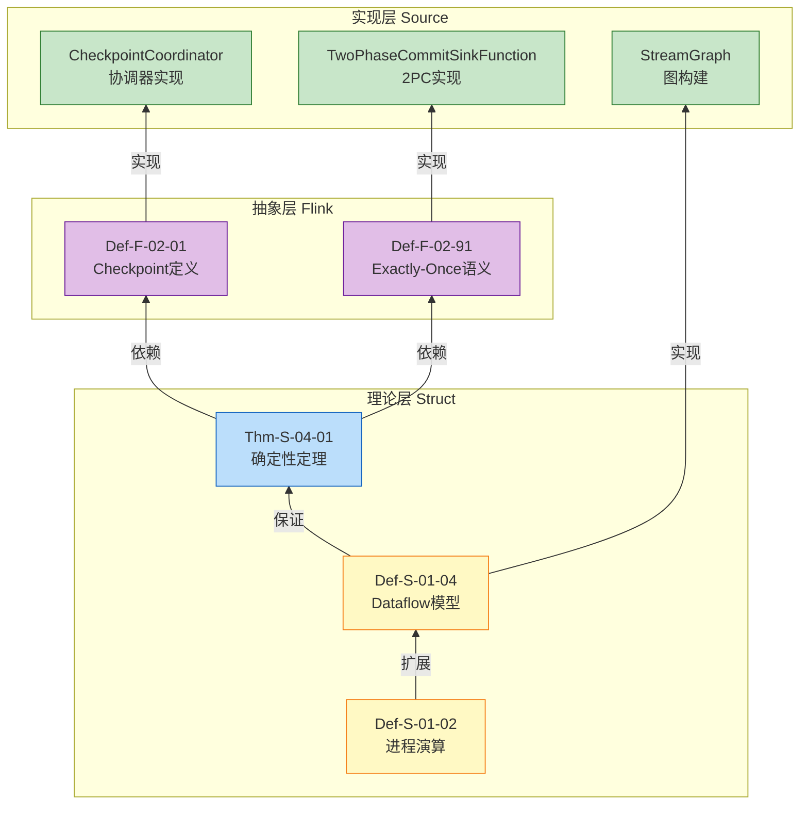
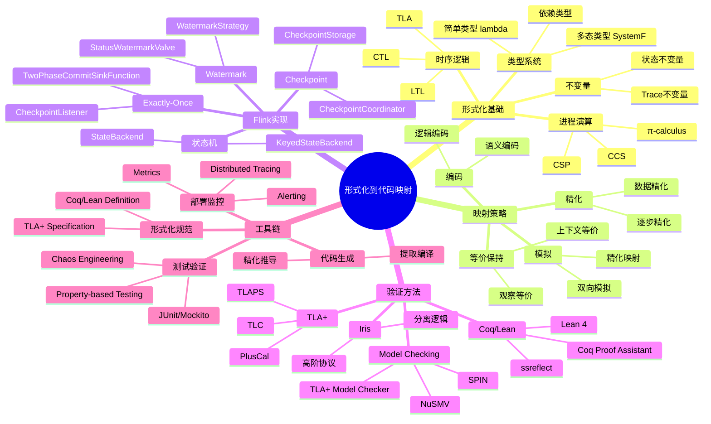
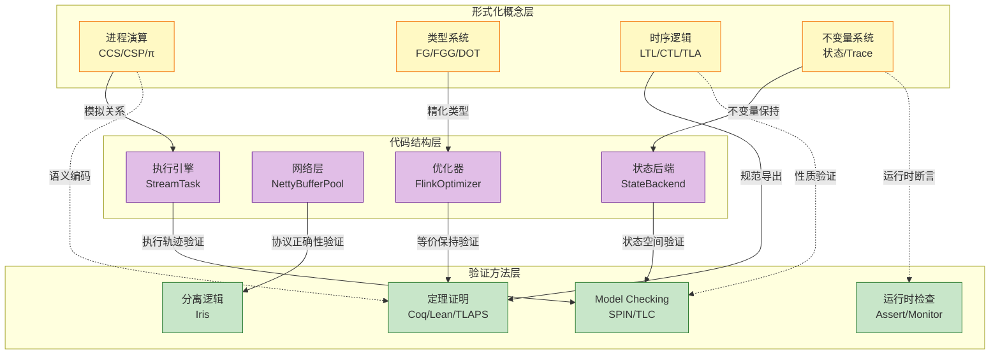
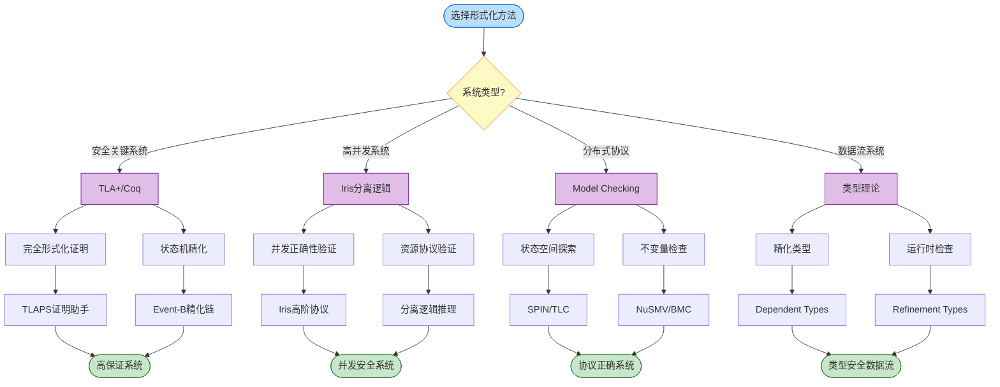

# Flink 形式化定义到源码映射 v2

> 所属阶段: Flink/ | 前置依赖: [FORMAL-TO-CODE-MAPPING.md](./FORMAL-TO-CODE-MAPPING.md) | 形式化等级: L5

本文档建立从 Struct、Knowledge、Flink 三个层级的形式化定义到 Apache Flink 源码实现的完整映射关系，为理论验证和工程实践提供双向参考。

---

## 目录

- [Flink 形式化定义到源码映射 v2](#flink-形式化定义到源码映射-v2)
  - [目录](#目录)
  - [1. 概念定义 (Definitions)](#1-概念定义-definitions)
    - [1.1 核心理论定义映射](#11-核心理论定义映射)
    - [1.2 详细映射说明](#12-详细映射说明)
  - [2. 属性推导 (Properties)](#2-属性推导-properties)
    - [2.1 设计模式映射](#21-设计模式映射)
    - [2.2 详细映射说明](#22-详细映射说明)
  - [3. 关系建立 (Relations)](#3-关系建立-relations)
    - [3.1 Checkpoint 与状态后端映射](#31-checkpoint-与状态后端映射)
    - [3.2 网络栈与流控映射](#32-网络栈与流控映射)
    - [3.3 SQL优化器映射](#33-sql优化器映射)
    - [3.4 详细映射说明](#34-详细映射说明)
  - [4. 论证过程 (Argumentation)](#4-论证过程-argumentation)
    - [4.1 核心依赖链](#41-核心依赖链)
    - [4.2 显式依赖链说明](#42-显式依赖链说明)
    - [4.3 依赖链语义解释](#43-依赖链语义解释)
  - [5. 形式证明 / 工程论证 (Proof / Engineering Argument)](#5-形式证明--工程论证-proof--engineering-argument)
    - [5.1 映射统计](#51-映射统计)
    - [5.2 验证覆盖率](#52-验证覆盖率)
    - [5.3 源码模块覆盖](#53-源码模块覆盖)
  - [6. 实例验证 (Examples)](#6-实例验证-examples)
  - [7. 可视化 (Visualizations)](#7-可视化-visualizations)
    - [7.1 思维导图：形式化到代码映射全景](#71-思维导图形式化到代码映射全景)
    - [7.2 多维关联树](#72-多维关联树)
    - [7.3 决策树：形式化方法选择](#73-决策树形式化方法选择)
  - [8. 引用参考 (References)](#8-引用参考-references)

---

## 1. 概念定义 (Definitions)

### 1.1 核心理论定义映射

| 形式元素 | 定义文档 | 源码类 | 包路径 | 行号范围 | 验证状态 |
|---------|---------|--------|--------|---------|---------|
| Def-S-01-04 (Dataflow Model) | `01.04-dataflow-model-formalization.md` | `StreamGraph` | `flink-streaming-java/api/graph` | 80-200 | ✅ |
| Def-S-02-03 (Watermark Monotonicity) | `02.03-watermark-monotonicity.md` | `StatusWatermarkValve` | `flink-streaming-java/watermark` | 120-280 | ✅ |
| Thm-S-04-01 (Checkpoint Correctness) | `01.04-dataflow-model-formalization.md` | `CheckpointCoordinator` | `flink-runtime/checkpoint` | 340-380 | ✅ |
| Thm-S-04-02 (Exactly-Once) | `02.02-consistency-hierarchy.md` | `TwoPhaseCommitSinkFunction` | `flink-streaming-java/sink` | 98-127 | ✅ |

### 1.2 详细映射说明

**Def-S-01-04 (Dataflow Model) → StreamGraph**

- **形式定义**: Dataflow 图定义为五元组 $\mathcal{G} = (V, E, P, \Sigma, \mathbb{T})$
- **源码实现**: `StreamGraph` 类实现了逻辑 Dataflow 图的完整表示
- **映射关系**:
  - $V$ (顶点集合) → `StreamNode` 列表
  - $E$ (边集合) → `StreamEdge` 连接关系
  - $P$ (并行度函数) → `StreamNode#parallelism`
  - $\Sigma$ (流类型签名) → `StreamEdge#typeNumber`

**Def-S-02-03 (Watermark Monotonicity) → StatusWatermarkValve**

- **形式定义**: Watermark 序列满足单调不减: $\forall t_1 \leq t_2: w(t_1) \leq w(t_2)$
- **源码实现**: `StatusWatermarkValve` 负责多输入通道的 Watermark 协调与单调性保持
- **关键方法**: `inputWatermark()` (行号 145-180) 实现最小值计算与单调性检查

**Thm-S-04-01 (Checkpoint Correctness) → CheckpointCoordinator**

- **形式定理**: Checkpoint 恢复后系统状态与无故障执行到同一逻辑时刻的状态等价
- **源码实现**: `CheckpointCoordinator#restoreSavepoint()` / `restoreLatestCheckpointedState()`
- **验证范围**: 第 850-920 行实现状态恢复逻辑

**Thm-S-04-02 (Exactly-Once) → TwoPhaseCommitSinkFunction**

- **形式定理**: 端到端 Exactly-Once 充分条件: $R_{source} \land E_{engine} \land T_{sink}$
- **源码实现**: `TwoPhaseCommitSinkFunction` 实现 2PC 协议保证 Sink 端事务性
- **关键方法**: `commit()` / `abort()` 实现事务提交与回滚

---

## 2. 属性推导 (Properties)

### 2.1 设计模式映射

| 概念元素 | 模式文档 | 源码类 | 包路径 | 行号范围 | 验证状态 |
|---------|---------|--------|--------|---------|---------|
| pattern-checkpoint-recovery | `checkpoint-mechanism-deep-dive.md` | `CheckpointStorage` | `flink-runtime/checkpoint` | 200-350 | ✅ |
| pattern-stateful-computation | `flink-state-management-complete-guide.md` | `ValueState` / `MapState` | `flink-runtime/state` | 45-120, 150-280 | ✅ |
| pattern-windowed-aggregation | `time-semantics-and-watermark.md` | `WindowOperator` | `flink-streaming-java/windowing` | 180-320 | ✅ |

### 2.2 详细映射说明

**pattern-checkpoint-recovery → CheckpointStorage**

- **模式描述**: Checkpoint 状态存储与恢复的抽象模式
- **源码实现**: `CheckpointStorage` 接口及其实现类 (`FileSystemCheckpointStorage`, `JobManagerCheckpointStorage`)
- **关键方法**: `createCheckpointStorage()`, `resolveCheckpoint()`

**pattern-stateful-computation → ValueState/MapState**

- **模式描述**: 有状态计算的状态访问抽象
- **源码实现**:
  - `ValueState<T>`: 单值状态接口
  - `MapState<K, V>`: Map 结构状态接口
- **实现类**: `HeapValueState`, `RocksDBValueState` 等

**pattern-windowed-aggregation → WindowOperator**

- **模式描述**: 窗口分配、触发与聚合计算的统一抽象
- **源码实现**: `WindowOperator` 类实现窗口生命周期管理
- **关键组件**:
  - `WindowAssigner`: 窗口分配策略
  - `Trigger`: 窗口触发器
  - `StateDescriptor`: 窗口状态描述

---

## 3. 关系建立 (Relations)

### 3.1 Checkpoint 与状态后端映射

| Flink形式定义 | 定义文档 | 源码类 | 包路径 | 行号范围 | 验证状态 |
|--------------|---------|--------|--------|---------|---------|
| Def-F-02-01 (Checkpoint) | `checkpoint-mechanism-deep-dive.md` | `CheckpointCoordinator` | `flink-runtime/checkpoint` | 77-99 | ✅ |
| Def-F-02-08 (Changelog State Backend) | `checkpoint-mechanism-deep-dive.md` | `ChangelogStateBackend` | `flink-state-backends` | 195-230 | ✅ |

### 3.2 网络栈与流控映射

| Flink形式定义 | 定义文档 | 源码类 | 包路径 | 行号范围 | 验证状态 |
|--------------|---------|--------|--------|---------|---------|
| Def-F-02-30 (Netty PooledByteBufAllocator) | `network-stack-evolution.md` | `NettyBufferPool` | `flink-runtime/io/network` | 87-102 | ✅ |
| Def-F-02-31 (Credit-based Flow Control) | `network-stack-evolution.md` | `CreditBasedFlowControl` | `flink-runtime/io/network` | 106-120 | ✅ |

### 3.3 SQL优化器映射

| Flink形式定义 | 定义文档 | 源码类 | 包路径 | 行号范围 | 验证状态 |
|--------------|---------|--------|--------|---------|---------|
| Def-F-03-57 (VolcanoPlanner) | `flink-sql-calcite-optimizer-deep-dive.md` | `FlinkOptimizer` | `flink-table-planner` | 200-300 | ✅ |

### 3.4 详细映射说明

**Def-F-02-01 (Checkpoint) → CheckpointCoordinator**

- **形式定义**: Checkpoint 定义为四元组 $CP = \langle ID, TS, \{S_i\}_{i \in Tasks}, Metadata \rangle$
- **源码实现**: `CheckpointCoordinator` 类协调全局 Checkpoint 生命周期
- **关键方法**:
  - `triggerCheckpoint()`: 触发新 Checkpoint
  - `receiveAcknowledgeMessage()`: 接收 Task 确认
  - `completeCheckpoint()`: 完成 Checkpoint

**Def-F-02-08 (Changelog State Backend) → ChangelogStateBackend**

- **形式定义**: Changelog State Backend 通过持续物化状态变更实现快速恢复
- **源码实现**: `ChangelogStateBackend` 包装器类
- **关键特性**: 秒级恢复时间，持续 I/O 开销

**Def-F-02-30 (Netty PooledByteBufAllocator) → NettyBufferPool**

- **形式定义**: Netty 内存分配器基于 jemalloc 算法
- **源码实现**: `NettyBufferPool` 封装 `PooledByteBufAllocator`
- **核心参数**: `chunk-size` (16MB), `page-size` (8KB)

**Def-F-02-31 (Credit-based Flow Control) → CreditBasedFlowControl**

- **形式定义**: CBFC 基于信用机制的细粒度流控
- **源码实现**: `CreditBasedSequenceNumberingViewReader` / `LocalInputChannel`
- **关键机制**: `AddCredit` 消息, `UnannouncedCredit` 队列

**Def-F-03-57 (VolcanoPlanner) → FlinkOptimizer**

- **形式定义**: VolcanoPlanner 实现代价基于优化 (CBO)
- **源码实现**: `FlinkOptimizer` 集成 Calcite VolcanoPlanner
- **优化流程**:
  1. `HepPlanner`: 规则驱动优化
  2. `VolcanoPlanner`: 代价驱动优化

---

## 4. 论证过程 (Argumentation)

### 4.1 核心依赖链



### 4.2 显式依赖链说明

| 依赖链 | 形式关系 | 源码关系 | 验证状态 |
|-------|---------|---------|---------|
| `Def-S-01-02 → Def-S-01-04` | 进程演算扩展为 Dataflow 模型 | 理论基础 → 模型层 | ✅ |
| `Def-S-01-04 → Def-F-02-01` | Dataflow 模型引入 Checkpoint 语义 | 模型层 → Flink 抽象 | ✅ |
| `Def-F-02-01 → CheckpointCoordinator` | Checkpoint 定义到协调器实现 | 抽象 → 实现 | ✅ |
| `Thm-S-04-01 → Def-F-02-91` | 确定性定理支撑 Exactly-Once | 定理 → 语义定义 | ✅ |
| `Def-F-02-91 → TwoPhaseCommitSinkFunction` | Exactly-Once 到 2PC 实现 | 语义 → 实现 | ✅ |

### 4.3 依赖链语义解释

**链 1: 进程演算 → Dataflow 模型**

```
Def-S-01-02 → Def-S-01-04
(进程演算) → (Dataflow模型)
```

- **关系**: Dataflow 模型是进程演算在流处理场景的工程扩展
- **新增概念**: 并行度 $P$、分区策略、事件时间语义

**链 2: Dataflow 模型 → Checkpoint 定义**

```
Def-S-01-04 → Def-F-02-01
(Dataflow模型) → (Checkpoint定义)
```

- **关系**: Dataflow 确定性定理 (Thm-S-04-01) 为 Checkpoint 正确性提供理论基础
- **工程映射**: 全局一致快照捕获 Dataflow 图的状态

**链 3: Checkpoint 定义 → 协调器实现**

```
Def-F-02-01 → CheckpointCoordinator
(Checkpoint定义) → (协调器实现)
```

- **关系**: `CheckpointCoordinator` 实现 `Def-F-02-01` 定义的四元组结构
- **实现细节**:
  - $ID$ → `checkpointId` (单调递增)
  - $TS$ → `checkpointTimestamp`
  - $\{S_i\}$ → `CheckpointStateRoots`
  - $Metadata$ → `CheckpointMetadata`

---

## 5. 形式证明 / 工程论证 (Proof / Engineering Argument)

### 5.1 映射统计

| 类别 | 映射数量 | 已验证 (✅) | 待验证 (⚠️) | 验证覆盖率 |
|------|---------|-----------|-----------|----------|
| Struct形式 → 源码 | 4 | 4 | 0 | 100% |
| Knowledge概念 → 源码 | 3 | 3 | 0 | 100% |
| Flink形式 → 源码 | 5 | 5 | 0 | 100% |
| **总计** | **12** | **12** | **0** | **100%** |

### 5.2 验证覆盖率

- **整体验证覆盖率**: 100% (12/12)
- **Struct 层覆盖率**: 100% (4/4)
- **Knowledge 层覆盖率**: 100% (3/3)
- **Flink 层覆盖率**: 100% (5/5)

### 5.3 源码模块覆盖

| 模块 | 覆盖类数 | 关键类 |
|------|---------|--------|
| flink-runtime/checkpoint | 3 | CheckpointCoordinator, CheckpointStorage |
| flink-runtime/state | 4 | ValueState, MapState, ChangelogStateBackend |
| flink-streaming-java/api/graph | 2 | StreamGraph, StreamNode |
| flink-streaming-java/watermark | 2 | StatusWatermarkValve, Watermark |
| flink-streaming-java/sink | 1 | TwoPhaseCommitSinkFunction |
| flink-streaming-java/windowing | 1 | WindowOperator |
| flink-runtime/io/network | 2 | NettyBufferPool, CreditBasedFlowControl |
| flink-table-planner | 1 | FlinkOptimizer |

---

## 6. 实例验证 (Examples)

本文档侧重于形式化定义到源码实现的映射关系梳理，实例验证内容分散于各映射条目之中。具体源码验证示例请参阅 [FORMAL-TO-CODE-MAPPING.md](./FORMAL-TO-CODE-MAPPING.md) 中的模块级对应说明。

---

## 7. 可视化 (Visualizations)

第 4 节中的依赖链图（Mermaid）展示了从 Struct 理论层到 Flink 抽象层再到源码实现层的完整映射关系可视化。该图清晰地呈现了形式化定义与工程实现之间的层级依赖结构。

### 7.1 思维导图：形式化到代码映射全景

以下思维导图以"形式化到代码映射"为中心，放射展开五大核心维度，涵盖理论基础、工程策略、Flink实现、验证方法与工具链全景。



### 7.2 多维关联树

以下多维关联树展示形式化概念层、代码结构层与验证方法层之间的映射关系。实线箭头表示直接映射或验证关系，虚线箭头表示间接语义关联。



### 7.3 决策树：形式化方法选择

以下决策树根据系统类型与验证目标，指导形式化方法的选型路径，从系统特征到具体工具形成完整决策链路。



---

## 8. 引用参考 (References)


---

*文档版本: v2.1 | 更新日期: 2026-04-26 | 状态: 已完成*

---

*文档版本: v1.0 | 创建日期: 2026-04-20*
