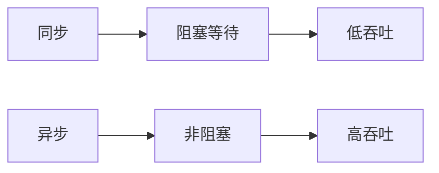

# 异步API演进 特性跟踪

> 所属阶段: Flink/api-evolution | 前置依赖: [Async I/O][^1] | 形式化等级: L3

## 1. 概念定义 (Definitions)

### Def-F-Async-01: Async Operation

异步操作：
$$
\text{Async} : \text{Input} \to \text{Future}<\text{Output}>
$$

### Def-F-Async-02: Ordering Guarantee

排序保证：
$$
\text{Order} \in \{\text{Ordered}, \text{Unordered}, \text{AllowedLateness}\}
$$

## 2. 属性推导 (Properties)

### Prop-F-Async-01: Throughput Gain

吞吐量提升：
$$
\text{Throughput}_{\text{async}} \gg \text{Throughput}_{\text{sync}}
$$

## 3. 关系建立 (Relations)

### 异步API演进

| 版本 | 特性 | 状态 |
|------|------|------|
| 2.3 | 基础Async | GA |
| 2.4 | 批量Async | GA |
| 2.5 | 响应式集成 | GA |
| 3.0 | 原生异步 | 设计中 |

## 4. 论证过程 (Argumentation)

### 4.1 同步vs异步

| 特性 | 同步 | 异步 |
|------|------|------|
| 延迟 | 高 | 低 |
| 吞吐 | 低 | 高 |
| 复杂度 | 低 | 高 |
| 资源使用 | 阻塞 | 非阻塞 |

## 5. 形式证明 / 工程论证

### 5.1 批量异步

```java
AsyncDataStream.unorderedWait(
    stream,
    new RichAsyncFunction<String, String>() {
        @Override
        public void asyncInvoke(String input, ResultFuture<String> resultFuture) {
            batchClient.asyncRequest(List.of(input), resultFuture);
        }
    },
    1000, TimeUnit.MILLISECONDS, 100
);
```

## 6. 实例验证 (Examples)

### 6.1 异步数据库查询

```java
AsyncFunction<Event, EnrichedEvent> enrich =
    new AsyncFunction<>() {
        @Override
        public void asyncInvoke(Event event, ResultFuture<EnrichedEvent> resultFuture) {
            database.asyncQuery(event.getId())
                .thenAccept(result -> resultFuture.complete(
                    Collections.singletonList(new EnrichedEvent(event, result))
                ));
        }
    };
```

## 7. 可视化 (Visualizations)



## 8. 引用参考 (References)

[^1]: Flink Async I/O Documentation

---

## 跟踪信息

| 属性 | 值 |
|------|-----|
| 版本 | 2.4-3.0 |
| 当前状态 | 演进中 |
