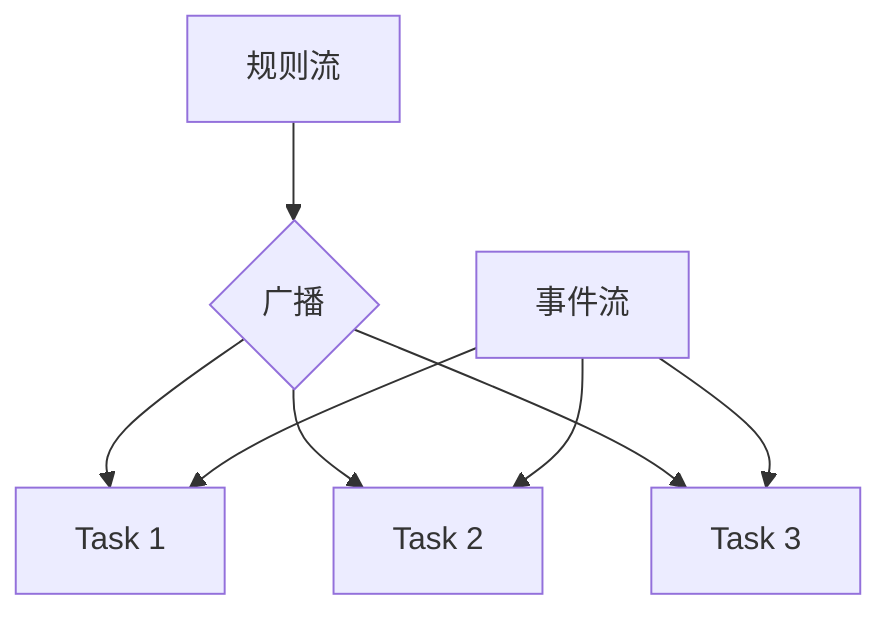

# 广播状态API 演进 特性跟踪

> 所属阶段: Flink/api-evolution | 前置依赖: [Broadcast State][^1] | 形式化等级: L3

## 1. 概念定义 (Definitions)

### Def-F-Bcast-01: Broadcast Stream

广播流：
$$
\text{Broadcast} : \text{Stream}<T> \to \forall \text{Subtask}
$$

### Def-F-Bcast-02: Broadcast State

广播状态：
$$
\text{BState} = \{ (k, v) \mid \forall \text{subtask} : \text{State}(k, v) \}
$$

## 2. 属性推导 (Properties)

### Prop-F-Bcast-01: State Consistency

状态一致性：
$$
\forall s_1, s_2 \in \text{Subtasks} : \text{BState}_{s_1} = \text{BState}_{s_2}
$$

## 3. 关系建立 (Relations)

### 广播状态演进

| 版本 | 特性 | 状态 |
|------|------|------|
| 2.3 | 基础广播 | GA |
| 2.4 | 状态校验 | GA |
| 2.5 | 增量广播 | GA |
| 3.0 | 智能广播 | 设计中 |

## 4. 论证过程 (Argumentation)

### 4.1 广播模式

| 模式 | 描述 |
|------|------|
| 规则广播 | 配置更新 |
| 维度广播 | 维度表 |
| 模型广播 | ML模型 |

## 5. 形式证明 / 工程论证

### 5.1 广播处理

```java
MapStateDescriptor<String, Rule> ruleStateDescriptor =
    new MapStateDescriptor<>("rules", String.class, Rule.class);

BroadcastStream<Rule> broadcastStream = ruleStream
    .broadcast(ruleStateDescriptor);

stream.connect(broadcastStream)
    .process(new KeyedBroadcastProcessFunction<>() {
        @Override
        public void processBroadcastElement(Rule rule, Context ctx, Collector<Result> out) {
            ctx.getBroadcastState(ruleStateDescriptor).put(rule.getId(), rule);
        }

        @Override
        public void processElement(Event event, ReadOnlyContext ctx, Collector<Result> out) {
            Rule rule = ctx.getBroadcastState(ruleStateDescriptor).get(event.getRuleId());
            out.collect(applyRule(event, rule));
        }
    });
```

## 6. 实例验证 (Examples)

### 6.1 动态规则引擎

```java
// 规则流广播到所有任务
DataStream<Rule> rules = env.socketTextStream("rules-server", 9999)
    .map(new RuleParser())
    .broadcast();

// 事件流处理
DataStream<Event> events = env.addSource(new EventSource());

events.connect(rules)
    .process(new DynamicRuleProcessor());
```

## 7. 可视化 (Visualizations)



## 8. 引用参考 (References)

[^1]: Flink Broadcast State Documentation

---

## 跟踪信息

| 属性 | 值 |
|------|-----|
| 版本 | 2.4-3.0 |
| 当前状态 | 演进中 |
