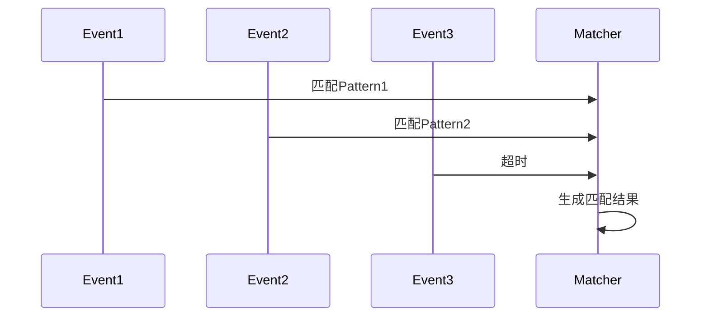

# CEP API 演进 特性跟踪

> 所属阶段: Flink/api-evolution | 前置依赖: [CEP][^1] | 形式化等级: L3

## 1. 概念定义 (Definitions)

### Def-F-CEP-01: Pattern

模式定义：
$$
\text{Pattern} = \langle \text{Events}, \text{Conditions}, \text{Transitions} \rangle
$$

### Def-F-CEP-02: Pattern Sequence

模式序列：
$$
\text{Seq} = \text{Pattern}_1 \to \text{Pattern}_2 \to ... \to \text{Pattern}_n
$$

## 2. 属性推导 (Properties)

### Prop-F-CEP-01: Pattern Completeness

模式匹配完整性：
$$
\forall \text{match} : \text{Pattern}(\text{match}) = \text{True}
$$

## 3. 关系建立 (Relations)

### CEP演进

| 版本 | 特性 | 状态 |
|------|------|------|
| 2.3 | 基础CEP | GA |
| 2.4 | 模式优化 | GA |
| 2.5 | 近似匹配 | GA |
| 3.0 | AI模式发现 | 设计中 |

## 4. 论证过程 (Argumentation)

### 4.1 模式类型

| 模式 | 描述 |
|------|------|
| next | 严格紧邻 |
| followedBy | 宽松跟随 |
| followedByAny | 非确定性 |
| within | 时间限制 |

## 5. 形式证明 / 工程论证

### 5.1 模式定义

```java
Pattern<Event, ?> pattern = Pattern.<Event>begin("start")
    .where(evt -> evt.getName().equals("login"))
    .next("middle")
    .where(evt -> evt.getName().equals("purchase"))
    .within(Time.seconds(10));
```

## 6. 实例验证 (Examples)

### 6.1 欺诈检测模式

```java
Pattern<Transaction, ?> fraud = Pattern
    .<Transaction>begin("first")
    .where(txn -> txn.getAmount() > 10000)
    .next("second")
    .where(txn -> txn.getLocation() != first.getLocation())
    .within(Time.minutes(5));
```

## 7. 可视化 (Visualizations)



## 8. 引用参考 (References)

[^1]: Flink CEP Documentation

---

## 跟踪信息

| 属性 | 值 |
|------|-----|
| 版本 | 2.4-3.0 |
| 当前状态 | 演进中 |
