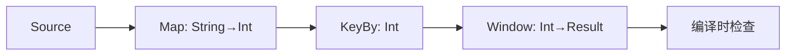

# DataStream API 2.5 演进 特性跟踪

> 所属阶段: Flink/api-evolution | 前置依赖: [DataStream 2.4][^1] | 形式化等级: L3

## 1. 概念定义 (Definitions)

### Def-F-DS25-01: Unified Transformation

统一转换抽象：
$$
\text{Transform} : \text{Stream}<T> \to \text{Stream}<R>
$$

### Def-F-DS25-02: Typed Connectors

类型安全连接器：
$$
\text{Connector}<T> : \text{Type}<T> \to \text{Source}<T> | \text{Sink}<T>
$$

## 2. 属性推导 (Properties)

### Prop-F-DS25-01: Type Safety

类型安全保证：
$$
\forall \text{op} \in \text{Pipeline} : \text{TypeCheck}(\text{op}) = \text{OK}
$$

## 3. 关系建立 (Relations)

### 2.5改进

| 特性 | 2.4 | 2.5 | 改进 |
|------|-----|-----|------|
| 类型推断 | 部分 | 完整 | + |
| 连接器类型 | 弱 | 强 | + |
| 算子链 | 手动 | 自动 | + |

## 4. 论证过程 (Argumentation)

### 4.1 类型安全演进

```java
// 2.5类型安全
DataStream<Order> orders = env
    .fromSource(new KafkaSource<Order>(), ...)
    .keyBy(Order::getUserId)
    .window(TumblingEventTimeWindows.of(Time.minutes(5)))
    .aggregate(new OrderAggregator()); // 编译时检查
```

## 5. 形式证明 / 工程论证

### 5.1 类型推断实现

```java
public class TypedDataStream<T> {

    public <R> TypedDataStream<R> map(SerializableFunction<T, R> mapper) {
        TypeInformation<R> returnType = TypeExtractor
            .getMapReturnTypes(mapper, this.typeInfo);
        return new TypedDataStream<>(
            new MapOperator<>(this.stream, mapper, returnType)
        );
    }
}
```

## 6. 实例验证 (Examples)

### 6.1 类型安全连接器

```java
KafkaSource<Order> source = KafkaSource.<Order>builder()
    .setTopics("orders")
    .setValueDeserializer(new OrderDeserializer())
    .build();
```

## 7. 可视化 (Visualizations)



## 8. 引用参考 (References)

[^1]: Flink DataStream API Guide

---

## 跟踪信息

| 属性 | 值 |
|------|-----|
| 目标版本 | Flink 2.5 |
| 当前状态 | GA |
