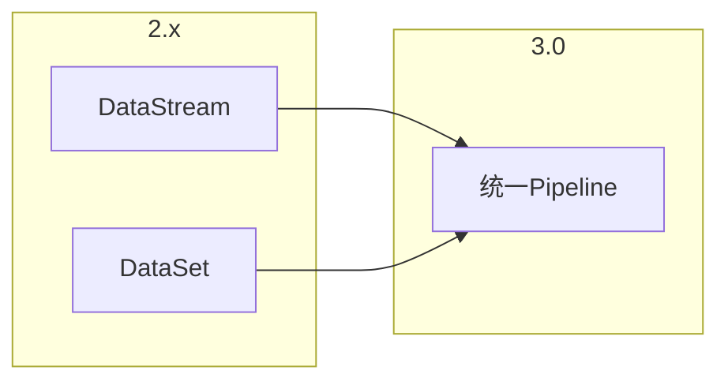

# DataStream API 3.0 演进 特性跟踪

> 所属阶段: Flink/api-evolution | 前置依赖: [DataStream 2.5][^1] | 形式化等级: L4

## 1. 概念定义 (Definitions)

### Def-F-DS30-01: Unified Pipeline

统一管道API：
$$
\text{Pipeline} = \text{Stream} \cup \text{Batch}
$$

### Def-F-DS30-02: Declarative DSL

声明式DSL：
$$
\text{DSL} : \text{Description} \to \text{Execution}
$$

## 2. 属性推导 (Properties)

### Prop-F-DS30-01: Mode Transparency

执行模式透明：
$$
\forall \text{Pipeline} : \text{SameCode}_{\text{stream}} = \text{SameCode}_{\text{batch}}
$$

## 3. 关系建立 (Relations)

### 3.0变革

| 特性 | 2.5 | 3.0 | 变更 |
|------|-----|-----|------|
| API | 分离 | 统一 | 重构 |
| DSL | 无 | 支持 | 新增 |
| 声明式 | 部分 | 完整 | 增强 |

## 4. 论证过程 (Argumentation)

### 4.1 统一API

```java
// 3.0统一API
Pipeline pipeline = Pipeline.builder()
    .source(Source.from("kafka"))
    .transform(Transform.window(5, MINUTES))
    .aggregate(Aggregation.sum())
    .sink(Sink.to("jdbc"))
    .build();

// 自动检测流批
pipeline.execute();
```

## 5. 形式证明 / 工程论证

### 5.1 统一API实现

```java
public class UnifiedPipeline<T> {

    public <R> UnifiedPipeline<R> transform(Transform<T, R> transform) {
        return new UnifiedPipeline<>(
            steps.add(new TransformStep<>(transform))
        );
    }

    public ExecutionResult execute() {
        ExecutionMode mode = detectMode(steps);
        return compiler.compile(steps, mode).execute();
    }
}
```

## 6. 实例验证 (Examples)

### 6.1 声明式定义

```java
@Pipeline(name = "order-processing")
public class OrderPipeline {

    @Source
    public Source<Order> orders() {
        return Source.kafka("orders");
    }

    @Transform
    public Result process(Order order) {
        return new Result(order);
    }
}
```

## 7. 可视化 (Visualizations)



## 8. 引用参考 (References)

[^1]: Flink DataStream API Guide

---

## 跟踪信息

| 属性 | 值 |
|------|-----|
| 目标版本 | Flink 3.0 |
| 当前状态 | 设计中 |
