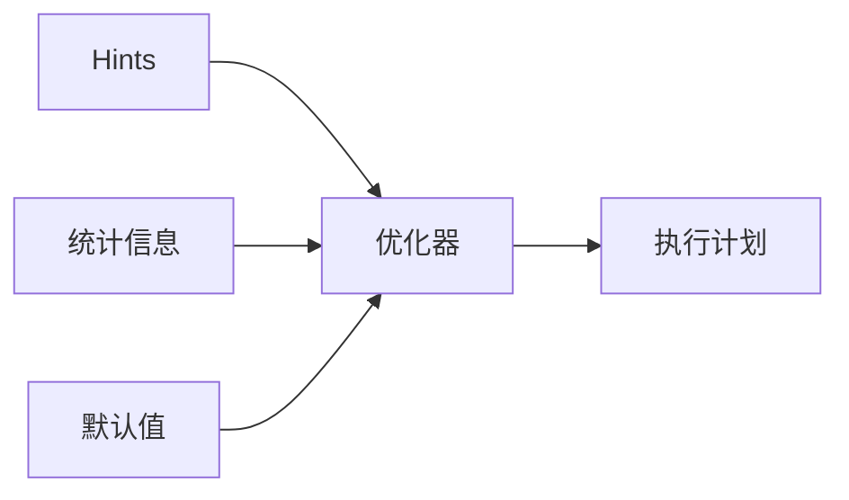

# SQL Hints 演进 特性跟踪

> 所属阶段: Flink/api-evolution | 前置依赖: [SQL Hints][^1] | 形式化等级: L3

## 1. 概念定义 (Definitions)

### Def-F-Hint-01: SQL Hint
SQL提示：
$$
\text{Hint} : \text{Query} \to \text{Optimizer} \to \text{Override}
$$

### Def-F-Hint-02: Hint Scope
提示作用域：
$$
\text{Scope} \in \{\text{Query}, \text{Table}, \text{Join}\}
$$

## 2. 属性推导 (Properties)

### Prop-F-Hint-01: Hint Precedence
提示优先级：
$$
\text{Hint} > \text{Statistics} > \text{Default}
$$

## 3. 关系建立 (Relations)

### Hints演进

| 版本 | 特性 | 状态 |
|------|------|------|
| 2.4 | 基础Hints | GA |
| 2.5 | 增强Hints | GA |
| 3.0 | 自适应Hints | 设计中 |

## 4. 论证过程 (Argumentation)

### 4.1 Hint类型

| Hint | 描述 |
|------|------|
| BROADCAST | 广播Join |
| REPARTITION | 重分区 |
| NO_COLLAPSE | 防止合并 |

## 5. 形式证明 / 工程论证

### 5.1 Hint语法

```sql
SELECT /*+ BROADCAST(small_table) */
    *
FROM large_table l
JOIN small_table s ON l.id = s.id;
```

## 6. 实例验证 (Examples)

### 6.1 组合Hints

```sql
SELECT /*+ BROADCAST(dim), REPARTITION(fact) */
    f.*, d.name
FROM fact f
JOIN dim d ON f.dim_id = d.id;
```

## 7. 可视化 (Visualizations)



## 8. 引用参考 (References)

[^1]: Flink SQL Hints Documentation

---

## 跟踪信息

| 属性 | 值 |
|------|-----|
| 版本 | 2.4-3.0 |
| 当前状态 | 演进中 |
