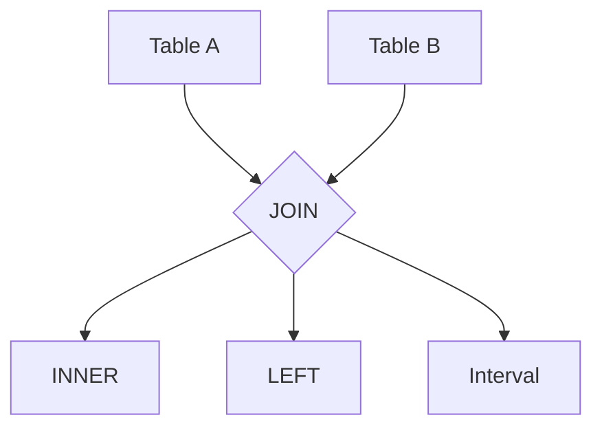

# JOIN SQL 演进 特性跟踪

> 所属阶段: Flink/api-evolution | 前置依赖: [JOIN Operations][^1] | 形式化等级: L3

## 1. 概念定义 (Definitions)

### Def-F-Join-01: Join Types

JOIN类型：
$$
\text{Joins} = \{\text{INNER}, \text{LEFT}, \text{RIGHT}, \text{FULL}, \text{CROSS}\}
$$

### Def-F-Join-02: Interval Join

区间JOIN：
$$
\text{IntervalJoin} : \text{Table}_1 \times \text{Table}_2 \times \text{Interval} \to \text{Result}
$$

## 2. 属性推导 (Properties)

### Prop-F-Join-01: Join Completeness

JOIN完整性：
$$
\forall r \in \text{Left} : \exists j \in \text{Join} \iff \text{Match}(r)
$$

## 3. 关系建立 (Relations)

### JOIN演进

| 版本 | 特性 | 状态 |
|------|------|------|
| 2.4 | 常规JOIN | GA |
| 2.4 | 区间JOIN | GA |
| 2.5 | 时态JOIN | GA |
| 2.5 | Lateral JOIN | GA |

## 4. 论证过程 (Argumentation)

### 4.1 JOIN类型

| JOIN | 描述 |
|------|------|
| Regular | 等值JOIN |
| Interval | 时间区间 |
| Temporal | 版本表 |
| Lookup | 维表 |

## 5. 形式证明 / 工程论证

### 5.1 区间JOIN

```sql
SELECT o.order_id, s.shipment_id
FROM orders o
JOIN shipments s
ON o.order_id = s.order_id
AND o.order_time BETWEEN s.ship_time - INTERVAL '1' HOUR
                     AND s.ship_time + INTERVAL '1' HOUR;
```

## 6. 实例验证 (Examples)

### 6.1 时态JOIN

```sql
SELECT
    o.order_id,
    o.amount * c.rate AS amount_usd
FROM orders o
JOIN currency_rates FOR SYSTEM_TIME AS OF o.order_time c
ON o.currency = c.currency;
```

## 7. 可视化 (Visualizations)



## 8. 引用参考 (References)

[^1]: Flink JOIN Documentation

---

## 跟踪信息

| 属性 | 值 |
|------|-----|
| 版本 | 2.4-3.0 |
| 当前状态 | 演进中 |
