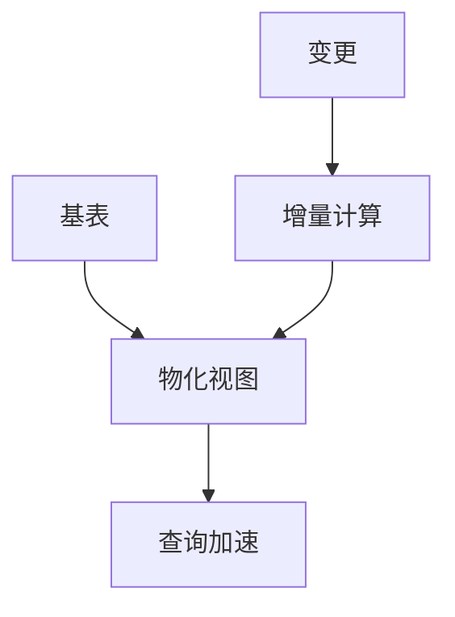

# 物化视图 SQL 演进 特性跟踪

> 所属阶段: Flink/api-evolution | 前置依赖: [Materialized Views][^1] | 形式化等级: L3

## 1. 概念定义 (Definitions)

### Def-F-MV-01: Materialized View
物化视图：
$$
\text{MV} = \text{Query}_{\text{def}} + \text{Result}_{\text{materialized}} + \text{Refresh}_{\text{policy}}
$$

### Def-F-MV-02: Incremental Refresh
增量刷新：
$$
\Delta \text{MV} = \text{Query}(\Delta \text{BaseTable})
$$

## 2. 属性推导 (Properties)

### Prop-F-MV-01: Consistency Guarantee
一致性保证：
$$
\text{MV} = \text{Query}(\text{BaseTable}) \pm \text{Lag}
$$

## 3. 关系建立 (Relations)

### 物化视图演进

| 版本 | 特性 | 状态 |
|------|------|------|
| 2.4 | 静态MV | GA |
| 2.5 | 增量刷新 | GA |
| 3.0 | 智能刷新 | 设计中 |

## 4. 论证过程 (Argumentation)

### 4.1 刷新策略

| 策略 | 描述 |
|------|------|
| IMMEDIATE | 立即刷新 |
| DEFERRED | 延迟刷新 |
| WATERMARK | 基于水位线 |

## 5. 形式证明 / 工程论证

### 5.1 物化视图创建

```sql
CREATE MATERIALIZED VIEW mv_daily_sales AS
SELECT 
    DATE(order_time) AS order_date,
    SUM(amount) AS total_sales
FROM orders
GROUP BY DATE(order_time)
WITH (
    'refresh.mode' = 'incremental',
    'refresh.trigger' = 'watermark'
);
```

## 6. 实例验证 (Examples)

### 6.1 查询物化视图

```sql
-- 自动路由到物化视图
SELECT order_date, total_sales
FROM mv_daily_sales
WHERE order_date >= CURRENT_DATE - INTERVAL '7' DAY;
```

## 7. 可视化 (Visualizations)



## 8. 引用参考 (References)

[^1]: Flink Materialized View Documentation

---

## 跟踪信息

| 属性 | 值 |
|------|-----|
| 版本 | 2.4-3.0 |
| 当前状态 | 演进中 |
