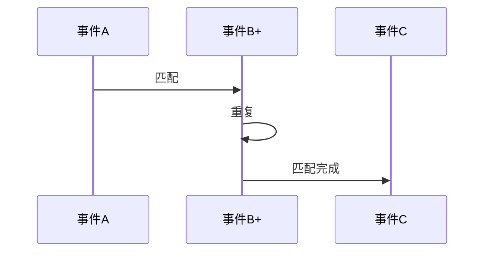

# 模式匹配 SQL 演进 特性跟踪

> 所属阶段: Flink/api-evolution | 前置依赖: [MATCH_RECOGNIZE][^1] | 形式化等级: L3

## 1. 概念定义 (Definitions)

### Def-F-Pat-01: Pattern Recognition

模式识别：
$$
\text{Pattern} : \text{Sequence} \to \{\text{Match}, \text{NoMatch}\}
$$

### Def-F-Pat-02: Pattern Variable

模式变量：
$$
\text{Var} = \langle \text{Name}, \text{Condition} \rangle
$$

## 2. 属性推导 (Properties)

### Prop-F-Pat-01: Pattern Completeness

模式完整性：
$$
\text{Pattern}(S) = \text{True} \iff S \models \text{Pattern}
$$

## 3. 关系建立 (Relations)

### 模式演进

| 版本 | 特性 | 状态 |
|------|------|------|
| 2.4 | MATCH_RECOGNIZE | GA |
| 2.5 | 复杂模式 | GA |
| 3.0 | AI模式发现 | 设计中 |

## 4. 论证过程 (Argumentation)

### 4.1 模式语法

| 元素 | 描述 |
|------|------|
| PATTERN | 模式序列 |
| DEFINE | 变量定义 |
| MEASURES | 输出度量 |
| AFTER MATCH | 匹配后策略 |

## 5. 形式证明 / 工程论证

### 5.1 模式匹配

```sql
SELECT *
FROM ticker
MATCH_RECOGNIZE (
    PARTITION BY symbol
    ORDER BY rowtime
    MEASURES
        A.price AS start_price,
        LAST(B.price) AS bottom_price,
        C.price AS end_price
    PATTERN (A B+ C)
    DEFINE
        A AS A.price > 100,
        B AS B.price < A.price,
        C AS C.price > B.price
);
```

## 6. 实例验证 (Examples)

### 6.1 欺诈检测模式

```sql
SELECT *
FROM transactions
MATCH_RECOGNIZE (
    PARTITION BY user_id
    ORDER BY transaction_time
    MEASURES
        A.amount AS first_amount,
        B.amount AS second_amount
    PATTERN (A B)
    DEFINE
        A AS A.amount > 10000,
        B AS B.amount > A.amount AND
             B.location <> A.location
);
```

## 7. 可视化 (Visualizations)



## 8. 引用参考 (References)

[^1]: Flink MATCH_RECOGNIZE Documentation

---

## 跟踪信息

| 属性 | 值 |
|------|-----|
| 版本 | 2.4-3.0 |
| 当前状态 | 演进中 |
