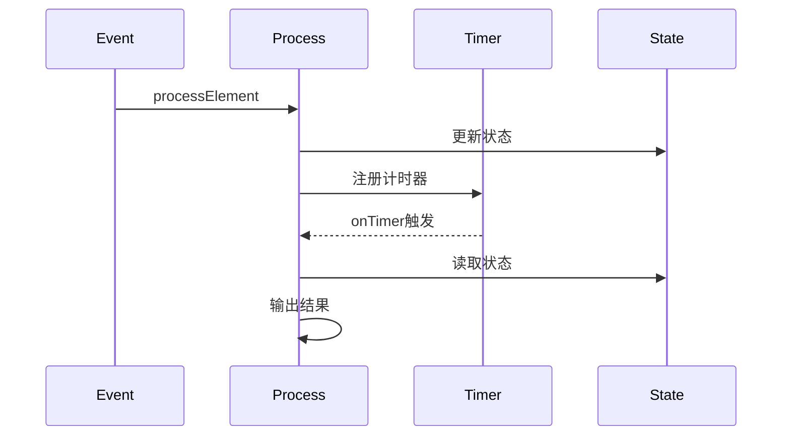

# ProcessFunction API 演进 特性跟踪

> 所属阶段: Flink/api-evolution | 前置依赖: [ProcessFunction][^1] | 形式化等级: L3

## 1. 概念定义 (Definitions)

### Def-F-Proc-01: ProcessFunction
处理函数：
$$
\text{ProcessFunction} : \langle \text{Input}, \text{Context}, \text{State} \rangle \to \text{Output}
$$

### Def-F-Proc-02: Timer
计时器：
$$
\text{Timer} : \text{Timestamp} \times \text{Callback} \to \text{Scheduled}
$$

## 2. 属性推导 (Properties)

### Prop-F-Proc-01: Timer Accuracy
计时器精度：
$$
|\text{FireTime} - \text{ScheduledTime}| \leq \epsilon
$$

## 3. 关系建立 (Relations)

### ProcessFunction演进

| 版本 | 特性 | 状态 |
|------|------|------|
| 2.3 | 基础Process | GA |
| 2.4 | 计时器优化 | GA |
| 2.5 | 批处理支持 | GA |
| 3.0 | 统一抽象 | 设计中 |

## 4. 论证过程 (Argumentation)

### 4.1 ProcessFunction类型

| 类型 | 用途 |
|------|------|
| ProcessFunction | 单流处理 |
| CoProcessFunction | 双流处理 |
| ProcessAllFunction | 非keyed处理 |
| KeyedProcessFunction | keyed处理 |

## 5. 形式证明 / 工程论证

### 5.1 KeyedProcessFunction

```java
class MyProcessFunction extends KeyedProcessFunction<String, Event, Result> {
    
    private ValueState<CountState> state;
    
    @Override
    public void processElement(Event event, Context ctx, Collector<Result> out) {
        CountState current = state.value();
        current.count++;
        state.update(current);
        
        // 注册计时器
        ctx.timerService().registerEventTimeTimer(ctx.timestamp() + 60000);
    }
    
    @Override
    public void onTimer(long timestamp, OnTimerContext ctx, Collector<Result> out) {
        out.collect(new Result(state.value()));
        state.clear();
    }
}
```

## 6. 实例验证 (Examples)

### 6.1 超时检测

```java
class TimeoutFunction extends KeyedProcessFunction<String, Event, Alert> {
    
    private ValueState<Long> lastActivity;
    
    @Override
    public void processElement(Event event, Context ctx, Collector<Alert> out) {
        lastActivity.update(ctx.timestamp());
        
        // 设置超时计时器
        ctx.timerService().registerEventTimeTimer(
            ctx.timestamp() + TimeUnit.MINUTES.toMillis(5)
        );
    }
    
    @Override
    public void onTimer(long timestamp, OnTimerContext ctx, Collector<Alert> out) {
        if (timestamp - lastActivity.value() > TimeUnit.MINUTES.toMillis(5)) {
            out.collect(new Alert("Timeout", ctx.getCurrentKey()));
        }
    }
}
```

## 7. 可视化 (Visualizations)



## 8. 引用参考 (References)

[^1]: Flink ProcessFunction Documentation

---

## 跟踪信息

| 属性 | 值 |
|------|-----|
| 版本 | 2.4-3.0 |
| 当前状态 | 演进中 |
