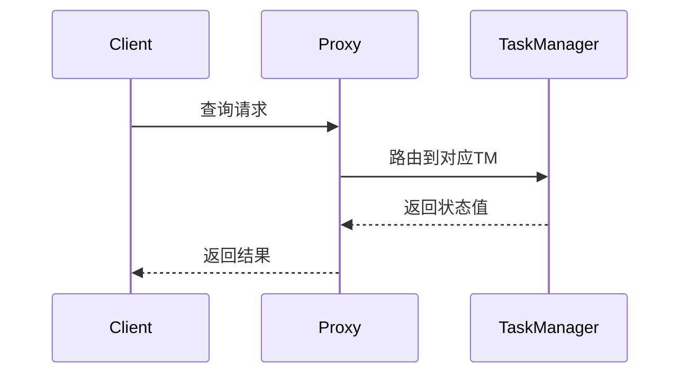

# 查询状态API 演进 特性跟踪

> 所属阶段: Flink/api-evolution | 前置依赖: [Queryable State][^1] | 形式化等级: L3

## 1. 概念定义 (Definitions)

### Def-F-Query-01: Queryable State

可查询状态：
$$
\text{Queryable} : \text{State} \times \text{Query} \to \text{Result}
$$

### Def-F-Query-02: State Query Client

状态查询客户端：
$$
\text{Client} : \text{JobID} \times \text{Key} \to \text{StateValue}
$$

## 2. 属性推导 (Properties)

### Prop-F-Query-01: Query Consistency

查询一致性：
$$
\text{Query}(\text{State}_t) = \text{Value}_t \pm \Delta
$$

## 3. 关系建立 (Relations)

### 查询API演进

| 版本 | 特性 | 状态 |
|------|------|------|
| 2.3 | 基础查询 | GA |
| 2.4 | SQL查询 | GA |
| 2.5 | 物化视图 | GA |
| 3.0 | 全局查询 | 设计中 |

## 4. 论证过程 (Argumentation)

### 4.1 查询模式

| 模式 | 描述 |
|------|------|
| 点查询 | 单key查询 |
| 范围查询 | key范围 |
| SQL查询 | SQL接口 |

## 5. 形式证明 / 工程论证

### 5.1 状态查询

```java
QueryableStateStream<String, Integer> queryable = keyedStream
    .asQueryableState("queryable-state-name");

// 客户端查询
QueryableStateClient client = new QueryableStateClient(tmHostname, proxyPort);
CompletableFuture<Integer> result = client.getKvState(
    jobId, "queryable-state-name", key, Types.STRING, Types.INT
);
```

## 6. 实例验证 (Examples)

### 6.1 SQL查询状态

```sql
-- 创建可查询状态表
CREATE TABLE queryable_counts (
    key STRING PRIMARY KEY NOT NULL,
    count INT
) WITH (
    'connector' = 'queryable-state',
    'state-name' = 'word-counts'
);

-- 查询状态
SELECT * FROM queryable_counts WHERE key = 'hello';
```

## 7. 可视化 (Visualizations)



## 8. 引用参考 (References)

[^1]: Flink Queryable State Documentation

---

## 跟踪信息

| 属性 | 值 |
|------|-----|
| 版本 | 2.4-3.0 |
| 当前状态 | 演进中 |
